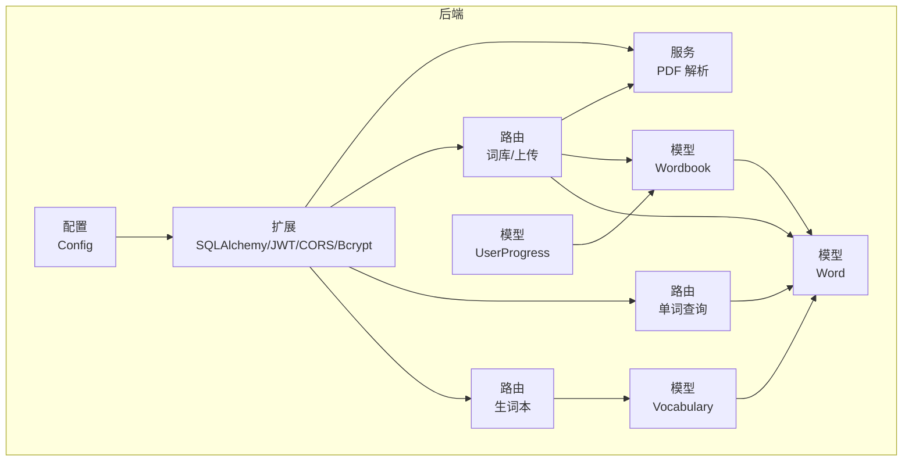
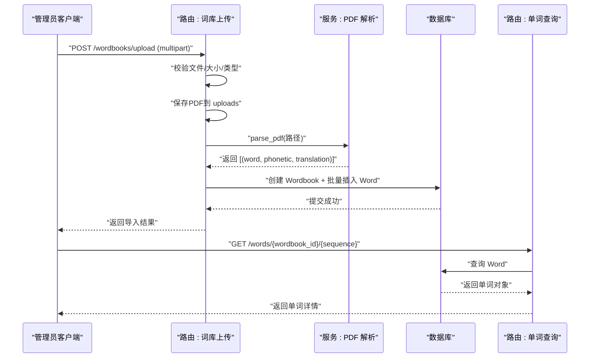
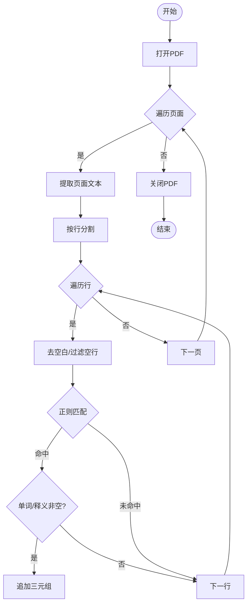
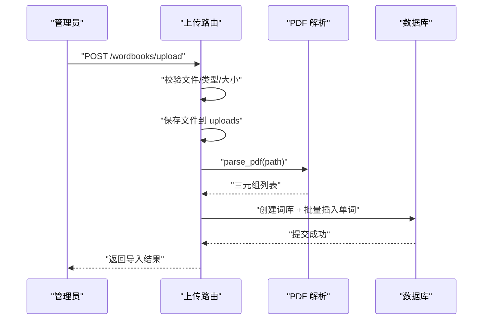
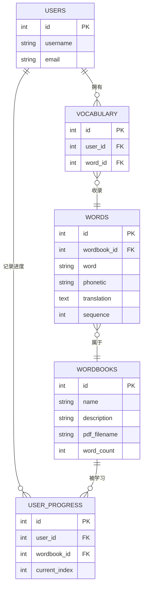
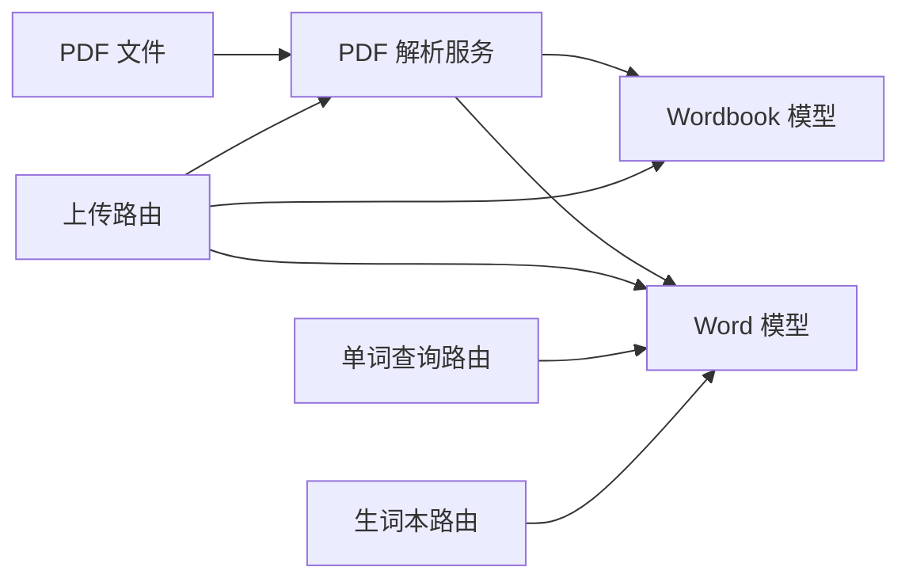

# PDF 解析服务

<cite>
**本文引用的文件**
- [backend/app/services/pdf_parser.py](file://backend/app/services/pdf_parser.py)
- [backend/app/routes/wordbooks.py](file://backend/app/routes/wordbooks.py)
- [backend/app/models/wordbook.py](file://backend/app/models/wordbook.py)
- [backend/app/models/word.py](file://backend/app/models/word.py)
- [backend/app/models/vocabulary.py](file://backend/app/models/vocabulary.py)
- [backend/app/models/user_progress.py](file://backend/app/models/user_progress.py)
- [backend/app/routers/words.py](file://backend/app/routes/words.py)
- [backend/app/routers/vocabulary.py](file://backend/app/routes/vocabulary.py)
- [backend/app/config.py](file://backend/app/config.py)
- [backend/app/extensions.py](file://backend/app/extensions.py)
- [backend/wsgi.py](file://backend/wsgi.py)
- [README_CN.md](file://README_CN.md)
</cite>

## 目录
1. [简介](#简介)
2. [项目结构](#项目结构)
3. [核心组件](#核心组件)
4. [架构总览](#架构总览)
5. [详细组件分析](#详细组件分析)
6. [依赖关系分析](#依赖关系分析)
7. [性能考虑](#性能考虑)
8. [故障排查指南](#故障排查指南)
9. [结论](#结论)
10. [附录](#附录)

## 简介
本文件面向“PDF 解析服务”的技术实现与使用方法，聚焦于自动提取中英对照单词数据的能力。内容涵盖：
- 文本解析算法原理：文本提取、格式识别与结构分析
- 中英对照格式识别机制：单词、音标、释义的提取规则
- 文件上传处理流程、安全检查与错误处理
- 批量导入实现：并发处理、进度监控与异常恢复
- 支持的 PDF 格式、字符编码与特殊符号处理
- 解析质量评估、准确性优化与性能调优建议
- 常见问题排查：解析失败、格式不兼容等

## 项目结构
后端采用 Flask 架构，核心围绕 PDF 解析服务与词库模型展开：
- 服务层：PDF 解析服务负责从 PDF 中抽取单词三元组
- 路由层：提供上传、解析、入库、查询等接口
- 模型层：定义词库、单词、生词本、用户进度等数据模型
- 配置与扩展：数据库、JWT、CORS、文件上传大小限制等

图表来源
- [backend/app/config.py](file://backend/app/config.py#L1-L28)
- [backend/app/extensions.py](file://backend/app/extensions.py#L1-L10)
- [backend/app/services/pdf_parser.py](file://backend/app/services/pdf_parser.py#L1-L43)
- [backend/app/routes/wordbooks.py](file://backend/app/routes/wordbooks.py#L1-L159)
- [backend/app/routes/words.py](file://backend/app/routes/words.py#L1-L65)
- [backend/app/routes/vocabulary.py](file://backend/app/routes/vocabulary.py#L1-L103)
- [backend/app/models/wordbook.py](file://backend/app/models/wordbook.py#L1-L25)
- [backend/app/models/word.py](file://backend/app/models/word.py#L1-L29)
- [backend/app/models/vocabulary.py](file://backend/app/models/vocabulary.py#L1-L26)
- [backend/app/models/user_progress.py](file://backend/app/models/user_progress.py#L1-L29)

章节来源
- [backend/app/config.py](file://backend/app/config.py#L1-L28)
- [backend/app/extensions.py](file://backend/app/extensions.py#L1-L10)
- [README_CN.md](file://README_CN.md#L1-L84)

## 核心组件
- PDF 解析服务：基于 pdfplumber 提取文本，使用正则匹配“英文单词 [音标] 中文释义”格式，输出三元组列表
- 上传与导入路由：管理员鉴权，校验文件类型与大小，保存 PDF，调用解析服务，批量写入数据库
- 数据模型：词库、单词、生词本、用户进度，支撑查询、分页与关联关系
- 查询与生词本路由：提供单词按序号查询、批量查询、生词本增删改查

章节来源
- [backend/app/services/pdf_parser.py](file://backend/app/services/pdf_parser.py#L1-L43)
- [backend/app/routes/wordbooks.py](file://backend/app/routes/wordbooks.py#L68-L136)
- [backend/app/models/wordbook.py](file://backend/app/models/wordbook.py#L1-L25)
- [backend/app/models/word.py](file://backend/app/models/word.py#L1-L29)
- [backend/app/models/vocabulary.py](file://backend/app/models/vocabulary.py#L1-L26)
- [backend/app/models/user_progress.py](file://backend/app/models/user_progress.py#L1-L29)
- [backend/app/routes/words.py](file://backend/app/routes/words.py#L1-L65)
- [backend/app/routes/vocabulary.py](file://backend/app/routes/vocabulary.py#L1-L103)

## 架构总览
下图展示从文件上传到入库与查询的关键交互：

图表来源
- [backend/app/routes/wordbooks.py](file://backend/app/routes/wordbooks.py#L68-L136)
- [backend/app/services/pdf_parser.py](file://backend/app/services/pdf_parser.py#L4-L42)
- [backend/app/models/wordbook.py](file://backend/app/models/wordbook.py#L4-L15)
- [backend/app/models/word.py](file://backend/app/models/word.py#L4-L18)
- [backend/app/routes/words.py](file://backend/app/routes/words.py#L10-L38)

## 详细组件分析

### 组件一：PDF 解析服务
- 功能定位：从 PDF 页面文本中提取符合“英文单词 [音标] 中文释义”的三元组
- 算法要点
  - 使用 pdfplumber 打开 PDF 并逐页提取文本
  - 对每行进行清洗与过滤，空行跳过
  - 使用正则表达式匹配“单词 + 音标 + 释义”，支持多词短语与连字符
  - 过滤无效条目（单词与释义均非空）
- 错误处理：捕获异常并抛出统一错误消息
- 复杂度与性能
  - 时间复杂度近似 O(P + L)，P 为页数，L 为每页行数
  - 空间复杂度 O(N)，N 为有效三元组数量
- 可优化点
  - 行级正则匹配可改为段落级规则以提升鲁棒性
  - 对于复杂表格/列布局，可结合坐标与字体信息增强定位

图表来源
- [backend/app/services/pdf_parser.py](file://backend/app/services/pdf_parser.py#L4-L42)

章节来源
- [backend/app/services/pdf_parser.py](file://backend/app/services/pdf_parser.py#L1-L43)

### 组件二：文件上传与批量导入
- 流程概览
  - 管理员鉴权后接收 PDF 文件与词库元信息
  - 校验文件名、类型与大小，安全命名后保存至 uploads 目录
  - 调用解析服务获取三元组，创建词库并批量插入单词
  - 异常时回滚事务并清理上传文件
- 安全与合规
  - 仅允许 PDF 类型
  - 使用安全文件名策略
  - 上传大小上限控制
- 并发与进度
  - 当前实现为同步导入；可扩展为队列异步 + 进度回调
- 异常恢复
  - 解析失败、入库失败均回滚并清理临时文件

图表来源
- [backend/app/routes/wordbooks.py](file://backend/app/routes/wordbooks.py#L68-L136)
- [backend/app/services/pdf_parser.py](file://backend/app/services/pdf_parser.py#L4-L42)

章节来源
- [backend/app/routes/wordbooks.py](file://backend/app/routes/wordbooks.py#L68-L136)
- [backend/app/config.py](file://backend/app/config.py#L25-L28)

### 组件三：数据模型与查询
- 模型关系
  - Wordbook 与 Word 一对多
  - Vocabulary 关联 User 与 Word，实现用户生词本
  - UserProgress 记录用户在某词库的学习进度
- 查询能力
  - 单词按序号查询与生词本关联判断
  - 批量分页查询用于前端预加载
  - 生词本增删改查与分页

图表来源
- [backend/app/models/user.py](file://backend/app/models/user.py#L4-L16)
- [backend/app/models/wordbook.py](file://backend/app/models/wordbook.py#L4-L15)
- [backend/app/models/word.py](file://backend/app/models/word.py#L4-L18)
- [backend/app/models/vocabulary.py](file://backend/app/models/vocabulary.py#L4-L16)
- [backend/app/models/user_progress.py](file://backend/app/models/user_progress.py#L4-L17)

章节来源
- [backend/app/models/wordbook.py](file://backend/app/models/wordbook.py#L1-L25)
- [backend/app/models/word.py](file://backend/app/models/word.py#L1-L29)
- [backend/app/models/vocabulary.py](file://backend/app/models/vocabulary.py#L1-L26)
- [backend/app/models/user_progress.py](file://backend/app/models/user_progress.py#L1-L29)
- [backend/app/routes/words.py](file://backend/app/routes/words.py#L10-L64)
- [backend/app/routes/vocabulary.py](file://backend/app/routes/vocabulary.py#L10-L102)

## 依赖关系分析
- 组件耦合
  - 上传路由依赖解析服务与数据库模型
  - 查询路由依赖模型层与鉴权中间件
- 外部依赖
  - pdfplumber：PDF 文本提取
  - pdf 文件：需满足解析器可读性
- 潜在风险
  - 解析器对字体嵌入、加密、扫描版 PDF 的兼容性有限
  - 正则规则对格式宽松度敏感，需持续优化

图表来源
- [backend/app/services/pdf_parser.py](file://backend/app/services/pdf_parser.py#L1-L43)
- [backend/app/routes/wordbooks.py](file://backend/app/routes/wordbooks.py#L10-L10)
- [backend/app/models/wordbook.py](file://backend/app/models/wordbook.py#L1-L25)
- [backend/app/models/word.py](file://backend/app/models/word.py#L1-L29)
- [backend/app/routes/words.py](file://backend/app/routes/words.py#L10-L38)
- [backend/app/routes/vocabulary.py](file://backend/app/routes/vocabulary.py#L1-L103)

章节来源
- [backend/app/services/pdf_parser.py](file://backend/app/services/pdf_parser.py#L1-L43)
- [backend/app/routes/wordbooks.py](file://backend/app/routes/wordbooks.py#L1-L159)

## 性能考虑
- 解析阶段
  - 将正则匹配与字符串清洗合并，减少重复处理
  - 对大文档可按页并行解析（注意线程安全与内存占用）
- 数据库阶段
  - 批量插入使用 flush + 批量 add，避免逐条提交
  - 为 sequence、wordbook_id 建立索引以加速查询
- 前端交互
  - 批量分页查询（words.batch）降低单次请求压力
- 字符编码与特殊符号
  - 数据库使用 utf8mb4，可覆盖四字节字符
  - 解析前对文本做基础清洗，避免不可见字符干扰

章节来源
- [backend/app/routes/wordbooks.py](file://backend/app/routes/wordbooks.py#L111-L121)
- [backend/app/models/word.py](file://backend/app/models/word.py#L15-L18)
- [backend/app/config.py](file://backend/app/config.py#L14-L18)
- [backend/app/routes/words.py](file://backend/app/routes/words.py#L41-L64)

## 故障排查指南
- PDF 解析失败
  - 确认 PDF 为可读文本型（非扫描版），或确保字体正确嵌入
  - 检查目标格式是否为“英文单词 [音标] 中文释义”
  - 查看后端日志中的异常堆栈
- 未找到有效单词数据
  - 检查 PDF 是否为空页或无目标格式行
  - 确保上传文件后端仍可访问
- 文件上传失败
  - 检查文件类型是否为 PDF
  - 确认文件大小未超过限制
  - 检查 uploads 目录权限与磁盘空间
- 数据库连接问题
  - 校验环境变量与数据库服务状态
  - 确认数据库字符集为 utf8mb4
- 权限不足
  - 上传与删除词库需管理员权限
- 生词本操作异常
  - 确认用户已登录并持有正确 JWT
  - 检查唯一约束冲突（同一用户重复添加）

章节来源
- [backend/app/routes/wordbooks.py](file://backend/app/routes/wordbooks.py#L72-L86)
- [backend/app/routes/wordbooks.py](file://backend/app/routes/wordbooks.py#L131-L135)
- [backend/app/config.py](file://backend/app/config.py#L25-L28)
- [backend/app/models/word.py](file://backend/app/models/word.py#L15-L18)
- [backend/app/routes/vocabulary.py](file://backend/app/routes/vocabulary.py#L44-L70)

## 结论
本服务以简洁稳定的流程实现了“PDF 到单词库”的自动化导入：通过 pdfplumber 与正则规则提取三元组，结合批量入库与完善的错误处理，满足中英对照类 PDF 的高频导入需求。后续可在解析健壮性、并发导入与进度可视化方面进一步增强。

## 附录
- 支持的 PDF 格式
  - 文本型 PDF，建议字体嵌入良好
  - 推荐格式：英文单词 [音标] 中文释义
- 字符编码
  - 数据库存储使用 utf8mb4
- 特殊符号处理
  - 解析前进行空白与换行清洗
  - 正则规则支持连字符与短语组合
- 使用示例（路径参考）
  - 上传接口：POST /wordbooks/upload
  - 单词详情：GET /words/{wordbook_id}/{sequence}
  - 批量查询：GET /words/batch/{wordbook_id}?start=&limit=
  - 生词本：GET/POST/DELETE /vocabulary

章节来源
- [backend/app/routes/wordbooks.py](file://backend/app/routes/wordbooks.py#L68-L136)
- [backend/app/routes/words.py](file://backend/app/routes/words.py#L10-L64)
- [backend/app/routes/vocabulary.py](file://backend/app/routes/vocabulary.py#L10-L102)
- [README_CN.md](file://README_CN.md#L73-L76)