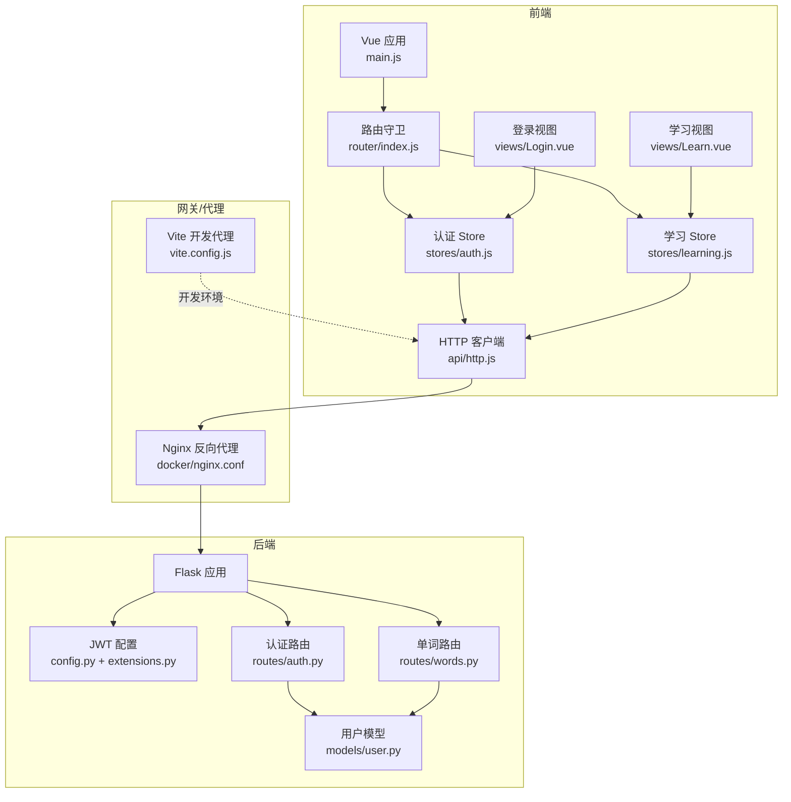
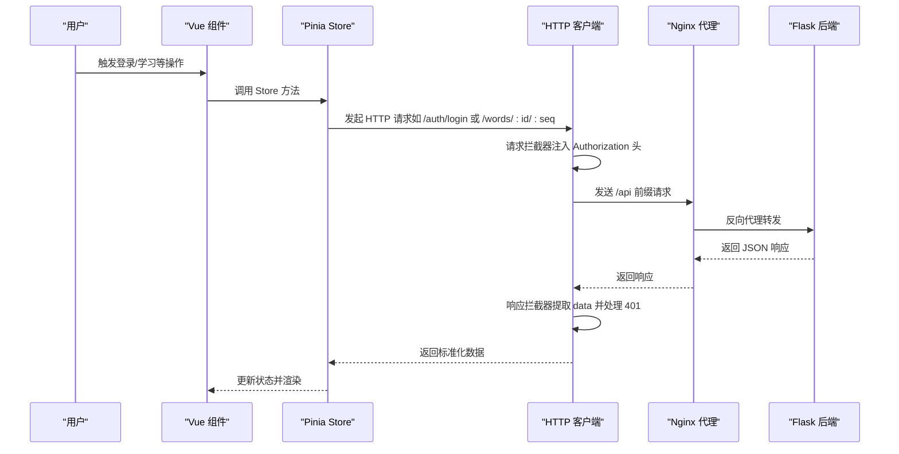
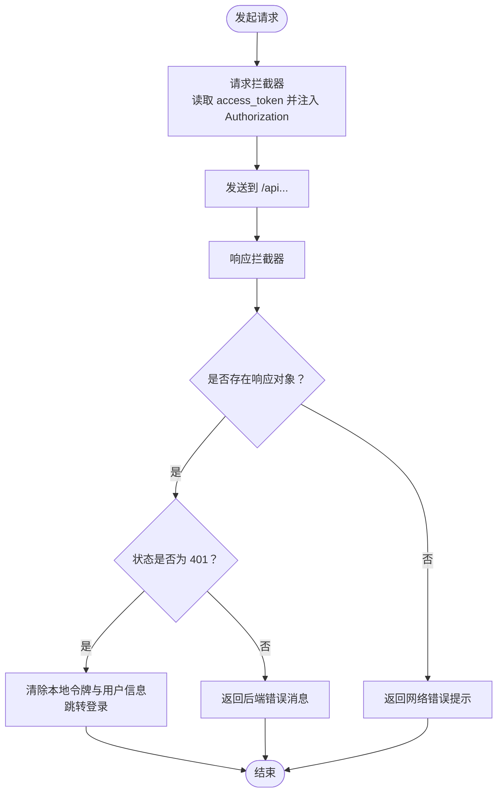
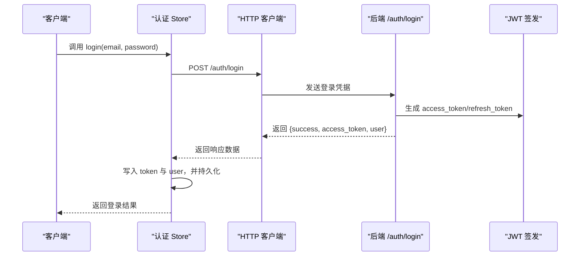
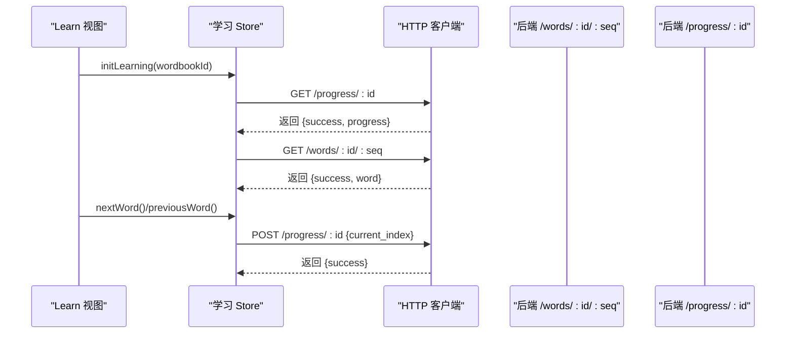
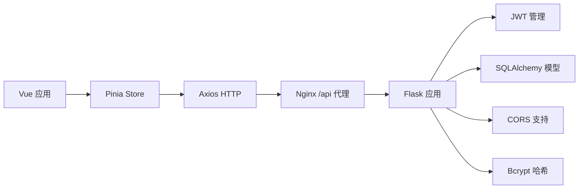

# API 集成

<cite>
**本文引用的文件**
- [frontend/src/api/http.js](file://frontend/src/api/http.js)
- [frontend/src/stores/auth.js](file://frontend/src/stores/auth.js)
- [frontend/src/stores/learning.js](file://frontend/src/stores/learning.js)
- [frontend/src/router/index.js](file://frontend/src/router/index.js)
- [frontend/src/views/Login.vue](file://frontend/src/views/Login.vue)
- [frontend/src/views/Learn.vue](file://frontend/src/views/Learn.vue)
- [frontend/src/main.js](file://frontend/src/main.js)
- [backend/app/routes/auth.py](file://backend/app/routes/auth.py)
- [backend/app/routes/words.py](file://backend/app/routes/words.py)
- [backend/app/models/user.py](file://backend/app/models/user.py)
- [backend/app/config.py](file://backend/app/config.py)
- [backend/app/extensions.py](file://backend/app/extensions.py)
- [docker/nginx.conf](file://docker/nginx.conf)
- [frontend/vite.config.js](file://frontend/vite.config.js)
</cite>

## 目录
1. [简介](#简介)
2. [项目结构](#项目结构)
3. [核心组件](#核心组件)
4. [架构总览](#架构总览)
5. [组件详解](#组件详解)
6. [依赖关系分析](#依赖关系分析)
7. [性能与优化](#性能与优化)
8. [故障排查指南](#故障排查指南)
9. [结论](#结论)
10. [附录：最佳实践与示例路径](#附录最佳实践与示例路径)

## 简介
本文件面向前端与后端 RESTful API 的集成，系统性阐述以下主题：
- HTTP 客户端封装与拦截器（请求头注入、统一响应数据提取、401 自动登出）
- 错误处理、重试机制与超时控制现状与建议
- 认证令牌的自动添加、刷新与失效处理
- API 调用最佳实践、缓存策略与性能优化
- 与后端接口的对接流程与数据格式约定
- 提供可直接定位到源码的调用示例路径

## 项目结构
前端通过 Axios 封装统一 HTTP 客户端，配合 Pinia Store 管理认证状态，Vue Router 实现鉴权路由守卫；后端基于 Flask，使用 JWT 管理认证，蓝图组织路由。

图表来源
- [frontend/src/main.js](file://frontend/src/main.js#L1-L13)
- [frontend/src/router/index.js](file://frontend/src/router/index.js#L1-L64)
- [frontend/src/stores/auth.js](file://frontend/src/stores/auth.js#L1-L59)
- [frontend/src/stores/learning.js](file://frontend/src/stores/learning.js#L1-L112)
- [frontend/src/api/http.js](file://frontend/src/api/http.js#L1-L48)
- [frontend/src/views/Login.vue](file://frontend/src/views/Login.vue#L1-L116)
- [frontend/src/views/Learn.vue](file://frontend/src/views/Learn.vue#L1-L342)
- [backend/app/routes/auth.py](file://backend/app/routes/auth.py#L1-L93)
- [backend/app/routes/words.py](file://backend/app/routes/words.py#L1-L65)
- [backend/app/config.py](file://backend/app/config.py#L1-L28)
- [backend/app/extensions.py](file://backend/app/extensions.py#L1-L10)
- [docker/nginx.conf](file://docker/nginx.conf#L1-L34)
- [frontend/vite.config.js](file://frontend/vite.config.js#L1-L15)

章节来源
- [frontend/src/main.js](file://frontend/src/main.js#L1-L13)
- [frontend/src/router/index.js](file://frontend/src/router/index.js#L1-L64)
- [frontend/src/api/http.js](file://frontend/src/api/http.js#L1-L48)
- [frontend/src/stores/auth.js](file://frontend/src/stores/auth.js#L1-L59)
- [frontend/src/stores/learning.js](file://frontend/src/stores/learning.js#L1-L112)
- [backend/app/routes/auth.py](file://backend/app/routes/auth.py#L1-L93)
- [backend/app/routes/words.py](file://backend/app/routes/words.py#L1-L65)
- [backend/app/config.py](file://backend/app/config.py#L1-L28)
- [backend/app/extensions.py](file://backend/app/extensions.py#L1-L10)
- [docker/nginx.conf](file://docker/nginx.conf#L1-L34)
- [frontend/vite.config.js](file://frontend/vite.config.js#L1-L15)

## 核心组件
- HTTP 客户端封装与拦截器
  - 统一基础地址、超时、内容类型
  - 请求拦截器：从本地存储读取访问令牌并注入 Authorization 头
  - 响应拦截器：统一提取响应数据；处理 401 清除本地状态并跳转登录
- 认证 Store（Pinia）
  - 登录/注册/退出；持久化访问令牌与用户信息
  - 鉴权状态计算属性（是否登录、是否管理员）
- 学习 Store（Pinia）
  - 获取学习进度、获取单词、更新进度、加入/移出生词本等 API 调用
- 路由守卫
  - 基于本地存储判断访问令牌与用户角色，控制页面访问权限
- 后端路由与模型
  - 认证：注册、登录、刷新、当前用户
  - 单词：按序号获取单词、批量获取单词
  - 用户模型：序列化为字典

章节来源
- [frontend/src/api/http.js](file://frontend/src/api/http.js#L1-L48)
- [frontend/src/stores/auth.js](file://frontend/src/stores/auth.js#L1-L59)
- [frontend/src/stores/learning.js](file://frontend/src/stores/learning.js#L1-L112)
- [frontend/src/router/index.js](file://frontend/src/router/index.js#L1-L64)
- [backend/app/routes/auth.py](file://backend/app/routes/auth.py#L1-L93)
- [backend/app/routes/words.py](file://backend/app/routes/words.py#L1-L65)
- [backend/app/models/user.py](file://backend/app/models/user.py#L1-L26)

## 架构总览
前后端通过 Nginx 反向代理转发 /api 请求至 Flask 后端；开发阶段通过 Vite 代理将 /api 映射到后端服务。HTTP 客户端负责统一注入令牌与错误处理，Store 负责业务状态与持久化。

图表来源
- [frontend/src/api/http.js](file://frontend/src/api/http.js#L1-L48)
- [frontend/src/stores/auth.js](file://frontend/src/stores/auth.js#L1-L59)
- [frontend/src/stores/learning.js](file://frontend/src/stores/learning.js#L1-L112)
- [docker/nginx.conf](file://docker/nginx.conf#L13-L27)
- [backend/app/routes/auth.py](file://backend/app/routes/auth.py#L46-L72)
- [backend/app/routes/words.py](file://backend/app/routes/words.py#L10-L38)

## 组件详解

### HTTP 客户端与拦截器
- 基础配置
  - 基础路径：/api
  - 超时：30 秒
  - Content-Type：application/json
- 请求拦截器
  - 从 localStorage 读取访问令牌，若存在则在请求头 Authorization 中附加 Bearer 令牌
- 响应拦截器
  - 成功：返回 response.data
  - 失败：若存在响应对象且状态为 401，则清除本地令牌与用户信息并跳转登录；否则返回统一错误对象

图表来源
- [frontend/src/api/http.js](file://frontend/src/api/http.js#L3-L9)
- [frontend/src/api/http.js](file://frontend/src/api/http.js#L11-L23)
- [frontend/src/api/http.js](file://frontend/src/api/http.js#L25-L45)

章节来源
- [frontend/src/api/http.js](file://frontend/src/api/http.js#L1-L48)

### 认证流程与令牌管理
- 登录
  - 前端调用 /auth/login，接收 success/access_token/user
  - Store 写入令牌与用户信息，并持久化到 localStorage
- 刷新
  - 后端提供 /auth/refresh 接口，需携带 refresh_token
  - 当前前端未实现刷新逻辑，建议在响应拦截器 401 时触发刷新并重试
- 退出
  - 清空 Store 与 localStorage 中的令牌与用户信息

图表来源
- [frontend/src/stores/auth.js](file://frontend/src/stores/auth.js#L22-L34)
- [backend/app/routes/auth.py](file://backend/app/routes/auth.py#L46-L72)

章节来源
- [frontend/src/stores/auth.js](file://frontend/src/stores/auth.js#L1-L59)
- [backend/app/routes/auth.py](file://backend/app/routes/auth.py#L1-L93)

### 鉴权路由守卫
- 在路由守卫中读取本地存储的 access_token 与用户信息
- requiresAuth：未登录跳转登录页
- guest：已登录禁止访问登录/注册
- requiresAdmin：非管理员禁止访问后台

章节来源
- [frontend/src/router/index.js](file://frontend/src/router/index.js#L48-L61)

### 学习流程与 API 调用
- 初始化学习：先获取进度，再获取当前单词
- 切换单词：上一个/下一个，同时更新进度
- 生词本：加入/移出，实时更新单词标记

图表来源
- [frontend/src/views/Learn.vue](file://frontend/src/views/Learn.vue#L136-L146)
- [frontend/src/stores/learning.js](file://frontend/src/stores/learning.js#L16-L50)
- [backend/app/routes/words.py](file://backend/app/routes/words.py#L10-L38)

章节来源
- [frontend/src/views/Learn.vue](file://frontend/src/views/Learn.vue#L1-L342)
- [frontend/src/stores/learning.js](file://frontend/src/stores/learning.js#L1-L112)
- [backend/app/routes/words.py](file://backend/app/routes/words.py#L1-L65)

### 登录页面与错误处理
- 登录表单提交后，调用认证 Store 的 login 方法
- 捕获异常并显示错误消息
- 登录成功后跳转首页

章节来源
- [frontend/src/views/Login.vue](file://frontend/src/views/Login.vue#L57-L71)
- [frontend/src/stores/auth.js](file://frontend/src/stores/auth.js#L22-L34)

## 依赖关系分析
- 前端依赖
  - Vue 应用初始化与插件注册
  - Pinia 状态管理
  - Vue Router 路由守卫
  - Axios HTTP 客户端
- 后端依赖
  - Flask 蓝图组织路由
  - SQLAlchemy 模型与数据库
  - Flask-JWT-Extended 管理令牌
  - Flask-CORS 支持跨域
  - Flask-Bcrypt 密码哈希

图表来源
- [frontend/src/main.js](file://frontend/src/main.js#L1-L13)
- [frontend/src/api/http.js](file://frontend/src/api/http.js#L1-L1)
- [backend/app/extensions.py](file://backend/app/extensions.py#L1-L10)
- [docker/nginx.conf](file://docker/nginx.conf#L13-L27)

章节来源
- [frontend/src/main.js](file://frontend/src/main.js#L1-L13)
- [backend/app/extensions.py](file://backend/app/extensions.py#L1-L10)

## 性能与优化
- 代理与缓存
  - Nginx 对静态资源设置长期缓存与 immutable 标记，减少带宽消耗
  - /api 路由代理到后端，避免跨域与中间层延迟
- 前端缓存策略
  - Store 层缓存当前单词与进度，避免重复请求
  - 批量获取接口支持分页参数，降低单次负载
- 超时与重试
  - 当前 HTTP 客户端设置了统一超时，未实现自动重试
  - 建议在响应拦截器中对 5xx 或网络错误进行指数退避重试
- 传输优化
  - 统一 JSON 内容类型，减少不必要的编码转换
  - 后端批量接口支持分页，前端按需加载

章节来源
- [docker/nginx.conf](file://docker/nginx.conf#L29-L33)
- [frontend/src/api/http.js](file://frontend/src/api/http.js#L3-L9)
- [frontend/src/stores/learning.js](file://frontend/src/stores/learning.js#L40-L50)
- [backend/app/routes/words.py](file://backend/app/routes/words.py#L41-L64)

## 故障排查指南
- 401 未授权
  - 现象：自动清除本地令牌与用户信息并跳转登录
  - 原因：令牌过期或无效
  - 建议：实现刷新令牌后再重试请求
- 网络错误
  - 现象：统一返回“网络错误，请稍后重试”
  - 建议：结合超时与重试策略提升稳定性
- 路由无法访问
  - 现象：未登录被重定向至登录页
  - 原因：路由元信息 requiresAuth 且本地无令牌
  - 建议：确保登录后正确写入 localStorage

章节来源
- [frontend/src/api/http.js](file://frontend/src/api/http.js#L30-L44)
- [frontend/src/router/index.js](file://frontend/src/router/index.js#L52-L59)

## 结论
该系统采用清晰的前后端分离架构：前端以 Axios 封装统一 HTTP 客户端，配合 Pinia Store 管理认证与业务状态；后端以 Flask + JWT 提供 RESTful 接口。当前实现具备基本的令牌注入与 401 自动登出能力，建议后续补充刷新令牌与自动重试机制，进一步完善错误恢复与性能优化。

## 附录：最佳实践与示例路径
- 最佳实践
  - 在响应拦截器中实现 5xx 与网络错误的指数退避重试
  - 在请求拦截器中增加请求 ID 与时间戳，便于日志追踪
  - Store 中对高频接口增加内存缓存与去抖
  - 对大列表接口使用分页参数，避免一次性拉取过多数据
- 示例路径
  - HTTP 客户端封装与拦截器：[frontend/src/api/http.js](file://frontend/src/api/http.js#L1-L48)
  - 认证 Store 登录/退出：[frontend/src/stores/auth.js](file://frontend/src/stores/auth.js#L22-L46)
  - 学习 Store 获取单词与更新进度：[frontend/src/stores/learning.js](file://frontend/src/stores/learning.js#L16-L50)
  - 路由守卫鉴权：[frontend/src/router/index.js](file://frontend/src/router/index.js#L48-L61)
  - 登录视图调用认证 Store：[frontend/src/views/Login.vue](file://frontend/src/views/Login.vue#L57-L71)
  - 学习视图与 Store 交互：[frontend/src/views/Learn.vue](file://frontend/src/views/Learn.vue#L136-L146)
  - 后端认证接口（登录/注册/刷新/当前用户）：[backend/app/routes/auth.py](file://backend/app/routes/auth.py#L46-L92)
  - 后端单词接口（单个/批量）：[backend/app/routes/words.py](file://backend/app/routes/words.py#L10-L64)
  - JWT 配置与过期时间：[backend/app/config.py](file://backend/app/config.py#L20-L23)
  - Nginx 反向代理与静态资源缓存：[docker/nginx.conf](file://docker/nginx.conf#L13-L33)
  - Vite 开发代理（/api）：[frontend/vite.config.js](file://frontend/vite.config.js#L8-L13)