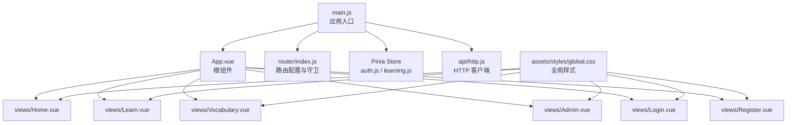
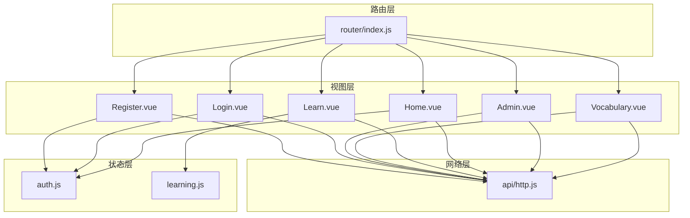
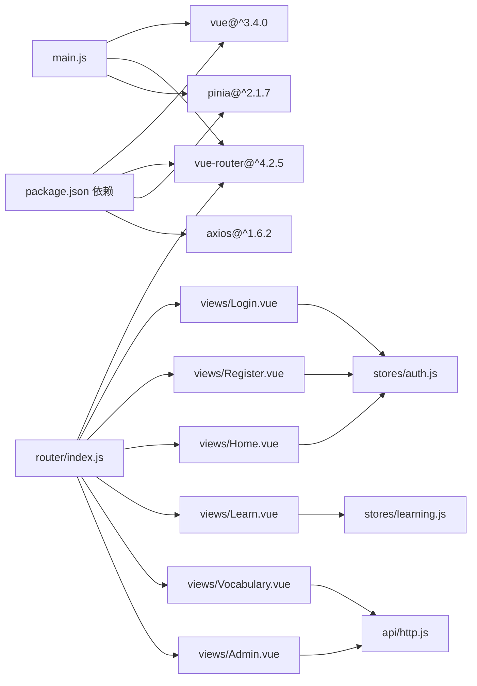
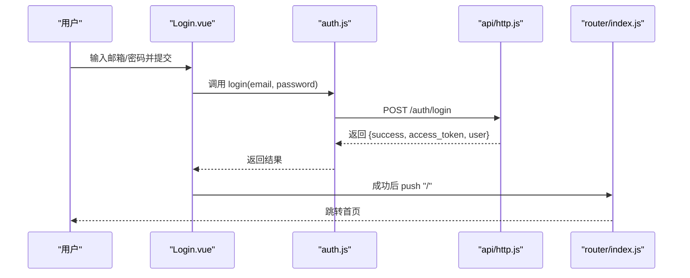
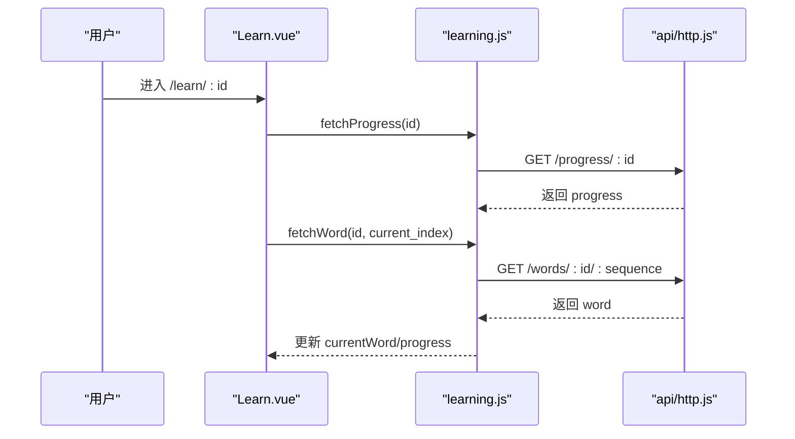
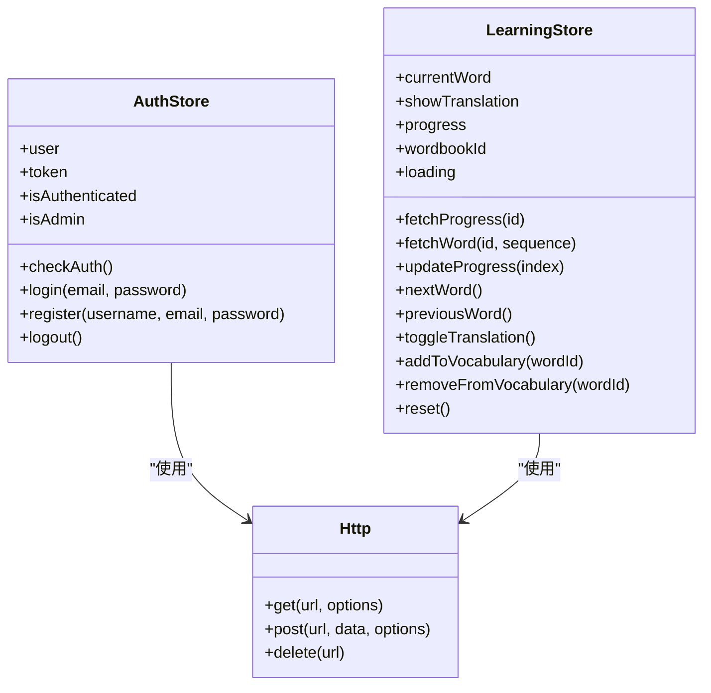

# 前端组件

<cite>
**本文引用的文件**
- [frontend/src/App.vue](file://frontend/src/App.vue)
- [frontend/src/main.js](file://frontend/src/main.js)
- [frontend/src/router/index.js](file://frontend/src/router/index.js)
- [frontend/src/views/Home.vue](file://frontend/src/views/Home.vue)
- [frontend/src/views/Learn.vue](file://frontend/src/views/Learn.vue)
- [frontend/src/views/Vocabulary.vue](file://frontend/src/views/Vocabulary.vue)
- [frontend/src/views/Admin.vue](file://frontend/src/views/Admin.vue)
- [frontend/src/views/Login.vue](file://frontend/src/views/Login.vue)
- [frontend/src/views/Register.vue](file://frontend/src/views/Register.vue)
- [frontend/src/stores/auth.js](file://frontend/src/stores/auth.js)
- [frontend/src/stores/learning.js](file://frontend/src/stores/learning.js)
- [frontend/src/api/http.js](file://frontend/src/api/http.js)
- [frontend/src/assets/styles/global.css](file://frontend/src/assets/styles/global.css)
- [frontend/package.json](file://frontend/package.json)
- [frontend/vite.config.js](file://frontend/vite.config.js)
</cite>

## 目录
1. [简介](#简介)
2. [项目结构](#项目结构)
3. [核心组件](#核心组件)
4. [架构总览](#架构总览)
5. [组件详解](#组件详解)
6. [依赖关系分析](#依赖关系分析)
7. [性能与优化](#性能与优化)
8. [故障排查指南](#故障排查指南)
9. [结论](#结论)
10. [附录](#附录)

## 简介
本文件系统化梳理单词学习网站的前端组件体系，覆盖 Vue 3 + Pinia + Vue Router 的完整实现。重点说明首页（Home）、学习页面（Learn）、生词本页面（Vocabulary）、管理员页面（Admin）等页面组件的功能、属性、事件与使用方式；解释组件生命周期、状态管理与数据流；阐述组件间通信机制（路由参数、全局状态、HTTP 服务）；并提供响应式设计、可访问性与跨浏览器兼容性建议，以及性能优化与调试技巧。

## 项目结构
前端采用 Vite 构建，使用 Vue 3 单文件组件（SFC），通过 Pinia 管理全局状态，通过 Vue Router 实现页面级路由与守卫，通过 Axios 封装统一的 HTTP 客户端。

图表来源
- [frontend/src/main.js](file://frontend/src/main.js#L1-L13)
- [frontend/src/App.vue](file://frontend/src/App.vue#L1-L17)
- [frontend/src/router/index.js](file://frontend/src/router/index.js#L1-L64)
- [frontend/src/stores/auth.js](file://frontend/src/stores/auth.js#L1-L59)
- [frontend/src/stores/learning.js](file://frontend/src/stores/learning.js#L1-L112)
- [frontend/src/api/http.js](file://frontend/src/api/http.js#L1-L48)
- [frontend/src/views/Home.vue](file://frontend/src/views/Home.vue#L1-L189)
- [frontend/src/views/Learn.vue](file://frontend/src/views/Learn.vue#L1-L342)
- [frontend/src/views/Vocabulary.vue](file://frontend/src/views/Vocabulary.vue#L1-L207)
- [frontend/src/views/Admin.vue](file://frontend/src/views/Admin.vue#L1-L264)
- [frontend/src/views/Login.vue](file://frontend/src/views/Login.vue#L1-L116)
- [frontend/src/views/Register.vue](file://frontend/src/views/Register.vue#L1-L151)
- [frontend/src/assets/styles/global.css](file://frontend/src/assets/styles/global.css#L1-L176)

章节来源
- [frontend/src/main.js](file://frontend/src/main.js#L1-L13)
- [frontend/src/App.vue](file://frontend/src/App.vue#L1-L17)
- [frontend/src/router/index.js](file://frontend/src/router/index.js#L1-L64)
- [frontend/src/assets/styles/global.css](file://frontend/src/assets/styles/global.css#L1-L176)

## 核心组件
- 应用入口与挂载
  - 创建应用实例，安装路由与状态管理插件，挂载到 DOM。
- 根组件
  - 渲染路由视图容器，应用启动时检查本地认证状态。
- 路由系统
  - 定义页面路由与元信息（是否需要登录、是否仅访客可用、是否管理员），并在导航前执行守卫逻辑。
- 全局状态
  - 认证状态（用户、令牌、管理员标识、登录/注册/登出）
  - 学习状态（当前单词、显示释义、进度、单词书 ID、加载状态、增删生词本等）
- HTTP 客户端
  - 统一基地址、超时、请求头注入、响应数据透传与 401 自动清理与跳转。

章节来源
- [frontend/src/main.js](file://frontend/src/main.js#L1-L13)
- [frontend/src/App.vue](file://frontend/src/App.vue#L1-L17)
- [frontend/src/router/index.js](file://frontend/src/router/index.js#L1-L64)
- [frontend/src/stores/auth.js](file://frontend/src/stores/auth.js#L1-L59)
- [frontend/src/stores/learning.js](file://frontend/src/stores/learning.js#L1-L112)
- [frontend/src/api/http.js](file://frontend/src/api/http.js#L1-L48)

## 架构总览
下图展示页面组件与状态、路由、HTTP 的交互关系：

图表来源
- [frontend/src/router/index.js](file://frontend/src/router/index.js#L1-L64)
- [frontend/src/views/Home.vue](file://frontend/src/views/Home.vue#L1-L189)
- [frontend/src/views/Learn.vue](file://frontend/src/views/Learn.vue#L1-L342)
- [frontend/src/views/Vocabulary.vue](file://frontend/src/views/Vocabulary.vue#L1-L207)
- [frontend/src/views/Admin.vue](file://frontend/src/views/Admin.vue#L1-L264)
- [frontend/src/views/Login.vue](file://frontend/src/views/Login.vue#L1-L116)
- [frontend/src/views/Register.vue](file://frontend/src/views/Register.vue#L1-L151)
- [frontend/src/stores/auth.js](file://frontend/src/stores/auth.js#L1-L59)
- [frontend/src/stores/learning.js](file://frontend/src/stores/learning.js#L1-L112)
- [frontend/src/api/http.js](file://frontend/src/api/http.js#L1-L48)

## 组件详解

### 首页（Home.vue）
- 功能
  - 展示用户菜单（用户名、退出）、单词书网格、学习进度条与百分比。
  - 提供“开始/继续学习”按钮跳转至学习页。
  - 管理员可见“管理”入口。
- 关键属性与状态
  - 列表数据：wordbooks（数组）
  - 加载状态：loading（布尔）
  - 计算进度：getProgressPercent(book)
- 事件与交互
  - 点击“开始学习/继续学习”触发路由跳转。
  - 点击“退出”调用认证 store 登出并跳转登录页。
- 生命周期
  - 挂载时拉取单词书列表。
- 数据流
  - 通过 HTTP 客户端获取单词书列表，更新本地状态。
- 视觉与交互
  - 卡片悬停效果、渐变进度条、空态提示、管理员引导。

章节来源
- [frontend/src/views/Home.vue](file://frontend/src/views/Home.vue#L1-L189)
- [frontend/src/api/http.js](file://frontend/src/api/http.js#L1-L48)
- [frontend/src/stores/auth.js](file://frontend/src/stores/auth.js#L1-L59)

### 学习页面（Learn.vue）
- 功能
  - 显示学习进度条与当前索引/总数。
  - 单词卡片点击翻转显示释义；支持键盘快捷键（空格翻转、左右切换、S 加入/移除生词本）。
  - 上一个/下一个按钮控制进度；完成时弹出完成模态框。
  - 支持重置学习进度。
- 关键属性与状态
  - 计算属性：currentWord、showTranslation、progress
  - 加载状态：loading
  - 完成态：showComplete
- 事件与交互
  - 点击卡片翻转释义。
  - 键盘事件处理（Space、ArrowLeft、ArrowRight、KeyS）。
  - “加入/移除生词本”根据当前单词状态调用 store 方法。
  - “上一个/下一个”推进或回退进度并刷新单词。
- 生命周期
  - 挂载时读取路由参数、初始化学习、拉取进度与首词；卸载时清理 store 并移除键盘监听。
- 数据流
  - 通过学习 store 获取/更新进度与单词，通过 HTTP 客户端进行增删生词本与重置进度。
- 视觉与交互
  - 卡片翻转动画、渐变进度条、快捷键提示、完成弹窗。

章节来源
- [frontend/src/views/Learn.vue](file://frontend/src/views/Learn.vue#L1-L342)
- [frontend/src/stores/learning.js](file://frontend/src/stores/learning.js#L1-L112)
- [frontend/src/api/http.js](file://frontend/src/api/http.js#L1-L48)

### 生词本页面（Vocabulary.vue）
- 功能
  - 分页展示用户的生词本条目，显示英文、音标、释义、来自的单词书与添加时间。
  - 支持移除生词本条目。
- 关键属性与状态
  - 列表数据：vocabulary（数组）
  - 分页：page、limit、total、totalPages
  - 加载状态：loading
- 事件与交互
  - 点击“移除”发起删除请求并刷新列表。
  - 点击分页按钮切换页码并重新拉取。
- 生命周期
  - 挂载时按默认分页参数拉取列表。
- 数据流
  - 通过 HTTP 客户端获取分页数据，更新本地状态。
- 视觉与交互
  - 卡片式布局、分页控件、空态提示。

章节来源
- [frontend/src/views/Vocabulary.vue](file://frontend/src/views/Vocabulary.vue#L1-L207)
- [frontend/src/api/http.js](file://frontend/src/api/http.js#L1-L48)

### 管理员页面（Admin.vue）
- 功能
  - 上传新单词书（名称、描述、PDF 文件），并解析入库。
  - 查看已上传单词书列表，支持删除。
- 关键属性与状态
  - 表单：uploadForm（名称、描述）
  - 文件：uploadFile
  - 上传状态：uploading、uploadMessage、uploadSuccess
  - 列表：wordbooks（数组）
  - 加载状态：loadingBooks
- 事件与交互
  - 表单提交：构造 FormData，上传并刷新列表。
  - 删除单词书：二次确认后删除并刷新。
- 生命周期
  - 挂载时拉取单词书列表。
- 数据流
  - 通过 HTTP 客户端进行上传、删除与列表查询。
- 视觉与交互
  - 表单提示、表格滚动、消息提示。

章节来源
- [frontend/src/views/Admin.vue](file://frontend/src/views/Admin.vue#L1-L264)
- [frontend/src/api/http.js](file://frontend/src/api/http.js#L1-L48)

### 登录页面（Login.vue）
- 功能
  - 用户名/密码登录，登录成功后跳转首页。
- 关键属性与状态
  - 表单：email、password
  - 加载与错误：loading、error
- 事件与交互
  - 提交表单调用认证 store 执行登录。
- 生命周期
  - 无特殊生命周期钩子。
- 数据流
  - 通过认证 store 调用后端接口，成功后路由跳转。

章节来源
- [frontend/src/views/Login.vue](file://frontend/src/views/Login.vue#L1-L116)
- [frontend/src/stores/auth.js](file://frontend/src/stores/auth.js#L1-L59)

### 注册页面（Register.vue）
- 功能
  - 用户名、邮箱、密码与确认密码注册，校验一致性后提交。
- 关键属性与状态
  - 表单：username、email、password、confirmPassword
  - 加载、错误、成功：loading、error、success
- 事件与交互
  - 提交表单调用认证 store 注册，成功后自动跳转登录页。
- 生命周期
  - 无特殊生命周期钩子。
- 数据流
  - 通过认证 store 调用后端接口。

章节来源
- [frontend/src/views/Register.vue](file://frontend/src/views/Register.vue#L1-L151)
- [frontend/src/stores/auth.js](file://frontend/src/stores/auth.js#L1-L59)

### 根组件与应用入口
- App.vue
  - 渲染路由视图容器；应用挂载时检查本地认证状态。
- main.js
  - 创建应用实例，安装 Pinia、Router，挂载应用。
- 路由守卫
  - 根据 meta 字段与本地存储判断是否放行，未登录跳转登录页，访客不可见登录/注册，非管理员不可见管理页。

章节来源
- [frontend/src/App.vue](file://frontend/src/App.vue#L1-L17)
- [frontend/src/main.js](file://frontend/src/main.js#L1-L13)
- [frontend/src/router/index.js](file://frontend/src/router/index.js#L1-L64)

## 依赖关系分析

图表来源
- [frontend/package.json](file://frontend/package.json#L1-L22)
- [frontend/src/main.js](file://frontend/src/main.js#L1-L13)
- [frontend/src/router/index.js](file://frontend/src/router/index.js#L1-L64)
- [frontend/src/views/Home.vue](file://frontend/src/views/Home.vue#L1-L189)
- [frontend/src/views/Learn.vue](file://frontend/src/views/Learn.vue#L1-L342)
- [frontend/src/views/Vocabulary.vue](file://frontend/src/views/Vocabulary.vue#L1-L207)
- [frontend/src/views/Admin.vue](file://frontend/src/views/Admin.vue#L1-L264)
- [frontend/src/views/Login.vue](file://frontend/src/views/Login.vue#L1-L116)
- [frontend/src/views/Register.vue](file://frontend/src/views/Register.vue#L1-L151)
- [frontend/src/stores/auth.js](file://frontend/src/stores/auth.js#L1-L59)
- [frontend/src/stores/learning.js](file://frontend/src/stores/learning.js#L1-L112)
- [frontend/src/api/http.js](file://frontend/src/api/http.js#L1-L48)

章节来源
- [frontend/package.json](file://frontend/package.json#L1-L22)
- [frontend/src/main.js](file://frontend/src/main.js#L1-L13)
- [frontend/src/router/index.js](file://frontend/src/router/index.js#L1-L64)

## 性能与优化
- 路由懒加载
  - 使用动态导入（路由中的异步组件）减少首屏体积，提升首屏加载速度。
- 组件懒加载
  - 在路由中对视图组件使用动态导入，避免一次性加载所有页面资源。
- 状态粒度控制
  - Pinia store 将学习状态与认证状态分离，避免无关状态变更导致的重渲染。
- 列表渲染优化
  - 使用唯一 key 渲染列表，减少 DOM 重建；对大列表可考虑虚拟滚动（建议）。
- 图片与媒体
  - 对图片与 PDF 预加载策略进行控制，避免阻塞主线程。
- 缓存与节流
  - 对频繁请求（如分页、搜索）增加防抖/节流，减少网络压力。
- 构建与代理
  - Vite 开发服务器配置代理，避免跨域问题；生产构建注意静态资源路径与 CDN 配置。

章节来源
- [frontend/src/router/index.js](file://frontend/src/router/index.js#L1-L64)
- [frontend/vite.config.js](file://frontend/vite.config.js#L1-L16)

## 故障排查指南
- 登录/注册失败
  - 检查表单字段与必填项；查看错误消息提示；确认后端接口可达。
- 无法进入学习页或生词本页
  - 检查路由守卫逻辑与本地存储中的令牌与用户信息；确认已登录且非访客。
- 学习页无单词或进度异常
  - 检查学习 store 的进度与单词获取流程；确认单词书 ID 正确；查看网络请求返回。
- 生词本列表为空
  - 检查分页参数与后端分页接口；确认用户已添加生词。
- 管理页上传失败
  - 检查文件类型与大小限制；确认表单数据构造正确；查看后端返回的消息。
- 401 未授权
  - 检查请求拦截器是否注入了 Bearer Token；确认本地存储的令牌有效；查看响应拦截器的自动清理逻辑。

章节来源
- [frontend/src/views/Login.vue](file://frontend/src/views/Login.vue#L1-L116)
- [frontend/src/views/Register.vue](file://frontend/src/views/Register.vue#L1-L151)
- [frontend/src/router/index.js](file://frontend/src/router/index.js#L1-L64)
- [frontend/src/stores/learning.js](file://frontend/src/stores/learning.js#L1-L112)
- [frontend/src/api/http.js](file://frontend/src/api/http.js#L1-L48)

## 结论
该前端组件体系以 Vue 3 + Pinia + Vue Router 为核心，配合 Axios 统一网络层，实现了清晰的页面职责划分与状态管理。通过路由守卫保障权限控制，通过 store 解耦组件状态，通过样式库统一视觉风格。建议后续在大型列表场景引入虚拟滚动、完善错误边界与日志上报，并持续关注跨浏览器兼容与可访问性细节。

## 附录

### 组件生命周期与数据流（序列图：登录流程）

图表来源
- [frontend/src/views/Login.vue](file://frontend/src/views/Login.vue#L1-L116)
- [frontend/src/stores/auth.js](file://frontend/src/stores/auth.js#L1-L59)
- [frontend/src/api/http.js](file://frontend/src/api/http.js#L1-L48)
- [frontend/src/router/index.js](file://frontend/src/router/index.js#L1-L64)

### 组件生命周期与数据流（序列图：学习初始化）

图表来源
- [frontend/src/views/Learn.vue](file://frontend/src/views/Learn.vue#L1-L342)
- [frontend/src/stores/learning.js](file://frontend/src/stores/learning.js#L1-L112)
- [frontend/src/api/http.js](file://frontend/src/api/http.js#L1-L48)

### 组件类图（状态与依赖）

图表来源
- [frontend/src/stores/auth.js](file://frontend/src/stores/auth.js#L1-L59)
- [frontend/src/stores/learning.js](file://frontend/src/stores/learning.js#L1-L112)
- [frontend/src/api/http.js](file://frontend/src/api/http.js#L1-L48)