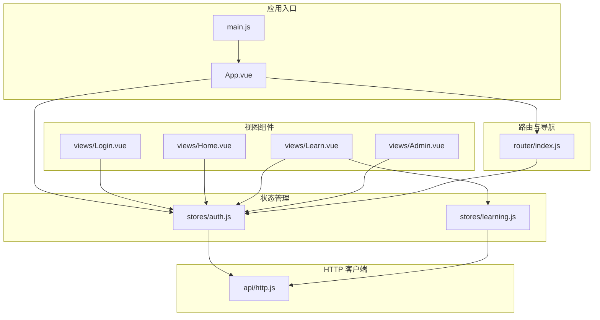
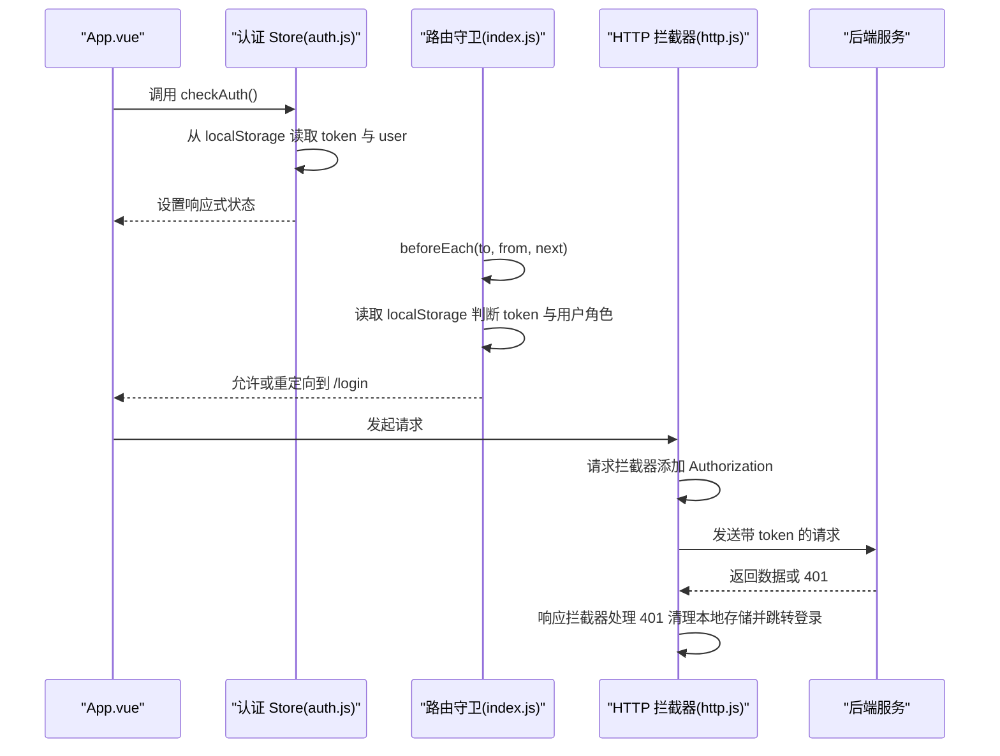
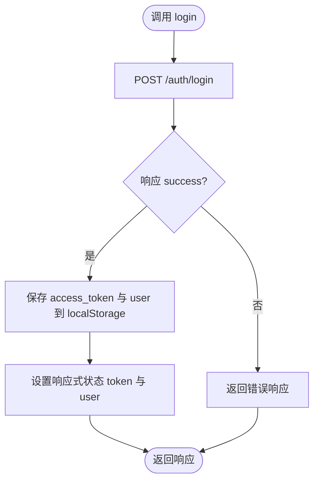
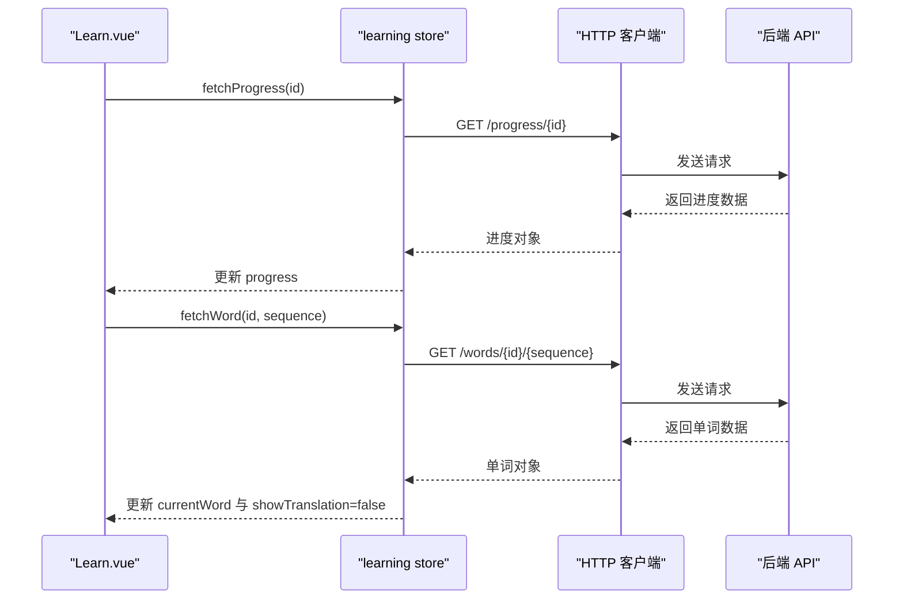
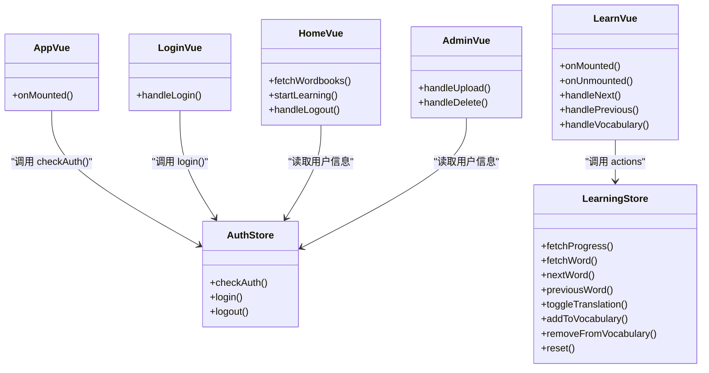
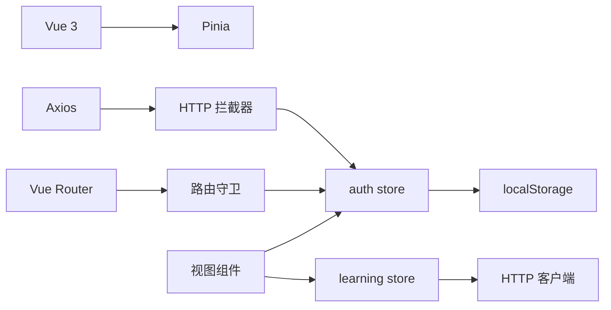

# 状态管理

<cite>
**本文引用的文件**
- [frontend/src/stores/auth.js](file://frontend/src/stores/auth.js)
- [frontend/src/stores/learning.js](file://frontend/src/stores/learning.js)
- [frontend/src/main.js](file://frontend/src/main.js)
- [frontend/src/router/index.js](file://frontend/src/router/index.js)
- [frontend/src/api/http.js](file://frontend/src/api/http.js)
- [frontend/src/App.vue](file://frontend/src/App.vue)
- [frontend/src/views/Login.vue](file://frontend/src/views/Login.vue)
- [frontend/src/views/Learn.vue](file://frontend/src/views/Learn.vue)
- [frontend/src/views/Home.vue](file://frontend/src/views/Home.vue)
- [frontend/src/views/Admin.vue](file://frontend/src/views/Admin.vue)
- [frontend/package.json](file://frontend/package.json)
</cite>

## 目录
1. [简介](#简介)
2. [项目结构](#项目结构)
3. [核心组件](#核心组件)
4. [架构总览](#架构总览)
5. [详细组件分析](#详细组件分析)
6. [依赖分析](#依赖分析)
7. [性能考虑](#性能考虑)
8. [故障排查指南](#故障排查指南)
9. [结论](#结论)
10. [附录](#附录)

## 简介
本文件系统性梳理前端状态管理架构，基于 Vue 3 + Pinia 实现，覆盖认证状态管理（auth store）与学习状态管理（learning store）。文档重点阐述：
- 认证状态管理：用户登录状态、JWT 令牌管理、权限控制（普通用户/管理员）
- 学习状态管理：单词学习进度、当前学习状态、学习统计数据
- 状态定义、Getter 方法、Action 函数与本地持久化策略
- 最佳实践、性能优化与调试技巧
- 组件集成与响应式更新机制

## 项目结构
前端采用模块化组织，状态管理集中在 stores 目录，路由在 router 目录，视图组件在 views 目录，HTTP 封装在 api 目录。应用入口在 main.js 注册 Pinia 和路由。

图表来源
- [frontend/src/main.js](file://frontend/src/main.js#L1-L13)
- [frontend/src/App.vue](file://frontend/src/App.vue#L1-L17)
- [frontend/src/stores/auth.js](file://frontend/src/stores/auth.js#L1-L59)
- [frontend/src/stores/learning.js](file://frontend/src/stores/learning.js#L1-L112)
- [frontend/src/router/index.js](file://frontend/src/router/index.js#L1-L64)
- [frontend/src/api/http.js](file://frontend/src/api/http.js#L1-L48)
- [frontend/src/views/Login.vue](file://frontend/src/views/Login.vue#L1-L116)
- [frontend/src/views/Home.vue](file://frontend/src/views/Home.vue#L1-L189)
- [frontend/src/views/Learn.vue](file://frontend/src/views/Learn.vue#L1-L342)
- [frontend/src/views/Admin.vue](file://frontend/src/views/Admin.vue#L1-L264)

章节来源
- [frontend/src/main.js](file://frontend/src/main.js#L1-L13)
- [frontend/src/router/index.js](file://frontend/src/router/index.js#L1-L64)
- [frontend/src/api/http.js](file://frontend/src/api/http.js#L1-L48)

## 核心组件
- 认证 Store（auth store）
  - 状态：用户信息、JWT 令牌
  - Getter：是否已认证、是否管理员
  - Action：检查认证、登录、注册、登出
  - 持久化：localStorage 存储 access_token 与 user
- 学习 Store（learning store）
  - 状态：当前单词、是否显示翻译、学习进度、单词书 ID、加载状态
  - Action：获取进度、获取单词、更新进度、上一个/下一个单词、切换翻译、加入/移除生词本、重置
  - 持久化：通过后端接口同步学习进度，本地仅缓存当前会话状态

章节来源
- [frontend/src/stores/auth.js](file://frontend/src/stores/auth.js#L5-L58)
- [frontend/src/stores/learning.js](file://frontend/src/stores/learning.js#L5-L111)

## 架构总览
应用启动时注册 Pinia；App.vue 在挂载阶段调用认证 store 的检查逻辑；路由守卫根据 token 与用户角色进行鉴权；HTTP 拦截器统一注入 Authorization 头并在 401 时清理本地存储并跳转登录页。

图表来源
- [frontend/src/App.vue](file://frontend/src/App.vue#L13-L15)
- [frontend/src/stores/auth.js](file://frontend/src/stores/auth.js#L12-L20)
- [frontend/src/router/index.js](file://frontend/src/router/index.js#L48-L61)
- [frontend/src/api/http.js](file://frontend/src/api/http.js#L11-L45)

## 详细组件分析

### 认证状态管理（auth store）
- 状态定义
  - user：当前登录用户对象
  - token：JWT 访问令牌
- Getter
  - isAuthenticated：基于 token 是否存在判断
  - isAdmin：基于 user.is_admin 判断
- Action
  - checkAuth：从 localStorage 读取并恢复状态
  - login：调用后端登录接口，成功后写入 localStorage 并设置响应式状态
  - register：调用后端注册接口
  - logout：清空响应式状态与 localStorage
- 持久化策略
  - 使用 localStorage 存储 access_token 与 user，实现刷新后自动登录
- 权限控制
  - 路由守卫根据 meta 字段与 localStorage 中的 token 与 user.is_admin 决定是否放行

图表来源
- [frontend/src/stores/auth.js](file://frontend/src/stores/auth.js#L22-L34)

章节来源
- [frontend/src/stores/auth.js](file://frontend/src/stores/auth.js#L5-L58)
- [frontend/src/router/index.js](file://frontend/src/router/index.js#L48-L61)
- [frontend/src/api/http.js](file://frontend/src/api/http.js#L11-L45)

### 学习状态管理（learning store）
- 状态定义
  - currentWord：当前单词对象
  - showTranslation：是否显示翻译
  - progress：学习进度对象（当前索引、总数、百分比）
  - wordbookId：当前单词书 ID
  - loading：加载状态
- Action
  - fetchProgress：拉取指定单词书的学习进度
  - fetchWord：按顺序获取单词
  - updateProgress：提交当前索引以更新进度
  - nextWord/previousWord：移动到下一个/上一个单词并同步进度
  - toggleTranslation：切换翻译显示
  - addToVocabulary/removeFromVocabulary：加入/移除生词本
  - reset：重置学习状态
- 数据流
  - 初始化：先获取进度，再获取当前序号的单词
  - 进度计算：基于 total_words 与 current_index 计算百分比
  - 生词本联动：更新当前单词的 is_in_vocabulary 标志

图表来源
- [frontend/src/stores/learning.js](file://frontend/src/stores/learning.js#L16-L37)
- [frontend/src/views/Learn.vue](file://frontend/src/views/Learn.vue#L136-L146)

章节来源
- [frontend/src/stores/learning.js](file://frontend/src/stores/learning.js#L5-L111)
- [frontend/src/views/Learn.vue](file://frontend/src/views/Learn.vue#L106-L198)

### 组件集成与响应式更新
- App.vue
  - 在挂载阶段调用认证 store 的 checkAuth，实现自动登录
- Login.vue
  - 使用认证 store 的 login，提交表单后跳转首页
- Learn.vue
  - 通过 computed 绑定学习 store 的状态，实现响应式渲染
  - 键盘事件与按钮事件均委托给学习 store 的 action
  - 卸载时调用 reset，避免残留状态影响其他页面
- Home.vue
  - 展示单词书列表与用户进度，使用认证 store 的用户信息与权限判断
- Admin.vue
  - 管理员专用页面，受路由守卫保护

图表来源
- [frontend/src/App.vue](file://frontend/src/App.vue#L13-L15)
- [frontend/src/views/Login.vue](file://frontend/src/views/Login.vue#L57-L71)
- [frontend/src/views/Learn.vue](file://frontend/src/views/Learn.vue#L119-L197)
- [frontend/src/views/Home.vue](file://frontend/src/views/Home.vue#L65-L107)
- [frontend/src/views/Admin.vue](file://frontend/src/views/Admin.vue#L105-L195)
- [frontend/src/stores/auth.js](file://frontend/src/stores/auth.js#L5-L58)
- [frontend/src/stores/learning.js](file://frontend/src/stores/learning.js#L5-L111)

## 依赖分析
- 应用依赖
  - Vue 3、Pinia、Vue Router、Axios
- 关键耦合点
  - 认证 store 与路由守卫：通过 localStorage 与 meta 字段协作实现鉴权
  - HTTP 拦截器与认证 store：统一注入 Authorization 头并在 401 时清理本地存储
  - 学习 store 与视图组件：通过 computed 与 action 双向驱动 UI 与后端

图表来源
- [frontend/package.json](file://frontend/package.json#L11-L16)
- [frontend/src/api/http.js](file://frontend/src/api/http.js#L11-L45)
- [frontend/src/router/index.js](file://frontend/src/router/index.js#L48-L61)
- [frontend/src/stores/auth.js](file://frontend/src/stores/auth.js#L12-L46)
- [frontend/src/stores/learning.js](file://frontend/src/stores/learning.js#L16-L86)

章节来源
- [frontend/package.json](file://frontend/package.json#L11-L16)
- [frontend/src/api/http.js](file://frontend/src/api/http.js#L1-L48)
- [frontend/src/router/index.js](file://frontend/src/router/index.js#L1-L64)

## 性能考虑
- 状态粒度
  - 将学习进度拆分为独立字段（current_index、total_words、progress_percentage），便于局部更新与高效渲染
- 异步操作
  - fetchWord 中使用 loading 标记，避免重复请求与 UI 抖动
  - nextWord/previousWord 串行执行 fetchWord 与 updateProgress，保证一致性
- 缓存与持久化
  - 认证状态使用 localStorage，减少重复登录成本
  - 学习状态仅缓存当前会话数据，避免本地存储膨胀
- 响应式绑定
  - 视图通过 computed 绑定 store 状态，减少不必要的重渲染
- 网络层优化
  - Axios 超时配置与拦截器集中处理错误，提升健壮性

## 故障排查指南
- 登录后仍被重定向到登录页
  - 检查 localStorage 中是否存在 access_token 与 user
  - 确认路由守卫逻辑与 meta 字段配置
- 401 未触发自动登出
  - 检查 HTTP 拦截器是否正确注入 Authorization 头
  - 确认响应拦截器对 401 的处理逻辑
- 学习进度不更新
  - 确认 updateProgress 的请求参数与后端接口一致
  - 检查 progress_percentage 的计算逻辑
- 生词本状态不同步
  - 确认 addToVocabulary/removeFromVocabulary 后对 currentWord.is_in_vocabulary 的更新
- 页面卸载后状态残留
  - 确认 Learn.vue 在卸载时调用了 reset

章节来源
- [frontend/src/router/index.js](file://frontend/src/router/index.js#L48-L61)
- [frontend/src/api/http.js](file://frontend/src/api/http.js#L11-L45)
- [frontend/src/stores/learning.js](file://frontend/src/stores/learning.js#L39-L86)
- [frontend/src/views/Learn.vue](file://frontend/src/views/Learn.vue#L131-L134)

## 结论
该状态管理方案以 Pinia 为核心，结合 Vue 3 的组合式 API，实现了清晰的职责分离与良好的可维护性。认证与学习两大 store 各司其职，配合路由守卫与 HTTP 拦截器，构建了可靠的鉴权与数据流体系。建议在后续迭代中引入更细粒度的错误边界与日志埋点，进一步提升可观测性与用户体验。

## 附录
- 状态使用示例路径
  - 登录流程：[frontend/src/views/Login.vue](file://frontend/src/views/Login.vue#L57-L71)、[frontend/src/stores/auth.js](file://frontend/src/stores/auth.js#L22-L34)
  - 学习初始化：[frontend/src/views/Learn.vue](file://frontend/src/views/Learn.vue#L136-L146)、[frontend/src/stores/learning.js](file://frontend/src/stores/learning.js#L16-L37)
  - 进度更新：[frontend/src/stores/learning.js](file://frontend/src/stores/learning.js#L39-L50)
  - 生词本操作：[frontend/src/stores/learning.js](file://frontend/src/stores/learning.js#L72-L86)
  - 自动登录：[frontend/src/App.vue](file://frontend/src/App.vue#L13-L15)、[frontend/src/stores/auth.js](file://frontend/src/stores/auth.js#L12-L20)
- 组件集成要点
  - 在视图组件中通过 computed 绑定 store 状态，确保响应式更新
  - 在生命周期钩子中调用 store 的初始化与清理逻辑
  - 对异步操作使用 loading 标记，避免并发问题