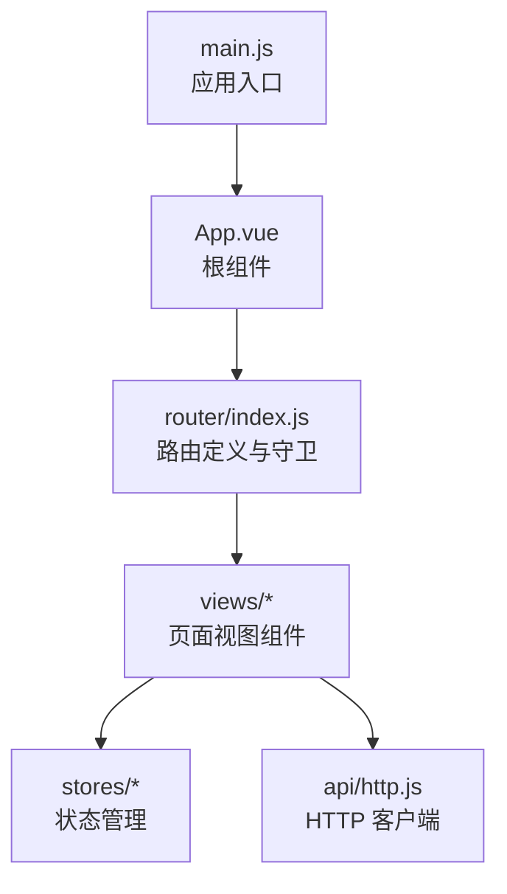
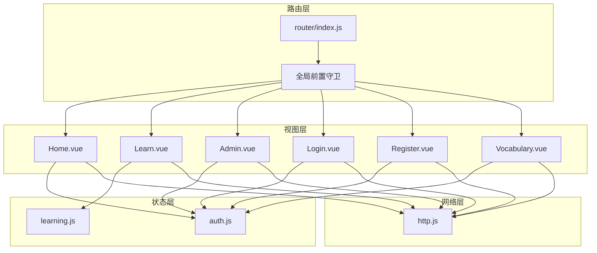
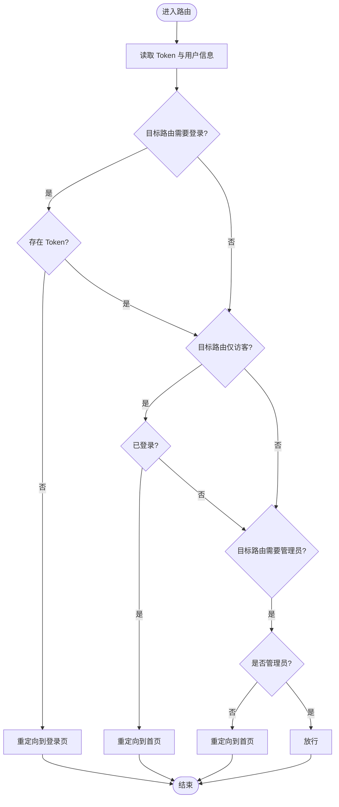
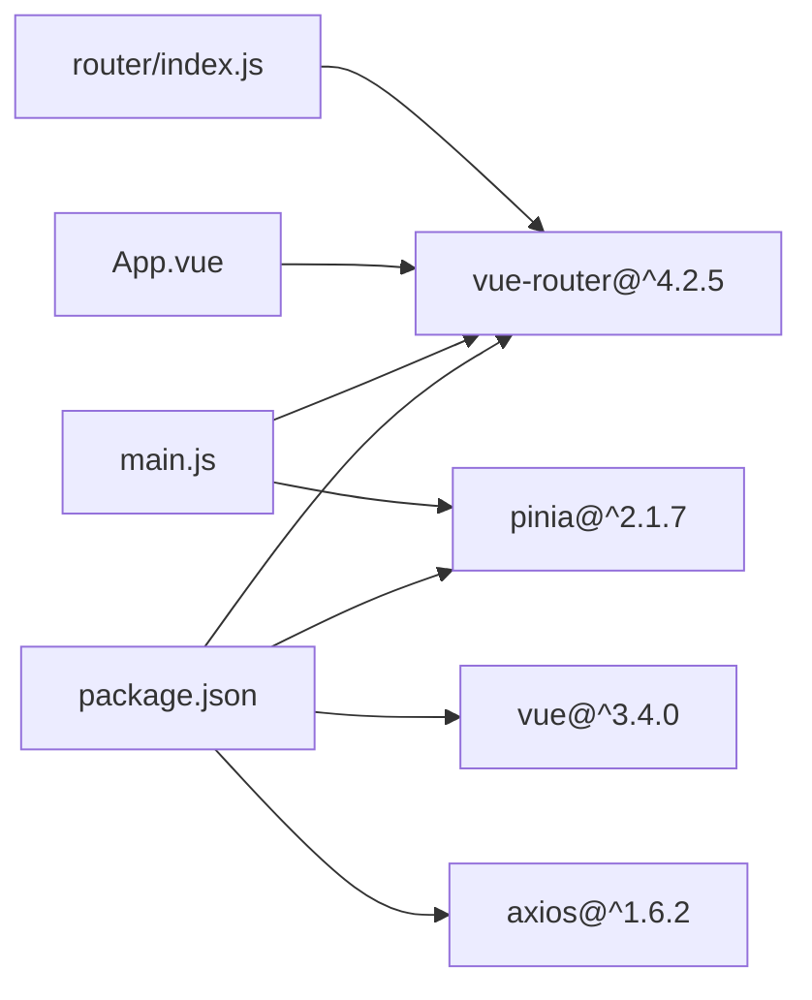

# 路由系统

<cite>
**本文引用的文件**
- [frontend/src/router/index.js](file://frontend/src/router/index.js)
- [frontend/src/main.js](file://frontend/src/main.js)
- [frontend/src/App.vue](file://frontend/src/App.vue)
- [frontend/src/views/Home.vue](file://frontend/src/views/Home.vue)
- [frontend/src/views/Learn.vue](file://frontend/src/views/Learn.vue)
- [frontend/src/views/Admin.vue](file://frontend/src/views/Admin.vue)
- [frontend/src/views/Login.vue](file://frontend/src/views/Login.vue)
- [frontend/src/views/Register.vue](file://frontend/src/views/Register.vue)
- [frontend/src/views/Vocabulary.vue](file://frontend/src/views/Vocabulary.vue)
- [frontend/src/stores/auth.js](file://frontend/src/stores/auth.js)
- [frontend/src/stores/learning.js](file://frontend/src/stores/learning.js)
- [frontend/src/api/http.js](file://frontend/src/api/http.js)
- [frontend/package.json](file://frontend/package.json)
- [frontend/vite.config.js](file://frontend/vite.config.js)
</cite>

## 目录
1. [简介](#简介)
2. [项目结构](#项目结构)
3. [核心组件](#核心组件)
4. [架构总览](#架构总览)
5. [详细组件分析](#详细组件分析)
6. [依赖分析](#依赖分析)
7. [性能考虑](#性能考虑)
8. [故障排查指南](#故障排查指南)
9. [结论](#结论)
10. [附录](#附录)

## 简介
本文件系统性梳理前端路由系统，基于 Vue Router 4 实现。内容涵盖：
- 路由定义、嵌套路由与动态路由参数
- 路由守卫（全局前置守卫、路由独享守卫、组件内守卫）
- 路由元信息（权限控制、访客限制）
- 懒加载与性能优化
- 导航方法与最佳实践
- 路由与组件映射关系

## 项目结构
前端采用单页应用（SPA）结构，路由集中定义于路由器模块，通过 Vue Router 4 提供导航能力；应用入口在 main.js 中挂载路由器；根组件 App.vue 使用 router-view 展示匹配到的视图组件。

图表来源
- [frontend/src/main.js](file://frontend/src/main.js#L1-L13)
- [frontend/src/App.vue](file://frontend/src/App.vue#L1-L17)
- [frontend/src/router/index.js](file://frontend/src/router/index.js#L1-L64)

章节来源
- [frontend/src/main.js](file://frontend/src/main.js#L1-L13)
- [frontend/src/App.vue](file://frontend/src/App.vue#L1-L17)
- [frontend/src/router/index.js](file://frontend/src/router/index.js#L1-L64)

## 核心组件
- 路由器实例：在路由模块中创建并导出，使用历史模式（HTML5 History）。
- 路由表：定义路径、名称、组件（懒加载）、元信息（权限与访客标记）。
- 全局前置守卫：统一处理鉴权、访客限制与管理员权限。
- 视图组件：与路由一一对应，负责渲染页面与用户交互。
- 状态管理：Pinia Store 提供认证状态与学习进度等数据。
- HTTP 客户端：Axios 封装，自动注入 Token 并处理 401 清理。

章节来源
- [frontend/src/router/index.js](file://frontend/src/router/index.js#L1-L64)
- [frontend/src/stores/auth.js](file://frontend/src/stores/auth.js#L1-L59)
- [frontend/src/stores/learning.js](file://frontend/src/stores/learning.js#L1-L112)
- [frontend/src/api/http.js](file://frontend/src/api/http.js#L1-L48)

## 架构总览
下图展示路由系统与视图组件、状态管理、HTTP 客户端之间的交互关系。

图表来源
- [frontend/src/router/index.js](file://frontend/src/router/index.js#L1-L64)
- [frontend/src/views/Home.vue](file://frontend/src/views/Home.vue#L1-L189)
- [frontend/src/views/Learn.vue](file://frontend/src/views/Learn.vue#L1-L342)
- [frontend/src/views/Admin.vue](file://frontend/src/views/Admin.vue#L1-L264)
- [frontend/src/views/Login.vue](file://frontend/src/views/Login.vue#L1-L116)
- [frontend/src/views/Register.vue](file://frontend/src/views/Register.vue#L1-L151)
- [frontend/src/views/Vocabulary.vue](file://frontend/src/views/Vocabulary.vue#L1-L207)
- [frontend/src/stores/auth.js](file://frontend/src/stores/auth.js#L1-L59)
- [frontend/src/stores/learning.js](file://frontend/src/stores/learning.js#L1-L112)
- [frontend/src/api/http.js](file://frontend/src/api/http.js#L1-L48)

## 详细组件分析

### 路由定义与导航
- 路由表包含登录、注册、首页、学习、生词本、管理后台等页面。
- 所有页面组件均采用懒加载导入，提升首屏性能。
- 动态路由参数用于学习页面的单词书 ID。
- 元信息用于区分“需要登录”、“仅访客可访问”、“需要管理员”。

章节来源
- [frontend/src/router/index.js](file://frontend/src/router/index.js#L3-L40)

### 全局前置守卫
- 在进入任意路由前执行，读取本地存储中的 Token 与用户信息。
- 若目标路由要求登录但未携带 Token，则重定向至登录页。
- 若目标路由仅访客可访问且已登录，则重定向至首页。
- 若目标路由要求管理员但用户非管理员，则重定向至首页。
- 否则放行。

图表来源
- [frontend/src/router/index.js](file://frontend/src/router/index.js#L48-L61)

章节来源
- [frontend/src/router/index.js](file://frontend/src/router/index.js#L48-L61)

### 路由与组件映射
- 首页：/ -> Home.vue
- 登录：/login -> Login.vue
- 注册：/register -> Register.vue
- 生词本：/vocabulary -> Vocabulary.vue
- 学习：/learn/:id -> Learn.vue
- 管理：/admin -> Admin.vue

章节来源
- [frontend/src/router/index.js](file://frontend/src/router/index.js#L3-L40)

### 动态路由参数与导航方法
- 学习页面通过动态参数 :id 获取单词书 ID，并据此加载学习进度与单词。
- 页面内通过编程式导航 push 或 router-link 进行跳转。
- 示例场景：
  - 从首页卡片点击进入学习：使用 push 跳转到 /learn/:id
  - 登录成功后回到首页：使用 push 跳转到 /
  - 退出登录后回到登录页：使用 push 跳转到 /login

章节来源
- [frontend/src/views/Home.vue](file://frontend/src/views/Home.vue#L100-L107)
- [frontend/src/views/Learn.vue](file://frontend/src/views/Learn.vue#L123-L129)
- [frontend/src/views/Login.vue](file://frontend/src/views/Login.vue#L62-L71)

### 路由元信息与权限控制
- requiresAuth：需要登录才可访问
- guest：仅访客可访问（已登录用户禁止）
- requiresAdmin：需要管理员身份
- 元信息在全局前置守卫中读取并执行相应逻辑

章节来源
- [frontend/src/router/index.js](file://frontend/src/router/index.js#L8-L39)

### 组件内守卫与路由独享守卫
- 当前实现为全局前置守卫统一处理权限校验。
- 若需在组件内进行更细粒度的守卫（如 beforeRouteEnter/Update/Leave），可在具体组件中按需扩展。

章节来源
- [frontend/src/router/index.js](file://frontend/src/router/index.js#L48-L61)

### 路由懒加载与性能优化
- 所有视图组件均通过动态导入实现懒加载，减少初始包体积。
- 结合浏览器缓存与构建工具的代码分割策略，进一步优化加载速度。
- 建议后续可引入预加载策略（如路由级预加载）以提升关键路径性能。

章节来源
- [frontend/src/router/index.js](file://frontend/src/router/index.js#L7-L38)

### 导航方法与最佳实践
- 编程式导航：useRouter().push() 用于根据业务逻辑跳转。
- 声明式导航：router-link 用于静态链接跳转。
- 最佳实践：
  - 对需要登录的页面设置 requiresAuth
  - 对登录/注册页面设置 guest
  - 对管理功能设置 requiresAdmin
  - 使用编程式导航时注意错误处理与回退路径

章节来源
- [frontend/src/views/Home.vue](file://frontend/src/views/Home.vue#L100-L107)
- [frontend/src/views/Login.vue](file://frontend/src/views/Login.vue#L62-L71)

## 依赖分析
- 路由器依赖 Vue Router 4
- 应用依赖 Pinia（状态管理）
- HTTP 客户端依赖 Axios
- 开发服务器依赖 Vite

图表来源
- [frontend/package.json](file://frontend/package.json#L11-L15)
- [frontend/src/main.js](file://frontend/src/main.js#L1-L13)
- [frontend/src/App.vue](file://frontend/src/App.vue#L1-L17)
- [frontend/src/router/index.js](file://frontend/src/router/index.js#L1-L1)

章节来源
- [frontend/package.json](file://frontend/package.json#L1-L22)
- [frontend/src/main.js](file://frontend/src/main.js#L1-L13)

## 性能考虑
- 懒加载：所有视图组件均采用动态导入，降低首屏资源消耗。
- 历史模式：使用 HTML5 History，避免哈希模式带来的 URL 不美观问题。
- 预加载建议：可结合路由级预加载策略（如在关键页面前预加载后续页面）进一步优化用户体验。
- 缓存策略：结合浏览器缓存与服务端缓存，减少重复请求。

章节来源
- [frontend/src/router/index.js](file://frontend/src/router/index.js#L7-L38)

## 故障排查指南
- 401 未授权：HTTP 拦截器检测到 401，自动清理本地 Token 与用户信息并跳转登录页。
- 登录后无法访问受保护页面：检查全局前置守卫逻辑与本地存储中的 Token/用户信息。
- 访客页面仍显示登录状态：确认目标路由的 meta.guest 设置与守卫逻辑。
- 管理员页面无法访问：确认用户是否具备管理员权限。

章节来源
- [frontend/src/api/http.js](file://frontend/src/api/http.js#L34-L44)
- [frontend/src/router/index.js](file://frontend/src/router/index.js#L48-L61)
- [frontend/src/stores/auth.js](file://frontend/src/stores/auth.js#L12-L20)

## 结论
该路由系统以 Vue Router 4 为核心，通过全局前置守卫实现统一的权限控制，配合懒加载与状态管理，提供了清晰的页面导航与良好的用户体验。建议后续在组件内增加路由独享守卫与预加载策略，以进一步增强安全性与性能表现。

## 附录
- 路由表定义位置：[frontend/src/router/index.js](file://frontend/src/router/index.js#L3-L40)
- 全局前置守卫位置：[frontend/src/router/index.js](file://frontend/src/router/index.js#L48-L61)
- 应用入口与路由器挂载：[frontend/src/main.js](file://frontend/src/main.js#L1-L13)
- 根组件与视图容器：[frontend/src/App.vue](file://frontend/src/App.vue#L1-L17)
- HTTP 客户端与拦截器：[frontend/src/api/http.js](file://frontend/src/api/http.js#L1-L48)
- 认证状态管理：[frontend/src/stores/auth.js](file://frontend/src/stores/auth.js#L1-L59)
- 学习进度状态管理：[frontend/src/stores/learning.js](file://frontend/src/stores/learning.js#L1-L112)
- 视图组件清单：
  - 首页：[frontend/src/views/Home.vue](file://frontend/src/views/Home.vue#L1-L189)
  - 登录：[frontend/src/views/Login.vue](file://frontend/src/views/Login.vue#L1-L116)
  - 注册：[frontend/src/views/Register.vue](file://frontend/src/views/Register.vue#L1-L151)
  - 生词本：[frontend/src/views/Vocabulary.vue](file://frontend/src/views/Vocabulary.vue#L1-L207)
  - 学习：[frontend/src/views/Learn.vue](file://frontend/src/views/Learn.vue#L1-L342)
  - 管理：[frontend/src/views/Admin.vue](file://frontend/src/views/Admin.vue#L1-L264)