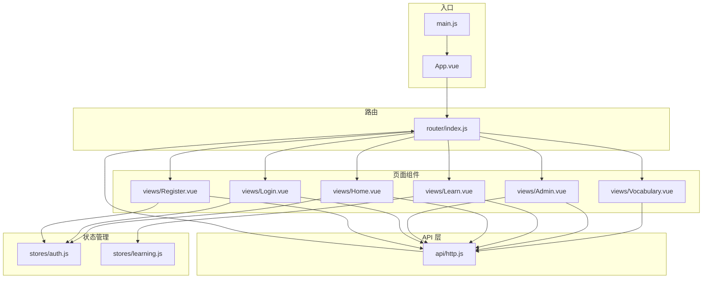
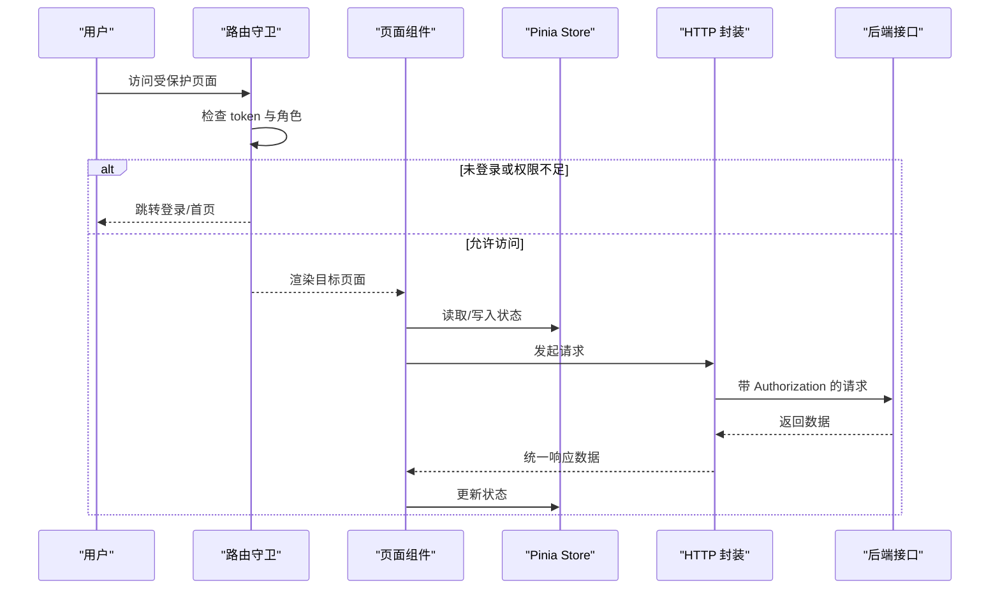
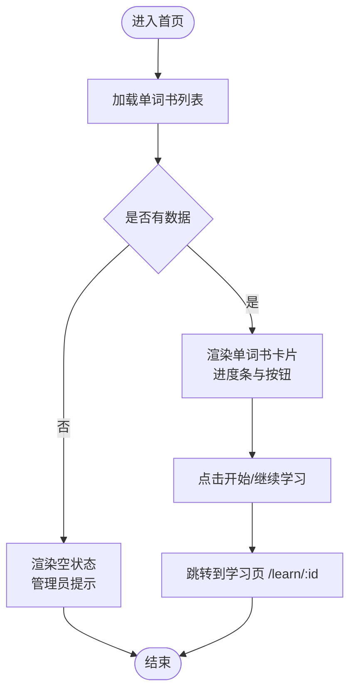
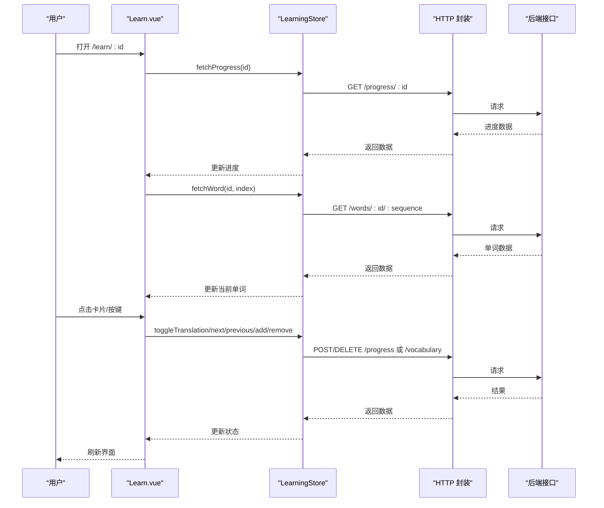
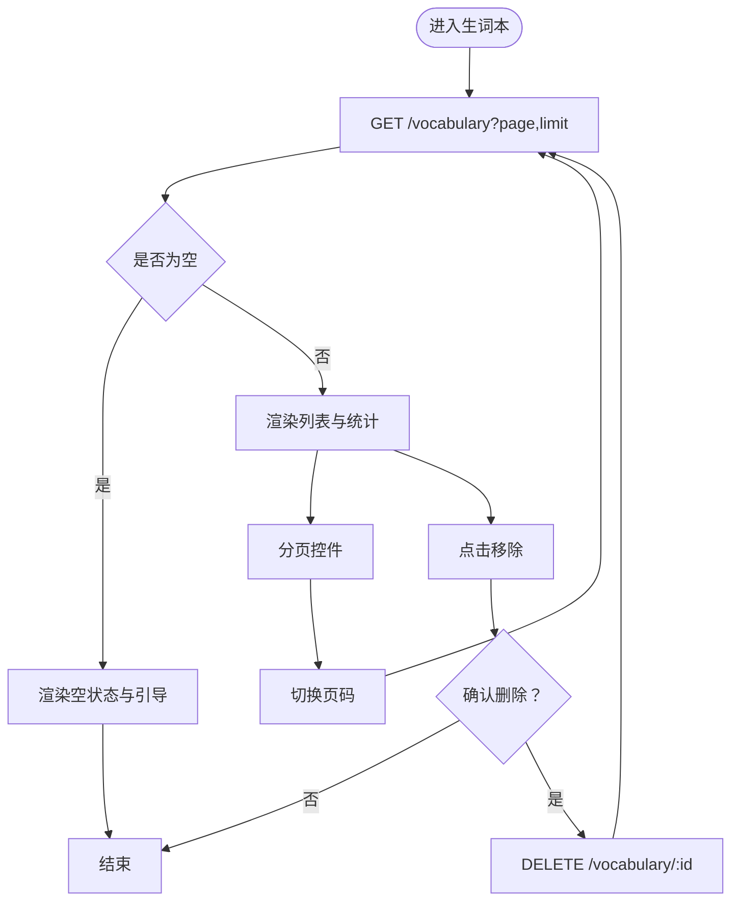
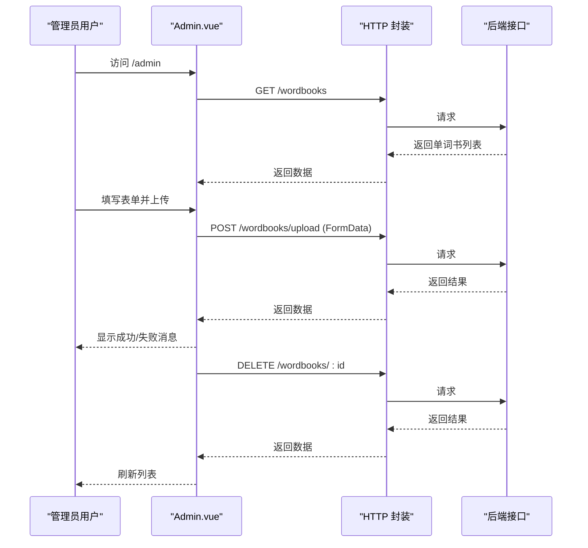
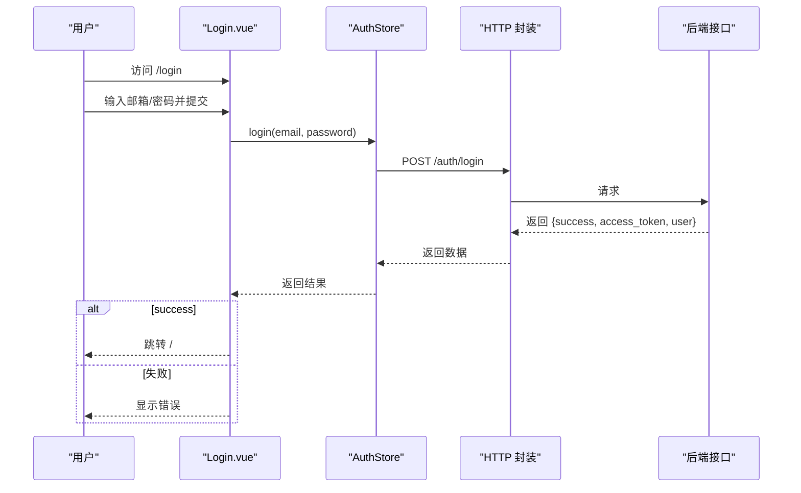
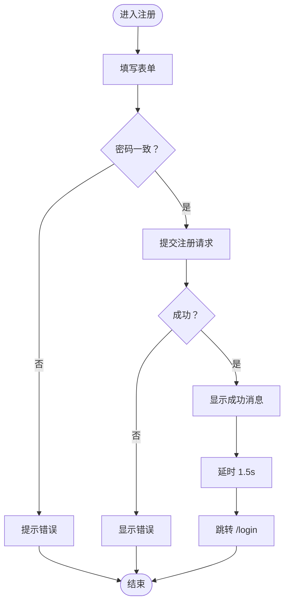
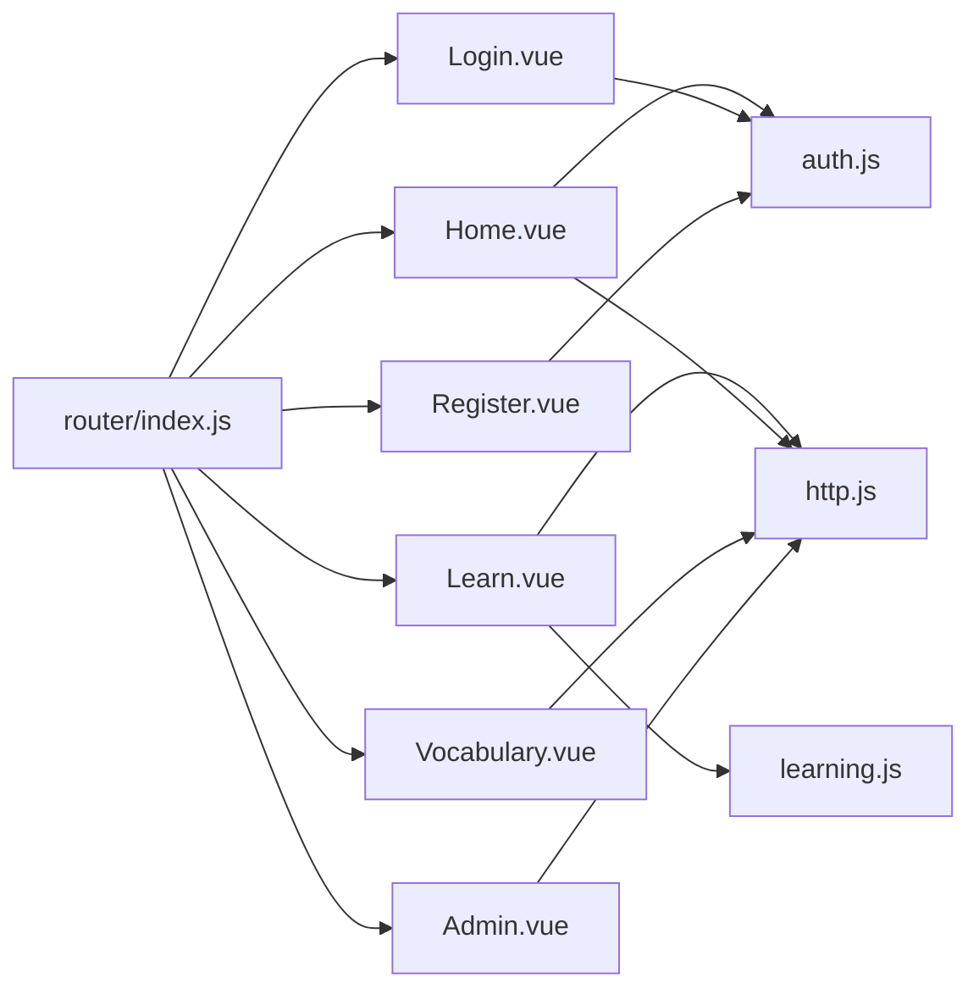

# 页面组件

<cite>
**本文引用的文件**
- [frontend/src/views/Home.vue](file://frontend/src/views/Home.vue)
- [frontend/src/views/Learn.vue](file://frontend/src/views/Learn.vue)
- [frontend/src/views/Vocabulary.vue](file://frontend/src/views/Vocabulary.vue)
- [frontend/src/views/Admin.vue](file://frontend/src/views/Admin.vue)
- [frontend/src/views/Login.vue](file://frontend/src/views/Login.vue)
- [frontend/src/views/Register.vue](file://frontend/src/views/Register.vue)
- [frontend/src/router/index.js](file://frontend/src/router/index.js)
- [frontend/src/stores/auth.js](file://frontend/src/stores/auth.js)
- [frontend/src/stores/learning.js](file://frontend/src/stores/learning.js)
- [frontend/src/api/http.js](file://frontend/src/api/http.js)
- [frontend/src/App.vue](file://frontend/src/App.vue)
- [frontend/src/main.js](file://frontend/src/main.js)
- [frontend/package.json](file://frontend/package.json)
</cite>

## 目录
1. [简介](#简介)
2. [项目结构](#项目结构)
3. [核心组件](#核心组件)
4. [架构总览](#架构总览)
5. [详细组件分析](#详细组件分析)
6. [依赖关系分析](#依赖关系分析)
7. [性能考虑](#性能考虑)
8. [故障排查指南](#故障排查指南)
9. [结论](#结论)
10. [附录](#附录)

## 简介
本文件面向单词学习网站的前端页面组件，系统性梳理首页（Home）、学习页（Learn）、生词本（Vocabulary）、管理后台（Admin）、登录（Login）、注册（Register）六大页面的功能与实现要点。内容涵盖：
- 页面路由配置与鉴权控制
- 数据获取与状态管理
- 生命周期钩子、事件处理与用户交互
- 页面布局、响应式适配与体验优化
- 使用示例与集成方法

## 项目结构
前端采用 Vue 3 + Pinia + Vue Router 架构，页面组件位于 views 目录，状态管理位于 stores 目录，HTTP 封装位于 api 目录，路由配置位于 router 目录。

图表来源
- [frontend/src/main.js](file://frontend/src/main.js#L1-L13)
- [frontend/src/App.vue](file://frontend/src/App.vue#L1-L17)
- [frontend/src/router/index.js](file://frontend/src/router/index.js#L1-L64)
- [frontend/src/stores/auth.js](file://frontend/src/stores/auth.js#L1-L59)
- [frontend/src/stores/learning.js](file://frontend/src/stores/learning.js#L1-L112)
- [frontend/src/api/http.js](file://frontend/src/api/http.js#L1-L48)
- [frontend/src/views/Home.vue](file://frontend/src/views/Home.vue#L1-L189)
- [frontend/src/views/Learn.vue](file://frontend/src/views/Learn.vue#L1-L342)
- [frontend/src/views/Vocabulary.vue](file://frontend/src/views/Vocabulary.vue#L1-L207)
- [frontend/src/views/Admin.vue](file://frontend/src/views/Admin.vue#L1-L264)
- [frontend/src/views/Login.vue](file://frontend/src/views/Login.vue#L1-L116)
- [frontend/src/views/Register.vue](file://frontend/src/views/Register.vue#L1-L151)

章节来源
- [frontend/src/main.js](file://frontend/src/main.js#L1-L13)
- [frontend/src/App.vue](file://frontend/src/App.vue#L1-L17)
- [frontend/src/router/index.js](file://frontend/src/router/index.js#L1-L64)

## 核心组件
- 首页（Home）
  - 功能：展示单词书列表、显示用户学习进度、提供“继续学习/开始学习”入口；支持管理员导航。
  - 关键点：通过 HTTP 获取单词书列表；计算进度百分比；跳转至学习页。
- 学习页（Learn）
  - 功能：单词卡片翻转显示释义、上一个/下一个切换、加入/移出生词本、进度条与完成提示、键盘快捷键。
  - 关键点：Pinia 学习状态管理；根据进度索引获取单词；更新学习进度；完成时弹窗。
- 生词本（Vocabulary）
  - 功能：分页展示生词本、显示单词信息与来源、移除生词。
  - 关键点：分页参数传递；日期格式化；确认对话框。
- 管理后台（Admin）
  - 功能：上传 PDF 解析生成单词书、列出单词书、删除单词书。
  - 关键点：表单提交（含文件）、消息提示、日期格式化。
- 登录（Login）
  - 功能：邮箱+密码登录，错误提示，跳转注册。
  - 关键点：调用认证 Store；本地存储 Token 与用户信息。
- 注册（Register）
  - 功能：用户名、邮箱、密码、确认密码；注册成功提示与自动跳转。
  - 关键点：前后端鉴权；密码一致性校验。

章节来源
- [frontend/src/views/Home.vue](file://frontend/src/views/Home.vue#L1-L189)
- [frontend/src/views/Learn.vue](file://frontend/src/views/Learn.vue#L1-L342)
- [frontend/src/views/Vocabulary.vue](file://frontend/src/views/Vocabulary.vue#L1-L207)
- [frontend/src/views/Admin.vue](file://frontend/src/views/Admin.vue#L1-L264)
- [frontend/src/views/Login.vue](file://frontend/src/views/Login.vue#L1-L116)
- [frontend/src/views/Register.vue](file://frontend/src/views/Register.vue#L1-L151)

## 架构总览
页面组件围绕“路由 + 状态 + API”的三层结构组织：
- 路由层：定义页面路径、命名与鉴权元信息，统一前置守卫进行权限控制。
- 状态层：Pinia Store 管理用户认证与学习状态，避免跨组件重复请求。
- API 层：Axios 封装统一请求与响应拦截，自动注入 Token 并处理 401。

图表来源
- [frontend/src/router/index.js](file://frontend/src/router/index.js#L48-L61)
- [frontend/src/api/http.js](file://frontend/src/api/http.js#L11-L45)
- [frontend/src/stores/auth.js](file://frontend/src/stores/auth.js#L22-L34)
- [frontend/src/stores/learning.js](file://frontend/src/stores/learning.js#L16-L50)

## 详细组件分析

### 首页（Home）
- 路由与导航
  - 路径：/，需要登录；管理员可见“管理”导航。
  - 导航项：首页、生词本、管理（管理员）、用户信息、退出。
- 数据获取与展示
  - 首次挂载触发单词书列表请求；空状态与加载状态分别渲染。
  - 展示单词书名称、描述、单词总数、用户进度条与进度文本。
- 用户交互
  - “开始学习/继续学习”按钮跳转至学习页（/learn/:id）。
  - 退出按钮调用认证 Store 清理状态并跳转登录页。
- 响应式与样式
  - 卡片网格布局，悬停提升与阴影；进度条渐变色；按钮块级宽度。

图表来源
- [frontend/src/views/Home.vue](file://frontend/src/views/Home.vue#L77-L107)

章节来源
- [frontend/src/views/Home.vue](file://frontend/src/views/Home.vue#L1-L189)
- [frontend/src/router/index.js](file://frontend/src/router/index.js#L16-L21)
- [frontend/src/stores/auth.js](file://frontend/src/stores/auth.js#L9-L10)

### 学习页（Learn）
- 路由与导航
  - 路径：/learn/:id，需要登录；返回首页与生词本导航。
- 状态与数据流
  - 通过 Pinia 学习 Store 管理当前单词、翻译显隐、进度信息。
  - 首次挂载根据路由参数获取学习进度与当前单词。
- 交互与快捷键
  - 点击卡片翻转显示释义；上一个/下一个按钮；加入/移出生词本按钮。
  - 键盘快捷键：空格翻转、左右箭头切换、S 加入/移出生词本。
- 完成提示
  - 到达末尾时弹出完成模态框，支持重新开始或返回首页。
- 生命周期
  - 挂载时初始化学习并绑定键盘事件；卸载时移除事件并重置学习状态。

图表来源
- [frontend/src/views/Learn.vue](file://frontend/src/views/Learn.vue#L123-L197)
- [frontend/src/stores/learning.js](file://frontend/src/stores/learning.js#L16-L86)
- [frontend/src/api/http.js](file://frontend/src/api/http.js#L11-L45)

章节来源
- [frontend/src/views/Learn.vue](file://frontend/src/views/Learn.vue#L1-L342)
- [frontend/src/stores/learning.js](file://frontend/src/stores/learning.js#L1-L112)

### 生词本（Vocabulary）
- 路由与导航
  - 路径：/vocabulary，需要登录；返回首页与生词本导航。
- 分页与数据
  - 首次挂载发起分页请求（默认每页 20），渲染生词列表与统计信息。
  - 支持上一页/下一页切换，实时更新列表。
- 用户交互
  - 点击“移除”按钮发起删除请求，二次确认；删除成功后刷新列表。
- 格式化
  - 添加时间本地化格式化为“年-月-日”。

图表来源
- [frontend/src/views/Vocabulary.vue](file://frontend/src/views/Vocabulary.vue#L91-L128)

章节来源
- [frontend/src/views/Vocabulary.vue](file://frontend/src/views/Vocabulary.vue#L1-L207)

### 管理后台（Admin）
- 路由与导航
  - 路径：/admin，需要登录且管理员；返回首页与生词本导航。
- 上传功能
  - 表单包含名称、描述、PDF 文件；提交时构造 FormData；上传成功后清空表单并刷新列表。
- 列表与删除
  - 展示单词书名称、数量、创建时间；删除前二次确认，删除后刷新列表。
- 提示与格式化
  - 成功/失败消息提示；创建时间本地化为“年-月-日 时:分”。

图表来源
- [frontend/src/views/Admin.vue](file://frontend/src/views/Admin.vue#L121-L195)
- [frontend/src/api/http.js](file://frontend/src/api/http.js#L11-L45)

章节来源
- [frontend/src/views/Admin.vue](file://frontend/src/views/Admin.vue#L1-L264)

### 登录（Login）
- 路由与导航
  - 路径：/login，访客可用；已登录则跳转首页。
- 表单与提交
  - 邮箱+密码；提交时调用认证 Store 的 login 方法；成功后跳转首页。
- 错误处理
  - 捕获异常并显示错误信息；保持表单可编辑。

图表来源
- [frontend/src/views/Login.vue](file://frontend/src/views/Login.vue#L57-L71)
- [frontend/src/stores/auth.js](file://frontend/src/stores/auth.js#L22-L34)
- [frontend/src/router/index.js](file://frontend/src/router/index.js#L52-L56)

章节来源
- [frontend/src/views/Login.vue](file://frontend/src/views/Login.vue#L1-L116)
- [frontend/src/stores/auth.js](file://frontend/src/stores/auth.js#L1-L59)

### 注册（Register）
- 路由与导航
  - 路径：/register，访客可用；已登录则跳转首页。
- 表单与校验
  - 用户名、邮箱、密码、确认密码；密码不一致时提示。
- 注册流程
  - 成功后显示成功消息，延时跳转登录页。

图表来源
- [frontend/src/views/Register.vue](file://frontend/src/views/Register.vue#L82-L106)

章节来源
- [frontend/src/views/Register.vue](file://frontend/src/views/Register.vue#L1-L151)
- [frontend/src/stores/auth.js](file://frontend/src/stores/auth.js#L36-L39)

## 依赖关系分析
- 组件与路由
  - 各页面均通过路由懒加载引入；路由守卫统一控制登录与管理员权限。
- 组件与状态
  - 首页与学习页共享认证 Store；学习页独立使用学习 Store；生词本与管理页直接使用 HTTP。
- 组件与 API
  - 所有页面通过统一 HTTP 封装发起请求；请求自动附加 Authorization；401 自动清理本地状态并跳转登录。

图表来源
- [frontend/src/router/index.js](file://frontend/src/router/index.js#L3-L40)
- [frontend/src/stores/auth.js](file://frontend/src/stores/auth.js#L1-L59)
- [frontend/src/stores/learning.js](file://frontend/src/stores/learning.js#L1-L112)
- [frontend/src/api/http.js](file://frontend/src/api/http.js#L1-L48)

章节来源
- [frontend/src/router/index.js](file://frontend/src/router/index.js#L1-L64)
- [frontend/src/stores/auth.js](file://frontend/src/stores/auth.js#L1-L59)
- [frontend/src/stores/learning.js](file://frontend/src/stores/learning.js#L1-L112)
- [frontend/src/api/http.js](file://frontend/src/api/http.js#L1-L48)

## 性能考虑
- 路由懒加载：页面组件通过动态导入减少首屏体积。
- 状态复用：学习页使用 Pinia Store 缓存当前单词与进度，避免重复请求。
- 请求拦截：统一设置超时与头部，减少重复配置。
- 事件解绑：学习页卸载时移除键盘事件，防止内存泄漏。
- 分页策略：生词本按固定大小分页，降低一次性渲染压力。

## 故障排查指南
- 登录后仍被重定向到登录页
  - 检查本地是否存在有效的 access_token 与 user；确认后端返回的 token 是否正确保存。
  - 参考：[frontend/src/router/index.js](file://frontend/src/router/index.js#L48-L61)、[frontend/src/api/http.js](file://frontend/src/api/http.js#L34-L39)
- 学习页无法翻转或切换
  - 确认 Pinia Store 的 currentWord 与 showTranslation 状态是否更新；检查键盘事件绑定与路由参数。
  - 参考：[frontend/src/views/Learn.vue](file://frontend/src/views/Learn.vue#L123-L134)、[frontend/src/stores/learning.js](file://frontend/src/stores/learning.js#L68-L70)
- 生词本列表不刷新
  - 确认删除后是否重新拉取列表；检查分页参数与 total 值。
  - 参考：[frontend/src/views/Vocabulary.vue](file://frontend/src/views/Vocabulary.vue#L112-L123)
- 管理上传失败
  - 检查文件类型与大小限制；确认 FormData 字段名与后端一致；查看响应消息。
  - 参考：[frontend/src/views/Admin.vue](file://frontend/src/views/Admin.vue#L146-L180)、[frontend/src/api/http.js](file://frontend/src/api/http.js#L162-L164)

章节来源
- [frontend/src/router/index.js](file://frontend/src/router/index.js#L48-L61)
- [frontend/src/api/http.js](file://frontend/src/api/http.js#L34-L39)
- [frontend/src/views/Learn.vue](file://frontend/src/views/Learn.vue#L123-L134)
- [frontend/src/stores/learning.js](file://frontend/src/stores/learning.js#L68-L70)
- [frontend/src/views/Vocabulary.vue](file://frontend/src/views/Vocabulary.vue#L112-L123)
- [frontend/src/views/Admin.vue](file://frontend/src/views/Admin.vue#L146-L180)

## 结论
该页面组件体系以路由守卫保障安全、以 Pinia Store 提升性能、以统一 HTTP 封装简化交互，形成清晰的职责边界与良好的扩展性。建议后续在以下方面持续优化：
- 增加骨架屏与错误边界组件，提升弱网与异常场景体验。
- 对高频请求增加缓存策略（如单词书列表、用户进度）。
- 在学习页增加“收藏/复习计划”等进阶功能。

## 附录
- 使用示例与集成方法
  - 在 main.js 中确保已安装 Pinia 与 Router，并挂载应用。
    - 参考：[frontend/src/main.js](file://frontend/src/main.js#L7-L12)
  - 页面组件通过路由懒加载引入，无需手动注册。
  - 认证与学习状态通过 Store 自动注入，组件内直接使用即可。
  - 若需新增页面，参照现有路由配置与 meta 元信息，配合路由守卫实现鉴权控制。

章节来源
- [frontend/src/main.js](file://frontend/src/main.js#L7-L12)
- [frontend/src/router/index.js](file://frontend/src/router/index.js#L3-L40)
- [frontend/package.json](file://frontend/package.json#L11-L16)