# 单词书管理功能

<cite>
**本文档引用的文件**
- [backend/app/models/wordbook.py](file://backend/app/models/wordbook.py)
- [backend/app/models/word.py](file://backend/app/models/word.py)
- [backend/app/models/user.py](file://backend/app/models/user.py)
- [backend/app/models/user_progress.py](file://backend/app/models/user_progress.py)
- [backend/app/models/vocabulary.py](file://backend/app/models/vocabulary.py)
- [backend/app/routes/wordbooks.py](file://backend/app/routes/wordbooks.py)
- [backend/app/routes/words.py](file://backend/app/routes/words.py)
- [backend/app/routes/progress.py](file://backend/app/routes/progress.py)
- [backend/app/routes/vocabulary.py](file://backend/app/routes/vocabulary.py)
- [backend/app/services/pdf_parser.py](file://backend/app/services/pdf_parser.py)
- [backend/app/extensions.py](file://backend/app/extensions.py)
- [backend/app/config.py](file://backend/app/config.py)
- [init.sql](file://init.sql)
- [frontend/src/views/Vocabulary.vue](file://frontend/src/views/Vocabulary.vue)
- [frontend/src/api/http.js](file://frontend/src/api/http.js)
</cite>

## 目录
1. [简介](#简介)
2. [项目结构](#项目结构)
3. [核心组件](#核心组件)
4. [架构总览](#架构总览)
5. [详细组件分析](#详细组件分析)
6. [依赖关系分析](#依赖关系分析)
7. [性能考虑](#性能考虑)
8. [故障排除指南](#故障排除指南)
9. [结论](#结论)
10. [附录](#附录)

## 简介
本文件面向“单词书管理功能”，系统性阐述单词书的创建、编辑、删除与查询流程；明确 Wordbook 模型的数据结构与字段含义；解释单词书与单词之间的一对多关系及数据完整性保障；梳理权限控制策略（管理员权限与 JWT 身份验证）；说明排序与组织能力（自定义顺序、分类与标签扩展建议）；给出批量操作（导入、导出、删除）的实现现状与最佳实践；最后提供性能优化与运维建议。

## 项目结构
后端采用 Flask + SQLAlchemy 架构，按领域模型与路由分层组织；前端使用 Vue 3，通过 Axios 发起 API 请求。数据库初始化脚本定义了用户、单词书、单词等核心表结构及约束。

```mermaid
graph TB
subgraph "后端"
CFG["配置<br/>config.py"]
EXT["扩展初始化<br/>extensions.py"]
subgraph "模型层"
U["User"]
WB["Wordbook"]
W["Word"]
UP["UserProgress"]
VOC["Vocabulary"]
end
subgraph "服务层"
PDF["PDF 解析服务<br/>pdf_parser.py"]
end
subgraph "路由层"
R_WB["单词书路由<br/>routes/wordbooks.py"]
R_WORDS["单词路由<br/>routes/words.py"]
R_PROG["进度路由<br/>routes/progress.py"]
R_VOC["生词本路由<br/>routes/vocabulary.py"]
end
end
CFG --> EXT
EXT --> U
EXT --> WB
EXT --> W
EXT --> UP
EXT --> VOC
R_WB --> WB
R_WB --> W
R_WB --> UP
R_WB --> PDF
R_WORDS --> WB
R_WORDS --> W
R_WORDS --> VOC
R_PROG --> WB
R_PROG --> UP
R_VOC --> W
R_VOC --> VOC
```

图表来源
- [backend/app/config.py](file://backend/app/config.py#L1-L28)
- [backend/app/extensions.py](file://backend/app/extensions.py#L1-L10)
- [backend/app/models/user.py](file://backend/app/models/user.py#L1-L26)
- [backend/app/models/wordbook.py](file://backend/app/models/wordbook.py#L1-L25)
- [backend/app/models/word.py](file://backend/app/models/word.py#L1-L29)
- [backend/app/models/user_progress.py](file://backend/app/models/user_progress.py#L1-L29)
- [backend/app/models/vocabulary.py](file://backend/app/models/vocabulary.py#L1-L26)
- [backend/app/routes/wordbooks.py](file://backend/app/routes/wordbooks.py#L1-L159)
- [backend/app/routes/words.py](file://backend/app/routes/words.py#L1-L65)
- [backend/app/routes/progress.py](file://backend/app/routes/progress.py#L1-L115)
- [backend/app/routes/vocabulary.py](file://backend/app/routes/vocabulary.py#L1-L103)
- [backend/app/services/pdf_parser.py](file://backend/app/services/pdf_parser.py#L1-L43)

章节来源
- [backend/app/config.py](file://backend/app/config.py#L1-L28)
- [backend/app/extensions.py](file://backend/app/extensions.py#L1-L10)
- [init.sql](file://init.sql#L1-L39)

## 核心组件
- 单词书模型（Wordbook）
  - 字段：id、name、description、pdf_filename、word_count、created_at
  - 关系：与 Word 一对多（级联删除孤儿）
  - 序列化：to_dict 输出必要字段
- 单词模型（Word）
  - 字段：id、wordbook_id、word、phonetic、translation、sequence、created_at
  - 约束：唯一索引（wordbook_id, sequence），复合索引（wordbook_id, sequence）
  - 序列化：to_dict 输出单词详情
- 用户模型（User）
  - 字段：id、username、email、password_hash、is_admin、created_at
  - 关系：与 UserProgress、Vocabulary 关联
- 学习进度模型（UserProgress）
  - 字段：id、user_id、wordbook_id、current_index、last_learn_time、created_at
  - 约束：唯一索引（user_id, wordbook_id）
- 生词本模型（Vocabulary）
  - 字段：id、user_id、word_id、added_at
  - 约束：唯一索引（user_id, word_id）

章节来源
- [backend/app/models/wordbook.py](file://backend/app/models/wordbook.py#L1-L25)
- [backend/app/models/word.py](file://backend/app/models/word.py#L1-L29)
- [backend/app/models/user.py](file://backend/app/models/user.py#L1-L26)
- [backend/app/models/user_progress.py](file://backend/app/models/user_progress.py#L1-L29)
- [backend/app/models/vocabulary.py](file://backend/app/models/vocabulary.py#L1-L26)

## 架构总览
系统围绕“单词书-单词”主干关系构建，辅以用户、学习进度与生词本支撑学习闭环。管理员通过 JWT 身份验证进行单词书的上传与删除；普通用户可查询单词书列表、获取单词详情、维护生词本与学习进度。

图表来源
- [backend/app/routes/wordbooks.py](file://backend/app/routes/wordbooks.py#L68-L135)
- [backend/app/services/pdf_parser.py](file://backend/app/services/pdf_parser.py#L1-L43)

## 详细组件分析

### 单词书模型与关系
- 数据结构
  - Wordbook：包含名称、描述、PDF 文件名、单词数量、创建时间
  - Word：包含所属单词书、英文词、音标、中文释义、顺序、创建时间
- 关系与完整性
  - Wordbook 与 Word：一对多，删除单词书时级联删除其下单词（删除孤儿）
  - Word 表通过唯一索引保证同一单词书内顺序唯一，避免重复顺序
- 查询与序列化
  - Wordbook 提供 to_dict，便于 API 响应统一输出

图表来源
- [backend/app/models/wordbook.py](file://backend/app/models/wordbook.py#L1-L25)
- [backend/app/models/word.py](file://backend/app/models/word.py#L1-L29)

章节来源
- [backend/app/models/wordbook.py](file://backend/app/models/wordbook.py#L1-L25)
- [backend/app/models/word.py](file://backend/app/models/word.py#L1-L29)
- [init.sql](file://init.sql#L18-L39)

### 权限控制与身份验证
- JWT 身份验证
  - 所有受保护接口均要求携带 JWT，从请求头 Authorization 中读取 Bearer Token
- 管理员权限
  - 单词书上传与删除接口使用 admin_required 装饰器，仅允许 is_admin 为真用户访问
- 前端集成
  - Axios 请求拦截器自动附加 Bearer Token；401 时清理本地存储并跳转登录页

图表来源
- [frontend/src/api/http.js](file://frontend/src/api/http.js#L11-L23)
- [backend/app/routes/wordbooks.py](file://backend/app/routes/wordbooks.py#L14-L25)

章节来源
- [backend/app/routes/wordbooks.py](file://backend/app/routes/wordbooks.py#L1-L25)
- [frontend/src/api/http.js](file://frontend/src/api/http.js#L1-L48)

### 查询与展示
- 列表查询
  - GET /wordbooks：返回所有单词书列表，并附带当前用户在各单词书的学习进度
- 详情查询
  - GET /wordbooks/:id：返回指定单词书详情
- 单词查询
  - GET /words/:wordbook_id/:sequence：按顺序获取单词，同时标注是否在生词本中
  - GET /words/batch/:wordbook_id：分批批量拉取单词，支持 start、limit 参数

图表来源
- [backend/app/routes/words.py](file://backend/app/routes/words.py#L41-L65)

章节来源
- [backend/app/routes/wordbooks.py](file://backend/app/routes/wordbooks.py#L28-L65)
- [backend/app/routes/words.py](file://backend/app/routes/words.py#L1-L65)

### 创建与导入（批量导入）
- 接口：POST /wordbooks/upload（管理员）
- 流程
  - 校验文件存在、文件名、名称、类型（仅 PDF）
  - 保存文件至上传目录
  - 调用 PDF 解析服务提取单词三元组
  - 事务内插入 Wordbook，并批量插入 Word（sequence 自增）
  - 成功返回单词书 ID 与导入数量
- 错误处理
  - 异常回滚，删除已保存的 PDF 文件

图表来源
- [backend/app/routes/wordbooks.py](file://backend/app/routes/wordbooks.py#L68-L135)
- [backend/app/services/pdf_parser.py](file://backend/app/services/pdf_parser.py#L1-L43)

章节来源
- [backend/app/routes/wordbooks.py](file://backend/app/routes/wordbooks.py#L68-L135)
- [backend/app/services/pdf_parser.py](file://backend/app/services/pdf_parser.py#L1-L43)

### 删除（批量删除）
- 接口：DELETE /wordbooks/:id（管理员）
- 流程
  - 校验单词书存在
  - 删除关联用户进度
  - 删除上传目录中的 PDF 文件
  - 删除单词书记录（级联删除其下单词）
- 注意：当前未提供“批量删除单词书”的接口，如需扩展可在路由层新增批量删除逻辑

章节来源
- [backend/app/routes/wordbooks.py](file://backend/app/routes/wordbooks.py#L138-L159)

### 学习进度与生词本
- 学习进度
  - GET /progress/:wordbook_id：获取当前用户在指定单词书的进度
  - POST /progress/:wordbook_id：更新 current_index 并刷新 last_learn_time
  - POST /progress/:wordbook_id/reset：重置进度为 1
- 生词本
  - GET /vocabulary：分页获取当前用户生词本，支持按单词书过滤
  - POST /vocabulary：添加单词到生词本（去重）
  - DELETE /vocabulary/:id 或 DELETE /vocabulary/word/:word_id：从生词本移除

图表来源
- [backend/app/routes/progress.py](file://backend/app/routes/progress.py#L53-L95)

章节来源
- [backend/app/routes/progress.py](file://backend/app/routes/progress.py#L1-L115)
- [backend/app/routes/vocabulary.py](file://backend/app/routes/vocabulary.py#L1-L103)

### 排序与组织（自定义顺序、分类与标签）
- 自定义顺序
  - Word.sequence 字段作为排序依据，数据库建立复合索引以提升查询性能
- 分类与标签
  - 当前模型未内置分类与标签字段；可通过扩展字段或关联中间表实现
  - 建议：新增分类表与标签表，通过多对多关系扩展单词书/单词的分类与标签体系

章节来源
- [backend/app/models/word.py](file://backend/app/models/word.py#L15-L18)
- [init.sql](file://init.sql#L28-L39)

### 批量操作（导入、导出、删除）
- 导入
  - 已实现：PDF 批量解析并批量插入单词
- 导出
  - 当前未提供导出接口；可扩展：按单词书 ID 导出单词列表（CSV/Excel）
- 删除
  - 已实现：单个单词书删除（级联删除单词与进度）
  - 建议：新增批量删除接口，支持传入 ID 列表并逐个校验与删除

章节来源
- [backend/app/routes/wordbooks.py](file://backend/app/routes/wordbooks.py#L68-L135)
- [backend/app/routes/wordbooks.py](file://backend/app/routes/wordbooks.py#L138-L159)

## 依赖关系分析
- 组件耦合
  - 路由层依赖模型层与服务层；模型层通过 SQLAlchemy 定义关系与约束
  - PDF 解析服务独立于路由，便于单元测试与复用
- 外部依赖
  - Flask、SQLAlchemy、JWT、CORS、Bcrypt、pdfplumber、pdfplumber
- 数据库约束
  - Wordbook 与 Word：外键约束 + 级联删除
  - Word：唯一索引（wordbook_id, sequence）、复合索引（wordbook_id, sequence）
  - UserProgress：唯一索引（user_id, wordbook_id）
  - Vocabulary：唯一索引（user_id, word_id）

图表来源
- [backend/app/routes/wordbooks.py](file://backend/app/routes/wordbooks.py#L1-L159)
- [backend/app/routes/words.py](file://backend/app/routes/words.py#L1-L65)
- [backend/app/routes/progress.py](file://backend/app/routes/progress.py#L1-L115)
- [backend/app/routes/vocabulary.py](file://backend/app/routes/vocabulary.py#L1-L103)
- [backend/app/services/pdf_parser.py](file://backend/app/services/pdf_parser.py#L1-L43)
- [backend/app/models/wordbook.py](file://backend/app/models/wordbook.py#L1-L25)
- [backend/app/models/word.py](file://backend/app/models/word.py#L1-L29)
- [backend/app/models/user_progress.py](file://backend/app/models/user_progress.py#L1-L29)
- [backend/app/models/vocabulary.py](file://backend/app/models/vocabulary.py#L1-L26)

章节来源
- [init.sql](file://init.sql#L1-L39)

## 性能考虑
- 索引优化
  - Word 表已建立（wordbook_id, sequence）复合索引，建议在高频查询场景下保持该索引
- 批量写入
  - 导入时使用 flush 获取主键后批量插入单词，减少往返开销
- 分页与批量拉取
  - 使用 /words/batch 接口按批次拉取单词，降低单次响应体大小
- 缓存与CDN
  - 对静态 PDF 文件可引入 CDN；对热点单词书列表可考虑短期缓存
- 数据库连接池
  - 合理配置连接池大小与超时，避免高并发下的连接争用

## 故障排除指南
- 401 未授权
  - 检查前端是否正确携带 Bearer Token；确认 JWT 是否过期
- 403 需要管理员权限
  - 确认当前用户 is_admin 为真；仅管理员可执行上传与删除
- PDF 解析失败
  - 确认 PDF 格式符合“英文词 [音标] 中文释义”模式；检查文件内容是否被加密或扫描版导致文本不可提取
- 单词书不存在/单词不存在
  - 检查 ID 是否正确；确认单词书与单词的外键关系是否完整
- 导入后单词数为 0
  - 检查 PDF 文本提取正则是否匹配；确认解析服务异常日志

章节来源
- [frontend/src/api/http.js](file://frontend/src/api/http.js#L31-L44)
- [backend/app/routes/wordbooks.py](file://backend/app/routes/wordbooks.py#L72-L86)
- [backend/app/services/pdf_parser.py](file://backend/app/services/pdf_parser.py#L39-L42)

## 结论
本系统围绕“单词书-单词”关系提供了完整的导入、查询与删除能力，并通过 JWT 与管理员权限保障安全。学习进度与生词本完善了学习闭环。当前未实现批量导出与批量删除，建议后续扩展；同时可引入分类与标签体系以增强组织能力。通过合理的索引、批量写入与分页策略，可进一步提升性能与用户体验。

## 附录
- 前端生词本页面示例：展示分页、空态与移除交互
- 数据库初始化脚本：定义用户、单词书、单词等表结构与约束

章节来源
- [frontend/src/views/Vocabulary.vue](file://frontend/src/views/Vocabulary.vue#L1-L207)
- [init.sql](file://init.sql#L1-L39)