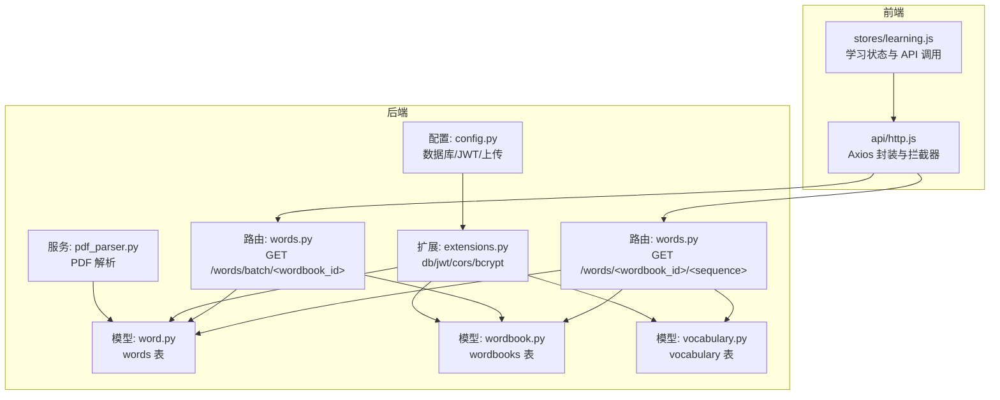
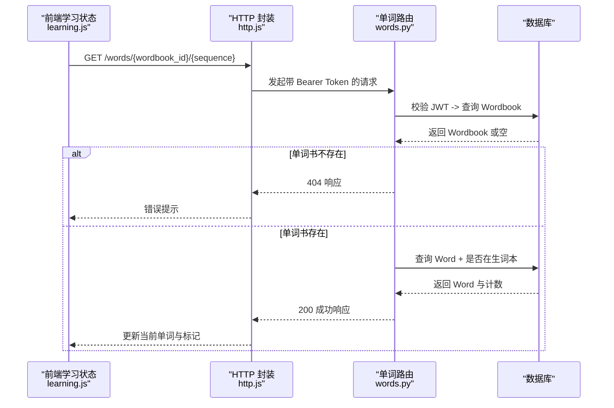
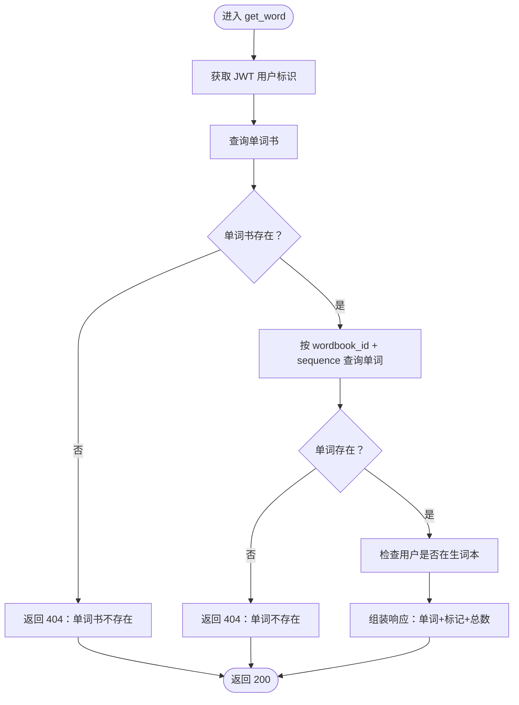
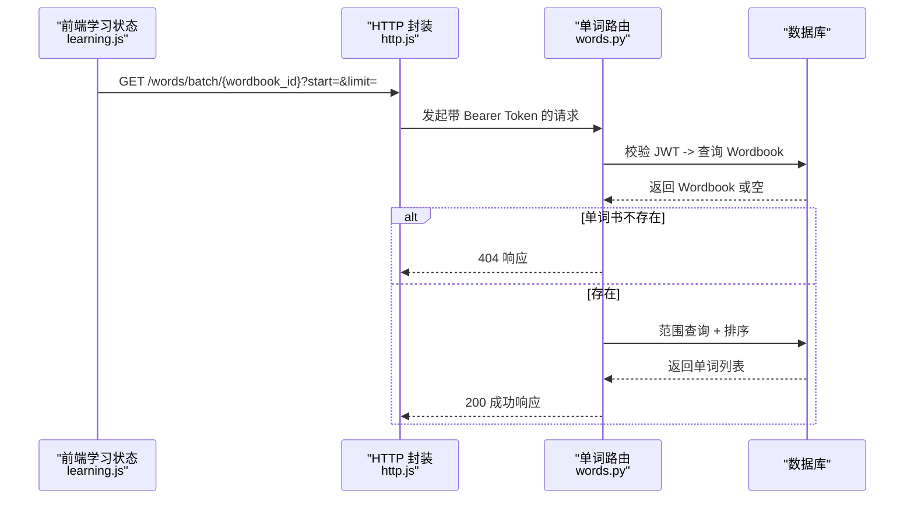
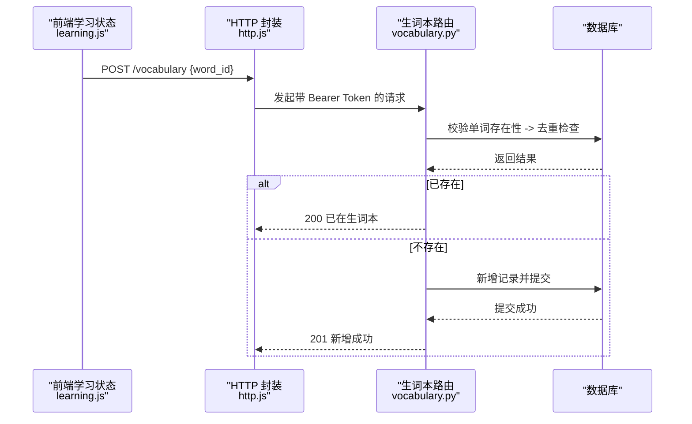
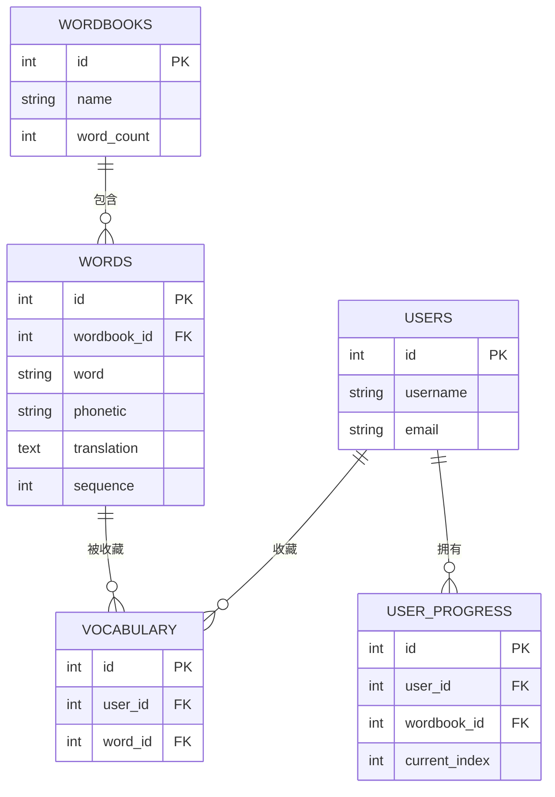
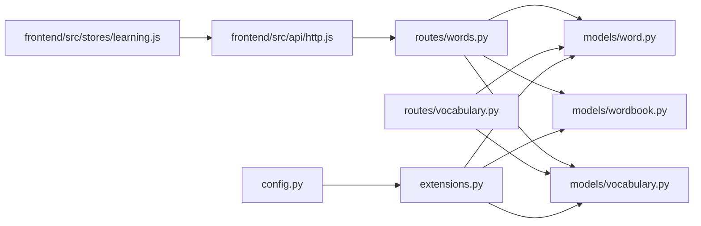

# 单词增删改查操作

<cite>
**本文引用的文件**
- [backend/app/routes/words.py](file://backend/app/routes/words.py)
- [backend/app/models/word.py](file://backend/app/models/word.py)
- [backend/app/models/wordbook.py](file://backend/app/models/wordbook.py)
- [backend/app/models/vocabulary.py](file://backend/app/models/vocabulary.py)
- [backend/app/routes/vocabulary.py](file://backend/app/routes/vocabulary.py)
- [backend/app/extensions.py](file://backend/app/extensions.py)
- [backend/app/config.py](file://backend/app/config.py)
- [backend/app/routers/progress.py](file://backend/app/routes/progress.py)
- [backend/app/models/user_progress.py](file://backend/app/models/user_progress.py)
- [frontend/src/api/http.js](file://frontend/src/api/http.js)
- [frontend/src/stores/learning.js](file://frontend/src/stores/learning.js)
</cite>

## 目录
1. [简介](#简介)
2. [项目结构](#项目结构)
3. [核心组件](#核心组件)
4. [架构总览](#架构总览)
5. [详细组件分析](#详细组件分析)
6. [依赖关系分析](#依赖关系分析)
7. [性能考虑](#性能考虑)
8. [故障排查指南](#故障排查指南)
9. [结论](#结论)
10. [附录](#附录)

## 简介
本文件围绕单词的 CRUD 操作进行系统化说明，重点覆盖以下内容：
- 单词读取接口 get_word() 的完整流程：JWT 认证、单词书存在性校验、单词位置合法性校验、生词本关联标记与总数返回。
- 批量读取接口 get_words_batch() 的分页参数处理、范围查询与排序机制。
- 查询性能优化策略：索引设计、查询缓存思路与批量读取建议。
- 错误处理机制：404、权限验证失败、数据不一致等场景的处理方式。
- API 调用示例与最佳实践建议。

## 项目结构
后端采用 Flask 蓝图组织路由，模型层使用 SQLAlchemy 定义数据结构与关系；前端通过 Axios 封装的 http 模块统一处理请求与响应拦截，Pinia 状态管理封装学习流程。

图表来源
- [backend/app/routes/words.py](file://backend/app/routes/words.py#L1-L65)
- [backend/app/models/word.py](file://backend/app/models/word.py#L1-L29)
- [backend/app/models/wordbook.py](file://backend/app/models/wordbook.py#L1-L25)
- [backend/app/models/vocabulary.py](file://backend/app/models/vocabulary.py#L1-L26)
- [backend/app/services/pdf_parser.py](file://backend/app/services/pdf_parser.py#L1-L43)
- [backend/app/config.py](file://backend/app/config.py#L1-L28)
- [backend/app/extensions.py](file://backend/app/extensions.py#L1-L10)
- [frontend/src/api/http.js](file://frontend/src/api/http.js#L1-L48)
- [frontend/src/stores/learning.js](file://frontend/src/stores/learning.js#L1-L112)

章节来源
- [backend/app/routes/words.py](file://backend/app/routes/words.py#L1-L65)
- [backend/app/models/word.py](file://backend/app/models/word.py#L1-L29)
- [backend/app/models/wordbook.py](file://backend/app/models/wordbook.py#L1-L25)
- [backend/app/models/vocabulary.py](file://backend/app/models/vocabulary.py#L1-L26)
- [backend/app/config.py](file://backend/app/config.py#L1-L28)
- [backend/app/extensions.py](file://backend/app/extensions.py#L1-L10)
- [frontend/src/api/http.js](file://frontend/src/api/http.js#L1-L48)
- [frontend/src/stores/learning.js](file://frontend/src/stores/learning.js#L1-L112)

## 核心组件
- 单词模型 Word：定义单词字段、唯一约束与复合索引，提供序列化方法。
- 单词书模型 Wordbook：维护词库元信息与单词数量，提供序列化方法。
- 生词本模型 Vocabulary：维护用户与单词的多对多中间表，提供序列化方法。
- 单词路由 words.py：提供单个单词读取与批量读取接口。
- 生词本路由 vocabulary.py：提供生词本查询、添加与删除接口。
- 前端 http.js：统一请求头注入与 401 自动登出处理。
- 前端 learning.js：封装单词读取、进度更新与生词本操作。

章节来源
- [backend/app/models/word.py](file://backend/app/models/word.py#L1-L29)
- [backend/app/models/wordbook.py](file://backend/app/models/wordbook.py#L1-L25)
- [backend/app/models/vocabulary.py](file://backend/app/models/vocabulary.py#L1-L26)
- [backend/app/routes/words.py](file://backend/app/routes/words.py#L1-L65)
- [backend/app/routes/vocabulary.py](file://backend/app/routes/vocabulary.py#L1-L103)
- [frontend/src/api/http.js](file://frontend/src/api/http.js#L1-L48)
- [frontend/src/stores/learning.js](file://frontend/src/stores/learning.js#L1-L112)

## 架构总览
后端通过蓝图暴露 REST 接口，JWT 保护敏感接口，SQLAlchemy 提供 ORM 能力。前端通过 Pinia 管理学习状态，Axios 统一处理鉴权与错误。

图表来源
- [backend/app/routes/words.py](file://backend/app/routes/words.py#L10-L38)
- [frontend/src/stores/learning.js](file://frontend/src/stores/learning.js#L25-L37)
- [frontend/src/api/http.js](file://frontend/src/api/http.js#L11-L23)

## 详细组件分析

### get_word() 实现逻辑详解
- JWT 认证与身份解析：使用装饰器获取当前用户标识，作为后续权限控制依据。
- 单词书存在性检查：先查询单词书是否存在，不存在直接返回 404。
- 单词位置验证：按单词书 ID 与顺序查询单词，若不存在返回 404。
- 生词本关联标记：查询当前用户是否已将该单词加入生词本，返回布尔标记。
- 总数与序列信息：返回单词书总词数与单词序列，便于前端进度展示。
- 响应结构：包含成功标志、单词对象（含新增字段）、总数。

图表来源
- [backend/app/routes/words.py](file://backend/app/routes/words.py#L10-L38)

章节来源
- [backend/app/routes/words.py](file://backend/app/routes/words.py#L10-L38)

### 批量获取单词 get_words_batch() 方法
- 分页参数处理：从查询参数读取起始位置与条数，默认起始为 1，每页 10 条。
- 范围查询与排序：以单词书 ID 与序列号为条件，限定 [start, start+limit)，并按 sequence 升序排列。
- 单词书存在性校验：同上，不存在返回 404。
- 响应结构：包含成功标志、单词数组、单词书总词数。

图表来源
- [backend/app/routes/words.py](file://backend/app/routes/words.py#L41-L64)
- [frontend/src/stores/learning.js](file://frontend/src/stores/learning.js#L16-L23)

章节来源
- [backend/app/routes/words.py](file://backend/app/routes/words.py#L41-L64)

### 生词本集成与查询
- 生词本查询：支持分页、按单词书过滤、按添加时间倒序。
- 添加到生词本：校验单词存在性与重复添加，成功返回新建记录 ID。
- 从生词本移除：支持按记录 ID 或单词 ID 删除，返回成功消息。

图表来源
- [backend/app/routes/vocabulary.py](file://backend/app/routes/vocabulary.py#L44-L71)
- [frontend/src/stores/learning.js](file://frontend/src/stores/learning.js#L72-L78)

章节来源
- [backend/app/routes/vocabulary.py](file://backend/app/routes/vocabulary.py#L10-L103)
- [frontend/src/stores/learning.js](file://frontend/src/stores/learning.js#L72-L78)

### 数据模型与关系
- Wordbook 与 Word：一对多关系，动态级联删除孤儿单词。
- Word 与 Vocabulary：多对多中间表，通过外键关联用户与单词。
- UserProgress 与 Wordbook：唯一约束保证每个用户对每个单词书仅有一条进度记录。

图表来源
- [backend/app/models/wordbook.py](file://backend/app/models/wordbook.py#L14-L15)
- [backend/app/models/word.py](file://backend/app/models/word.py#L8-L12)
- [backend/app/models/vocabulary.py](file://backend/app/models/vocabulary.py#L8-L9)
- [backend/app/models/user_progress.py](file://backend/app/models/user_progress.py#L8-L9)

章节来源
- [backend/app/models/wordbook.py](file://backend/app/models/wordbook.py#L1-L25)
- [backend/app/models/word.py](file://backend/app/models/word.py#L1-L29)
- [backend/app/models/vocabulary.py](file://backend/app/models/vocabulary.py#L1-L26)
- [backend/app/models/user_progress.py](file://backend/app/models/user_progress.py#L1-L29)

## 依赖关系分析
- 路由依赖模型：单词路由依赖 Wordbook 与 Word 模型；生词本路由依赖 Word 与 Vocabulary 模型。
- 扩展与配置：SQLAlchemy、JWT、CORS、Bcrypt 通过 extensions.py 注入；数据库与 JWT 配置在 config.py。
- 前端依赖：学习状态 store 通过 http.js 统一调用后端接口。

图表来源
- [backend/app/routes/words.py](file://backend/app/routes/words.py#L1-L65)
- [backend/app/routes/vocabulary.py](file://backend/app/routes/vocabulary.py#L1-L103)
- [backend/app/models/word.py](file://backend/app/models/word.py#L1-L29)
- [backend/app/models/wordbook.py](file://backend/app/models/wordbook.py#L1-L25)
- [backend/app/models/vocabulary.py](file://backend/app/models/vocabulary.py#L1-L26)
- [backend/app/config.py](file://backend/app/config.py#L1-L28)
- [backend/app/extensions.py](file://backend/app/extensions.py#L1-L10)
- [frontend/src/api/http.js](file://frontend/src/api/http.js#L1-L48)
- [frontend/src/stores/learning.js](file://frontend/src/stores/learning.js#L1-L112)

章节来源
- [backend/app/routes/words.py](file://backend/app/routes/words.py#L1-L65)
- [backend/app/routes/vocabulary.py](file://backend/app/routes/vocabulary.py#L1-L103)
- [backend/app/config.py](file://backend/app/config.py#L1-L28)
- [backend/app/extensions.py](file://backend/app/extensions.py#L1-L10)
- [frontend/src/api/http.js](file://frontend/src/api/http.js#L1-L48)
- [frontend/src/stores/learning.js](file://frontend/src/stores/learning.js#L1-L112)

## 性能考虑
- 索引使用
  - Word 表：复合唯一约束与复合索引覆盖 (wordbook_id, sequence)，适合按单词书与顺序的精确查找与范围扫描。
  - UserProgress 表：复合唯一约束与索引覆盖 (user_id, wordbook_id)，适合按用户与单词书的快速定位。
- 查询缓存
  - 对高频读取的单词书元信息与单词列表，可在应用层引入缓存（如 Redis）以减少数据库压力。
  - 批量读取接口可结合缓存命中率优化，避免重复查询相同范围的数据。
- 批量操作
  - 使用批量读取接口替代多次单点请求，降低网络开销与数据库连接次数。
  - 合理设置分页大小，避免一次性返回过多数据导致内存压力。
- 其他建议
  - 对生词本查询增加分页与过滤条件，避免全表扫描。
  - 在高并发场景下，适当调整数据库连接池与事务隔离级别。

章节来源
- [backend/app/models/word.py](file://backend/app/models/word.py#L15-L18)
- [backend/app/models/user_progress.py](file://backend/app/models/user_progress.py#L14-L17)
- [backend/app/routes/words.py](file://backend/app/routes/words.py#L41-L64)

## 故障排查指南
- 404 错误
  - 单词书不存在：检查单词书 ID 是否正确，确认数据库中存在对应记录。
  - 单词不存在：检查 sequence 参数是否在有效范围内，确认 Word 表中存在对应记录。
- 权限验证失败
  - 401 未授权：确认请求头携带有效的 Bearer Token，Token 未过期。
  - Token 过期：前端拦截器会自动清除本地存储并跳转登录页。
- 数据不一致
  - 生词本重复添加：接口会去重检查，避免重复记录。
  - 进度越界：更新进度时会对索引范围进行校验，防止越界写入。
- 前端交互
  - 登录后未自动携带 Token：检查本地存储中的 access_token 是否存在。
  - 网络错误：统一错误处理会提示网络异常，请稍后重试。

章节来源
- [backend/app/routes/words.py](file://backend/app/routes/words.py#L16-L26)
- [backend/app/routes/vocabulary.py](file://backend/app/routes/vocabulary.py#L56-L64)
- [backend/app/routes/progress.py](file://backend/app/routes/progress.py#L69-L71)
- [frontend/src/api/http.js](file://frontend/src/api/http.js#L34-L44)

## 结论
本系统围绕单词的读取与生词本管理提供了清晰的接口与完善的错误处理机制。通过合理的索引设计与批量读取策略，能够有效提升查询性能。建议在生产环境中引入缓存与连接池优化，并持续监控接口响应时间与数据库负载，以保障用户体验与系统稳定性。

## 附录

### API 调用示例与最佳实践
- 获取单个单词
  - 方法：GET
  - 路径：/words/{wordbook_id}/{sequence}
  - 请求头：Authorization: Bearer {access_token}
  - 响应：包含单词详情、是否在生词本、单词书总数
  - 最佳实践：确保 sequence 在 [1, word_count] 范围内；首次加载时可结合批量接口预取部分单词。
- 批量获取单词
  - 方法：GET
  - 路径：/words/batch/{wordbook_id}?start={start}&limit={limit}
  - 请求头：Authorization: Bearer {access_token}
  - 响应：包含单词数组与总数
  - 最佳实践：合理设置 start 与 limit，避免过大分页；结合前端分页控件使用。
- 添加到生词本
  - 方法：POST
  - 路径：/vocabulary
  - 请求体：{ word_id: number }
  - 响应：成功消息与记录 ID（若新增）
  - 最佳实践：先校验单词存在性，避免重复添加。
- 从生词本移除
  - 方法：DELETE
  - 路径：/vocabulary/word/{word_id}
  - 响应：成功消息
  - 最佳实践：移除后及时刷新当前单词的 is_in_vocabulary 标记。

章节来源
- [backend/app/routes/words.py](file://backend/app/routes/words.py#L10-L64)
- [backend/app/routes/vocabulary.py](file://backend/app/routes/vocabulary.py#L44-L103)
- [frontend/src/stores/learning.js](file://frontend/src/stores/learning.js#L25-L86)