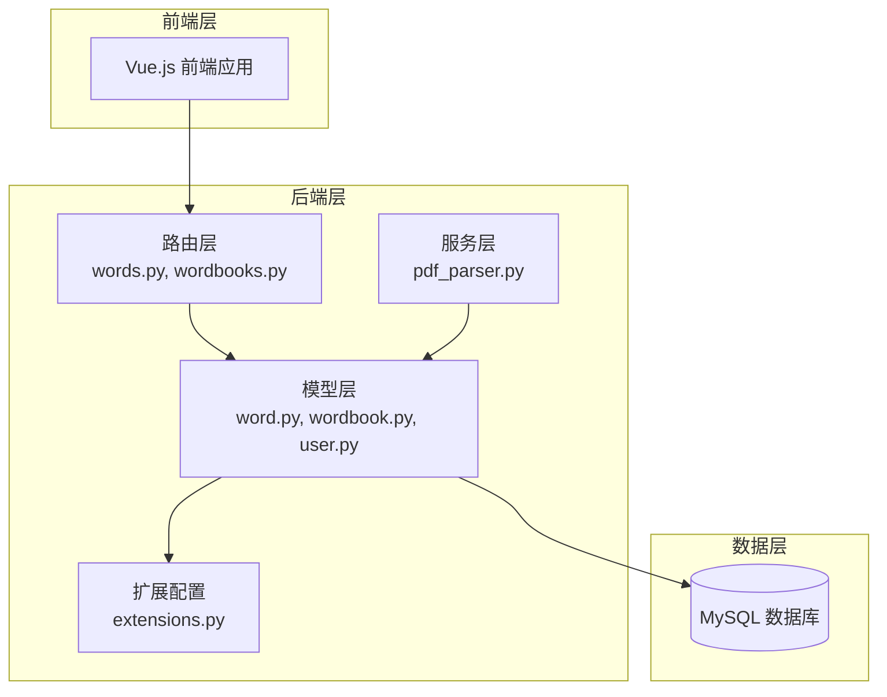
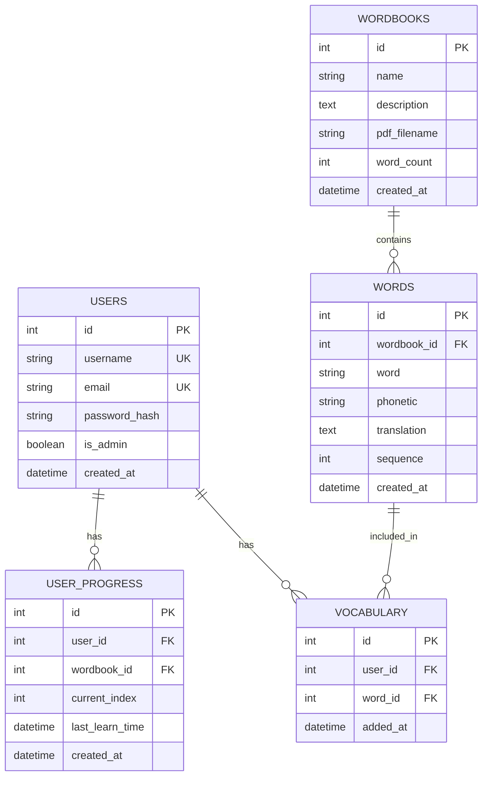
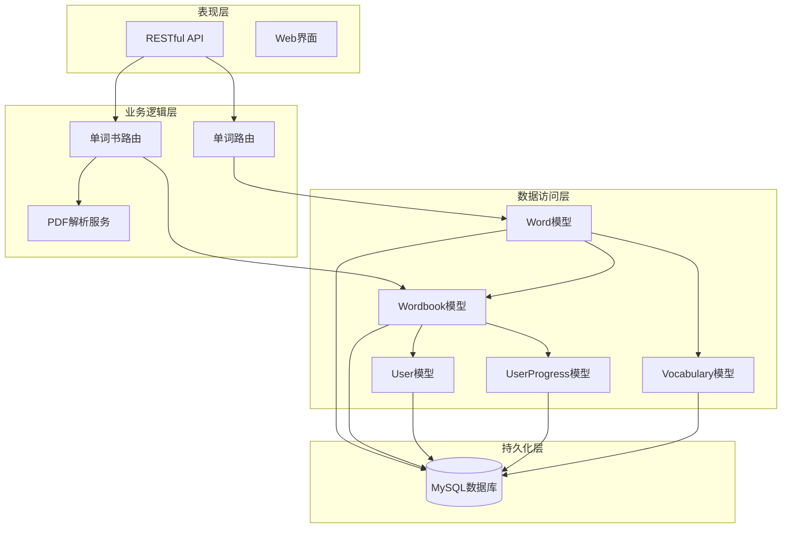
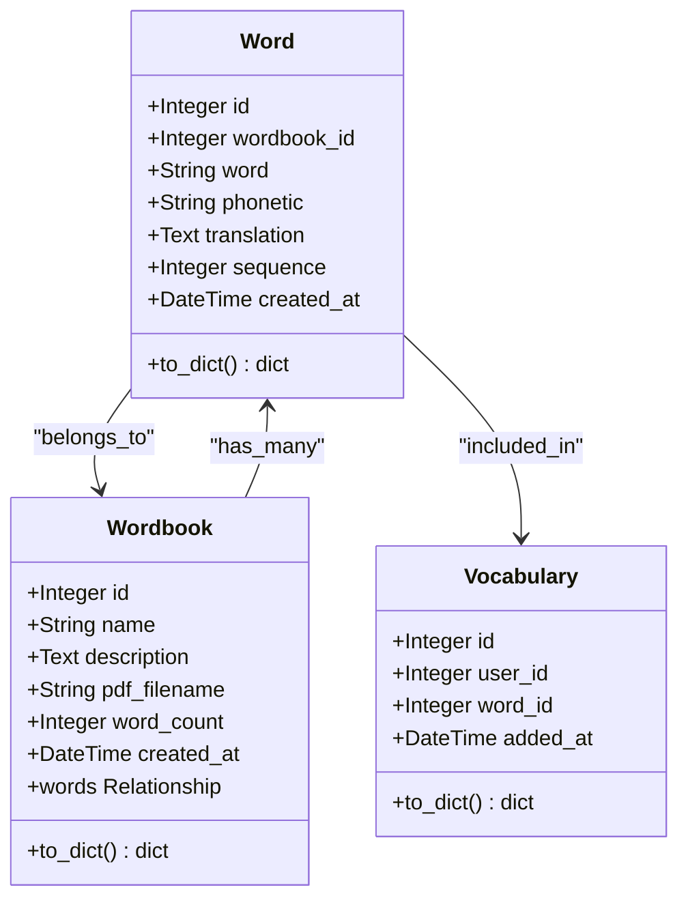
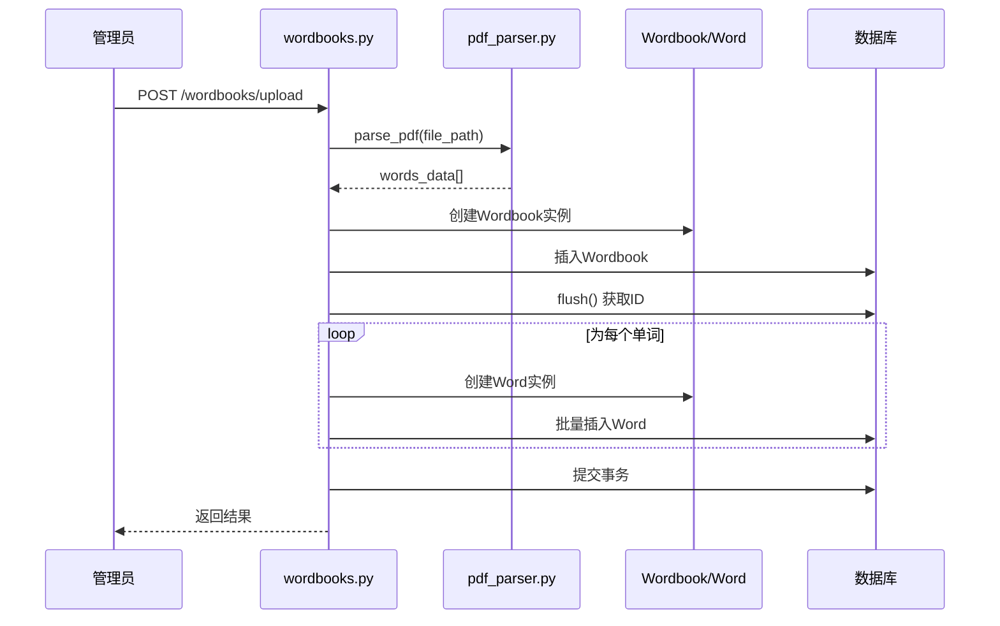
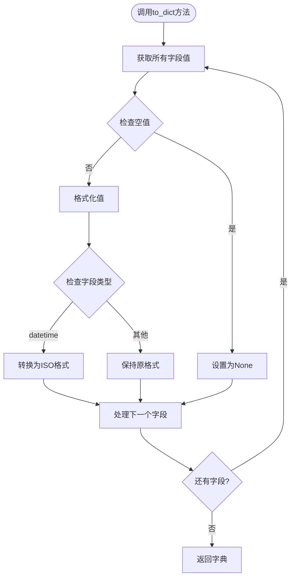
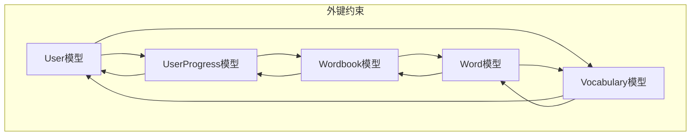
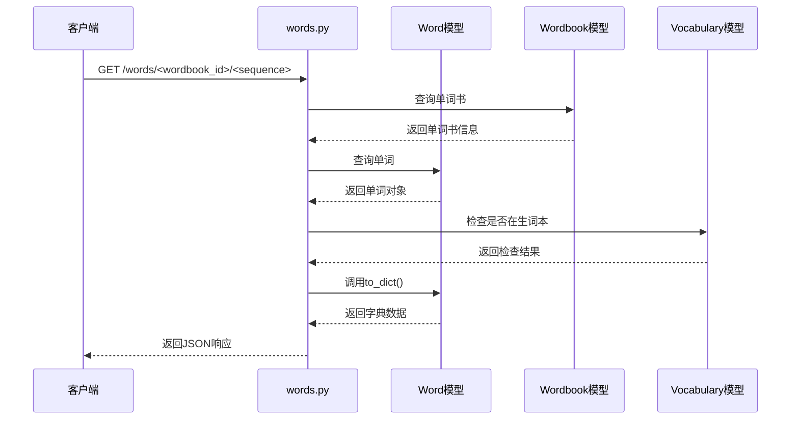

# 单词数据模型设计

<cite>
**本文档引用的文件**
- [word.py](file://backend/app/models/word.py)
- [wordbook.py](file://backend/app/models/wordbook.py)
- [vocabulary.py](file://backend/app/models/vocabulary.py)
- [user_progress.py](file://backend/app/models/user_progress.py)
- [user.py](file://backend/app/models/user.py)
- [words.py](file://backend/app/routes/words.py)
- [wordbooks.py](file://backend/app/routes/wordbooks.py)
- [pdf_parser.py](file://backend/app/services/pdf_parser.py)
- [extensions.py](file://backend/app/extensions.py)
- [init.sql](file://init.sql)
</cite>

## 目录
1. [简介](#简介)
2. [项目结构](#项目结构)
3. [核心组件](#核心组件)
4. [架构概览](#架构概览)
5. [详细组件分析](#详细组件分析)
6. [依赖关系分析](#依赖关系分析)
7. [性能考虑](#性能考虑)
8. [故障排除指南](#故障排除指南)
9. [结论](#结论)

## 简介

本文件详细阐述了单词网站项目的单词数据模型设计，重点分析Word模型的字段定义、数据类型和约束条件。该系统采用Flask + SQLAlchemy架构，实现了完整的单词学习管理功能，包括单词书管理、单词导入、学习进度跟踪和生词本管理等核心业务模块。

## 项目结构

该项目采用分层架构设计，主要包含以下层次：

**图表来源**
- [word.py](file://backend/app/models/word.py#L1-L29)
- [wordbook.py](file://backend/app/models/wordbook.py#L1-L25)
- [words.py](file://backend/app/routes/words.py#L1-L65)
- [wordbooks.py](file://backend/app/routes/wordbooks.py#L1-L159)

**章节来源**
- [word.py](file://backend/app/models/word.py#L1-L29)
- [wordbook.py](file://backend/app/models/wordbook.py#L1-L25)
- [extensions.py](file://backend/app/extensions.py#L1-L10)

## 核心组件

### 数据库初始化与配置

系统使用SQLAlchemy作为ORM框架，通过统一的扩展配置管理数据库连接：

- **数据库引擎**: MySQL 8.0+
- **字符集**: utf8mb4_unicode_ci
- **存储引擎**: InnoDB
- **时区**: UTC+8

### 主要数据表结构

**图表来源**
- [init.sql](file://init.sql#L6-L66)

**章节来源**
- [init.sql](file://init.sql#L1-L67)

## 架构概览

系统采用经典的三层架构模式，实现了清晰的职责分离：

**图表来源**
- [words.py](file://backend/app/routes/words.py#L1-L65)
- [wordbooks.py](file://backend/app/routes/wordbooks.py#L1-L159)
- [word.py](file://backend/app/models/word.py#L1-L29)
- [wordbook.py](file://backend/app/models/wordbook.py#L1-L25)

## 详细组件分析

### Word模型详细分析

#### 字段定义与数据类型

| 字段名 | 数据类型 | 约束条件 | 描述 | 设计考量 |
|--------|----------|----------|------|----------|
| id | Integer | PRIMARY KEY, AUTO_INCREMENT | 单词唯一标识符 | 主键索引，自增保证唯一性 |
| wordbook_id | Integer | FOREIGN KEY, NOT NULL | 单词所属单词书ID | 外键关联，确保数据完整性 |
| word | String(100) | NOT NULL | 英文单词文本 | 长度限制100字符，支持多单词短语 |
| phonetic | String(100) | NULLABLE | 音标符号 | 可选字段，支持不同音标格式 |
| translation | Text | NOT NULL | 中文释义 | 使用Text类型支持长文本释义 |
| sequence | Integer | NOT NULL | 序列号 | 决定单词在单词书中的顺序 |
| created_at | DateTime | DEFAULT NOW | 创建时间戳 | 自动记录创建时间 |

#### 外键关系设计

**图表来源**
- [word.py](file://backend/app/models/word.py#L4-L28)
- [wordbook.py](file://backend/app/models/wordbook.py#L4-L24)
- [vocabulary.py](file://backend/app/models/vocabulary.py#L4-L25)

#### 约束条件与索引设计

**唯一性约束**:
- `(wordbook_id, sequence)` 组合唯一约束：确保每个单词书内的序列号唯一
- `(user_id, word_id)` 组合唯一约束：防止用户重复添加同一单词到生词本

**索引设计**:
- 主键索引：自动为id字段创建
- 复合索引：`(wordbook_id, sequence)` 优化查询性能
- 辅助索引：`(user_id, wordbook_id)` 优化用户进度查询

**章节来源**
- [word.py](file://backend/app/models/word.py#L15-L18)
- [vocabulary.py](file://backend/app/models/vocabulary.py#L12-L14)
- [user_progress.py](file://backend/app/models/user_progress.py#L14-L17)

### Wordbook模型分析

#### 字段定义

| 字段名 | 数据类型 | 约束条件 | 描述 |
|--------|----------|----------|------|
| id | Integer | PRIMARY KEY | 单词书唯一标识符 |
| name | String(100) | NOT NULL | 单词书名称 |
| description | Text | NULLABLE | 单词书描述 |
| pdf_filename | String(255) | NULLABLE | PDF文件名 |
| word_count | Integer | DEFAULT 0 | 单词总数 |
| created_at | DateTime | DEFAULT NOW | 创建时间 |

#### 关系映射

**图表来源**
- [wordbooks.py](file://backend/app/routes/wordbooks.py#L68-L135)
- [pdf_parser.py](file://backend/app/services/pdf_parser.py#L4-L42)

**章节来源**
- [wordbook.py](file://backend/app/models/wordbook.py#L4-L24)
- [wordbooks.py](file://backend/app/routes/wordbooks.py#L68-L135)

### 序列化机制

#### to_dict()方法实现

Word模型提供了完整的序列化机制：

**图表来源**
- [word.py](file://backend/app/models/word.py#L20-L28)
- [wordbook.py](file://backend/app/models/wordbook.py#L17-L24)

**章节来源**
- [word.py](file://backend/app/models/word.py#L20-L28)
- [wordbook.py](file://backend/app/models/wordbook.py#L17-L24)

### 数据验证规则

#### 业务约束

1. **唯一性约束**
   - 用户名和邮箱在用户表中必须唯一
   - 单词书名称在系统中必须唯一
   - `(wordbook_id, sequence)` 组合在单词表中必须唯一

2. **长度限制**
   - 用户名最大50字符
   - 邮箱最大100字符
   - 单词最大100字符
   - 音标最大100字符
   - PDF文件名最大255字符

3. **非空约束**
   - 单词书名称必须存在
   - 单词文本必须存在
   - 中文释义必须存在
   - 序列号必须存在

4. **外键约束**
   - 单词必须关联到有效的单词书
   - 用户进度必须关联到有效用户和单词书
   - 生词本必须关联到有效用户和单词

**章节来源**
- [init.sql](file://init.sql#L6-L66)
- [word.py](file://backend/app/models/word.py#L7-L12)

## 依赖关系分析

### 模型间依赖关系

**图表来源**
- [user.py](file://backend/app/models/user.py#L4-L25)
- [user_progress.py](file://backend/app/models/user_progress.py#L4-L28)
- [vocabulary.py](file://backend/app/models/vocabulary.py#L4-L25)
- [word.py](file://backend/app/models/word.py#L4-L28)
- [wordbook.py](file://backend/app/models/wordbook.py#L4-L24)

### 路由层交互

#### 单词查询流程

**图表来源**
- [words.py](file://backend/app/routes/words.py#L10-L38)

**章节来源**
- [words.py](file://backend/app/routes/words.py#L1-L65)
- [wordbooks.py](file://backend/app/routes/wordbooks.py#L1-L159)

## 性能考虑

### 查询优化策略

1. **索引优化**
   - 在`(wordbook_id, sequence)`上建立复合索引，优化按单词书和序列号的查询
   - 在`(user_id, wordbook_id)`上建立复合索引，优化用户学习进度查询
   - 在`email`和`username`上建立索引，优化用户登录查询

2. **批量操作**
   - 使用`flush()`获取主键ID后进行批量插入，减少数据库往返次数
   - 批量插入单词时使用单个事务，确保数据一致性

3. **缓存策略**
   - 对热门单词书信息进行缓存
   - 对用户学习进度进行本地缓存

### 存储优化

1. **数据类型选择**
   - 使用`TEXT`类型存储释义，避免VARCHAR长度限制
   - 使用`utf8mb4`字符集支持完整的Unicode字符

2. **外键级联**
   - 删除单词书时自动删除其所有单词
   - 删除用户时自动清理相关进度和生词本

## 故障排除指南

### 常见问题及解决方案

#### 数据库连接问题
- **症状**: 应用启动时报数据库连接错误
- **原因**: 数据库配置不正确或数据库服务未启动
- **解决**: 检查`.env`文件中的数据库连接字符串

#### 外键约束冲突
- **症状**: 插入单词时报外键约束错误
- **原因**: 指定的`wordbook_id`不存在
- **解决**: 确保单词书ID有效且存在

#### 唯一性约束冲突
- **症状**: 更新单词序列时报唯一性约束错误
- **原因**: `(wordbook_id, sequence)`组合已存在
- **解决**: 修改序列号或删除重复记录

#### PDF解析失败
- **症状**: 上传PDF后无法解析单词
- **原因**: PDF格式不符合预期或解析正则表达式不匹配
- **解决**: 检查PDF格式，确保每行符合`单词 [音标] 中文`格式

**章节来源**
- [wordbooks.py](file://backend/app/routes/wordbooks.py#L131-L135)
- [pdf_parser.py](file://backend/app/services/pdf_parser.py#L39-L42)

## 结论

该单词数据模型设计充分体现了现代Web应用的最佳实践：

1. **数据完整性**: 通过外键约束和唯一性约束确保数据一致性
2. **查询性能**: 合理的索引设计和批量操作优化查询性能
3. **可扩展性**: 清晰的模型关系和模块化设计便于功能扩展
4. **用户体验**: 完整的序列化机制和错误处理提升用户体验

系统采用的技术栈成熟稳定，能够满足单词学习应用的各种需求。通过合理的数据库设计和API接口，为用户提供流畅的单词学习体验。