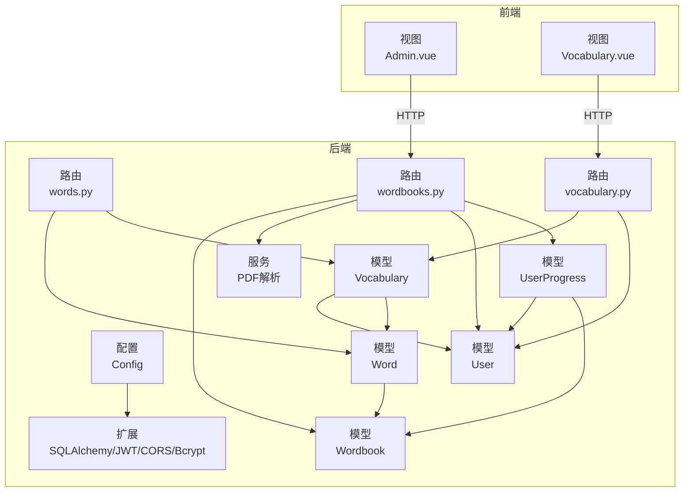
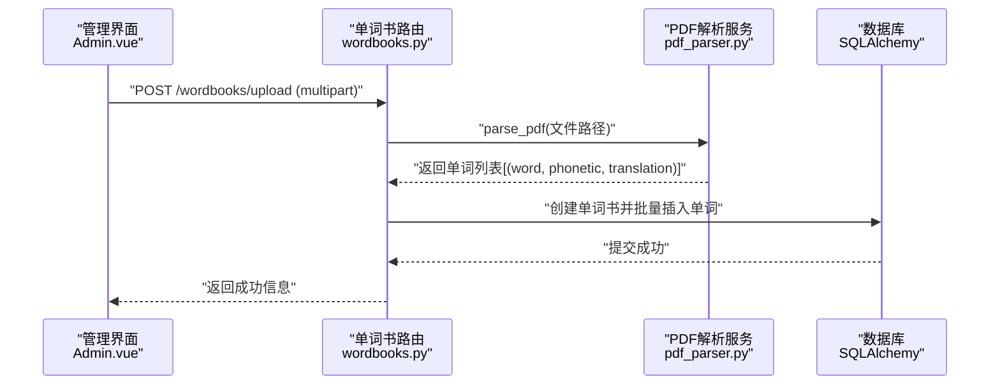
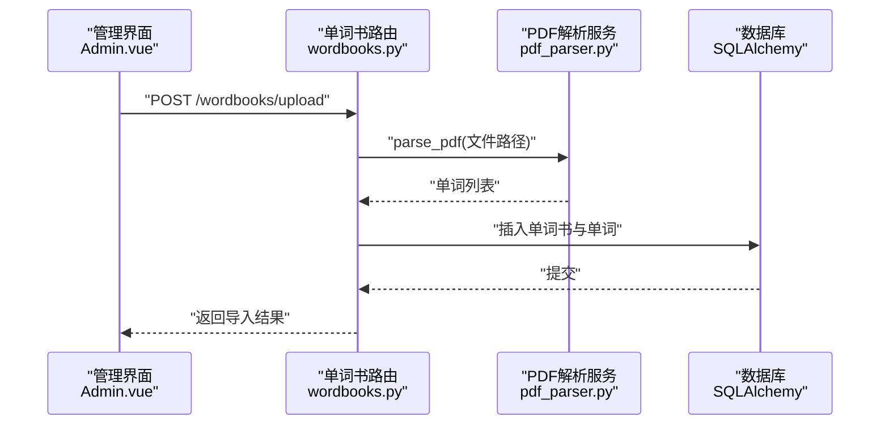
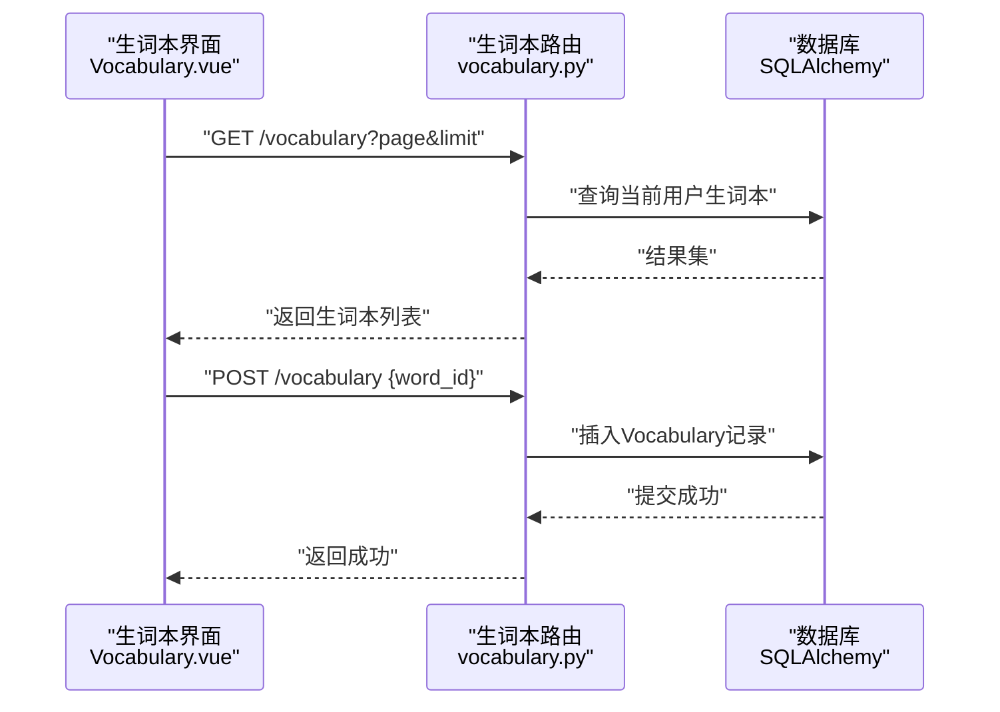
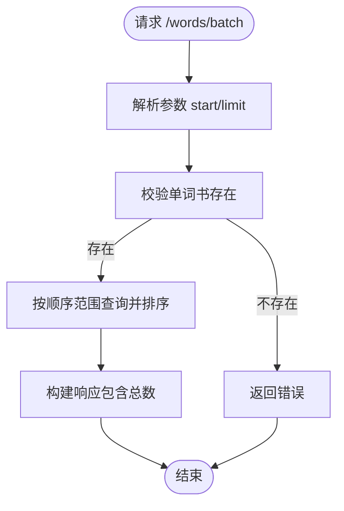
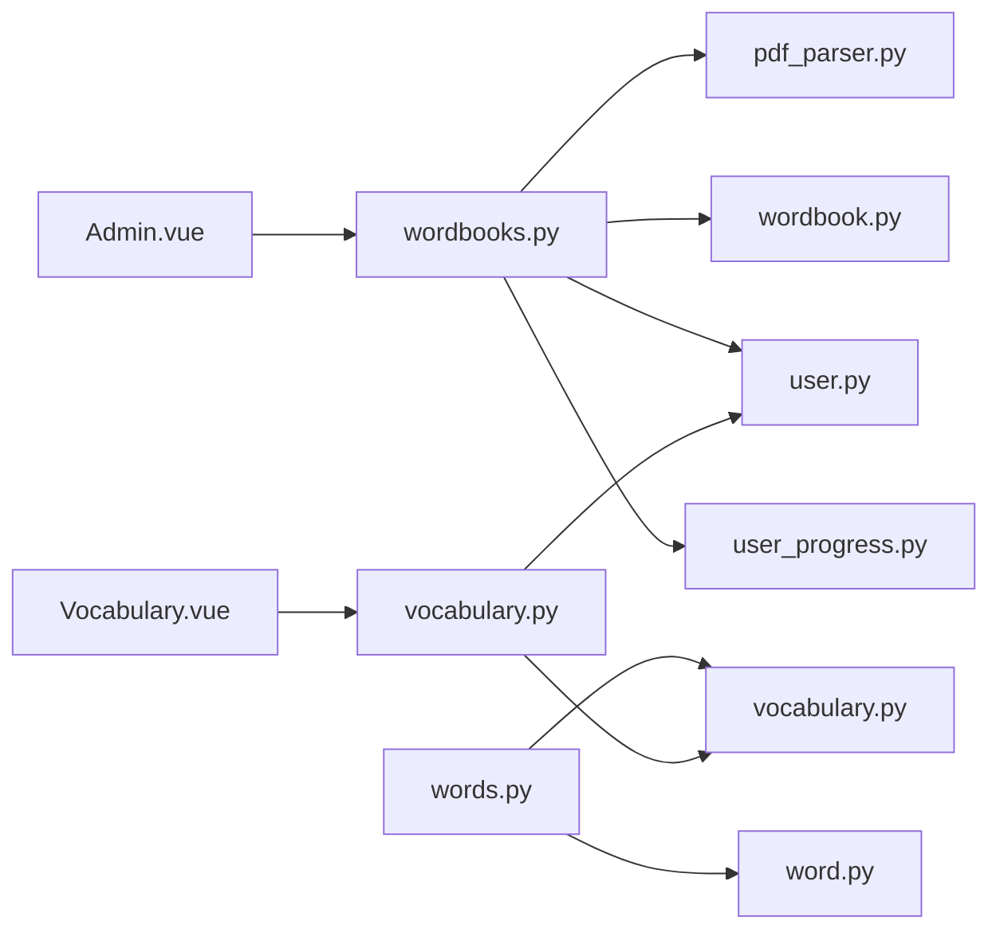

# 单词管理系统

<cite>
**本文引用的文件**
- [backend/app/models/word.py](file://backend/app/models/word.py)
- [backend/app/models/wordbook.py](file://backend/app/models/wordbook.py)
- [backend/app/models/vocabulary.py](file://backend/app/models/vocabulary.py)
- [backend/app/models/user.py](file://backend/app/models/user.py)
- [backend/app/models/user_progress.py](file://backend/app/models/user_progress.py)
- [backend/app/routers/words.py](file://backend/app/routes/words.py)
- [backend/app/routers/wordbooks.py](file://backend/app/routes/wordbooks.py)
- [backend/app/routers/vocabulary.py](file://backend/app/routes/vocabulary.py)
- [backend/app/services/pdf_parser.py](file://backend/app/services/pdf_parser.py)
- [backend/app/config.py](file://backend/app/config.py)
- [backend/app/extensions.py](file://backend/app/extensions.py)
- [frontend/src/views/Admin.vue](file://frontend/src/views/Admin.vue)
- [frontend/src/views/Vocabulary.vue](file://frontend/src/views/Vocabulary.vue)
- [README_CN.md](file://README_CN.md)
</cite>

## 目录
1. [简介](#简介)
2. [项目结构](#项目结构)
3. [核心组件](#核心组件)
4. [架构总览](#架构总览)
5. [详细组件分析](#详细组件分析)
6. [依赖关系分析](#依赖关系分析)
7. [性能考虑](#性能考虑)
8. [故障排查指南](#故障排查指南)
9. [结论](#结论)
10. [附录](#附录)

## 简介
本系统是一个基于 Flask + Vue 3 的单词学习平台，提供单词的增删改查、组织管理、批量操作、生词本管理、学习进度追踪以及 PDF 单词导入等能力。系统采用前后端分离架构，后端通过蓝图提供 REST 接口，前端通过 HTTP 客户端调用接口实现交互。

## 项目结构
- 后端（Flask）
  - models：定义数据库模型（单词、单词书、用户、生词本、学习进度）
  - routes：定义 API 蓝图（单词、单词书、生词本、进度、认证等）
  - services：提供 PDF 解析等服务
  - config、extensions：配置与扩展初始化
- 前端（Vue 3）
  - views：页面组件（管理后台、生词本等）
  - api/http.js：HTTP 客户端封装
  - router：前端路由
  - stores：状态管理（如认证、学习）



图表来源
- [backend/app/config.py](file://backend/app/config.py#L1-L28)
- [backend/app/extensions.py](file://backend/app/extensions.py#L1-L10)
- [backend/app/models/word.py](file://backend/app/models/word.py#L1-L29)
- [backend/app/models/wordbook.py](file://backend/app/models/wordbook.py#L1-L25)
- [backend/app/models/vocabulary.py](file://backend/app/models/vocabulary.py#L1-L26)
- [backend/app/models/user.py](file://backend/app/models/user.py#L1-L26)
- [backend/app/models/user_progress.py](file://backend/app/models/user_progress.py#L1-L29)
- [backend/app/services/pdf_parser.py](file://backend/app/services/pdf_parser.py#L1-L43)
- [backend/app/routes/words.py](file://backend/app/routes/words.py#L1-L65)
- [backend/app/routes/wordbooks.py](file://backend/app/routes/wordbooks.py#L1-L159)
- [backend/app/routes/vocabulary.py](file://backend/app/routes/vocabulary.py#L1-L103)
- [frontend/src/views/Admin.vue](file://frontend/src/views/Admin.vue#L1-L264)
- [frontend/src/views/Vocabulary.vue](file://frontend/src/views/Vocabulary.vue#L1-L207)

章节来源
- [README_CN.md](file://README_CN.md#L1-L84)

## 核心组件
- 单词模型（Word）
  - 字段：主键、所属单词书、单词文本、音标、释义、顺序、创建时间；唯一约束（单词书+顺序）、索引（单词书+顺序）
  - 方法：to_dict 序列化
- 单词书模型（Wordbook）
  - 字段：主键、名称、描述、PDF 文件名、单词数量、创建时间；关系：动态级联删除的单词集合
  - 方法：to_dict 序列化
- 生词本模型（Vocabulary）
  - 字段：主键、用户ID、单词ID、添加时间；唯一约束（用户+单词），关联 Word
  - 方法：to_dict 序列化（包含单词信息）
- 用户模型（User）
  - 字段：主键、用户名、邮箱、密码哈希、是否管理员、创建时间；关系：学习进度、生词本
  - 方法：to_dict 序列化
- 学习进度模型（UserProgress）
  - 字段：主键、用户ID、单词书ID、当前索引、最后学习时间、创建时间；唯一约束（用户+单词书），索引（用户+单词书）
  - 方法：to_dict 序列化
- PDF 解析服务（pdf_parser.py）
  - 功能：解析 PDF 文本，按正则提取“英文单词 [音标] 中文释义”，返回列表

章节来源
- [backend/app/models/word.py](file://backend/app/models/word.py#L1-L29)
- [backend/app/models/wordbook.py](file://backend/app/models/wordbook.py#L1-L25)
- [backend/app/models/vocabulary.py](file://backend/app/models/vocabulary.py#L1-L26)
- [backend/app/models/user.py](file://backend/app/models/user.py#L1-L26)
- [backend/app/models/user_progress.py](file://backend/app/models/user_progress.py#L1-L29)
- [backend/app/services/pdf_parser.py](file://backend/app/services/pdf_parser.py#L1-L43)

## 架构总览
系统采用前后端分离，后端以蓝图组织 API，使用 JWT 进行鉴权，SQLAlchemy 进行 ORM 映射，CORS 支持跨域，Bcrypt 处理密码哈希。前端通过 HTTP 客户端调用后端接口，实现单词书管理、生词本管理、学习进度查询等。



图表来源
- [frontend/src/views/Admin.vue](file://frontend/src/views/Admin.vue#L146-L180)
- [backend/app/routes/wordbooks.py](file://backend/app/routes/wordbooks.py#L68-L136)
- [backend/app/services/pdf_parser.py](file://backend/app/services/pdf_parser.py#L4-L43)

## 详细组件分析

### 单词模型与关系
- 设计要点
  - 单词与单词书为多对一关系，通过外键关联
  - 通过唯一约束和索引保证“单词书内顺序唯一”，避免重复或顺序冲突
  - to_dict 提供序列化输出，便于 API 响应
- 查询与排序
  - 按顺序字段升序排列，支持分批加载（批量接口）
- 批量操作
  - 导入流程中批量插入单词，减少事务开销

```mermaid
classDiagram
class Wordbook {
+id
+name
+description
+pdf_filename
+word_count
+created_at
+words
}
class Word {
+id
+wordbook_id
+word
+phonetic
+translation
+sequence
+created_at
+to_dict()
}
Wordbook "1" <-- "many" Word : "backref : wordbook"
```

图表来源
- [backend/app/models/word.py](file://backend/app/models/word.py#L4-L29)
- [backend/app/models/wordbook.py](file://backend/app/models/wordbook.py#L4-L25)

章节来源
- [backend/app/models/word.py](file://backend/app/models/word.py#L1-L29)
- [backend/app/models/wordbook.py](file://backend/app/models/wordbook.py#L1-L25)
- [backend/app/routes/words.py](file://backend/app/routes/words.py#L41-L65)

### 单词书管理（创建、编辑、删除、分配）
- 创建（管理员）
  - 接口：POST /wordbooks/upload
  - 流程：校验文件、保存 PDF、解析单词、创建单词书、批量插入单词、提交事务
  - 权限：需要管理员权限装饰器
- 列表与详情
  - GET /wordbooks：返回单词书列表及当前用户的学习进度
  - GET /wordbooks/:id：返回单词书详情
- 删除（管理员）
  - 接口：DELETE /wordbooks/:id
  - 流程：删除相关学习进度、删除 PDF 文件、删除单词书



图表来源
- [frontend/src/views/Admin.vue](file://frontend/src/views/Admin.vue#L146-L180)
- [backend/app/routes/wordbooks.py](file://backend/app/routes/wordbooks.py#L68-L136)
- [backend/app/services/pdf_parser.py](file://backend/app/services/pdf_parser.py#L4-L43)

章节来源
- [backend/app/routes/wordbooks.py](file://backend/app/routes/wordbooks.py#L1-L159)
- [frontend/src/views/Admin.vue](file://frontend/src/views/Admin.vue#L1-L264)

### 生词本管理（增删查）
- 查看生词本
  - GET /vocabulary?page&limit&wordbook_id
  - 支持按单词书过滤、分页、按添加时间倒序
- 添加单词到生词本
  - POST /vocabulary（JSON：word_id）
  - 唯一性约束防止重复添加
- 从生词本移除
  - DELETE /vocabulary/:id 或 DELETE /vocabulary/word/:word_id
  - 仅允许本人操作



图表来源
- [frontend/src/views/Vocabulary.vue](file://frontend/src/views/Vocabulary.vue#L95-L110)
- [backend/app/routes/vocabulary.py](file://backend/app/routes/vocabulary.py#L10-L71)

章节来源
- [backend/app/routes/vocabulary.py](file://backend/app/routes/vocabulary.py#L1-L103)
- [frontend/src/views/Vocabulary.vue](file://frontend/src/views/Vocabulary.vue#L1-L207)

### 单词查询与批量加载
- 单个单词查询
  - GET /words/:wordbook_id/:sequence
  - 返回单词详情、是否在生词本、单词书总词数
- 批量加载
  - GET /words/batch/:wordbook_id?start&limit
  - 按顺序范围查询并排序，适合前端预加载



图表来源
- [backend/app/routes/words.py](file://backend/app/routes/words.py#L41-L65)

章节来源
- [backend/app/routes/words.py](file://backend/app/routes/words.py#L1-L65)

### 学习进度与权限控制
- 学习进度
  - UserProgress 记录用户在单词书中的当前索引与最后学习时间
  - 与 User、Wordbook 多对一关联
- 权限控制
  - 管理员装饰器：仅管理员可上传与删除单词书
  - 生词本操作：仅限本人操作（通过 JWT 身份验证）

```mermaid
classDiagram
class User {
+id
+username
+email
+is_admin
+progress
+vocabulary
}
class UserProgress {
+id
+user_id
+wordbook_id
+current_index
+last_learn_time
+to_dict()
}
class Wordbook {
+id
+name
+word_count
+progress
}
User "many" <-- "one" UserProgress : "backref : user"
Wordbook "many" <-- "one" UserProgress : "backref : progress"
```

图表来源
- [backend/app/models/user.py](file://backend/app/models/user.py#L4-L26)
- [backend/app/models/user_progress.py](file://backend/app/models/user_progress.py#L4-L29)
- [backend/app/models/wordbook.py](file://backend/app/models/wordbook.py#L4-L25)

章节来源
- [backend/app/models/user_progress.py](file://backend/app/models/user_progress.py#L1-L29)
- [backend/app/models/user.py](file://backend/app/models/user.py#L1-L26)
- [backend/app/routes/wordbooks.py](file://backend/app/routes/wordbooks.py#L14-L25)

## 依赖关系分析
- 组件耦合
  - 路由层依赖模型层进行数据读写
  - 服务层（PDF 解析）被路由层调用
  - 前端组件通过 HTTP 客户端调用后端接口
- 外部依赖
  - 数据库：MySQL（通过 SQLAlchemy）
  - 认证：JWT
  - 跨域：CORS
  - 加密：Bcrypt
- 索引与约束
  - 单词书+顺序唯一约束，保证顺序唯一性
  - 用户+单词唯一约束，保证生词本去重
  - 用户+单词书唯一约束，保证学习进度唯一



图表来源
- [backend/app/routes/wordbooks.py](file://backend/app/routes/wordbooks.py#L1-L159)
- [backend/app/routes/words.py](file://backend/app/routes/words.py#L1-L65)
- [backend/app/routes/vocabulary.py](file://backend/app/routes/vocabulary.py#L1-L103)
- [backend/app/services/pdf_parser.py](file://backend/app/services/pdf_parser.py#L1-L43)
- [backend/app/models/word.py](file://backend/app/models/word.py#L1-L29)
- [backend/app/models/wordbook.py](file://backend/app/models/wordbook.py#L1-L25)
- [backend/app/models/vocabulary.py](file://backend/app/models/vocabulary.py#L1-L26)
- [backend/app/models/user.py](file://backend/app/models/user.py#L1-L26)
- [backend/app/models/user_progress.py](file://backend/app/models/user_progress.py#L1-L29)
- [frontend/src/views/Admin.vue](file://frontend/src/views/Admin.vue#L1-L264)
- [frontend/src/views/Vocabulary.vue](file://frontend/src/views/Vocabulary.vue#L1-L207)

章节来源
- [backend/app/config.py](file://backend/app/config.py#L1-L28)
- [backend/app/extensions.py](file://backend/app/extensions.py#L1-L10)

## 性能考虑
- 索引优化
  - 单词表：单词书+顺序复合索引，加速范围查询与唯一性校验
  - 学习进度表：用户+单词书复合索引，加速查询与更新
- 批量操作
  - 导入时使用批量插入，减少事务次数
- 分页与预加载
  - 批量接口按范围查询并排序，前端按需加载
- 缓存与并发
  - 建议在业务层增加缓存策略（如 Redis）以降低热点查询压力
- 数据库连接池
  - 使用生产环境连接池配置，避免频繁连接开销

## 故障排查指南
- PDF 解析失败
  - 现象：上传 PDF 后提示未找到有效单词数据
  - 排查：确认 PDF 格式符合“英文单词 [音标] 中文释义”的正则要求
  - 参考：解析函数的正则模式与异常处理
- 数据库连接失败
  - 现象：后端无法连接数据库
  - 排查：检查环境变量与数据库配置，确认数据库服务运行
- 权限不足
  - 现象：上传或删除单词书返回需要管理员权限
  - 排查：确认用户 is_admin 标志位与 JWT 令牌有效性
- 生词本重复添加
  - 现象：重复添加同一单词
  - 排查：唯一约束会阻止重复，检查客户端逻辑是否正确处理响应

章节来源
- [backend/app/services/pdf_parser.py](file://backend/app/services/pdf_parser.py#L1-L43)
- [backend/app/config.py](file://backend/app/config.py#L1-L28)
- [backend/app/routes/wordbooks.py](file://backend/app/routes/wordbooks.py#L14-L25)
- [backend/app/routes/vocabulary.py](file://backend/app/routes/vocabulary.py#L61-L65)

## 结论
本系统提供了完整的单词学习管理能力，涵盖单词书导入、生词本维护、学习进度追踪与权限控制。通过合理的模型设计与索引约束，保障了数据一致性与查询效率。建议在生产环境中进一步引入缓存、连接池与监控告警，持续提升稳定性与性能。

## 附录
- 管理员与普通用户权限差异
  - 管理员：可上传 PDF 并生成单词书、可删除单词书
  - 普通用户：可浏览单词书、查看单词详情、添加/移除生词本、查看学习进度
- 单词与单词书的多对多关系说明
  - 实际上单词与单词书为多对一关系，生词本作为中间表实现用户与单词的多对多关系
- 数据一致性保证
  - 唯一约束与外键约束确保数据完整性
  - 事务包裹批量导入，失败回滚