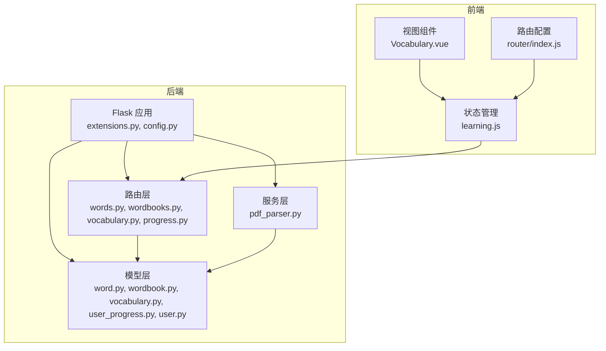
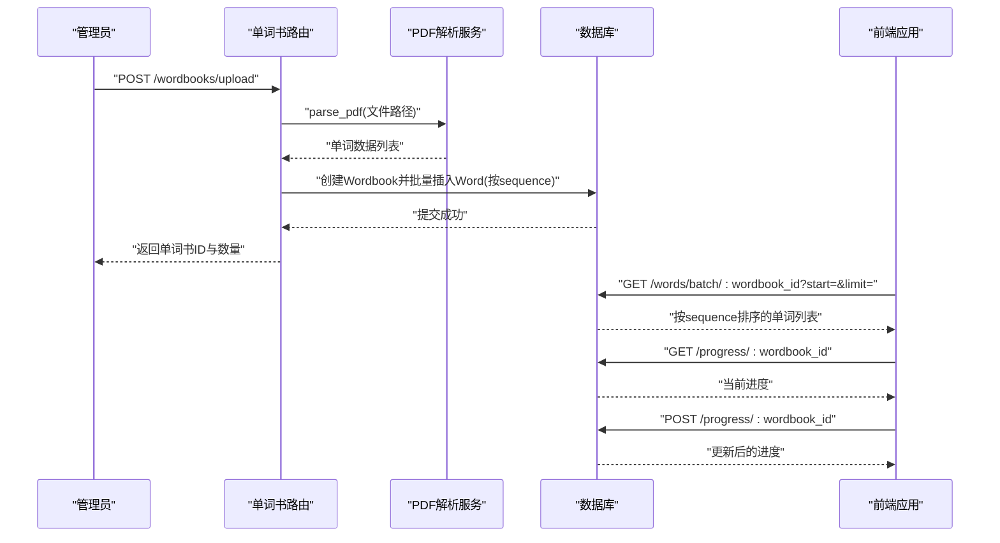
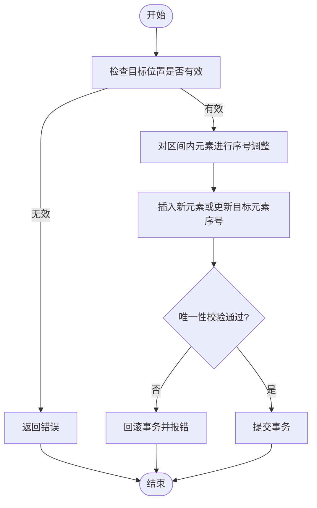
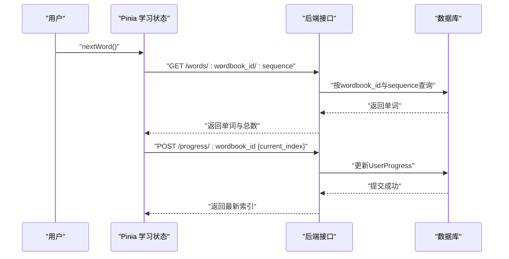
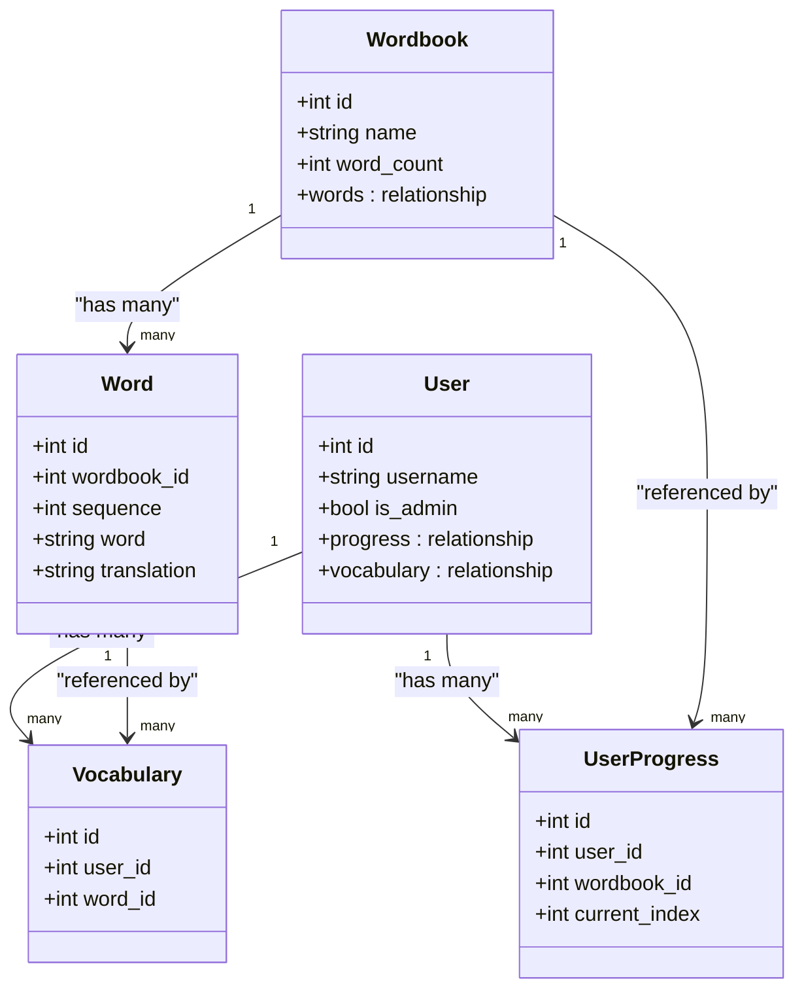

# 单词组织与排序系统

<cite>
**本文档引用的文件**
- [backend/app/models/word.py](file://backend/app/models/word.py)
- [backend/app/models/wordbook.py](file://backend/app/models/wordbook.py)
- [backend/app/models/vocabulary.py](file://backend/app/models/vocabulary.py)
- [backend/app/models/user_progress.py](file://backend/app/models/user_progress.py)
- [backend/app/models/user.py](file://backend/app/models/user.py)
- [backend/app/routes/words.py](file://backend/app/routes/words.py)
- [backend/app/routes/wordbooks.py](file://backend/app/routes/wordbooks.py)
- [backend/app/routes/vocabulary.py](file://backend/app/routes/vocabulary.py)
- [backend/app/routes/progress.py](file://backend/app/routes/progress.py)
- [backend/app/services/pdf_parser.py](file://backend/app/services/pdf_parser.py)
- [backend/app/extensions.py](file://backend/app/extensions.py)
- [backend/app/config.py](file://backend/app/config.py)
- [frontend/src/views/Vocabulary.vue](file://frontend/src/views/Vocabulary.vue)
- [frontend/src/stores/learning.js](file://frontend/src/stores/learning.js)
- [frontend/src/router/index.js](file://frontend/src/router/index.js)
</cite>

## 目录
1. [简介](#简介)
2. [项目结构](#项目结构)
3. [核心组件](#核心组件)
4. [架构总览](#架构总览)
5. [详细组件分析](#详细组件分析)
6. [依赖关系分析](#依赖关系分析)
7. [性能考虑](#性能考虑)
8. [故障排查指南](#故障排查指南)
9. [结论](#结论)
10. [附录](#附录)

## 简介
本系统围绕“单词书”进行组织与排序，核心思想是通过 sequence 字段实现稳定的线性顺序，结合数据库唯一约束与索引保障顺序一致性与查询效率。系统支持：
- 插入排序：按顺序编号插入，保持连续性
- 移动排序：通过调整目标位置前后元素的序号实现插入或搬移
- 重新编号：当序列出现空洞或批量调整后，对后续元素进行统一重排
- 动态排序能力：通过接口暴露的批量获取与进度控制，为前端拖拽排序、批量调整与智能重排提供基础
- 分类与标签：当前模型未直接提供难度、主题、自定义标签字段，可通过扩展字段或关联表实现
- 搜索与筛选：当前未提供全文搜索与高级筛选接口，可基于现有字段扩展

## 项目结构
后端采用 Flask + SQLAlchemy 架构，模型层定义数据结构与约束，路由层提供 REST 接口，服务层处理 PDF 解析等业务逻辑；前端使用 Vue + Pinia 实现学习与生词本页面。

图表来源
- [backend/app/extensions.py](file://backend/app/extensions.py#L1-L10)
- [backend/app/config.py](file://backend/app/config.py#L1-L28)
- [backend/app/models/word.py](file://backend/app/models/word.py#L1-L29)
- [backend/app/models/wordbook.py](file://backend/app/models/wordbook.py#L1-L25)
- [backend/app/models/vocabulary.py](file://backend/app/models/vocabulary.py#L1-L26)
- [backend/app/models/user_progress.py](file://backend/app/models/user_progress.py#L1-L29)
- [backend/app/models/user.py](file://backend/app/models/user.py#L1-L26)
- [backend/app/routes/words.py](file://backend/app/routes/words.py#L1-L65)
- [backend/app/routes/wordbooks.py](file://backend/app/routes/wordbooks.py#L1-L159)
- [backend/app/routes/vocabulary.py](file://backend/app/routes/vocabulary.py#L1-L103)
- [backend/app/routes/progress.py](file://backend/app/routes/progress.py#L1-L115)
- [backend/app/services/pdf_parser.py](file://backend/app/services/pdf_parser.py#L1-L43)
- [frontend/src/views/Vocabulary.vue](file://frontend/src/views/Vocabulary.vue#L1-L207)
- [frontend/src/stores/learning.js](file://frontend/src/stores/learning.js#L1-L112)
- [frontend/src/router/index.js](file://frontend/src/router/index.js#L1-L64)

章节来源
- [backend/app/extensions.py](file://backend/app/extensions.py#L1-L10)
- [backend/app/config.py](file://backend/app/config.py#L1-L28)
- [frontend/src/router/index.js](file://frontend/src/router/index.js#L1-L64)

## 核心组件
- 单词模型（Word）
  - 关键字段：wordbook_id、word、phonetic、translation、sequence、created_at
  - 约束与索引：唯一约束（wordbook_id, sequence）、复合索引（wordbook_id, sequence）
  - 作用：承载单词内容与顺序，确保同一单词书内的顺序唯一性
- 单词书模型（Wordbook）
  - 关键字段：name、description、pdf_filename、word_count、created_at
  - 关系：与 Word 一对多，级联删除孤儿单词
  - 作用：组织单词集合，维护单词总数
- 生词本模型（Vocabulary）
  - 关键字段：user_id、word_id、added_at
  - 约束：唯一约束（user_id, word_id）
  - 作用：用户个人的单词收藏
- 用户进度模型（UserProgress）
  - 关键字段：user_id、wordbook_id、current_index、last_learn_time、created_at
  - 约束：唯一约束（user_id, wordbook_id），索引（user_id, wordbook_id）
  - 作用：记录用户在各单词书的学习进度
- 路由与服务
  - 单词路由：按序号获取单词、批量分段获取
  - 单词书路由：上传PDF解析、创建单词书、删除单词书
  - 生词本路由：获取、添加、移除
  - 进度路由：获取、更新、重置
  - PDF解析服务：正则提取单词、音标、翻译

章节来源
- [backend/app/models/word.py](file://backend/app/models/word.py#L1-L29)
- [backend/app/models/wordbook.py](file://backend/app/models/wordbook.py#L1-L25)
- [backend/app/models/vocabulary.py](file://backend/app/models/vocabulary.py#L1-L26)
- [backend/app/models/user_progress.py](file://backend/app/models/user_progress.py#L1-L29)
- [backend/app/routes/words.py](file://backend/app/routes/words.py#L1-L65)
- [backend/app/routes/wordbooks.py](file://backend/app/routes/wordbooks.py#L1-L159)
- [backend/app/routes/vocabulary.py](file://backend/app/routes/vocabulary.py#L1-L103)
- [backend/app/routes/progress.py](file://backend/app/routes/progress.py#L1-L115)
- [backend/app/services/pdf_parser.py](file://backend/app/services/pdf_parser.py#L1-L43)

## 架构总览
系统采用分层架构，后端负责数据持久化与业务逻辑，前端负责展示与交互。核心流程包括：管理员上传 PDF → 后端解析 → 批量写入 Word → 前端按序号学习与记录进度 → 用户可将单词加入生词本。

图表来源
- [backend/app/routes/wordbooks.py](file://backend/app/routes/wordbooks.py#L68-L135)
- [backend/app/services/pdf_parser.py](file://backend/app/services/pdf_parser.py#L4-L42)
- [backend/app/routes/words.py](file://backend/app/routes/words.py#L41-L64)
- [backend/app/routes/progress.py](file://backend/app/routes/progress.py#L53-L95)

## 详细组件分析

### 单词排序与顺序管理
- sequence 字段
  - 作用：在同一单词书内维持稳定顺序，作为主排序依据
  - 唯一性：通过唯一约束保证同一单词书内无重复序号
  - 查询效率：复合索引加速按单词书与序号的查询
- 插入排序
  - 场景：新单词插入到指定位置
  - 算法思路：将目标位置及之后的所有序号+1，再插入新单词
  - 复杂度：O(n) 需要更新受影响的后续元素
- 移动排序
  - 场景：将某单词移动到另一个位置
  - 算法思路：先将区间内元素整体+1或-1，再更新目标元素序号
  - 注意：需避免产生重复序号，必要时回滚事务
- 重新编号
  - 场景：批量删除或调整导致序号不连续
  - 算法思路：扫描剩余元素，按当前顺序重写 sequence
  - 复杂度：O(n)，适合在后台任务中执行
- 批量获取与分段加载
  - 接口：按起始序号与限制数量分段获取
  - 用途：为前端拖拽排序与智能重排提供数据基础

图表来源
- [backend/app/models/word.py](file://backend/app/models/word.py#L15-L18)
- [backend/app/routes/words.py](file://backend/app/routes/words.py#L41-L64)

章节来源
- [backend/app/models/word.py](file://backend/app/models/word.py#L1-L29)
- [backend/app/routes/words.py](file://backend/app/routes/words.py#L1-L65)

### 动态排序功能设计
- 拖拽排序
  - 前端：拖拽触发调用后端排序接口（建议新增），传入目标序号
  - 后端：执行移动排序算法，保证唯一性与连续性
- 批量调整
  - 前端：选择多个单词，一次性提交新的序号映射
  - 后端：采用原子事务，先计算临时序号，再批量更新
- 智能重排
  - 触发时机：批量删除、导入完成、手动触发
  - 后台任务：扫描并重写 sequence，保持连续

章节来源
- [backend/app/models/word.py](file://backend/app/models/word.py#L15-L18)
- [backend/app/routes/words.py](file://backend/app/routes/words.py#L41-L64)

### 分类与标签系统
- 当前实现
  - 未提供难度、主题、自定义标签字段
  - 可通过扩展字段或新增关联表实现
- 建议方案
  - 难度分级：新增 difficulty 字段（入门/中级/高级）
  - 主题分类：新增 wordbook_category 字段或独立分类表
  - 自定义标签：新增标签表与中间表关联 Word
- 影响范围
  - 路由层：新增字段的读写接口
  - 模型层：扩展字段与关系
  - 前端：增加筛选与编辑控件

章节来源
- [backend/app/models/word.py](file://backend/app/models/word.py#L1-L29)
- [backend/app/models/wordbook.py](file://backend/app/models/wordbook.py#L1-L25)

### 搜索与筛选功能
- 当前能力
  - 未提供全文搜索与高级筛选接口
  - 可基于现有字段（word、translation）扩展
- 建议实现
  - 全文搜索：在 translation 或额外的 search_text 字段建立全文索引
  - 高级筛选：支持按单词书、难度、添加时间、学习进度等条件组合查询
  - 前端：提供搜索框与筛选面板，结合分页与缓存提升体验

章节来源
- [backend/app/routes/words.py](file://backend/app/routes/words.py#L1-L65)
- [backend/app/routes/vocabulary.py](file://backend/app/routes/vocabulary.py#L1-L103)

### 学习进度与生词本集成
- 进度管理
  - 获取进度：按单词书返回 current_index、total_words、百分比
  - 更新进度：提交 current_index 并更新最后学习时间
  - 重置进度：将 current_index 设为 1
- 生词本
  - 获取：支持按单词书过滤，分页展示
  - 添加/移除：基于唯一约束避免重复，返回实时状态

图表来源
- [frontend/src/stores/learning.js](file://frontend/src/stores/learning.js#L52-L66)
- [backend/app/routes/words.py](file://backend/app/routes/words.py#L10-L38)
- [backend/app/routes/progress.py](file://backend/app/routes/progress.py#L53-L95)

章节来源
- [backend/app/routes/progress.py](file://backend/app/routes/progress.py#L1-L115)
- [backend/app/routes/vocabulary.py](file://backend/app/routes/vocabulary.py#L1-L103)
- [frontend/src/stores/learning.js](file://frontend/src/stores/learning.js#L1-L112)

## 依赖关系分析
- 模型间关系
  - Wordbook 与 Word：一对多，级联删除孤儿单词
  - User 与 UserProgress/Vocabulary：一对多
  - Vocabulary 与 Word：多对一
- 路由依赖
  - 单词路由依赖 Wordbook 与 Vocabulary
  - 单词书路由依赖 PDF 解析服务
  - 进度路由依赖 Wordbook 与 UserProgress
- 前端依赖
  - 学习状态依赖后端进度与单词接口
  - 生词本页面依赖后端生词本接口

图表来源
- [backend/app/models/wordbook.py](file://backend/app/models/wordbook.py#L14-L15)
- [backend/app/models/word.py](file://backend/app/models/word.py#L7-L12)
- [backend/app/models/user.py](file://backend/app/models/user.py#L14-L16)
- [backend/app/models/user_progress.py](file://backend/app/models/user_progress.py#L7-L11)
- [backend/app/models/vocabulary.py](file://backend/app/models/vocabulary.py#L7-L10)

章节来源
- [backend/app/models/wordbook.py](file://backend/app/models/wordbook.py#L1-L25)
- [backend/app/models/word.py](file://backend/app/models/word.py#L1-L29)
- [backend/app/models/user.py](file://backend/app/models/user.py#L1-L26)
- [backend/app/models/user_progress.py](file://backend/app/models/user_progress.py#L1-L29)
- [backend/app/models/vocabulary.py](file://backend/app/models/vocabulary.py#L1-L26)

## 性能考虑
- 索引优化
  - 已有：Word 的 (wordbook_id, sequence) 复合索引；UserProgress 的 (user_id, wordbook_id) 复合索引
  - 建议：在 translation 或新增的 search_text 字段上建立全文索引；在 created_at 上建立索引以支持按时间排序
- 查询缓存
  - 对高频访问的单词书列表与单词详情，可在应用层引入缓存（如 Redis）
  - 缓存键：wordbook_list、word_detail:{wordbook_id}:{sequence}
- 批量操作
  - 导入：使用批量插入减少往返开销
  - 排序：在单次事务中完成批量更新，避免多次往返
- 分页与分段加载
  - 使用批量接口按段获取单词，降低单次响应大小
- 数据库连接池与慢查询
  - 配置连接池大小，监控慢查询日志，定位瓶颈

章节来源
- [backend/app/models/word.py](file://backend/app/models/word.py#L15-L18)
- [backend/app/models/user_progress.py](file://backend/app/models/user_progress.py#L14-L17)
- [backend/app/routes/words.py](file://backend/app/routes/words.py#L41-L64)

## 故障排查指南
- 常见问题
  - 单词不存在：检查 wordbook_id 与 sequence 是否正确
  - 权限不足：确认 JWT Token 与管理员身份
  - 索引越界：更新进度时确保 current_index 在 [1, word_count] 范围内
  - 重复添加：生词本唯一约束防止重复，需先移除再添加
- 排查步骤
  - 后端：查看请求参数、数据库约束冲突、异常堆栈
  - 前端：确认路由参数、状态更新、网络请求结果
- 错误码与提示
  - 404：资源不存在
  - 400：参数错误或越界
  - 403：权限不足
  - 500：服务器内部错误

章节来源
- [backend/app/routes/words.py](file://backend/app/routes/words.py#L10-L38)
- [backend/app/routes/wordbooks.py](file://backend/app/routes/wordbooks.py#L138-L158)
- [backend/app/routes/progress.py](file://backend/app/routes/progress.py#L69-L71)
- [backend/app/routes/vocabulary.py](file://backend/app/routes/vocabulary.py#L44-L70)

## 结论
本系统以 sequence 字段为核心实现了稳定的单词排序机制，并通过唯一约束与索引保障了顺序一致性与查询效率。当前未提供难度、主题、标签与全文搜索功能，但具备良好的扩展点。建议在保持现有顺序模型的基础上，逐步引入分类标签与搜索能力，并完善动态排序接口以支撑更丰富的交互体验。

## 附录
- 最佳实践
  - 新增单词时优先使用插入排序，避免破坏现有顺序
  - 批量调整时使用事务包裹，确保原子性
  - 定期执行重新编号任务，保持序号连续
  - 前端采用分页与缓存，提升大词库场景下的交互性能
- 用户体验优化
  - 提供拖拽排序与批量调整入口
  - 增加搜索与筛选，支持多维条件组合
  - 显示学习进度与完成状态，增强成就感