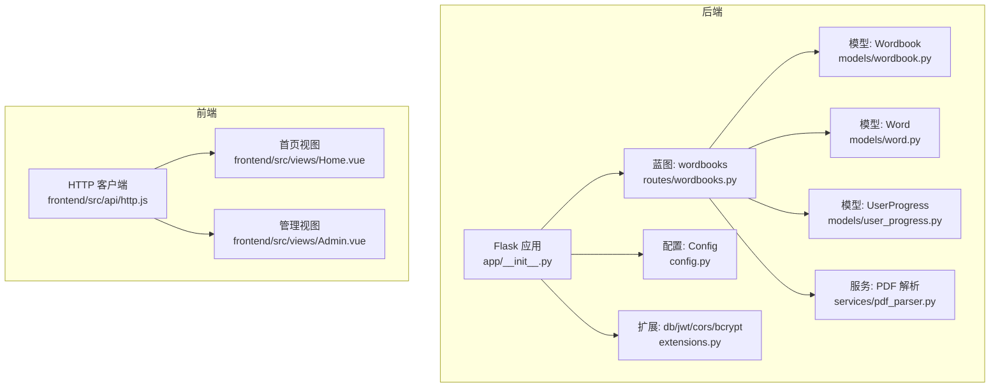
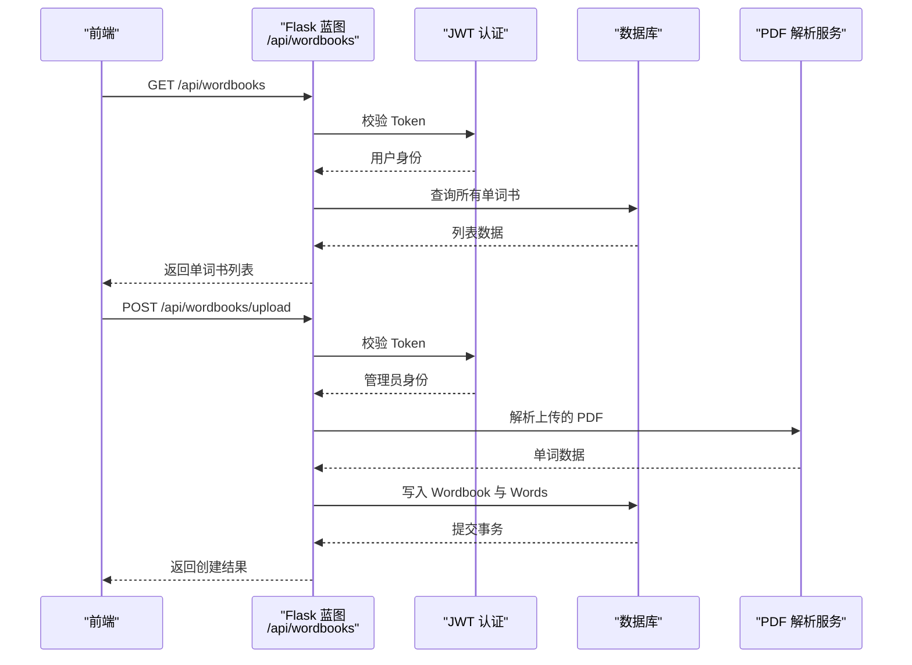
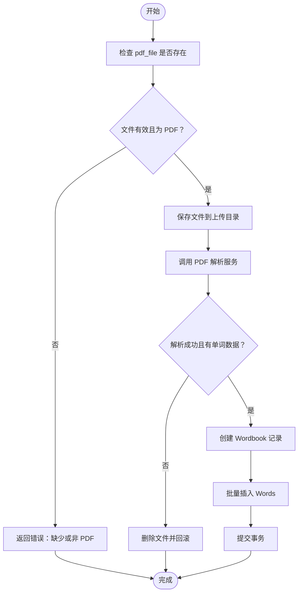
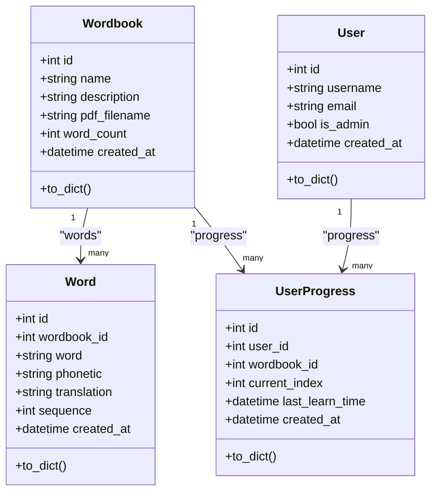

# 单词书接口

<cite>
**本文引用的文件**
- [backend/app/routes/wordbooks.py](file://backend/app/routes/wordbooks.py)
- [backend/app/models/wordbook.py](file://backend/app/models/wordbook.py)
- [backend/app/models/word.py](file://backend/app/models/word.py)
- [backend/app/models/user_progress.py](file://backend/app/models/user_progress.py)
- [backend/app/models/user.py](file://backend/app/models/user.py)
- [backend/app/services/pdf_parser.py](file://backend/app/services/pdf_parser.py)
- [backend/app/config.py](file://backend/app/config.py)
- [backend/app/extensions.py](file://backend/app/extensions.py)
- [backend/app/__init__.py](file://backend/app/__init__.py)
- [backend/wsgi.py](file://backend/wsgi.py)
- [frontend/src/api/http.js](file://frontend/src/api/http.js)
- [frontend/src/views/Home.vue](file://frontend/src/views/Home.vue)
- [frontend/src/views/Admin.vue](file://frontend/src/views/Admin.vue)
</cite>

## 目录
1. [简介](#简介)
2. [项目结构](#项目结构)
3. [核心组件](#核心组件)
4. [架构总览](#架构总览)
5. [详细组件分析](#详细组件分析)
6. [依赖关系分析](#依赖关系分析)
7. [性能考虑](#性能考虑)
8. [故障排查指南](#故障排查指南)
9. [结论](#结论)
10. [附录](#附录)

## 简介
本文件为“单词书管理接口”的详细 API 文档，覆盖单词书的 CRUD 全流程：获取列表、获取详情、上传并解析 PDF 创建单词书、删除单词书。文档同时说明：
- 接口的 HTTP 方法、URL 模式、请求参数与响应格式
- 单词书数据模型字段及校验规则
- 权限控制机制（管理员与普通用户）
- 文件上传处理流程（PDF 接收、存储、解析与预览）
- 前端集成指南与数据交互模式

## 项目结构
后端采用 Flask 蓝图组织路由，单词书相关逻辑集中在 wordbooks 蓝图；前端使用 Vue 3 + Axios 与后端进行 API 通信。应用通过 WSGI 启动，蓝图统一挂载到 /api 前缀下。

图表来源
- [backend/app/__init__.py](file://backend/app/__init__.py#L19-L30)
- [backend/app/routes/wordbooks.py](file://backend/app/routes/wordbooks.py#L1-L159)
- [backend/app/models/wordbook.py](file://backend/app/models/wordbook.py#L1-L25)
- [backend/app/models/word.py](file://backend/app/models/word.py#L1-L29)
- [backend/app/models/user_progress.py](file://backend/app/models/user_progress.py#L1-L29)
- [backend/app/services/pdf_parser.py](file://backend/app/services/pdf_parser.py#L1-L43)
- [backend/app/config.py](file://backend/app/config.py#L1-L28)
- [frontend/src/api/http.js](file://frontend/src/api/http.js#L1-L48)
- [frontend/src/views/Home.vue](file://frontend/src/views/Home.vue#L74-L93)
- [frontend/src/views/Admin.vue](file://frontend/src/views/Admin.vue#L121-L180)

章节来源
- [backend/app/__init__.py](file://backend/app/__init__.py#L1-L37)
- [backend/app/routes/wordbooks.py](file://backend/app/routes/wordbooks.py#L1-L159)
- [frontend/src/api/http.js](file://frontend/src/api/http.js#L1-L48)

## 核心组件
- 路由蓝图：负责单词书的 CRUD 与上传解析
- 模型层：Wordbook、Word、UserProgress、User
- 服务层：PDF 解析服务
- 配置与扩展：数据库、JWT、CORS、文件上传大小限制
- 前端：Axios 封装、路由拦截、页面调用

章节来源
- [backend/app/models/wordbook.py](file://backend/app/models/wordbook.py#L1-L25)
- [backend/app/models/word.py](file://backend/app/models/word.py#L1-L29)
- [backend/app/models/user_progress.py](file://backend/app/models/user_progress.py#L1-L29)
- [backend/app/models/user.py](file://backend/app/models/user.py#L1-L26)
- [backend/app/services/pdf_parser.py](file://backend/app/services/pdf_parser.py#L1-L43)
- [backend/app/config.py](file://backend/app/config.py#L25-L28)
- [backend/app/extensions.py](file://backend/app/extensions.py#L1-L10)

## 架构总览
后端通过蓝图将 /api/wordbooks 暴露为 RESTful 接口，JWT 用于认证，管理员权限装饰器保护上传与删除操作。前端通过 Axios 发起请求，自动注入 Authorization 头。

图表来源
- [backend/app/routes/wordbooks.py](file://backend/app/routes/wordbooks.py#L28-L159)
- [backend/app/services/pdf_parser.py](file://backend/app/services/pdf_parser.py#L4-L43)
- [frontend/src/api/http.js](file://frontend/src/api/http.js#L12-L23)

## 详细组件分析

### 权限控制机制
- 普通用户权限：访问单词书列表与详情需登录（JWT 必要）
- 管理员权限：上传单词书、删除单词书需管理员身份
- 管理员装饰器会从 JWT 中获取用户 ID，并查询用户是否为管理员

章节来源
- [backend/app/routes/wordbooks.py](file://backend/app/routes/wordbooks.py#L14-L25)
- [backend/app/models/user.py](file://backend/app/models/user.py#L11-L11)

### 数据模型与字段定义
- Wordbook（单词书）
  - 字段：id、name、description、pdf_filename、word_count、created_at
  - 关系：与 Word 的一对多（级联删除）
- Word（单词）
  - 字段：id、wordbook_id、word、phonetic、translation、sequence、created_at
  - 约束：唯一索引（wordbook_id, sequence）
- UserProgress（用户学习进度）
  - 字段：id、user_id、wordbook_id、current_index、last_learn_time、created_at
  - 约束：唯一索引（user_id, wordbook_id）

章节来源
- [backend/app/models/wordbook.py](file://backend/app/models/wordbook.py#L4-L24)
- [backend/app/models/word.py](file://backend/app/models/word.py#L4-L28)
- [backend/app/models/user_progress.py](file://backend/app/models/user_progress.py#L4-L28)

### API 接口规范

#### 获取单词书列表
- 方法与路径：GET /api/wordbooks
- 认证：需要 JWT
- 响应字段：
  - success: 布尔值
  - wordbooks: 数组，每个元素包含：
    - id、name、description、word_count、created_at
    - user_progress: 当前用户对该单词书的学习进度（可选），包含：
      - current_index、last_learn_time

章节来源
- [backend/app/routes/wordbooks.py](file://backend/app/routes/wordbooks.py#L28-L54)
- [backend/app/models/user_progress.py](file://backend/app/models/user_progress.py#L21-L28)

#### 获取单个单词书详情
- 方法与路径：GET /api/wordbooks/{wordbook_id}
- 认证：需要 JWT
- 响应字段：
  - success: 布尔值
  - wordbook: 包含 id、name、description、word_count、created_at

章节来源
- [backend/app/routes/wordbooks.py](file://backend/app/routes/wordbooks.py#L57-L65)

#### 上传并解析 PDF 创建单词书（管理员）
- 方法与路径：POST /api/wordbooks/upload
- 认证：需要 JWT + 管理员身份
- 请求类型：multipart/form-data
- 表单字段：
  - name: 字符串，必填，非空
  - description: 字符串，可选
  - pdf_file: 文件，必填，必须是 .pdf
- 成功响应字段：
  - success: 布尔值
  - message: 字符串
  - wordbook_id: 新建单词书 ID
  - word_count: 导入的单词数量
- 错误响应字段：
  - success: false
  - message: 错误信息

章节来源
- [backend/app/routes/wordbooks.py](file://backend/app/routes/wordbooks.py#L68-L135)
- [backend/app/services/pdf_parser.py](file://backend/app/services/pdf_parser.py#L4-L43)
- [backend/app/config.py](file://backend/app/config.py#L25-L28)

#### 删除单词书（管理员）
- 方法与路径：DELETE /api/wordbooks/{wordbook_id}
- 认证：需要 JWT + 管理员身份
- 删除行为：
  - 删除 UserProgress 中对应记录
  - 删除上传目录中的 PDF 文件
  - 删除 Wordbook 及其关联的 Words
- 响应字段：
  - success: 布尔值
  - message: 成功信息

章节来源
- [backend/app/routes/wordbooks.py](file://backend/app/routes/wordbooks.py#L138-L158)

### 文件上传处理流程
- 接收：multipart/form-data，字段名 pdf_file
- 校验：文件存在、扩展名为 .pdf、name 非空
- 存储：使用安全文件名写入 UPLOAD_FOLDER
- 解析：调用 PDF 解析服务，按固定格式提取单词、音标、翻译
- 数据库：先写 Wordbook，再批量写 Word，最后提交事务
- 异常：捕获异常回滚并删除已保存的文件

图表来源
- [backend/app/routes/wordbooks.py](file://backend/app/routes/wordbooks.py#L72-L135)
- [backend/app/services/pdf_parser.py](file://backend/app/services/pdf_parser.py#L4-L43)
- [backend/app/config.py](file://backend/app/config.py#L25-L28)

## 依赖关系分析

图表来源
- [backend/app/models/wordbook.py](file://backend/app/models/wordbook.py#L4-L24)
- [backend/app/models/word.py](file://backend/app/models/word.py#L4-L28)
- [backend/app/models/user_progress.py](file://backend/app/models/user_progress.py#L4-L28)
- [backend/app/models/user.py](file://backend/app/models/user.py#L4-L26)

章节来源
- [backend/app/models/wordbook.py](file://backend/app/models/wordbook.py#L14-L15)
- [backend/app/models/word.py](file://backend/app/models/word.py#L15-L18)
- [backend/app/models/user_progress.py](file://backend/app/models/user_progress.py#L14-L17)

## 性能考虑
- 批量插入：上传时对 Words 使用批量插入，减少数据库往返
- 索引与约束：Wordbook+sequence 的唯一索引与 idx_wordbook_sequence 索引有助于排序与去重
- 事务：上传流程在单事务中执行，保证一致性
- 文件大小限制：MAX_CONTENT_LENGTH 控制上传体积，避免过大文件导致内存压力

章节来源
- [backend/app/config.py](file://backend/app/config.py#L25-L28)
- [backend/app/models/word.py](file://backend/app/models/word.py#L15-L18)

## 故障排查指南
- 401 未授权：前端未正确携带 Authorization 头或 Token 过期
- 403 需要管理员权限：当前用户不是管理员，无法执行上传或删除
- 400 参数错误：缺少 pdf_file、文件非 PDF、name 为空
- 404 单词书不存在：请求的 wordbook_id 不存在
- 500 服务器错误：PDF 解析异常或数据库写入失败

章节来源
- [backend/app/routes/wordbooks.py](file://backend/app/routes/wordbooks.py#L72-L135)
- [frontend/src/api/http.js](file://frontend/src/api/http.js#L34-L44)

## 结论
该单词书接口设计清晰，职责分离明确：路由负责鉴权与业务编排，模型负责数据结构与约束，服务负责 PDF 解析。管理员权限与普通用户权限区分合理，上传流程具备完善的校验与容错。前端通过 Axios 统一处理认证与错误，页面直接消费接口数据。

## 附录

### 前端集成指南
- 基础配置
  - Axios 实例已设置 baseURL 为 /api，并在请求头自动附加 Authorization: Bearer token
  - 响应拦截器统一返回 data，便于页面直接使用
- 页面调用示例
  - 首页展示单词书列表：调用 GET /api/wordbooks，渲染卡片与学习进度
  - 管理页上传：构建 FormData，包含 name、description、pdf_file，POST 到 /api/wordbooks/upload
  - 管理页删除：DELETE /api/wordbooks/{wordbook_id}

章节来源
- [frontend/src/api/http.js](file://frontend/src/api/http.js#L1-L48)
- [frontend/src/views/Home.vue](file://frontend/src/views/Home.vue#L74-L93)
- [frontend/src/views/Admin.vue](file://frontend/src/views/Admin.vue#L121-L180)