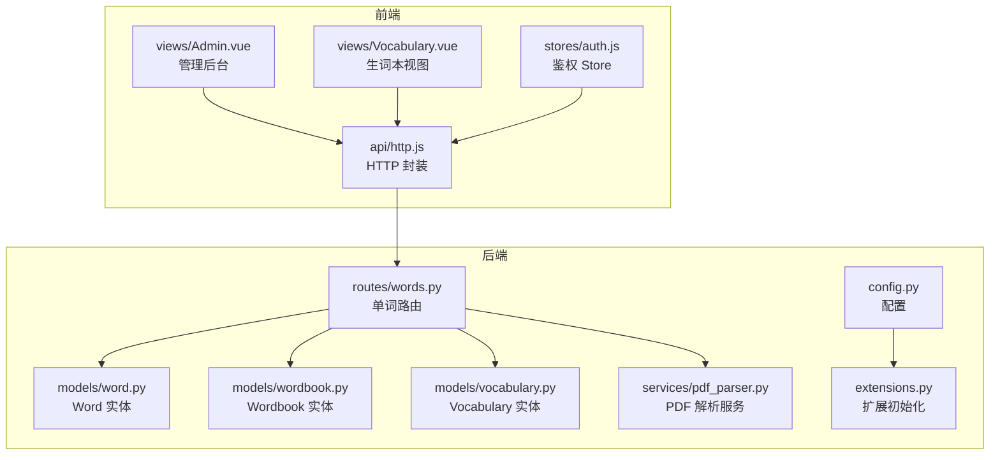
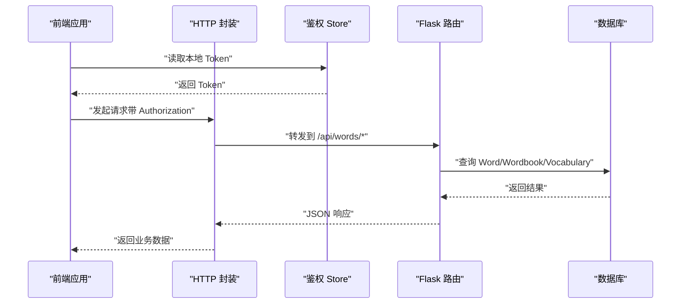
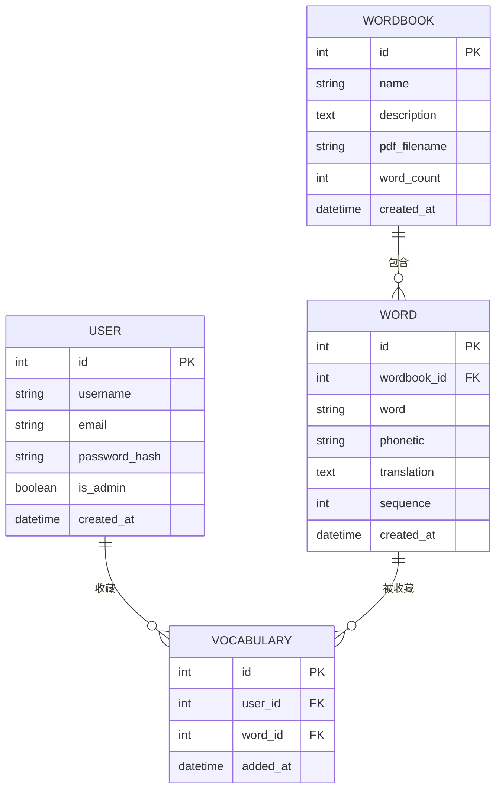
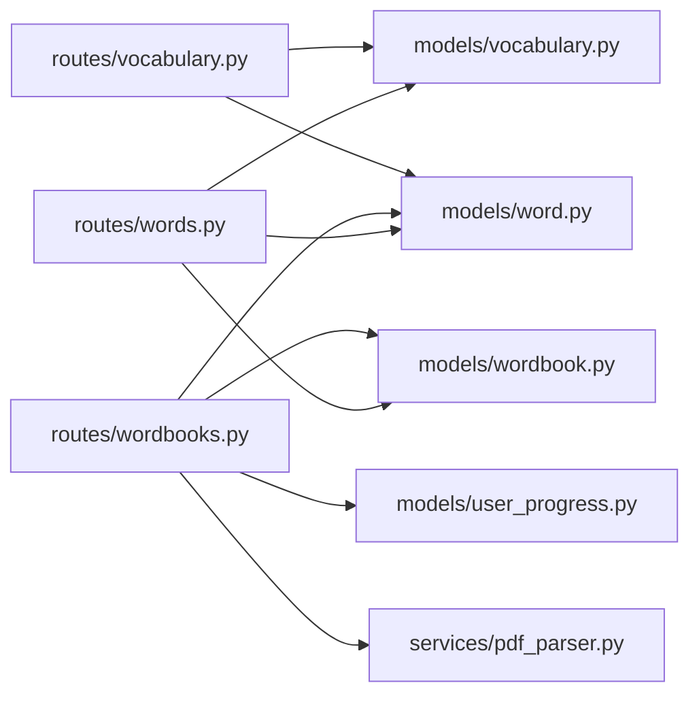

# 单词接口

<cite>
**本文引用的文件**
- [backend/app/routes/words.py](file://backend/app/routes/words.py)
- [backend/app/models/word.py](file://backend/app/models/word.py)
- [backend/app/models/wordbook.py](file://backend/app/models/wordbook.py)
- [backend/app/models/vocabulary.py](file://backend/app/models/vocabulary.py)
- [backend/app/services/pdf_parser.py](file://backend/app/services/pdf_parser.py)
- [backend/app/config.py](file://backend/app/config.py)
- [backend/app/extensions.py](file://backend/app/extensions.py)
- [frontend/src/api/http.js](file://frontend/src/api/http.js)
- [frontend/src/stores/auth.js](file://frontend/src/stores/auth.js)
- [frontend/src/views/Admin.vue](file://frontend/src/views/Admin.vue)
- [frontend/src/views/Vocabulary.vue](file://frontend/src/views/Vocabulary.vue)
- [README_CN.md](file://README_CN.md)
</cite>

## 目录
1. [简介](#简介)
2. [项目结构](#项目结构)
3. [核心组件](#核心组件)
4. [架构总览](#架构总览)
5. [详细组件分析](#详细组件分析)
6. [依赖分析](#依赖分析)
7. [性能考虑](#性能考虑)
8. [故障排查指南](#故障排查指南)
9. [结论](#结论)
10. [附录](#附录)

## 简介
本文件面向前端与全栈开发者，提供单词管理相关接口的完整 API 规范与实现说明。重点覆盖：
- 单词 CRUD 与批量管理接口
- 单词数据结构、字段定义与校验规则
- 单词与单词书的多对多关系（通过中间表生词本实现）
- 排序与组织机制（基于 sequence 字段）
- 前端集成指南（鉴权、分页、搜索/筛选、批量操作）

## 项目结构
后端采用 Flask 蓝图组织路由，模型层使用 SQLAlchemy 定义实体关系；前端基于 Vue 3 + Pinia，通过 Axios 封装统一请求。

图表来源
- [backend/app/routes/words.py](file://backend/app/routes/words.py#L1-L65)
- [backend/app/models/word.py](file://backend/app/models/word.py#L1-L29)
- [backend/app/models/wordbook.py](file://backend/app/models/wordbook.py#L1-L25)
- [backend/app/models/vocabulary.py](file://backend/app/models/vocabulary.py#L1-L26)
- [backend/app/services/pdf_parser.py](file://backend/app/services/pdf_parser.py#L1-L43)
- [backend/app/config.py](file://backend/app/config.py#L1-L28)
- [backend/app/extensions.py](file://backend/app/extensions.py#L1-L10)
- [frontend/src/api/http.js](file://frontend/src/api/http.js#L1-L48)
- [frontend/src/stores/auth.js](file://frontend/src/stores/auth.js#L1-L59)
- [frontend/src/views/Admin.vue](file://frontend/src/views/Admin.vue#L1-L264)
- [frontend/src/views/Vocabulary.vue](file://frontend/src/views/Vocabulary.vue#L1-L207)

章节来源
- [README_CN.md](file://README_CN.md#L1-L84)

## 核心组件
- 单词实体（Word）：存储英文单词、音标、中文释义、所属单词书、顺序号等。
- 单词书实体（Wordbook）：存储单词书元信息及与单词的一对多关系。
- 生词本实体（Vocabulary）：用户与单词的中间表，实现用户对单词的收藏。
- 单词路由（words.py）：提供按顺序号获取单词、批量获取单词等接口。
- PDF 解析服务（pdf_parser.py）：从 PDF 中提取单词条目，供单词书导入使用。

章节来源
- [backend/app/models/word.py](file://backend/app/models/word.py#L1-L29)
- [backend/app/models/wordbook.py](file://backend/app/models/wordbook.py#L1-L25)
- [backend/app/models/vocabulary.py](file://backend/app/models/vocabulary.py#L1-L26)
- [backend/app/routes/words.py](file://backend/app/routes/words.py#L1-L65)
- [backend/app/services/pdf_parser.py](file://backend/app/services/pdf_parser.py#L1-L43)

## 架构总览
后端通过蓝图暴露 REST 接口，前端通过统一 HTTP 封装调用，鉴权使用 JWT，请求头携带 Bearer Token。

图表来源
- [frontend/src/api/http.js](file://frontend/src/api/http.js#L1-L48)
- [frontend/src/stores/auth.js](file://frontend/src/stores/auth.js#L1-L59)
- [backend/app/routes/words.py](file://backend/app/routes/words.py#L1-L65)

## 详细组件分析

### 单词数据模型与关系
- Word：包含 id、wordbook_id、word、phonetic、translation、sequence、created_at。
- Wordbook：包含 id、name、description、pdf_filename、word_count、created_at；与 Word 一对多。
- Vocabulary：包含 id、user_id、word_id、added_at；与 User、Word 的多对多中间表。

图表来源
- [backend/app/models/wordbook.py](file://backend/app/models/wordbook.py#L1-L25)
- [backend/app/models/word.py](file://backend/app/models/word.py#L1-L29)
- [backend/app/models/vocabulary.py](file://backend/app/models/vocabulary.py#L1-L26)
- [backend/app/models/user.py](file://backend/app/models/user.py#L1-L26)

章节来源
- [backend/app/models/wordbook.py](file://backend/app/models/wordbook.py#L1-L25)
- [backend/app/models/word.py](file://backend/app/models/word.py#L1-L29)
- [backend/app/models/vocabulary.py](file://backend/app/models/vocabulary.py#L1-L26)
- [backend/app/models/user.py](file://backend/app/models/user.py#L1-L26)

### 单词接口规范

- 基础路径
  - 前端统一前缀：/api
  - 后端蓝图前缀：/words

- 鉴权
  - 所有单词相关接口均需携带 Authorization: Bearer <token>
  - Token 来源与刷新策略由前端鉴权 Store 管理

- 接口清单

  1) 获取指定单词书中的指定顺序单词
  - 方法与路径：GET /api/words/<wordbook_id>/<sequence>
  - 鉴权：是
  - 路径参数：
    - wordbook_id: 整数，单词书 ID
    - sequence: 整数，单词在单词书中的顺序号
  - 成功响应字段（word 对象）：
    - id、wordbook_id、word、phonetic、translation、sequence
    - is_in_vocabulary: 布尔，当前用户是否已收藏
    - total_words: 整数，单词书总单词数
  - 错误响应：
    - 单词书不存在：返回错误码与消息
    - 单词不存在：返回错误码与消息

  2) 批量获取单词（分页预加载）
  - 方法与路径：GET /api/words/batch/<wordbook_id>
  - 鉴权：是
  - 查询参数：
    - start: 整数，默认 1，起始序号（包含）
    - limit: 整数，默认 10，获取数量上限
  - 成功响应字段：
    - words: 数组，每项为一个单词对象（同上）
    - total: 整数，单词书总单词数
  - 错误响应：
    - 单词书不存在：返回错误码与消息

- 请求与响应示例（以路径代替具体代码）
  - 获取单个单词
    - GET /api/words/1/5
    - 成功响应示例路径：[响应示例](file://backend/app/routes/words.py#L34-L38)
  - 批量获取单词
    - GET /api/words/batch/1?start=1&limit=20
    - 成功响应示例路径：[响应示例](file://backend/app/routes/words.py#L60-L64)

章节来源
- [backend/app/routes/words.py](file://backend/app/routes/words.py#L1-L65)
- [frontend/src/api/http.js](file://frontend/src/api/http.js#L1-L48)
- [frontend/src/stores/auth.js](file://frontend/src/stores/auth.js#L1-L59)

### 单词与单词书的关系与排序
- 关系
  - Wordbook 与 Word：一对多
  - 用户与 Word：通过 Vocabulary 实现多对多（用户收藏单词）
- 排序与组织
  - 单词在单词书内的顺序由 sequence 字段维护，严格递增且唯一（同一单词书内唯一约束）
  - 批量获取接口按 sequence 升序返回
- 数据一致性
  - sequence 唯一性约束保证每个单词书内的顺序唯一
  - 删除单词书会级联删除其下单词（删除孤儿）

章节来源
- [backend/app/models/word.py](file://backend/app/models/word.py#L15-L18)
- [backend/app/models/wordbook.py](file://backend/app/models/wordbook.py#L14-L15)

### 生词本与单词的多对多
- 关系说明
  - Vocabulary 作为中间表，记录 user_id 与 word_id 的组合
  - 通过唯一约束避免重复收藏
- 前端集成要点
  - 列表接口支持按单词书过滤与分页
  - 支持按记录 ID 或 word_id 删除

章节来源
- [backend/app/models/vocabulary.py](file://backend/app/models/vocabulary.py#L1-L26)
- [backend/app/routes/vocabulary.py](file://backend/app/routes/vocabulary.py#L1-L103)
- [frontend/src/views/Vocabulary.vue](file://frontend/src/views/Vocabulary.vue#L1-L207)

### PDF 导入与单词书创建
- 功能概述
  - 管理员上传 PDF，后端解析并生成单词书与单词条目
  - 解析规则：英文单词 [音标] 中文释义
- 前端使用
  - 管理后台页面提供上传入口与提示
  - 上传成功后刷新单词书列表

章节来源
- [backend/app/services/pdf_parser.py](file://backend/app/services/pdf_parser.py#L1-L43)
- [backend/app/routes/wordbooks.py](file://backend/app/routes/wordbooks.py#L68-L136)
- [frontend/src/views/Admin.vue](file://frontend/src/views/Admin.vue#L1-L264)

## 依赖分析
- 组件耦合
  - routes/words.py 依赖 Word、Wordbook、Vocabulary 模型
  - routes/wordbooks.py 依赖 Wordbook、Word、UserProgress、pdf_parser
  - routes/vocabulary.py 依赖 Vocabulary、Word
- 外部依赖
  - Flask、SQLAlchemy、JWT、CORS、Bcrypt
  - pdfplumber（用于 PDF 解析）

图表来源
- [backend/app/routes/words.py](file://backend/app/routes/words.py#L1-L65)
- [backend/app/routes/wordbooks.py](file://backend/app/routes/wordbooks.py#L1-L159)
- [backend/app/routes/vocabulary.py](file://backend/app/routes/vocabulary.py#L1-L103)
- [backend/app/services/pdf_parser.py](file://backend/app/services/pdf_parser.py#L1-L43)
- [backend/app/models/word.py](file://backend/app/models/word.py#L1-L29)
- [backend/app/models/wordbook.py](file://backend/app/models/wordbook.py#L1-L25)
- [backend/app/models/vocabulary.py](file://backend/app/models/vocabulary.py#L1-L26)

章节来源
- [backend/app/extensions.py](file://backend/app/extensions.py#L1-L10)
- [backend/app/config.py](file://backend/app/config.py#L1-L28)

## 性能考虑
- 批量获取
  - 使用 start/limit 参数进行分页，避免一次性拉取大量数据
  - 后端按 sequence 升序查询，索引命中良好
- 索引与约束
  - 单词书+顺序的唯一索引确保顺序唯一性，减少重复与冲突
  - idx_wordbook_sequence 提升查询效率
- 建议
  - 前端缓存最近访问的单词书与页码
  - 合理设置 limit，避免过大数据包
  - 批量导入 PDF 时控制并发与内存占用

章节来源
- [backend/app/models/word.py](file://backend/app/models/word.py#L15-L18)
- [backend/app/routes/words.py](file://backend/app/routes/words.py#L41-L64)

## 故障排查指南
- 常见错误与定位
  - 401 未授权：检查本地 Token 是否存在与有效；前端会在 401 时清理本地状态并跳转登录
  - 404 单词书/单词不存在：确认 wordbook_id 与 sequence 是否正确
  - 500 PDF 解析失败：检查 PDF 格式是否符合“英文单词 [音标] 中文释义”
- 前端调试
  - 查看网络面板与控制台错误
  - 确认 baseURL 与 Authorization 头是否正确
- 后端调试
  - 检查数据库连接与表结构
  - 确认唯一约束与索引是否存在

章节来源
- [frontend/src/api/http.js](file://frontend/src/api/http.js#L25-L45)
- [backend/app/routes/words.py](file://backend/app/routes/words.py#L16-L26)
- [backend/app/services/pdf_parser.py](file://backend/app/services/pdf_parser.py#L39-L42)

## 结论
本接口体系围绕“单词书-单词-生词本”的核心模型设计，通过 sequence 实现稳定有序的组织方式，并提供高效的批量获取能力。配合前端统一鉴权与分页策略，可满足大规模单词数据的浏览与管理需求。

## 附录

### 字段定义与校验规则
- Word
  - wordbook_id: 整数，外键，必填
  - word: 字符串，最大长度 100，必填
  - phonetic: 字符串，最大长度 100，可空
  - translation: 文本，必填
  - sequence: 整数，必填，同一单词书内唯一
  - created_at: 时间戳，自动生成
- Wordbook
  - name: 字符串，最大长度 100，必填
  - description: 文本，可空
  - pdf_filename: 字符串，可空
  - word_count: 整数，默认 0
  - created_at: 时间戳，自动生成
- Vocabulary
  - user_id: 整数，外键，必填
  - word_id: 整数，外键，必填
  - added_at: 时间戳，自动生成

章节来源
- [backend/app/models/word.py](file://backend/app/models/word.py#L4-L28)
- [backend/app/models/wordbook.py](file://backend/app/models/wordbook.py#L4-L24)
- [backend/app/models/vocabulary.py](file://backend/app/models/vocabulary.py#L4-L25)

### 前端集成指南
- 鉴权
  - 登录成功后保存 access_token 与用户信息
  - 请求拦截器自动注入 Authorization: Bearer <token>
- 列表与分页
  - 生词本：GET /api/vocabulary?page=&limit=
  - 单词书：GET /api/wordbooks
- 搜索与筛选
  - 生词本支持按单词书过滤：GET /api/vocabulary?wordbook_id=...
- 批量操作
  - 批量获取单词：GET /api/words/batch/<wordbook_id>?start=&limit=
  - 添加/移除生词：POST /api/vocabulary 与 DELETE /api/vocabulary/<id> 或 /api/vocabulary/word/<word_id>
- 示例参考
  - 管理后台上传与删除：[Admin 页面](file://frontend/src/views/Admin.vue#L121-L195)
  - 生词本列表与分页：[Vocabulary 页面](file://frontend/src/views/Vocabulary.vue#L95-L128)

章节来源
- [frontend/src/stores/auth.js](file://frontend/src/stores/auth.js#L22-L38)
- [frontend/src/api/http.js](file://frontend/src/api/http.js#L11-L23)
- [frontend/src/views/Admin.vue](file://frontend/src/views/Admin.vue#L121-L195)
- [frontend/src/views/Vocabulary.vue](file://frontend/src/views/Vocabulary.vue#L95-L128)