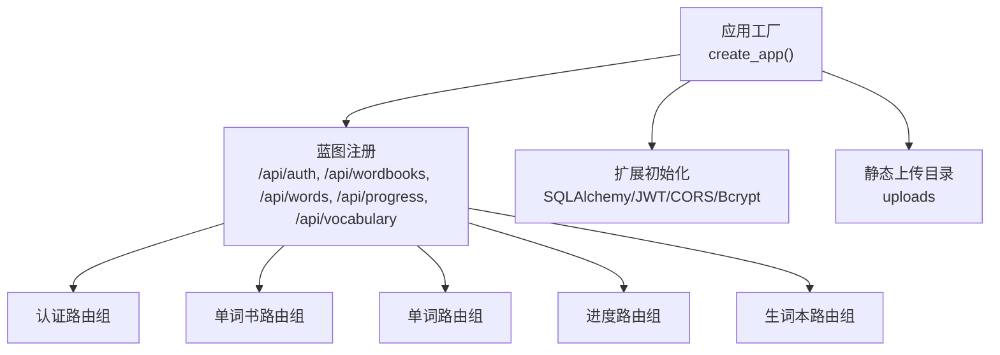
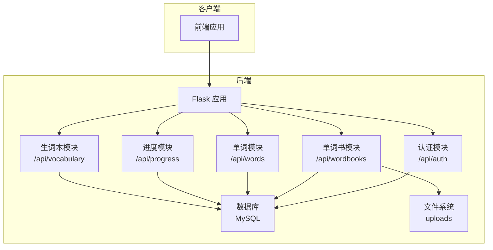
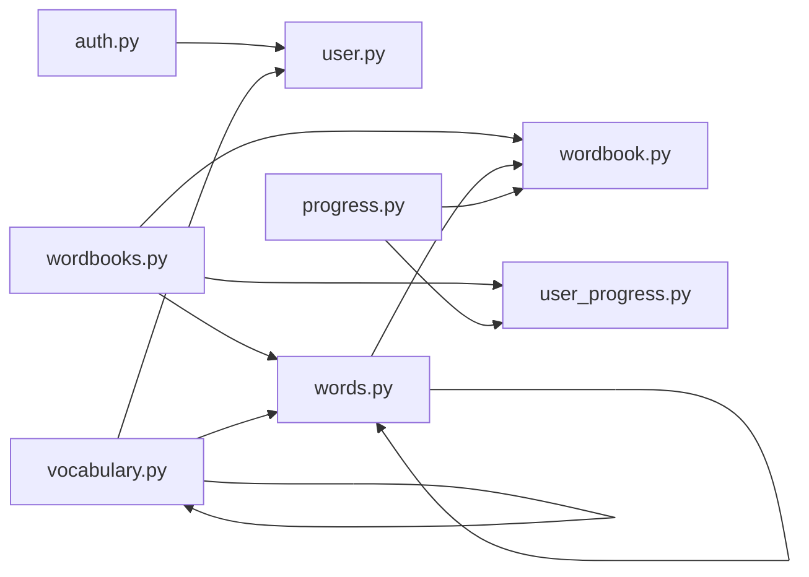

# 后端 API 接口

<cite>
**本文引用的文件**
- [backend/app/__init__.py](file://backend/app/__init__.py)
- [backend/app/config.py](file://backend/app/config.py)
- [backend/app/extensions.py](file://backend/app/extensions.py)
- [backend/app/routes/auth.py](file://backend/app/routes/auth.py)
- [backend/app/routes/wordbooks.py](file://backend/app/routes/wordbooks.py)
- [backend/app/routes/words.py](file://backend/app/routes/words.py)
- [backend/app/routes/progress.py](file://backend/app/routes/progress.py)
- [backend/app/routes/vocabulary.py](file://backend/app/routes/vocabulary.py)
- [backend/app/models/user.py](file://backend/app/models/user.py)
- [backend/app/models/wordbook.py](file://backend/app/models/wordbook.py)
- [backend/app/models/word.py](file://backend/app/models/word.py)
- [backend/app/models/user_progress.py](file://backend/app/models/user_progress.py)
- [backend/app/models/vocabulary.py](file://backend/app/models/vocabulary.py)
- [backend/app/services/pdf_parser.py](file://backend/app/services/pdf_parser.py)
- [backend/wsgi.py](file://backend/wsgi.py)
- [backend/requirements.txt](file://backend/requirements.txt)
- [README_CN.md](file://README_CN.md)
</cite>

## 目录
1. [简介](#简介)
2. [项目结构](#项目结构)
3. [核心组件](#核心组件)
4. [架构总览](#架构总览)
5. [详细组件分析](#详细组件分析)
6. [依赖分析](#依赖分析)
7. [性能考虑](#性能考虑)
8. [故障排查指南](#故障排查指南)
9. [结论](#结论)
10. [附录](#附录)

## 简介
本文件为单词学习网站后端 API 的完整接口文档，覆盖认证、单词书、单词、进度、生词本五大接口组。文档详细说明每个端点的 HTTP 方法、URL 模式、请求参数、响应格式与状态码；解释 JWT 认证机制（获取、验证、刷新）；阐述业务逻辑、数据校验规则与错误处理；提供常见使用场景的请求/响应示例路径；并给出接口版本管理、速率限制与安全建议，帮助前端开发者高效集成。

## 项目结构
后端采用 Flask 微服务风格，按功能模块组织蓝图（Blueprint），统一通过应用工厂创建并注册路由前缀。数据库 ORM 使用 SQLAlchemy，认证基于 Flask-JWT-Extended，密码加密使用 Flask-Bcrypt，CORS 跨域支持全局开放。

图表来源
- [backend/app/__init__.py](file://backend/app/__init__.py#L6-L36)
- [backend/app/config.py](file://backend/app/config.py#L1-L28)
- [backend/app/extensions.py](file://backend/app/extensions.py#L1-L10)

章节来源
- [backend/app/__init__.py](file://backend/app/__init__.py#L6-L36)
- [backend/app/config.py](file://backend/app/config.py#L1-L28)
- [backend/app/extensions.py](file://backend/app/extensions.py#L1-L10)

## 核心组件
- 应用工厂与蓝图注册：集中创建 Flask 应用、初始化扩展、注册各路由蓝图并设置 URL 前缀。
- 配置中心：集中管理数据库连接、JWT 过期时间、上传目录与大小限制等。
- 扩展初始化：SQLAlchemy、JWTManager、CORS、Bcrypt。
- 路由蓝图：按领域划分，分别处理认证、单词书、单词、进度、生词本。
- 模型层：用户、单词书、单词、用户进度、生词本条目。
- PDF 解析服务：解析 PDF 提取单词、音标与释义。

章节来源
- [backend/app/__init__.py](file://backend/app/__init__.py#L6-L36)
- [backend/app/config.py](file://backend/app/config.py#L1-L28)
- [backend/app/extensions.py](file://backend/app/extensions.py#L1-L10)
- [backend/app/services/pdf_parser.py](file://backend/app/services/pdf_parser.py#L1-L43)

## 架构总览
后端以 RESTful API 形式对外提供服务，统一前缀为 /api，各模块独立命名空间。JWT 作为认证与授权载体，所有受保护接口需携带有效访问令牌。管理员权限仅限特定操作（如上传、删除单词书）。

图表来源
- [backend/app/__init__.py](file://backend/app/__init__.py#L26-L30)
- [backend/app/routes/auth.py](file://backend/app/routes/auth.py#L1-L93)
- [backend/app/routes/wordbooks.py](file://backend/app/routes/wordbooks.py#L1-L159)
- [backend/app/routes/words.py](file://backend/app/routes/words.py#L1-L65)
- [backend/app/routes/progress.py](file://backend/app/routes/progress.py#L1-L115)
- [backend/app/routes/vocabulary.py](file://backend/app/routes/vocabulary.py#L1-L103)

## 详细组件分析

### 认证接口组（/api/auth）
- 通用响应结构
  - 成功响应：包含 success 字段与业务数据；部分端点返回 message。
  - 失败响应：包含 success:false 与 message；附带具体错误信息。
- 认证机制
  - 登录成功返回 access_token 与 refresh_token，以及当前用户信息。
  - 刷新端点使用刷新令牌换取新的访问令牌。
  - 受保护端点通过装饰器进行 JWT 校验。

接口清单
- POST /api/auth/register
  - 功能：用户注册
  - 请求体字段：username, email, password
  - 校验规则：三要素非空；密码长度≥6；用户名与邮箱唯一
  - 成功状态：201 Created
  - 失败状态：400 Bad Request（参数缺失/密码过短/重复）
- POST /api/auth/login
  - 功能：用户登录
  - 请求体字段：email, password
  - 校验规则：邮箱与密码非空；凭据正确性校验
  - 成功响应：access_token, refresh_token, user
  - 失败状态：400 Bad Request（缺少参数）、401 Unauthorized（凭据错误）
- POST /api/auth/refresh
  - 功能：刷新访问令牌
  - 身份要求：携带有效刷新令牌
  - 成功响应：新的 access_token
  - 失败状态：401 Unauthorized（令牌无效）
- GET /api/auth/me
  - 功能：获取当前用户信息
  - 身份要求：携带有效访问令牌
  - 成功响应：user 对象
  - 失败状态：404 Not Found（用户不存在）

请求示例（路径）
- [POST /api/auth/register](file://backend/app/routes/auth.py#L8-L43)
- [POST /api/auth/login](file://backend/app/routes/auth.py#L46-L72)
- [POST /api/auth/refresh](file://backend/app/routes/auth.py#L75-L80)
- [GET /api/auth/me](file://backend/app/routes/auth.py#L83-L92)

响应示例（路径）
- [POST /api/auth/register 成功](file://backend/app/routes/auth.py#L43)
- [POST /api/auth/login 成功](file://backend/app/routes/auth.py#L67-L72)
- [POST /api/auth/refresh 成功](file://backend/app/routes/auth.py#L79-L80)
- [GET /api/auth/me 成功](file://backend/app/routes/auth.py#L92)

章节来源
- [backend/app/routes/auth.py](file://backend/app/routes/auth.py#L1-L93)
- [backend/app/models/user.py](file://backend/app/models/user.py#L1-L26)

### 单词书接口组（/api/wordbooks）
- 权限控制：上传与删除单词书需要管理员权限，其他接口需登录。
- 上传流程：管理员上传 PDF，后端解析并批量生成单词条目，同时记录单词书元信息。

接口清单
- GET /api/wordbooks
  - 功能：获取单词书列表（含当前用户的学习进度）
  - 查询参数：无
  - 成功响应：wordbooks 数组，每项包含 user_progress（若存在）
  - 失败状态：无（默认返回空数组）
- GET /api/wordbooks/:wordbook_id
  - 功能：获取单词书详情
  - 路径参数：wordbook_id
  - 成功响应：wordbook 对象
  - 失败状态：404 Not Found（单词书不存在）
- POST /api/wordbooks/upload
  - 功能：上传 PDF 并解析为单词书
  - 身份要求：管理员
  - 表单字段：pdf_file（必填，.pdf），name（必填），description（可选）
  - 成功响应：message、wordbook_id、word_count
  - 失败状态：400 Bad Request（缺少文件/类型不符/无有效数据）、500 Internal Server Error（解析异常）
- DELETE /api/wordbooks/:wordbook_id
  - 功能：删除单词书（级联清理用户进度与PDF文件）
  - 身份要求：管理员
  - 成功响应：message
  - 失败状态：404 Not Found（单词书不存在）

请求示例（路径）
- [GET /api/wordbooks](file://backend/app/routes/wordbooks.py#L28-L54)
- [GET /api/wordbooks/:wordbook_id](file://backend/app/routes/wordbooks.py#L57-L65)
- [POST /api/wordbooks/upload](file://backend/app/routes/wordbooks.py#L68-L135)
- [DELETE /api/wordbooks/:wordbook_id](file://backend/app/routes/wordbooks.py#L138-L158)

响应示例（路径）
- [GET /api/wordbooks 成功](file://backend/app/routes/wordbooks.py#L54)
- [GET /api/wordbooks/:wordbook_id 成功](file://backend/app/routes/wordbooks.py#L65)
- [POST /api/wordbooks/upload 成功](file://backend/app/routes/wordbooks.py#L124-L129)
- [DELETE /api/wordbooks/:wordbook_id 成功](file://backend/app/routes/wordbooks.py#L158)

章节来源
- [backend/app/routes/wordbooks.py](file://backend/app/routes/wordbooks.py#L1-L159)
- [backend/app/models/wordbook.py](file://backend/app/models/wordbook.py#L1-L25)
- [backend/app/models/word.py](file://backend/app/models/word.py#L1-L29)
- [backend/app/models/user_progress.py](file://backend/app/models/user_progress.py#L1-L29)
- [backend/app/services/pdf_parser.py](file://backend/app/services/pdf_parser.py#L1-L43)

### 单词接口组（/api/words）
- 用途：按单词书与顺序获取单词详情，支持批量预加载。

接口清单
- GET /api/words/:wordbook_id/:sequence
  - 功能：获取指定单词书中的指定序号单词
  - 路径参数：wordbook_id, sequence
  - 成功响应：word 对象，包含 is_in_vocabulary（是否在当前用户生词本中）、total_words（单词书总词数）
  - 失败状态：404 Not Found（单词书或单词不存在）
- GET /api/words/batch/:wordbook_id
  - 功能：批量获取单词（用于预加载）
  - 查询参数：start（起始序号，默认1），limit（数量，默认10）
  - 成功响应：words 数组、total（单词书总词数）
  - 失败状态：404 Not Found（单词书不存在）

请求示例（路径）
- [GET /api/words/:wordbook_id/:sequence](file://backend/app/routes/words.py#L10-L38)
- [GET /api/words/batch/:wordbook_id](file://backend/app/routes/words.py#L41-L64)

响应示例（路径）
- [GET /api/words/:wordbook_id/:sequence 成功](file://backend/app/routes/words.py#L38)
- [GET /api/words/batch/:wordbook_id 成功](file://backend/app/routes/words.py#L60-L64)

章节来源
- [backend/app/routes/words.py](file://backend/app/routes/words.py#L1-L65)
- [backend/app/models/word.py](file://backend/app/models/word.py#L1-L29)
- [backend/app/models/wordbook.py](file://backend/app/models/wordbook.py#L1-L25)
- [backend/app/models/vocabulary.py](file://backend/app/models/vocabulary.py#L1-L26)

### 进度接口组（/api/progress）
- 用途：查询与更新用户在某单词书的学习进度，支持重置。

接口清单
- GET /api/progress/:wordbook_id
  - 功能：获取当前用户在指定单词书的学习进度
  - 路径参数：wordbook_id
  - 成功响应：progress 对象（包含 current_index、total_words、progress_percentage、last_learn_time）
  - 失败状态：404 Not Found（单词书不存在）
- POST /api/progress/:wordbook_id
  - 功能：更新学习进度
  - 路径参数：wordbook_id
  - 请求体字段：current_index（必须，范围 1..N）
  - 成功响应：current_index
  - 失败状态：400 Bad Request（缺少参数/索引越界）、404 Not Found（单词书不存在）
- POST /api/progress/:wordbook_id/reset
  - 功能：重置学习进度至第1页
  - 路径参数：wordbook_id
  - 成功响应：current_index=1

请求示例（路径）
- [GET /api/progress/:wordbook_id](file://backend/app/routes/progress.py#L11-L50)
- [POST /api/progress/:wordbook_id](file://backend/app/routes/progress.py#L53-L95)
- [POST /api/progress/:wordbook_id/reset](file://backend/app/routes/progress.py#L98-L114)

响应示例（路径）
- [GET /api/progress/:wordbook_id 成功](file://backend/app/routes/progress.py#L41-L50)
- [POST /api/progress/:wordbook_id 成功](file://backend/app/routes/progress.py#L92-L95)
- [POST /api/progress/:wordbook_id/reset 成功](file://backend/app/routes/progress.py#L114)

章节来源
- [backend/app/routes/progress.py](file://backend/app/routes/progress.py#L1-L115)
- [backend/app/models/user_progress.py](file://backend/app/models/user_progress.py#L1-L29)
- [backend/app/models/wordbook.py](file://backend/app/models/wordbook.py#L1-L25)

### 生词本接口组（/api/vocabulary）
- 用途：查询、添加、删除当前用户的生词本条目，支持按词汇 ID 删除。

接口清单
- GET /api/vocabulary
  - 功能：获取当前用户生词本（支持分页与按单词书筛选）
  - 查询参数：page（默认1）、limit（默认20）、wordbook_id（可选）
  - 成功响应：vocabulary 数组（含 wordbook_name，若可关联）、total、page、limit
  - 失败状态：无（默认空数组）
- POST /api/vocabulary
  - 功能：添加单词到生词本
  - 请求体字段：word_id（必须）
  - 成功响应：message、id（新增条目ID）
  - 失败状态：400 Bad Request（缺少参数）、404 Not Found（单词不存在）、404 Not Found（重复添加时返回成功）
- DELETE /api/vocabulary/:vocabulary_id
  - 功能：按生词本条目 ID 删除
  - 路径参数：vocabulary_id
  - 成功响应：message
  - 失败状态：404 Not Found（记录不存在）
- DELETE /api/vocabulary/word/:word_id
  - 功能：按单词 ID 删除
  - 路径参数：word_id
  - 成功响应：message
  - 失败状态：404 Not Found（单词不在生词本中）

请求示例（路径）
- [GET /api/vocabulary](file://backend/app/routes/vocabulary.py#L10-L41)
- [POST /api/vocabulary](file://backend/app/routes/vocabulary.py#L44-L70)
- [DELETE /api/vocabulary/:vocabulary_id](file://backend/app/routes/vocabulary.py#L73-L86)
- [DELETE /api/vocabulary/word/:word_id](file://backend/app/routes/vocabulary.py#L89-L102)

响应示例（路径）
- [GET /api/vocabulary 成功](file://backend/app/routes/vocabulary.py#L35-L41)
- [POST /api/vocabulary 成功](file://backend/app/routes/vocabulary.py#L70)
- [DELETE /api/vocabulary/:vocabulary_id 成功](file://backend/app/routes/vocabulary.py#L86)
- [DELETE /api/vocabulary/word/:word_id 成功](file://backend/app/routes/vocabulary.py#L102)

章节来源
- [backend/app/routes/vocabulary.py](file://backend/app/routes/vocabulary.py#L1-L103)
- [backend/app/models/vocabulary.py](file://backend/app/models/vocabulary.py#L1-L26)
- [backend/app/models/word.py](file://backend/app/models/word.py#L1-L29)

## 依赖分析
- 组件耦合
  - 蓝图对模型层存在直接依赖（查询、写入、关联关系）。
  - 上传功能依赖 PDF 解析服务与文件系统。
  - JWT 与 Bcrypt 为认证与密码处理提供基础能力。
- 外部依赖
  - Flask、Flask-SQLAlchemy、Flask-JWT-Extended、Flask-CORS、Flask-Bcrypt、PyMySQL、pdfplumber、gunicorn、Werkzeug。
- 数据一致性
  - 唯一约束保证用户-单词书进度唯一、用户-单词生词本唯一、单词书-序号唯一。
  - 级联删除保障删除单词书时同步清理相关进度与孤儿单词。

图表来源
- [backend/app/routes/auth.py](file://backend/app/routes/auth.py#L1-L93)
- [backend/app/routes/wordbooks.py](file://backend/app/routes/wordbooks.py#L1-L159)
- [backend/app/routes/words.py](file://backend/app/routes/words.py#L1-L65)
- [backend/app/routes/progress.py](file://backend/app/routes/progress.py#L1-L115)
- [backend/app/routes/vocabulary.py](file://backend/app/routes/vocabulary.py#L1-L103)
- [backend/app/models/user.py](file://backend/app/models/user.py#L1-L26)
- [backend/app/models/wordbook.py](file://backend/app/models/wordbook.py#L1-L25)
- [backend/app/models/word.py](file://backend/app/models/word.py#L1-L29)
- [backend/app/models/user_progress.py](file://backend/app/models/user_progress.py#L1-L29)
- [backend/app/models/vocabulary.py](file://backend/app/models/vocabulary.py#L1-L26)

章节来源
- [backend/app/routes/wordbooks.py](file://backend/app/routes/wordbooks.py#L1-L159)
- [backend/app/routes/progress.py](file://backend/app/routes/progress.py#L1-L115)
- [backend/app/routes/vocabulary.py](file://backend/app/routes/vocabulary.py#L1-L103)
- [backend/app/models/user_progress.py](file://backend/app/models/user_progress.py#L1-L29)
- [backend/app/models/vocabulary.py](file://backend/app/models/vocabulary.py#L1-L26)

## 性能考虑
- 分页与批量加载
  - 生词本默认分页（page/limit），单词批量加载（batch）减少网络往返。
- 索引与约束
  - 单词书-序号唯一约束与复合索引提升查询效率。
  - 用户-单词书进度唯一约束避免重复写入。
- 上传与解析
  - PDF 解析在服务端执行，建议控制文件大小与并发；上传大小限制在配置中设定。
- 缓存建议
  - 前端可缓存单词书列表与常用单词详情，减少重复请求。

## 故障排查指南
- 认证相关
  - 登录失败：检查邮箱与密码是否为空、是否与数据库记录匹配。
  - 刷新失败：确认刷新令牌有效且未过期。
  - 获取当前用户失败：用户被删除或令牌无效。
- 单词书相关
  - 上传失败：确认文件类型为 PDF、文件名安全、解析结果非空。
  - 删除失败：确认单词书存在且具备管理员权限。
- 单词相关
  - 获取单词失败：确认单词书与序号有效。
  - 批量加载失败：确认单词书存在。
- 进度相关
  - 更新进度失败：确认 current_index 在有效范围内。
- 生词本相关
  - 添加失败：确认 word_id 存在且未重复添加。
  - 删除失败：确认条目或单词确实存在于当前用户生词本。

章节来源
- [backend/app/routes/auth.py](file://backend/app/routes/auth.py#L46-L92)
- [backend/app/routes/wordbooks.py](file://backend/app/routes/wordbooks.py#L68-L158)
- [backend/app/routes/words.py](file://backend/app/routes/words.py#L10-L64)
- [backend/app/routes/progress.py](file://backend/app/routes/progress.py#L53-L114)
- [backend/app/routes/vocabulary.py](file://backend/app/routes/vocabulary.py#L44-L102)

## 结论
本 API 设计遵循 RESTful 规范，围绕用户、单词书、单词、进度与生词本构建完整的学习闭环。JWT 提供轻量级认证与授权，蓝图模块化便于维护与扩展。建议在生产环境中完善速率限制、日志审计与更细粒度的权限控制，并持续优化数据库索引与缓存策略以提升性能。

## 附录

### 接口版本管理
- 当前版本：v1（统一前缀 /api）
- 建议：未来可通过 /api/v1、/api/v2 等前缀演进，保持向后兼容或明确迁移指引。

### 速率限制与安全
- 速率限制：建议在网关或中间件层实现（如基于 IP 或用户维度），防止滥用。
- 安全建议：
  - 强制 HTTPS 传输。
  - JWT 密钥与数据库凭据使用环境变量管理。
  - 严格校验与过滤输入参数，避免注入与越权。
  - 上传文件仅允许 PDF，限制大小并进行病毒扫描（建议）。

### 集成最佳实践
- 前端应统一拦截 401/403 错误并引导重新登录或刷新令牌。
- 使用分页与批量加载优化首屏体验。
- 将用户上下文持久化，避免重复调用 /api/auth/me。
- 管理员操作（上传/删除）需显式校验权限位。

章节来源
- [backend/app/config.py](file://backend/app/config.py#L20-L27)
- [backend/app/__init__.py](file://backend/app/__init__.py#L16)
- [backend/requirements.txt](file://backend/requirements.txt#L1-L11)
- [README_CN.md](file://README_CN.md#L1-L84)