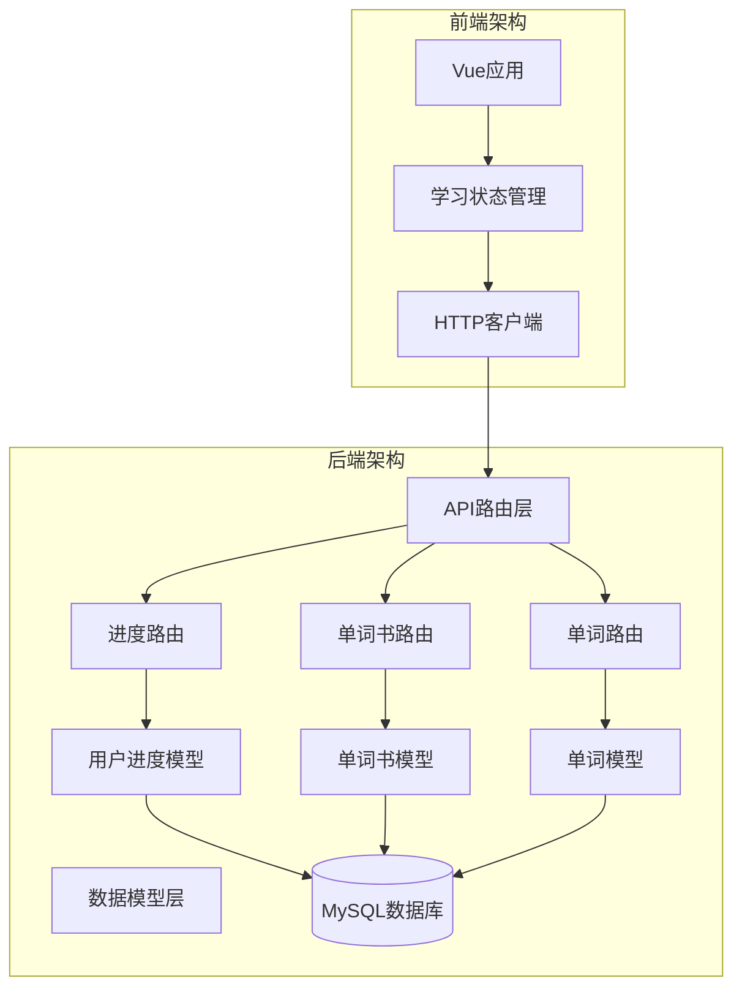
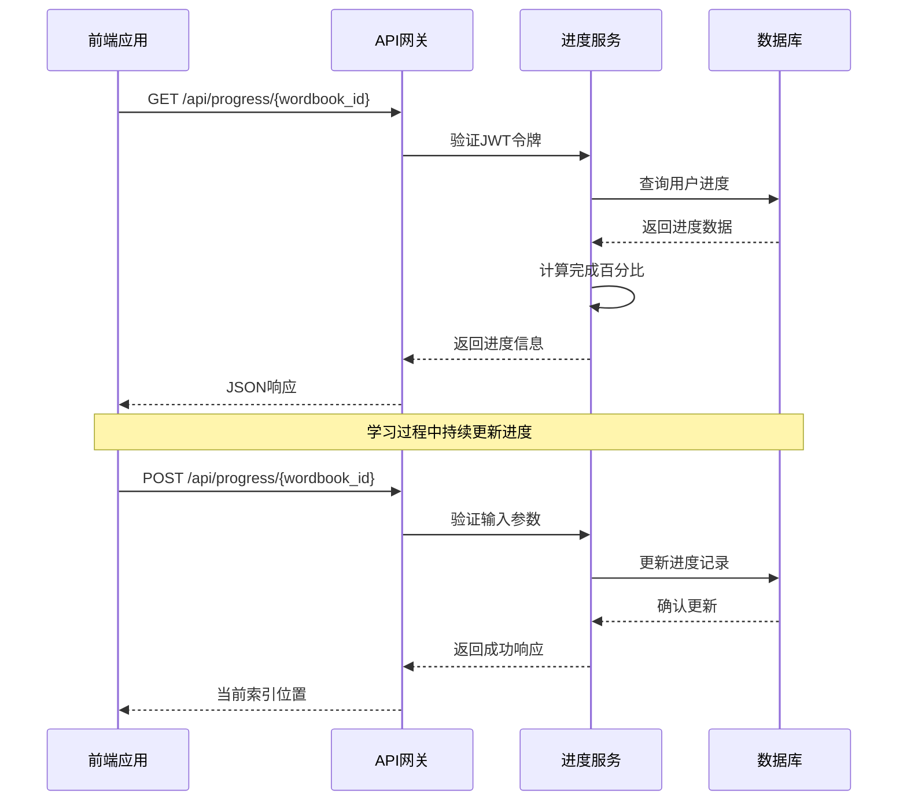
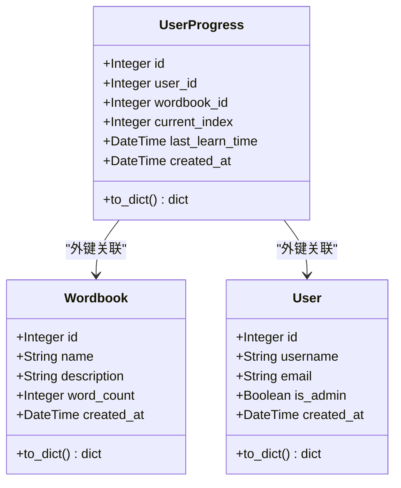
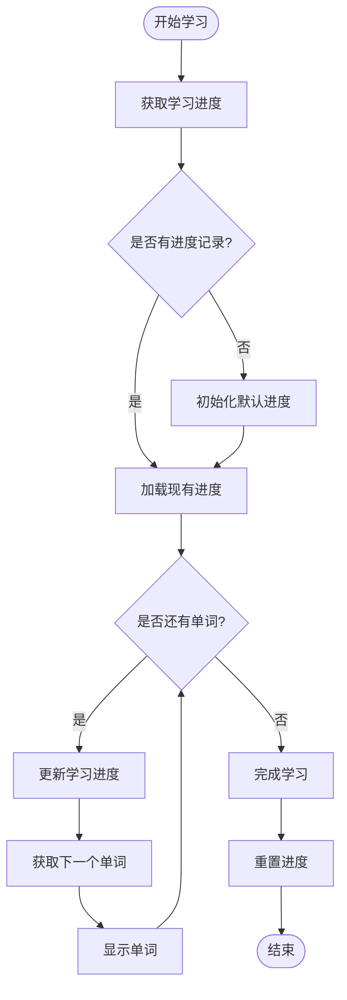
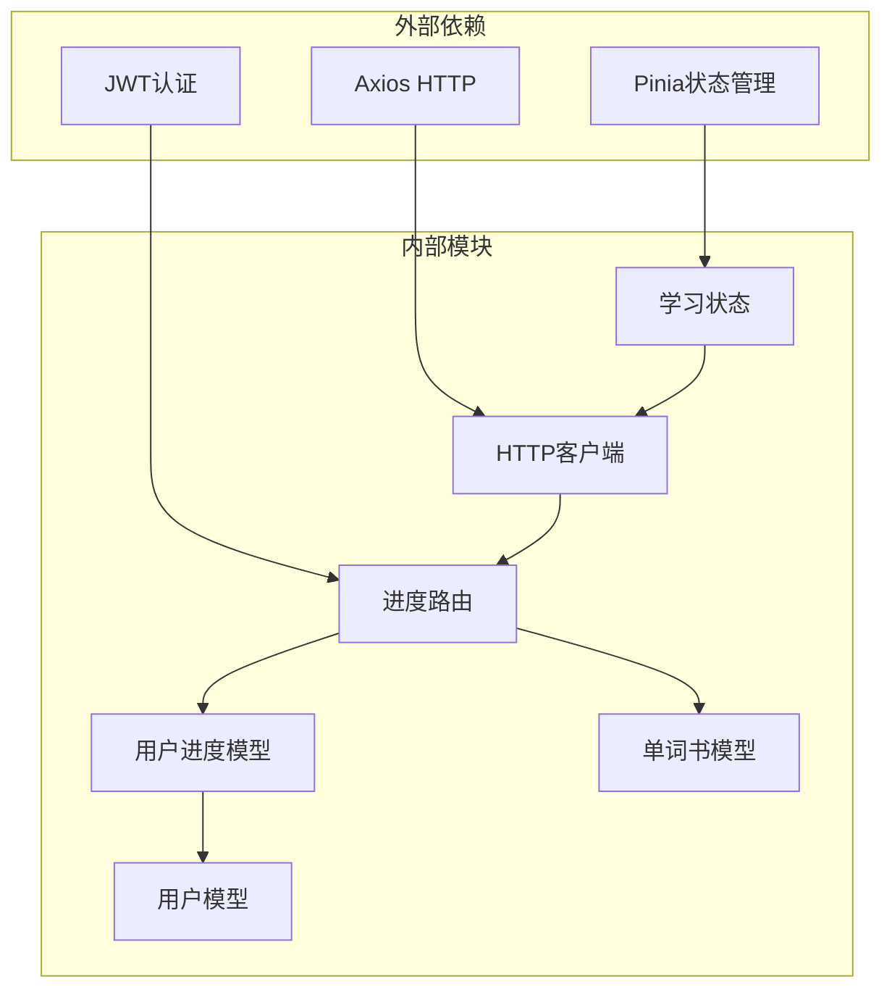

# 学习进度接口

<cite>
**本文档引用的文件**
- [backend/app/routes/progress.py](file://backend/app/routes/progress.py)
- [backend/app/models/user_progress.py](file://backend/app/models/user_progress.py)
- [backend/app/models/wordbook.py](file://backend/app/models/wordbook.py)
- [backend/app/models/word.py](file://backend/app/models/word.py)
- [backend/app/models/user.py](file://backend/app/models/user.py)
- [backend/app/__init__.py](file://backend/app/__init__.py)
- [backend/app/config.py](file://backend/app/config.py)
- [backend/app/extensions.py](file://backend/app/extensions.py)
- [frontend/src/stores/learning.js](file://frontend/src/stores/learning.js)
- [frontend/src/api/http.js](file://frontend/src/api/http.js)
- [init.sql](file://init.sql)
</cite>

## 目录
1. [简介](#简介)
2. [项目结构](#项目结构)
3. [核心组件](#核心组件)
4. [架构概览](#架构概览)
5. [详细组件分析](#详细组件分析)
6. [依赖关系分析](#依赖关系分析)
7. [性能考虑](#性能考虑)
8. [故障排除指南](#故障排除指南)
9. [结论](#结论)

## 简介

学习进度追踪接口是单词学习系统的核心功能模块，负责管理用户在不同单词书中的学习进度。该系统提供了完整的断点续学机制，支持学习进度的实时记录、持久化存储和状态恢复。通过RESTful API设计，前端应用可以轻松集成学习进度跟踪功能，实现个性化的学习体验。

## 项目结构

学习进度追踪功能采用Flask微服务架构，主要包含以下关键组件：



**图表来源**
- [backend/app/__init__.py](file://backend/app/__init__.py#L26-L30)
- [backend/app/routes/progress.py](file://backend/app/routes/progress.py#L8-L8)

**章节来源**
- [backend/app/__init__.py](file://backend/app/__init__.py#L1-L37)
- [backend/app/config.py](file://backend/app/config.py#L1-L28)

## 核心组件

### API路由层

学习进度相关的API端点位于`/api/progress`路径下，包含三个核心接口：

1. **获取学习进度** (`GET /api/progress/<wordbook_id>`)
2. **更新学习进度** (`POST /api/progress/<wordbook_id>`)
3. **重置学习进度** (`POST /api/progress/<wordbook_id>/reset`)

### 数据模型层

系统使用四个核心数据模型来支撑学习进度追踪功能：

1. **UserProgress** - 用户学习进度记录
2. **Wordbook** - 单词书信息
3. **Word** - 单词条目
4. **User** - 用户账户信息

**章节来源**
- [backend/app/routes/progress.py](file://backend/app/routes/progress.py#L11-L115)
- [backend/app/models/user_progress.py](file://backend/app/models/user_progress.py#L4-L29)
- [backend/app/models/wordbook.py](file://backend/app/models/wordbook.py#L4-L25)

## 架构概览

学习进度追踪系统的整体架构采用分层设计，确保了良好的可维护性和扩展性：



**图表来源**
- [backend/app/routes/progress.py](file://backend/app/routes/progress.py#L11-L95)
- [frontend/src/stores/learning.js](file://frontend/src/stores/learning.js#L16-L50)

## 详细组件分析

### 进度路由组件

进度路由组件实现了完整的CRUD操作，支持学习进度的查询、更新和重置功能。

#### GET /api/progress/{wordbook_id}

**功能描述**: 获取指定单词书的学习进度信息

**请求参数**:
- 路径参数: `wordbook_id` (整数类型，必需)
- 认证: 需要有效的JWT访问令牌

**响应格式**:
```json
{
  "success": true,
  "progress": {
    "wordbook_id": 1,
    "current_index": 1,
    "total_words": 500,
    "progress_percentage": 0,
    "last_learn_time": "2024-01-15T10:30:00Z"
  }
}
```

**状态码**:
- 200: 成功获取进度
- 401: 未授权访问
- 404: 单词书不存在

#### POST /api/progress/{wordbook_id}

**功能描述**: 更新用户的学习进度

**请求体参数**:
```json
{
  "current_index": 150
}
```

**验证规则**:
- `current_index` 必须在1到单词书总词数之间
- 单词书必须存在且有效

**响应格式**:
```json
{
  "success": true,
  "current_index": 150
}
```

**状态码**:
- 200: 进度更新成功
- 400: 请求参数无效
- 404: 单词书不存在

#### POST /api/progress/{wordbook_id}/reset

**功能描述**: 重置指定单词书的学习进度

**响应格式**:
```json
{
  "success": true,
  "current_index": 1
}
```

**状态码**:
- 200: 进度重置成功
- 401: 未授权访问

**章节来源**
- [backend/app/routes/progress.py](file://backend/app/routes/progress.py#L11-L115)

### 数据模型组件

#### UserProgress模型

UserProgress模型是学习进度追踪的核心数据结构，包含了用户学习状态的所有关键信息。



**图表来源**
- [backend/app/models/user_progress.py](file://backend/app/models/user_progress.py#L4-L29)
- [backend/app/models/wordbook.py](file://backend/app/models/wordbook.py#L4-L25)
- [backend/app/models/user.py](file://backend/app/models/user.py#L4-L26)

**字段定义**:

| 字段名 | 类型 | 描述 | 默认值 |
|--------|------|------|--------|
| id | Integer | 主键标识 | 自增 |
| user_id | Integer | 用户ID | 外键(users.id) |
| wordbook_id | Integer | 单词书ID | 外键(wordbooks.id) |
| current_index | Integer | 当前学习索引 | 1 |
| last_learn_time | DateTime | 最后学习时间 | 当前时间 |
| created_at | DateTime | 创建时间 | 当前时间 |

**约束条件**:
- 唯一约束: (user_id, wordbook_id)
- 索引: (user_id, wordbook_id)

#### Wordbook模型

Wordbook模型存储单词书的基本信息和统计信息。

**字段定义**:

| 字段名 | 类型 | 描述 | 默认值 |
|--------|------|------|--------|
| id | Integer | 主键标识 | 自增 |
| name | String(100) | 单词书名称 | 必填 |
| description | Text | 描述信息 | 可空 |
| pdf_filename | String(255) | PDF文件名 | 可空 |
| word_count | Integer | 总词数 | 0 |
| created_at | DateTime | 创建时间 | 当前时间 |

**章节来源**
- [backend/app/models/user_progress.py](file://backend/app/models/user_progress.py#L4-L29)
- [backend/app/models/wordbook.py](file://backend/app/models/wordbook.py#L4-L25)

### 前端集成组件

#### 学习状态管理

前端使用Pinia状态管理库来处理学习进度相关的状态：



**图表来源**
- [frontend/src/stores/learning.js](file://frontend/src/stores/learning.js#L16-L66)

**核心功能**:
- 进度获取和缓存
- 实时进度更新
- 断点续学支持
- 学习状态同步

**章节来源**
- [frontend/src/stores/learning.js](file://frontend/src/stores/learning.js#L1-L112)

## 依赖关系分析

学习进度追踪系统的关键依赖关系如下：



**图表来源**
- [backend/app/routes/progress.py](file://backend/app/routes/progress.py#L1-L8)
- [frontend/src/api/http.js](file://frontend/src/api/http.js#L1-L48)
- [frontend/src/stores/learning.js](file://frontend/src/stores/learning.js#L1-L4)

**依赖特点**:
- 松耦合设计，各组件职责明确
- 基于标准库和流行框架
- 支持JWT认证和CORS跨域
- 前后端分离架构

**章节来源**
- [backend/app/extensions.py](file://backend/app/extensions.py#L1-L10)
- [backend/app/config.py](file://backend/app/config.py#L20-L23)

## 性能考虑

### 数据库优化

系统采用了多项数据库优化策略：

1. **索引优化**: 在用户ID和单词书ID组合上建立复合索引
2. **唯一约束**: 防止重复的用户-单词书进度记录
3. **连接池**: 使用SQLAlchemy连接池管理数据库连接
4. **查询优化**: 使用过滤器和索引提高查询效率

### 缓存策略

前端实现了智能缓存机制：
- 进度数据本地缓存
- 避免重复API调用
- 实时状态同步

### 并发控制

系统具备良好的并发处理能力：
- JWT令牌验证
- 数据库事务管理
- 线程安全的状态更新

## 故障排除指南

### 常见问题及解决方案

**问题1: JWT令牌过期**
- 现象: API返回401未授权
- 解决方案: 前端自动清除过期令牌并重定向到登录页

**问题2: 进度更新失败**
- 现象: 进度无法保存或丢失
- 解决方案: 检查网络连接和服务器状态

**问题3: 断点续学异常**
- 现象: 学习进度不正确或丢失
- 解决方案: 清除浏览器缓存重新登录

**问题4: 数据库连接问题**
- 现象: 应用启动失败或API调用超时
- 解决方案: 检查数据库配置和连接参数

**章节来源**
- [frontend/src/api/http.js](file://frontend/src/api/http.js#L34-L44)
- [backend/app/config.py](file://backend/app/config.py#L14-L18)

## 结论

学习进度追踪接口提供了完整的学习进度管理解决方案，具有以下优势：

1. **完整的功能覆盖**: 支持进度查询、更新、重置等核心功能
2. **可靠的断点续学**: 通过持久化存储确保学习进度的连续性
3. **良好的用户体验**: 前后端分离设计，响应迅速
4. **可扩展性强**: 模块化架构便于功能扩展和维护

该系统为单词学习应用提供了坚实的技术基础，能够满足不同规模的学习需求。通过合理的架构设计和性能优化，确保了系统的稳定性和可靠性。