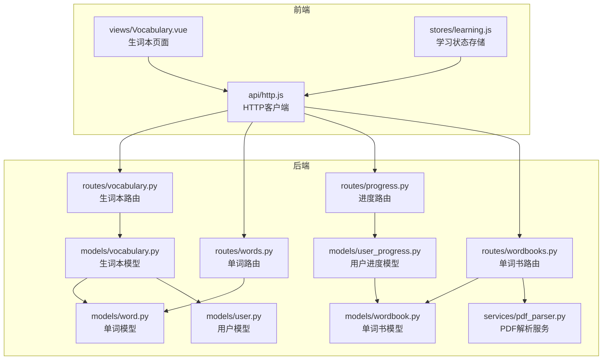
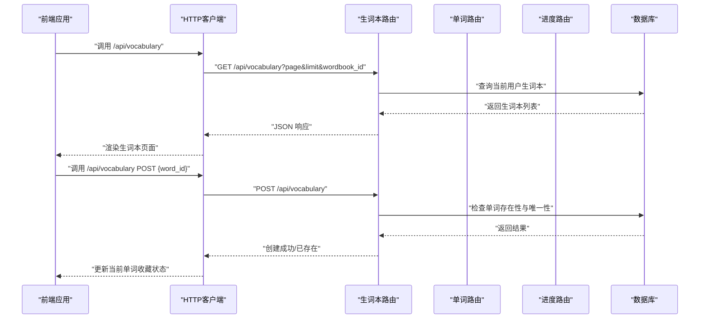
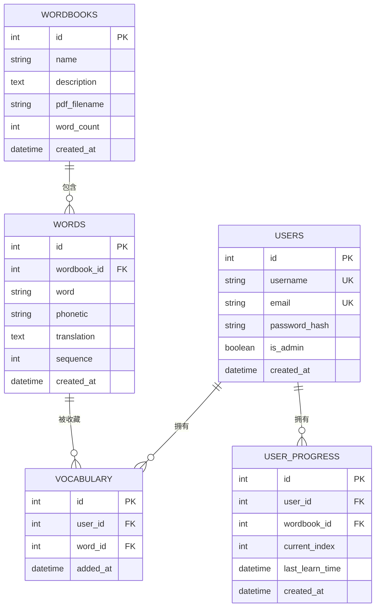
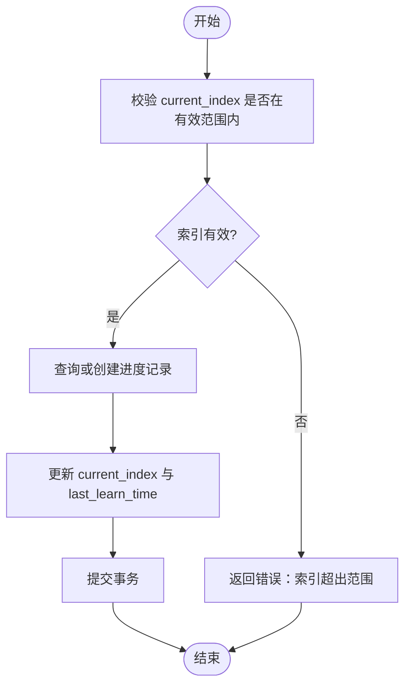
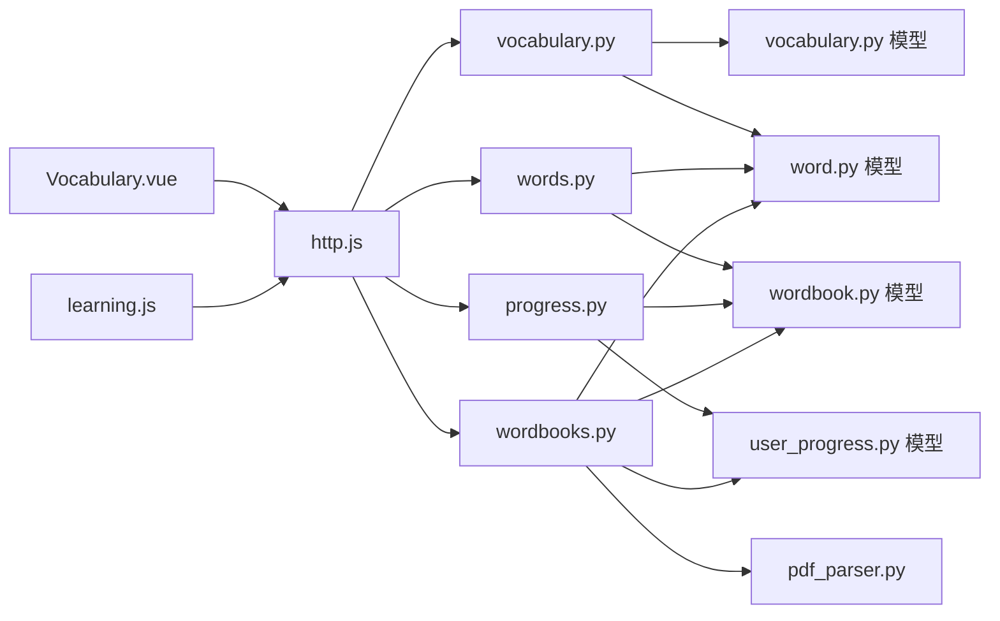

# 生词本接口

<cite>
**本文引用的文件**
- [backend/app/routes/vocabulary.py](file://backend/app/routes/vocabulary.py)
- [backend/app/models/vocabulary.py](file://backend/app/models/vocabulary.py)
- [backend/app/models/word.py](file://backend/app/models/word.py)
- [backend/app/models/wordbook.py](file://backend/app/models/wordbook.py)
- [backend/app/models/user.py](file://backend/app/models/user.py)
- [backend/app/models/user_progress.py](file://backend/app/models/user_progress.py)
- [backend/app/routes/words.py](file://backend/app/routes/words.py)
- [backend/app/routes/progress.py](file://backend/app/routes/progress.py)
- [backend/app/routes/wordbooks.py](file://backend/app/routes/wordbooks.py)
- [backend/app/services/pdf_parser.py](file://backend/app/services/pdf_parser.py)
- [frontend/src/views/Vocabulary.vue](file://frontend/src/views/Vocabulary.vue)
- [frontend/src/stores/learning.js](file://frontend/src/stores/learning.js)
- [frontend/src/api/http.js](file://frontend/src/api/http.js)
</cite>

## 目录
1. [简介](#简介)
2. [项目结构](#项目结构)
3. [核心组件](#核心组件)
4. [架构总览](#架构总览)
5. [详细组件分析](#详细组件分析)
6. [依赖关系分析](#依赖关系分析)
7. [性能考虑](#性能考虑)
8. [故障排除指南](#故障排除指南)
9. [结论](#结论)
10. [附录](#附录)

## 简介
本文件为“生词本管理接口”的完整技术文档，覆盖生词本的增删改查（CRUD）操作以及个人词汇收藏相关接口。文档详细说明了 /api/vocabulary/ 相关端点的 HTTP 方法、URL 模式、请求参数、响应格式，并解释了生词本的数据结构、字段定义与验证规则。同时，文档还阐述了生词本与用户的关联关系、复习进度与学习计划的实现机制，并为前端开发者提供集成指南，包括单词收藏、复习计划与进度跟踪的实现方案。

## 项目结构
后端采用 Flask 蓝图组织路由，模型层使用 SQLAlchemy 定义数据表及关系；前端使用 Vue 3 + Pinia 管理学习状态与调用后端 API。

图表来源
- [backend/app/routes/vocabulary.py](file://backend/app/routes/vocabulary.py#L1-L103)
- [backend/app/routes/words.py](file://backend/app/routes/words.py#L1-L65)
- [backend/app/routes/progress.py](file://backend/app/routes/progress.py#L1-L115)
- [backend/app/routes/wordbooks.py](file://backend/app/routes/wordbooks.py#L1-L159)
- [backend/app/models/vocabulary.py](file://backend/app/models/vocabulary.py#L1-L26)
- [backend/app/models/word.py](file://backend/app/models/word.py#L1-L29)
- [backend/app/models/wordbook.py](file://backend/app/models/wordbook.py#L1-L25)
- [backend/app/models/user.py](file://backend/app/models/user.py#L1-L26)
- [backend/app/models/user_progress.py](file://backend/app/models/user_progress.py#L1-L29)
- [backend/app/services/pdf_parser.py](file://backend/app/services/pdf_parser.py#L1-L43)
- [frontend/src/views/Vocabulary.vue](file://frontend/src/views/Vocabulary.vue#L1-L207)
- [frontend/src/stores/learning.js](file://frontend/src/stores/learning.js#L1-L112)
- [frontend/src/api/http.js](file://frontend/src/api/http.js#L1-L48)

章节来源
- [backend/app/routes/vocabulary.py](file://backend/app/routes/vocabulary.py#L1-L103)
- [backend/app/routes/words.py](file://backend/app/routes/words.py#L1-L65)
- [backend/app/routes/progress.py](file://backend/app/routes/progress.py#L1-L115)
- [backend/app/routes/wordbooks.py](file://backend/app/routes/wordbooks.py#L1-L159)
- [frontend/src/views/Vocabulary.vue](file://frontend/src/views/Vocabulary.vue#L1-L207)
- [frontend/src/stores/learning.js](file://frontend/src/stores/learning.js#L1-L112)
- [frontend/src/api/http.js](file://frontend/src/api/http.js#L1-L48)

## 核心组件
- 生词本模型：记录用户与单词的关联，包含添加时间等字段。
- 单词模型：记录单词书中的具体单词及其顺序。
- 单词书模型：记录单词书元信息与单词集合。
- 用户模型：记录用户基本信息与学习进度、生词本关联。
- 用户进度模型：记录用户在单词书中的学习进度。
- PDF 解析服务：从 PDF 中提取单词条目，供管理员导入。

章节来源
- [backend/app/models/vocabulary.py](file://backend/app/models/vocabulary.py#L1-L26)
- [backend/app/models/word.py](file://backend/app/models/word.py#L1-L29)
- [backend/app/models/wordbook.py](file://backend/app/models/wordbook.py#L1-L25)
- [backend/app/models/user.py](file://backend/app/models/user.py#L1-L26)
- [backend/app/models/user_progress.py](file://backend/app/models/user_progress.py#L1-L29)
- [backend/app/services/pdf_parser.py](file://backend/app/services/pdf_parser.py#L1-L43)

## 架构总览
后端以蓝图划分功能域，前端通过统一的 HTTP 客户端访问后端 API。生词本接口与单词、进度、单词书紧密协作，形成完整的词汇学习闭环。

图表来源
- [backend/app/routes/vocabulary.py](file://backend/app/routes/vocabulary.py#L10-L103)
- [backend/app/routes/words.py](file://backend/app/routes/words.py#L10-L38)
- [frontend/src/stores/learning.js](file://frontend/src/stores/learning.js#L72-L86)
- [frontend/src/api/http.js](file://frontend/src/api/http.js#L1-L48)

## 详细组件分析

### 生词本数据模型与关系
- 生词本模型包含用户 ID、单词 ID、添加时间等字段，并通过外键关联用户与单词。
- 单词模型包含单词书 ID、单词文本、音标、翻译、序列号等字段，并通过外键关联单词书。
- 用户模型与生词本、进度之间是一对多关系。
- 用户进度模型记录用户在单词书中的学习进度。

图表来源
- [backend/app/models/user.py](file://backend/app/models/user.py#L4-L26)
- [backend/app/models/wordbook.py](file://backend/app/models/wordbook.py#L4-L25)
- [backend/app/models/word.py](file://backend/app/models/word.py#L4-L29)
- [backend/app/models/vocabulary.py](file://backend/app/models/vocabulary.py#L4-L26)
- [backend/app/models/user_progress.py](file://backend/app/models/user_progress.py#L4-L29)

章节来源
- [backend/app/models/vocabulary.py](file://backend/app/models/vocabulary.py#L1-L26)
- [backend/app/models/word.py](file://backend/app/models/word.py#L1-L29)
- [backend/app/models/wordbook.py](file://backend/app/models/wordbook.py#L1-L25)
- [backend/app/models/user.py](file://backend/app/models/user.py#L1-L26)
- [backend/app/models/user_progress.py](file://backend/app/models/user_progress.py#L1-L29)

### 生词本接口规范

#### 获取生词本列表
- 方法：GET
- URL：/api/vocabulary
- 认证：需要 JWT
- 查询参数：
  - page：页码，默认 1
  - limit：每页数量，默认 20
  - wordbook_id：可选，按单词书过滤
- 响应字段：
  - success：布尔值
  - vocabulary：数组，元素包含生词本项与单词信息，若单词所属单词书存在则附加 wordbook_name
  - total：总数
  - page：当前页
  - limit：每页数量

章节来源
- [backend/app/routes/vocabulary.py](file://backend/app/routes/vocabulary.py#L10-L41)

#### 添加单词到生词本
- 方法：POST
- URL：/api/vocabulary
- 认证：需要 JWT
- 请求体 JSON：
  - word_id：整数，必填
- 响应：
  - 成功：返回 success 与 message，以及新建记录的 id
  - 失败：返回错误信息（如缺少参数、单词不存在、重复添加）

章节来源
- [backend/app/routes/vocabulary.py](file://backend/app/routes/vocabulary.py#L44-L70)

#### 从生词本移除（按生词本记录 ID）
- 方法：DELETE
- URL：/api/vocabulary/{vocabulary_id}
- 认证：需要 JWT
- 响应：
  - 成功：返回 success 与 message
  - 失败：返回错误信息（如记录不存在）

章节来源
- [backend/app/routes/vocabulary.py](file://backend/app/routes/vocabulary.py#L73-L86)

#### 通过单词 ID 从生词本移除
- 方法：DELETE
- URL：/api/vocabulary/word/{word_id}
- 认证：需要 JWT
- 响应：
  - 成功：返回 success 与 message
  - 失败：返回错误信息（如单词不在生词本中）

章节来源
- [backend/app/routes/vocabulary.py](file://backend/app/routes/vocabulary.py#L89-L102)

### 单词与收藏状态
- 获取单词详情时，后端会检查当前用户是否已将该单词加入生词本，并在响应中返回 is_in_vocabulary 字段。
- 前端学习状态存储提供了收藏/取消收藏的封装方法，便于在学习过程中快速切换。

章节来源
- [backend/app/routes/words.py](file://backend/app/routes/words.py#L10-L38)
- [frontend/src/stores/learning.js](file://frontend/src/stores/learning.js#L72-L86)

### 学习进度与复习机制
- 获取进度：GET /api/progress/{wordbook_id}，返回当前索引、总词数、完成百分比与最后学习时间。
- 更新进度：POST /api/progress/{wordbook_id}，请求体需包含 current_index。
- 重置进度：POST /api/progress/{wordbook_id}/reset。
- 进度计算：完成百分比基于 current_index 与单词书总词数计算。

图表来源
- [backend/app/routes/progress.py](file://backend/app/routes/progress.py#L53-L95)

章节来源
- [backend/app/routes/progress.py](file://backend/app/routes/progress.py#L11-L115)
- [backend/app/models/user_progress.py](file://backend/app/models/user_progress.py#L1-L29)

### 单词书与 PDF 导入
- 管理员可通过上传 PDF 并解析，自动创建单词书与其中的单词条目。
- PDF 解析服务期望每行格式为“英文单词 [音标] 中文释义”。

章节来源
- [backend/app/routes/wordbooks.py](file://backend/app/routes/wordbooks.py#L68-L135)
- [backend/app/services/pdf_parser.py](file://backend/app/services/pdf_parser.py#L4-L43)

## 依赖关系分析

图表来源
- [backend/app/routes/vocabulary.py](file://backend/app/routes/vocabulary.py#L1-L103)
- [backend/app/models/vocabulary.py](file://backend/app/models/vocabulary.py#L1-L26)
- [backend/app/models/word.py](file://backend/app/models/word.py#L1-L29)
- [backend/app/routes/words.py](file://backend/app/routes/words.py#L1-L65)
- [backend/app/models/wordbook.py](file://backend/app/models/wordbook.py#L1-L25)
- [backend/app/routes/progress.py](file://backend/app/routes/progress.py#L1-L115)
- [backend/app/models/user_progress.py](file://backend/app/models/user_progress.py#L1-L29)
- [backend/app/routes/wordbooks.py](file://backend/app/routes/wordbooks.py#L1-L159)
- [backend/app/services/pdf_parser.py](file://backend/app/services/pdf_parser.py#L1-L43)
- [frontend/src/views/Vocabulary.vue](file://frontend/src/views/Vocabulary.vue#L1-L207)
- [frontend/src/stores/learning.js](file://frontend/src/stores/learning.js#L1-L112)
- [frontend/src/api/http.js](file://frontend/src/api/http.js#L1-L48)

章节来源
- [backend/app/routes/vocabulary.py](file://backend/app/routes/vocabulary.py#L1-L103)
- [backend/app/routes/words.py](file://backend/app/routes/words.py#L1-L65)
- [backend/app/routes/progress.py](file://backend/app/routes/progress.py#L1-L115)
- [backend/app/routes/wordbooks.py](file://backend/app/routes/wordbooks.py#L1-L159)
- [frontend/src/views/Vocabulary.vue](file://frontend/src/views/Vocabulary.vue#L1-L207)
- [frontend/src/stores/learning.js](file://frontend/src/stores/learning.js#L1-L112)
- [frontend/src/api/http.js](file://frontend/src/api/http.js#L1-L48)

## 性能考虑
- 分页查询：生词本列表接口支持分页参数，建议前端按需加载，避免一次性拉取大量数据。
- 关联查询：列表接口在存在 wordbook_id 条件时进行 JOIN 查询，注意索引与唯一约束的使用。
- 唯一约束：生词本与单词、单词书与序列号均设置唯一约束，避免重复与不一致。
- 索引优化：单词表对 (wordbook_id, sequence) 建有索引，有利于按序获取单词。

章节来源
- [backend/app/routes/vocabulary.py](file://backend/app/routes/vocabulary.py#L16-L26)
- [backend/app/models/word.py](file://backend/app/models/word.py#L15-L18)
- [backend/app/models/vocabulary.py](file://backend/app/models/vocabulary.py#L12-L14)

## 故障排除指南
- 401 未授权：前端请求拦截器会在 401 时清理本地 Token 并跳转登录页。
- 参数缺失：添加生词本时缺少 word_id 将返回错误提示。
- 资源不存在：单词或单词书不存在时返回相应错误信息。
- 重复添加：同一用户对同一单词重复添加会提示已存在。

章节来源
- [frontend/src/api/http.js](file://frontend/src/api/http.js#L31-L44)
- [backend/app/routes/vocabulary.py](file://backend/app/routes/vocabulary.py#L51-L64)
- [backend/app/routes/words.py](file://backend/app/routes/words.py#L16-L26)
- [backend/app/routes/wordbooks.py](file://backend/app/routes/wordbooks.py#L62-L63)

## 结论
本接口体系围绕“生词本”“单词”“单词书”“用户”“进度”五大实体构建，实现了生词本的完整 CRUD 与收藏状态管理，并通过进度接口支撑学习计划与复习提醒。前端通过统一的 HTTP 客户端与状态存储，能够高效地完成单词学习、收藏与进度跟踪。

## 附录

### 接口一览表
- GET /api/vocabulary
  - 功能：获取当前用户生词本列表（支持分页与按单词书过滤）
  - 认证：JWT
  - 查询参数：page、limit、wordbook_id
  - 响应：success、vocabulary[]、total、page、limit
- POST /api/vocabulary
  - 功能：添加单词到生词本
  - 认证：JWT
  - 请求体：{ word_id }
  - 响应：success、message、id（新建时）
- DELETE /api/vocabulary/{vocabulary_id}
  - 功能：按记录 ID 移除
  - 认证：JWT
  - 响应：success、message
- DELETE /api/vocabulary/word/{word_id}
  - 功能：按单词 ID 移除
  - 认证：JWT
  - 响应：success、message
- GET /api/words/{wordbook_id}/{sequence}
  - 功能：获取指定单词（附带收藏状态）
  - 认证：JWT
  - 响应：success、word（含 is_in_vocabulary、total_words）
- GET /api/progress/{wordbook_id}
  - 功能：获取用户在单词书的学习进度
  - 认证：JWT
  - 响应：success、progress（current_index、total_words、progress_percentage、last_learn_time）
- POST /api/progress/{wordbook_id}
  - 功能：更新学习进度
  - 认证：JWT
  - 请求体：{ current_index }
  - 响应：success、current_index
- POST /api/progress/{wordbook_id}/reset
  - 功能：重置学习进度
  - 认证：JWT
  - 响应：success、current_index=1

章节来源
- [backend/app/routes/vocabulary.py](file://backend/app/routes/vocabulary.py#L10-L103)
- [backend/app/routes/words.py](file://backend/app/routes/words.py#L10-L38)
- [backend/app/routes/progress.py](file://backend/app/routes/progress.py#L11-L115)

### 前端集成指南
- 使用统一 HTTP 客户端发起请求，确保自动携带 Authorization 头。
- 在生词本页面中，使用分页参数加载列表，显示单词、音标、翻译与添加时间。
- 在学习页面中，通过学习状态存储的 addToVocabulary/removeFromVocabulary 切换收藏状态。
- 使用 fetchProgress/updateProgress 控制学习进度，结合 nextWord/previousWord 实现翻页。

章节来源
- [frontend/src/views/Vocabulary.vue](file://frontend/src/views/Vocabulary.vue#L95-L128)
- [frontend/src/stores/learning.js](file://frontend/src/stores/learning.js#L16-L86)
- [frontend/src/api/http.js](file://frontend/src/api/http.js#L1-L48)