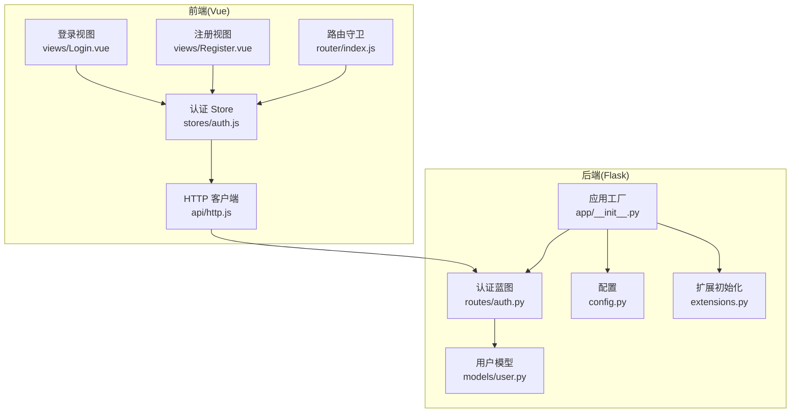
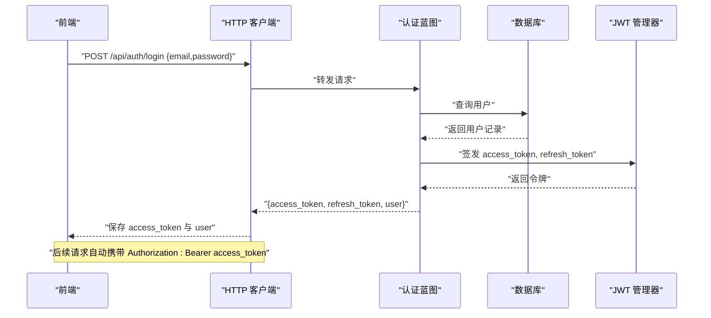
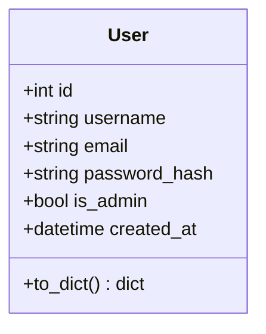
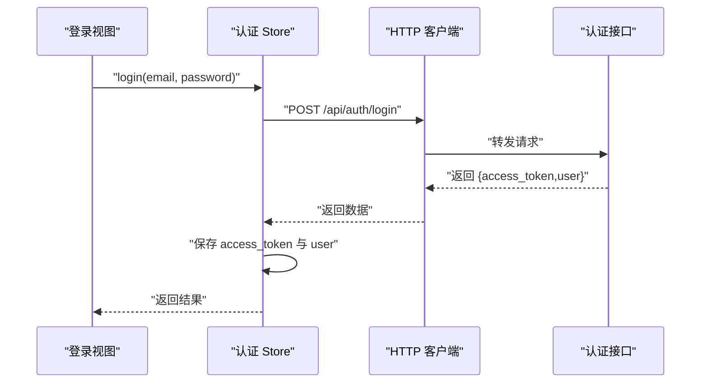
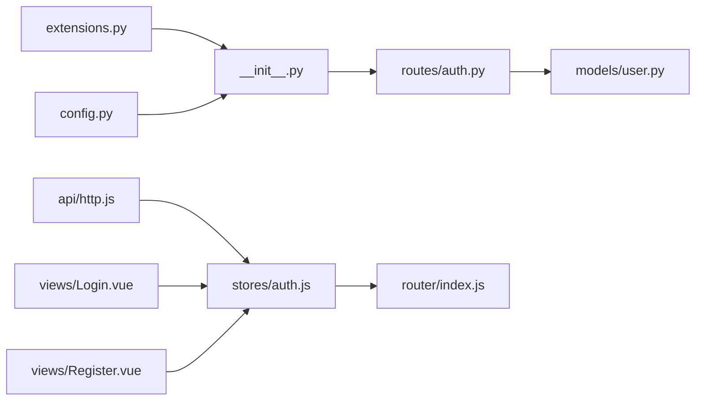

# 认证接口

<cite>
**本文引用的文件**
- [backend/app/routes/auth.py](file://backend/app/routes/auth.py)
- [backend/app/models/user.py](file://backend/app/models/user.py)
- [backend/app/config.py](file://backend/app/config.py)
- [backend/app/extensions.py](file://backend/app/extensions.py)
- [backend/app/__init__.py](file://backend/app/__init__.py)
- [frontend/src/stores/auth.js](file://frontend/src/stores/auth.js)
- [frontend/src/api/http.js](file://frontend/src/api/http.js)
- [frontend/src/views/Login.vue](file://frontend/src/views/Login.vue)
- [frontend/src/views/Register.vue](file://frontend/src/views/Register.vue)
- [frontend/src/router/index.js](file://frontend/src/router/index.js)
</cite>

## 目录
1. [简介](#简介)
2. [项目结构](#项目结构)
3. [核心组件](#核心组件)
4. [架构总览](#架构总览)
5. [详细组件分析](#详细组件分析)
6. [依赖关系分析](#依赖关系分析)
7. [性能考虑](#性能考虑)
8. [故障排除指南](#故障排除指南)
9. [结论](#结论)
10. [附录](#附录)

## 简介
本文件为“单词网站”项目的认证接口详细 API 文档，覆盖以下端点：
- 用户注册：/api/auth/register
- 用户登录：/api/auth/login
- 刷新访问令牌：/api/auth/refresh
- 获取当前用户信息：/api/auth/me

内容涵盖接口方法、请求参数、响应格式、状态码、JWT 令牌生成与验证机制（访问令牌与刷新令牌）、密码加密存储、用户名与邮箱唯一性校验、管理员用户自动分配逻辑、错误处理策略以及前端集成与最佳实践。

## 项目结构
后端采用 Flask 架构，认证路由通过蓝图注册在 /api/auth 下；前端使用 Vue 3 + Pinia + Axios，通过拦截器统一注入 Authorization 头并处理 401 错误。

图表来源
- [backend/app/__init__.py](file://backend/app/__init__.py#L6-L37)
- [backend/app/routes/auth.py](file://backend/app/routes/auth.py#L1-L93)
- [backend/app/models/user.py](file://backend/app/models/user.py#L1-L26)
- [backend/app/config.py](file://backend/app/config.py#L1-L28)
- [backend/app/extensions.py](file://backend/app/extensions.py#L1-L10)
- [frontend/src/api/http.js](file://frontend/src/api/http.js#L1-L48)
- [frontend/src/stores/auth.js](file://frontend/src/stores/auth.js#L1-L59)
- [frontend/src/views/Login.vue](file://frontend/src/views/Login.vue#L1-L116)
- [frontend/src/views/Register.vue](file://frontend/src/views/Register.vue#L1-L151)
- [frontend/src/router/index.js](file://frontend/src/router/index.js#L1-L64)

章节来源
- [backend/app/__init__.py](file://backend/app/__init__.py#L6-L37)
- [frontend/src/api/http.js](file://frontend/src/api/http.js#L1-L48)

## 核心组件
- 认证蓝图：提供注册、登录、刷新令牌、获取当前用户等端点。
- 用户模型：定义用户字段、唯一约束及序列化方法。
- 配置：JWT 密钥与过期时间、数据库连接、上传配置。
- 扩展：SQLAlchemy、JWTManager、CORS、Bcrypt 的初始化。
- 前端 Store：封装登录/注册/登出逻辑，持久化访问令牌与用户信息。
- HTTP 客户端：全局请求拦截器添加 Bearer Token，响应拦截器处理 401 并跳转登录。

章节来源
- [backend/app/routes/auth.py](file://backend/app/routes/auth.py#L1-L93)
- [backend/app/models/user.py](file://backend/app/models/user.py#L1-L26)
- [backend/app/config.py](file://backend/app/config.py#L1-L28)
- [backend/app/extensions.py](file://backend/app/extensions.py#L1-L10)
- [frontend/src/stores/auth.js](file://frontend/src/stores/auth.js#L1-L59)
- [frontend/src/api/http.js](file://frontend/src/api/http.js#L1-L48)

## 架构总览
认证流程涉及前后端协作：前端提交凭据或访问令牌，后端进行校验并签发 JWT；前端通过拦截器自动附加 Authorization 头，后端通过装饰器校验令牌。

图表来源
- [backend/app/routes/auth.py](file://backend/app/routes/auth.py#L46-L72)
- [frontend/src/api/http.js](file://frontend/src/api/http.js#L11-L23)

## 详细组件分析

### 接口规范

#### 1) 用户注册 /api/auth/register
- 方法：POST
- 请求头：Content-Type: application/json
- 请求体字段
  - username: 字符串，必填，去空白
  - email: 字符串，必填，去空白
  - password: 字符串，必填，长度≥6
- 成功响应
  - 状态码：201 Created
  - 结构：{"success": true, "message": "..."}
- 失败响应
  - 状态码：400 Bad Request
  - 结构：{"success": false, "message": "..."}
  - 场景：
    - 缺少请求体或字段为空
    - 密码长度不足
    - 用户名已存在
    - 邮箱已被注册
- 业务逻辑要点
  - 唯一性检查：用户名与邮箱均唯一
  - 密码加密：使用 Bcrypt 生成哈希并存储
  - 管理员分配：首个注册用户自动设为管理员

请求示例
- POST /api/auth/register
- Body: {"username":"alice","email":"alice@example.com","password":"123456"}

响应示例
- 201 成功：{"success":true,"message":"注册成功"}
- 400 失败：{"success":false,"message":"用户名已存在"}

章节来源
- [backend/app/routes/auth.py](file://backend/app/routes/auth.py#L8-L43)
- [backend/app/models/user.py](file://backend/app/models/user.py#L7-L12)

#### 2) 用户登录 /api/auth/login
- 方法：POST
- 请求头：Content-Type: application/json
- 请求体字段
  - email: 字符串，必填，去空白
  - password: 字符串，必填
- 成功响应
  - 状态码：200 OK
  - 结构：{"success": true, "access_token": "...", "refresh_token": "...", "user": {...}}
  - user 字段：id, username, email, is_admin, created_at
- 失败响应
  - 状态码：400 Bad Request 或 401 Unauthorized
  - 结构：{"success": false, "message": "..."}
  - 场景：
    - 缺少请求体或字段为空
    - 邮箱或密码错误
- 业务逻辑要点
  - 使用 Bcrypt 校验密码哈希
  - 同时签发访问令牌与刷新令牌
  - 返回用户对象（不含敏感信息）

请求示例
- POST /api/auth/login
- Body: {"email":"alice@example.com","password":"123456"}

响应示例
- 200 成功：{"success":true,"access_token":"...","refresh_token":"...","user":{"id":1,"username":"alice","email":"alice@example.com","is_admin":true,"created_at":"2025-01-01T00:00:00"}}

章节来源
- [backend/app/routes/auth.py](file://backend/app/routes/auth.py#L46-L72)
- [backend/app/models/user.py](file://backend/app/models/user.py#L18-L25)

#### 3) 刷新访问令牌 /api/auth/refresh
- 方法：POST
- 请求头：Authorization: Bearer <refresh_token>
- 鉴权：需要有效的刷新令牌
- 成功响应
  - 状态码：200 OK
  - 结构：{"access_token": "..."}
- 失败响应
  - 状态码：401 Unauthorized
  - 结构：{"success": false, "message": "..."}
- 业务逻辑要点
  - 使用装饰器校验刷新令牌
  - 重新签发新的访问令牌

请求示例
- POST /api/auth/refresh
- Header: Authorization: Bearer <refresh_token>

响应示例
- 200 成功：{"access_token":"new_access_token"}

章节来源
- [backend/app/routes/auth.py](file://backend/app/routes/auth.py#L75-L80)

#### 4) 获取当前用户信息 /api/auth/me
- 方法：GET
- 请求头：Authorization: Bearer <access_token>
- 鉴权：需要有效的访问令牌
- 成功响应
  - 状态码：200 OK
  - 结构：{"success": true, "user": {...}}
- 失败响应
  - 状态码：401 Unauthorized 或 404 Not Found
  - 结构：{"success": false, "message": "..."}
- 业务逻辑要点
  - 从令牌中解析用户 ID
  - 查询用户并返回序列化结果

请求示例
- GET /api/auth/me
- Header: Authorization: Bearer <access_token>

响应示例
- 200 成功：{"success":true,"user":{"id":1,"username":"alice","email":"alice@example.com","is_admin":true,"created_at":"2025-01-01T00:00:00"}}

章节来源
- [backend/app/routes/auth.py](file://backend/app/routes/auth.py#L83-L92)
- [backend/app/models/user.py](file://backend/app/models/user.py#L18-L25)

### JWT 令牌机制
- 访问令牌（Access Token）
  - 用途：用于受保护资源访问
  - 过期时间：配置为 1 小时
  - 签发：登录成功时返回
- 刷新令牌（Refresh Token）
  - 用途：在访问令牌过期后换取新的访问令牌
  - 过期时间：配置为 30 天
  - 签发：登录成功时返回
- 刷新流程
  - 前端持有 access_token 与 refresh_token
  - 当收到 401 时，清除本地存储并跳转登录页
  - 可调用刷新接口获取新的 access_token

章节来源
- [backend/app/config.py](file://backend/app/config.py#L20-L23)
- [backend/app/routes/auth.py](file://backend/app/routes/auth.py#L64-L80)
- [frontend/src/api/http.js](file://frontend/src/api/http.js#L30-L44)

### 数据模型
用户实体包含以下关键字段与关系：
- 字段：id, username(唯一), email(唯一), password_hash, is_admin(默认 false), created_at
- 序列化：to_dict 返回 id, username, email, is_admin, created_at

图表来源
- [backend/app/models/user.py](file://backend/app/models/user.py#L4-L25)

章节来源
- [backend/app/models/user.py](file://backend/app/models/user.py#L1-L26)

### 前端集成与最佳实践
- 登录/注册 Store
  - login(email, password): 发起登录请求，成功后保存 access_token 与 user 至本地存储
  - register(username, email, password): 发起注册请求
  - logout(): 清除本地存储与状态
- HTTP 客户端
  - 请求拦截器：自动在 Authorization 头中附加 Bearer access_token
  - 响应拦截器：处理 401，清除本地存储并跳转登录页
- 视图组件
  - Login.vue：收集邮箱与密码，提交至 Store
  - Register.vue：收集用户名、邮箱、密码与确认密码，提交至 Store
- 路由守卫
  - requiresAuth：未登录禁止访问受保护页面
  - guest：已登录用户禁止访问登录/注册页
  - requiresAdmin：仅管理员可访问管理页

图表来源
- [frontend/src/views/Login.vue](file://frontend/src/views/Login.vue#L57-L71)
- [frontend/src/stores/auth.js](file://frontend/src/stores/auth.js#L22-L34)
- [frontend/src/api/http.js](file://frontend/src/api/http.js#L12-L23)

章节来源
- [frontend/src/stores/auth.js](file://frontend/src/stores/auth.js#L1-L59)
- [frontend/src/api/http.js](file://frontend/src/api/http.js#L1-L48)
- [frontend/src/views/Login.vue](file://frontend/src/views/Login.vue#L1-L116)
- [frontend/src/views/Register.vue](file://frontend/src/views/Register.vue#L1-L151)
- [frontend/src/router/index.js](file://frontend/src/router/index.js#L48-L61)

## 依赖关系分析
- 后端
  - 应用工厂初始化扩展（SQLAlchemy、JWT、CORS、Bcrypt），注册认证蓝图并绑定前缀 /api/auth
  - 认证蓝图依赖用户模型与扩展（db、bcrypt）
- 前端
  - Store 依赖 HTTP 客户端
  - HTTP 客户端依赖 Axios
  - 路由守卫依赖本地存储中的 access_token 与 user

图表来源
- [backend/app/extensions.py](file://backend/app/extensions.py#L1-L10)
- [backend/app/__init__.py](file://backend/app/__init__.py#L6-L37)
- [backend/app/config.py](file://backend/app/config.py#L1-L28)
- [backend/app/routes/auth.py](file://backend/app/routes/auth.py#L1-L93)
- [backend/app/models/user.py](file://backend/app/models/user.py#L1-L26)
- [frontend/src/api/http.js](file://frontend/src/api/http.js#L1-L48)
- [frontend/src/stores/auth.js](file://frontend/src/stores/auth.js#L1-L59)
- [frontend/src/router/index.js](file://frontend/src/router/index.js#L1-L64)
- [frontend/src/views/Login.vue](file://frontend/src/views/Login.vue#L1-L116)
- [frontend/src/views/Register.vue](file://frontend/src/views/Register.vue#L1-L151)

章节来源
- [backend/app/__init__.py](file://backend/app/__init__.py#L6-L37)
- [frontend/src/stores/auth.js](file://frontend/src/stores/auth.js#L1-L59)
- [frontend/src/api/http.js](file://frontend/src/api/http.js#L1-L48)

## 性能考虑
- 密码哈希成本：Bcrypt 默认成本适中，可在生产环境根据硬件能力调整以平衡安全与性能
- 数据库索引：用户名与邮箱字段已声明唯一，建议确保数据库层面也建立唯一索引
- JWT 过期策略：访问令牌短周期、刷新令牌长周期，减少频繁登录带来的用户体验问题
- 前端缓存：Store 与本地存储结合，避免重复请求与不必要的网络开销

## 故障排除指南
- 400 Bad Request
  - 注册：缺少请求体、字段为空、密码长度不足、用户名或邮箱已存在
  - 登录：缺少请求体、字段为空、邮箱或密码错误
- 401 Unauthorized
  - 访问令牌无效或过期；响应拦截器会清除本地存储并跳转登录页
- 404 Not Found
  - 当前用户查询不到（极少见，通常发生在数据异常）
- 建议排查步骤
  - 检查请求体字段是否正确传递
  - 确认本地存储中是否存在 access_token
  - 核对 JWT 密钥与过期时间配置
  - 查看数据库中用户记录是否符合预期

章节来源
- [backend/app/routes/auth.py](file://backend/app/routes/auth.py#L12-L43)
- [backend/app/routes/auth.py](file://backend/app/routes/auth.py#L46-L72)
- [backend/app/routes/auth.py](file://backend/app/routes/auth.py#L75-L92)
- [frontend/src/api/http.js](file://frontend/src/api/http.js#L30-L44)

## 结论
该认证系统基于 Flask 与 Vue 实现，具备完善的注册、登录、令牌刷新与当前用户查询能力。后端通过 JWT 提供短期访问令牌与长期刷新令牌，前端通过拦截器统一处理鉴权与错误，配合路由守卫实现页面级权限控制。系统在安全性、易用性与可维护性之间取得良好平衡，适合进一步扩展为完整的用户中心。

## 附录

### 端点一览与状态码
- POST /api/auth/register
  - 201：注册成功
  - 400：请求无效或用户名/邮箱已存在
- POST /api/auth/login
  - 200：登录成功，返回 access_token、refresh_token 与用户信息
  - 400/401：请求无效或邮箱/密码错误
- POST /api/auth/refresh
  - 200：返回新的 access_token
  - 401：刷新令牌无效
- GET /api/auth/me
  - 200：返回当前用户信息
  - 401：访问令牌无效
  - 404：用户不存在

### 前端集成清单
- 在登录页调用 Store.login(email, password)，成功后跳转首页
- 在注册页调用 Store.register(username, email, password)
- 在所有受保护接口中，确保 HTTP 客户端自动附加 Authorization 头
- 在路由守卫中处理 requiresAuth、guest、requiresAdmin