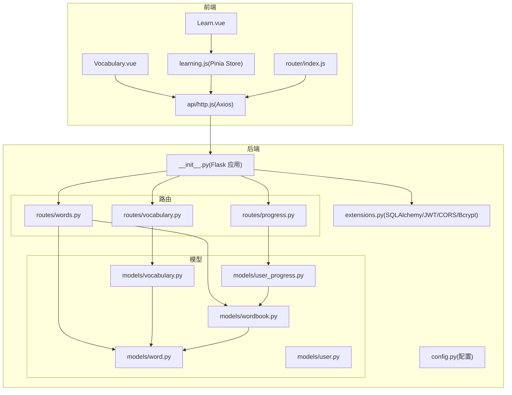
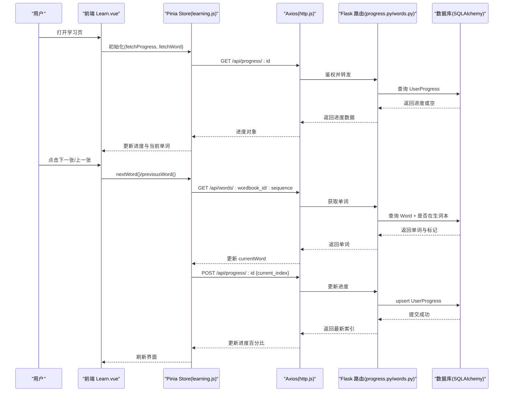
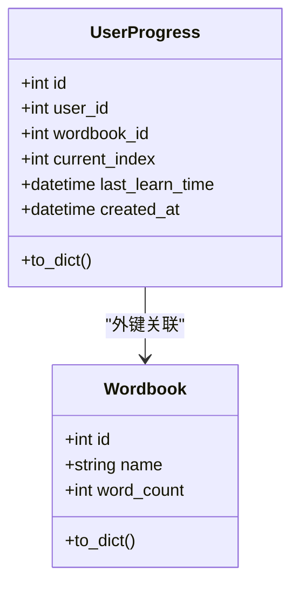
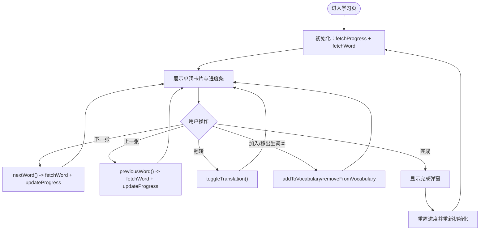
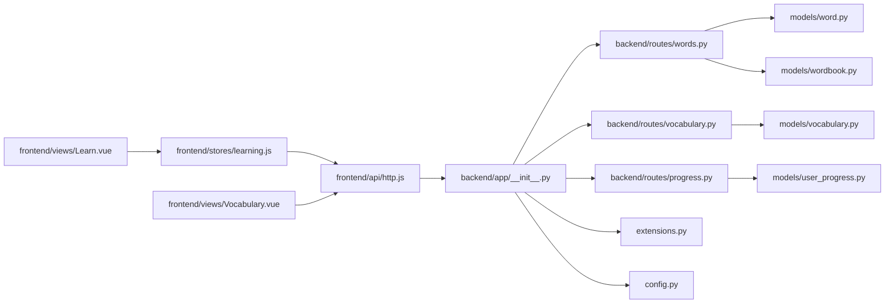

# 学习进度追踪

<cite>
**本文引用的文件**
- [backend/app/models/user_progress.py](file://backend/app/models/user_progress.py)
- [backend/app/routes/progress.py](file://backend/app/routes/progress.py)
- [frontend/src/stores/learning.js](file://frontend/src/stores/learning.js)
- [frontend/src/views/Learn.vue](file://frontend/src/views/Learn.vue)
- [backend/app/models/word.py](file://backend/app/models/word.py)
- [backend/app/models/wordbook.py](file://backend/app/models/wordbook.py)
- [backend/app/routes/words.py](file://backend/app/routes/words.py)
- [backend/app/models/vocabulary.py](file://backend/app/models/vocabulary.py)
- [backend/app/routes/vocabulary.py](file://backend/app/routes/vocabulary.py)
- [frontend/src/views/Vocabulary.vue](file://frontend/src/views/Vocabulary.vue)
- [backend/app/extensions.py](file://backend/app/extensions.py)
- [backend/app/__init__.py](file://backend/app/__init__.py)
- [backend/app/config.py](file://backend/app/config.py)
- [frontend/src/api/http.js](file://frontend/src/api/http.js)
- [frontend/src/router/index.js](file://frontend/src/router/index.js)
- [README_CN.md](file://README_CN.md)
</cite>

## 目录
1. [简介](#简介)
2. [项目结构](#项目结构)
3. [核心组件](#核心组件)
4. [架构总览](#架构总览)
5. [详细组件分析](#详细组件分析)
6. [依赖关系分析](#依赖关系分析)
7. [性能考虑](#性能考虑)
8. [故障排查指南](#故障排查指南)
9. [结论](#结论)
10. [附录](#附录)

## 简介
本系统是一个基于 Flask + Vue 3 的单词学习平台，提供学习进度追踪、断点续学、生词本管理与学习统计分析能力。后端负责用户认证、学习进度持久化、单词与词库数据管理；前端通过 Pinia 状态管理与路由守卫保障用户体验，支持进度条可视化、单词卡片交互、生词本维护与分页展示。

## 项目结构
- 后端采用 Flask，模块化组织模型、路由与服务层，统一通过蓝图注册 API。
- 前端采用 Vue 3 + Vite，使用 Pinia 管理学习状态，Vue Router 实现路由守卫与导航。
- 数据库通过 SQLAlchemy 管理，JWT 用于鉴权，CORS 放通跨域请求。

图表来源
- [backend/app/__init__.py](file://backend/app/__init__.py#L1-L37)
- [backend/app/config.py](file://backend/app/config.py#L1-L28)
- [backend/app/extensions.py](file://backend/app/extensions.py#L1-L10)
- [backend/app/models/word.py](file://backend/app/models/word.py#L1-L29)
- [backend/app/models/wordbook.py](file://backend/app/models/wordbook.py#L1-L25)
- [backend/app/models/user_progress.py](file://backend/app/models/user_progress.py#L1-L29)
- [backend/app/models/vocabulary.py](file://backend/app/models/vocabulary.py#L1-L26)
- [backend/app/routes/words.py](file://backend/app/routes/words.py#L1-L65)
- [backend/app/routes/vocabulary.py](file://backend/app/routes/vocabulary.py#L1-L103)
- [backend/app/routes/progress.py](file://backend/app/routes/progress.py#L1-L115)
- [frontend/src/views/Learn.vue](file://frontend/src/views/Learn.vue#L1-L342)
- [frontend/src/views/Vocabulary.vue](file://frontend/src/views/Vocabulary.vue#L1-L207)
- [frontend/src/stores/learning.js](file://frontend/src/stores/learning.js#L1-L112)
- [frontend/src/router/index.js](file://frontend/src/router/index.js#L1-L64)
- [frontend/src/api/http.js](file://frontend/src/api/http.js#L1-L48)

章节来源
- [README_CN.md](file://README_CN.md#L1-L84)
- [backend/app/__init__.py](file://backend/app/__init__.py#L1-L37)
- [frontend/src/router/index.js](file://frontend/src/router/index.js#L1-L64)

## 核心组件
- 用户学习进度模型：记录用户在某个词库中的当前学习序号、最后学习时间等，支持唯一约束与索引优化。
- 学习进度路由：提供获取、更新与重置进度的接口，计算进度百分比并进行边界校验。
- 前端学习状态管理：集中管理当前单词、进度、加载状态与生词本操作，封装与后端的交互。
- 单词与词库模型：定义单词序列、词库计数与关系，支撑进度计算与分页批量加载。
- 生词本模型与路由：提供生词本查询、添加与删除，支持按词库过滤与分页。
- 前端生词本视图：展示生词列表、分页与移除操作，格式化添加时间。
- 鉴权与网络层：JWT 鉴权、Token 自动注入与过期处理、路由守卫控制访问。

章节来源
- [backend/app/models/user_progress.py](file://backend/app/models/user_progress.py#L1-L29)
- [backend/app/routes/progress.py](file://backend/app/routes/progress.py#L1-L115)
- [frontend/src/stores/learning.js](file://frontend/src/stores/learning.js#L1-L112)
- [backend/app/models/word.py](file://backend/app/models/word.py#L1-L29)
- [backend/app/models/wordbook.py](file://backend/app/models/wordbook.py#L1-L25)
- [backend/app/routes/words.py](file://backend/app/routes/words.py#L1-L65)
- [backend/app/models/vocabulary.py](file://backend/app/models/vocabulary.py#L1-L26)
- [backend/app/routes/vocabulary.py](file://backend/app/routes/vocabulary.py#L1-L103)
- [frontend/src/views/Vocabulary.vue](file://frontend/src/views/Vocabulary.vue#L1-L207)
- [frontend/src/api/http.js](file://frontend/src/api/http.js#L1-L48)
- [frontend/src/router/index.js](file://frontend/src/router/index.js#L1-L64)

## 架构总览
系统采用前后端分离架构，前端通过 Axios 发起 API 请求，后端以蓝图形式暴露 REST 接口，使用 JWT 进行鉴权，SQLAlchemy 管理数据库模型与关系。

图表来源
- [frontend/src/views/Learn.vue](file://frontend/src/views/Learn.vue#L123-L197)
- [frontend/src/stores/learning.js](file://frontend/src/stores/learning.js#L16-L93)
- [backend/app/routes/progress.py](file://backend/app/routes/progress.py#L11-L95)
- [backend/app/routes/words.py](file://backend/app/routes/words.py#L10-L38)
- [frontend/src/api/http.js](file://frontend/src/api/http.js#L1-L48)

## 详细组件分析

### 学习进度模型与路由
- 模型设计要点
  - 唯一性约束：用户+词库组合唯一，避免重复记录。
  - 索引优化：用户+词库联合索引，提升查询效率。
  - 时间字段：记录最后学习时间，便于后续统计与提醒。
- 路由行为
  - 获取进度：若无记录则返回默认初始状态；计算百分比并返回。
  - 更新进度：校验索引范围，支持新增或更新；更新最后学习时间。
  - 重置进度：将索引归位并更新时间。

图表来源
- [backend/app/models/user_progress.py](file://backend/app/models/user_progress.py#L1-L29)
- [backend/app/models/wordbook.py](file://backend/app/models/wordbook.py#L1-L25)

章节来源
- [backend/app/models/user_progress.py](file://backend/app/models/user_progress.py#L1-L29)
- [backend/app/routes/progress.py](file://backend/app/routes/progress.py#L11-L115)

### 前端学习状态管理与视图
- 状态管理
  - 维护当前单词、进度、加载状态与词库 ID。
  - 封装获取进度、获取单词、更新进度、上下一张、切换释义、加入/移出生词本与重置。
- 视图交互
  - 进度条：宽度随百分比变化，文本显示当前序号/总数。
  - 卡片交互：点击翻转显示释义；支持键盘空格、左右箭头、S 键。
  - 完成提示：到达末尾弹窗，支持重新开始。

图表来源
- [frontend/src/stores/learning.js](file://frontend/src/stores/learning.js#L16-L93)
- [frontend/src/views/Learn.vue](file://frontend/src/views/Learn.vue#L123-L197)

章节来源
- [frontend/src/stores/learning.js](file://frontend/src/stores/learning.js#L1-L112)
- [frontend/src/views/Learn.vue](file://frontend/src/views/Learn.vue#L1-L342)

### 单词与词库模型
- 单词模型
  - 唯一性约束：词库+序号唯一，保证顺序稳定。
  - 索引优化：词库+序号联合索引，加速查询。
- 词库模型
  - 记录单词总数，作为进度百分比计算依据。

章节来源
- [backend/app/models/word.py](file://backend/app/models/word.py#L1-L29)
- [backend/app/models/wordbook.py](file://backend/app/models/wordbook.py#L1-L25)

### 生词本模型与路由
- 模型设计
  - 唯一性约束：用户+单词唯一，防止重复添加。
  - 关联关系：反向关联单词与用户。
- 路由能力
  - 分页查询：支持按词库过滤与分页。
  - 添加/删除：支持按 ID 或单词 ID 删除。

章节来源
- [backend/app/models/vocabulary.py](file://backend/app/models/vocabulary.py#L1-L26)
- [backend/app/routes/vocabulary.py](file://backend/app/routes/vocabulary.py#L1-L103)
- [frontend/src/views/Vocabulary.vue](file://frontend/src/views/Vocabulary.vue#L1-L207)

### 前端网络层与鉴权
- Axios 配置
  - 自动注入 Authorization Bearer Token。
  - 统一响应拦截，处理 401 清除本地 Token 并跳转登录。
- 路由守卫
  - 登录/注册页仅访客可进；学习页需登录；管理员页需管理员权限。

章节来源
- [frontend/src/api/http.js](file://frontend/src/api/http.js#L1-L48)
- [frontend/src/router/index.js](file://frontend/src/router/index.js#L1-L64)

## 依赖关系分析
- 组件耦合
  - 前端 Store 与后端 API 紧密耦合，通过统一的 /api 前缀调用。
  - 路由层仅依赖模型层，模型层仅依赖 SQLAlchemy 扩展，职责清晰。
- 外部依赖
  - Flask 扩展：SQLAlchemy、JWT、CORS、Bcrypt。
  - 前端依赖：Vue 3、Pinia、Axios、Vue Router。

图表来源
- [frontend/src/api/http.js](file://frontend/src/api/http.js#L1-L48)
- [frontend/src/stores/learning.js](file://frontend/src/stores/learning.js#L1-L112)
- [frontend/src/views/Learn.vue](file://frontend/src/views/Learn.vue#L1-L342)
- [frontend/src/views/Vocabulary.vue](file://frontend/src/views/Vocabulary.vue#L1-L207)
- [backend/app/__init__.py](file://backend/app/__init__.py#L1-L37)
- [backend/app/extensions.py](file://backend/app/extensions.py#L1-L10)
- [backend/app/config.py](file://backend/app/config.py#L1-L28)
- [backend/app/routes/words.py](file://backend/app/routes/words.py#L1-L65)
- [backend/app/routes/vocabulary.py](file://backend/app/routes/vocabulary.py#L1-L103)
- [backend/app/routes/progress.py](file://backend/app/routes/progress.py#L1-L115)
- [backend/app/models/word.py](file://backend/app/models/word.py#L1-L29)
- [backend/app/models/wordbook.py](file://backend/app/models/wordbook.py#L1-L25)
- [backend/app/models/vocabulary.py](file://backend/app/models/vocabulary.py#L1-L26)
- [backend/app/models/user_progress.py](file://backend/app/models/user_progress.py#L1-L29)

章节来源
- [backend/app/__init__.py](file://backend/app/__init__.py#L1-L37)
- [backend/app/extensions.py](file://backend/app/extensions.py#L1-L10)
- [backend/app/config.py](file://backend/app/config.py#L1-L28)
- [frontend/src/api/http.js](file://frontend/src/api/http.js#L1-L48)

## 性能考虑
- 查询优化
  - 进度查询：UserProgress 使用用户+词库唯一索引，避免全表扫描。
  - 单词查询：Wordbook+Sequence 联合索引，支持快速定位。
- 批量加载
  - 批量接口支持分段拉取，减少单次请求数据量，适合移动端网络环境。
- 缓存策略
  - 前端 Store 已缓存当前进度与单词，避免重复请求。
  - 可在网关或 Redis 层引入短期缓存（如最近一次进度与单词），降低数据库压力。
- 实时同步
  - 当前为请求-响应模式；若需实时，可在 WebSocket 层面推送进度变更（建议）。

章节来源
- [backend/app/models/user_progress.py](file://backend/app/models/user_progress.py#L14-L17)
- [backend/app/models/word.py](file://backend/app/models/word.py#L15-L18)
- [backend/app/routes/words.py](file://backend/app/routes/words.py#L41-L65)
- [frontend/src/stores/learning.js](file://frontend/src/stores/learning.js#L16-L50)

## 故障排查指南
- 401 未授权
  - 现象：接口返回 401。
  - 处理：前端自动清除本地 Token 并跳转登录页。
- 单词不存在
  - 现象：获取单词接口返回不存在。
  - 处理：确认词库 ID 与序号范围，检查 Wordbook.word_count 与 Sequence 约束。
- 进度索引越界
  - 现象：更新进度返回索引超出范围。
  - 处理：确保 current_index 在 [1, word_count] 区间内。
- Token 过期
  - 现象：部分接口鉴权失败。
  - 处理：刷新 Token 或重新登录；后端 JWT 配置可调整过期时间。

章节来源
- [frontend/src/api/http.js](file://frontend/src/api/http.js#L34-L44)
- [backend/app/routes/words.py](file://backend/app/routes/words.py#L16-L27)
- [backend/app/routes/progress.py](file://backend/app/routes/progress.py#L60-L72)
- [backend/app/config.py](file://backend/app/config.py#L20-L23)

## 结论
本系统以简洁的模型与清晰的前后端职责划分，实现了断点续学、进度可视化与生词本管理。通过唯一约束与索引优化，保障了进度与单词查询的稳定性；借助 Pinia 与 Axios，提供了良好的交互体验。建议后续引入批处理与缓存策略，进一步提升性能与离线体验。

## 附录
- 术语
  - 词库：包含若干单词的学习集合，记录单词总数用于进度计算。
  - 进度：以当前序号与词库总数计算百分比，记录最后学习时间。
  - 生词本：用户自定义的单词收藏集合，支持按词库过滤与分页。
- 使用建议
  - 学习时保持网络稳定，以便进度及时保存。
  - 利用生词本进行重点复习，结合进度条监控整体掌握情况。
  - 如需离线学习，可结合浏览器缓存策略与本地存储（当前实现以在线为主）。