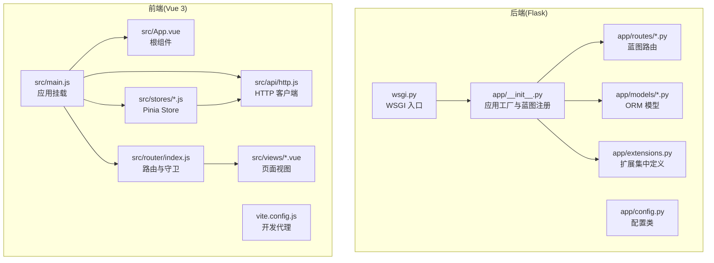
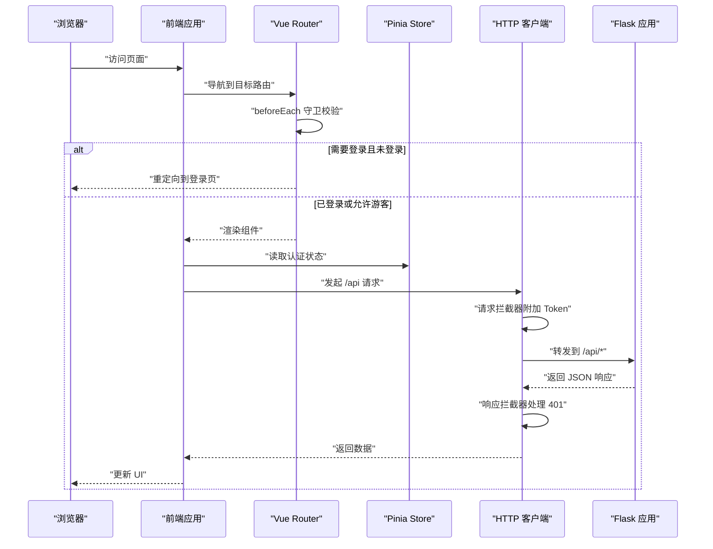
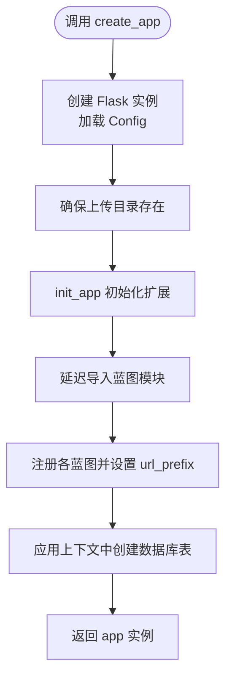
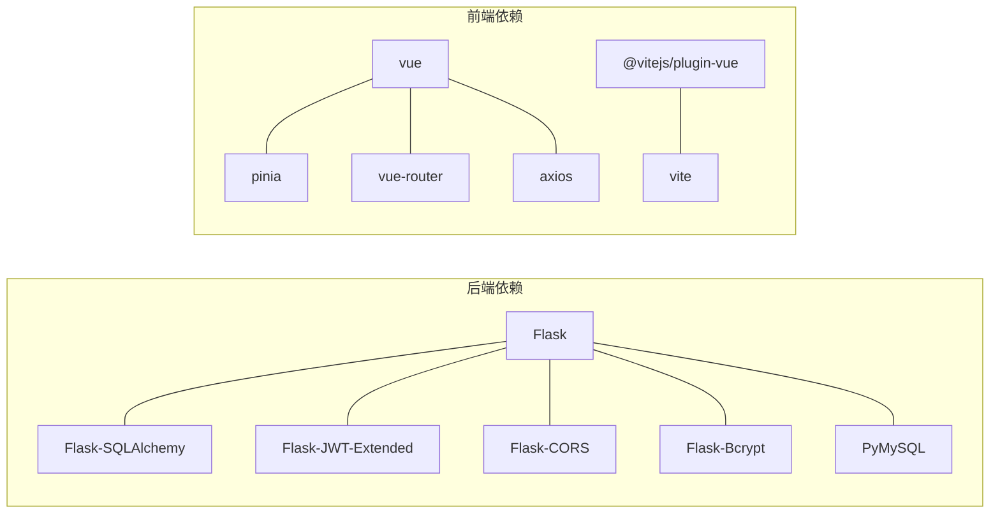

# 代码规范与最佳实践

<cite>
**本文引用的文件**
- [backend/app/__init__.py](file://backend/app/__init__.py)
- [backend/app/extensions.py](file://backend/app/extensions.py)
- [backend/app/config.py](file://backend/app/config.py)
- [backend/app/routes/auth.py](file://backend/app/routes/auth.py)
- [backend/app/models/user.py](file://backend/app/models/user.py)
- [backend/wsgi.py](file://backend/wsgi.py)
- [backend/requirements.txt](file://backend/requirements.txt)
- [frontend/src/main.js](file://frontend/src/main.js)
- [frontend/src/App.vue](file://frontend/src/App.vue)
- [frontend/src/router/index.js](file://frontend/src/router/index.js)
- [frontend/src/stores/auth.js](file://frontend/src/stores/auth.js)
- [frontend/src/api/http.js](file://frontend/src/api/http.js)
- [frontend/src/views/Login.vue](file://frontend/src/views/Login.vue)
- [frontend/src/views/Home.vue](file://frontend/src/views/Home.vue)
- [frontend/package.json](file://frontend/package.json)
- [frontend/vite.config.js](file://frontend/vite.config.js)
- [README_CN.md](file://README_CN.md)
</cite>

## 目录
1. 引言
2. 项目结构
3. 核心组件
4. 架构总览
5. 详细组件分析
6. 依赖关系分析
7. 性能考虑
8. 故障排查指南
9. 结论
10. 附录

## 引言
本文件面向后端 Flask 与前端 Vue 3 的开发者，提供统一的代码规范与最佳实践，覆盖命名约定、缩进与格式化、应用工厂模式、组合式 API 使用、注释与文档字符串、错误处理模式等。文档中的示例与建议均以仓库现有实现为依据，避免主观臆断。

## 项目结构
该项目采用前后端分离架构：
- 后端：Flask 应用工厂模式，按模块组织路由、模型与扩展；通过 WSGI 入口运行。
- 前端：Vue 3 + Vite，使用组合式 API、Pinia 状态管理、Vue Router 路由守卫与 Axios 封装。

图表来源
- [backend/app/__init__.py](file://backend/app/__init__.py#L1-L37)
- [backend/app/extensions.py](file://backend/app/extensions.py#L1-L10)
- [backend/app/config.py](file://backend/app/config.py#L1-L28)
- [backend/wsgi.py](file://backend/wsgi.py#L1-L7)
- [frontend/src/main.js](file://frontend/src/main.js#L1-L13)
- [frontend/src/router/index.js](file://frontend/src/router/index.js#L1-L64)
- [frontend/src/stores/auth.js](file://frontend/src/stores/auth.js#L1-L59)
- [frontend/src/api/http.js](file://frontend/src/api/http.js#L1-L48)
- [frontend/vite.config.js](file://frontend/vite.config.js#L1-L16)

章节来源
- [README_CN.md](file://README_CN.md#L1-L84)
- [backend/app/__init__.py](file://backend/app/__init__.py#L1-L37)
- [frontend/src/main.js](file://frontend/src/main.js#L1-L13)

## 核心组件
- 后端应用工厂：集中配置、扩展初始化与蓝图注册，便于测试与部署。
- 扩展定义：统一在扩展模块中声明，避免循环导入。
- 配置类：集中管理数据库、JWT、上传路径等配置。
- 蓝图路由：按业务域拆分，统一前缀与错误响应格式。
- 前端应用入口：集中注册插件、路由与状态管理。
- 组合式 API：在组件中使用 script setup，配合 Pinia 管理全局状态。
- HTTP 客户端：Axios 封装，统一请求头、超时与拦截器。

章节来源
- [backend/app/__init__.py](file://backend/app/__init__.py#L6-L36)
- [backend/app/extensions.py](file://backend/app/extensions.py#L1-L10)
- [backend/app/config.py](file://backend/app/config.py#L4-L28)
- [backend/app/routes/auth.py](file://backend/app/routes/auth.py#L1-L93)
- [frontend/src/main.js](file://frontend/src/main.js#L1-L13)
- [frontend/src/api/http.js](file://frontend/src/api/http.js#L1-L48)

## 架构总览
后端通过应用工厂创建 Flask 实例，注入扩展与蓝图；前端通过 Vite 开发服务器代理 /api 到后端。路由守卫控制访问权限，Pinia Store 管理认证状态，Axios 拦截器统一处理鉴权与错误。

图表来源
- [frontend/src/router/index.js](file://frontend/src/router/index.js#L48-L61)
- [frontend/src/stores/auth.js](file://frontend/src/stores/auth.js#L1-L59)
- [frontend/src/api/http.js](file://frontend/src/api/http.js#L11-L45)
- [backend/app/__init__.py](file://backend/app/__init__.py#L19-L30)

## 详细组件分析

### Flask 应用工厂模式
- 应用创建：在工厂函数中创建 Flask 实例并加载配置。
- 扩展初始化：在工厂中对扩展进行 init_app，避免循环导入。
- 蓝图注册：延迟导入并注册，统一 url_prefix。
- 数据库初始化：在应用上下文中创建表，确保生产环境可替换为迁移工具。
- WSGI 入口：通过 wsgi.py 调用工厂函数，便于 gunicorn 等 WSGI 服务器直接运行。

图表来源
- [backend/app/__init__.py](file://backend/app/__init__.py#L6-L36)

章节来源
- [backend/app/__init__.py](file://backend/app/__init__.py#L6-L36)
- [backend/app/config.py](file://backend/app/config.py#L4-L28)
- [backend/app/extensions.py](file://backend/app/extensions.py#L1-L10)
- [backend/wsgi.py](file://backend/wsgi.py#L1-L7)

### 蓝图与路由规范
- 统一前缀：所有蓝图以 /api 前缀注册，便于代理与隔离。
- 错误响应格式：统一返回包含 success 字段的对象，便于前端判断。
- 参数校验：在路由层进行基础参数校验与长度限制。
- 权限保护：使用装饰器保护受保护接口，如刷新令牌与当前用户信息。

章节来源
- [backend/app/__init__.py](file://backend/app/__init__.py#L19-L30)
- [backend/app/routes/auth.py](file://backend/app/routes/auth.py#L8-L93)

### ORM 模型与序列化
- 模型字段：明确主键、唯一性、非空与默认值。
- 关系定义：使用 backref 与 lazy 控制关系查询策略。
- 序列化：提供 to_dict 方法，统一输出结构，避免暴露敏感字段。

章节来源
- [backend/app/models/user.py](file://backend/app/models/user.py#L4-L26)

### 前端应用入口与根组件
- 应用挂载：集中注册 Pinia 与路由，再挂载根组件。
- 根组件：在挂载后检查认证状态，保证用户体验一致性。

章节来源
- [frontend/src/main.js](file://frontend/src/main.js#L1-L13)
- [frontend/src/App.vue](file://frontend/src/App.vue#L7-L16)

### 组合式 API 使用规范
- 组件结构：使用 script setup，导出响应式数据与方法。
- 生命周期：在 onMounted 中发起异步数据加载。
- 表单与交互：使用 reactive 与 ref 管理表单与状态，结合模板指令绑定。
- 导航与路由：使用 useRouter 进行编程式导航。

章节来源
- [frontend/src/views/Login.vue](file://frontend/src/views/Login.vue#L41-L72)
- [frontend/src/views/Home.vue](file://frontend/src/views/Home.vue#L65-L108)

### Pinia 状态管理
- Store 设计：使用 defineStore 返回响应式状态与派生状态。
- 认证流程：封装登录、注册、登出逻辑，同步本地存储。
- 读写分离：从本地存储恢复状态，提交成功后再持久化。

章节来源
- [frontend/src/stores/auth.js](file://frontend/src/stores/auth.js#L1-L59)

### 路由守卫与权限控制
- 守卫逻辑：在 beforeEach 中读取本地存储的 token 与用户信息，按 meta 控制访问。
- 游客与登录态：区分 requiresAuth 与 guest，防止已登录用户访问登录页。
- 管理员权限：requiresAdmin 校验用户角色。

章节来源
- [frontend/src/router/index.js](file://frontend/src/router/index.js#L48-L61)

### HTTP 客户端与拦截器
- 基础配置：统一 base URL、超时与 Content-Type。
- 请求拦截：自动附加 Authorization 头。
- 响应拦截：处理 401 清除本地状态并跳转登录；透传业务错误对象。

章节来源
- [frontend/src/api/http.js](file://frontend/src/api/http.js#L1-L48)

### 前端页面与样式
- 页面结构：模板中使用条件渲染与循环展示数据。
- 交互反馈：使用 loading 与 error 状态提升用户体验。
- 样式组织：scoped 样式隔离组件样式。

章节来源
- [frontend/src/views/Login.vue](file://frontend/src/views/Login.vue#L1-L116)
- [frontend/src/views/Home.vue](file://frontend/src/views/Home.vue#L1-L189)

## 依赖关系分析
- 后端依赖：Flask 核心与扩展版本在 requirements.txt 中固定，确保一致性。
- 前端依赖：Vue 3、Pinia、Vue Router、Axios 与 Vite 插件版本在 package.json 中声明。
- 开发代理：Vite 将 /api 代理到后端 5000 端口，便于联调。

图表来源
- [backend/requirements.txt](file://backend/requirements.txt#L1-L11)
- [frontend/package.json](file://frontend/package.json#L1-L22)

章节来源
- [backend/requirements.txt](file://backend/requirements.txt#L1-L11)
- [frontend/package.json](file://frontend/package.json#L1-L22)
- [frontend/vite.config.js](file://frontend/vite.config.js#L8-L14)

## 性能考虑
- 后端
  - 数据库连接池与连接 URI 参数优化，避免在热路径重复创建连接。
  - 蓝图按需导入，减少启动时模块加载开销。
  - 使用延迟创建表仅用于开发/初始化，生产环境建议使用迁移工具。
- 前端
  - 组件懒加载与路由懒加载，减少首屏体积。
  - Pinia 状态粒度控制，避免不必要的响应式更新。
  - Axios 超时与错误重试策略需谨慎设计，避免阻塞 UI。

## 故障排查指南
- 后端
  - 数据库连接失败：检查环境变量与数据库服务状态，确认配置类中的连接串。
  - PDF 解析异常：确认上传文件格式与内容，参考项目说明文档。
- 前端
  - 登录后无法访问受保护页面：检查路由守卫逻辑与本地存储的 token 与用户信息。
  - 接口 401：确认请求拦截器是否附加 Token，响应拦截器是否正确清除本地状态并跳转登录。

章节来源
- [backend/app/config.py](file://backend/app/config.py#L14-L18)
- [frontend/src/router/index.js](file://frontend/src/router/index.js#L48-L61)
- [frontend/src/api/http.js](file://frontend/src/api/http.js#L31-L44)
- [README_CN.md](file://README_CN.md#L78-L80)

## 结论
本项目在后端采用清晰的应用工厂模式与模块化蓝图，在前端采用组合式 API 与 Pinia 管理状态，整体结构清晰、职责分明。建议在生产环境中进一步引入数据库迁移工具、完善的日志与监控体系，以及更细粒度的错误处理与安全防护。

## 附录

### 命名约定与格式化
- Python
  - 模块与包：小写下划线命名（如 app.routes.auth）。
  - 类名：PascalCase（如 Config、User）。
  - 函数与变量：小写下划线命名（如 create_app、user_id）。
  - 常量：全大写与下划线（如 SECRET_KEY）。
  - 缩进：4 空格，遵循 PEP 8。
- JavaScript/TypeScript
  - 文件：小写短横线或小驼峰（如 http.js、auth-store.ts）。
  - 类型与接口：PascalCase（如 HttpConfig）。
  - 变量与函数：小驼峰（如 baseUrl、fetchData）。
  - 常量：全大写与下划线（如 API_BASE_URL）。
  - 缩进：2 空格，遵循项目现有风格。

章节来源
- [backend/app/__init__.py](file://backend/app/__init__.py#L1-L37)
- [backend/app/config.py](file://backend/app/config.py#L4-L28)
- [frontend/src/api/http.js](file://frontend/src/api/http.js#L1-L48)

### 注释与文档字符串
- Python
  - 模块级文档字符串：简述模块用途与职责。
  - 类与函数：使用三引号文档字符串，说明参数、返回值与异常。
  - 复杂逻辑：在关键步骤添加行内注释，解释业务背景或边界条件。
- JavaScript/TypeScript
  - 函数与导出：使用 JSDoc 风格注释，标注参数类型、返回值与异常。
  - 组件：在 script setup 上方添加组件说明与 props/emit 概述。
  - 外部依赖：对第三方库的封装添加使用说明与注意事项。

章节来源
- [backend/app/models/user.py](file://backend/app/models/user.py#L18-L26)
- [frontend/src/stores/auth.js](file://frontend/src/stores/auth.js#L1-L59)

### 错误处理模式
- 后端
  - 路由层：对输入参数进行校验，返回统一结构的错误信息。
  - 扩展层：捕获数据库与加密相关异常，转换为可读的错误消息。
- 前端
  - 组件：在 try/catch 中处理异步操作，设置错误状态并提示用户。
  - HTTP 客户端：响应拦截器统一处理 401 与网络错误，必要时跳转登录。

章节来源
- [backend/app/routes/auth.py](file://backend/app/routes/auth.py#L12-L43)
- [frontend/src/views/Login.vue](file://frontend/src/views/Login.vue#L61-L71)
- [frontend/src/api/http.js](file://frontend/src/api/http.js#L31-L44)

### 最佳实践清单
- 后端
  - 使用应用工厂模式，避免在模块顶层直接初始化扩展。
  - 将配置集中在一个类中，便于环境切换。
  - 蓝图按业务域拆分，统一 url_prefix 与错误格式。
- 前端
  - 使用 script setup 与组合式 API，保持组件简洁。
  - 将全局状态放入 Pinia，避免跨组件传递地狱。
  - 使用路由守卫统一控制访问权限，减少重复逻辑。
  - Axios 封装统一拦截器，减少重复代码。

章节来源
- [backend/app/__init__.py](file://backend/app/__init__.py#L6-L36)
- [frontend/src/router/index.js](file://frontend/src/router/index.js#L48-L61)
- [frontend/src/api/http.js](file://frontend/src/api/http.js#L11-L45)