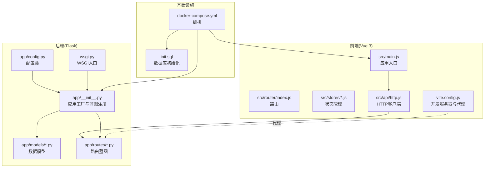
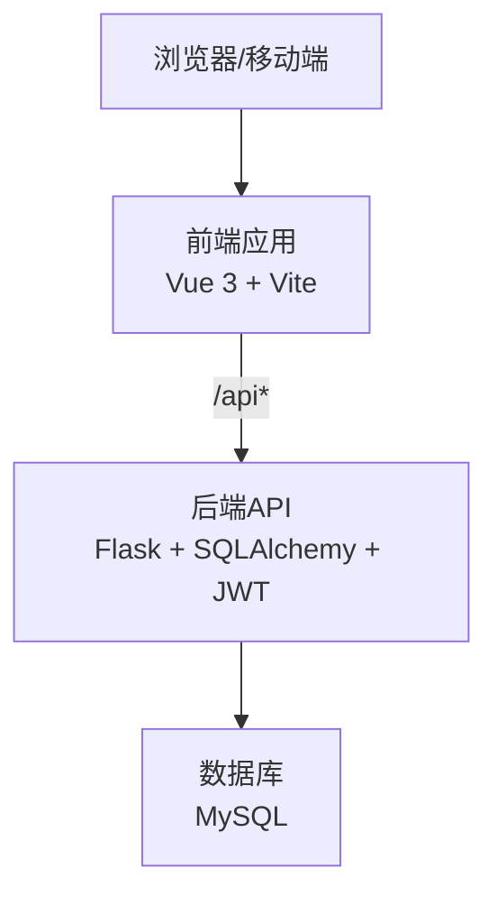
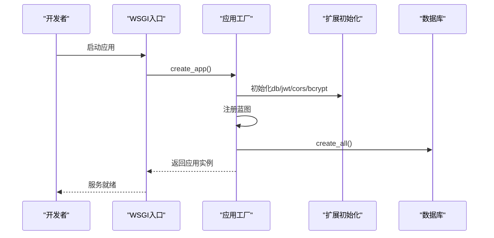
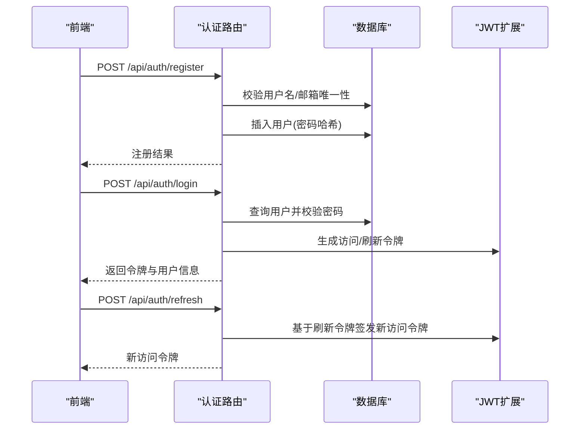
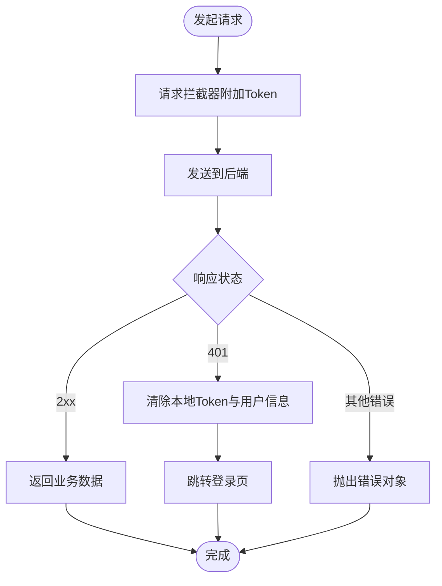
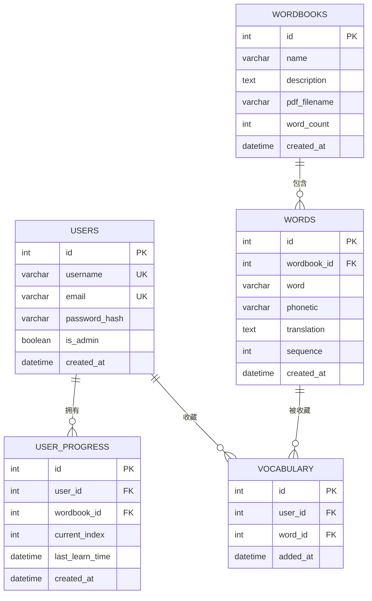
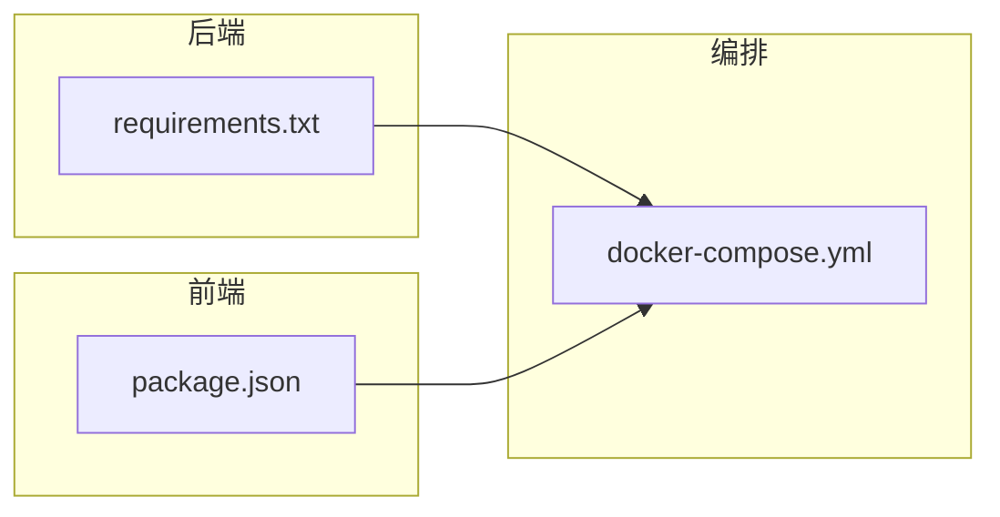

# 开发指南

<cite>
**本文引用的文件**
- [README_CN.md](file://README_CN.md)
- [docker-compose.yml](file://docker-compose.yml)
- [backend/app/config.py](file://backend/app/config.py)
- [backend/app/__init__.py](file://backend/app/__init__.py)
- [backend/wsgi.py](file://backend/wsgi.py)
- [backend/requirements.txt](file://backend/requirements.txt)
- [backend/app/models/user.py](file://backend/app/models/user.py)
- [backend/app/routes/auth.py](file://backend/app/routes/auth.py)
- [frontend/package.json](file://frontend/package.json)
- [frontend/vite.config.js](file://frontend/vite.config.js)
- [frontend/src/main.js](file://frontend/src/main.js)
- [frontend/src/api/http.js](file://frontend/src/api/http.js)
- [init.sql](file://init.sql)
</cite>

## 目录
1. [简介](#简介)
2. [项目结构](#项目结构)
3. [核心组件](#核心组件)
4. [架构总览](#架构总览)
5. [详细组件分析](#详细组件分析)
6. [依赖分析](#依赖分析)
7. [性能考虑](#性能考虑)
8. [故障排查指南](#故障排查指南)
9. [结论](#结论)
10. [附录](#附录)

## 简介
本开发指南面向参与单词学习网站项目的开发者，目标是提供从环境搭建、代码规范、架构理解、测试策略、性能优化到 CI/CD 流程的完整实践指引。项目采用前后端分离架构：后端基于 Flask，前端基于 Vue 3 + Vite，数据库使用 MySQL，通过 Docker Compose 实现一键部署。

## 项目结构
项目采用按层与按功能混合的组织方式：
- 后端 backend：Flask 应用，包含模型、路由、服务、配置与扩展初始化；WSGI 入口用于本地开发与生产运行。
- 前端 frontend：Vue 3 应用，使用 Pinia 状态管理、Vue Router 路由、Axios 发起 API 请求；Vite 提供开发服务器与代理。
- docker：Dockerfile 与 Nginx 配置，配合 docker-compose 编排数据库、后端与前端服务。
- init.sql：数据库初始化脚本，定义用户、词库、单词、学习进度与生词本等核心表。
- README_CN.md：项目使用说明与快速启动指南。

图表来源
- [backend/app/__init__.py](file://backend/app/__init__.py#L1-L37)
- [backend/app/config.py](file://backend/app/config.py#L1-L28)
- [backend/wsgi.py](file://backend/wsgi.py#L1-L7)
- [frontend/src/main.js](file://frontend/src/main.js#L1-L13)
- [frontend/src/api/http.js](file://frontend/src/api/http.js#L1-L48)
- [frontend/vite.config.js](file://frontend/vite.config.js#L1-L16)
- [docker-compose.yml](file://docker-compose.yml#L1-L59)
- [init.sql](file://init.sql#L1-L67)

章节来源
- [README_CN.md](file://README_CN.md#L1-L84)
- [docker-compose.yml](file://docker-compose.yml#L1-L59)

## 核心组件
- 应用工厂与蓝图注册：后端通过应用工厂集中初始化配置、扩展与蓝图，便于测试与部署。
- 配置管理：集中于配置类，统一管理数据库、JWT、上传目录与大小限制。
- 数据模型：用户、词库、单词、学习进度、生词本等实体关系清晰，外键约束与索引设计合理。
- 路由模块：认证、词库、单词、进度、生词本等模块化路由，URL 前缀规范化。
- 前端入口与 HTTP 客户端：Vue 应用挂载、路由与状态管理注入；Axios 统一拦截器处理鉴权与错误。
- 开发服务器与代理：Vite 本地开发服务器，代理转发 /api 到后端服务端口。
- 数据库初始化：通过 init.sql 定义核心表结构，配合 Docker 自动初始化。

章节来源
- [backend/app/__init__.py](file://backend/app/__init__.py#L1-L37)
- [backend/app/config.py](file://backend/app/config.py#L1-L28)
- [backend/app/models/user.py](file://backend/app/models/user.py#L1-L26)
- [backend/app/routes/auth.py](file://backend/app/routes/auth.py#L1-L93)
- [frontend/src/main.js](file://frontend/src/main.js#L1-L13)
- [frontend/src/api/http.js](file://frontend/src/api/http.js#L1-L48)
- [frontend/vite.config.js](file://frontend/vite.config.js#L1-L16)
- [init.sql](file://init.sql#L1-L67)

## 架构总览
系统采用三层架构：前端负责视图与交互，后端提供 REST API，数据库持久化数据。Docker Compose 将 MySQL、后端与前端串联，实现一键部署与运行。

图表来源
- [frontend/src/api/http.js](file://frontend/src/api/http.js#L1-L48)
- [backend/app/__init__.py](file://backend/app/__init__.py#L1-L37)
- [docker-compose.yml](file://docker-compose.yml#L1-L59)

## 详细组件分析

### 后端应用工厂与配置
- 应用工厂负责加载配置、初始化扩展（数据库、JWT、CORS、加密）、注册蓝图并创建数据库表。
- 配置类集中管理数据库连接、JWT 密钥与过期时间、上传目录与大小限制。
- WSGI 入口用于本地开发与生产运行。

图表来源
- [backend/wsgi.py](file://backend/wsgi.py#L1-L7)
- [backend/app/__init__.py](file://backend/app/__init__.py#L1-L37)
- [backend/app/config.py](file://backend/app/config.py#L1-L28)

章节来源
- [backend/app/__init__.py](file://backend/app/__init__.py#L1-L37)
- [backend/app/config.py](file://backend/app/config.py#L1-L28)
- [backend/wsgi.py](file://backend/wsgi.py#L1-L7)

### 认证与用户模型
- 蓝图提供注册、登录、刷新令牌与当前用户查询接口。
- 用户模型包含基础字段与关系映射，支持序列化为字典。
- 登录成功返回访问令牌与刷新令牌，并在首次注册时将首个用户设为管理员。

图表来源
- [backend/app/routes/auth.py](file://backend/app/routes/auth.py#L1-L93)
- [backend/app/models/user.py](file://backend/app/models/user.py#L1-L26)

章节来源
- [backend/app/routes/auth.py](file://backend/app/routes/auth.py#L1-L93)
- [backend/app/models/user.py](file://backend/app/models/user.py#L1-L26)

### 前端应用与 HTTP 客户端
- 应用入口注册路由与状态管理，挂载到 DOM。
- Axios 客户端统一设置基础路径、超时与内容类型；请求拦截器自动附加 Bearer Token；响应拦截器处理 401 清除本地状态并跳转登录页。
- Vite 开发服务器默认端口与代理配置，将 /api 请求转发至后端。

图表来源
- [frontend/src/api/http.js](file://frontend/src/api/http.js#L1-L48)
- [frontend/src/main.js](file://frontend/src/main.js#L1-L13)
- [frontend/vite.config.js](file://frontend/vite.config.js#L1-L16)

章节来源
- [frontend/src/main.js](file://frontend/src/main.js#L1-L13)
- [frontend/src/api/http.js](file://frontend/src/api/http.js#L1-L48)
- [frontend/vite.config.js](file://frontend/vite.config.js#L1-L16)

### 数据库初始化与表结构
- init.sql 定义数据库与核心表：用户、词库、单词、学习进度、生词本，包含主键、唯一键、外键与索引。
- 表结构满足业务需求，如单词与词库的关联、用户与学习进度及生词本的关联。

图表来源
- [init.sql](file://init.sql#L1-L67)

章节来源
- [init.sql](file://init.sql#L1-L67)

## 依赖分析
- 后端依赖：Flask 核心、SQLAlchemy ORM、JWT 扩展、CORS、Bcrypt、PyMySQL、pdfplumber、dotenv、gunicorn、Werkzeug。
- 前端依赖：Vue 3、Vue Router、Pinia、Axios、Vite 与 Vue 插件。
- Docker 编排：MySQL、后端、前端三服务，卷挂载上传目录与初始化脚本。

图表来源
- [backend/requirements.txt](file://backend/requirements.txt#L1-L11)
- [frontend/package.json](file://frontend/package.json#L1-L22)
- [docker-compose.yml](file://docker-compose.yml#L1-L59)

章节来源
- [backend/requirements.txt](file://backend/requirements.txt#L1-L11)
- [frontend/package.json](file://frontend/package.json#L1-L22)
- [docker-compose.yml](file://docker-compose.yml#L1-L59)

## 性能考虑
- 数据库层面
  - 合理使用索引：如用户表的邮箱与用户名索引、单词表的词库与序号组合索引、学习进度与生词本的联合索引，有助于提升查询效率。
  - 连接池与字符集：建议在生产环境配置连接池参数与合适的字符集/排序规则以减少开销。
- 后端层面
  - 使用 JWT 短有效期与刷新令牌机制，降低长期持有令牌的风险与服务端状态存储压力。
  - 控制上传文件大小与类型，避免资源滥用。
- 前端层面
  - 使用代理与静态资源缓存策略，减少跨域与重复请求。
  - 对列表渲染进行分页或虚拟滚动，降低 DOM 压力。
- 编译与打包
  - 生产构建开启压缩与 Tree Shaking，减小包体积。
- Docker 层面
  - 使用多阶段构建与最小镜像，缩短拉取与启动时间。

## 故障排查指南
- 启动与连接
  - 后端无法连接数据库：检查环境变量与 .env 配置，确认 MySQL 已启动并创建数据库；参考配置类中的数据库 URI 组装逻辑。
  - 前端 404 或跨域问题：确认 Vite 代理已正确将 /api 转发到后端端口。
- 认证相关
  - 登录失败或 401：检查邮箱/密码是否正确，确认 JWT 密钥一致；若出现 401，前端拦截器会清除本地 Token 并跳转登录页。
- 文件上传
  - 上传失败或过大：检查最大内容长度限制与上传目录权限。
- 数据库初始化
  - 表缺失或字段不一致：确认 init.sql 已执行，或在容器启动后检查初始化卷挂载。

章节来源
- [backend/app/config.py](file://backend/app/config.py#L1-L28)
- [frontend/vite.config.js](file://frontend/vite.config.js#L1-L16)
- [frontend/src/api/http.js](file://frontend/src/api/http.js#L1-L48)
- [docker-compose.yml](file://docker-compose.yml#L1-L59)
- [init.sql](file://init.sql#L1-L67)

## 结论
本指南提供了从环境搭建、代码结构、模块职责到性能与运维的全栈开发实践。建议团队在现有基础上完善测试体系、标准化分支与合并流程，并结合 CI/CD 实现自动化质量保障。

## 附录

### 开发环境搭建
- 推荐使用 Docker Compose 一键启动，包含数据库、后端与前端服务。
- 若手动启动，后端需创建虚拟环境并安装依赖，前端需安装依赖并启动开发服务器。
- 前端开发服务器默认端口与代理配置需与后端端口匹配。

章节来源
- [README_CN.md](file://README_CN.md#L11-L56)
- [docker-compose.yml](file://docker-compose.yml#L1-L59)
- [frontend/package.json](file://frontend/package.json#L1-L22)
- [frontend/vite.config.js](file://frontend/vite.config.js#L1-L16)
- [backend/requirements.txt](file://backend/requirements.txt#L1-L11)

### 代码规范与命名约定
- Python 后端
  - 模块与类命名使用 PascalCase；函数与变量使用 snake_case；常量使用 UPPER_CASE。
  - 路由蓝图前缀统一为 /api/{resource}，响应体包含 success 字段与业务数据。
  - 数据库模型字段命名与 init.sql 保持一致，外键与索引设计遵循业务关系。
- JavaScript/Vue 前端
  - 组件文件使用 PascalCase，页面组件置于 views 下；通用组件置于 components 下。
  - 状态管理使用 Pinia，命名与模块划分清晰；API 客户端集中于 api 目录。
  - 路由命名与页面一一对应，导航保持一致的视觉与交互体验。

### Git 工作流与分支管理
- 分支策略
  - main/master：稳定发布线。
  - develop：日常开发分支，定期同步 main。
  - feature/*：新功能开发，完成后合并至 develop。
  - hotfix/*：紧急修复，直接从 main 切出并同时合并回 main 与 develop。
- 提交规范
  - 类型限定为 feat、fix、docs、style、refactor、test、chore，附带简短描述与上下文链接。
- 代码审查
  - PR 至少一名维护者审查，关注安全性、性能与可读性；通过 CI 检查后再合并。

### 测试策略
- 单元测试
  - 后端：对路由与业务逻辑进行单元测试，覆盖正常与异常分支；使用测试客户端模拟请求。
  - 前端：对组件与工具函数进行单元测试，使用测试运行器与快照断言。
- 集成测试
  - 端到端测试：验证用户从注册、登录到核心功能（如添加生词本、学习进度）的完整流程。
- 执行与报告
  - 使用测试框架生成报告，结合覆盖率工具评估测试质量。

### 性能优化与内存管理
- 后端
  - 合理分页与懒加载，避免一次性加载大量数据；对热点查询建立索引。
  - 使用连接池与异步任务处理耗时操作（如 PDF 解析）。
- 前端
  - 图片与静态资源压缩与懒加载；组件级缓存与防抖节流。
  - 使用生产构建与 CDN 加速。

### 错误处理与日志记录
- 后端
  - 统一异常捕获与错误响应格式；对数据库与外部依赖调用增加重试与降级。
  - 记录关键操作日志（登录、注册、学习进度变更），区分级别与上下文。
- 前端
  - 对网络错误与业务错误进行分类提示；记录关键事件与错误堆栈以便定位。

### CI/CD 与自动化测试
- 构建与测试
  - Dockerfile 多阶段构建，先安装依赖再复制源码；在 CI 中执行单元测试与集成测试。
- 部署
  - 使用 docker-compose 或 Kubernetes 编排，结合健康检查与滚动更新。
- 触发与通知
  - PR 与合并触发流水线，失败时通知责任人并附带日志链接。

### 贡献指南与问题反馈
- 提交 Issue
  - 按模板填写：预期行为、实际行为、复现步骤、日志与截图、环境信息。
- 功能请求
  - 描述背景、目标与影响范围，提供原型或设计草图。
- 代码贡献
  - 先讨论再实现，遵循既有风格与测试要求；提交 PR 并等待审查。