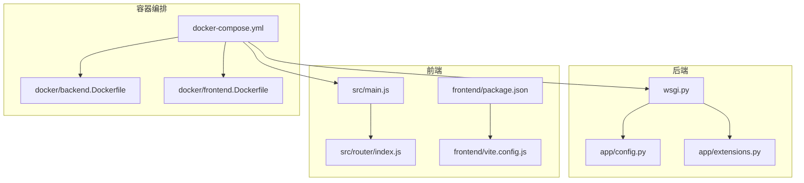
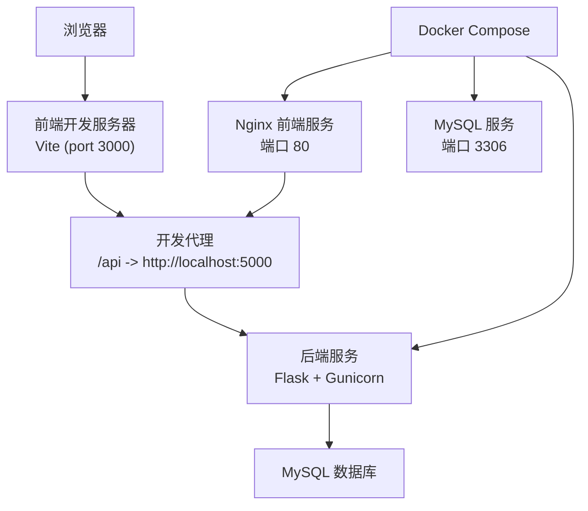
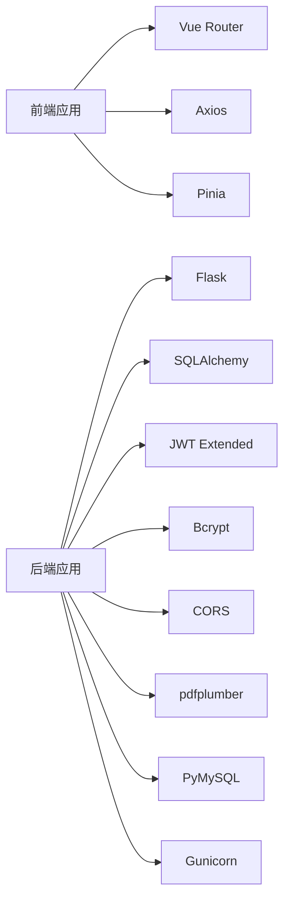

# 开发流程与协作

<cite>
**本文引用的文件**
- [README_CN.md](file://README_CN.md)
- [.gitignore](file://.gitignore)
- [docker-compose.yml](file://docker-compose.yml)
- [backend/requirements.txt](file://backend/requirements.txt)
- [frontend/package.json](file://frontend/package.json)
- [backend/.env.example](file://backend/.env.example)
- [frontend/vite.config.js](file://frontend/vite.config.js)
- [docker/backend.Dockerfile](file://docker/backend.Dockerfile)
- [docker/frontend.Dockerfile](file://docker/frontend.Dockerfile)
- [backend/app/config.py](file://backend/app/config.py)
- [backend/app/extensions.py](file://backend/app/extensions.py)
- [backend/wsgi.py](file://backend/wsgi.py)
- [frontend/src/main.js](file://frontend/src/main.js)
- [frontend/src/router/index.js](file://frontend/src/router/index.js)
</cite>

## 目录
1. [引言](#引言)
2. [项目结构](#项目结构)
3. [核心组件](#核心组件)
4. [架构总览](#架构总览)
5. [详细组件分析](#详细组件分析)
6. [依赖关系分析](#依赖关系分析)
7. [性能考虑](#性能考虑)
8. [故障排查指南](#故障排查指南)
9. [结论](#结论)
10. [附录](#附录)

## 引言
本文件旨在为单词学习网站项目制定一套完整的开发流程与协作规范，覆盖从代码编写、分支与提交、代码审查、版本与发布、到 CI/CD 自动化与部署的全流程。该仓库采用前后端分离架构：后端基于 Flask，前端基于 Vue 3 + Vite，配合 Docker 编排与 Nginx 提供统一入口。本文将结合现有配置文件与项目结构，给出可落地的流程建议与最佳实践。

## 项目结构
项目采用多模块组织方式：
- 后端 backend：Flask 应用，提供 REST API、数据库连接、JWT 认证、CORS、密码加密与文件上传等能力
- 前端 frontend：Vue 3 应用，使用 Pinia 状态管理、Vue Router 路由与鉴权守卫
- docker：Dockerfile 与 compose 配置，定义后端、前端与 MySQL 服务
- 根目录：环境示例文件、初始化 SQL、Git 忽略规则与使用说明

图表来源
- [docker-compose.yml](file://docker-compose.yml#L1-L59)
- [backend/app/config.py](file://backend/app/config.py#L1-L28)
- [backend/app/extensions.py](file://backend/app/extensions.py#L1-L10)
- [backend/wsgi.py](file://backend/wsgi.py#L1-L7)
- [frontend/src/main.js](file://frontend/src/main.js#L1-L13)
- [frontend/src/router/index.js](file://frontend/src/router/index.js#L1-L64)
- [frontend/package.json](file://frontend/package.json#L1-L22)
- [frontend/vite.config.js](file://frontend/vite.config.js#L1-L16)
- [docker/backend.Dockerfile](file://docker/backend.Dockerfile#L1-L29)
- [docker/frontend.Dockerfile](file://docker/frontend.Dockerfile#L1-L30)

章节来源
- [README_CN.md](file://README_CN.md#L1-L84)
- [docker-compose.yml](file://docker-compose.yml#L1-L59)

## 核心组件
- 后端配置与扩展
  - 配置集中于配置类，包含数据库连接、JWT 密钥与过期时间、上传目录与大小限制
  - 扩展模块集中初始化 SQLAlchemy、JWT、CORS、Bcrypt
  - WSGI 入口负责创建应用实例并本地运行
- 前端应用与路由
  - 应用通过 main.js 初始化 Vue、Pinia、Router，并挂载根组件
  - 路由定义包含登录/注册、首页、学习页、词库与管理页，并设置鉴权与管理员守卫
  - Vite 配置启用 Vue 插件与开发代理，将 /api 请求转发至后端
- 容器与部署
  - Docker Compose 统一编排 MySQL、后端与前端服务，健康检查与持久化卷
  - 后端镜像使用 Gunicorn 运行，前端镜像基于 Nginx 提供静态资源

章节来源
- [backend/app/config.py](file://backend/app/config.py#L1-L28)
- [backend/app/extensions.py](file://backend/app/extensions.py#L1-L10)
- [backend/wsgi.py](file://backend/wsgi.py#L1-L7)
- [frontend/src/main.js](file://frontend/src/main.js#L1-L13)
- [frontend/src/router/index.js](file://frontend/src/router/index.js#L1-L64)
- [frontend/vite.config.js](file://frontend/vite.config.js#L1-L16)
- [docker-compose.yml](file://docker-compose.yml#L1-L59)
- [docker/backend.Dockerfile](file://docker/backend.Dockerfile#L1-L29)
- [docker/frontend.Dockerfile](file://docker/frontend.Dockerfile#L1-L30)

## 架构总览
下图展示了开发与部署的关键交互路径：前端通过 Vite 开发代理访问后端 API；后端连接 MySQL；Docker Compose 将三者编排并暴露端口；生产环境由 Nginx 提供静态资源与反向代理。

图表来源
- [frontend/vite.config.js](file://frontend/vite.config.js#L1-L16)
- [docker-compose.yml](file://docker-compose.yml#L1-L59)
- [docker/backend.Dockerfile](file://docker/backend.Dockerfile#L1-L29)
- [docker/frontend.Dockerfile](file://docker/frontend.Dockerfile#L1-L30)

## 详细组件分析

### Git 工作流程与分支策略
- 分支模型建议
  - main/master：主分支，仅允许通过受控合并进入
  - develop：开发分支，日常集成与测试
  - feature/<name>：功能开发分支，从 develop 派生，完成后合并回 develop
  - hotfix/<name>：线上紧急修复分支，从 main 派生，修复后同时合并回 main 与 develop
  - release/<date>：发布分支，从 develop 派生，用于最终验证与版本标记
- 提交规范建议
  - 类型前缀：feat、fix、docs、style、refactor、test、chore
  - 标题简洁明确，正文说明动机与影响范围
  - 遵循单一封面与单条消息原则，必要时在正文分段说明
- 合并流程
  - 使用 Pull Request/Merge Request，开启自动检查与代码审查
  - 合并前需通过 CI 测试、代码扫描与至少一名审查者批准

章节来源
- [.gitignore](file://.gitignore#L1-L38)

### 代码审查标准与 PR 模板
- 审查要点
  - 功能正确性与边界条件处理
  - 性能与内存占用，避免阻塞操作
  - 安全性：输入校验、SQL 注入防护、XSS 防护、敏感信息脱敏
  - 可读性与一致性：命名规范、注释与错误处理
  - 兼容性：跨浏览器/平台、依赖版本兼容
- PR 模板建议
  - 摘要：变更目的与范围
  - 问题链接：关联 Issue 或需求文档
  - 变更内容：改动点清单与影响评估
  - 测试方法：自测步骤与覆盖范围
  - 风险与回滚：潜在风险与回滚预案

### 开发环境配置
- 后端
  - Python 版本：3.8+
  - 虚拟环境：建议使用 venv，隔离依赖
  - 依赖安装：requirements.txt
  - 环境变量：复制 .env.example 为 .env 并按需修改数据库连接
  - 运行方式：WSGI 入口本地启动
- 前端
  - Node.js 版本：16+
  - 依赖安装：npm install
  - 开发服务器：npm run dev，默认端口由 Vite 配置决定
  - 代理配置：/api 代理至后端 5000 端口
- IDE 推荐
  - VS Code：Vue、ESLint、Prettier 插件
  - PyCharm：Flask/Django 支持、SQL 辅助
- 热重载与调试
  - 前端：Vite 默认支持热重载
  - 后端：开发模式下可启用调试运行

章节来源
- [README_CN.md](file://README_CN.md#L24-L56)
- [backend/requirements.txt](file://backend/requirements.txt#L1-L11)
- [backend/.env.example](file://backend/.env.example#L1-L9)
- [frontend/package.json](file://frontend/package.json#L1-L22)
- [frontend/vite.config.js](file://frontend/vite.config.js#L1-L16)
- [backend/wsgi.py](file://backend/wsgi.py#L1-L7)

### 版本管理策略、标签发布与变更日志
- 版本号：语义化版本（主.次.修订）
- 标签发布：在 release 分支完成后打标签并推送
- 变更日志：记录新增、修复、破坏性变更与依赖更新
- 发布流程：完成测试与评审后合并至 main，打标签并生成发布说明

### 团队协作规范、沟通渠道与问题跟踪
- 沟通渠道：Slack/企业微信/钉钉群组，Issue/PR 评论区同步进展
- 角色职责：产品、后端、前端、测试、运维
- 问题跟踪：使用 GitHub Issues，按优先级与里程碑管理
- 文档同步：README、设计文档与 API 文档保持一致

### 持续集成/持续部署（CI/CD）
- CI 阶段建议
  - 代码检查：Python Lint、前端 ESLint/Prettier
  - 单元测试：后端 pytest、前端 Vitest/Jest
  - 安全扫描：依赖漏洞检测（pip-audit、npm audit）
  - 构建与打包：后端 Gunicorn、前端 Vite 构建
- CD 阶段建议
  - Docker 镜像构建：后端与前端分别构建镜像
  - 编排部署：Docker Compose 或 Kubernetes
  - 健康检查：MySQL 健康检查、后端存活探针
  - 回滚策略：蓝绿/金丝雀发布与快速回滚

章节来源
- [docker-compose.yml](file://docker-compose.yml#L1-L59)
- [docker/backend.Dockerfile](file://docker/backend.Dockerfile#L1-L29)
- [docker/frontend.Dockerfile](file://docker/frontend.Dockerfile#L1-L30)

## 依赖关系分析
- 后端依赖
  - Web 框架与 ORM：Flask + SQLAlchemy
  - 认证与安全：JWT 扩展、Bcrypt
  - 跨域与网络：CORS
  - 数据库驱动：PyMySQL
  - 服务进程：Gunicorn
  - PDF 解析：pdfplumber
- 前端依赖
  - 框架与路由：Vue 3 + Vue Router
  - 状态管理：Pinia
  - 构建工具：Vite + Vue 插件
  - HTTP 客户端：Axios

图表来源
- [frontend/package.json](file://frontend/package.json#L1-L22)
- [backend/requirements.txt](file://backend/requirements.txt#L1-L11)

章节来源
- [frontend/package.json](file://frontend/package.json#L1-L22)
- [backend/requirements.txt](file://backend/requirements.txt#L1-L11)

## 性能考虑
- 后端
  - 数据库连接池与查询优化，避免 N+1 查询
  - JWT 过期时间合理设置，减少无效会话
  - 文件上传大小限制与类型校验
- 前端
  - 组件懒加载与路由懒加载
  - 图片与静态资源压缩与缓存策略
  - Vite 构建产物按需加载与代码分割
- 容器与网络
  - 合理设置并发 worker 数量（Gunicorn）
  - Nginx 层缓存与静态资源分发

## 故障排查指南
- 数据库连接失败
  - 检查 .env 中数据库配置是否正确
  - 确认 MySQL 容器健康状态与初始化脚本执行
- PDF 解析异常
  - 确认上传文件格式与内容结构
  - 查看后端日志与 pdfplumber 报错信息
- 前端无法访问后端接口
  - 检查 Vite 代理配置与后端端口映射
  - 确认跨域配置与请求头设置
- 开发环境启动异常
  - 清理 node_modules 与 __pycache__ 后重新安装依赖
  - 确认端口未被占用

章节来源
- [README_CN.md](file://README_CN.md#L78-L81)
- [backend/.env.example](file://backend/.env.example#L1-L9)
- [docker-compose.yml](file://docker-compose.yml#L1-L59)
- [frontend/vite.config.js](file://frontend/vite.config.js#L1-L16)

## 结论
本文件基于现有项目配置与结构，提出了可操作的开发流程与协作规范。建议团队在实际落地中结合自身规模与风险偏好，逐步完善 CI/CD、监控与回滚机制，确保交付质量与效率。

## 附录
- 关键配置参考
  - 后端配置类：数据库、JWT、上传参数
  - 扩展初始化：SQLAlchemy、JWT、CORS、Bcrypt
  - WSGI 入口：应用创建与本地运行
  - 前端入口与路由：鉴权守卫与页面导航
  - Vite 代理：/api 到后端 5000 端口
  - Docker 编排：MySQL、后端、前端服务与健康检查

章节来源
- [backend/app/config.py](file://backend/app/config.py#L1-L28)
- [backend/app/extensions.py](file://backend/app/extensions.py#L1-L10)
- [backend/wsgi.py](file://backend/wsgi.py#L1-L7)
- [frontend/src/main.js](file://frontend/src/main.js#L1-L13)
- [frontend/src/router/index.js](file://frontend/src/router/index.js#L1-L64)
- [frontend/vite.config.js](file://frontend/vite.config.js#L1-L16)
- [docker-compose.yml](file://docker-compose.yml#L1-L59)