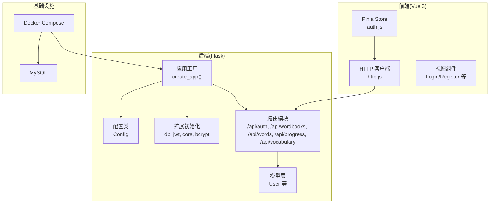
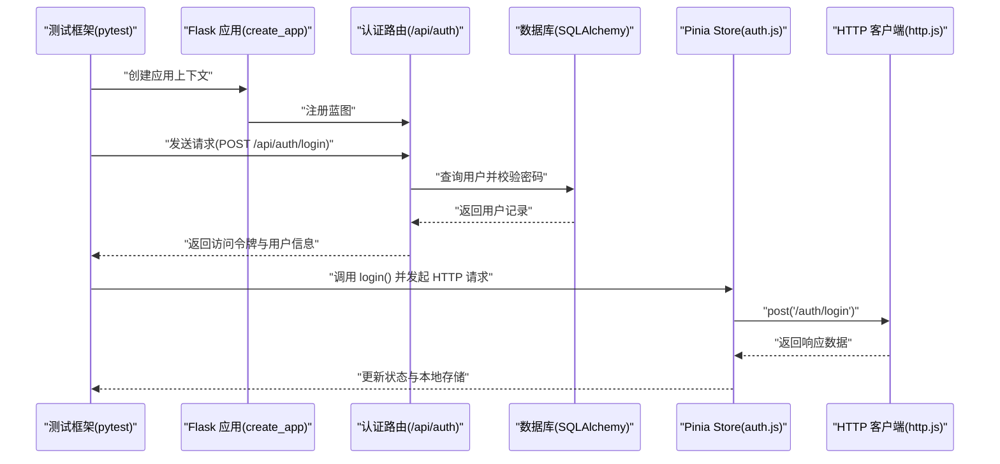
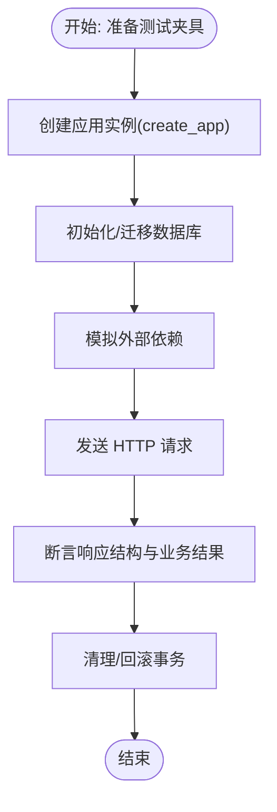
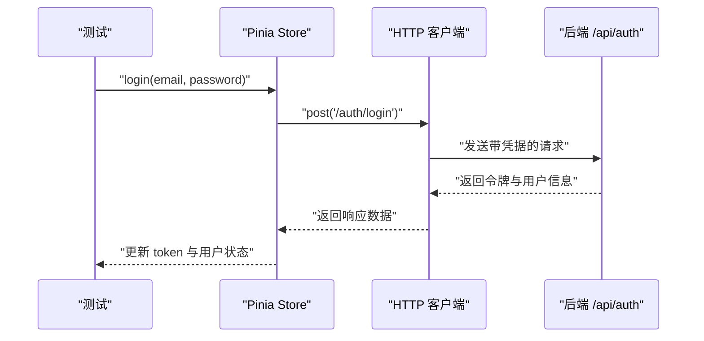
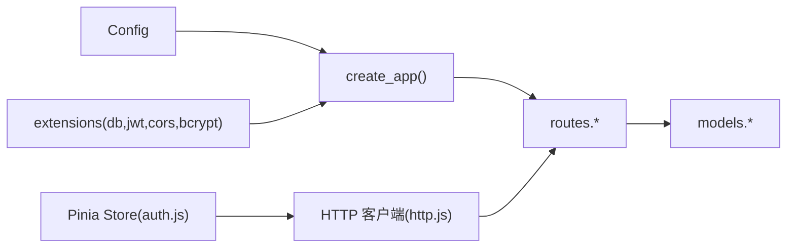

# 测试策略与实施

<cite>
**本文引用的文件**
- [backend/app/__init__.py](file://backend/app/__init__.py)
- [backend/app/config.py](file://backend/app/config.py)
- [backend/app/extensions.py](file://backend/app/extensions.py)
- [backend/app/routes/auth.py](file://backend/app/routes/auth.py)
- [backend/app/models/user.py](file://backend/app/models/user.py)
- [backend/requirements.txt](file://backend/requirements.txt)
- [docker-compose.yml](file://docker-compose.yml)
- [frontend/src/stores/auth.js](file://frontend/src/stores/auth.js)
- [frontend/src/api/http.js](file://frontend/src/api/http.js)
- [frontend/package.json](file://frontend/package.json)
</cite>

## 目录
1. [引言](#引言)
2. [项目结构](#项目结构)
3. [核心组件](#核心组件)
4. [架构总览](#架构总览)
5. [详细组件分析](#详细组件分析)
6. [依赖分析](#依赖分析)
7. [性能考虑](#性能考虑)
8. [故障排查指南](#故障排查指南)
9. [结论](#结论)
10. [附录](#附录)

## 引言
本测试策略文档面向该单词学习平台的后端 Flask API 与前端 Vue 应用，系统化制定从单元测试、集成测试到端到端测试的实施方法。内容覆盖：
- Flask API 接口的单元测试：pytest 使用、应用工厂模式下的测试夹具、模拟对象创建、断言策略
- Vue 组件与 Pinia Store 的测试：渲染测试、用户交互测试、异步请求与本地存储的模拟
- 数据库测试策略：测试数据库设置、数据清理与事务回滚
- 覆盖率与质量门禁：覆盖率阈值建议、质量门禁标准
- 测试数据准备、测试环境配置与持续集成中的测试执行流程

## 项目结构
该项目采用前后端分离架构，后端使用 Flask 提供 REST API，前端使用 Vue 3 + Pinia + Vue Router，通过 Docker Compose 编排运行。

图表来源
- [backend/app/__init__.py](file://backend/app/__init__.py#L6-L36)
- [backend/app/config.py](file://backend/app/config.py#L4-L27)
- [backend/app/extensions.py](file://backend/app/extensions.py#L1-L10)
- [backend/app/routes/auth.py](file://backend/app/routes/auth.py#L1-L93)
- [backend/app/models/user.py](file://backend/app/models/user.py#L4-L26)
- [frontend/src/stores/auth.js](file://frontend/src/stores/auth.js#L1-L59)
- [frontend/src/api/http.js](file://frontend/src/api/http.js#L1-L48)
- [docker-compose.yml](file://docker-compose.yml#L1-L59)

章节来源
- [backend/app/__init__.py](file://backend/app/__init__.py#L1-L37)
- [backend/app/config.py](file://backend/app/config.py#L1-L28)
- [backend/app/extensions.py](file://backend/app/extensions.py#L1-L10)
- [docker-compose.yml](file://docker-compose.yml#L1-L59)

## 核心组件
- 后端应用工厂与蓝图注册：通过 create_app() 构建应用实例，注册认证、词书、单词、进度、词汇等蓝图，统一前缀 /api。
- 配置与扩展：集中管理数据库连接、JWT 密钥、上传目录等；扩展在应用中初始化。
- 认证路由：提供注册、登录、刷新令牌、获取当前用户等接口。
- 用户模型：定义用户字段与序列化方法。
- 前端 Store：封装认证状态、登录/注册/登出逻辑与本地存储交互。
- HTTP 客户端：统一基础路径、超时、请求/响应拦截器，处理鉴权头与 401 错误。

章节来源
- [backend/app/__init__.py](file://backend/app/__init__.py#L6-L36)
- [backend/app/config.py](file://backend/app/config.py#L4-L27)
- [backend/app/extensions.py](file://backend/app/extensions.py#L1-L10)
- [backend/app/routes/auth.py](file://backend/app/routes/auth.py#L1-L93)
- [backend/app/models/user.py](file://backend/app/models/user.py#L4-L26)
- [frontend/src/stores/auth.js](file://frontend/src/stores/auth.js#L1-L59)
- [frontend/src/api/http.js](file://frontend/src/api/http.js#L1-L48)

## 架构总览
下图展示测试视角下的系统交互：测试驱动对后端 API 的调用，以及前端 Store 与 HTTP 客户端的协作。

图表来源
- [backend/app/__init__.py](file://backend/app/__init__.py#L6-L36)
- [backend/app/routes/auth.py](file://backend/app/routes/auth.py#L46-L72)
- [backend/app/models/user.py](file://backend/app/models/user.py#L4-L26)
- [frontend/src/stores/auth.js](file://frontend/src/stores/auth.js#L22-L34)
- [frontend/src/api/http.js](file://frontend/src/api/http.js#L25-L45)

## 详细组件分析

### Flask API 单元测试策略
- 测试夹具与应用工厂
  - 使用应用工厂 create_app() 在测试中构建应用实例，确保路由、扩展、配置均按生产一致方式初始化。
  - 在测试前创建数据库表，测试后清理或回滚。
- 路由测试
  - 使用 Flask 测试客户端发起请求，验证状态码、响应体字段与业务逻辑分支。
  - 对于需要鉴权的接口，构造有效的 JWT 或在测试中禁用鉴权中间件以覆盖不同场景。
- 模拟对象与外部依赖
  - 使用模拟库替换数据库写入、密码哈希、JWT 生成等外部依赖，隔离测试边界。
  - 对 PDF 解析等第三方库可进行最小化模拟，仅保证调用路径正确。
- 断言策略
  - 断言响应结构包含 success/message 字段，以及必要数据字段。
  - 对敏感信息（如密码哈希）不进行直接断言，改为断言行为（例如未泄露、长度符合预期）。
- 测试数据与清理
  - 使用独立的测试数据库或内存数据库，每个测试用例前插入最小化数据，结束后删除或回滚。
- 覆盖率与质量门禁
  - 建议函数级覆盖率不低于 80%，关键路径不低于 90%；对认证、权限控制、数据持久化等模块提高阈值。
  - 在 CI 中设置质量门禁：失败即阻断，覆盖率低于阈值则失败。

图表来源
- [backend/app/__init__.py](file://backend/app/__init__.py#L6-L36)
- [backend/app/config.py](file://backend/app/config.py#L4-L27)
- [backend/app/routes/auth.py](file://backend/app/routes/auth.py#L1-L93)

章节来源
- [backend/app/__init__.py](file://backend/app/__init__.py#L6-L36)
- [backend/app/config.py](file://backend/app/config.py#L4-L27)
- [backend/app/routes/auth.py](file://backend/app/routes/auth.py#L1-L93)

### Vue 组件与 Pinia Store 测试策略
- Store 测试
  - 使用测试运行时注入本地存储，模拟登录/登出流程，断言状态变化与本地存储写入/清除。
  - 对异步登录/注册请求进行模拟，覆盖成功与失败分支。
- 组件渲染与交互测试
  - 使用合适的测试工具渲染组件，触发用户交互（点击、输入），断言 DOM 变化与 Store 行为。
  - 对需要鉴权的页面，断言未登录时的跳转行为。
- HTTP 客户端测试
  - 拦截请求，断言请求头包含 Authorization，断言响应拦截器对 401 的处理。
- 覆盖率与质量门禁
  - 建议 Store 与关键组件函数级覆盖率不低于 80%，对用户交互路径不低于 90%。

图表来源
- [frontend/src/stores/auth.js](file://frontend/src/stores/auth.js#L22-L34)
- [frontend/src/api/http.js](file://frontend/src/api/http.js#L25-L45)
- [backend/app/routes/auth.py](file://backend/app/routes/auth.py#L46-L72)

章节来源
- [frontend/src/stores/auth.js](file://frontend/src/stores/auth.js#L1-L59)
- [frontend/src/api/http.js](file://frontend/src/api/http.js#L1-L48)

### 数据库测试策略
- 测试数据库设置
  - 使用独立的测试数据库或容器化测试数据库，避免污染生产数据。
  - 在 CI 中通过环境变量切换数据库连接字符串，确保测试与开发/生产的数据库隔离。
- 数据清理与事务回滚
  - 每个测试用例前插入最小化种子数据，结束后删除或回滚事务。
  - 对于需要批量操作的测试，使用嵌套事务并在失败时回滚。
- 事务一致性
  - 对涉及多表关联的业务（如用户注册并初始化进度），在单个事务内完成，失败即回滚。
- 性能与并发
  - 避免在测试中进行大量数据插入，优先使用小批量数据与索引覆盖测试路径。

章节来源
- [backend/app/config.py](file://backend/app/config.py#L14-L17)
- [backend/app/models/user.py](file://backend/app/models/user.py#L4-L26)

### 测试数据准备与环境配置
- 后端
  - 通过环境变量配置数据库连接、JWT 密钥、上传目录等；在测试中覆盖这些变量。
  - 使用 requirements.txt 中的依赖版本，确保测试环境与生产一致。
- 前端
  - 通过 package.json 的脚本与依赖，确保测试工具链可用；HTTP 客户端指向 /api，便于在测试中代理或拦截。
- Docker Compose
  - 使用 compose 编排服务，确保数据库健康后再启动后端，便于集成测试。

章节来源
- [backend/requirements.txt](file://backend/requirements.txt#L1-L11)
- [frontend/package.json](file://frontend/package.json#L1-L22)
- [docker-compose.yml](file://docker-compose.yml#L1-L59)

### 持续集成中的测试执行流程
- 触发条件
  - 分支保护规则：主分支推送与拉取请求均需通过测试。
- 步骤
  - 启动 MySQL 容器并等待健康检查通过
  - 构建并启动后端服务
  - 执行后端单元测试与集成测试（pytest）
  - 启动前端构建（如需要）或使用预构建产物
  - 执行前端单元测试与端到端测试
  - 收集并报告覆盖率
- 质量门禁
  - 失败即阻断；覆盖率低于阈值失败；关键模块失败直接阻断

章节来源
- [docker-compose.yml](file://docker-compose.yml#L1-L59)
- [backend/requirements.txt](file://backend/requirements.txt#L1-L11)
- [frontend/package.json](file://frontend/package.json#L1-L22)

## 依赖分析
后端依赖关系围绕应用工厂、扩展与路由展开；前端依赖围绕 Store、HTTP 客户端与视图组件。

图表来源
- [backend/app/__init__.py](file://backend/app/__init__.py#L6-L36)
- [backend/app/config.py](file://backend/app/config.py#L4-L27)
- [backend/app/extensions.py](file://backend/app/extensions.py#L1-L10)
- [backend/app/routes/auth.py](file://backend/app/routes/auth.py#L1-L93)
- [backend/app/models/user.py](file://backend/app/models/user.py#L4-L26)
- [frontend/src/stores/auth.js](file://frontend/src/stores/auth.js#L1-L59)
- [frontend/src/api/http.js](file://frontend/src/api/http.js#L1-L48)

章节来源
- [backend/app/__init__.py](file://backend/app/__init__.py#L6-L36)
- [backend/app/extensions.py](file://backend/app/extensions.py#L1-L10)
- [frontend/src/stores/auth.js](file://frontend/src/stores/auth.js#L1-L59)

## 性能考虑
- 测试数据库连接池与事务管理：避免长事务，及时提交或回滚。
- 前端测试中尽量减少真实网络请求，使用拦截器模拟响应，提升测试速度。
- 使用并行测试执行（在无共享状态前提下），缩短 CI 时间。
- 控制测试数据规模，优先使用索引与最小化数据集。

## 故障排查指南
- 后端测试常见问题
  - 应用上下文缺失：确保在测试中使用 app_context() 或通过测试客户端间接进入上下文。
  - 数据库连接失败：检查测试数据库环境变量与 Docker Compose 健康检查。
  - JWT 生成异常：在测试中使用模拟 JWT 工具，避免真实密钥与过期时间影响。
- 前端测试常见问题
  - 本地存储读写：在测试中注入 localStorage 的模拟实现。
  - 请求拦截器：断言 Authorization 头是否正确添加。
  - 401 自动登出：断言本地存储被清除且跳转至登录页。
- 数据库测试常见问题
  - 事务未回滚：确认测试框架支持事务回滚或手动删除测试数据。
  - 多线程竞争：避免在测试中并发写入同一数据集。

章节来源
- [frontend/src/api/http.js](file://frontend/src/api/http.js#L11-L45)
- [frontend/src/stores/auth.js](file://frontend/src/stores/auth.js#L41-L46)

## 结论
本测试策略以应用工厂与模块化设计为基础，结合 pytest 与前端测试工具链，形成覆盖单元、集成与端到端的完整测试体系。通过独立测试数据库、模拟外部依赖与严格的覆盖率与质量门禁，确保代码质量与交付稳定性。建议在 CI 中严格执行测试与覆盖率检查，持续优化测试数据与执行效率。

## 附录
- 测试覆盖率与质量门禁建议
  - 函数级覆盖率：≥80%
  - 关键路径覆盖率：≥90%
  - 质量门禁：失败即阻断；覆盖率不足阈值即失败
- 测试数据与环境
  - 后端：通过环境变量切换测试数据库；使用 Docker Compose 编排数据库与后端服务
  - 前端：使用拦截器模拟网络请求；注入本地存储模拟
- 持续集成流程
  - 启动 MySQL → 启动后端 → 运行后端测试 → 运行前端测试 → 报告覆盖率