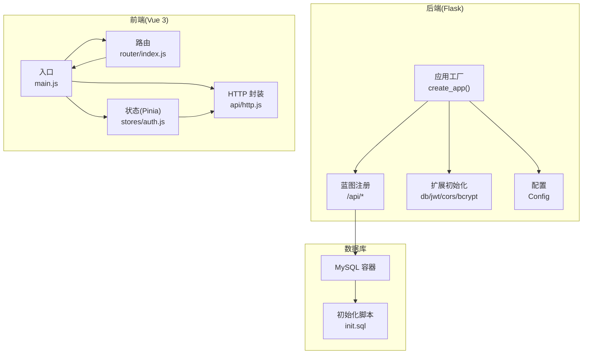
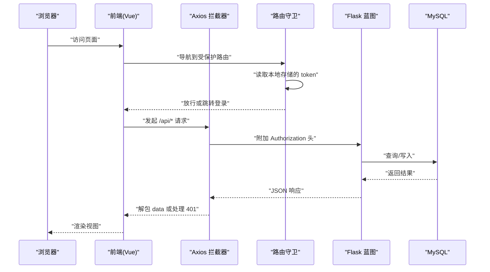
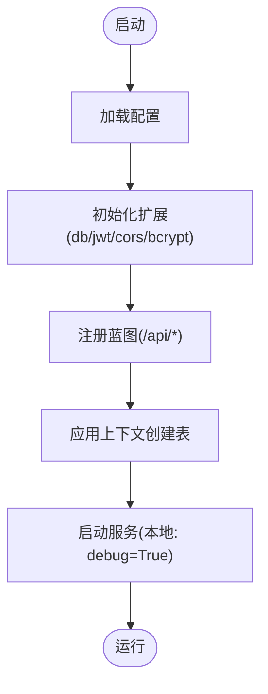
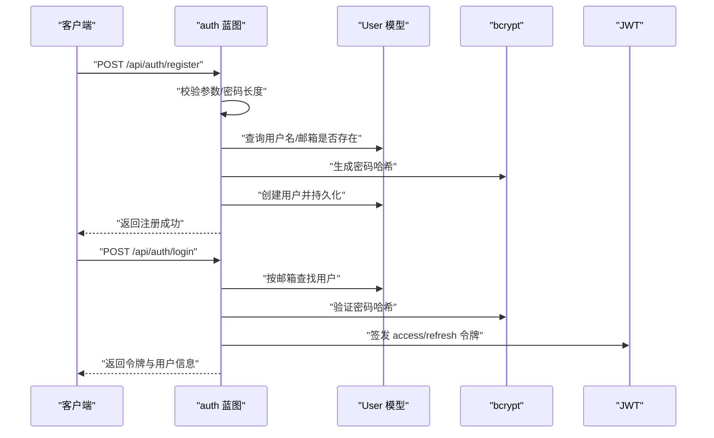
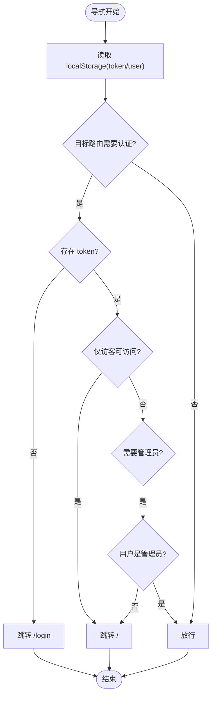
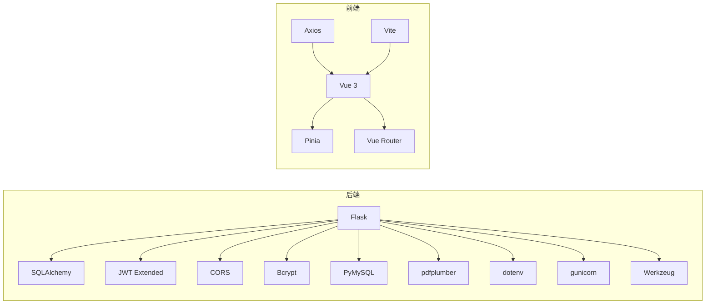

# 调试与问题排查

<cite>
**本文引用的文件**
- [backend/app/__init__.py](file://backend/app/__init__.py)
- [backend/app/config.py](file://backend/app/config.py)
- [backend/app/extensions.py](file://backend/app/extensions.py)
- [backend/wsgi.py](file://backend/wsgi.py)
- [backend/app/routes/auth.py](file://backend/app/routes/auth.py)
- [backend/app/models/user.py](file://backend/app/models/user.py)
- [backend/requirements.txt](file://backend/requirements.txt)
- [docker-compose.yml](file://docker-compose.yml)
- [init.sql](file://init.sql)
- [frontend/src/main.js](file://frontend/src/main.js)
- [frontend/src/router/index.js](file://frontend/src/router/index.js)
- [frontend/src/api/http.js](file://frontend/src/api/http.js)
- [frontend/src/stores/auth.js](file://frontend/src/stores/auth.js)
- [frontend/package.json](file://frontend/package.json)
- [README_CN.md](file://README_CN.md)
</cite>

## 目录
1. [简介](#简介)
2. [项目结构](#项目结构)
3. [核心组件](#核心组件)
4. [架构总览](#架构总览)
5. [详细组件分析](#详细组件分析)
6. [依赖关系分析](#依赖关系分析)
7. [性能考虑](#性能考虑)
8. [故障排查指南](#故障排查指南)
9. [结论](#结论)
10. [附录](#附录)

## 简介
本指南面向开发者，聚焦于 Flask + Vue 项目的调试与问题排查，覆盖后端调试（Werkzeug 调试器、日志与错误堆栈）、前端调试（Vue 开发者工具、状态与路由）、数据库连接、API 请求、路由与认证问题，以及常见错误（404、500、CORS、JWT）的定位与修复策略，并提供性能诊断与生产环境排查建议。

## 项目结构
- 后端采用 Flask，通过工厂函数创建应用，注册蓝图，初始化数据库、JWT、CORS、加密等扩展。
- 前端采用 Vue 3 + Pinia + Vue Router，Axios 封装统一请求与响应拦截，路由守卫控制访问权限。
- 使用 Docker Compose 编排 MySQL、后端与前端服务，便于本地与生产部署一致性。

图表来源
- [backend/app/__init__.py](file://backend/app/__init__.py#L6-L36)
- [backend/app/config.py](file://backend/app/config.py#L4-L27)
- [backend/app/extensions.py](file://backend/app/extensions.py#L1-L9)
- [frontend/src/main.js](file://frontend/src/main.js#L1-L12)
- [frontend/src/router/index.js](file://frontend/src/router/index.js#L1-L64)
- [frontend/src/stores/auth.js](file://frontend/src/stores/auth.js#L1-L59)
- [frontend/src/api/http.js](file://frontend/src/api/http.js#L1-L48)
- [docker-compose.yml](file://docker-compose.yml#L3-L54)
- [init.sql](file://init.sql#L1-L67)

章节来源
- [backend/app/__init__.py](file://backend/app/__init__.py#L6-L36)
- [backend/app/config.py](file://backend/app/config.py#L4-L27)
- [backend/app/extensions.py](file://backend/app/extensions.py#L1-L9)
- [frontend/src/main.js](file://frontend/src/main.js#L1-L12)
- [frontend/src/router/index.js](file://frontend/src/router/index.js#L1-L64)
- [frontend/src/stores/auth.js](file://frontend/src/stores/auth.js#L1-L59)
- [frontend/src/api/http.js](file://frontend/src/api/http.js#L1-L48)
- [docker-compose.yml](file://docker-compose.yml#L3-L54)
- [init.sql](file://init.sql#L1-L67)

## 核心组件
- Flask 应用工厂与蓝图：集中初始化扩展、注册路由前缀，确保数据库表在应用上下文中创建。
- 配置模块：集中管理密钥、数据库连接、JWT 过期时间、上传目录与大小限制。
- 扩展模块：定义 db、jwt、cors、bcrypt 实例，供蓝图与模型使用。
- 前端入口与路由：应用挂载、路由守卫、Pinia 状态与 Axios 封装。
- Docker 编排：MySQL、后端、前端三服务，健康检查与数据卷。

章节来源
- [backend/app/__init__.py](file://backend/app/__init__.py#L6-L36)
- [backend/app/config.py](file://backend/app/config.py#L4-L27)
- [backend/app/extensions.py](file://backend/app/extensions.py#L1-L9)
- [frontend/src/main.js](file://frontend/src/main.js#L1-L12)
- [frontend/src/router/index.js](file://frontend/src/router/index.js#L1-L64)
- [docker-compose.yml](file://docker-compose.yml#L3-L54)

## 架构总览
后端通过 WSGI 入口启动，开启调试模式；前端通过 Vite 开发服务器运行，Axios 默认指向 /api 前缀，经由反向代理转发至后端。JWT 用于鉴权，CORS 对 /api/* 放通跨域。

图表来源
- [frontend/src/router/index.js](file://frontend/src/router/index.js#L48-L61)
- [frontend/src/api/http.js](file://frontend/src/api/http.js#L11-L45)
- [backend/app/__init__.py](file://backend/app/__init__.py#L26-L30)
- [backend/app/routes/auth.py](file://backend/app/routes/auth.py#L46-L72)
- [init.sql](file://init.sql#L6-L66)

## 详细组件分析

### Flask 应用工厂与调试器
- 工厂函数负责加载配置、初始化扩展、注册蓝图、创建数据库表。
- WSGI 入口在本地开发时启用 debug 模式，便于热重载与交互式调试。
- 建议在生产环境关闭 debug，使用 gunicorn 等 WSGI 服务器。

图表来源
- [backend/app/__init__.py](file://backend/app/__init__.py#L6-L36)
- [backend/wsgi.py](file://backend/wsgi.py#L5-L6)

章节来源
- [backend/app/__init__.py](file://backend/app/__init__.py#L6-L36)
- [backend/wsgi.py](file://backend/wsgi.py#L5-L6)

### 配置与环境变量
- 数据库连接字符串由多环境变量拼接，注意主机、端口、用户、密码、数据库名。
- JWT 密钥与过期时间可配置，生产需更换默认密钥。
- 上传目录与最大内容长度在配置中定义。

章节来源
- [backend/app/config.py](file://backend/app/config.py#L4-L27)

### 扩展初始化
- SQLAlchemy、JWT、CORS、Bcrypt 在扩展模块中声明，随后在工厂中绑定应用实例。
- CORS 对 /api/* 放通所有来源，便于前后端联调。

章节来源
- [backend/app/extensions.py](file://backend/app/extensions.py#L1-L9)
- [backend/app/__init__.py](file://backend/app/__init__.py#L14-L17)

### 蓝图与认证流程
- 登录/注册接口对输入进行校验，使用 Bcrypt 哈希密码，JWT 生成访问与刷新令牌。
- 刷新令牌接口与受保护资源接口使用装饰器校验身份。
- 首个注册用户自动成为管理员。

图表来源
- [backend/app/routes/auth.py](file://backend/app/routes/auth.py#L8-L43)
- [backend/app/routes/auth.py](file://backend/app/routes/auth.py#L46-L72)
- [backend/app/models/user.py](file://backend/app/models/user.py#L4-L25)

章节来源
- [backend/app/routes/auth.py](file://backend/app/routes/auth.py#L8-L93)
- [backend/app/models/user.py](file://backend/app/models/user.py#L4-L25)

### 前端路由与状态
- 路由守卫基于本地存储判断 token 与用户角色，控制访问权限。
- Pinia Store 维护用户与 token，登录成功后写入本地存储。
- Axios 拦截器统一注入 Authorization 头并在 401 时清理状态并跳转登录。

图表来源
- [frontend/src/router/index.js](file://frontend/src/router/index.js#L48-L61)
- [frontend/src/stores/auth.js](file://frontend/src/stores/auth.js#L12-L20)
- [frontend/src/api/http.js](file://frontend/src/api/http.js#L34-L39)

章节来源
- [frontend/src/router/index.js](file://frontend/src/router/index.js#L1-L64)
- [frontend/src/stores/auth.js](file://frontend/src/stores/auth.js#L1-L59)
- [frontend/src/api/http.js](file://frontend/src/api/http.js#L1-L48)

### 数据库与初始化
- Docker Compose 启动 MySQL，使用 init.sql 创建数据库与表结构。
- Flask 在应用上下文中创建表，确保首次运行即具备所需表。

章节来源
- [docker-compose.yml](file://docker-compose.yml#L4-L21)
- [init.sql](file://init.sql#L1-L67)
- [backend/app/__init__.py](file://backend/app/__init__.py#L33-L34)

## 依赖关系分析
- 后端依赖：Flask、SQLAlchemy、JWT、CORS、Bcrypt、PyMySQL、pdfplumber、dotenv、gunicorn、Werkzeug。
- 前端依赖：Vue 3、Pinia、Vue Router、Axios、Vite。

图表来源
- [backend/requirements.txt](file://backend/requirements.txt#L1-L11)
- [frontend/package.json](file://frontend/package.json#L11-L20)

章节来源
- [backend/requirements.txt](file://backend/requirements.txt#L1-L11)
- [frontend/package.json](file://frontend/package.json#L11-L20)

## 性能考虑
- 后端
  - 使用生产 WSGI 服务器（如 gunicorn）替代 Flask 内置服务器，提升并发与稳定性。
  - 合理设置数据库连接池与超时，避免长事务与阻塞操作。
  - 对热点接口增加缓存层，减少重复查询。
- 前端
  - 使用路由懒加载与组件按需加载，降低首屏体积。
  - 控制本地存储写入频率，避免频繁序列化/反序列化。
  - 使用浏览器性能面板分析重绘与回流，定位渲染瓶颈。

[本节为通用指导，无需列出章节来源]

## 故障排查指南

### Flask 调试与错误堆栈分析
- 启用调试模式：WSGI 入口在本地开发时开启 debug，便于交互式调试器与错误堆栈展示。
- 日志配置：可在应用工厂中添加日志配置，输出请求/响应与异常堆栈，便于定位问题。
- 常见错误
  - 500 内部错误：检查蓝图路由、数据库连接、模型映射与异常捕获。
  - 404 路由未找到：确认蓝图前缀与路由路径一致，检查静态资源与反向代理配置。
- 排查步骤
  - 打开浏览器调试器 Network 标签，观察请求 URL、状态码、响应体。
  - 查看后端控制台输出，结合日志定位具体异常位置。
  - 使用最小可复现请求体，逐步缩小问题范围。

章节来源
- [backend/wsgi.py](file://backend/wsgi.py#L5-L6)
- [backend/app/__init__.py](file://backend/app/__init__.py#L26-L30)

### Vue 开发者工具使用
- 组件检查：在组件树中定位当前页面组件，查看 props、data、computed 与生命周期。
- 状态监控：在 Pinia 面板观察 token 与 user 的变化，确认登录/登出流程正确。
- 性能分析：使用性能面板记录渲染耗时，识别长任务与重绘热点。
- 路由诊断：在路由面板查看当前路由与元信息，核对守卫逻辑是否生效。

章节来源
- [frontend/src/main.js](file://frontend/src/main.js#L1-L12)
- [frontend/src/router/index.js](file://frontend/src/router/index.js#L1-L64)
- [frontend/src/stores/auth.js](file://frontend/src/stores/auth.js#L1-L59)

### 数据库连接问题排查
- 环境变量：核对数据库主机、端口、用户、密码、数据库名是否与 .env 一致。
- 容器健康：Docker Compose 提供健康检查，确认 MySQL 容器已就绪。
- 初始化脚本：确认 init.sql 已执行，数据库与表存在。
- 连接字符串：检查配置模块拼接的数据库 URI 是否正确。
- 排查步骤
  - 在后端控制台打印数据库连接信息，确认连接成功。
  - 使用 MySQL 客户端连接容器，验证凭据与权限。
  - 检查防火墙与端口映射，确保宿主机可访问容器端口。

章节来源
- [backend/app/config.py](file://backend/app/config.py#L14-L17)
- [docker-compose.yml](file://docker-compose.yml#L4-L21)
- [init.sql](file://init.sql#L1-L67)

### API 请求调试
- 基础地址：前端 Axios 默认 baseURL 为 /api，需确保反向代理或同源策略正确。
- 请求头：拦截器自动附加 Authorization: Bearer token，检查 token 是否过期或缺失。
- 响应处理：401 时自动清理本地存储并跳转登录，确认路由守卫逻辑。
- 排查步骤
  - 浏览器 Network 面板查看请求头与响应状态。
  - 后端日志记录请求体与异常，比对前后端数据。
  - 使用 curl 或 Postman 直连后端接口，排除前端拦截器影响。

章节来源
- [frontend/src/api/http.js](file://frontend/src/api/http.js#L3-L9)
- [frontend/src/api/http.js](file://frontend/src/api/http.js#L11-L23)
- [frontend/src/api/http.js](file://frontend/src/api/http.js#L25-L45)
- [frontend/src/router/index.js](file://frontend/src/router/index.js#L48-L61)

### 前端路由问题诊断
- 路由守卫：检查 requiresAuth、guest、requiresAdmin 的元信息与本地存储状态。
- 动态导入：确认路由懒加载路径正确，打包产物存在对应 chunk。
- 历史模式：确认服务器配置支持 HTML5 History 模式，避免刷新 404。
- 排查步骤
  - 在路由守卫断点调试，观察 to/from/meta 与 token 状态。
  - 清除本地存储后重试，确认初始状态正确。
  - 检查构建产物与静态资源路径，确保历史模式回退正常。

章节来源
- [frontend/src/router/index.js](file://frontend/src/router/index.js#L1-L64)

### 常见错误与解决方案
- 404 错误
  - 蓝图前缀与路由路径不匹配；检查注册前缀与实际请求路径。
  - 静态资源或历史模式回退未配置；确保服务器支持 SPA 回退。
- 500 错误
  - 数据库连接失败或事务异常；检查连接字符串与容器健康。
  - 模型字段映射错误；核对 init.sql 与 ORM 定义。
- CORS 问题
  - CORS 初始化仅对 /api/* 放通；若前端非同源，需调整 origins 或代理。
- JWT 认证失败
  - 密钥不一致或过期；更换生产密钥并更新前端/后端配置。
  - 令牌缺失或格式错误；检查拦截器是否正确附加 Authorization 头。

章节来源
- [backend/app/__init__.py](file://backend/app/__init__.py#L16-L16)
- [backend/app/config.py](file://backend/app/config.py#L20-L23)
- [frontend/src/api/http.js](file://frontend/src/api/http.js#L11-L18)

### 生产环境问题排查
- 日志与监控：启用结构化日志，收集请求链路与错误堆栈；结合指标监控数据库与 API 延迟。
- 部署一致性：使用 Docker Compose 或 Kubernetes，确保环境变量与配置文件一致。
- 安全加固：禁用 debug，强制 HTTPS，限制上传类型与大小，定期轮换密钥。
- 性能压测：使用工具模拟并发请求，识别瓶颈并优化数据库索引与缓存策略。

章节来源
- [backend/requirements.txt](file://backend/requirements.txt#L9-L10)
- [docker-compose.yml](file://docker-compose.yml#L3-L54)
- [README_CN.md](file://README_CN.md#L78-L81)

## 结论
通过明确的调试流程与工具组合，可高效定位 Flask 与 Vue 项目的常见问题。建议在开发阶段充分利用调试器与开发者工具，在生产阶段完善日志、监控与安全策略，持续优化性能与稳定性。

## 附录
- 快速启动参考：Docker 一键启动与手动本地启动步骤。
- 常见问题提示：数据库连接失败与 PDF 解析注意事项。

章节来源
- [README_CN.md](file://README_CN.md#L11-L56)
- [README_CN.md](file://README_CN.md#L78-L81)