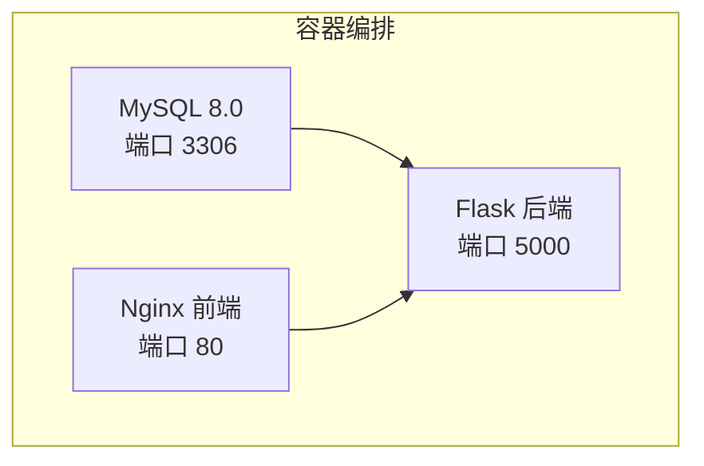
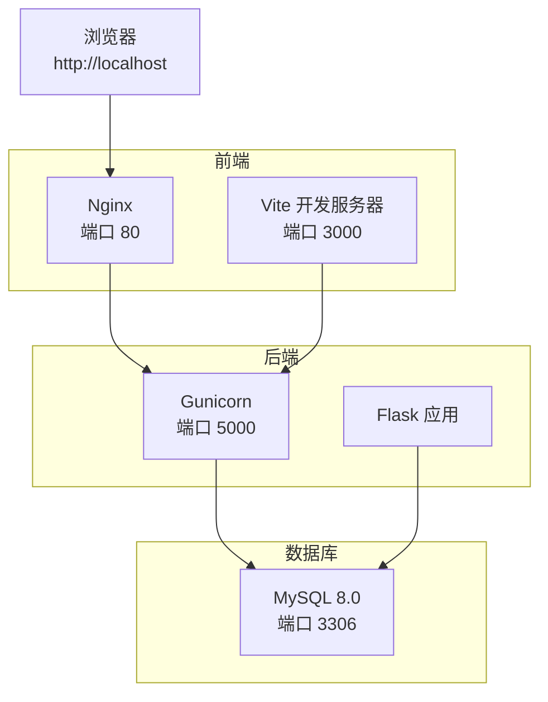
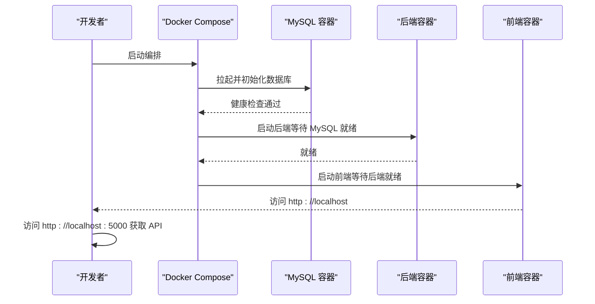
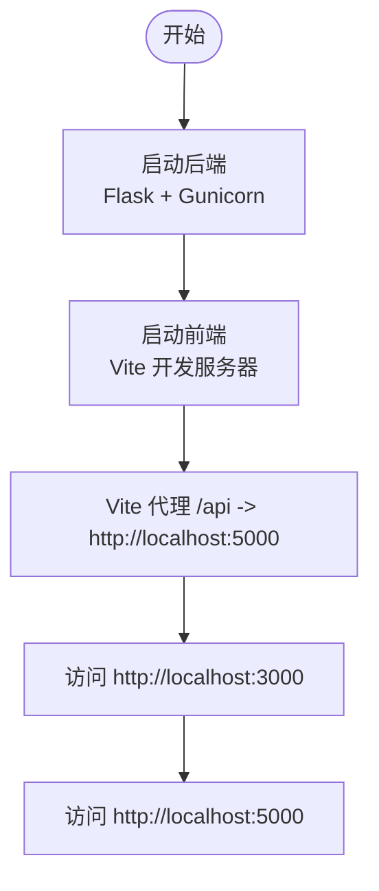
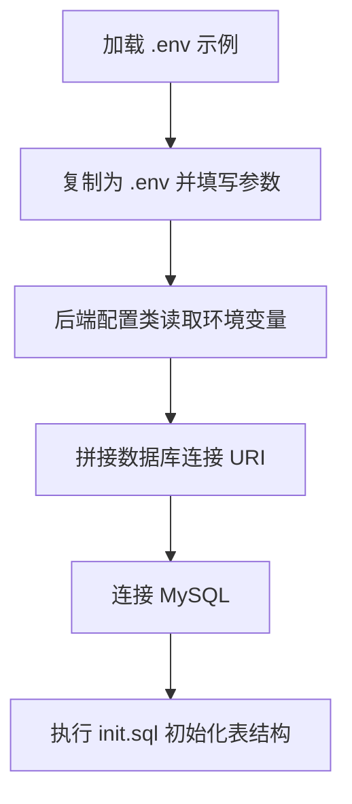
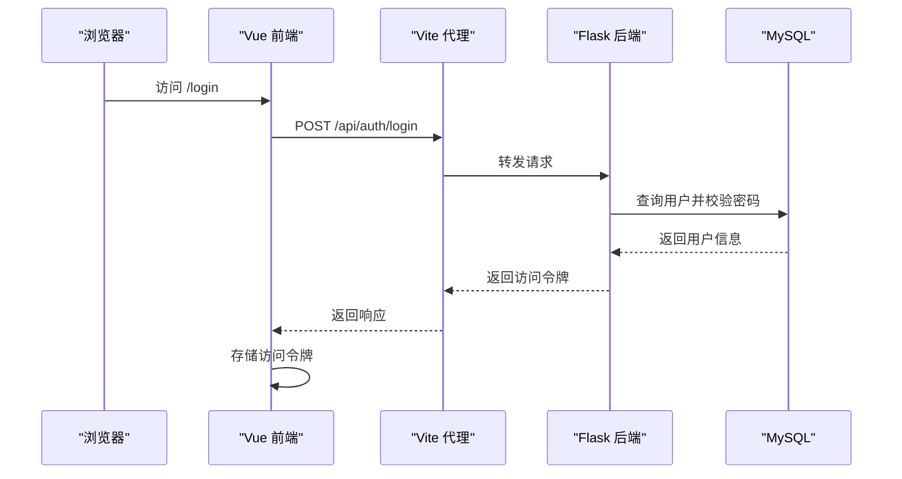
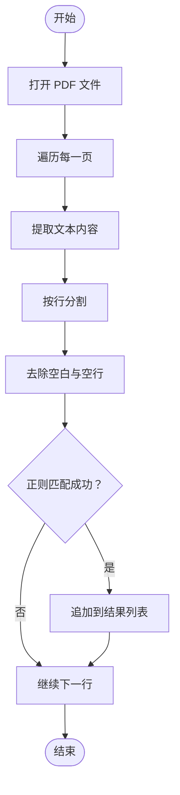
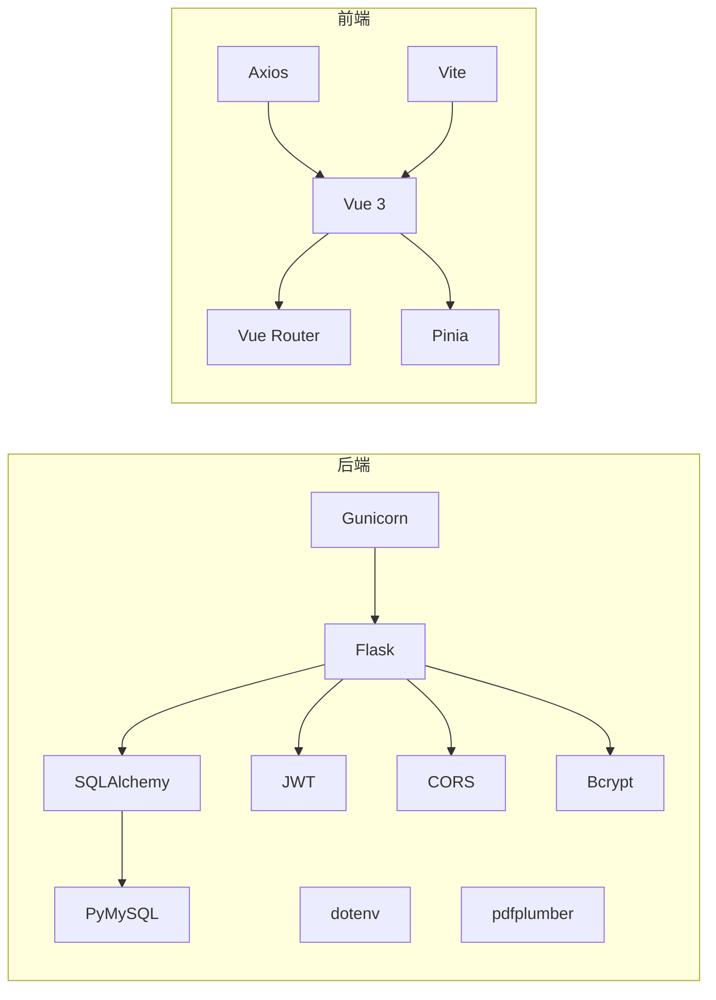

# 快速开始

<cite>
**本文引用的文件**
- [README_CN.md](file://README_CN.md)
- [docker-compose.yml](file://docker-compose.yml)
- [.env.example](file://.env.example)
- [backend/.env.example](file://backend/.env.example)
- [init.sql](file://init.sql)
- [backend/requirements.txt](file://backend/requirements.txt)
- [frontend/package.json](file://frontend/package.json)
- [docker/backend.Dockerfile](file://docker/backend.Dockerfile)
- [docker/frontend.Dockerfile](file://docker/frontend.Dockerfile)
- [backend/wsgi.py](file://backend/wsgi.py)
- [backend/app/config.py](file://backend/app/config.py)
- [backend/app/__init__.py](file://backend/app/__init__.py)
- [frontend/src/api/http.js](file://frontend/src/api/http.js)
- [frontend/vite.config.js](file://frontend/vite.config.js)
- [backend/app/routes/auth.py](file://backend/app/routes/auth.py)
- [backend/app/services/pdf_parser.py](file://backend/app/services/pdf_parser.py)
</cite>

## 目录
1. [简介](#简介)
2. [项目结构](#项目结构)
3. [核心组件](#核心组件)
4. [架构总览](#架构总览)
5. [详细组件分析](#详细组件分析)
6. [依赖关系分析](#依赖关系分析)
7. [性能考虑](#性能考虑)
8. [故障排查指南](#故障排查指南)
9. [结论](#结论)
10. [附录](#附录)

## 简介
本指南面向首次接触单词学习网站项目的开发者，提供从零开始的完整启动路径，覆盖 Docker 一键部署与手动本地部署两种方式。你将学会如何准备 Python 3.8+、Node.js 16+、MySQL 8.0 等前置条件，完成数据库初始化、环境变量配置与依赖安装，并成功访问前端页面（http://localhost）与后端 API（http://localhost:5000）。同时，文档还包含常见问题排查与解决方案，帮助你快速定位并修复典型问题。

## 项目结构
该项目采用前后端分离架构：
- 后端：基于 Flask 的 API 服务，提供认证、词库、单词、学习进度与生词本等接口，并内置 PDF 单词解析能力。
- 前端：基于 Vue 3 + Vite 的单页应用，通过代理访问后端 /api 路由。
- 数据库：MySQL 8.0，使用 init.sql 初始化表结构。
- 容器化：Docker Compose 编排 MySQL、后端、前端三部分，统一暴露端口并挂载持久化卷。

图表来源
- [docker-compose.yml](file://docker-compose.yml#L3-L55)

章节来源
- [README_CN.md](file://README_CN.md#L5-L9)
- [docker-compose.yml](file://docker-compose.yml#L1-L59)

## 核心组件
- 后端 Flask 应用
  - 通过工厂函数创建应用实例，注册蓝图并初始化数据库表。
  - 使用 SQLAlchemy 连接 MySQL，JWT 管理鉴权，CORS 放通 API 跨域，Bcrypt 加密密码。
- 前端 Vue 应用
  - 通过 Axios 发起请求，默认 base URL 为 /api；开发服务器通过 Vite 代理到后端 5000 端口。
- 数据库
  - 初始化脚本包含用户、词书、单词、学习进度、生词本五张核心表。
- PDF 解析
  - 使用 pdfplumber 提取文本，正则匹配“英文单词 + 音标 + 中文释义”的行，生成结构化数据。

章节来源
- [backend/app/__init__.py](file://backend/app/__init__.py#L6-L36)
- [backend/app/config.py](file://backend/app/config.py#L4-L27)
- [frontend/src/api/http.js](file://frontend/src/api/http.js#L3-L9)
- [frontend/vite.config.js](file://frontend/vite.config.js#L6-L14)
- [init.sql](file://init.sql#L6-L66)
- [backend/app/services/pdf_parser.py](file://backend/app/services/pdf_parser.py#L4-L42)

## 架构总览
下图展示了容器化部署时的端口映射与服务依赖关系，以及前端通过 Nginx 提供静态资源、后端通过 Gunicorn 提供 API 的运行模式。

图表来源
- [docker-compose.yml](file://docker-compose.yml#L3-L55)
- [docker/frontend.Dockerfile](file://docker/frontend.Dockerfile#L1-L30)
- [docker/backend.Dockerfile](file://docker/backend.Dockerfile#L1-L29)
- [backend/wsgi.py](file://backend/wsgi.py#L1-L7)

章节来源
- [docker-compose.yml](file://docker-compose.yml#L1-L59)
- [docker/frontend.Dockerfile](file://docker/frontend.Dockerfile#L1-L30)
- [docker/backend.Dockerfile](file://docker/backend.Dockerfile#L1-L29)
- [backend/wsgi.py](file://backend/wsgi.py#L1-L7)

## 详细组件分析

### Docker 一键部署（推荐）
- 前置条件
  - 已安装 Docker 与 Docker Compose。
- 启动步骤
  - 克隆或下载项目后进入根目录，执行容器编排启动命令。
  - 容器健康检查确保 MySQL 就绪后再启动后端，后端就绪后再启动前端。
- 访问地址
  - 前端页面：http://localhost（Nginx 暴露 80 端口）
  - 后端 API：http://localhost:5000（后端服务暴露 5000 端口）
- 关键配置
  - 环境变量通过 .env.example 提供示例，实际使用时在根目录复制为 .env 并按需修改。
  - 数据库初始化脚本 init.sql 会在首次启动时自动执行。
  - 上传目录与数据库卷通过命名卷持久化，避免重启丢失数据。

图表来源
- [docker-compose.yml](file://docker-compose.yml#L3-L55)
- [.env.example](file://.env.example#L1-L10)
- [backend/.env.example](file://backend/.env.example#L1-L9)

章节来源
- [README_CN.md](file://README_CN.md#L11-L22)
- [docker-compose.yml](file://docker-compose.yml#L1-L59)
- [.env.example](file://.env.example#L1-L10)
- [backend/.env.example](file://backend/.env.example#L1-L9)

### 手动本地部署
- 后端（Python 3.8+）
  - 进入 backend 目录，创建并激活虚拟环境（可选），安装依赖，复制 .env.example 为 .env 并填写数据库连接信息，运行后端入口文件。
  - 后端通过工厂函数创建应用，注册蓝图并初始化数据库表，监听 5000 端口。
- 前端（Node.js 16+）
  - 进入 frontend 目录，安装依赖，启动开发服务器，通过代理访问后端 API。
  - 默认开发服务器端口为 3000，代理规则将 /api 前缀转发至 http://localhost:5000。
- 访问地址
  - 前端页面：http://localhost:3000（Vite 开发服务器）
  - 后端 API：http://localhost:5000（Flask/Gunicorn）

图表来源
- [backend/wsgi.py](file://backend/wsgi.py#L1-L7)
- [frontend/vite.config.js](file://frontend/vite.config.js#L6-L14)

章节来源
- [README_CN.md](file://README_CN.md#L24-L56)
- [backend/requirements.txt](file://backend/requirements.txt#L1-L11)
- [frontend/package.json](file://frontend/package.json#L1-L22)
- [backend/wsgi.py](file://backend/wsgi.py#L1-L7)
- [frontend/vite.config.js](file://frontend/vite.config.js#L1-L16)

### 数据库初始化与环境变量
- 数据库初始化
  - 使用 init.sql 创建数据库与五张核心表，包含索引与外键约束，确保查询效率与数据一致性。
- 环境变量
  - 根目录 .env.example 提供数据库与密钥示例；backend/.env.example 提供后端侧数据库连接示例。
  - 后端通过配置类读取环境变量，拼接 SQLAlchemy URI，实现对 MySQL 的连接。

图表来源
- [.env.example](file://.env.example#L1-L10)
- [backend/.env.example](file://backend/.env.example#L1-L9)
- [backend/app/config.py](file://backend/app/config.py#L14-L17)
- [init.sql](file://init.sql#L1-L67)

章节来源
- [init.sql](file://init.sql#L1-L67)
- [backend/app/config.py](file://backend/app/config.py#L4-L27)
- [.env.example](file://.env.example#L1-L10)
- [backend/.env.example](file://backend/.env.example#L1-L9)

### 前后端交互与 API 路由
- 前端请求
  - Axios 实例以 /api 作为基础路径，请求拦截器自动携带本地存储的访问令牌；响应拦截器处理 401 与通用网络错误。
- 后端路由
  - 认证相关路由位于 /api/auth，包含注册、登录、刷新与当前用户信息接口。
  - 其他模块路由位于 /api/wordbooks、/api/words、/api/progress、/api/vocabulary。
- 代理规则
  - Vite 开发服务器将 /api 前缀代理到后端 5000 端口，避免跨域问题。

图表来源
- [frontend/src/api/http.js](file://frontend/src/api/http.js#L3-L9)
- [frontend/src/api/http.js](file://frontend/src/api/http.js#L12-L23)
- [backend/app/routes/auth.py](file://backend/app/routes/auth.py#L46-L72)
- [frontend/vite.config.js](file://frontend/vite.config.js#L8-L12)

章节来源
- [frontend/src/api/http.js](file://frontend/src/api/http.js#L1-L48)
- [backend/app/routes/auth.py](file://backend/app/routes/auth.py#L1-L93)
- [frontend/vite.config.js](file://frontend/vite.config.js#L1-L16)

### PDF 单词解析流程
- 输入格式
  - 系统期望每行符合“英文单词 [音标] 中文释义”的格式，支持多词组合的短语。
- 解析流程
  - 打开 PDF，逐页提取文本；按行清洗与匹配，过滤空行；匹配成功则提取单词、音标与释义。
  - 异常情况下抛出错误，便于上层捕获并提示用户。

图表来源
- [backend/app/services/pdf_parser.py](file://backend/app/services/pdf_parser.py#L4-L42)

章节来源
- [backend/app/services/pdf_parser.py](file://backend/app/services/pdf_parser.py#L1-L43)

## 依赖关系分析
- 后端依赖
  - Web 框架与扩展：Flask、SQLAlchemy、JWT、CORS、Bcrypt、dotenv。
  - 数据库驱动：PyMySQL。
  - 文档解析：pdfplumber。
  - WSGI：Gunicorn。
- 前端依赖
  - 核心框架与工具：Vue 3、Vue Router、Pinia、Axios。
  - 构建工具：Vite、@vitejs/plugin-vue。

图表来源
- [backend/requirements.txt](file://backend/requirements.txt#L1-L11)
- [frontend/package.json](file://frontend/package.json#L11-L20)

章节来源
- [backend/requirements.txt](file://backend/requirements.txt#L1-L11)
- [frontend/package.json](file://frontend/package.json#L1-L22)

## 性能考虑
- 后端并发
  - Dockerfile 中使用 Gunicorn 并配置工作进程数量，适合生产环境承载并发请求。
- 前端构建
  - 前端使用 Vite 构建，开发阶段热更新与代理提升调试效率；生产构建输出静态资源交由 Nginx 提供。
- 数据库连接
  - 建议在生产环境使用连接池与合理的超时设置，避免长事务与阻塞操作。

## 故障排查指南
- 数据库连接失败
  - 检查 .env 或 backend/.env 中的数据库主机、端口、用户名、密码与数据库名是否正确。
  - 确认 MySQL 服务已启动，且已创建目标数据库。
  - 若使用 Docker，确认容器健康检查通过后再尝试访问。
- PDF 解析报错
  - 确认上传的 PDF 符合“英文单词 [音标] 中文释义”的格式规范。
  - 系统对中英对照格式进行了优化，建议优先使用该格式。
- 前端无法访问后端 API
  - 确认 Vite 代理已将 /api 转发至 http://localhost:5000。
  - 检查后端是否正常启动并监听 5000 端口。
- 登录后仍提示未授权
  - 检查本地存储中的访问令牌是否存在且未过期。
  - 响应拦截器在 401 时会清空令牌并跳转登录页，确认登录流程是否成功。

章节来源
- [README_CN.md](file://README_CN.md#L78-L81)
- [frontend/vite.config.js](file://frontend/vite.config.js#L8-L12)
- [frontend/src/api/http.js](file://frontend/src/api/http.js#L34-L44)
- [backend/app/services/pdf_parser.py](file://backend/app/services/pdf_parser.py#L39-L42)

## 结论
通过本指南，你可以选择 Docker 一键部署或手动本地部署两种方式快速启动单词学习网站。Docker 方式最简，适合快速体验；手动部署更灵活，适合二次开发与调试。建议在本地开发时先完成数据库初始化与环境变量配置，再分别启动前后端服务，最后验证前端页面与后端 API 的连通性。遇到问题时，可依据故障排查指南逐步定位并解决。

## 附录
- 访问地址说明
  - 前端页面：http://localhost（容器化部署）或 http://localhost:3000（手动部署）
  - 后端 API：http://localhost:5000
- 常用命令参考
  - Docker 启动：docker-compose up -d
  - 后端安装依赖：pip install -r requirements.txt
  - 前端安装依赖：npm install
  - 前端启动：npm run dev