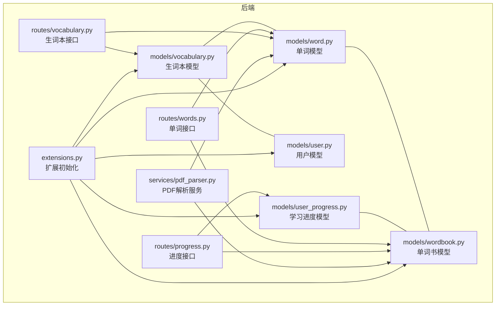
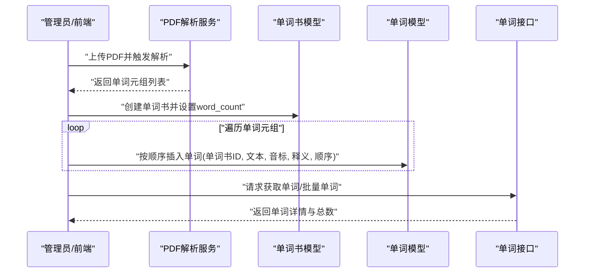
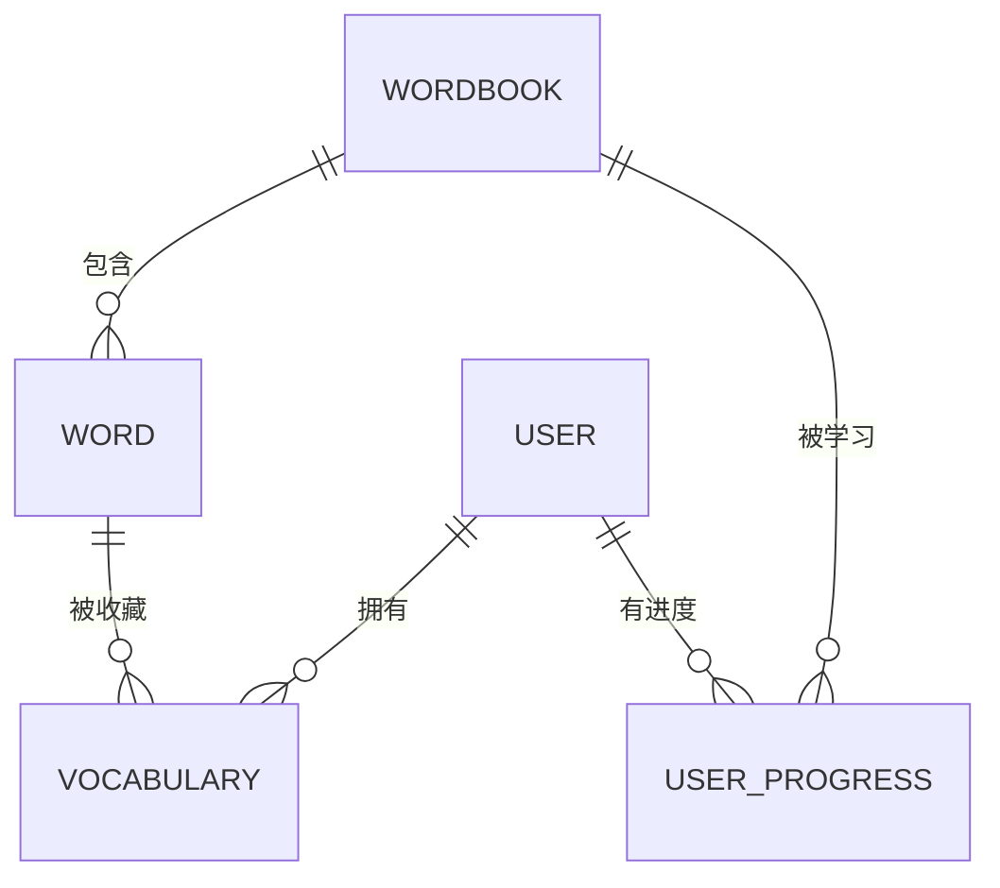
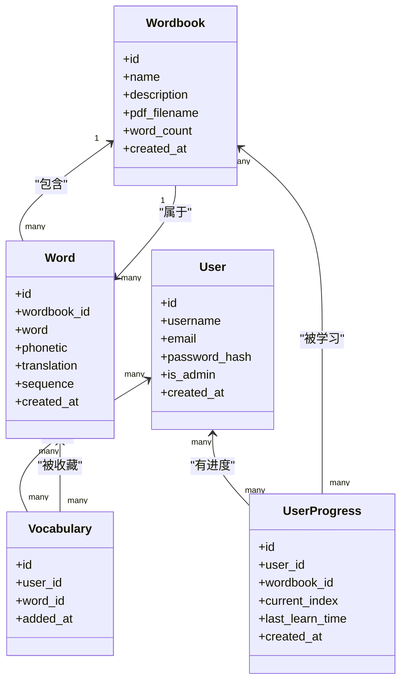
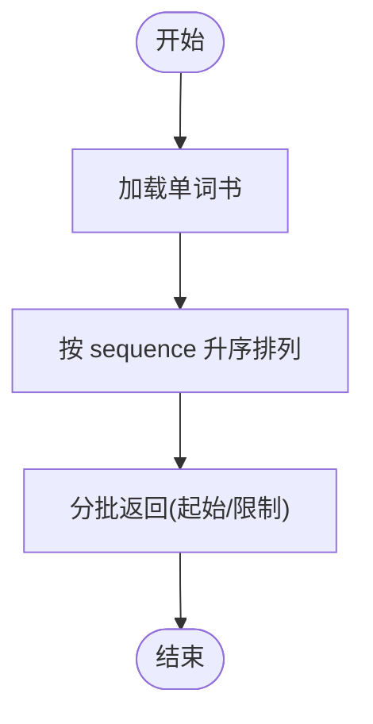
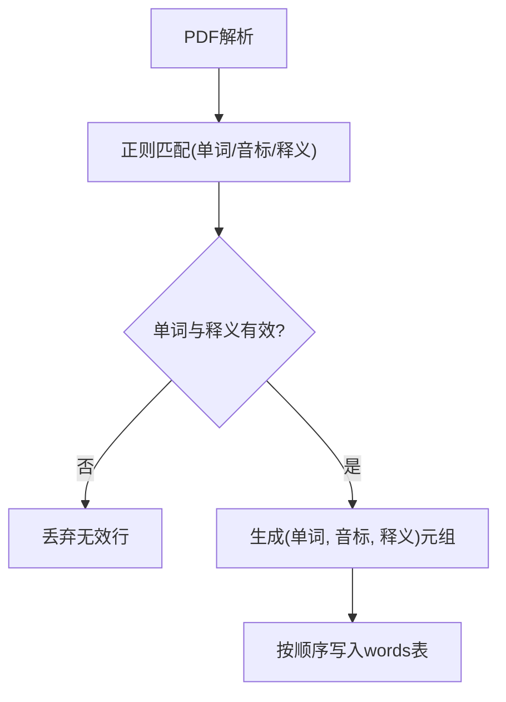
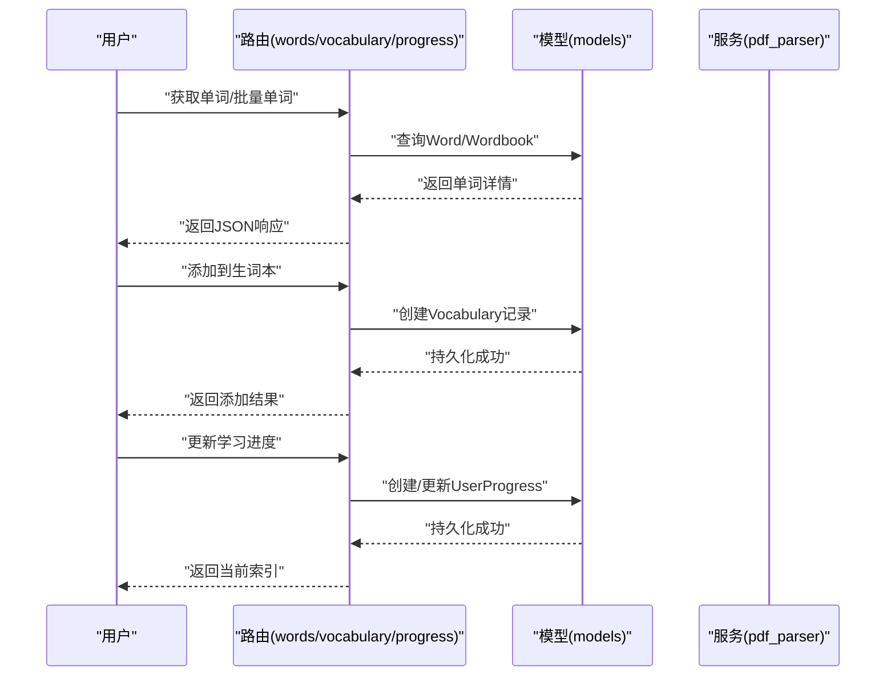
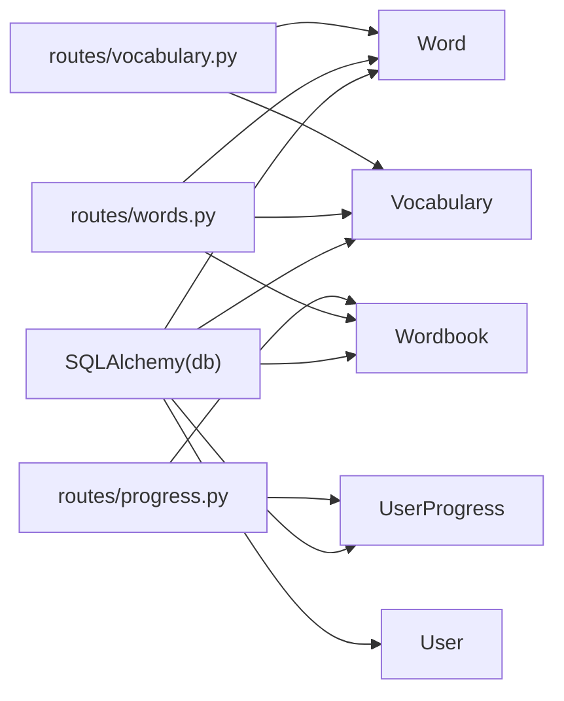

# 单词模型

<cite>
**本文引用的文件**
- [backend/app/models/word.py](file://backend/app/models/word.py)
- [backend/app/models/wordbook.py](file://backend/app/models/wordbook.py)
- [backend/app/models/vocabulary.py](file://backend/app/models/vocabulary.py)
- [backend/app/models/user.py](file://backend/app/models/user.py)
- [backend/app/models/user_progress.py](file://backend/app/models/user_progress.py)
- [backend/app/routes/words.py](file://backend/app/routes/words.py)
- [backend/app/routes/vocabulary.py](file://backend/app/routes/vocabulary.py)
- [backend/app/routes/progress.py](file://backend/app/routes/progress.py)
- [backend/app/services/pdf_parser.py](file://backend/app/services/pdf_parser.py)
- [backend/app/extensions.py](file://backend/app/extensions.py)
- [init.sql](file://init.sql)
- [README_CN.md](file://README_CN.md)
</cite>

## 目录
1. [简介](#简介)
2. [项目结构](#项目结构)
3. [核心组件](#核心组件)
4. [架构总览](#架构总览)
5. [详细组件分析](#详细组件分析)
6. [依赖关系分析](#依赖关系分析)
7. [性能考虑](#性能考虑)
8. [故障排查指南](#故障排查指南)
9. [结论](#结论)
10. [附录](#附录)

## 简介
本文件围绕单词数据模型进行系统化说明，覆盖单词表的核心字段、单词与单词书的关系设计、排序与分类机制、验证与标准化流程、搜索索引与全文检索支持、性能优化策略，以及单词模型在学习系统中的关键作用与典型使用场景。目标是帮助开发者与产品人员全面理解单词模型的设计与实现。

## 项目结构
后端采用 Flask + SQLAlchemy 架构，单词模型位于 models 子模块，配合路由层提供 REST 接口；学习进度与生词本分别由独立模型与路由支撑；PDF 解析服务负责从教材中抽取单词条目并写入数据库。

图表来源
- [backend/app/models/word.py](file://backend/app/models/word.py#L1-L29)
- [backend/app/models/wordbook.py](file://backend/app/models/wordbook.py#L1-L25)
- [backend/app/models/vocabulary.py](file://backend/app/models/vocabulary.py#L1-L26)
- [backend/app/models/user.py](file://backend/app/models/user.py#L1-L26)
- [backend/app/models/user_progress.py](file://backend/app/models/user_progress.py#L1-L29)
- [backend/app/routes/words.py](file://backend/app/routes/words.py#L1-L65)
- [backend/app/routes/vocabulary.py](file://backend/app/routes/vocabulary.py#L1-L103)
- [backend/app/routes/progress.py](file://backend/app/routes/progress.py#L1-L115)
- [backend/app/services/pdf_parser.py](file://backend/app/services/pdf_parser.py#L1-L43)
- [backend/app/extensions.py](file://backend/app/extensions.py#L1-L10)

章节来源
- [README_CN.md](file://README_CN.md#L1-L84)

## 核心组件
- 单词模型（Word）
  - 字段：主键 id、所属单词书外键 wordbook_id、单词文本 word、音标 phonetic、中文释义 translation、顺序 sequence、创建时间 created_at
  - 约束与索引：唯一约束（单词书 + 顺序），复合索引（单词书 + 顺序）
  - 序列化：to_dict 输出常用字段
- 单词书模型（Wordbook）
  - 字段：主键 id、名称 name、描述 description、PDF 文件名 pdf_filename、单词数量 word_count、创建时间 created_at
  - 关系：与单词一对多（动态加载、级联删除孤儿）
  - 序列化：to_dict 输出常用字段
- 生词本模型（Vocabulary）
  - 字段：主键 id、用户外键 user_id、单词外键 word_id、添加时间 added_at
  - 约束：唯一约束（用户 + 单词）
  - 关系：与 Word 反向关联 in_vocabulary
  - 序列化：to_dict 输出常用字段及单词详情
- 用户模型（User）
  - 字段：主键 id、用户名 username、邮箱 email、密码哈希 password_hash、管理员标志 is_admin、创建时间 created_at
  - 关系：与学习进度、生词本一对多
- 学习进度模型（UserProgress）
  - 字段：主键 id、用户外键 user_id、单词书外键 wordbook_id、当前索引 current_index、最后学习时间 last_learn_time、创建时间 created_at
  - 约束：唯一约束（用户 + 单词书），索引（用户 + 单词书）
  - 关系：与单词书反向关联
- 扩展初始化（extensions.py）
  - 统一注入 db、jwt、cors、bcrypt

章节来源
- [backend/app/models/word.py](file://backend/app/models/word.py#L1-L29)
- [backend/app/models/wordbook.py](file://backend/app/models/wordbook.py#L1-L25)
- [backend/app/models/vocabulary.py](file://backend/app/models/vocabulary.py#L1-L26)
- [backend/app/models/user.py](file://backend/app/models/user.py#L1-L26)
- [backend/app/models/user_progress.py](file://backend/app/models/user_progress.py#L1-L29)
- [backend/app/extensions.py](file://backend/app/extensions.py#L1-L10)

## 架构总览
单词模型贯穿“内容导入 → 结构化存储 → 查询检索 → 学习追踪”的完整链路。PDF 解析服务负责从教材中抽取单词条目，按顺序写入单词表；单词书作为容器承载单词集合；学习进度与生词本提供用户维度的个性化能力；路由层提供对外接口。

图表来源
- [backend/app/services/pdf_parser.py](file://backend/app/services/pdf_parser.py#L1-L43)
- [backend/app/models/wordbook.py](file://backend/app/models/wordbook.py#L1-L25)
- [backend/app/models/word.py](file://backend/app/models/word.py#L1-L29)
- [backend/app/routes/words.py](file://backend/app/routes/words.py#L1-L65)

## 详细组件分析

### 单词表字段与约束
- 主键 id：自增整型，唯一标识单词
- 外键 wordbook_id：指向单词书，非空
- 字段 word：字符串，长度上限 100，非空
- 字段 phonetic：字符串，长度上限 100，可空
- 字段 translation：文本，非空
- 字段 sequence：整型，非空，用于排序
- 字段 created_at：时间戳，默认当前 UTC
- 唯一约束：单词书 + 顺序，保证同一单词书内顺序唯一
- 复合索引：单词书 + 顺序，加速按书本与顺序查询

图表来源
- [backend/app/models/word.py](file://backend/app/models/word.py#L1-L29)
- [backend/app/models/wordbook.py](file://backend/app/models/wordbook.py#L1-L25)
- [backend/app/models/vocabulary.py](file://backend/app/models/vocabulary.py#L1-L26)
- [backend/app/models/user_progress.py](file://backend/app/models/user_progress.py#L1-L29)

章节来源
- [backend/app/models/word.py](file://backend/app/models/word.py#L1-L29)
- [init.sql](file://init.sql#L28-L40)

### 单词与单词书的多对多关系设计
- 实际实现为：单词书 → 单词（一对多），单词 → 单词书（多对一）
- 通过中间表（生词本）实现“用户 ↔ 单词”的多对多关系
  - 生词本表：user_id、word_id、added_at
  - 唯一约束：用户 + 单词，避免重复添加
  - 关系：Vocabulary 与 Word 反向关联 in_vocabulary

图表来源
- [backend/app/models/wordbook.py](file://backend/app/models/wordbook.py#L1-L25)
- [backend/app/models/word.py](file://backend/app/models/word.py#L1-L29)
- [backend/app/models/vocabulary.py](file://backend/app/models/vocabulary.py#L1-L26)
- [backend/app/models/user.py](file://backend/app/models/user.py#L1-L26)
- [backend/app/models/user_progress.py](file://backend/app/models/user_progress.py#L1-L29)

章节来源
- [backend/app/models/wordbook.py](file://backend/app/models/wordbook.py#L1-L25)
- [backend/app/models/vocabulary.py](file://backend/app/models/vocabulary.py#L1-L26)

### 排序机制与分类体系
- 排序机制
  - sequence 字段：每本单词书内的线性顺序，用于固定学习顺序
  - 复合索引（单词书 + 顺序）：高效按书本与顺序查询
  - 批量接口按 sequence 升序返回
- 分类体系
  - 当前模型未定义“难度等级”字段
  - 可通过 sequence 控制学习节奏（如先易后难）
  - 可扩展：新增难度字段并在导入时标注，或通过用户行为统计推导

图表来源
- [backend/app/routes/words.py](file://backend/app/routes/words.py#L41-L65)
- [backend/app/models/word.py](file://backend/app/models/word.py#L1-L29)

章节来源
- [backend/app/routes/words.py](file://backend/app/routes/words.py#L1-L65)
- [backend/app/models/word.py](file://backend/app/models/word.py#L1-L29)

### 数据验证与标准化处理
- 导入阶段（PDF 解析）
  - 正则匹配格式：英文单词 [音标] 中文释义
  - 校验：单词与释义均需存在才入库
  - 标准化：去除首尾空白，保留原始音标与释义
- 存储阶段（模型约束）
  - 非空约束：单词文本与中文释义
  - 唯一约束：单词书 + 顺序，避免重复顺序
  - 复合索引：提升查询效率
- 接口阶段（路由校验）
  - 路由参数校验：单词书存在性、顺序有效性
  - 学习进度校验：索引范围校验（1..word_count）

图表来源
- [backend/app/services/pdf_parser.py](file://backend/app/services/pdf_parser.py#L1-L43)
- [backend/app/models/word.py](file://backend/app/models/word.py#L1-L29)

章节来源
- [backend/app/services/pdf_parser.py](file://backend/app/services/pdf_parser.py#L1-L43)
- [backend/app/routes/words.py](file://backend/app/routes/words.py#L1-L65)
- [backend/app/routes/progress.py](file://backend/app/routes/progress.py#L1-L115)

### 搜索索引设计与全文检索支持
- 现状
  - 单词表：复合索引（单词书 + 顺序），适合按书本与顺序检索
  - 用户表：索引（邮箱、用户名），适合登录与查找
  - 生词本：索引（用户），支持按用户快速检索
- 全文检索建议
  - 词典式检索：对 word 与 translation 建立全文索引（MySQL InnoDB 全文索引或外部搜索引擎）
  - 多字段检索：支持“单词/音标/释义”联合搜索
  - 性能优化：分页 + 前缀索引 + 缓存热门查询结果

章节来源
- [init.sql](file://init.sql#L6-L66)
- [backend/app/models/word.py](file://backend/app/models/word.py#L15-L18)

### 单词模型在学习系统中的关键作用与使用场景
- 内容导入与组织
  - 通过 PDF 解析生成单词序列，按顺序写入数据库
  - 单词书作为容器，统一管理单词数量与来源
- 学习路径
  - 按 sequence 顺序推进，结合 UserProgress 记录当前索引
  - 提供“上一个/下一个”导航，计算进度百分比
- 个性化能力
  - 生词本：用户可将不熟悉的单词加入个人收藏
  - 学习追踪：记录最后学习时间与当前进度
- 接口能力
  - 获取单个单词（按单词书 + 顺序）
  - 批量获取单词（分页预加载）
  - 生词本 CRUD（添加/删除/查询）

图表来源
- [backend/app/routes/words.py](file://backend/app/routes/words.py#L1-L65)
- [backend/app/routes/vocabulary.py](file://backend/app/routes/vocabulary.py#L1-L103)
- [backend/app/routes/progress.py](file://backend/app/routes/progress.py#L1-L115)
- [backend/app/models/word.py](file://backend/app/models/word.py#L1-L29)
- [backend/app/models/vocabulary.py](file://backend/app/models/vocabulary.py#L1-L26)
- [backend/app/models/user_progress.py](file://backend/app/models/user_progress.py#L1-L29)
- [backend/app/services/pdf_parser.py](file://backend/app/services/pdf_parser.py#L1-L43)

## 依赖关系分析
- 模型间依赖
  - Wordbook → Word：一对多（动态加载、级联删除孤儿）
  - Vocabulary ←→ Word：多对一（反向关联 in_vocabulary）
  - UserProgress ←→ Wordbook：多对一（反向关联 progress）
- 路由依赖
  - words 路由依赖 Word、Wordbook、Vocabulary
  - vocabulary 路由依赖 Vocabulary、Word
  - progress 路由依赖 UserProgress、Wordbook
- 扩展依赖
  - 所有模型依赖 db（SQLAlchemy）

图表来源
- [backend/app/extensions.py](file://backend/app/extensions.py#L1-L10)
- [backend/app/models/word.py](file://backend/app/models/word.py#L1-L29)
- [backend/app/models/wordbook.py](file://backend/app/models/wordbook.py#L1-L25)
- [backend/app/models/vocabulary.py](file://backend/app/models/vocabulary.py#L1-L26)
- [backend/app/models/user_progress.py](file://backend/app/models/user_progress.py#L1-L29)
- [backend/app/routes/words.py](file://backend/app/routes/words.py#L1-L65)
- [backend/app/routes/vocabulary.py](file://backend/app/routes/vocabulary.py#L1-L103)
- [backend/app/routes/progress.py](file://backend/app/routes/progress.py#L1-L115)

章节来源
- [backend/app/extensions.py](file://backend/app/extensions.py#L1-L10)
- [backend/app/models/word.py](file://backend/app/models/word.py#L1-L29)
- [backend/app/models/wordbook.py](file://backend/app/models/wordbook.py#L1-L25)
- [backend/app/models/vocabulary.py](file://backend/app/models/vocabulary.py#L1-L26)
- [backend/app/models/user_progress.py](file://backend/app/models/user_progress.py#L1-L29)
- [backend/app/routes/words.py](file://backend/app/routes/words.py#L1-L65)
- [backend/app/routes/vocabulary.py](file://backend/app/routes/vocabulary.py#L1-L103)
- [backend/app/routes/progress.py](file://backend/app/routes/progress.py#L1-L115)

## 性能考虑
- 索引策略
  - 单词表：复合索引（单词书 + 顺序），满足按书本与顺序的高频查询
  - 用户表：索引（邮箱、用户名），提升登录与查找效率
  - 生词本：索引（用户），支持按用户快速检索
- 查询优化
  - 批量接口使用范围查询与排序，避免全表扫描
  - 使用分页参数（起始/限制）控制返回规模
- 存储与导入
  - PDF 解析阶段过滤无效行，减少入库噪声
  - 批量插入单词，降低事务开销
- 可扩展优化
  - 全文检索：对 word/translation 建立全文索引或引入外部搜索引擎
  - 缓存：热点单词详情与生词本列表缓存
  - 分片：大规模单词书按 ID 分片

章节来源
- [init.sql](file://init.sql#L6-L66)
- [backend/app/routes/words.py](file://backend/app/routes/words.py#L41-L65)
- [backend/app/services/pdf_parser.py](file://backend/app/services/pdf_parser.py#L1-L43)

## 故障排查指南
- 单词不存在
  - 现象：按单词书 + 顺序查询不到单词
  - 排查：确认单词书存在、顺序有效、未被删除
- 单词书不存在
  - 现象：接口返回单词书不存在
  - 排查：确认单词书 ID 正确、数据库一致
- 索引越界
  - 现象：更新学习进度时报索引超出范围
  - 排查：确认 current_index 在 [1, word_count] 区间内
- 生词本重复添加
  - 现象：重复添加同一单词
  - 排查：唯一约束防止重复，接口应提示已存在
- PDF 解析失败
  - 现象：PDF 中未找到有效单词数据
  - 排查：确认格式符合“单词 [音标] 释义”，文件可读

章节来源
- [backend/app/routes/words.py](file://backend/app/routes/words.py#L10-L38)
- [backend/app/routes/progress.py](file://backend/app/routes/progress.py#L53-L95)
- [backend/app/routes/vocabulary.py](file://backend/app/routes/vocabulary.py#L44-L70)
- [backend/app/services/pdf_parser.py](file://backend/app/services/pdf_parser.py#L1-L43)

## 结论
单词模型以“单词书 + 顺序”为核心组织方式，辅以生词本与学习进度实现个性化学习闭环。通过合理的索引与路由分页策略，满足日常学习场景的性能需求。未来可在难度标注、全文检索与缓存策略方面进一步增强，以支持更丰富的学习体验与更高并发访问。

## 附录
- 数据库初始化脚本
  - 定义了 users、wordbooks、words、user_progress、vocabulary 表结构与索引
- 使用指南
  - 介绍项目结构、启动方式与功能说明

章节来源
- [init.sql](file://init.sql#L1-L67)
- [README_CN.md](file://README_CN.md#L1-L84)