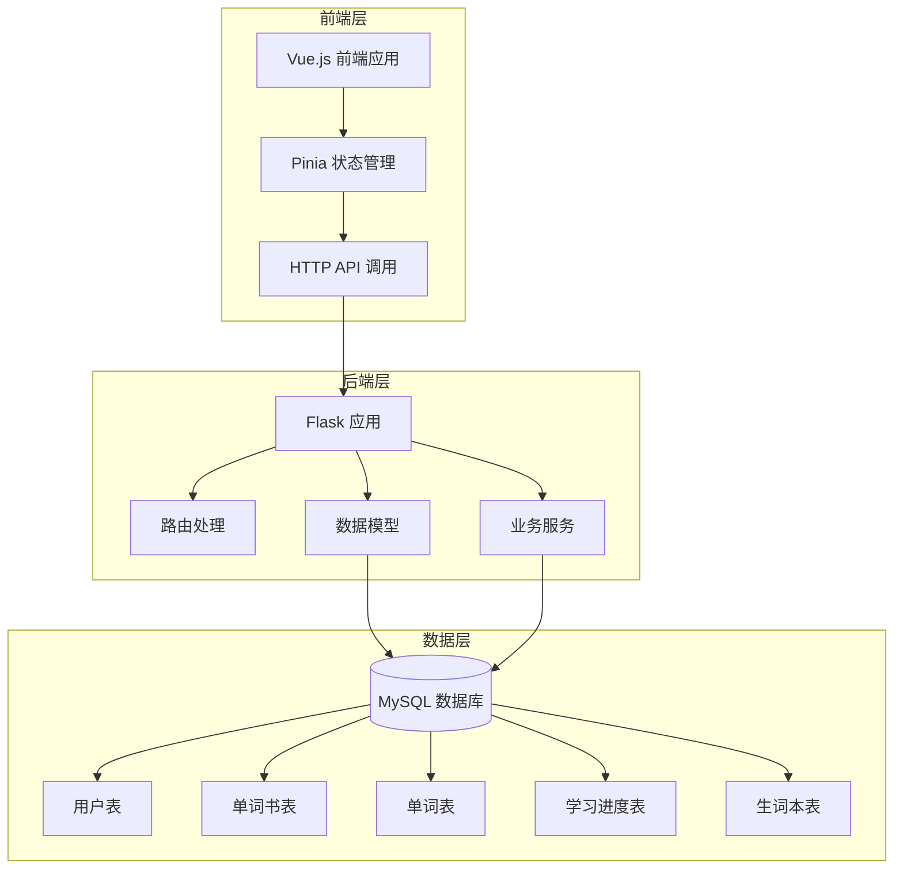
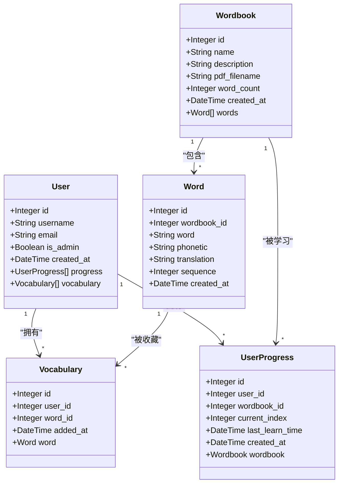
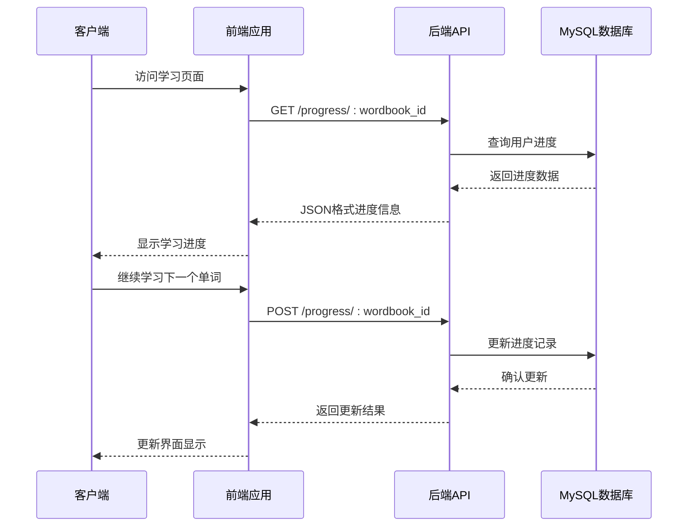
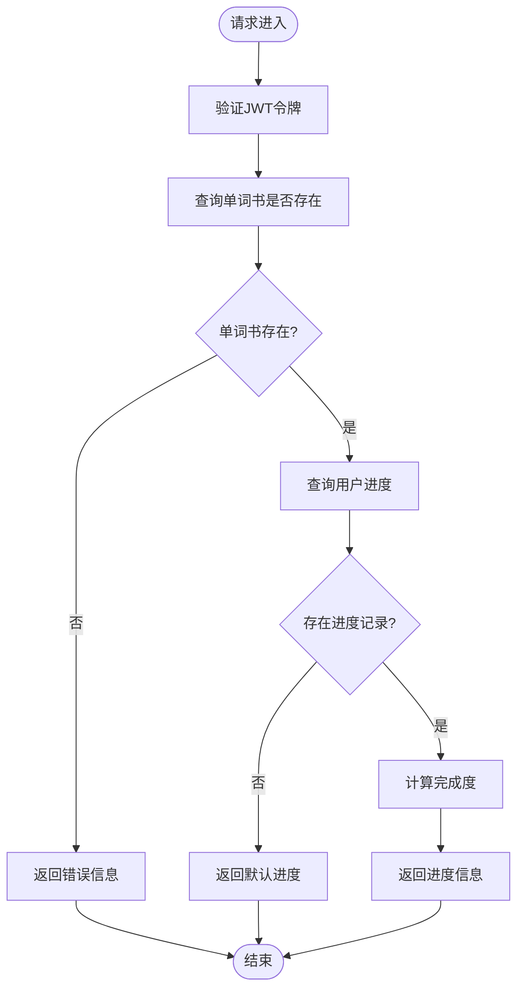
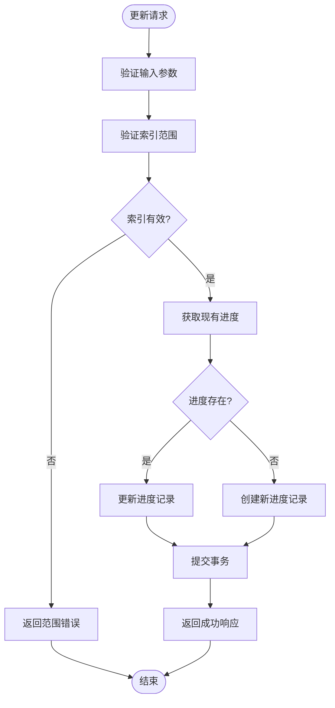
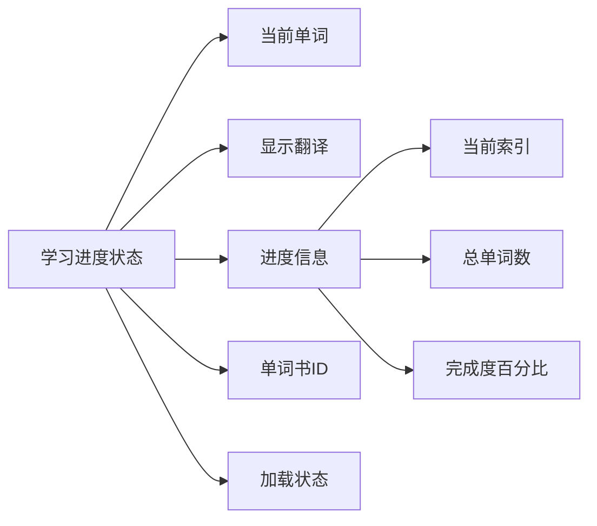
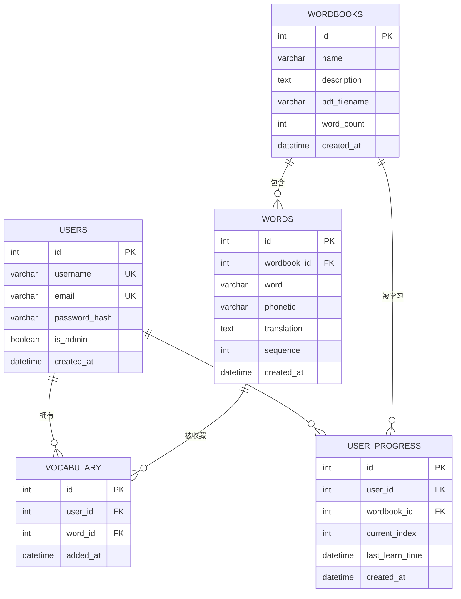
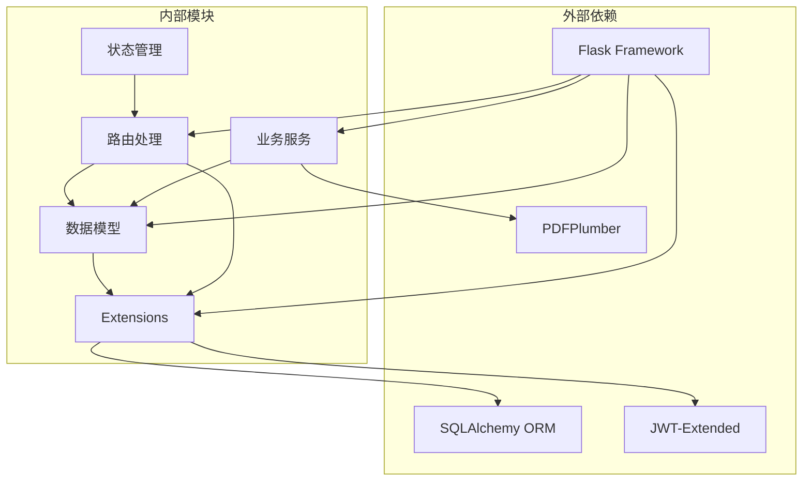

# 学习进度模型

<cite>
**本文档引用的文件**
- [backend/app/models/user_progress.py](file://backend/app/models/user_progress.py)
- [backend/app/models/user.py](file://backend/app/models/user.py)
- [backend/app/models/wordbook.py](file://backend/app/models/wordbook.py)
- [backend/app/models/word.py](file://backend/app/models/word.py)
- [backend/app/models/vocabulary.py](file://backend/app/models/vocabulary.py)
- [backend/app/routes/progress.py](file://backend/app/routes/progress.py)
- [backend/app/services/pdf_parser.py](file://backend/app/services/pdf_parser.py)
- [backend/app/extensions.py](file://backend/app/extensions.py)
- [init.sql](file://init.sql)
- [frontend/src/stores/learning.js](file://frontend/src/stores/learning.js)
</cite>

## 目录
1. [简介](#简介)
2. [项目结构](#项目结构)
3. [核心组件](#核心组件)
4. [架构概览](#架构概览)
5. [详细组件分析](#详细组件分析)
6. [依赖关系分析](#依赖关系分析)
7. [性能考虑](#性能考虑)
8. [故障排除指南](#故障排除指南)
9. [结论](#结论)
10. [附录](#附录)

## 简介

学习进度模型是单词学习系统的核心数据结构，负责跟踪用户在不同单词书中的学习状态。该模型实现了完整的进度跟踪机制，包括学习位置记录、时间戳管理、完成度计算等功能。通过精心设计的数据模型和API接口，系统能够为用户提供个性化的学习体验，并为后续的智能推荐提供数据基础。

## 项目结构

项目采用典型的三层架构设计，后端使用Flask框架，前端使用Vue.js技术栈，数据库采用MySQL关系型存储。



**图表来源**
- [backend/app/models/user_progress.py](file://backend/app/models/user_progress.py#L1-L29)
- [backend/app/routes/progress.py](file://backend/app/routes/progress.py#L1-L115)
- [init.sql](file://init.sql#L1-L67)

**章节来源**
- [backend/app/models/user_progress.py](file://backend/app/models/user_progress.py#L1-L29)
- [backend/app/routes/progress.py](file://backend/app/routes/progress.py#L1-L115)
- [init.sql](file://init.sql#L1-L67)

## 核心组件

学习进度模型的核心组件包括数据模型、API路由、前端状态管理和数据库结构。这些组件协同工作，为用户提供完整的学习进度跟踪功能。

### 数据模型层次



**图表来源**
- [backend/app/models/user.py](file://backend/app/models/user.py#L1-L26)
- [backend/app/models/wordbook.py](file://backend/app/models/wordbook.py#L1-L25)
- [backend/app/models/word.py](file://backend/app/models/word.py#L1-L29)
- [backend/app/models/user_progress.py](file://backend/app/models/user_progress.py#L1-L29)
- [backend/app/models/vocabulary.py](file://backend/app/models/vocabulary.py#L1-L26)

### API接口设计

系统提供了完整的RESTful API接口来管理学习进度：

- GET `/progress/<wordbook_id>` - 获取用户在指定单词书的学习进度
- POST `/progress/<wordbook_id>` - 更新学习进度
- POST `/progress/<wordbook_id>/reset` - 重置学习进度

**章节来源**
- [backend/app/models/user_progress.py](file://backend/app/models/user_progress.py#L1-L29)
- [backend/app/models/user.py](file://backend/app/models/user.py#L1-L26)
- [backend/app/models/wordbook.py](file://backend/app/models/wordbook.py#L1-L25)
- [backend/app/models/word.py](file://backend/app/models/word.py#L1-L29)
- [backend/app/models/vocabulary.py](file://backend/app/models/vocabulary.py#L1-L26)
- [backend/app/routes/progress.py](file://backend/app/routes/progress.py#L1-L115)

## 架构概览

学习进度系统的整体架构采用分层设计，确保了良好的可维护性和扩展性。



**图表来源**
- [backend/app/routes/progress.py](file://backend/app/routes/progress.py#L11-L50)
- [frontend/src/stores/learning.js](file://frontend/src/stores/learning.js#L16-L50)

## 详细组件分析

### UserProgress 数据模型

UserProgress 是学习进度模型的核心，负责存储用户的单词学习状态。

#### 字段定义与约束

| 字段名 | 类型 | 约束 | 描述 |
|--------|------|------|------|
| id | Integer | 主键 | 进度记录唯一标识符 |
| user_id | Integer | 外键(users.id) | 关联用户标识 |
| wordbook_id | Integer | 外键(wordbooks.id) | 关联单词书标识 |
| current_index | Integer | 默认值1 | 当前学习位置索引 |
| last_learn_time | DateTime | 默认当前时间 | 最后学习时间戳 |
| created_at | DateTime | 默认当前时间 | 记录创建时间 |

#### 索引与约束设计

```mermaid
erDiagram
USER_PROGRESS {
int id PK
int user_id FK
int wordbook_id FK
int current_index
datetime last_learn_time
datetime created_at
}
USERS ||--o{ USER_PROGRESS : "拥有"
WORDBOOKS ||--o{ USER_PROGRESS : "被学习"
USER_PROGRESS {
unique unique_user_wordbook(user_id, wordbook_id)
index idx_user_wordbook(user_id, wordbook_id)
}
```

**图表来源**
- [backend/app/models/user_progress.py](file://backend/app/models/user_progress.py#L14-L17)
- [init.sql](file://init.sql#L42-L54)

#### 完成度计算逻辑

学习进度的完成度通过以下公式计算：
```
完成度 = (current_index - 1) / word_count × 100%
```

这个公式确保了从第1个单词开始学习时，完成度为0%，当学习到最后一个单词时，完成度为100%。

**章节来源**
- [backend/app/models/user_progress.py](file://backend/app/models/user_progress.py#L1-L29)
- [backend/app/routes/progress.py](file://backend/app/routes/progress.py#L39-L49)

### 进度跟踪机制

#### 学习位置管理

系统通过 `current_index` 字段精确跟踪用户的学习位置。该字段采用1基索引，确保与单词序列的一致性。

#### 时间戳管理

系统维护两个关键的时间戳：
- `last_learn_time`: 记录用户最后一次学习的时间
- `created_at`: 记录进度记录的创建时间

#### 自动重置机制

当用户重新开始学习某个单词书时，系统会自动将 `current_index` 重置为1，并更新 `last_learn_time`。

**章节来源**
- [backend/app/routes/progress.py](file://backend/app/routes/progress.py#L78-L88)
- [backend/app/routes/progress.py](file://backend/app/routes/progress.py#L109-L112)

### API处理流程

#### 获取进度流程



**图表来源**
- [backend/app/routes/progress.py](file://backend/app/routes/progress.py#L11-L50)

#### 更新进度流程



**图表来源**
- [backend/app/routes/progress.py](file://backend/app/routes/progress.py#L53-L95)

**章节来源**
- [backend/app/routes/progress.py](file://backend/app/routes/progress.py#L11-L115)

### 前端集成与状态管理

前端使用 Pinia 进行状态管理，实现了与后端API的无缝集成。

#### 状态结构设计



**图表来源**
- [frontend/src/stores/learning.js](file://frontend/src/stores/learning.js#L5-L15)

#### 异步操作流程

前端通过异步函数处理所有与后端的通信，确保用户体验的流畅性。

**章节来源**
- [frontend/src/stores/learning.js](file://frontend/src/stores/learning.js#L1-L112)

### 数据持久化策略

#### 数据库设计原则

系统采用关系型数据库设计，确保数据的完整性和一致性：

1. **外键约束**: 确保数据引用完整性
2. **唯一约束**: 防止重复的用户-单词书组合
3. **索引优化**: 提升查询性能
4. **级联删除**: 维护数据一致性

#### 表结构设计



**图表来源**
- [init.sql](file://init.sql#L6-L66)

**章节来源**
- [init.sql](file://init.sql#L1-L67)

## 依赖关系分析

系统各组件之间的依赖关系清晰明确，遵循单一职责原则。



**图表来源**
- [backend/app/extensions.py](file://backend/app/extensions.py#L1-L10)
- [backend/app/routes/progress.py](file://backend/app/routes/progress.py#L1-L6)
- [backend/app/services/pdf_parser.py](file://backend/app/services/pdf_parser.py#L1-L43)

### 核心依赖关系

1. **Flask 应用**: 作为Web框架承载整个应用
2. **SQLAlchemy**: 提供ORM功能，简化数据库操作
3. **JWT-Extended**: 处理用户认证和授权
4. **PDFPlumber**: 解析PDF文件提取单词信息

**章节来源**
- [backend/app/extensions.py](file://backend/app/extensions.py#L1-L10)
- [backend/app/services/pdf_parser.py](file://backend/app/services/pdf_parser.py#L1-L43)

## 性能考虑

### 数据库优化策略

1. **索引设计**: 在 `user_id` 和 `wordbook_id` 上建立复合索引，提升查询性能
2. **唯一约束**: 防止重复数据，减少查询复杂度
3. **连接池**: 使用数据库连接池提高并发性能

### 缓存策略

虽然当前实现未包含缓存层，但可以考虑以下优化：
- Redis 缓存热门单词书的进度信息
- 浏览器本地存储用户的学习偏好
- CDN 加速静态资源

### API性能优化

1. **批量操作**: 支持批量获取多个单词书的进度
2. **分页查询**: 对于大量数据的查询进行分页处理
3. **条件查询**: 使用适当的WHERE条件减少数据传输

## 故障排除指南

### 常见问题及解决方案

#### 进度更新失败

**问题症状**: 用户更新学习进度后，页面不显示最新状态

**可能原因**:
1. JWT令牌过期或无效
2. 网络连接异常
3. 数据库连接问题

**解决步骤**:
1. 检查用户登录状态
2. 验证网络连接稳定性
3. 查看服务器日志获取详细错误信息

#### 进度计算错误

**问题症状**: 学习完成度显示异常

**可能原因**:
1. 单词书总词数为0
2. current_index 超出有效范围
3. 数据库查询错误

**解决步骤**:
1. 验证单词书的 word_count 字段
2. 检查 current_index 的边界条件
3. 确认数据库连接正常

#### 权限访问问题

**问题症状**: 用户无法访问其他用户的进度信息

**解决步骤**:
1. 确认JWT认证是否正确传递
2. 验证用户身份验证
3. 检查路由权限配置

**章节来源**
- [backend/app/routes/progress.py](file://backend/app/routes/progress.py#L11-L115)

## 结论

学习进度模型通过精心设计的数据结构和API接口，为单词学习系统提供了可靠的学习跟踪能力。该模型具有以下优势：

1. **数据完整性**: 通过外键约束和唯一约束确保数据一致性
2. **性能优化**: 合理的索引设计和查询优化
3. **扩展性**: 清晰的架构设计便于功能扩展
4. **用户体验**: 实时的进度更新和直观的界面展示

未来可以考虑的功能增强包括：
- 学习时长统计和分析
- 错误率计算和学习效果评估
- 个性化学习路径推荐
- 学习历史的深度分析

## 附录

### API参考文档

#### 获取进度
- **方法**: GET
- **路径**: `/progress/{wordbook_id}`
- **认证**: 需要JWT令牌
- **响应**: 包含当前索引、总词数、完成度和最后学习时间

#### 更新进度
- **方法**: POST
- **路径**: `/progress/{wordbook_id}`
- **认证**: 需要JWT令牌
- **请求体**: `{ "current_index": number }`
- **响应**: 返回更新后的current_index

#### 重置进度
- **方法**: POST
- **路径**: `/progress/{wordbook_id}/reset`
- **认证**: 需要JWT令牌
- **响应**: 将current_index重置为1

### 数据模型字段说明

| 字段名 | 类型 | 必填 | 描述 |
|--------|------|------|------|
| user_id | Integer | 是 | 用户标识符 |
| wordbook_id | Integer | 是 | 单词书标识符 |
| current_index | Integer | 是 | 当前学习位置 |
| last_learn_time | DateTime | 否 | 最后学习时间 |
| created_at | DateTime | 否 | 记录创建时间 |