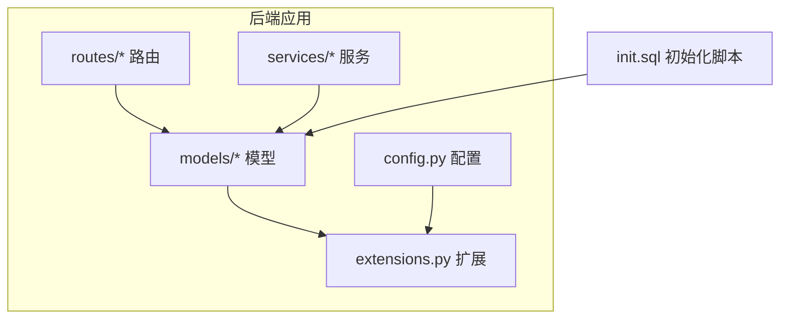
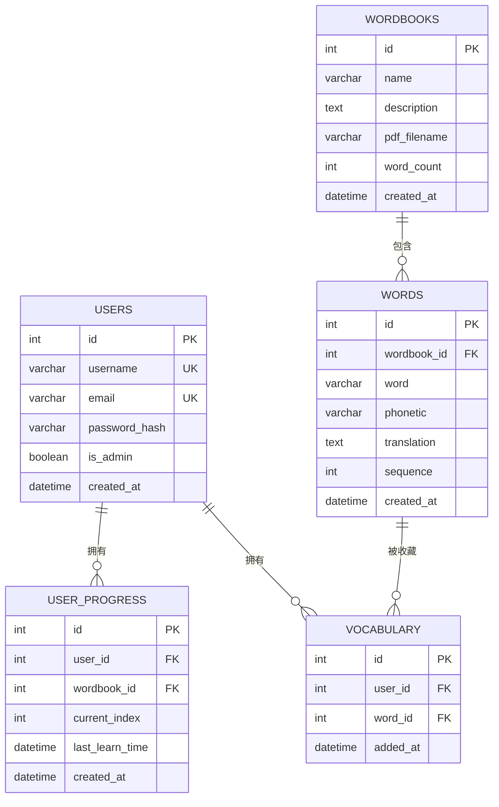
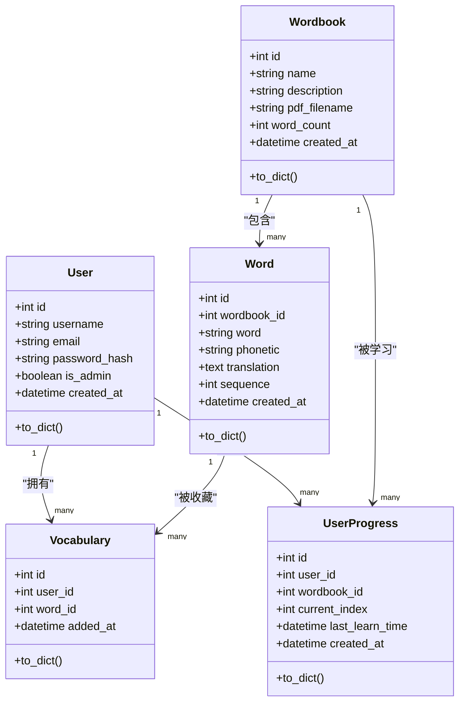
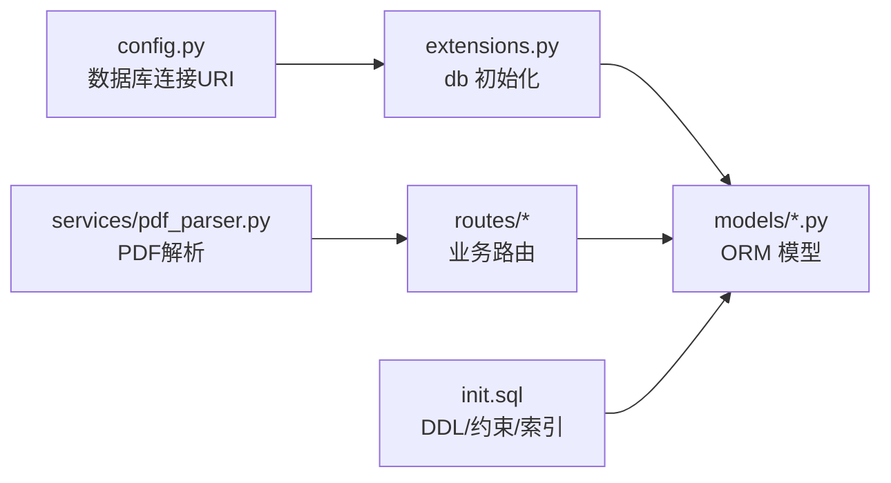
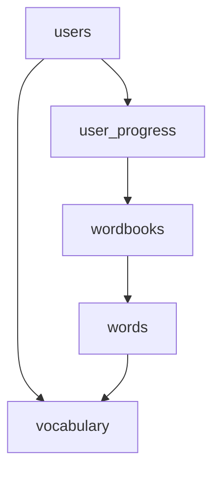

# 数据库设计

<cite>
**本文引用的文件**
- [backend/app/models/__init__.py](file://backend/app/models/__init__.py)
- [backend/app/models/user.py](file://backend/app/models/user.py)
- [backend/app/models/wordbook.py](file://backend/app/models/wordbook.py)
- [backend/app/models/word.py](file://backend/app/models/word.py)
- [backend/app/models/user_progress.py](file://backend/app/models/user_progress.py)
- [backend/app/models/vocabulary.py](file://backend/app/models/vocabulary.py)
- [init.sql](file://init.sql)
- [backend/app/extensions.py](file://backend/app/extensions.py)
- [backend/app/config.py](file://backend/app/config.py)
- [backend/requirements.txt](file://backend/requirements.txt)
- [backend/app/routes/wordbooks.py](file://backend/app/routes/wordbooks.py)
- [backend/app/routes/words.py](file://backend/app/routes/words.py)
- [backend/app/routes/vocabulary.py](file://backend/app/routes/vocabulary.py)
- [backend/app/routes/progress.py](file://backend/app/routes/progress.py)
- [backend/app/services/pdf_parser.py](file://backend/app/services/pdf_parser.py)
</cite>

## 目录
1. [简介](#简介)
2. [项目结构](#项目结构)
3. [核心组件](#核心组件)
4. [架构总览](#架构总览)
5. [详细组件分析](#详细组件分析)
6. [依赖分析](#依赖分析)
7. [性能考虑](#性能考虑)
8. [故障排除指南](#故障排除指南)
9. [结论](#结论)
10. [附录](#附录)

## 简介
本文件为单词学习网站的数据库设计与数据模型说明，覆盖用户模型（User）、单词书模型（Wordbook）、单词模型（Word）、学习进度模型（UserProgress）和生词本模型（Vocabulary）。文档详细阐述各实体的字段定义、数据类型、主键/外键约束、索引设计与数据完整性规则；给出实体关系图与数据库关系图；解释数据验证规则、业务规则与数据生命周期管理；并提供数据迁移策略、备份恢复方案与性能优化建议，以及初始化与测试数据说明。

## 项目结构
后端采用 Flask + SQLAlchemy 架构，数据库初始化脚本与模型定义分离，模型文件位于 backend/app/models，数据库初始化脚本位于仓库根目录的 init.sql。配置文件位于 backend/app/config.py，数据库连接由 SQLAlchemy 在扩展模块 backend/app/extensions.py 中统一管理。

图表来源
- [backend/app/models/__init__.py](file://backend/app/models/__init__.py#L1-L6)
- [backend/app/routes/wordbooks.py](file://backend/app/routes/wordbooks.py#L1-L159)
- [backend/app/routes/words.py](file://backend/app/routes/words.py#L1-L65)
- [backend/app/routes/vocabulary.py](file://backend/app/routes/vocabulary.py#L1-L103)
- [backend/app/routes/progress.py](file://backend/app/routes/progress.py#L1-L115)
- [backend/app/services/pdf_parser.py](file://backend/app/services/pdf_parser.py#L1-L43)
- [backend/app/config.py](file://backend/app/config.py#L1-L28)
- [backend/app/extensions.py](file://backend/app/extensions.py#L1-L10)
- [init.sql](file://init.sql#L1-L67)

章节来源
- [backend/app/models/__init__.py](file://backend/app/models/__init__.py#L1-L6)
- [backend/app/config.py](file://backend/app/config.py#L1-L28)
- [backend/app/extensions.py](file://backend/app/extensions.py#L1-L10)
- [init.sql](file://init.sql#L1-L67)

## 核心组件
本节概述五个核心数据模型及其职责：
- 用户（User）：存储用户基本信息与认证标识，维护学习进度与生词本关联。
- 单词书（Wordbook）：描述词汇集合，包含名称、描述、PDF文件名与单词数量等元数据。
- 单词（Word）：具体词汇条目，按单词书内的顺序排列，包含音标与翻译。
- 学习进度（UserProgress）：记录用户对特定单词书的学习进度与最后学习时间。
- 生词本（Vocabulary）：记录用户收藏的单词，去重约束保证同一用户不能重复添加同一单词。

章节来源
- [backend/app/models/user.py](file://backend/app/models/user.py#L1-L26)
- [backend/app/models/wordbook.py](file://backend/app/models/wordbook.py#L1-L25)
- [backend/app/models/word.py](file://backend/app/models/word.py#L1-L29)
- [backend/app/models/user_progress.py](file://backend/app/models/user_progress.py#L1-L29)
- [backend/app/models/vocabulary.py](file://backend/app/models/vocabulary.py#L1-L26)

## 架构总览
下图展示数据库层的实体关系与约束，映射到实际的模型与初始化脚本。

图表来源
- [init.sql](file://init.sql#L6-L66)
- [backend/app/models/user.py](file://backend/app/models/user.py#L4-L16)
- [backend/app/models/wordbook.py](file://backend/app/models/wordbook.py#L4-L15)
- [backend/app/models/word.py](file://backend/app/models/word.py#L4-L18)
- [backend/app/models/user_progress.py](file://backend/app/models/user_progress.py#L4-L17)
- [backend/app/models/vocabulary.py](file://backend/app/models/vocabulary.py#L4-L14)

## 详细组件分析

### 用户模型（User）
- 表名：users
- 主键：id（自增整数）
- 唯一约束：username、email
- 字段与类型：
  - id：整数，主键
  - username：字符串（最大长度50），唯一且非空
  - email：字符串（最大长度100），唯一且非空
  - password_hash：字符串（最大长度255），非空
  - is_admin：布尔，默认false
  - created_at：日期时间，默认当前UTC时间
- 索引：email、username（来自初始化脚本）
- 关系：
  - 一对多：User → UserProgress（backref: user）
  - 一对多：User → Vocabulary（backref: user）
- 序列化：to_dict 输出常用字段

章节来源
- [backend/app/models/user.py](file://backend/app/models/user.py#L4-L26)
- [init.sql](file://init.sql#L6-L16)

### 单词书模型（Wordbook）
- 表名：wordbooks
- 主键：id（自增整数）
- 字段与类型：
  - id：整数，主键
  - name：字符串（最大长度100），非空
  - description：文本，可空
  - pdf_filename：字符串（最大长度255），可空
  - word_count：整数，默认0
  - created_at：日期时间，默认当前UTC时间
- 关系：
  - 一对多：Wordbook → Word（级联删除孤儿项）
- 序列化：to_dict 输出常用字段

章节来源
- [backend/app/models/wordbook.py](file://backend/app/models/wordbook.py#L4-L25)
- [init.sql](file://init.sql#L18-L26)

### 单词模型（Word）
- 表名：words
- 主键：id（自增整数）
- 外键：wordbook_id → wordbooks.id（级联删除）
- 唯一约束：(wordbook_id, sequence)
- 字段与类型：
  - id：整数，主键
  - wordbook_id：整数，非空
  - word：字符串（最大长度100），非空
  - phonetic：字符串（最大长度100），可空
  - translation：文本，非空
  - sequence：整数，非空（用于排序）
  - created_at：日期时间，默认当前UTC时间
- 索引：idx_wordbook_sequence(wordbook_id, sequence)
- 关系：
  - 多对一：Word → Wordbook（backref: words）
- 序列化：to_dict 输出常用字段

章节来源
- [backend/app/models/word.py](file://backend/app/models/word.py#L4-L29)
- [init.sql](file://init.sql#L28-L40)

### 学习进度模型（UserProgress）
- 表名：user_progress
- 主键：id（自增整数）
- 外键：
  - user_id → users.id（级联删除）
  - wordbook_id → wordbooks.id（级联删除）
- 唯一约束：(user_id, wordbook_id)
- 字段与类型：
  - id：整数，主键
  - user_id：整数，非空
  - wordbook_id：整数，非空
  - current_index：整数，默认1
  - last_learn_time：日期时间，默认当前UTC时间
  - created_at：日期时间，默认当前UTC时间
- 索引：idx_user_wordbook(user_id, wordbook_id)
- 关系：
  - 多对一：UserProgress → Wordbook（backref: progress）

章节来源
- [backend/app/models/user_progress.py](file://backend/app/models/user_progress.py#L4-L29)
- [init.sql](file://init.sql#L42-L54)

### 生词本模型（Vocabulary）
- 表名：vocabulary
- 主键：id（自增整数）
- 外键：
  - user_id → users.id（级联删除）
  - word_id → words.id（级联删除）
- 唯一约束：(user_id, word_id)
- 字段与类型：
  - id：整数，主键
  - user_id：整数，非空
  - word_id：整数，非空
  - added_at：日期时间，默认当前UTC时间
- 索引：idx_user(user_id)
- 关系：
  - 多对一：Vocabulary → Word（backref: in_vocabulary）

章节来源
- [backend/app/models/vocabulary.py](file://backend/app/models/vocabulary.py#L4-L26)
- [init.sql](file://init.sql#L56-L66)

### 类关系与依赖（代码级）

图表来源
- [backend/app/models/user.py](file://backend/app/models/user.py#L4-L26)
- [backend/app/models/wordbook.py](file://backend/app/models/wordbook.py#L4-L25)
- [backend/app/models/word.py](file://backend/app/models/word.py#L4-L29)
- [backend/app/models/user_progress.py](file://backend/app/models/user_progress.py#L4-L29)
- [backend/app/models/vocabulary.py](file://backend/app/models/vocabulary.py#L4-L26)

## 依赖分析
- 数据库连接与ORM：SQLAlchemy 通过 extensions.py 注入 db 实例，config.py 提供数据库连接字符串。
- 路由层调用模型：各蓝图（wordbooks、words、vocabulary、progress）直接操作模型进行查询、插入与删除。
- PDF 导入流程：wordbooks 蓝图调用 pdf_parser 服务解析 PDF，生成单词数据后批量写入数据库。
- 外键与级联：初始化脚本与模型定义均体现外键约束与级联删除，确保数据一致性。

图表来源
- [backend/app/config.py](file://backend/app/config.py#L14-L18)
- [backend/app/extensions.py](file://backend/app/extensions.py#L6-L6)
- [backend/app/routes/wordbooks.py](file://backend/app/routes/wordbooks.py#L68-L135)
- [backend/app/services/pdf_parser.py](file://backend/app/services/pdf_parser.py#L4-L43)
- [init.sql](file://init.sql#L1-L67)

章节来源
- [backend/app/config.py](file://backend/app/config.py#L1-L28)
- [backend/app/extensions.py](file://backend/app/extensions.py#L1-L10)
- [backend/app/routes/wordbooks.py](file://backend/app/routes/wordbooks.py#L1-L159)
- [backend/app/services/pdf_parser.py](file://backend/app/services/pdf_parser.py#L1-L43)
- [init.sql](file://init.sql#L1-L67)

## 性能考虑
- 索引设计
  - users：email、username（加速登录与去重）
  - words：idx_wordbook_sequence(wordbook_id, sequence)（按单词书分组与顺序检索）
  - user_progress：idx_user_wordbook(user_id, wordbook_id)（按用户+单词书快速定位）
  - vocabulary：idx_user(user_id)（按用户检索生词本）
- 查询模式
  - 按单词书与序列号查询单词：利用唯一索引 unique_wordbook_sequence
  - 按用户与单词书查询学习进度：利用唯一索引 unique_user_wordbook
  - 分页查询生词本：按 added_at 倒序，结合分页参数 offset/limit
- 写入优化
  - 批量插入单词：在导入时 flush 后批量 add，减少往返
  - 级联删除：删除单词书时自动清理单词、进度与生词本记录
- 连接与字符集
  - 使用 utf8mb4 字符集与校对规则，兼容emoji与多语言
  - 连接字符串启用 charset=utf8mb4

章节来源
- [init.sql](file://init.sql#L14-L16)
- [init.sql](file://init.sql#L38-L40)
- [init.sql](file://init.sql#L52-L54)
- [init.sql](file://init.sql#L64-L66)
- [backend/app/config.py](file://backend/app/config.py#L14-L18)

## 故障排除指南
- PDF 导入失败
  - 现象：上传PDF后提示未找到有效单词数据或解析异常
  - 排查：确认PDF格式符合“英文单词 [音标] 中文释义”正则；检查解析服务日志；确认文件保存路径与权限
  - 参考：路由层在解析失败时回滚事务并删除临时文件
- 单词不存在
  - 现象：按单词书与序列号获取单词返回不存在
  - 排查：确认 sequence 是否在 1..word_count 范围内；确认单词书存在
- 生词本重复添加
  - 现象：重复添加同一单词无新增记录
  - 机制：唯一约束 unique_user_word 防止重复
- 学习进度越界
  - 现象：更新进度时提示索引超出范围
  - 排查：current_index 必须在 1..wordbook.word_count 之间

章节来源
- [backend/app/routes/wordbooks.py](file://backend/app/routes/wordbooks.py#L93-L135)
- [backend/app/routes/words.py](file://backend/app/routes/words.py#L16-L27)
- [backend/app/routes/vocabulary.py](file://backend/app/routes/vocabulary.py#L61-L68)
- [backend/app/routes/progress.py](file://backend/app/routes/progress.py#L69-L72)

## 结论
本设计以清晰的实体划分与严格的外键/唯一约束保障数据完整性，配合合理的索引与批量写入策略满足学习场景的读写性能需求。通过初始化脚本与模型定义保持一致，辅以路由层的业务规则与服务层的PDF解析能力，形成完整的数据生命周期闭环。

## 附录

### 数据验证与业务规则
- 用户注册/登录
  - username、email 唯一性约束
  - password_hash 非空
- 单词书导入
  - 名称必填；PDF文件必选且扩展名为.pdf
  - 解析结果为空时拒绝导入
- 单词访问
  - 按 (wordbook_id, sequence) 定位单词；sequence 范围必须合法
- 生词本
  - 唯一约束：(user_id, word_id)，防止重复添加
- 学习进度
  - 唯一约束：(user_id, wordbook_id)，每用户每单词书仅一条记录
  - current_index 限制在 [1, word_count]

章节来源
- [backend/app/models/user.py](file://backend/app/models/user.py#L7-L12)
- [backend/app/models/wordbook.py](file://backend/app/models/wordbook.py#L7-L12)
- [backend/app/models/word.py](file://backend/app/models/word.py#L15-L18)
- [backend/app/models/user_progress.py](file://backend/app/models/user_progress.py#L14-L17)
- [backend/app/models/vocabulary.py](file://backend/app/models/vocabulary.py#L12-L14)
- [backend/app/routes/wordbooks.py](file://backend/app/routes/wordbooks.py#L72-L87)
- [backend/app/routes/words.py](file://backend/app/routes/words.py#L16-L27)
- [backend/app/routes/vocabulary.py](file://backend/app/routes/vocabulary.py#L56-L68)
- [backend/app/routes/progress.py](file://backend/app/routes/progress.py#L69-L72)

### 数据库关系图（初始化脚本映射）

图表来源
- [init.sql](file://init.sql#L37-L39)
- [init.sql](file://init.sql#L50-L54)
- [init.sql](file://init.sql#L62-L66)

### 数据迁移策略
- 新增字段
  - 使用 ALTER TABLE 添加列，并设置默认值或允许 NULL
  - 对于新增索引，先创建索引再补全历史数据
- 删除字段
  - 先迁移数据至新结构，再删除旧列
- 修改约束
  - 先删除旧约束，再添加新约束；注意数据清洗
- 版本控制
  - 将迁移脚本纳入版本管理，按版本号命名并记录变更摘要

### 备份与恢复方案
- 备份
  - 使用逻辑备份（mysqldump）定期导出数据库
  - 对关键表（users、wordbooks、words、user_progress、vocabulary）制定差异备份策略
- 恢复
  - 恢复前先停止写入，使用 --single-transaction 或锁表策略
  - 恢复后验证外键约束与唯一约束是否生效

### 性能优化建议
- 读取热点
  - 为高频查询字段建立合适索引（如 words 的 (wordbook_id, sequence)）
  - 使用分页查询避免一次性加载大量数据
- 写入优化
  - 批量插入单词时使用 flush + 批量 add
  - 控制事务粒度，避免长事务阻塞
- 连接池与字符集
  - 使用连接池减少连接开销
  - 统一使用 utf8mb4，避免字符集转换损耗

### 初始化数据与测试数据
- 初始化数据库与表结构
  - 使用 init.sql 创建数据库与表，定义主键、外键、唯一约束与索引
- 测试数据建议
  - users：至少两条不同角色（普通用户、管理员）
  - wordbooks：至少一个包含若干单词的单词书
  - words：按 sequence 顺序填充，确保 word_count 与实际一致
  - user_progress：为不同用户在不同单词书上设置 current_index
  - vocabulary：为用户添加若干单词到生词本
- 导入流程验证
  - 使用 PDF 导入功能，验证解析与批量写入逻辑
  - 验证重复添加生词本、越界进度更新等边界条件

章节来源
- [init.sql](file://init.sql#L1-L67)
- [backend/app/routes/wordbooks.py](file://backend/app/routes/wordbooks.py#L68-L135)
- [backend/app/services/pdf_parser.py](file://backend/app/services/pdf_parser.py#L4-L43)