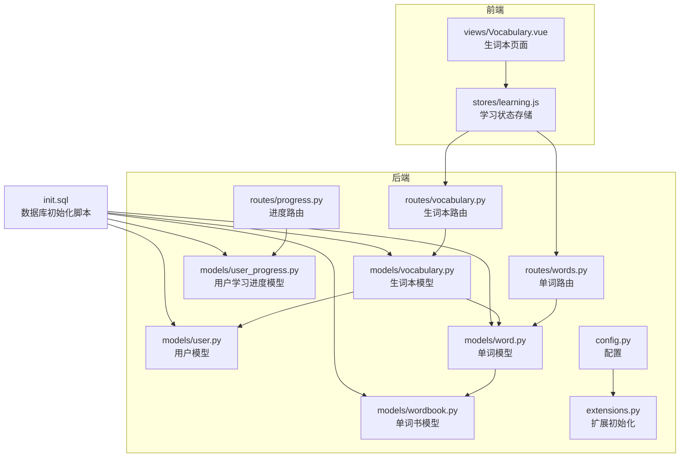
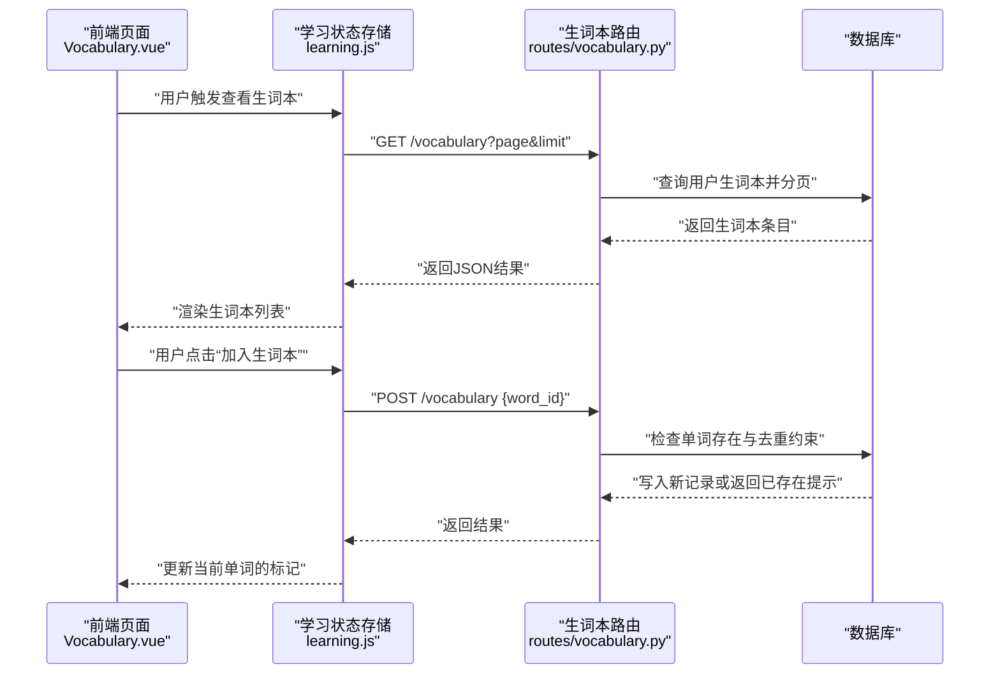
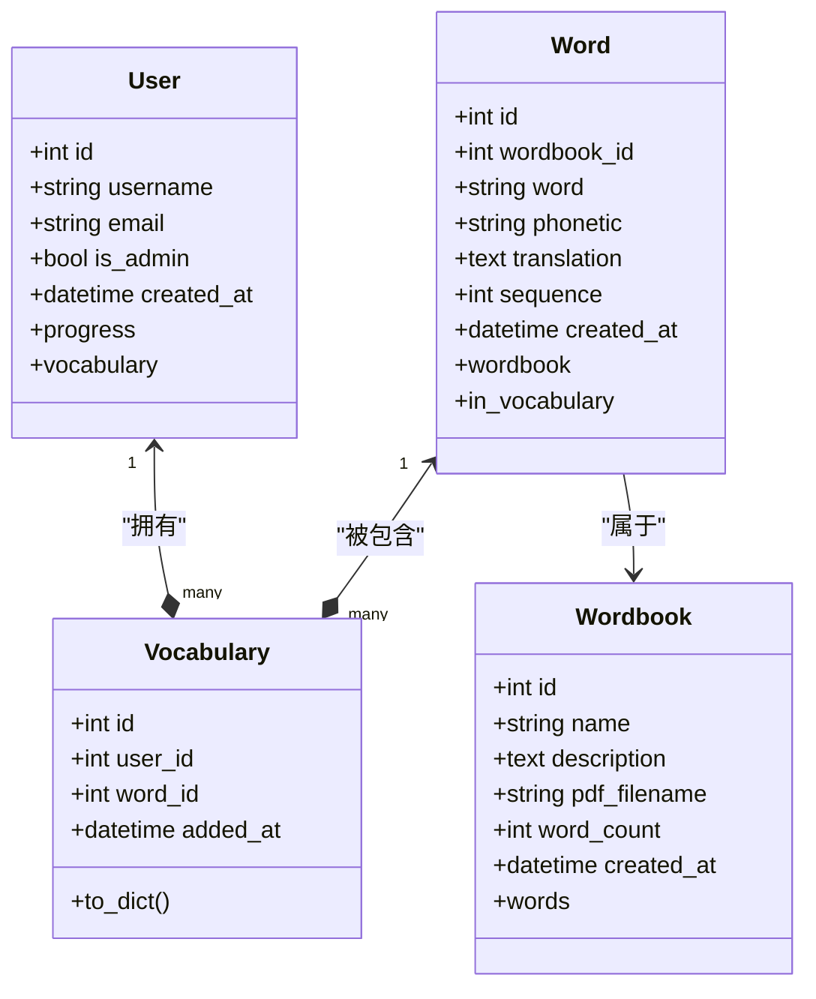
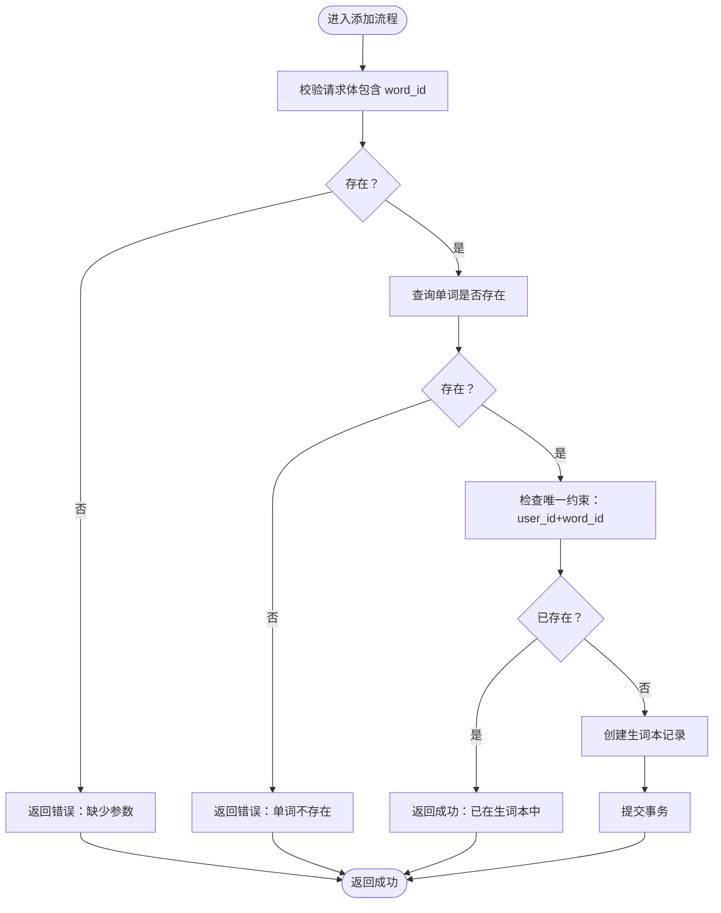
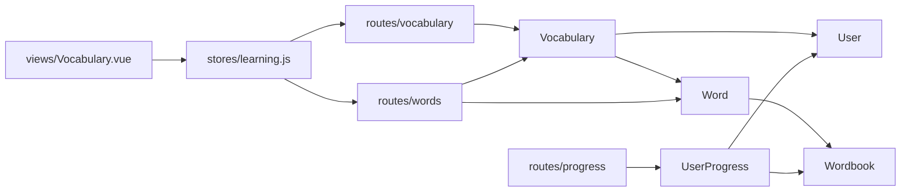

# 生词本模型

<cite>
**本文引用的文件**
- [backend/app/models/vocabulary.py](file://backend/app/models/vocabulary.py)
- [backend/app/models/user.py](file://backend/app/models/user.py)
- [backend/app/models/word.py](file://backend/app/models/word.py)
- [backend/app/models/wordbook.py](file://backend/app/models/wordbook.py)
- [backend/app/models/user_progress.py](file://backend/app/models/user_progress.py)
- [backend/app/routes/vocabulary.py](file://backend/app/routes/vocabulary.py)
- [backend/app/routes/words.py](file://backend/app/routes/words.py)
- [backend/app/routes/progress.py](file://backend/app/routes/progress.py)
- [backend/app/routers/wordbooks.py](file://backend/app/routes/wordbooks.py)
- [backend/app/config.py](file://backend/app/config.py)
- [backend/app/extensions.py](file://backend/app/extensions.py)
- [init.sql](file://init.sql)
- [frontend/src/views/Vocabulary.vue](file://frontend/src/views/Vocabulary.vue)
- [frontend/src/stores/learning.js](file://frontend/src/stores/learning.js)
</cite>

## 目录
1. [简介](#简介)
2. [项目结构](#项目结构)
3. [核心组件](#核心组件)
4. [架构总览](#架构总览)
5. [详细组件分析](#详细组件分析)
6. [依赖关系分析](#依赖关系分析)
7. [性能考虑](#性能考虑)
8. [故障排除指南](#故障排除指南)
9. [结论](#结论)
10. [附录](#附录)

## 简介
本文件系统性阐述“生词本模型”的完整设计，围绕 Vocabulary 数据模型展开，覆盖以下主题：
- 表结构与字段语义：用户ID、单词ID、添加时间等
- 多对多关系设计：生词本与用户、单词之间的关联
- 管理功能：添加、删除、分页查询、按单词书筛选
- 去重机制与重复添加处理
- 复习提醒与遗忘曲线支持现状
- 在个性化学习中的核心价值与应用场景

## 项目结构
后端采用 Flask + SQLAlchemy 架构，模型层位于 backend/app/models，路由层位于 backend/app/routes，前端使用 Vue 3 + Pinia。数据库初始化脚本定义了核心表及约束。

图表来源
- [backend/app/models/vocabulary.py](file://backend/app/models/vocabulary.py#L1-L26)
- [backend/app/models/user.py](file://backend/app/models/user.py#L1-L26)
- [backend/app/models/word.py](file://backend/app/models/word.py#L1-L29)
- [backend/app/models/wordbook.py](file://backend/app/models/wordbook.py#L1-L25)
- [backend/app/models/user_progress.py](file://backend/app/models/user_progress.py#L1-L29)
- [backend/app/routes/vocabulary.py](file://backend/app/routes/vocabulary.py#L1-L103)
- [backend/app/routes/words.py](file://backend/app/routes/words.py#L1-L65)
- [backend/app/routes/progress.py](file://backend/app/routes/progress.py#L1-L115)
- [backend/app/config.py](file://backend/app/config.py#L1-L28)
- [backend/app/extensions.py](file://backend/app/extensions.py#L1-L10)
- [init.sql](file://init.sql#L1-L67)
- [frontend/src/views/Vocabulary.vue](file://frontend/src/views/Vocabulary.vue#L1-L207)
- [frontend/src/stores/learning.js](file://frontend/src/stores/learning.js#L1-L112)

章节来源
- [backend/app/models/vocabulary.py](file://backend/app/models/vocabulary.py#L1-L26)
- [backend/app/models/user.py](file://backend/app/models/user.py#L1-L26)
- [backend/app/models/word.py](file://backend/app/models/word.py#L1-L29)
- [backend/app/models/wordbook.py](file://backend/app/models/wordbook.py#L1-L25)
- [backend/app/models/user_progress.py](file://backend/app/models/user_progress.py#L1-L29)
- [backend/app/routes/vocabulary.py](file://backend/app/routes/vocabulary.py#L1-L103)
- [backend/app/routes/words.py](file://backend/app/routes/words.py#L1-L65)
- [backend/app/routes/progress.py](file://backend/app/routes/progress.py#L1-L115)
- [backend/app/config.py](file://backend/app/config.py#L1-L28)
- [backend/app/extensions.py](file://backend/app/extensions.py#L1-L10)
- [init.sql](file://init.sql#L1-L67)
- [frontend/src/views/Vocabulary.vue](file://frontend/src/views/Vocabulary.vue#L1-L207)
- [frontend/src/stores/learning.js](file://frontend/src/stores/learning.js#L1-L112)

## 核心组件
- 生词本模型 Vocabulary：承载用户与单词的关联，记录添加时间，并提供序列化方法
- 用户模型 User：提供用户与生词本的反向关系
- 单词模型 Word：承载单词书内的顺序与翻译等信息
- 单词书模型 Wordbook：承载单词书元数据与单词集合
- 学习进度模型 UserProgress：记录用户在单词书中的学习进度
- 路由模块：提供生词本的增删查接口，以及单词与进度相关接口

章节来源
- [backend/app/models/vocabulary.py](file://backend/app/models/vocabulary.py#L1-L26)
- [backend/app/models/user.py](file://backend/app/models/user.py#L1-L26)
- [backend/app/models/word.py](file://backend/app/models/word.py#L1-L29)
- [backend/app/models/wordbook.py](file://backend/app/models/wordbook.py#L1-L25)
- [backend/app/models/user_progress.py](file://backend/app/models/user_progress.py#L1-L29)
- [backend/app/routes/vocabulary.py](file://backend/app/routes/vocabulary.py#L1-L103)
- [backend/app/routes/words.py](file://backend/app/routes/words.py#L1-L65)
- [backend/app/routes/progress.py](file://backend/app/routes/progress.py#L1-L115)

## 架构总览
生词本模型在系统中的职责是维护“用户-单词”这一多对多关系的中间表，同时通过外键约束与唯一约束实现去重与完整性控制。前端通过学习状态存储调用后端接口完成生词本的增删与查看。

图表来源
- [frontend/src/views/Vocabulary.vue](file://frontend/src/views/Vocabulary.vue#L1-L207)
- [frontend/src/stores/learning.js](file://frontend/src/stores/learning.js#L1-L112)
- [backend/app/routes/vocabulary.py](file://backend/app/routes/vocabulary.py#L1-L103)

## 详细组件分析

### 生词本模型 Vocabulary 设计
- 表名与主键：使用自增主键 id
- 外键关系：
  - user_id 引用 users.id
  - word_id 引用 words.id
- 唯一约束：联合唯一约束 (user_id, word_id)，确保同一用户不能重复添加同一单词
- 时间字段：added_at 记录添加时间，默认为当前 UTC 时间
- 反向关系：与 Word 的 backref 名称为 in_vocabulary；与 User 的 backref 名称为 vocabulary
- 序列化方法 to_dict：输出 id、user_id、word_id、added_at 以及嵌套的 word 字典

图表来源
- [backend/app/models/vocabulary.py](file://backend/app/models/vocabulary.py#L1-L26)
- [backend/app/models/user.py](file://backend/app/models/user.py#L1-L26)
- [backend/app/models/word.py](file://backend/app/models/word.py#L1-L29)
- [backend/app/models/wordbook.py](file://backend/app/models/wordbook.py#L1-L25)

章节来源
- [backend/app/models/vocabulary.py](file://backend/app/models/vocabulary.py#L1-L26)
- [init.sql](file://init.sql#L56-L66)

### 字段结构与语义
- id：生词本记录的唯一标识
- user_id：所属用户的标识，用于隔离不同用户的生词本
- word_id：所关联单词的标识
- added_at：记录添加到生词本的时间戳
- 嵌套字段 word：包含单词的英文、音标、翻译、序号等信息

章节来源
- [backend/app/models/vocabulary.py](file://backend/app/models/vocabulary.py#L7-L25)

### 多对多关系设计
- 用户与单词的关系通过 Vocabulary 作为中间表实现：
  - User 与 Vocabulary：一对多（一个用户可有多条生词本记录）
  - Word 与 Vocabulary：一对多（一个单词可出现在多个用户的生词本中）
- 唯一约束确保中间表的去重特性，避免重复添加

章节来源
- [backend/app/models/vocabulary.py](file://backend/app/models/vocabulary.py#L8-L14)
- [init.sql](file://init.sql#L62-L64)

### 管理功能
- 查询生词本
  - 支持分页参数 page、limit
  - 支持按单词书过滤 wordbook_id
  - 按添加时间倒序排列
- 添加单词到生词本
  - 校验请求体包含 word_id
  - 校验单词存在性
  - 基于唯一约束自动去重，若已存在则返回成功但提示已存在
- 从生词本移除
  - 支持按生词本记录 ID 删除
  - 支持按单词 ID 删除（通过单词表关联）

图表来源
- [backend/app/routes/vocabulary.py](file://backend/app/routes/vocabulary.py#L44-L71)

章节来源
- [backend/app/routes/vocabulary.py](file://backend/app/routes/vocabulary.py#L10-L41)
- [backend/app/routes/vocabulary.py](file://backend/app/routes/vocabulary.py#L44-L71)
- [backend/app/routes/vocabulary.py](file://backend/app/routes/vocabulary.py#L73-L103)

### 去重机制与重复添加处理
- 数据层：唯一约束 (user_id, word_id) 保证不会出现重复记录
- 业务层：当重复添加时，接口直接返回成功并提示“已在生词本中”，避免异常或重复插入

章节来源
- [backend/app/models/vocabulary.py](file://backend/app/models/vocabulary.py#L12-L14)
- [backend/app/routes/vocabulary.py](file://backend/app/routes/vocabulary.py#L61-L64)
- [init.sql](file://init.sql#L64)

### 复习提醒与遗忘曲线支持
- 当前实现
  - 生词本模型不包含复习状态字段
  - 学习进度模型 UserProgress 记录用户在单词书中的学习进度，但不包含复习提醒或遗忘曲线计算
- 建议扩展
  - 在 Vocabulary 或新增复习计划表中增加复习状态、下次复习时间、间隔天数等字段
  - 结合 UserProgress 的 last_learn_time 推导复习节奏
  - 引入基于遗忘曲线的复习调度算法（如艾宾浩斯遗忘曲线），在后端定时任务或前端提醒中实现

章节来源
- [backend/app/models/user_progress.py](file://backend/app/models/user_progress.py#L1-L29)
- [backend/app/routes/progress.py](file://backend/app/routes/progress.py#L1-L115)

### 个性化学习中的核心价值与应用
- 价值
  - 以“用户-单词”为中心的可定制学习空间，便于用户集中复习重点词汇
  - 与单词书结合，支持按主题或教材进行分组学习
- 应用场景
  - 课后巩固：在学习过程中一键加入生词本
  - 针对性复习：按添加时间或单词书筛选生词本进行高效复习
  - 学习追踪：结合学习进度，形成“学—记—复”的闭环

章节来源
- [frontend/src/views/Vocabulary.vue](file://frontend/src/views/Vocabulary.vue#L1-L207)
- [frontend/src/stores/learning.js](file://frontend/src/stores/learning.js#L1-L112)
- [backend/app/routes/words.py](file://backend/app/routes/words.py#L28-L35)

## 依赖关系分析
- 模型间依赖
  - Vocabulary 依赖 User 与 Word
  - Word 依赖 Wordbook
  - UserProgress 依赖 User 与 Wordbook
- 路由依赖
  - vocabulary 路由依赖 Vocabulary 与 Word
  - words 路由依赖 Word 与 Vocabulary
  - progress 路由依赖 UserProgress 与 Wordbook
- 前端依赖
  - Vocabulary 页面依赖学习状态存储
  - 学习状态存储依赖 vocabulary 与 words 路由

图表来源
- [backend/app/models/vocabulary.py](file://backend/app/models/vocabulary.py#L1-L26)
- [backend/app/models/user.py](file://backend/app/models/user.py#L1-L26)
- [backend/app/models/word.py](file://backend/app/models/word.py#L1-L29)
- [backend/app/models/wordbook.py](file://backend/app/models/wordbook.py#L1-L25)
- [backend/app/models/user_progress.py](file://backend/app/models/user_progress.py#L1-L29)
- [backend/app/routes/vocabulary.py](file://backend/app/routes/vocabulary.py#L1-L103)
- [backend/app/routes/words.py](file://backend/app/routes/words.py#L1-L65)
- [backend/app/routes/progress.py](file://backend/app/routes/progress.py#L1-L115)
- [frontend/src/views/Vocabulary.vue](file://frontend/src/views/Vocabulary.vue#L1-L207)
- [frontend/src/stores/learning.js](file://frontend/src/stores/learning.js#L1-L112)

章节来源
- [backend/app/models/vocabulary.py](file://backend/app/models/vocabulary.py#L1-L26)
- [backend/app/models/user.py](file://backend/app/models/user.py#L1-L26)
- [backend/app/models/word.py](file://backend/app/models/word.py#L1-L29)
- [backend/app/models/wordbook.py](file://backend/app/models/wordbook.py#L1-L25)
- [backend/app/models/user_progress.py](file://backend/app/models/user_progress.py#L1-L29)
- [backend/app/routes/vocabulary.py](file://backend/app/routes/vocabulary.py#L1-L103)
- [backend/app/routes/words.py](file://backend/app/routes/words.py#L1-L65)
- [backend/app/routes/progress.py](file://backend/app/routes/progress.py#L1-L115)
- [frontend/src/views/Vocabulary.vue](file://frontend/src/views/Vocabulary.vue#L1-L207)
- [frontend/src/stores/learning.js](file://frontend/src/stores/learning.js#L1-L112)

## 性能考虑
- 查询优化
  - 生词本查询按 user_id 进行过滤，并按添加时间倒序，建议在 user_id 上建立索引（已由唯一约束隐含索引）
  - 支持按单词书过滤时进行 JOIN，建议在 words.wordbook_id 上保持索引
- 写入优化
  - 唯一约束在插入前即能拦截重复，减少无效写入
  - 批量导入单词书时使用 flush 后批量插入单词，降低事务开销
- 前端分页
  - 默认每页 20 条，避免一次性传输大量数据

章节来源
- [backend/app/routes/vocabulary.py](file://backend/app/routes/vocabulary.py#L16-L26)
- [backend/app/routes/wordbooks.py](file://backend/app/routes/wordbooks.py#L111-L121)
- [init.sql](file://init.sql#L64-L65)

## 故障排除指南
- 添加生词本失败
  - 检查请求体是否包含 word_id
  - 确认单词是否存在
  - 若提示“已在生词本中”，表示重复添加，属正常行为
- 删除生词本失败
  - 确认传入的 ID 属于当前用户
  - 确认单词 ID 对应的记录确实存在于当前用户的生词本中
- 查询为空
  - 检查分页参数 page、limit 是否合理
  - 如按单词书筛选，请确认单词书 ID 正确且用户有对应权限

章节来源
- [backend/app/routes/vocabulary.py](file://backend/app/routes/vocabulary.py#L51-L70)
- [backend/app/routes/vocabulary.py](file://backend/app/routes/vocabulary.py#L79-L86)
- [backend/app/routes/vocabulary.py](file://backend/app/routes/vocabulary.py#L95-L97)

## 结论
生词本模型以简洁的数据结构实现了“用户-单词”的去重关联，配合路由层的增删查与前端交互，形成了完整的个性化学习入口。当前版本侧重基础能力，后续可在复习提醒与遗忘曲线方面进行增强，以进一步提升记忆效率与学习体验。

## 附录
- 数据库初始化脚本定义了 users、wordbooks、words、user_progress、vocabulary 等核心表及其索引与约束
- 配置文件提供了数据库连接、JWT 密钥与上传目录等运行时参数
- 扩展初始化文件统一注册 SQLAlchemy、JWT、CORS、Bcrypt

章节来源
- [init.sql](file://init.sql#L1-L67)
- [backend/app/config.py](file://backend/app/config.py#L1-L28)
- [backend/app/extensions.py](file://backend/app/extensions.py#L1-L10)