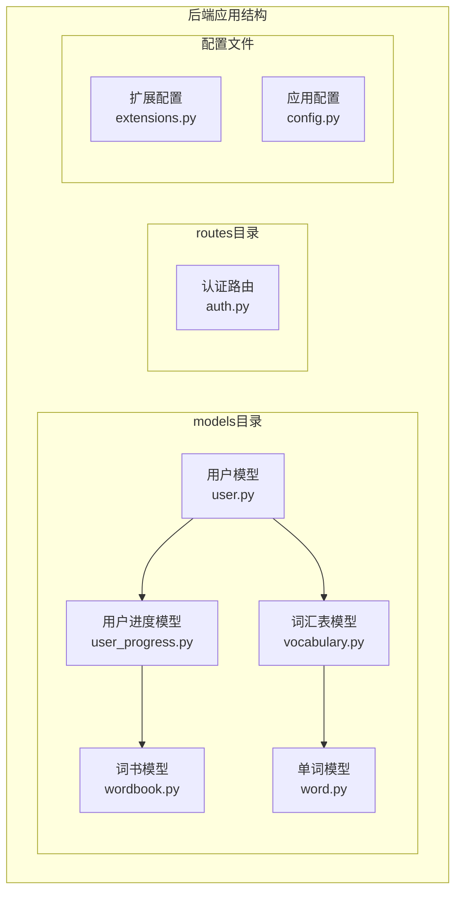
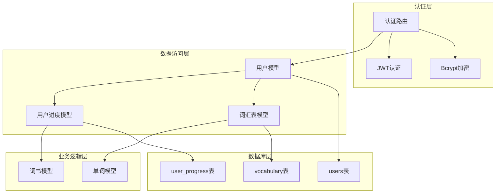
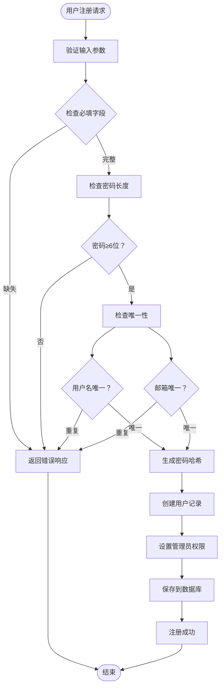
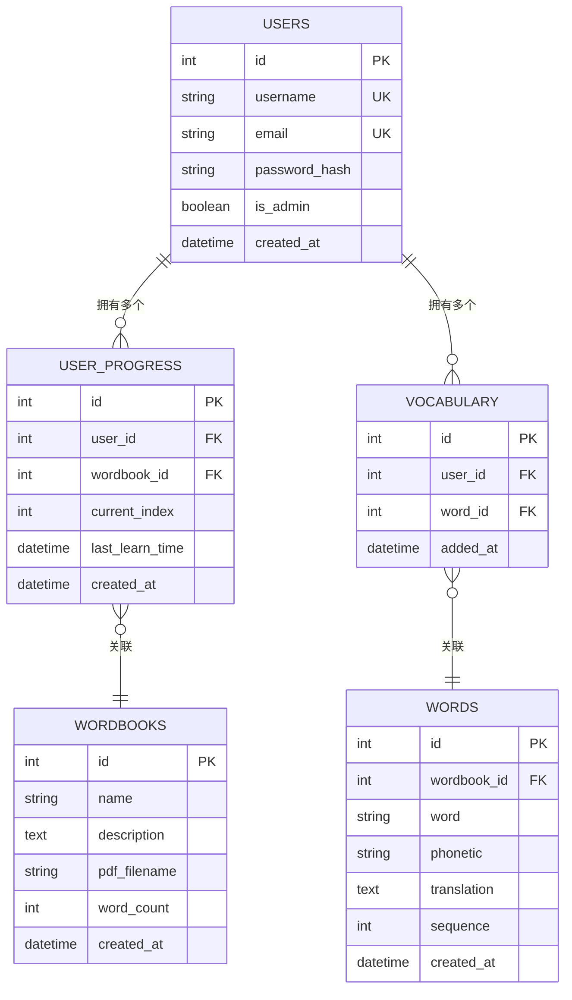
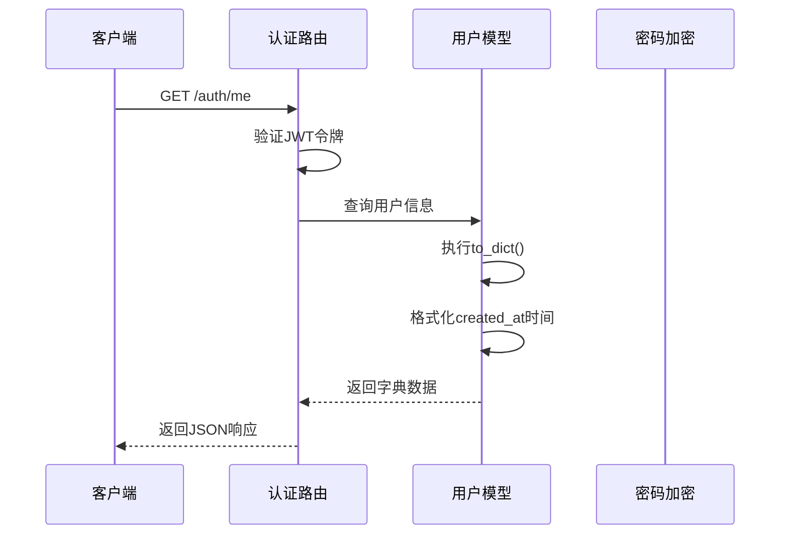
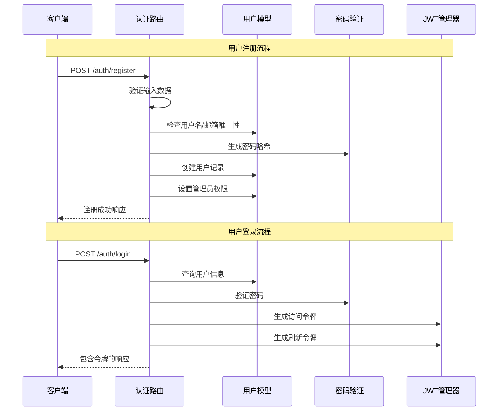
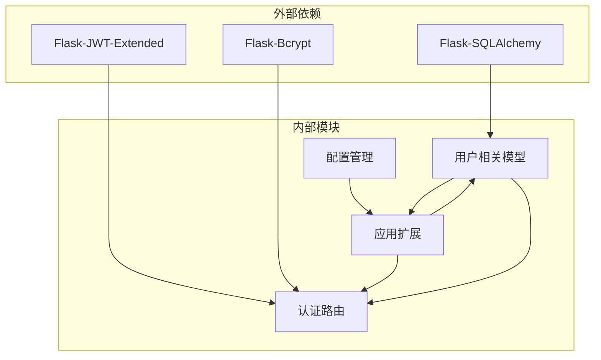

# 用户模型

<cite>
**本文档引用的文件**
- [backend/app/models/user.py](file://backend/app/models/user.py)
- [backend/app/models/user_progress.py](file://backend/app/models/user_progress.py)
- [backend/app/models/vocabulary.py](file://backend/app/models/vocabulary.py)
- [backend/app/models/word.py](file://backend/app/models/word.py)
- [backend/app/models/wordbook.py](file://backend/app/models/wordbook.py)
- [backend/app/routes/auth.py](file://backend/app/routes/auth.py)
- [backend/app/extensions.py](file://backend/app/extensions.py)
- [backend/app/config.py](file://backend/app/config.py)
- [backend/app/models/__init__.py](file://backend/app/models/__init__.py)
</cite>

## 目录
1. [简介](#简介)
2. [项目结构](#项目结构)
3. [核心组件](#核心组件)
4. [架构概览](#架构概览)
5. [详细组件分析](#详细组件分析)
6. [依赖关系分析](#依赖关系分析)
7. [性能考虑](#性能考虑)
8. [故障排除指南](#故障排除指南)
9. [结论](#结论)

## 简介

用户模型是单词学习网站后端系统的核心数据模型之一，负责管理用户账户信息、认证授权以及用户相关的学习进度数据。该模型采用Flask-SQLAlchemy框架实现，提供了完整的用户数据持久化、关系映射和序列化功能。

本模型不仅存储基本的用户信息，还通过外键关系与用户学习进度模型和词汇表模型建立了紧密的数据关联，形成了完整的用户学习生态系统。

## 项目结构

用户模型位于后端应用的models目录中，采用模块化设计，每个模型文件独立管理特定的数据实体。

**图表来源**
- [backend/app/models/user.py](file://backend/app/models/user.py#L1-L26)
- [backend/app/models/user_progress.py](file://backend/app/models/user_progress.py#L1-L29)
- [backend/app/models/vocabulary.py](file://backend/app/models/vocabulary.py#L1-L26)

**章节来源**
- [backend/app/models/__init__.py](file://backend/app/models/__init__.py#L1-L6)
- [backend/app/models/user.py](file://backend/app/models/user.py#L1-L26)

## 核心组件

用户模型作为系统的核心数据实体，承担着以下关键职责：

### 数据模型定义
- **用户基本信息管理**：用户名、邮箱、密码哈希等基础信息
- **权限控制**：管理员权限标识
- **时间戳管理**：创建时间记录
- **关系映射**：与用户进度和词汇表的关联关系

### 序列化机制
- **to_dict方法**：提供JSON序列化支持
- **数据格式化**：时间字段的ISO格式转换

### 安全特性
- **密码哈希存储**：使用Bcrypt进行密码加密
- **唯一性约束**：用户名和邮箱的唯一性保证
- **认证集成**：与JWT认证系统的无缝集成

**章节来源**
- [backend/app/models/user.py](file://backend/app/models/user.py#L4-L26)
- [backend/app/routes/auth.py](file://backend/app/routes/auth.py#L8-L44)

## 架构概览

用户模型在整个系统架构中扮演着中心枢纽的角色，连接着认证系统、学习进度管理和词汇学习功能。

**图表来源**
- [backend/app/routes/auth.py](file://backend/app/routes/auth.py#L1-L93)
- [backend/app/models/user.py](file://backend/app/models/user.py#L4-L16)
- [backend/app/models/user_progress.py](file://backend/app/models/user_progress.py#L4-L19)
- [backend/app/models/vocabulary.py](file://backend/app/models/vocabulary.py#L4-L16)

## 详细组件分析

### 用户模型字段定义

用户模型包含以下核心字段，每个字段都经过精心设计以满足业务需求和安全要求：

#### 基础字段

| 字段名 | 数据类型 | 约束条件 | 业务含义 | 默认值 |
|--------|----------|----------|----------|--------|
| id | Integer | 主键、自增 | 用户唯一标识符 | 自动分配 |
| username | String(50) | 唯一、非空 | 用户登录名称 | 无 |
| email | String(100) | 唯一、非空 | 用户联系邮箱 | 无 |
| password_hash | String(255) | 非空 | 加密后的用户密码 | 无 |

#### 权限和元数据字段

| 字段名 | 数据类型 | 约束条件 | 业务含义 | 默认值 |
|--------|----------|----------|----------|--------|
| is_admin | Boolean | 可选 | 管理员权限标识 | False |
| created_at | DateTime | 可选 | 账户创建时间 | 当前UTC时间 |

#### 关系字段

用户模型通过以下关系与其它模型建立关联：

1. **一对一关系**：与UserProgress的关联
2. **一对多关系**：与Vocabulary的关联

**章节来源**
- [backend/app/models/user.py](file://backend/app/models/user.py#L7-L16)

### 字段约束和验证规则

#### 数据完整性约束

所有字段都遵循严格的数据完整性规则：

- **主键约束**：id字段自动递增，确保每条记录的唯一性
- **唯一性约束**：username和email字段在数据库层面强制唯一
- **非空约束**：用户名、邮箱和密码哈希字段不允许为空
- **长度限制**：字符串字段设置了合理的长度上限

#### 业务规则验证

在应用层实现了额外的验证逻辑：

**图表来源**
- [backend/app/routes/auth.py](file://backend/app/routes/auth.py#L8-L44)

**章节来源**
- [backend/app/routes/auth.py](file://backend/app/routes/auth.py#L15-L31)

### 关系设计和数据模型

用户模型与其它模型之间的关系设计体现了清晰的层次结构：

**图表来源**
- [backend/app/models/user.py](file://backend/app/models/user.py#L14-L16)
- [backend/app/models/user_progress.py](file://backend/app/models/user_progress.py#L8-L9)
- [backend/app/models/vocabulary.py](file://backend/app/models/vocabulary.py#L8-L9)

#### 关系特性说明

1. **用户-进度关系**：
   - 一对多关系：一个用户可以有多个学习进度记录
   - 外键约束：user_id强制引用users表的id字段
   - 唯一约束：user_id和wordbook_id组合唯一

2. **用户-词汇关系**：
   - 一对多关系：一个用户可以有多个词汇记录
   - 外键约束：user_id强制引用users表的id字段
   - 唯一约束：user_id和word_id组合唯一

3. **词汇-单词关系**：
   - 多对一关系：多个词汇记录指向同一个单词
   - 外键约束：word_id强制引用words表的id字段

**章节来源**
- [backend/app/models/user_progress.py](file://backend/app/models/user_progress.py#L14-L17)
- [backend/app/models/vocabulary.py](file://backend/app/models/vocabulary.py#L12-L14)

### 序列化逻辑

用户模型提供了to_dict方法，用于将对象状态转换为字典格式，便于API响应和前端处理：

#### 序列化字段映射

| 对象属性 | JSON键名 | 数据类型 | 处理方式 |
|----------|----------|----------|----------|
| id | id | 整数 | 直接映射 |
| username | username | 字符串 | 直接映射 |
| email | email | 字符串 | 直接映射 |
| is_admin | is_admin | 布尔值 | 直接映射 |
| created_at | created_at | ISO格式字符串 | 时间格式化 |

#### 序列化流程

**图表来源**
- [backend/app/routes/auth.py](file://backend/app/routes/auth.py#L83-L92)
- [backend/app/models/user.py](file://backend/app/models/user.py#L18-L25)

**章节来源**
- [backend/app/models/user.py](file://backend/app/models/user.py#L18-L25)

### 安全考虑和最佳实践

#### 密码安全管理

1. **密码哈希存储**：
   - 使用Bcrypt算法进行单向哈希
   - 防止明文密码存储
   - 提供盐值随机化保护

2. **认证流程**：
   - JWT令牌过期时间控制
   - 刷新令牌机制
   - 安全的密钥管理

#### 数据验证策略

1. **输入验证**：
   - 必填字段检查
   - 密码长度验证
   - 唯一性冲突检测

2. **权限控制**：
   - 管理员权限初始化
   - 用户数据隔离
   - 最小权限原则

**章节来源**
- [backend/app/routes/auth.py](file://backend/app/routes/auth.py#L33-L43)
- [backend/app/config.py](file://backend/app/config.py#L20-L23)

### 认证系统集成

用户模型深度集成了Flask-JWT Extended认证系统：

#### 认证流程

**图表来源**
- [backend/app/routes/auth.py](file://backend/app/routes/auth.py#L8-L72)
- [backend/app/extensions.py](file://backend/app/extensions.py#L1-L10)

#### 使用示例

用户模型在认证系统中的典型使用场景：

1. **用户注册**：
   - 输入验证和唯一性检查
   - 密码哈希生成
   - 管理员权限设置

2. **用户登录**：
   - 凭据验证
   - 令牌生成
   - 用户信息返回

3. **用户信息获取**：
   - JWT身份验证
   - 用户数据查询
   - 序列化输出

**章节来源**
- [backend/app/routes/auth.py](file://backend/app/routes/auth.py#L8-L92)

## 依赖关系分析

用户模型的依赖关系体现了清晰的分层架构设计：

**图表来源**
- [backend/app/extensions.py](file://backend/app/extensions.py#L1-L10)
- [backend/app/models/user.py](file://backend/app/models/user.py#L1-L2)
- [backend/app/routes/auth.py](file://backend/app/routes/auth.py#L1-L4)

### 模块间耦合度分析

用户模型具有适中的耦合度：

- **低耦合优势**：与具体业务逻辑分离
- **适度依赖**：与认证系统的集成
- **可测试性**：清晰的接口定义

**章节来源**
- [backend/app/models/__init__.py](file://backend/app/models/__init__.py#L1-L6)

## 性能考虑

### 数据库优化策略

1. **索引设计**：
   - 用户名和邮箱的唯一索引
   - 复合索引优化查询性能

2. **查询优化**：
   - 关系查询的懒加载策略
   - 批量操作支持

3. **内存管理**：
   - 动态关系加载
   - 序列化时的时间格式化

### 缓存策略建议

虽然当前实现未包含缓存层，但可以考虑：

- 用户信息的短期缓存
- 经常访问的统计信息缓存
- JWT令牌的会话缓存

## 故障排除指南

### 常见问题诊断

#### 注册失败问题

**问题症状**：用户注册返回错误

**可能原因**：
1. 用户名或邮箱重复
2. 密码长度不足
3. 数据库连接问题

**解决方案**：
1. 检查用户名和邮箱的唯一性
2. 验证密码长度要求
3. 确认数据库服务状态

#### 登录认证失败

**问题症状**：用户登录返回认证错误

**可能原因**：
1. 邮箱或密码错误
2. JWT配置问题
3. 用户不存在

**解决方案**：
1. 验证用户凭据
2. 检查JWT密钥配置
3. 确认用户账户状态

#### 数据序列化问题

**问题症状**：用户信息返回格式异常

**可能原因**：
1. 时间字段格式化错误
2. 关系数据加载失败
3. 序列化方法异常

**解决方案**：
1. 检查时间字段的ISO格式转换
2. 验证关系数据的正确性
3. 确认序列化方法的完整性

**章节来源**
- [backend/app/routes/auth.py](file://backend/app/routes/auth.py#L12-L43)

## 结论

用户模型作为单词学习网站的核心数据实体，展现了优秀的架构设计和实现质量。其主要特点包括：

### 设计优势

1. **清晰的数据模型**：字段定义明确，约束条件合理
2. **安全的认证集成**：与JWT和Bcrypt的深度集成
3. **良好的关系设计**：与学习进度和词汇表的关联关系
4. **完善的序列化机制**：支持API响应的数据格式化

### 技术特色

1. **模块化设计**：独立的模型文件，职责清晰
2. **依赖注入**：通过扩展模块管理外部依赖
3. **配置管理**：环境变量驱动的配置系统
4. **错误处理**：完整的输入验证和错误响应

### 改进建议

1. **添加更多验证规则**：如邮箱格式验证
2. **增强日志记录**：提供更详细的审计信息
3. **实现软删除**：支持用户数据的软删除功能
4. **添加数据迁移**：支持数据库结构的版本管理

用户模型为整个单词学习系统奠定了坚实的数据基础，其设计原则和实现模式值得在类似项目中借鉴和参考。