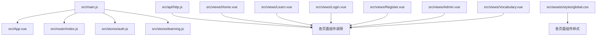
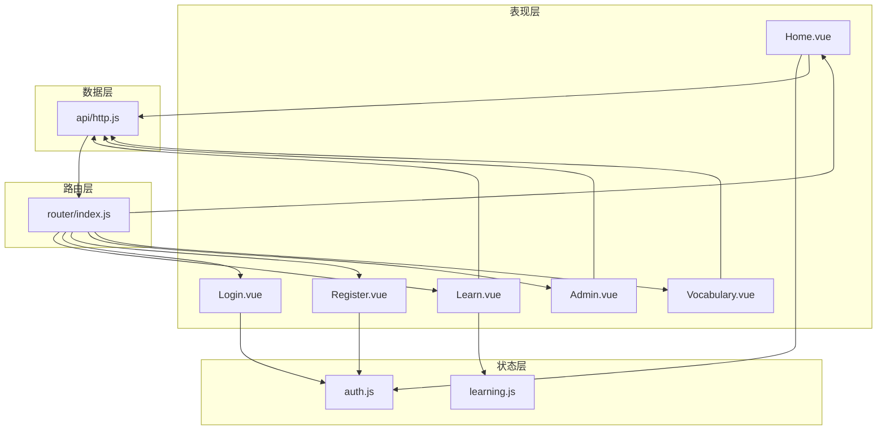
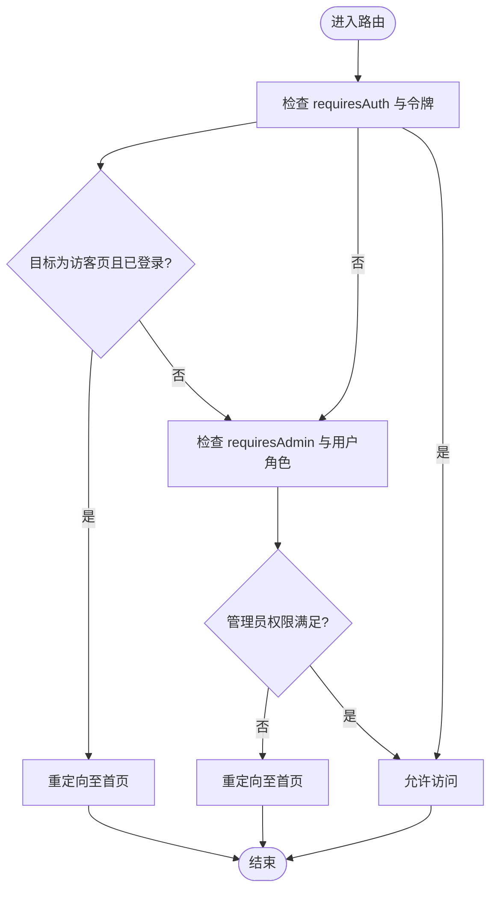
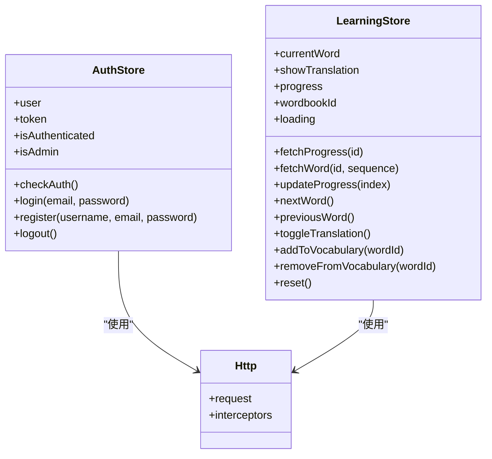
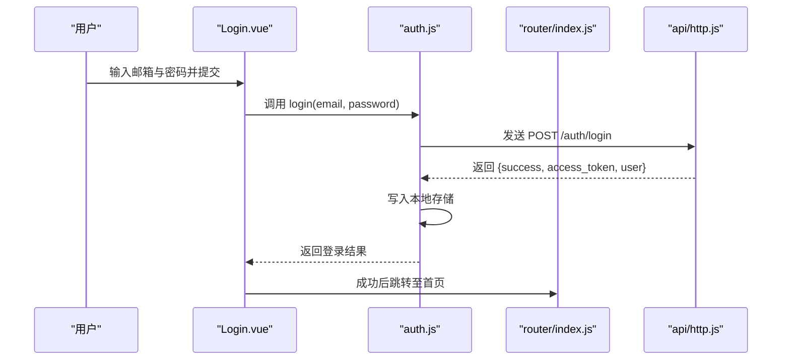
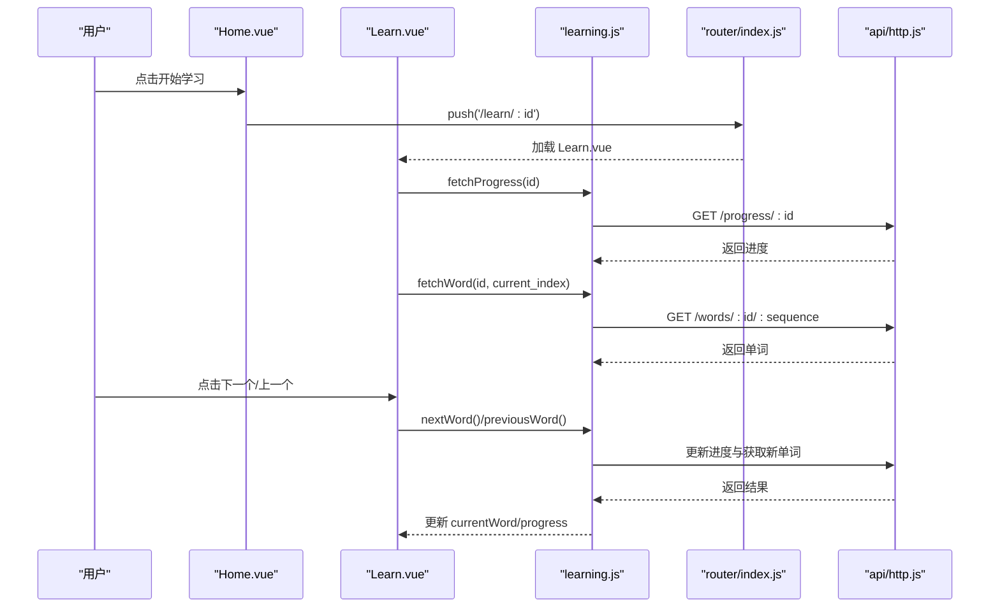
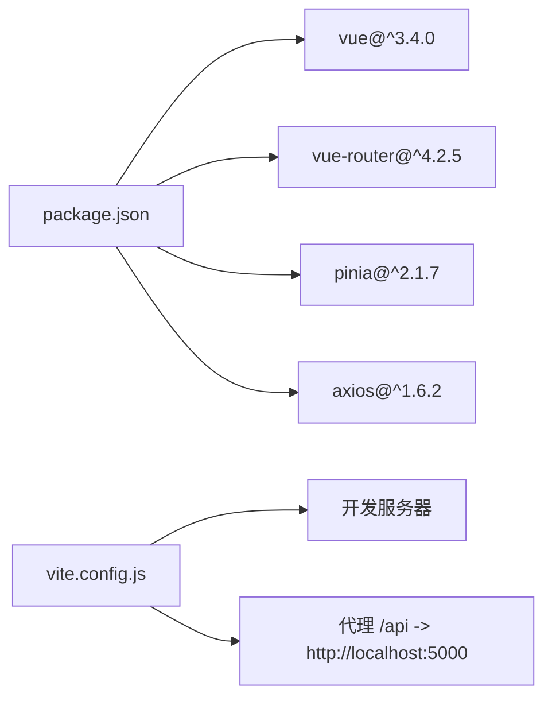

# 前端架构设计

<cite>
**本文档引用的文件**
- [main.js](file://frontend/src/main.js)
- [App.vue](file://frontend/src/App.vue)
- [router/index.js](file://frontend/src/router/index.js)
- [stores/auth.js](file://frontend/src/stores/auth.js)
- [stores/learning.js](file://frontend/src/stores/learning.js)
- [api/http.js](file://frontend/src/api/http.js)
- [views/Home.vue](file://frontend/src/views/Home.vue)
- [views/Learn.vue](file://frontend/src/views/Learn.vue)
- [views/Login.vue](file://frontend/src/views/Login.vue)
- [views/Register.vue](file://frontend/src/views/Register.vue)
- [views/Admin.vue](file://frontend/src/views/Admin.vue)
- [views/Vocabulary.vue](file://frontend/src/views/Vocabulary.vue)
- [assets/styles/global.css](file://frontend/src/assets/styles/global.css)
- [package.json](file://frontend/package.json)
- [vite.config.js](file://frontend/vite.config.js)
</cite>

## 目录
1. [引言](#引言)
2. [项目结构](#项目结构)
3. [核心组件](#核心组件)
4. [架构总览](#架构总览)
5. [详细组件分析](#详细组件分析)
6. [依赖关系分析](#依赖关系分析)
7. [性能考虑](#性能考虑)
8. [故障排除指南](#故障排除指南)
9. [结论](#结论)
10. [附录](#附录)

## 引言
本文件面向 Vue 3 单页应用的前端架构设计，系统性阐述应用的整体设计理念与架构模式。重点覆盖组合式 API 的使用范式（响应式数据、生命周期钩子与逻辑复用）、组件层次结构（根组件职责、页面级组件组织与可复用组件封装）、路由配置策略（路由守卫、动态路由与嵌套路由）、状态管理架构（Pinia Store 模块化、状态持久化与异步数据处理）、组件通信模式（props 传递、事件发射与全局状态共享），并提供前端应用架构图与组件关系图，帮助读者快速理解数据流向与交互模式。

## 项目结构
前端采用基于功能域的目录组织方式，核心目录与职责如下：
- src/main.js：应用入口，挂载根组件并注册插件（Pinia、Router）
- src/App.vue：根组件，承载路由出口与全局初始化逻辑
- src/router/index.js：路由定义与全局前置守卫
- src/stores/*：Pinia Store 模块，分别管理认证与学习状态
- src/api/http.js：HTTP 客户端封装与拦截器
- src/views/*：页面级组件，按业务页面划分
- src/assets/styles/global.css：全局样式与通用组件样式
- vite.config.js：开发服务器与代理配置
- package.json：依赖与脚本定义

图表来源
- [main.js](file://frontend/src/main.js#L1-L13)
- [App.vue](file://frontend/src/App.vue#L1-L17)
- [router/index.js](file://frontend/src/router/index.js#L1-L64)
- [stores/auth.js](file://frontend/src/stores/auth.js#L1-L59)
- [stores/learning.js](file://frontend/src/stores/learning.js#L1-L112)
- [api/http.js](file://frontend/src/api/http.js#L1-L48)
- [views/Home.vue](file://frontend/src/views/Home.vue#L1-L189)
- [views/Learn.vue](file://frontend/src/views/Learn.vue#L1-L342)
- [views/Login.vue](file://frontend/src/views/Login.vue#L1-L116)
- [views/Register.vue](file://frontend/src/views/Register.vue#L1-L151)
- [views/Admin.vue](file://frontend/src/views/Admin.vue#L1-L264)
- [views/Vocabulary.vue](file://frontend/src/views/Vocabulary.vue#L1-L207)
- [assets/styles/global.css](file://frontend/src/assets/styles/global.css#L1-L176)

章节来源
- [main.js](file://frontend/src/main.js#L1-L13)
- [package.json](file://frontend/package.json#L1-L22)
- [vite.config.js](file://frontend/vite.config.js#L1-L16)

## 核心组件
- 应用入口与插件注册：在入口文件中创建应用实例，注册 Pinia 与路由插件，并挂载根组件。
- 根组件职责：承载路由出口；在挂载阶段检查本地存储中的认证信息以恢复登录态。
- 页面级组件：Home（首页）、Learn（学习）、Login/ Register（认证）、Admin（管理）、Vocabulary（生词本）等，每个页面聚焦单一业务场景。
- 可复用组件：通过全局样式与通用组件类名（如 .card、.btn）实现跨页面复用。

章节来源
- [main.js](file://frontend/src/main.js#L1-L13)
- [App.vue](file://frontend/src/App.vue#L1-L17)
- [assets/styles/global.css](file://frontend/src/assets/styles/global.css#L1-L176)

## 架构总览
应用采用“组合式 API + Pinia + Vue Router”的现代前端架构，结合 Axios 封装的 HTTP 客户端与 Vite 开发工具链，形成清晰的分层与职责边界：
- 表现层：Vue 组件负责 UI 渲染与用户交互
- 状态层：Pinia Store 管理全局与局部状态
- 路由层：Vue Router 提供导航与权限控制
- 数据层：Axios 封装统一请求与响应处理
- 基础设施：Vite 提供开发与构建支持

图表来源
- [router/index.js](file://frontend/src/router/index.js#L1-L64)
- [stores/auth.js](file://frontend/src/stores/auth.js#L1-L59)
- [stores/learning.js](file://frontend/src/stores/learning.js#L1-L112)
- [api/http.js](file://frontend/src/api/http.js#L1-L48)
- [views/Home.vue](file://frontend/src/views/Home.vue#L1-L189)
- [views/Learn.vue](file://frontend/src/views/Learn.vue#L1-L342)
- [views/Login.vue](file://frontend/src/views/Login.vue#L1-L116)
- [views/Register.vue](file://frontend/src/views/Register.vue#L1-L151)
- [views/Admin.vue](file://frontend/src/views/Admin.vue#L1-L264)
- [views/Vocabulary.vue](file://frontend/src/views/Vocabulary.vue#L1-L207)

## 详细组件分析

### 组合式 API 使用模式
- 响应式数据管理：使用 ref/computed 管理本地状态与派生状态，如学习页的 currentWord、showTranslation、progress 等。
- 生命周期钩子：在 onMounted/onUnmounted 中执行初始化与清理，如学习页的键盘事件绑定与学习状态重置。
- 逻辑复用机制：将认证与学习相关逻辑抽取为独立 Store，页面组件仅负责 UI 与调度，提升可测试性与可维护性。

章节来源
- [views/Learn.vue](file://frontend/src/views/Learn.vue#L106-L198)
- [stores/learning.js](file://frontend/src/stores/learning.js#L1-L112)

### 组件层次结构设计
- 根组件 App.vue：承载路由出口并在挂载时检查认证状态，确保应用启动即具备正确的登录态。
- 页面级组件组织：按业务领域拆分页面，每个页面组件自包含模板、脚本与样式，便于独立演进。
- 可复用组件封装：通过全局样式类（如 .card、.btn）与语义化标签实现跨页面复用，减少重复代码。

章节来源
- [App.vue](file://frontend/src/App.vue#L1-L17)
- [assets/styles/global.css](file://frontend/src/assets/styles/global.css#L1-L176)

### 路由配置策略
- 路由定义：采用 createRouter + createWebHistory，定义登录、注册、首页、学习详情、生词本、管理后台等路由。
- 动态路由：学习页使用动态参数 :id 实现单词书 ID 的传递。
- 嵌套路由：当前路由未显式声明嵌套关系，但可通过子路由扩展实现更复杂的页面层级。
- 路由守卫：在 beforeEach 中根据 meta 字段与本地存储令牌进行鉴权与访客限制，管理员权限通过用户属性判断。

图表来源
- [router/index.js](file://frontend/src/router/index.js#L48-L61)

章节来源
- [router/index.js](file://frontend/src/router/index.js#L1-L64)

### 状态管理架构（Pinia Store）
- 模块化设计：auth.js 管理认证态与用户信息，learning.js 管理学习过程中的单词、进度与交互状态。
- 状态持久化：登录成功后将令牌与用户信息写入本地存储；应用启动时读取本地存储恢复状态。
- 异步数据处理：Store 内部封装 API 调用，集中处理 loading、错误与结果更新，页面组件仅消费状态与触发动作。

图表来源
- [stores/auth.js](file://frontend/src/stores/auth.js#L1-L59)
- [stores/learning.js](file://frontend/src/stores/learning.js#L1-L112)
- [api/http.js](file://frontend/src/api/http.js#L1-L48)

章节来源
- [stores/auth.js](file://frontend/src/stores/auth.js#L1-L59)
- [stores/learning.js](file://frontend/src/stores/learning.js#L1-L112)

### 组件通信模式
- Props 传递：页面组件通过路由参数接收动态 ID（如学习页的单词书 ID），并通过计算属性或本地状态与 Store 共享数据。
- 事件发射：组件通过按钮点击、键盘事件等触发方法，调用 Store 或路由方法，实现状态变更与页面跳转。
- 全局状态共享：通过 Pinia Store 在多个页面间共享认证与学习状态，避免跨层级传递带来的复杂性。

章节来源
- [views/Learn.vue](file://frontend/src/views/Learn.vue#L106-L198)
- [views/Home.vue](file://frontend/src/views/Home.vue#L65-L108)

### 关键流程示例：登录与学习流程

#### 登录流程序列图

图表来源
- [views/Login.vue](file://frontend/src/views/Login.vue#L57-L71)
- [stores/auth.js](file://frontend/src/stores/auth.js#L22-L34)
- [router/index.js](file://frontend/src/router/index.js#L64-L64)
- [api/http.js](file://frontend/src/api/http.js#L1-L48)

#### 学习流程序列图

图表来源
- [views/Home.vue](file://frontend/src/views/Home.vue#L100-L102)
- [views/Learn.vue](file://frontend/src/views/Learn.vue#L123-L198)
- [stores/learning.js](file://frontend/src/stores/learning.js#L16-L86)
- [router/index.js](file://frontend/src/router/index.js#L23-L27)
- [api/http.js](file://frontend/src/api/http.js#L1-L48)

## 依赖关系分析
- 框架与工具：Vue 3、Vue Router、Pinia、Axios、Vite
- 开发与运行：Vite 提供开发服务器与代理，将 /api 请求转发至后端服务
- 插件注册：在入口文件中统一注册路由与状态管理插件

图表来源
- [package.json](file://frontend/package.json#L11-L20)
- [vite.config.js](file://frontend/vite.config.js#L4-L15)

章节来源
- [package.json](file://frontend/package.json#L1-L22)
- [vite.config.js](file://frontend/vite.config.js#L1-L16)

## 性能考虑
- 懒加载路由：路由组件采用动态导入，减少首屏包体积
- 局部状态与计算属性：通过 computed 与局部 ref 避免不必要的重渲染
- 请求拦截与错误处理：统一在 HTTP 客户端处理 401 等错误，减少页面重复逻辑
- 键盘事件清理：在组件卸载时移除事件监听，防止内存泄漏

## 故障排除指南
- 登录后无法访问受保护页面：检查路由守卫是否正确读取本地存储中的令牌与用户信息
- 学习页空白或加载异常：确认 Store 的 fetchWord/fetchProgress 是否正确调用并更新状态
- 生词本分页异常：检查分页参数与总数计算逻辑
- 上传失败：确认表单数据构造与 Content-Type 设置，以及后端接口路径

章节来源
- [router/index.js](file://frontend/src/router/index.js#L48-L61)
- [stores/learning.js](file://frontend/src/stores/learning.js#L16-L86)
- [views/Vocabulary.vue](file://frontend/src/views/Vocabulary.vue#L95-L129)
- [views/Admin.vue](file://frontend/src/views/Admin.vue#L146-L180)

## 结论
该前端架构以组合式 API 为核心，配合 Pinia 实现清晰的状态管理，借助 Vue Router 提供灵活的路由与权限控制，并通过 Axios 封装统一处理网络请求。页面组件围绕单一职责组织，逻辑复用通过 Store 实现，整体结构清晰、易于扩展与维护。建议后续可在路由层面引入嵌套路由与路由懒加载策略进一步优化性能与体验。

## 附录
- 开发与构建命令：dev、build、preview
- 开发服务器端口：3000，代理 /api 到后端服务
- 全局样式：提供通用按钮、卡片、表单与页面头部等基础样式

章节来源
- [package.json](file://frontend/package.json#L6-L10)
- [vite.config.js](file://frontend/vite.config.js#L6-L14)
- [assets/styles/global.css](file://frontend/src/assets/styles/global.css#L1-L176)