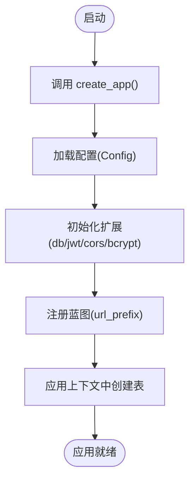

# 后端架构设计

<cite>
**本文引用的文件**
- [backend/app/__init__.py](file://backend/app/__init__.py)
- [backend/app/config.py](file://backend/app/config.py)
- [backend/app/extensions.py](file://backend/app/extensions.py)
- [backend/wsgi.py](file://backend/wsgi.py)
- [backend/requirements.txt](file://backend/requirements.txt)
- [backend/app/routes/auth.py](file://backend/app/routes/auth.py)
- [backend/app/routes/wordbooks.py](file://backend/app/routes/wordbooks.py)
- [backend/app/routes/words.py](file://backend/app/routes/words.py)
- [backend/app/routes/progress.py](file://backend/app/routes/progress.py)
- [backend/app/models/user.py](file://backend/app/models/user.py)
- [backend/app/models/wordbook.py](file://backend/app/models/wordbook.py)
- [backend/app/models/word.py](file://backend/app/models/word.py)
- [backend/app/services/pdf_parser.py](file://backend/app/services/pdf_parser.py)
</cite>

## 目录
1. [简介](#简介)
2. [项目结构](#项目结构)
3. [核心组件](#核心组件)
4. [架构总览](#架构总览)
5. [详细组件分析](#详细组件分析)
6. [依赖分析](#依赖分析)
7. [性能考虑](#性能考虑)
8. [故障排查指南](#故障排查指南)
9. [结论](#结论)
10. [附录](#附录)

## 简介
本文件系统性梳理后端 Flask 应用的架构设计与实现细节，重点围绕应用工厂模式、MVC 分层、蓝图路由、扩展配置与启动流程展开。通过分析配置加载、扩展初始化、蓝图注册以及模型-视图-控制器的协作关系，帮助读者快速理解系统的整体设计与运行机制。

## 项目结构
后端采用标准的分层组织方式：应用工厂负责装配应用；配置集中于配置类；扩展统一在独立模块中声明；路由按功能域拆分为蓝图；模型定义数据结构与关系；服务层封装业务工具方法；WSGI 入口负责本地开发与生产部署。

图表来源
- [backend/wsgi.py](file://backend/wsgi.py#L1-L7)
- [backend/app/__init__.py](file://backend/app/__init__.py#L1-L37)
- [backend/app/config.py](file://backend/app/config.py#L1-L28)
- [backend/app/extensions.py](file://backend/app/extensions.py#L1-L10)
- [backend/app/routes/auth.py](file://backend/app/routes/auth.py#L1-L93)
- [backend/app/routes/wordbooks.py](file://backend/app/routes/wordbooks.py#L1-L159)
- [backend/app/routes/words.py](file://backend/app/routes/words.py#L1-L65)
- [backend/app/routes/progress.py](file://backend/app/routes/progress.py#L1-L115)
- [backend/app/models/user.py](file://backend/app/models/user.py#L1-L26)
- [backend/app/models/wordbook.py](file://backend/app/models/wordbook.py#L1-L25)
- [backend/app/models/word.py](file://backend/app/models/word.py#L1-L29)
- [backend/app/services/pdf_parser.py](file://backend/app/services/pdf_parser.py#L1-L43)

章节来源
- [backend/app/__init__.py](file://backend/app/__init__.py#L1-L37)
- [backend/app/config.py](file://backend/app/config.py#L1-L28)
- [backend/app/extensions.py](file://backend/app/extensions.py#L1-L10)
- [backend/wsgi.py](file://backend/wsgi.py#L1-L7)

## 核心组件
- 应用工厂 create_app：集中完成配置加载、扩展初始化、蓝图注册与数据库表创建。
- 配置类 Config：集中管理密钥、数据库连接、JWT 过期时间、上传路径与大小限制。
- 扩展模块 extensions：统一声明 SQLAlchemy、JWT、CORS、Bcrypt 实例，延迟绑定到应用。
- 蓝图 routes：按领域划分认证、单词书、单词、进度等模块，统一前缀路由。
- 模型 models：定义用户、单词书、单词等实体及关系，提供序列化方法。
- 服务 services：封装 PDF 解析等业务工具函数。
- WSGI 入口：本地开发与生产服务器启动。

章节来源
- [backend/app/__init__.py](file://backend/app/__init__.py#L6-L36)
- [backend/app/config.py](file://backend/app/config.py#L4-L27)
- [backend/app/extensions.py](file://backend/app/extensions.py#L1-L10)
- [backend/wsgi.py](file://backend/wsgi.py#L1-L7)

## 架构总览
Flask 应用采用“应用工厂 + 蓝图 + 扩展延迟绑定”的架构，实现高内聚、低耦合与可扩展性。应用启动时，工厂函数创建 Flask 实例，加载配置，初始化扩展，注册蓝图，随后在应用上下文中创建数据库表，最终对外提供 RESTful 接口。

图表来源
- [backend/wsgi.py](file://backend/wsgi.py#L1-L7)
- [backend/app/__init__.py](file://backend/app/__init__.py#L6-L36)
- [backend/app/config.py](file://backend/app/config.py#L4-L27)
- [backend/app/extensions.py](file://backend/app/extensions.py#L1-L10)

## 详细组件分析

### 应用工厂与启动流程
- 工厂函数 create_app 完成以下步骤：
  - 创建 Flask 应用实例。
  - 从配置类加载配置项。
  - 确保上传目录存在。
  - 初始化扩展：SQLAlchemy、JWT、CORS、Bcrypt。
  - 注册蓝图并设置统一前缀，如 /api/auth、/api/wordbooks 等。
  - 在应用上下文中创建数据库表。
- WSGI 入口直接调用工厂函数创建应用实例，并在本地以调试模式运行。

图表来源
- [backend/app/__init__.py](file://backend/app/__init__.py#L6-L36)
- [backend/wsgi.py](file://backend/wsgi.py#L1-L7)

章节来源
- [backend/app/__init__.py](file://backend/app/__init__.py#L6-L36)
- [backend/wsgi.py](file://backend/wsgi.py#L1-L7)

### 配置管理
- 密钥与数据库：使用环境变量覆盖默认值，构建 MySQL 连接字符串，关闭 SQLAlchemy 的修改追踪。
- JWT：设置访问令牌与刷新令牌过期时间，默认密钥来自环境变量。
- 文件上传：设置上传目录与最大内容长度，蓝图中使用安全文件名与当前应用配置。

章节来源
- [backend/app/config.py](file://backend/app/config.py#L4-L27)

### 扩展配置与初始化
- 扩展统一在 extensions.py 中声明，延迟绑定到具体应用实例。
- SQLAlchemy：提供 ORM 能力，配合模型定义数据表。
- JWT：提供访问令牌与刷新令牌签发、校验与身份提取。
- CORS：对 /api/* 路由开放跨域访问。
- Bcrypt：提供密码哈希生成与校验。

章节来源
- [backend/app/extensions.py](file://backend/app/extensions.py#L1-L10)
- [backend/app/__init__.py](file://backend/app/__init__.py#L14-L17)

### 蓝图路由设计与模块化
- 认证蓝图：注册 /register、/login、/refresh、/me 等端点，使用 JWT 装饰器保护接口，使用 Bcrypt 做密码哈希。
- 单词书蓝图：提供列表、详情、上传PDF并解析为单词书、删除单词书等接口，包含管理员权限装饰器与文件上传处理。
- 单词蓝图：提供单个单词详情与批量单词查询接口，结合生词本标记。
- 学习进度蓝图：提供进度查询、更新与重置接口，维护用户在单词书中的学习进度。

图表来源
- [backend/app/routes/auth.py](file://backend/app/routes/auth.py#L1-L93)
- [backend/app/routes/wordbooks.py](file://backend/app/routes/wordbooks.py#L1-L159)
- [backend/app/routes/words.py](file://backend/app/routes/words.py#L1-L65)
- [backend/app/routes/progress.py](file://backend/app/routes/progress.py#L1-L115)
- [backend/app/services/pdf_parser.py](file://backend/app/services/pdf_parser.py#L1-L43)
- [backend/app/models/user.py](file://backend/app/models/user.py#L1-L26)
- [backend/app/models/wordbook.py](file://backend/app/models/wordbook.py#L1-L25)
- [backend/app/models/word.py](file://backend/app/models/word.py#L1-L29)

章节来源
- [backend/app/routes/auth.py](file://backend/app/routes/auth.py#L1-L93)
- [backend/app/routes/wordbooks.py](file://backend/app/routes/wordbooks.py#L1-L159)
- [backend/app/routes/words.py](file://backend/app/routes/words.py#L1-L65)
- [backend/app/routes/progress.py](file://backend/app/routes/progress.py#L1-L115)

### MVC 架构在 Flask 中的实现
- 模型层（Models）：定义数据库表结构与关系，提供序列化方法，支撑视图层的数据渲染。
- 视图层（Routes/Blueprints）：定义路由与请求处理逻辑，负责参数解析、鉴权、调用业务逻辑并返回响应。
- 控制器层（业务协调）：在蓝图中通过装饰器进行鉴权控制，在路由处理函数中协调模型与服务，完成业务流程。

图表来源
- [backend/app/models/user.py](file://backend/app/models/user.py#L4-L25)
- [backend/app/models/wordbook.py](file://backend/app/models/wordbook.py#L4-L24)
- [backend/app/models/word.py](file://backend/app/models/word.py#L4-L28)

章节来源
- [backend/app/models/user.py](file://backend/app/models/user.py#L1-L26)
- [backend/app/models/wordbook.py](file://backend/app/models/wordbook.py#L1-L25)
- [backend/app/models/word.py](file://backend/app/models/word.py#L1-L29)

### 认证与权限控制流程
- 登录：校验邮箱与密码，签发访问与刷新令牌。
- 刷新：使用刷新令牌签发新的访问令牌。
- 当前用户：基于访问令牌获取身份并返回用户信息。
- 管理员权限：在单词书相关接口上通过装饰器校验用户是否为管理员。

图表来源
- [backend/app/routes/auth.py](file://backend/app/routes/auth.py#L46-L80)
- [backend/app/models/user.py](file://backend/app/models/user.py#L1-L26)
- [backend/app/extensions.py](file://backend/app/extensions.py#L1-L10)

章节来源
- [backend/app/routes/auth.py](file://backend/app/routes/auth.py#L1-L93)

### 学习进度更新流程
- 查询：若无进度记录则返回默认值；否则计算百分比并返回。
- 更新：校验索引范围，若存在记录则更新，否则新增。
- 重置：将当前索引重置为 1 并更新学习时间。

图表来源
- [backend/app/routes/progress.py](file://backend/app/routes/progress.py#L11-L95)

章节来源
- [backend/app/routes/progress.py](file://backend/app/routes/progress.py#L1-L115)

### PDF 导入与单词解析流程
- 校验：检查文件类型、必填字段与上传文件存在性。
- 保存：使用安全文件名与应用配置的上传目录保存 PDF。
- 解析：正则匹配每页文本，提取单词、音标与释义。
- 写入：创建单词书并批量写入单词，回滚异常并清理文件。

图表来源
- [backend/app/routes/wordbooks.py](file://backend/app/routes/wordbooks.py#L68-L135)
- [backend/app/services/pdf_parser.py](file://backend/app/services/pdf_parser.py#L4-L42)

章节来源
- [backend/app/routes/wordbooks.py](file://backend/app/routes/wordbooks.py#L1-L159)
- [backend/app/services/pdf_parser.py](file://backend/app/services/pdf_parser.py#L1-L43)

## 依赖分析
- 外部依赖：Flask、Flask-SQLAlchemy、Flask-JWT-Extended、Flask-CORS、Flask-Bcrypt、PyMySQL、pdfplumber、python-dotenv、gunicorn、Werkzeug。
- 组件耦合：蓝图仅依赖扩展与模型，避免直接依赖其他蓝图；模型仅依赖扩展；服务层与路由解耦。
- 循环依赖：当前结构未见循环导入迹象，蓝图注册集中在工厂函数中，避免了运行时循环依赖风险。

图表来源
- [backend/requirements.txt](file://backend/requirements.txt#L1-L11)
- [backend/app/__init__.py](file://backend/app/__init__.py#L1-L36)
- [backend/app/routes/auth.py](file://backend/app/routes/auth.py#L1-L93)
- [backend/app/routes/wordbooks.py](file://backend/app/routes/wordbooks.py#L1-L159)
- [backend/app/services/pdf_parser.py](file://backend/app/services/pdf_parser.py#L1-L43)

章节来源
- [backend/requirements.txt](file://backend/requirements.txt#L1-L11)

## 性能考虑
- 数据库连接：使用连接池与合适的超时配置，避免在请求中重复创建连接。
- 查询优化：对高频查询建立复合索引与唯一约束，减少重复扫描。
- 缓存策略：对静态资源与热点数据引入缓存中间件，降低数据库压力。
- 上传与解析：限制文件大小与并发，解析过程异步化以提升吞吐。
- 蓝图拆分：按功能域拆分蓝图，避免单蓝图过大导致加载与维护困难。

## 故障排查指南
- 数据库连接失败：检查环境变量与连接字符串，确认数据库服务可达。
- JWT 校验失败：确认密钥一致、令牌未过期、签名正确。
- CORS 报错：确认 /api/* 路由已正确配置跨域规则。
- 文件上传失败：检查上传目录权限、文件大小限制与 MIME 类型。
- PDF 解析异常：确认 PDF 文本格式符合预期，捕获异常并清理临时文件。

章节来源
- [backend/app/config.py](file://backend/app/config.py#L14-L18)
- [backend/app/__init__.py](file://backend/app/__init__.py#L16-L17)
- [backend/app/routes/wordbooks.py](file://backend/app/routes/wordbooks.py#L88-L135)

## 结论
本项目通过应用工厂模式实现了清晰的装配流程，结合蓝图路由与扩展延迟绑定，形成了高内聚、低耦合且易于扩展的后端架构。配置集中化、模型-视图-控制器职责分离以及服务层工具化，使得系统具备良好的可维护性与可演进性。建议在生产环境中进一步完善日志监控、缓存策略与安全加固。

## 附录
- 开发与部署：本地使用 WSGI 入口启动，生产环境可通过 gunicorn 部署。
- 环境变量：建议在部署时设置 SECRET_KEY、JWT_SECRET_KEY、数据库凭据与上传目录等。

章节来源
- [backend/wsgi.py](file://backend/wsgi.py#L1-L7)
- [backend/app/config.py](file://backend/app/config.py#L5-L27)
- [backend/requirements.txt](file://backend/requirements.txt#L9-L9)