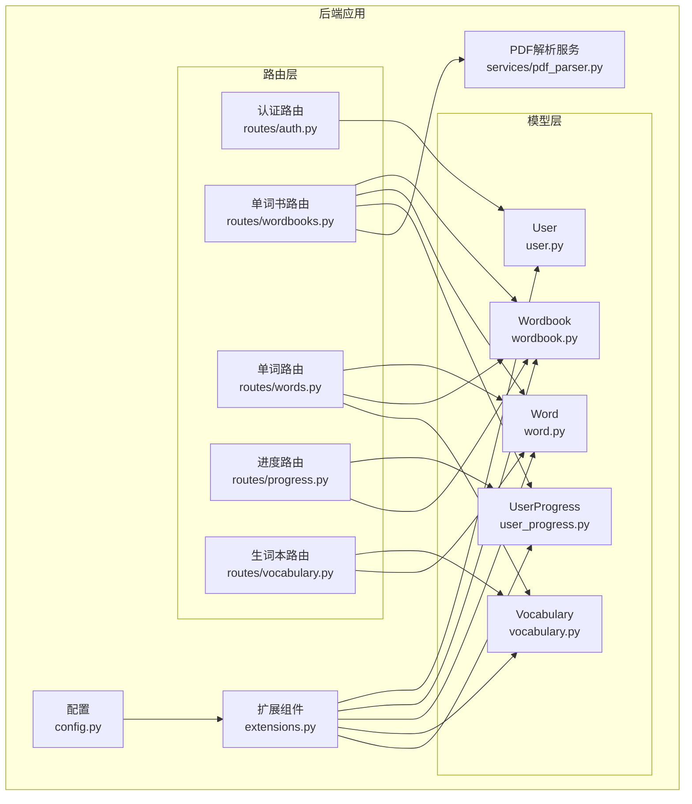
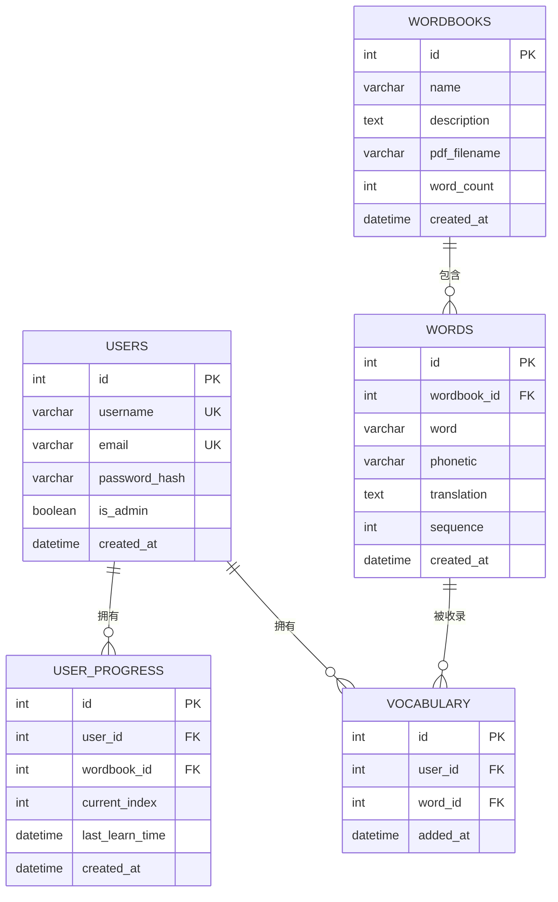
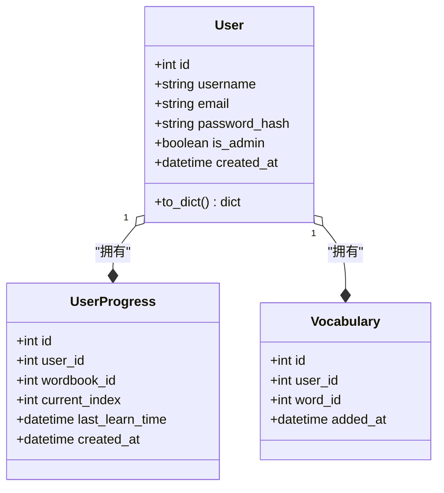
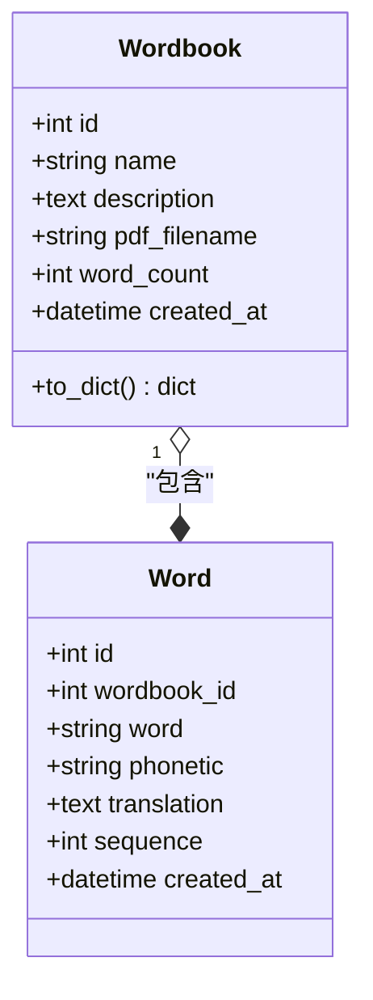
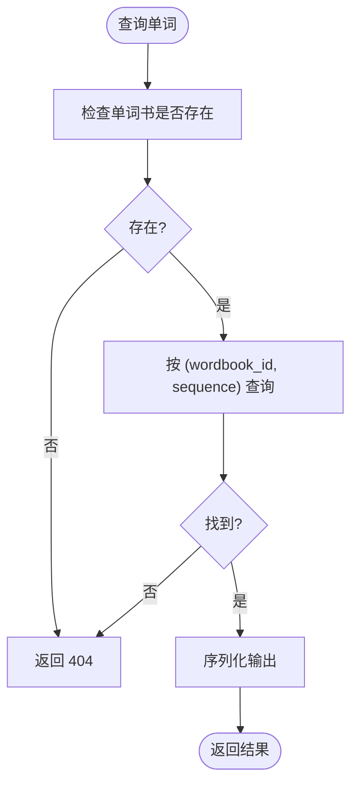
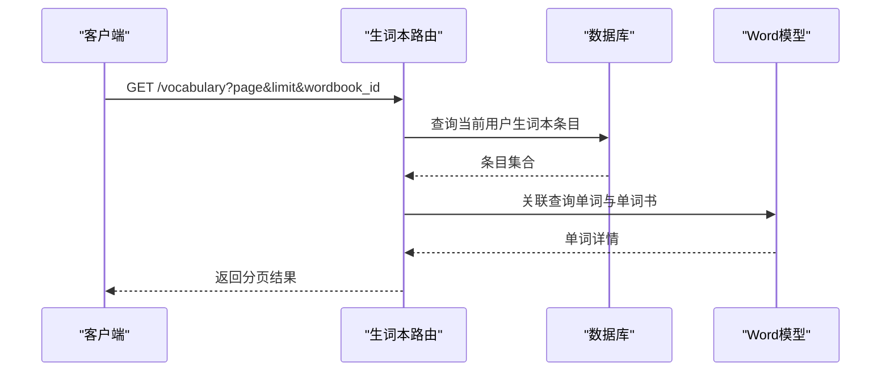
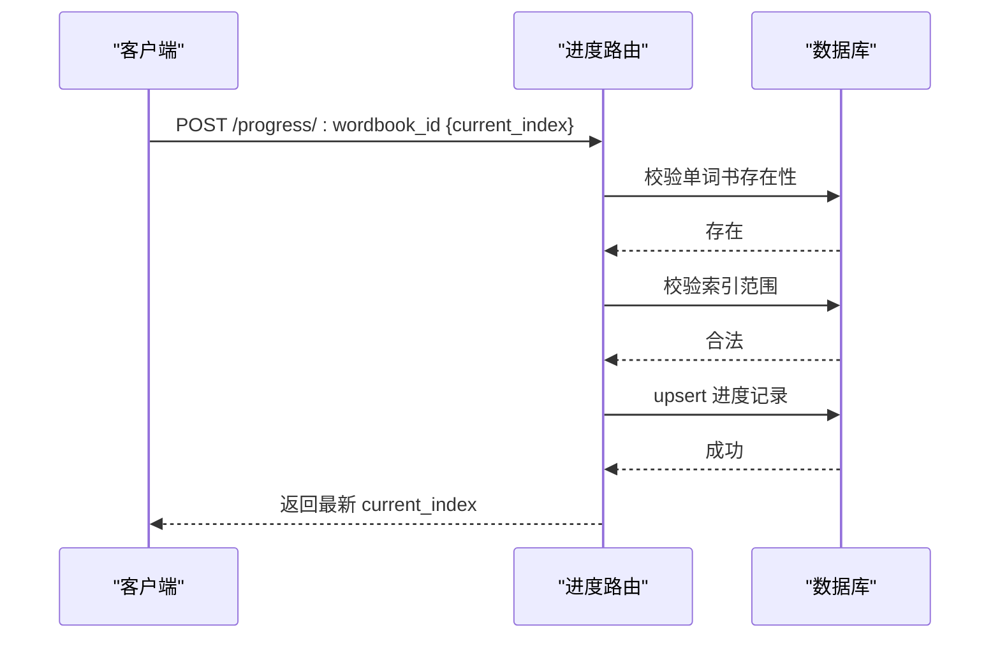
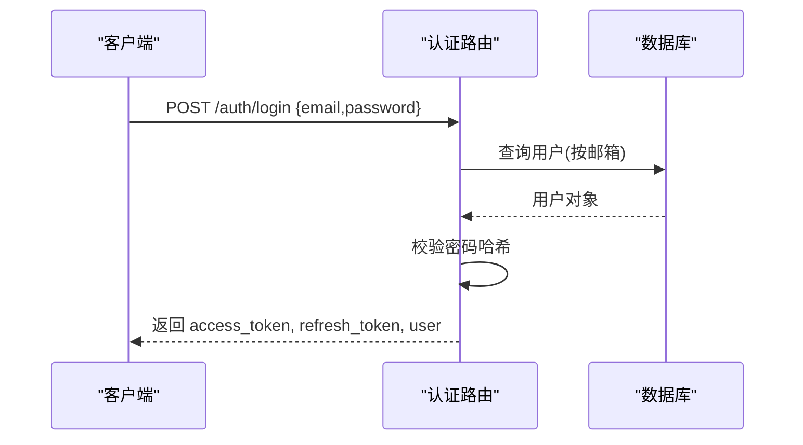
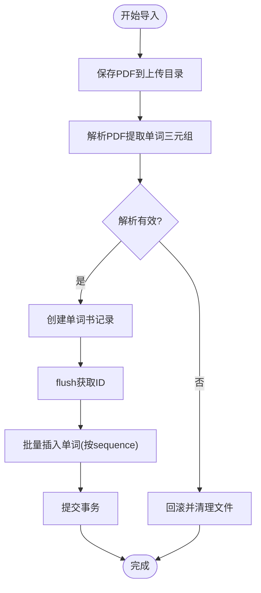
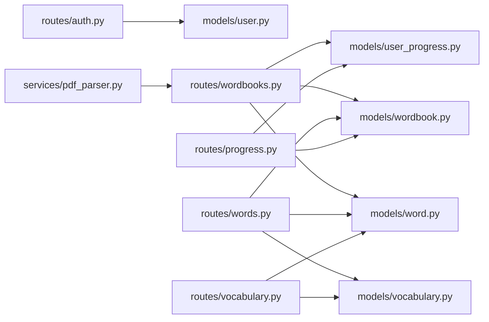

# 数据架构设计

<cite>
**本文引用的文件**
- [backend/app/models/__init__.py](file://backend/app/models/__init__.py)
- [backend/app/models/user.py](file://backend/app/models/user.py)
- [backend/app/models/wordbook.py](file://backend/app/models/wordbook.py)
- [backend/app/models/word.py](file://backend/app/models/word.py)
- [backend/app/models/vocabulary.py](file://backend/app/models/vocabulary.py)
- [backend/app/models/user_progress.py](file://backend/app/models/user_progress.py)
- [backend/app/extensions.py](file://backend/app/extensions.py)
- [backend/app/config.py](file://backend/app/config.py)
- [backend/app/routes/wordbooks.py](file://backend/app/routes/wordbooks.py)
- [backend/app/routes/words.py](file://backend/app/routes/words.py)
- [backend/app/routes/progress.py](file://backend/app/routes/progress.py)
- [backend/app/routes/vocabulary.py](file://backend/app/routes/vocabulary.py)
- [backend/app/routes/auth.py](file://backend/app/routes/auth.py)
- [backend/app/services/pdf_parser.py](file://backend/app/services/pdf_parser.py)
- [init.sql](file://init.sql)
</cite>

## 目录
1. [简介](#简介)
2. [项目结构](#项目结构)
3. [核心组件](#核心组件)
4. [架构总览](#架构总览)
5. [详细组件分析](#详细组件分析)
6. [依赖分析](#依赖分析)
7. [性能考虑](#性能考虑)
8. [故障排查指南](#故障排查指南)
9. [结论](#结论)
10. [附录](#附录)

## 简介
本文件系统化梳理单词学习网站的数据架构与模型设计，覆盖实体关系模型、主外键约束、索引优化、数据完整性、ORM 映射策略、数据访问层设计模式、迁移策略、ER 图与实体关系图，以及数据安全设计。目标是帮助开发者与运维人员快速理解并高效维护该系统的数据库层。

## 项目结构
后端采用 Flask + SQLAlchemy 架构，数据模型集中于 models 目录，路由按功能模块组织，扩展组件统一注入至应用。数据库连接通过配置类集中管理，使用 PyMySQL 驱动连接 MySQL。

图表来源
- [backend/app/config.py](file://backend/app/config.py#L14-L18)
- [backend/app/extensions.py](file://backend/app/extensions.py#L1-L10)
- [backend/app/models/user.py](file://backend/app/models/user.py#L4-L16)
- [backend/app/models/wordbook.py](file://backend/app/models/wordbook.py#L4-L15)
- [backend/app/models/word.py](file://backend/app/models/word.py#L4-L18)
- [backend/app/models/vocabulary.py](file://backend/app/models/vocabulary.py#L4-L16)
- [backend/app/models/user_progress.py](file://backend/app/models/user_progress.py#L4-L17)
- [backend/app/routes/auth.py](file://backend/app/routes/auth.py#L1-L93)
- [backend/app/routes/wordbooks.py](file://backend/app/routes/wordbooks.py#L1-L159)
- [backend/app/routes/words.py](file://backend/app/routes/words.py#L1-L65)
- [backend/app/routes/progress.py](file://backend/app/routes/progress.py#L1-L115)
- [backend/app/routes/vocabulary.py](file://backend/app/routes/vocabulary.py#L1-L103)
- [backend/app/services/pdf_parser.py](file://backend/app/services/pdf_parser.py#L1-L43)

章节来源
- [backend/app/config.py](file://backend/app/config.py#L14-L18)
- [backend/app/extensions.py](file://backend/app/extensions.py#L1-L10)

## 核心组件
- 用户(User): 身份标识、认证凭据、管理员角色、创建时间；与学习进度、生词本双向关联。
- 单词书(Wordbook): 名称、描述、PDF 文件名、单词数量、创建时间；与单词一对多级联删除。
- 单词(Word): 外键指向单词书、单词文本、音标、翻译、顺序号、创建时间；复合唯一索引与顺序索引。
- 生词本(Vocabulary): 用户与单词的中间表，唯一性约束防止重复添加；懒加载关联单词。
- 学习进度(UserProgress): 用户在单词书中的当前学习序号、最后学习时间、创建时间；复合唯一索引与联合索引。

章节来源
- [backend/app/models/user.py](file://backend/app/models/user.py#L4-L26)
- [backend/app/models/wordbook.py](file://backend/app/models/wordbook.py#L4-L25)
- [backend/app/models/word.py](file://backend/app/models/word.py#L4-L29)
- [backend/app/models/vocabulary.py](file://backend/app/models/vocabulary.py#L4-L26)
- [backend/app/models/user_progress.py](file://backend/app/models/user_progress.py#L4-L29)

## 架构总览
下图展示数据库层的实体关系与约束，体现主键、外键、唯一性与索引策略。

图表来源
- [backend/app/models/user.py](file://backend/app/models/user.py#L7-L16)
- [backend/app/models/wordbook.py](file://backend/app/models/wordbook.py#L7-L15)
- [backend/app/models/word.py](file://backend/app/models/word.py#L7-L18)
- [backend/app/models/vocabulary.py](file://backend/app/models/vocabulary.py#L7-L16)
- [backend/app/models/user_progress.py](file://backend/app/models/user_progress.py#L7-L17)

## 详细组件分析

### 用户(User)模型
- 主键: 自增整型 id
- 唯一约束: username、email
- 关系: 与 UserProgress、Vocabulary 双向关联
- 序列化: to_dict 提供安全的 JSON 输出

图表来源
- [backend/app/models/user.py](file://backend/app/models/user.py#L4-L26)
- [backend/app/models/user_progress.py](file://backend/app/models/user_progress.py#L4-L29)
- [backend/app/models/vocabulary.py](file://backend/app/models/vocabulary.py#L4-L26)

章节来源
- [backend/app/models/user.py](file://backend/app/models/user.py#L4-L26)

### 单词书(Wordbook)模型
- 主键: 自增整型 id
- 关系: 与 Word 一对多，级联删除孤儿单词
- 序列化: to_dict 提供基础信息

图表来源
- [backend/app/models/wordbook.py](file://backend/app/models/wordbook.py#L4-L25)
- [backend/app/models/word.py](file://backend/app/models/word.py#L4-L29)

章节来源
- [backend/app/models/wordbook.py](file://backend/app/models/wordbook.py#L4-L25)

### 单词(Word)模型
- 主键: 自增整型 id
- 外键: wordbook_id 引用 wordbooks.id
- 唯一性: (wordbook_id, sequence) 复合唯一
- 索引: (wordbook_id, sequence) 复合索引
- 字段: word、phonetic、translation、sequence、created_at
- 序列化: to_dict 提供必要字段

图表来源
- [backend/app/models/word.py](file://backend/app/models/word.py#L7-L18)
- [backend/app/routes/words.py](file://backend/app/routes/words.py#L10-L38)

章节来源
- [backend/app/models/word.py](file://backend/app/models/word.py#L4-L29)
- [backend/app/routes/words.py](file://backend/app/routes/words.py#L10-L38)

### 生词本(Vocabulary)模型
- 主键: 自增整型 id
- 外键: user_id 引用 users.id；word_id 引用 words.id
- 唯一性: (user_id, word_id) 防止重复添加
- 关系: 懒加载关联 Word，并可反向访问 in_vocabulary
- 序列化: to_dict 包含单词详情与所属单词书名称

图表来源
- [backend/app/models/vocabulary.py](file://backend/app/models/vocabulary.py#L4-L26)
- [backend/app/routes/vocabulary.py](file://backend/app/routes/vocabulary.py#L10-L41)

章节来源
- [backend/app/models/vocabulary.py](file://backend/app/models/vocabulary.py#L4-L26)
- [backend/app/routes/vocabulary.py](file://backend/app/routes/vocabulary.py#L10-L41)

### 学习进度(UserProgress)模型
- 主键: 自增整型 id
- 外键: user_id 引用 users.id；wordbook_id 引用 wordbooks.id
- 唯一性: (user_id, wordbook_id) 复合唯一
- 索引: (user_id, wordbook_id) 联合索引
- 字段: current_index、last_learn_time、created_at
- 序列化: to_dict 提供进度摘要

图表来源
- [backend/app/models/user_progress.py](file://backend/app/models/user_progress.py#L4-L29)
- [backend/app/routes/progress.py](file://backend/app/routes/progress.py#L53-L95)

章节来源
- [backend/app/models/user_progress.py](file://backend/app/models/user_progress.py#L4-L29)
- [backend/app/routes/progress.py](file://backend/app/routes/progress.py#L11-L95)

### 认证与会话
- 使用 Bcrypt 对密码进行哈希存储
- 使用 JWT 管理会话，提供访问令牌与刷新令牌
- 登录校验：邮箱存在且密码哈希匹配

图表来源
- [backend/app/routes/auth.py](file://backend/app/routes/auth.py#L46-L72)
- [backend/app/extensions.py](file://backend/app/extensions.py#L1-L10)

章节来源
- [backend/app/routes/auth.py](file://backend/app/routes/auth.py#L1-L93)
- [backend/app/extensions.py](file://backend/app/extensions.py#L1-L10)

### 单词书导入流程（PDF）
- 安全保存上传 PDF
- 使用正则与 pdfplumber 解析单词三元组
- 批量写入单词书与单词，事务保障一致性

图表来源
- [backend/app/routes/wordbooks.py](file://backend/app/routes/wordbooks.py#L68-L135)
- [backend/app/services/pdf_parser.py](file://backend/app/services/pdf_parser.py#L4-L43)

章节来源
- [backend/app/routes/wordbooks.py](file://backend/app/routes/wordbooks.py#L68-L135)
- [backend/app/services/pdf_parser.py](file://backend/app/services/pdf_parser.py#L1-L43)

## 依赖分析
- 组件内聚: 模型层仅负责数据结构与关系映射，路由层负责业务流程与事务控制。
- 组件耦合: 路由层通过 db.session 统一管理事务，避免跨模块分散提交。
- 外部依赖: MySQL 驱动、JWT、CORS、Bcrypt 通过扩展模块集中注入。

图表来源
- [backend/app/routes/auth.py](file://backend/app/routes/auth.py#L1-L93)
- [backend/app/routes/wordbooks.py](file://backend/app/routes/wordbooks.py#L1-L159)
- [backend/app/routes/words.py](file://backend/app/routes/words.py#L1-L65)
- [backend/app/routes/progress.py](file://backend/app/routes/progress.py#L1-L115)
- [backend/app/routes/vocabulary.py](file://backend/app/routes/vocabulary.py#L1-L103)
- [backend/app/models/user.py](file://backend/app/models/user.py#L4-L26)
- [backend/app/models/wordbook.py](file://backend/app/models/wordbook.py#L4-L25)
- [backend/app/models/word.py](file://backend/app/models/word.py#L4-L29)
- [backend/app/models/vocabulary.py](file://backend/app/models/vocabulary.py#L4-L26)
- [backend/app/models/user_progress.py](file://backend/app/models/user_progress.py#L4-L29)
- [backend/app/services/pdf_parser.py](file://backend/app/services/pdf_parser.py#L1-L43)

章节来源
- [backend/app/models/__init__.py](file://backend/app/models/__init__.py#L1-L6)

## 性能考虑
- 索引策略
  - 单词表: 复合唯一索引 (wordbook_id, sequence) 与复合索引 (wordbook_id, sequence)，确保按单词书与顺序的查询高效。
  - 学习进度表: 复合唯一索引 (user_id, wordbook_id) 与联合索引 (user_id, wordbook_id)，加速用户在特定单词书的进度查询。
- 查询优化
  - 批量读取: 单词批量接口按区间过滤与排序，减少单条查询开销。
  - 关联查询: 生词本接口通过 join 与条件过滤，避免 N+1 查询。
- 事务管理
  - 导入流程使用 flush 获取 ID 后批量插入，最后统一 commit，提升吞吐。
  - 发生异常时统一 rollback 并清理临时文件，保障一致性。
- 缓存建议
  - 可引入 Redis 缓存热门单词书与用户进度，降低数据库压力。

## 故障排查指南
- 认证失败
  - 现象: 登录返回邮箱或密码错误
  - 排查: 确认邮箱存在、密码哈希匹配；检查 JWT 密钥与过期配置
- 单词不存在
  - 现象: 按序号获取单词返回 404
  - 排查: 核对单词书 ID 与 sequence 是否在唯一索引范围内
- 生词本重复添加
  - 现象: 添加返回已存在
  - 排查: 检查 (user_id, word_id) 唯一约束是否触发
- 导入失败
  - 现象: PDF 导入报错或无单词
  - 排查: 检查 PDF 文本格式是否符合解析规则、文件路径与权限、数据库事务回滚日志

章节来源
- [backend/app/routes/auth.py](file://backend/app/routes/auth.py#L46-L72)
- [backend/app/routes/words.py](file://backend/app/routes/words.py#L10-L38)
- [backend/app/routes/vocabulary.py](file://backend/app/routes/vocabulary.py#L44-L70)
- [backend/app/routes/wordbooks.py](file://backend/app/routes/wordbooks.py#L68-L135)

## 结论
该数据架构以清晰的实体关系为核心，结合合理的索引与事务策略，实现了单词学习场景下的高可用与高性能。通过模块化的模型与路由设计，便于扩展与维护。建议后续引入缓存与审计日志，进一步提升用户体验与可运维性。

## 附录

### 数据库初始化脚本
- 初始化脚本包含数据库与表结构定义，建议在部署前执行以确保环境一致。

章节来源
- [init.sql](file://init.sql)

### 数据模型设计原则
- 主键设计: 全部采用自增整型主键，保证唯一性与有序性。
- 外键约束: 明确外键关系，单词书删除时级联删除单词，确保引用完整性。
- 索引优化: 针对高频查询建立复合唯一索引与联合索引，提升查询效率。
- 数据完整性: 通过唯一约束与外键约束保障数据一致性；路由层进行输入校验与范围验证。
- ORM 映射: 字段类型与长度与数据库保持一致；关系定义清晰，避免 N+1 查询。
- 查询优化: 使用批量插入、条件过滤与排序，减少不必要的查询往返。
- 事务管理: 在导入与更新等关键路径上统一开启、提交或回滚，确保原子性。

### 数据安全设计
- 敏感信息保护: 密码采用哈希存储，不保存明文；JWT 密钥与过期时间集中配置，避免硬编码。
- 访问控制: 路由层基于 JWT 身份识别与权限装饰器实现细粒度访问控制。
- 文件安全: 上传文件使用安全命名与白名单校验，导入后及时清理无效文件。