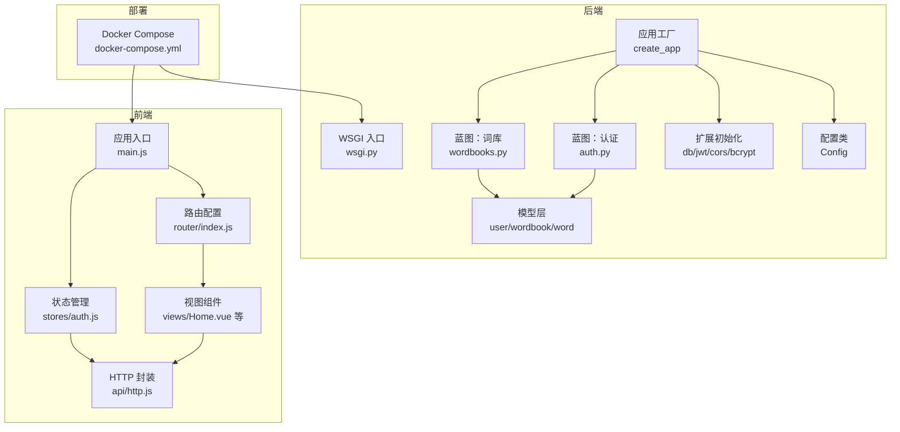
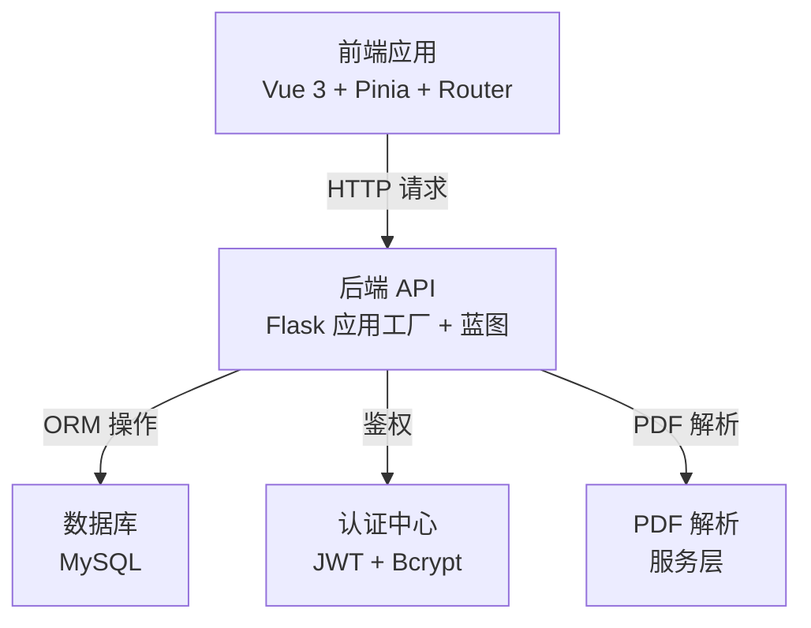
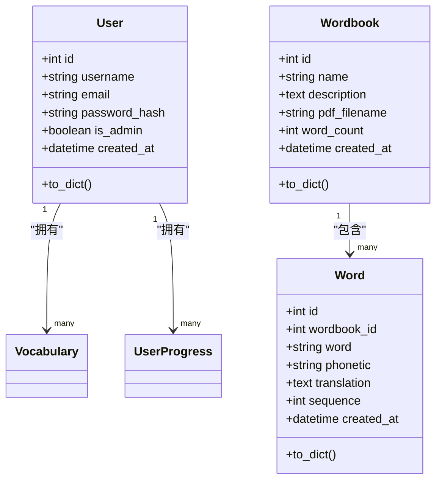
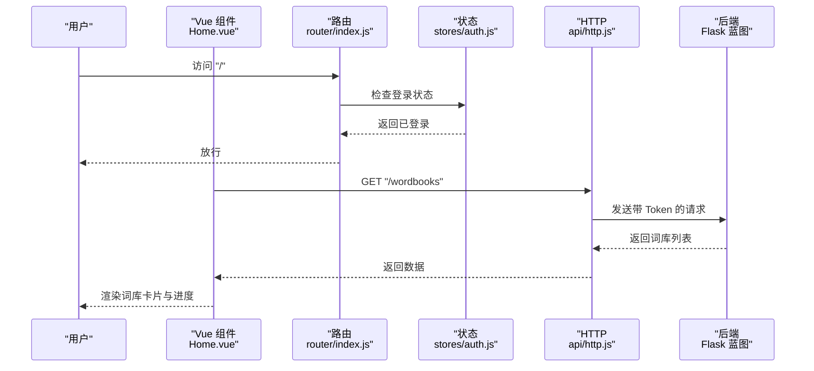
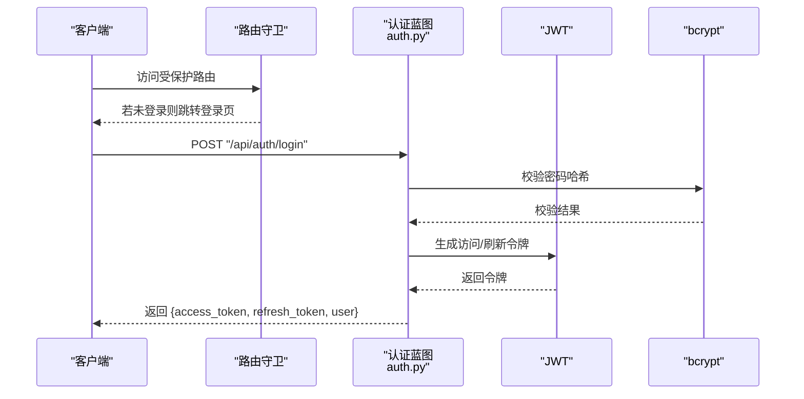
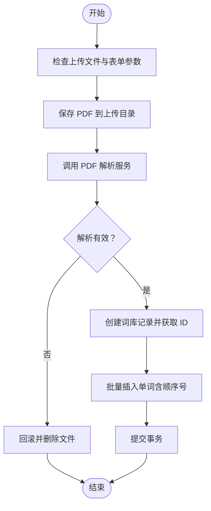
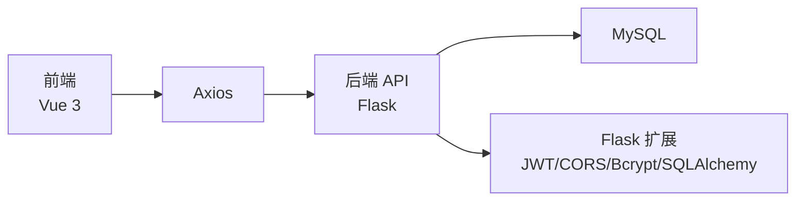

# 架构设计

<cite>
**本文引用的文件**
- [backend/app/__init__.py](file://backend/app/__init__.py)
- [backend/app/config.py](file://backend/app/config.py)
- [backend/app/extensions.py](file://backend/app/extensions.py)
- [backend/app/routes/auth.py](file://backend/app/routes/auth.py)
- [backend/app/routes/wordbooks.py](file://backend/app/routes/wordbooks.py)
- [backend/app/models/user.py](file://backend/app/models/user.py)
- [backend/app/models/word.py](file://backend/app/models/word.py)
- [backend/app/models/wordbook.py](file://backend/app/models/wordbook.py)
- [backend/wsgi.py](file://backend/wsgi.py)
- [backend/requirements.txt](file://backend/requirements.txt)
- [frontend/src/main.js](file://frontend/src/main.js)
- [frontend/src/router/index.js](file://frontend/src/router/index.js)
- [frontend/src/api/http.js](file://frontend/src/api/http.js)
- [frontend/src/stores/auth.js](file://frontend/src/stores/auth.js)
- [frontend/src/views/Home.vue](file://frontend/src/views/Home.vue)
- [frontend/src/App.vue](file://frontend/src/App.vue)
- [frontend/package.json](file://frontend/package.json)
- [docker-compose.yml](file://docker-compose.yml)
- [README_CN.md](file://README_CN.md)
</cite>

## 目录
1. [引言](#引言)
2. [项目结构](#项目结构)
3. [核心组件](#核心组件)
4. [架构总览](#架构总览)
5. [详细组件分析](#详细组件分析)
6. [依赖分析](#依赖分析)
7. [性能考虑](#性能考虑)
8. [故障排查指南](#故障排查指南)
9. [结论](#结论)
10. [附录](#附录)

## 引言
本项目是一个前后端分离的单词学习网站，后端采用 Flask 应用工厂模式与蓝图路由组织 API，前端采用 Vue 3 + Pinia + Vue Router 的组合式架构。系统通过 JWT 实现鉴权，使用 MySQL 存储用户、词库、单词及学习进度数据；后端提供 PDF 单词解析能力，支持从 PDF 导入词库。部署采用 Docker Compose 编排，包含 MySQL、后端服务与前端静态资源服务。

## 项目结构
- 后端 backend
  - 应用工厂与配置：应用入口、配置类、扩展初始化、蓝图注册
  - 蓝图路由：认证、词库、单词、学习进度、词汇管理
  - 模型层：用户、词库、单词、学习进度等实体定义
  - 服务层：PDF 解析工具
  - WSGI 入口：用于本地开发运行
- 前端 frontend
  - 应用入口：创建 Vue 应用、挂载 Pinia 与路由
  - 路由：登录/注册、首页、学习页、生词本、管理页等
  - 状态管理：认证状态与用户信息
  - API 层：Axios 封装，统一请求/响应拦截
  - 视图组件：页面级组件
- 部署 docker
  - Compose 编排：MySQL、后端、前端服务与持久化卷

图表来源
- [backend/app/__init__.py](file://backend/app/__init__.py#L6-L36)
- [backend/app/config.py](file://backend/app/config.py#L4-L27)
- [backend/app/extensions.py](file://backend/app/extensions.py#L1-L10)
- [backend/app/routes/auth.py](file://backend/app/routes/auth.py#L1-L93)
- [backend/app/routes/wordbooks.py](file://backend/app/routes/wordbooks.py#L1-L159)
- [backend/app/models/user.py](file://backend/app/models/user.py#L4-L25)
- [backend/app/models/wordbook.py](file://backend/app/models/wordbook.py#L4-L24)
- [backend/app/models/word.py](file://backend/app/models/word.py#L4-L28)
- [backend/wsgi.py](file://backend/wsgi.py#L1-L7)
- [frontend/src/main.js](file://frontend/src/main.js#L1-L13)
- [frontend/src/router/index.js](file://frontend/src/router/index.js#L1-L64)
- [frontend/src/stores/auth.js](file://frontend/src/stores/auth.js#L1-L59)
- [frontend/src/api/http.js](file://frontend/src/api/http.js#L1-L48)
- [frontend/src/views/Home.vue](file://frontend/src/views/Home.vue#L1-L189)
- [docker-compose.yml](file://docker-compose.yml#L1-L59)

章节来源
- [README_CN.md](file://README_CN.md#L1-L84)
- [docker-compose.yml](file://docker-compose.yml#L1-L59)

## 核心组件
- Flask 应用工厂与蓝图
  - 应用工厂负责读取配置、初始化扩展、注册蓝图并创建数据库表
  - 蓝图按功能拆分，如认证、词库、单词、学习进度、词汇管理
- Vue 3 前端应用
  - 使用组合式 API 与单文件组件
  - 路由守卫控制访问权限，Pinia 管理认证状态
  - Axios 封装统一处理鉴权头与错误
- 数据模型与关系
  - 用户、词库、单词、学习进度等模型定义与约束
  - 关系映射与唯一索引保证数据一致性
- 部署与运行
  - Docker Compose 编排，后端通过 Gunicorn 运行，前端静态资源由 Nginx 提供

章节来源
- [backend/app/__init__.py](file://backend/app/__init__.py#L6-L36)
- [backend/app/config.py](file://backend/app/config.py#L4-L27)
- [backend/app/extensions.py](file://backend/app/extensions.py#L1-L10)
- [backend/app/routes/auth.py](file://backend/app/routes/auth.py#L1-L93)
- [backend/app/routes/wordbooks.py](file://backend/app/routes/wordbooks.py#L1-L159)
- [backend/app/models/user.py](file://backend/app/models/user.py#L4-L25)
- [backend/app/models/wordbook.py](file://backend/app/models/wordbook.py#L4-L24)
- [backend/app/models/word.py](file://backend/app/models/word.py#L4-L28)
- [frontend/src/main.js](file://frontend/src/main.js#L1-L13)
- [frontend/src/router/index.js](file://frontend/src/router/index.js#L1-L64)
- [frontend/src/stores/auth.js](file://frontend/src/stores/auth.js#L1-L59)
- [frontend/src/api/http.js](file://frontend/src/api/http.js#L1-L48)

## 架构总览
系统采用前后端分离架构，后端以 RESTful API 形式提供服务，前端通过 Axios 发起请求并使用 Pinia 管理状态。JWT 用于鉴权，CORS 允许跨域访问，bcrypt 用于密码哈希，SQLAlchemy 作为 ORM 映射至 MySQL。

图表来源
- [backend/app/__init__.py](file://backend/app/__init__.py#L6-L36)
- [backend/app/config.py](file://backend/app/config.py#L4-L27)
- [backend/app/extensions.py](file://backend/app/extensions.py#L1-L10)
- [backend/app/routes/wordbooks.py](file://backend/app/routes/wordbooks.py#L68-L135)
- [frontend/src/api/http.js](file://frontend/src/api/http.js#L1-L48)

## 详细组件分析

### 后端：应用工厂与蓝图
- 应用工厂
  - 读取配置、初始化扩展、注册蓝图、创建数据库表
- 蓝图路由
  - 认证：注册、登录、刷新令牌、获取当前用户
  - 词库：查询词库列表、详情、上传 PDF 并解析为词库、删除词库
  - 权限控制：管理员装饰器限制敏感操作
- 模型层
  - 用户：用户名、邮箱、密码哈希、管理员标志
  - 词库：名称、描述、PDF 文件名、单词数量
  - 单词：所属词库、单词、音标、释义、顺序号
  - 学习进度：用户与词库的当前学习位置与时间

图表来源
- [backend/app/models/user.py](file://backend/app/models/user.py#L4-L25)
- [backend/app/models/wordbook.py](file://backend/app/models/wordbook.py#L4-L24)
- [backend/app/models/word.py](file://backend/app/models/word.py#L4-L28)

章节来源
- [backend/app/__init__.py](file://backend/app/__init__.py#L6-L36)
- [backend/app/routes/auth.py](file://backend/app/routes/auth.py#L1-L93)
- [backend/app/routes/wordbooks.py](file://backend/app/routes/wordbooks.py#L1-L159)
- [backend/app/models/user.py](file://backend/app/models/user.py#L4-L25)
- [backend/app/models/wordbook.py](file://backend/app/models/wordbook.py#L4-L24)
- [backend/app/models/word.py](file://backend/app/models/word.py#L4-L28)

### 前端：应用结构与状态管理
- 应用入口
  - 创建 Vue 应用，注册 Pinia 与路由
- 路由配置
  - 登录/注册（访客权限）、首页（需登录）、学习页（需登录）、生词本（需登录）、管理页（需管理员）
  - 路由守卫校验 token 与用户角色
- 状态管理
  - 认证 Store：维护用户与 token，提供登录、注册、登出、检查登录状态
- API 封装
  - Axios 实例，设置基础路径、超时、请求头携带 Bearer Token
  - 响应拦截统一处理 401 清除本地状态并跳转登录

图表来源
- [frontend/src/views/Home.vue](file://frontend/src/views/Home.vue#L74-L93)
- [frontend/src/router/index.js](file://frontend/src/router/index.js#L48-L61)
- [frontend/src/stores/auth.js](file://frontend/src/stores/auth.js#L12-L20)
- [frontend/src/api/http.js](file://frontend/src/api/http.js#L12-L23)
- [backend/app/routes/wordbooks.py](file://backend/app/routes/wordbooks.py#L28-L54)

章节来源
- [frontend/src/main.js](file://frontend/src/main.js#L1-L13)
- [frontend/src/router/index.js](file://frontend/src/router/index.js#L1-L64)
- [frontend/src/stores/auth.js](file://frontend/src/stores/auth.js#L1-L59)
- [frontend/src/api/http.js](file://frontend/src/api/http.js#L1-L48)
- [frontend/src/views/Home.vue](file://frontend/src/views/Home.vue#L1-L189)

### 认证流程（登录）

图表来源
- [backend/app/routes/auth.py](file://backend/app/routes/auth.py#L46-L80)
- [backend/app/models/user.py](file://backend/app/models/user.py#L4-L25)
- [frontend/src/router/index.js](file://frontend/src/router/index.js#L48-L61)
- [frontend/src/api/http.js](file://frontend/src/api/http.js#L12-L23)

章节来源
- [backend/app/routes/auth.py](file://backend/app/routes/auth.py#L1-L93)
- [frontend/src/router/index.js](file://frontend/src/router/index.js#L1-L64)
- [frontend/src/api/http.js](file://frontend/src/api/http.js#L1-L48)

### PDF 词库导入流程

图表来源
- [backend/app/routes/wordbooks.py](file://backend/app/routes/wordbooks.py#L68-L135)

章节来源
- [backend/app/routes/wordbooks.py](file://backend/app/routes/wordbooks.py#L1-L159)

## 依赖分析
- 技术栈与版本
  - 后端：Flask 3、Flask-SQLAlchemy、Flask-JWT-Extended、Flask-CORS、Flask-Bcrypt、PyMySQL、pdfplumber、gunicorn
  - 前端：Vue 3、Vue Router、Pinia、Axios、Vite
- 组件耦合
  - 前端通过统一 API 基础路径与后端交互，Axios 拦截器集中处理鉴权与错误
  - 后端蓝图按领域拆分，模型层与路由层解耦
- 外部依赖
  - MySQL 作为持久化存储
  - Docker Compose 编排与持久化卷

图表来源
- [frontend/package.json](file://frontend/package.json#L11-L21)
- [backend/requirements.txt](file://backend/requirements.txt#L1-L11)
- [frontend/src/api/http.js](file://frontend/src/api/http.js#L1-L48)
- [backend/app/extensions.py](file://backend/app/extensions.py#L1-L10)

章节来源
- [frontend/package.json](file://frontend/package.json#L1-L22)
- [backend/requirements.txt](file://backend/requirements.txt#L1-L11)

## 性能考虑
- 前端
  - 路由懒加载减少首屏体积
  - Pinia 状态持久化建议仅保留必要字段，避免大对象频繁更新
  - Axios 超时与错误统一处理，减少重复请求
- 后端
  - 使用应用工厂与蓝图提升模块化与可测试性
  - 批量插入单词减少事务次数
  - 合理索引与唯一约束（如单词书顺序唯一约束）提升查询效率
- 部署
  - 使用 Gunicorn 运行 Flask，Nginx 提供静态资源与反向代理
  - Docker 卷持久化数据库与上传目录

## 故障排查指南
- 认证相关
  - 401 未授权：检查本地是否保存 access_token，确认后端 JWT 配置与前端拦截器是否正确注入
- 数据库连接
  - 检查 .env 或 Docker 环境变量中的数据库连接参数，确认 MySQL 服务健康
- PDF 导入
  - 确认上传文件为 PDF 且内容可被解析，查看后端日志定位异常
- 路由与权限
  - 管理员权限：确认用户 is_admin 字段，检查路由守卫逻辑

章节来源
- [frontend/src/api/http.js](file://frontend/src/api/http.js#L30-L45)
- [backend/app/config.py](file://backend/app/config.py#L4-L27)
- [backend/app/routes/wordbooks.py](file://backend/app/routes/wordbooks.py#L68-L135)
- [frontend/src/router/index.js](file://frontend/src/router/index.js#L48-L61)

## 结论
本项目采用清晰的前后端分离架构，后端以应用工厂与蓝图实现高内聚低耦合，前端以组合式 API 与状态管理提升开发体验。通过 JWT 鉴权、Axios 统一拦截与 MySQL 持久化，系统具备良好的可维护性与扩展性。结合 Docker 编排与 PDF 解析能力，满足单词学习场景的核心需求。

## 附录
- 快速启动
  - 推荐使用 Docker Compose 一键启动后端、前端与数据库
- 开发调试
  - 前端使用 Vite 开发服务器，后端使用本地运行入口进行调试

章节来源
- [README_CN.md](file://README_CN.md#L11-L56)
- [docker-compose.yml](file://docker-compose.yml#L1-L59)
- [backend/wsgi.py](file://backend/wsgi.py#L1-L7)