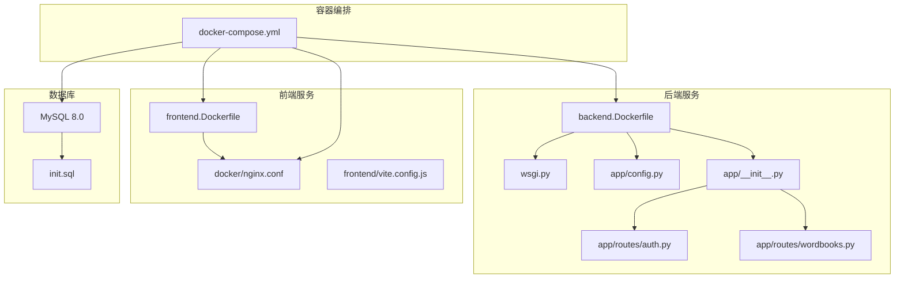
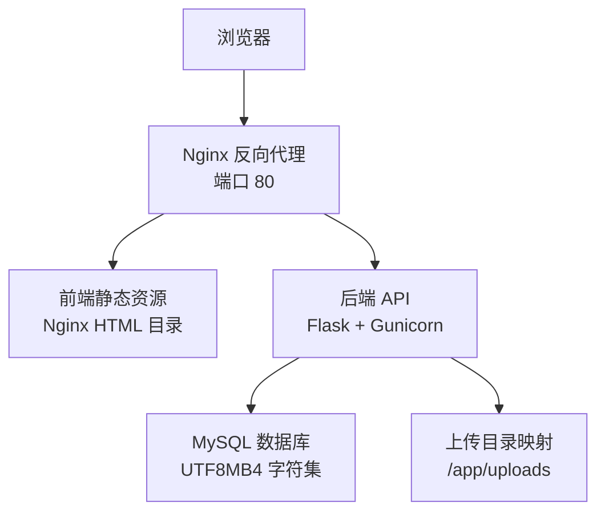
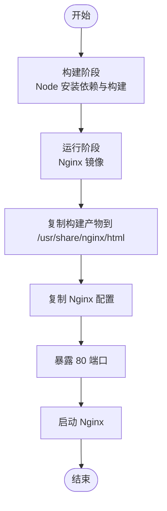
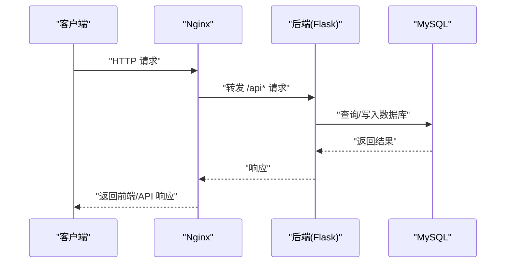
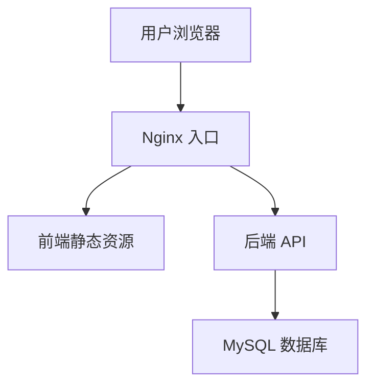
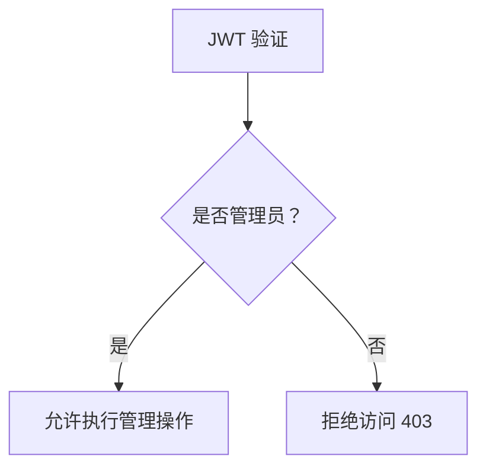

# 部署架构设计

<cite>
**本文引用的文件**
- [docker-compose.yml](file://docker-compose.yml)
- [backend.Dockerfile](file://docker/backend.Dockerfile)
- [frontend.Dockerfile](file://docker/frontend.Dockerfile)
- [nginx.conf](file://docker/nginx.conf)
- [.env.example](file://backend/.env.example)
- [requirements.txt](file://backend/requirements.txt)
- [wsgi.py](file://backend/wsgi.py)
- [config.py](file://backend/app/config.py)
- [__init__.py](file://backend/app/__init__.py)
- [vite.config.js](file://frontend/vite.config.js)
- [init.sql](file://init.sql)
- [auth.py](file://backend/app/routes/auth.py)
- [wordbooks.py](file://backend/app/routes/wordbooks.py)
- [README_CN.md](file://README_CN.md)
</cite>

## 目录
1. [简介](#简介)
2. [项目结构](#项目结构)
3. [核心组件](#核心组件)
4. [架构总览](#架构总览)
5. [组件详细分析](#组件详细分析)
6. [依赖关系分析](#依赖关系分析)
7. [性能考虑](#性能考虑)
8. [故障排查指南](#故障排查指南)
9. [结论](#结论)
10. [附录](#附录)

## 简介
本部署架构文档面向单词学习网站的容器化部署与基础设施设计，覆盖 Docker 多阶段构建、镜像优化、资源限制建议、微服务架构（前后端分离、数据库独立管理）、Nginx 反向代理配置（静态资源、API 转发、SSL 终止）、环境变量管理（开发/测试/生产差异）、CI/CD 流程（自动化构建、测试、部署）、部署拓扑与流量走向、监控与日志策略、故障恢复与灾备方案等。

## 项目结构
项目采用分层与容器化组织方式：
- 后端：Flask 应用，通过 WSGI 启动，使用 SQLAlchemy 连接 MySQL，提供 REST API。
- 前端：Vue 3 应用，Vite 开发服务器，构建产物由 Nginx 提供。
- 基础设施：Docker Compose 编排 MySQL、后端、前端；Nginx 作为反向代理与静态资源服务。
- 数据初始化：通过 init.sql 在首次初始化时创建数据库与表结构。

图表来源
- [docker-compose.yml](file://docker-compose.yml#L1-L59)
- [backend.Dockerfile](file://docker/backend.Dockerfile#L1-L29)
- [frontend.Dockerfile](file://docker/frontend.Dockerfile#L1-L30)
- [nginx.conf](file://docker/nginx.conf#L1-L35)
- [wsgi.py](file://backend/wsgi.py#L1-L7)
- [config.py](file://backend/app/config.py#L1-L28)
- [__init__.py](file://backend/app/__init__.py#L1-L37)
- [auth.py](file://backend/app/routes/auth.py#L1-L93)
- [wordbooks.py](file://backend/app/routes/wordbooks.py#L1-L159)
- [init.sql](file://init.sql#L1-L67)

章节来源
- [docker-compose.yml](file://docker-compose.yml#L1-L59)
- [README_CN.md](file://README_CN.md#L1-L84)

## 核心组件
- MySQL 数据库：持久化用户、单词书、单词、学习进度、生词本等数据；通过健康检查保障可用性。
- 后端服务（Flask + Gunicorn）：提供认证、词库管理、学习进度、PDF 导入等 API；通过环境变量配置数据库与 JWT。
- 前端服务（Vue 3 + Nginx）：构建产物由 Nginx 提供；SPA 路由回退至 index.html；API 请求代理到后端。
- Nginx 反向代理：监听 80 端口，处理静态资源缓存、API 转发、请求头透传、上传文件大小限制。

章节来源
- [docker-compose.yml](file://docker-compose.yml#L4-L54)
- [backend.Dockerfile](file://docker/backend.Dockerfile#L1-L29)
- [frontend.Dockerfile](file://docker/frontend.Dockerfile#L1-L30)
- [nginx.conf](file://docker/nginx.conf#L1-L35)
- [config.py](file://backend/app/config.py#L1-L28)

## 架构总览
整体采用“前端静态 + 后端 API + 数据库”的三层架构，容器化部署并通过 Nginx 实现统一入口与静态资源加速。流量从浏览器经 Nginx 到后端 API，静态资源直接由 Nginx 返回；数据库独立运行并持久化。

图表来源
- [nginx.conf](file://docker/nginx.conf#L1-L35)
- [docker-compose.yml](file://docker-compose.yml#L23-L54)
- [backend.Dockerfile](file://docker/backend.Dockerfile#L21-L28)
- [init.sql](file://init.sql#L1-L67)

## 组件详细分析

### Docker 容器化与多阶段构建
- 后端镜像
  - 基于精简 Python 镜像，安装必要系统依赖，仅拷贝编译所需依赖以减少体积。
  - 使用 pip 安装 Python 依赖，避免缓存残留；复制应用代码后创建上传目录。
  - 暴露 5000 端口，使用 Gunicorn 启动，配置工作进程数与绑定地址。
- 前端镜像
  - 多阶段：第一阶段使用 Node 构建，第二阶段使用 Nginx 镜像，仅复制构建产物与 Nginx 配置。
  - 构建产物目录挂载到 Nginx 默认站点目录，实现零构建部署。
- Nginx 配置
  - 监听 80 端口，SPA 路由回退至 index.html。
  - 对 /api 前缀进行代理，透传 Host、X-Real-IP、X-Forwarded-* 等头部，支持 WebSocket 升级。
  - 设置静态资源缓存与上传文件大小限制。

图表来源
- [frontend.Dockerfile](file://docker/frontend.Dockerfile#L1-L30)
- [nginx.conf](file://docker/nginx.conf#L1-L35)

章节来源
- [backend.Dockerfile](file://docker/backend.Dockerfile#L1-L29)
- [frontend.Dockerfile](file://docker/frontend.Dockerfile#L1-L30)
- [nginx.conf](file://docker/nginx.conf#L1-L35)

### 微服务架构与部署策略
- 前后端分离：前端静态资源由 Nginx 提供，后端 API 由 Flask + Gunicorn 提供，二者通过 Nginx 统一对外。
- 数据库独立管理：MySQL 作为独立容器，使用命名卷持久化数据与初始化脚本。
- 服务编排：docker-compose 控制服务生命周期、依赖顺序与健康检查；后端等待数据库健康后再启动。
- 负载均衡：当前为单实例部署；如需扩展，可在 Nginx 前增加反向代理或使用更高层编排工具实现多实例与自动扩缩容。

图表来源
- [docker-compose.yml](file://docker-compose.yml#L23-L54)
- [nginx.conf](file://docker/nginx.conf#L14-L27)
- [auth.py](file://backend/app/routes/auth.py#L1-L93)

章节来源
- [docker-compose.yml](file://docker-compose.yml#L1-L59)
- [nginx.conf](file://docker/nginx.conf#L1-L35)

### Nginx 反向代理配置详解
- 监听与根目录：监听 80 端口，根目录指向前端构建产物。
- SPA 路由：location / 将未匹配路径回退到 index.html，支持前端路由。
- API 代理：location /api 转发到后端服务，设置升级头以支持 WebSocket，透传真实 IP 与协议头，设置上传大小上限。
- 静态资源缓存：对 JS/CSS/字体/图片等设置一年缓存与 immutable 标记。

章节来源
- [nginx.conf](file://docker/nginx.conf#L1-L35)

### 环境变量管理与环境差异
- 开发环境
  - 前端开发服务器通过 Vite 配置代理到后端本地 5000 端口。
  - 后端使用 .env.example 中的示例值，便于本地调试。
- 测试/生产环境
  - 通过 docker-compose 的环境变量覆盖默认值，确保数据库连接、密钥等敏感信息安全。
  - 建议在生产环境使用更严格的密钥长度与轮换策略，启用 HTTPS（见后续章节）。

章节来源
- [vite.config.js](file://frontend/vite.config.js#L1-L16)
- [.env.example](file://backend/.env.example#L1-L9)
- [docker-compose.yml](file://docker-compose.yml#L29-L36)

### 持续集成/持续部署（CI/CD）
- 自动化构建
  - 后端：基于 Python 镜像执行依赖安装与构建（如需），最终镜像由 Dockerfile 定义。
  - 前端：多阶段构建，先安装依赖再构建，最后仅保留运行时镜像。
- 测试验证
  - 建议在 CI 中加入单元测试与集成测试步骤，确保 API 与数据库交互正常。
- 部署策略
  - 使用 docker-compose 在目标主机上一键拉起；或结合更高层编排工具实现滚动更新与回滚。
  - 建议引入镜像仓库与版本标签管理，配合蓝绿/金丝雀发布策略。

[本节为通用实践指导，无需特定文件引用]

### 部署拓扑与流量走向
- 拓扑
  - Nginx 作为统一入口，前端静态资源与 API 请求均经其转发。
  - 后端服务依赖数据库健康状态，数据库使用命名卷持久化。
- 流量走向
  - 前端静态资源直连 Nginx；API 请求经 Nginx 转发至后端；后端访问数据库。

图表来源
- [docker-compose.yml](file://docker-compose.yml#L1-L59)
- [nginx.conf](file://docker/nginx.conf#L1-L35)

## 依赖关系分析
- 后端依赖
  - Flask、SQLAlchemy、JWT、CORS、Bcrypt、PyMySQL、pdfplumber、gunicorn 等。
  - 通过 requirements.txt 管理，确保镜像构建一致性。
- 应用初始化
  - Flask 应用通过工厂函数创建，注册蓝图并初始化数据库表。
- 数据模型
  - 用户、单词书、单词、学习进度、生词本等表结构由 init.sql 初始化。

图表来源
- [requirements.txt](file://backend/requirements.txt#L1-L11)
- [__init__.py](file://backend/app/__init__.py#L1-L37)
- [init.sql](file://init.sql#L1-L67)

章节来源
- [requirements.txt](file://backend/requirements.txt#L1-L11)
- [__init__.py](file://backend/app/__init__.py#L1-L37)
- [init.sql](file://init.sql#L1-L67)

## 性能考虑
- 镜像优化
  - 后端使用精简基础镜像与按需安装系统依赖；前端多阶段构建仅保留运行时产物。
  - 建议开启镜像压缩与分层缓存，减少构建时间。
- 运行时优化
  - 后端使用 Gunicorn 并配置合适的工作进程数；前端静态资源启用长期缓存。
  - Nginx 代理设置合理的超时与缓冲参数，避免慢客户端占用资源。
- 数据库优化
  - 使用 UTF8MB4 字符集与合适的索引；合理拆分读写操作，必要时引入只读副本。
- 资源限制
  - 建议在 docker-compose 中为各服务设置 CPU/内存限制，防止资源争抢。

[本节为通用实践指导，无需特定文件引用]

## 故障排查指南
- 数据库连接失败
  - 检查环境变量中的数据库主机、端口、用户名、密码与数据库名是否正确。
  - 确认数据库容器健康状态与初始化脚本执行情况。
- API 访问异常
  - 查看 Nginx 是否正确代理到后端；确认后端日志与 CORS 配置。
  - 检查 JWT 密钥与过期时间设置是否一致。
- 前端路由 404
  - 确认 Nginx 的 SPA 回退规则生效，构建产物已正确复制到 Nginx 目录。
- PDF 导入失败
  - 确认上传文件类型与大小限制；检查后端解析服务依赖是否完整。

章节来源
- [docker-compose.yml](file://docker-compose.yml#L8-L21)
- [config.py](file://backend/app/config.py#L14-L18)
- [nginx.conf](file://docker/nginx.conf#L9-L11)
- [wordbooks.py](file://backend/app/routes/wordbooks.py#L68-L135)

## 结论
本部署方案以 Docker 为核心，结合 Nginx 反向代理与独立数据库，实现了前后端分离、易于扩展的容器化架构。通过多阶段构建与精简镜像，降低了镜像体积与攻击面；通过 docker-compose 编排与健康检查，提升了系统的可靠性。建议在生产环境中进一步完善密钥管理、HTTPS 终止、监控告警与灾备策略，以满足高可用与合规要求。

[本节为总结性内容，无需特定文件引用]

## 附录

### API 路由与权限控制概览
- 认证相关
  - 注册、登录、刷新令牌、获取当前用户信息。
- 词库管理
  - 获取词库列表、详情、上传 PDF 导入、删除词库（管理员权限）。
- 权限装饰器
  - 管理员权限装饰器用于保护敏感操作。

图表来源
- [auth.py](file://backend/app/routes/auth.py#L1-L93)
- [wordbooks.py](file://backend/app/routes/wordbooks.py#L14-L25)

章节来源
- [auth.py](file://backend/app/routes/auth.py#L1-L93)
- [wordbooks.py](file://backend/app/routes/wordbooks.py#L1-L159)

### 数据库初始化与表结构要点
- 初始化脚本负责创建数据库与表，设置字符集与排序规则。
- 关键表：用户、单词书、单词、学习进度、生词本；外键与唯一约束保证数据一致性。

章节来源
- [init.sql](file://init.sql#L1-L67)

### 部署命令与访问方式
- 一键启动：使用 docker-compose 启动全部服务。
- 访问方式：前端页面与后端 API 的默认端口与路径。

章节来源
- [README_CN.md](file://README_CN.md#L11-L23)