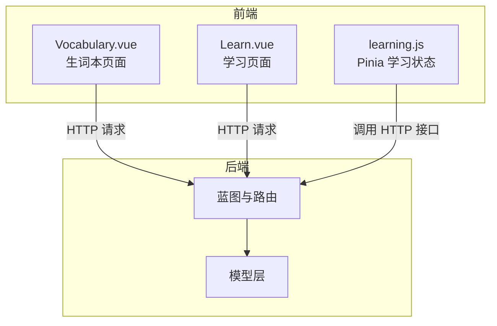
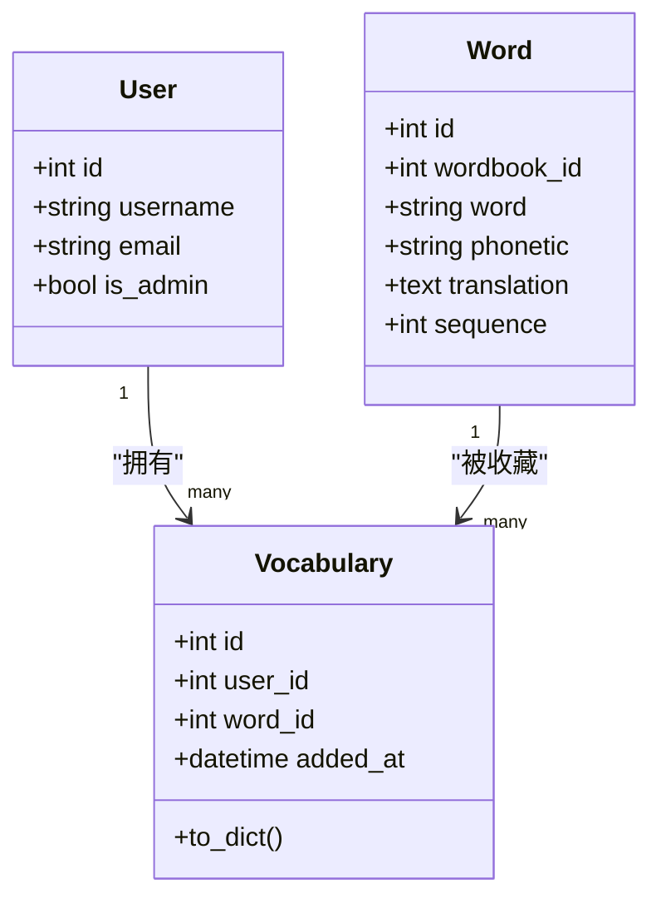
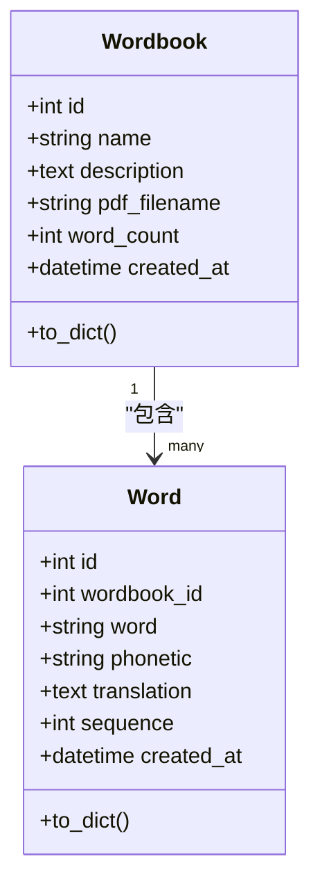
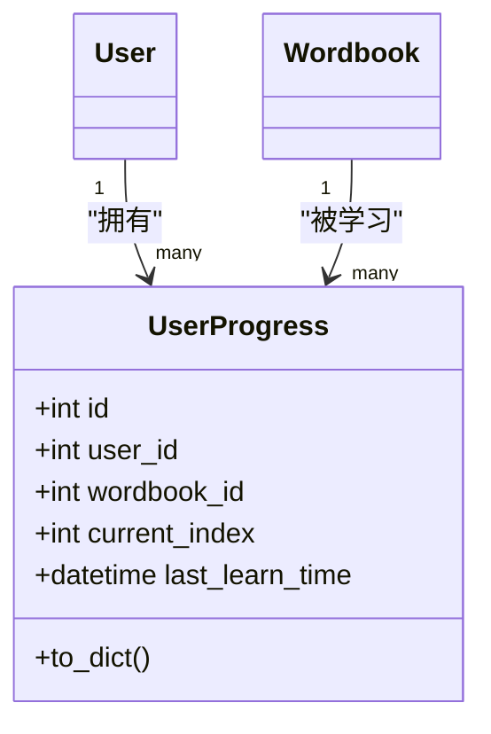
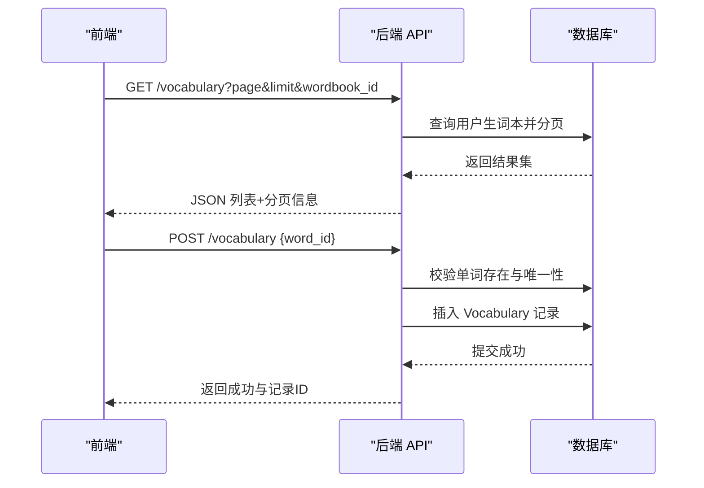
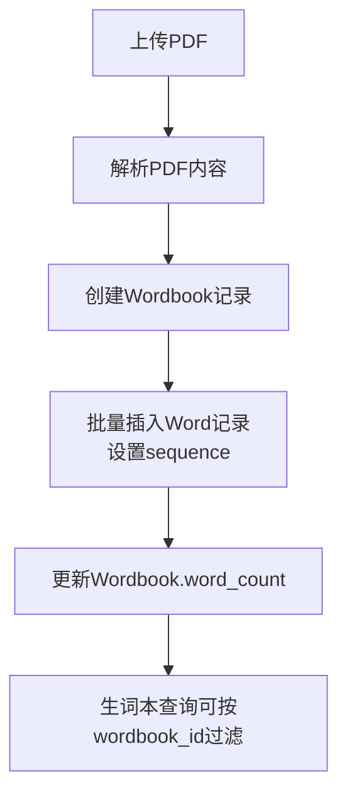
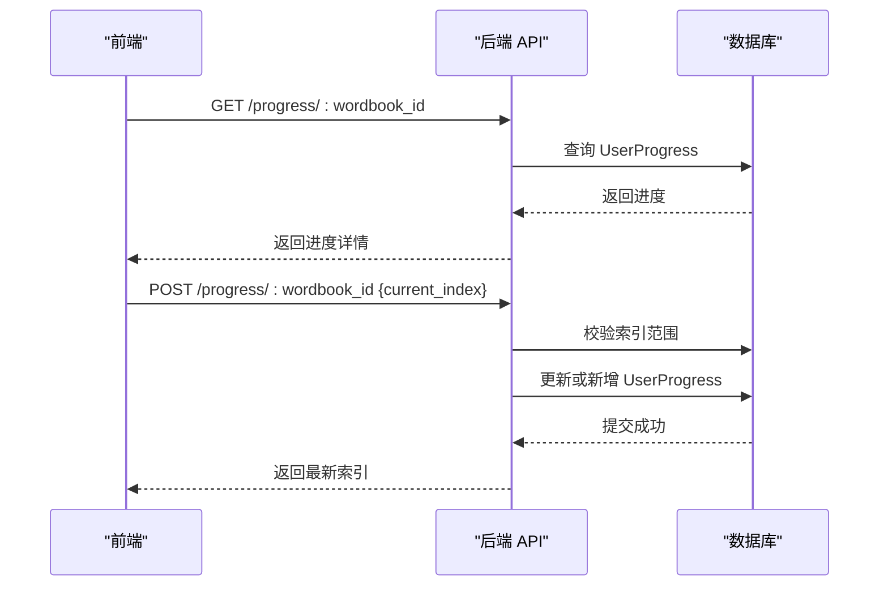
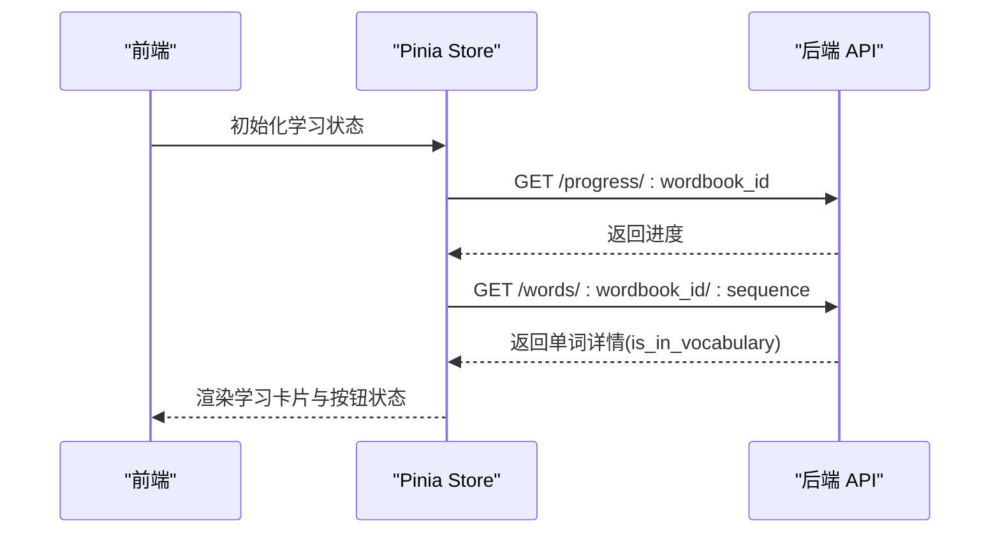
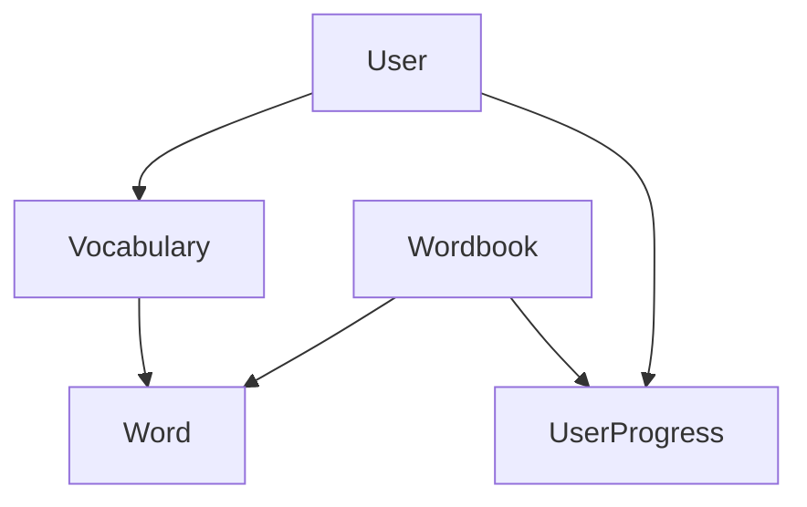

# 生词本管理

<cite>
**本文引用的文件**
- [backend/app/models/vocabulary.py](file://backend/app/models/vocabulary.py)
- [backend/app/models/wordbook.py](file://backend/app/models/wordbook.py)
- [backend/app/models/word.py](file://backend/app/models/word.py)
- [backend/app/models/user.py](file://backend/app/models/user.py)
- [backend/app/models/user_progress.py](file://backend/app/models/user_progress.py)
- [backend/app/routes/vocabulary.py](file://backend/app/routes/vocabulary.py)
- [backend/app/routes/wordbooks.py](file://backend/app/routes/wordbooks.py)
- [backend/app/routes/words.py](file://backend/app/routes/words.py)
- [backend/app/routes/progress.py](file://backend/app/routes/progress.py)
- [backend/app/services/pdf_parser.py](file://backend/app/services/pdf_parser.py)
- [frontend/src/views/Vocabulary.vue](file://frontend/src/views/Vocabulary.vue)
- [frontend/src/views/Learn.vue](file://frontend/src/views/Learn.vue)
- [frontend/src/stores/learning.js](file://frontend/src/stores/learning.js)
- [README_CN.md](file://README_CN.md)
</cite>

## 目录
1. [简介](#简介)
2. [项目结构](#项目结构)
3. [核心组件](#核心组件)
4. [架构总览](#架构总览)
5. [详细组件分析](#详细组件分析)
6. [依赖关系分析](#依赖关系分析)
7. [性能考量](#性能考量)
8. [故障排查指南](#故障排查指南)
9. [结论](#结论)
10. [附录](#附录)

## 简介
本文件围绕“生词本管理”主题，系统性梳理后端模型、路由与前端界面的实现，重点覆盖：
- 生词本模型设计与字段含义（用户关联、单词关联、添加时间）
- 生词本 CRUD 与批量管理能力
- 生词本与单词书的关系、差异与数据同步策略
- 复习进度与学习行为的记录机制
- 前端生词本界面设计、单词卡片展示与学习效果评估
- 最佳实践与用户体验优化建议

## 项目结构
该项目采用前后端分离架构：
- 后端：Flask 蓝图组织 API，SQLAlchemy 定义模型，提供生词本、单词书、单词与学习进度接口
- 前端：Vue 3 + Pinia 管理学习状态，提供生词本与学习页面



图表来源
- [frontend/src/views/Vocabulary.vue](file://frontend/src/views/Vocabulary.vue#L1-L207)
- [frontend/src/views/Learn.vue](file://frontend/src/views/Learn.vue#L1-L342)
- [frontend/src/stores/learning.js](file://frontend/src/stores/learning.js#L1-L112)
- [backend/app/routes/vocabulary.py](file://backend/app/routes/vocabulary.py#L1-L103)
- [backend/app/routes/wordbooks.py](file://backend/app/routes/wordbooks.py#L1-L159)
- [backend/app/routes/words.py](file://backend/app/routes/words.py#L1-L65)
- [backend/app/routes/progress.py](file://backend/app/routes/progress.py#L1-L115)

章节来源
- [README_CN.md](file://README_CN.md#L1-L84)

## 核心组件
- 生词本模型 Vocabulary：记录用户与单词的关联及添加时间，提供序列化方法
- 单词书模型 Wordbook：管理单词集合、统计单词数量、记录创建时间
- 单词模型 Word：承载单词文本、音标、释义、顺序与所属单词书
- 用户模型 User：用户基本信息与关联关系（进度、生词本）
- 学习进度模型 UserProgress：记录用户在单词书中的当前索引与最后学习时间
- 路由模块：生词本、单词书、单词、学习进度的 API
- 前端视图与状态：生词本页面、学习页面与 Pinia 学习状态

章节来源
- [backend/app/models/vocabulary.py](file://backend/app/models/vocabulary.py#L1-L26)
- [backend/app/models/wordbook.py](file://backend/app/models/wordbook.py#L1-L25)
- [backend/app/models/word.py](file://backend/app/models/word.py#L1-L29)
- [backend/app/models/user.py](file://backend/app/models/user.py#L1-L26)
- [backend/app/models/user_progress.py](file://backend/app/models/user_progress.py#L1-L29)
- [backend/app/routes/vocabulary.py](file://backend/app/routes/vocabulary.py#L1-L103)
- [backend/app/routes/wordbooks.py](file://backend/app/routes/wordbooks.py#L1-L159)
- [backend/app/routes/words.py](file://backend/app/routes/words.py#L1-L65)
- [backend/app/routes/progress.py](file://backend/app/routes/progress.py#L1-L115)
- [frontend/src/views/Vocabulary.vue](file://frontend/src/views/Vocabulary.vue#L1-L207)
- [frontend/src/views/Learn.vue](file://frontend/src/views/Learn.vue#L1-L342)
- [frontend/src/stores/learning.js](file://frontend/src/stores/learning.js#L1-L112)

## 架构总览
后端以蓝图划分功能域，模型间通过外键建立关联；前端通过 HTTP 与后端交互，Pinia 统一管理学习状态。

```mermaid
graph LR
subgraph "模型层"
U["User"]
WB["Wordbook"]
W["Word"]
V["Vocabulary"]
UP["UserProgress"]
end
subgraph "路由层"
RV["vocabulary_bp"]
RWB["wordbooks_bp"]
RW["words_bp"]
RP["progress_bp"]
end
U --> V
WB <- --> W
U --> UP
WB --> UP
V --> W
RV --> V
RWB --> WB
RW --> W
RP --> UP
```

图表来源
- [backend/app/models/user.py](file://backend/app/models/user.py#L1-L26)
- [backend/app/models/wordbook.py](file://backend/app/models/wordbook.py#L1-L25)
- [backend/app/models/word.py](file://backend/app/models/word.py#L1-L29)
- [backend/app/models/vocabulary.py](file://backend/app/models/vocabulary.py#L1-L26)
- [backend/app/models/user_progress.py](file://backend/app/models/user_progress.py#L1-L29)
- [backend/app/routes/vocabulary.py](file://backend/app/routes/vocabulary.py#L1-L103)
- [backend/app/routes/wordbooks.py](file://backend/app/routes/wordbooks.py#L1-L159)
- [backend/app/routes/words.py](file://backend/app/routes/words.py#L1-L65)
- [backend/app/routes/progress.py](file://backend/app/routes/progress.py#L1-L115)

## 详细组件分析

### 生词本模型与关系
- 字段与约束
  - id：主键
  - user_id：外键关联用户
  - word_id：外键关联单词
  - added_at：添加时间，默认为当前 UTC 时间
  - 唯一约束：user_id + word_id，避免重复添加
- 关系
  - 与 Word 的一对一反向关系，便于序列化输出单词详情
- 序列化
  - to_dict 输出包含用户 ID、单词 ID、添加时间与单词对象



图表来源
- [backend/app/models/user.py](file://backend/app/models/user.py#L1-L26)
- [backend/app/models/word.py](file://backend/app/models/word.py#L1-L29)
- [backend/app/models/vocabulary.py](file://backend/app/models/vocabulary.py#L1-L26)

章节来源
- [backend/app/models/vocabulary.py](file://backend/app/models/vocabulary.py#L1-L26)
- [backend/app/models/word.py](file://backend/app/models/word.py#L1-L29)
- [backend/app/models/user.py](file://backend/app/models/user.py#L1-L26)

### 单词书与单词模型
- Wordbook
  - 字段：id、name、description、pdf_filename、word_count、created_at
  - 关系：与 Word 的一对多关系，动态加载并级联删除孤儿单词
  - 序列化：to_dict 输出基础元信息
- Word
  - 字段：id、wordbook_id、word、phonetic、translation、sequence、created_at
  - 唯一约束：wordbook_id + sequence，保证顺序唯一性
  - 索引：wordbook_id + sequence，提升查询效率
  - 序列化：to_dict 输出单词详情



图表来源
- [backend/app/models/wordbook.py](file://backend/app/models/wordbook.py#L1-L25)
- [backend/app/models/word.py](file://backend/app/models/word.py#L1-L29)

章节来源
- [backend/app/models/wordbook.py](file://backend/app/models/wordbook.py#L1-L25)
- [backend/app/models/word.py](file://backend/app/models/word.py#L1-L29)

### 学习进度模型
- 字段：id、user_id、wordbook_id、current_index、last_learn_time、created_at
- 唯一约束：user_id + wordbook_id，确保每个用户对每本单词书仅有一条进度记录
- 索引：user_id + wordbook_id，加速查询
- 序列化：to_dict 输出进度详情



图表来源
- [backend/app/models/user_progress.py](file://backend/app/models/user_progress.py#L1-L29)
- [backend/app/models/user.py](file://backend/app/models/user.py#L1-L26)
- [backend/app/models/wordbook.py](file://backend/app/models/wordbook.py#L1-L25)

章节来源
- [backend/app/models/user_progress.py](file://backend/app/models/user_progress.py#L1-L29)

### 生词本 CRUD 与批量管理
- 获取生词本
  - 支持分页、按单词书过滤、按添加时间倒序
  - 返回生词本列表、总数、页码与限制
- 添加到生词本
  - 校验单词存在性，避免重复添加
  - 成功后返回新记录 ID
- 从生词本移除
  - 支持按生词本项 ID 或单词 ID 移除
- 批量管理
  - 通过单词书路由批量导入 PDF，生成单词书与单词集合
  - 通过单词路由批量获取单词（预加载）



图表来源
- [backend/app/routes/vocabulary.py](file://backend/app/routes/vocabulary.py#L10-L41)
- [backend/app/routes/vocabulary.py](file://backend/app/routes/vocabulary.py#L44-L71)

章节来源
- [backend/app/routes/vocabulary.py](file://backend/app/routes/vocabulary.py#L1-L103)

### 生词本与单词书的关系与数据同步
- 关系
  - 单词书是单词的容器，单词通过 sequence 有序排列
  - 生词本记录的是“用户-单词”的关系，不直接绑定单词书
- 数据同步策略
  - 导入 PDF 时，解析单词并按顺序写入 Word 表，同时更新 Wordbook.word_count
  - 生词本查询可选择按单词书过滤，返回单词书名称以便用户识别来源
- 区别与联系
  - 单词书：系统层面的词库集合，面向内容管理
  - 生词本：个人层面的收藏集合，面向学习行为



图表来源
- [backend/app/routes/wordbooks.py](file://backend/app/routes/wordbooks.py#L68-L130)
- [backend/app/services/pdf_parser.py](file://backend/app/services/pdf_parser.py#L1-L43)
- [backend/app/models/wordbook.py](file://backend/app/models/wordbook.py#L1-L25)
- [backend/app/models/word.py](file://backend/app/models/word.py#L1-L29)

章节来源
- [backend/app/routes/wordbooks.py](file://backend/app/routes/wordbooks.py#L1-L159)
- [backend/app/services/pdf_parser.py](file://backend/app/services/pdf_parser.py#L1-L43)

### 复习进度与学习行为
- 学习进度记录
  - GET /progress/:wordbook_id 返回当前索引、总词数、百分比与最后学习时间
  - POST /progress/:wordbook_id 更新当前索引并刷新最后学习时间
  - POST /progress/:wordbook_id/reset 重置进度
- 生词本与学习的联动
  - 学习页面在获取单词时检查是否已在生词本中
  - 支持一键加入/移除生词本，实时更新按钮状态



图表来源
- [backend/app/routes/progress.py](file://backend/app/routes/progress.py#L11-L50)
- [backend/app/routes/progress.py](file://backend/app/routes/progress.py#L53-L95)

章节来源
- [backend/app/routes/progress.py](file://backend/app/routes/progress.py#L1-L115)
- [frontend/src/stores/learning.js](file://frontend/src/stores/learning.js#L16-L50)

### 前端生词本界面与学习体验
- 生词本页面
  - 展示单词英文、音标、释义与来源单词书、添加时间
  - 支持分页与移除操作
- 学习页面
  - 卡片式展示，点击翻转显示释义
  - 进度条与索引显示，快捷键支持空格翻转、左右切换、S 键加入/移除生词本
  - 完成提示与重置功能



图表来源
- [frontend/src/views/Learn.vue](file://frontend/src/views/Learn.vue#L136-L146)
- [frontend/src/stores/learning.js](file://frontend/src/stores/learning.js#L16-L37)
- [backend/app/routes/words.py](file://backend/app/routes/words.py#L10-L38)

章节来源
- [frontend/src/views/Vocabulary.vue](file://frontend/src/views/Vocabulary.vue#L1-L207)
- [frontend/src/views/Learn.vue](file://frontend/src/views/Learn.vue#L1-L342)
- [frontend/src/stores/learning.js](file://frontend/src/stores/learning.js#L1-L112)

## 依赖关系分析
- 模型耦合
  - User 与 Vocabulary：一对多，用户拥有多个生词本项
  - Wordbook 与 Word：一对多，单词书包含多个单词
  - UserProgress 与 User/Wordbook：多对一，记录用户在单词书中的进度
- 路由依赖
  - vocabulary 路由依赖 Word 与 Vocabulary
  - words 路由依赖 Word 与 Vocabulary
  - progress 路由依赖 UserProgress 与 Wordbook
- 前端依赖
  - Learn.vue 依赖 Pinia 学习状态 store
  - Vocabulary.vue 依赖 HTTP 接口获取生词本数据



图表来源
- [backend/app/models/user.py](file://backend/app/models/user.py#L1-L26)
- [backend/app/models/vocabulary.py](file://backend/app/models/vocabulary.py#L1-L26)
- [backend/app/models/wordbook.py](file://backend/app/models/wordbook.py#L1-L25)
- [backend/app/models/word.py](file://backend/app/models/word.py#L1-L29)
- [backend/app/models/user_progress.py](file://backend/app/models/user_progress.py#L1-L29)

章节来源
- [backend/app/models/user.py](file://backend/app/models/user.py#L1-L26)
- [backend/app/models/vocabulary.py](file://backend/app/models/vocabulary.py#L1-L26)
- [backend/app/models/wordbook.py](file://backend/app/models/wordbook.py#L1-L25)
- [backend/app/models/word.py](file://backend/app/models/word.py#L1-L29)
- [backend/app/models/user_progress.py](file://backend/app/models/user_progress.py#L1-L29)

## 性能考量
- 查询优化
  - Wordbook 与 Word 的组合索引 idx_wordbook_sequence，提升批量查询与范围查询性能
  - UserProgress 的复合索引 idx_user_wordbook，加速用户进度查询
- 分页与批量
  - 生词本与单词列表均支持分页，避免一次性加载大量数据
  - 批量获取单词用于预加载，减少请求次数
- 缓存与状态
  - 前端 Pinia 管理学习状态，避免重复网络请求
  - 卡片翻转与按钮状态即时更新，减少不必要的重渲染

章节来源
- [backend/app/models/word.py](file://backend/app/models/word.py#L15-L18)
- [backend/app/models/user_progress.py](file://backend/app/models/user_progress.py#L14-L17)
- [backend/app/routes/vocabulary.py](file://backend/app/routes/vocabulary.py#L16-L26)
- [backend/app/routes/words.py](file://backend/app/routes/words.py#L41-L64)
- [frontend/src/stores/learning.js](file://frontend/src/stores/learning.js#L1-L112)

## 故障排查指南
- 生词本相关
  - 添加失败：确认传入的 word_id 是否存在，避免重复添加
  - 移除失败：确认当前用户是否拥有该记录
- 单词书与 PDF 导入
  - PDF 解析失败：检查文件格式与内容格式是否符合解析规则（英文单词 + 音标 + 中文释义）
  - 导入后单词数为 0：确认 PDF 文本可读取且匹配正则模式
- 学习进度
  - 进度更新失败：确认 current_index 在有效范围内
  - 进度重置：确认用户身份与单词书存在性

章节来源
- [backend/app/routes/vocabulary.py](file://backend/app/routes/vocabulary.py#L44-L103)
- [backend/app/routes/wordbooks.py](file://backend/app/routes/wordbooks.py#L68-L135)
- [backend/app/routes/progress.py](file://backend/app/routes/progress.py#L53-L115)
- [backend/app/services/pdf_parser.py](file://backend/app/services/pdf_parser.py#L1-L43)

## 结论
本项目通过清晰的模型设计与路由划分，实现了稳定的生词本管理与学习进度追踪。前端以卡片与进度条为核心交互，配合快捷键与状态管理，提供了良好的学习体验。后续可在复习提醒、间隔重复算法与导出/打印功能上进一步扩展，以满足更高级的记忆与复习需求。

## 附录
- 复习提醒与间隔重复建议
  - 当前系统未内置复习提醒与间隔重复算法，可在 UserProgress 中扩展字段（如下次复习时间、难度等级），并在前端或定时任务中触发提醒
- 导出与打印
  - 可在后端提供导出接口，将生词本数据转换为 CSV/Excel/PDF；前端可提供打印样式与分页控制
- 用户体验优化
  - 增加搜索与筛选（按单词书、添加时间、是否已掌握）
  - 提供学习统计与效果评估（正确率、复习频率、遗忘曲线趋势）