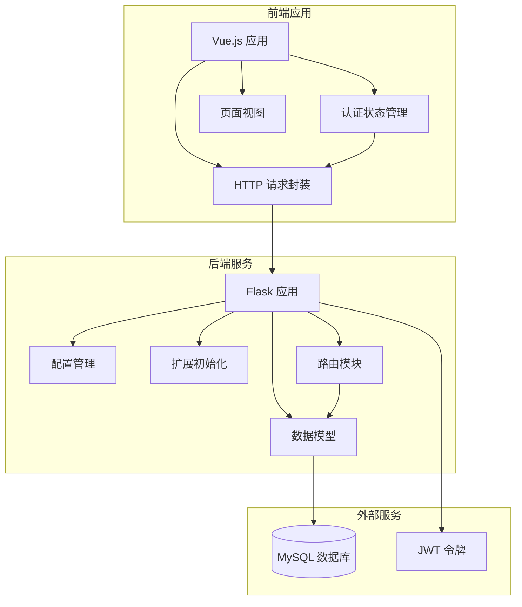
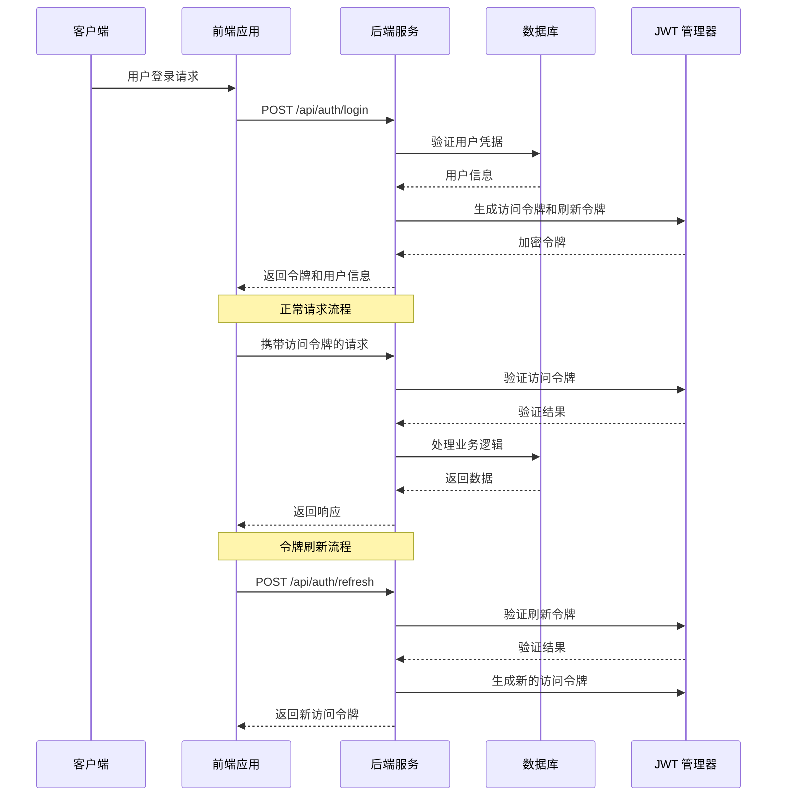
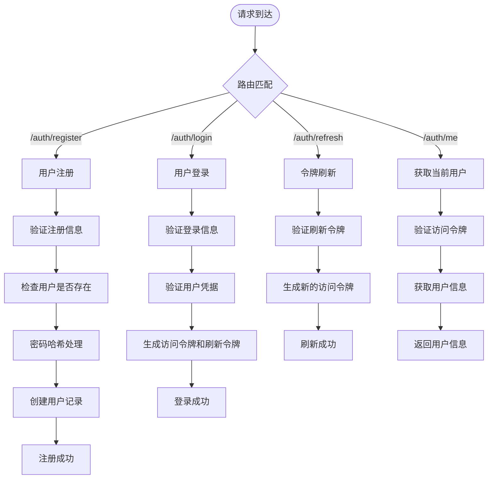
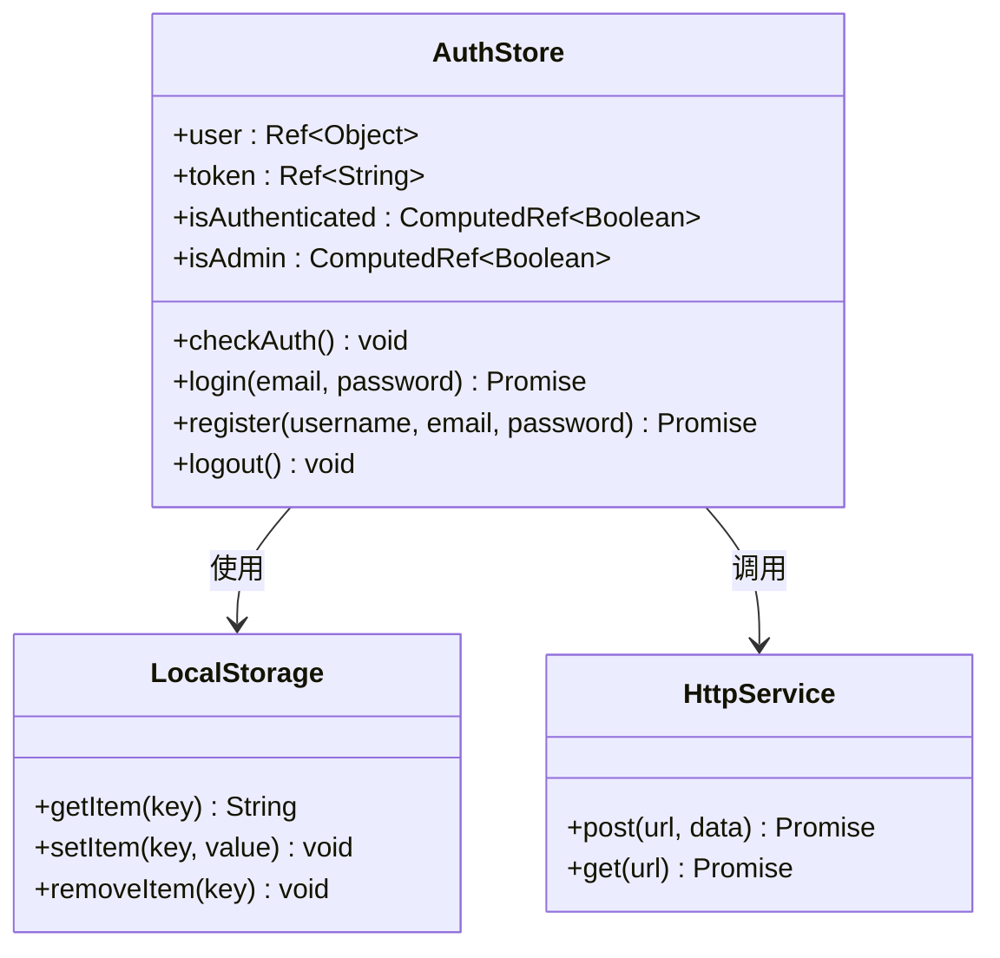
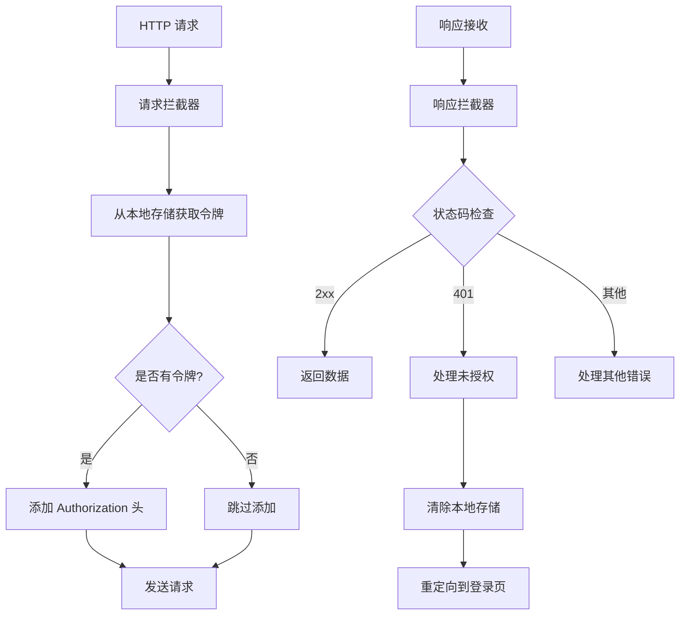
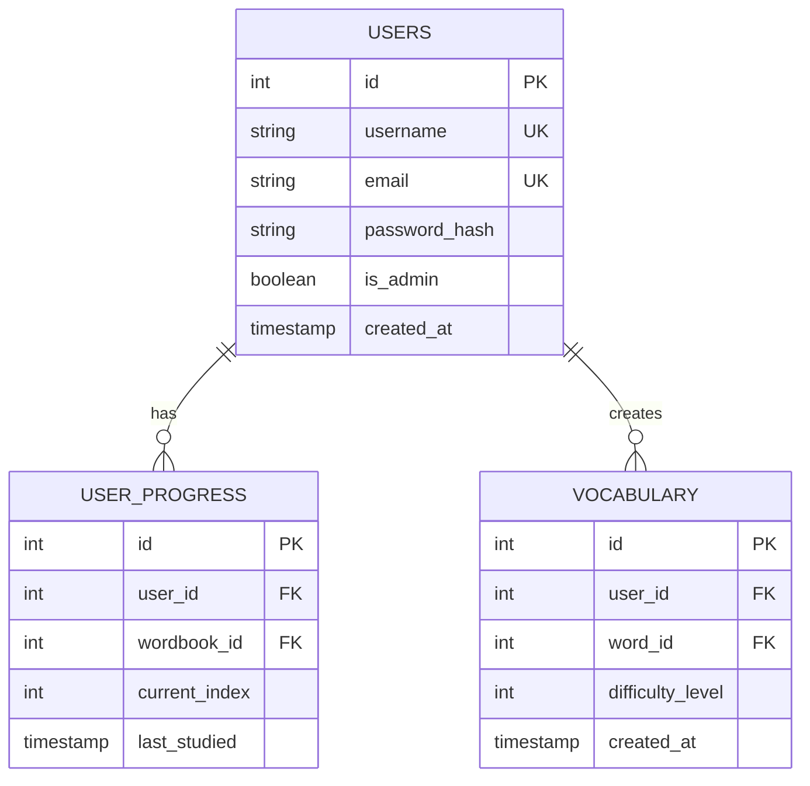
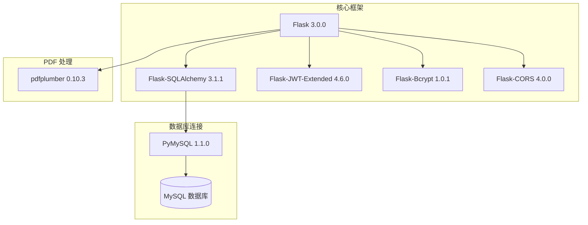
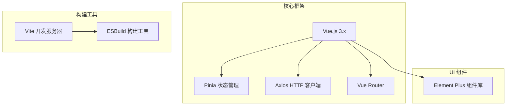
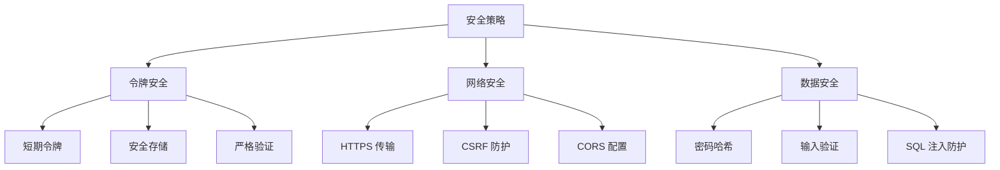
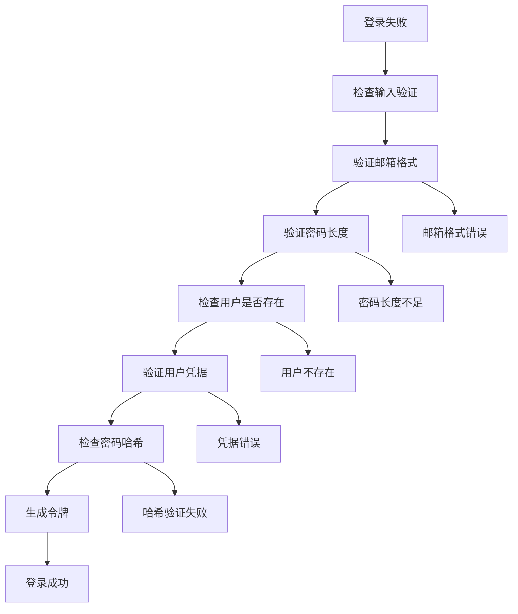

# JWT 认证机制

<cite>
**本文档引用的文件**
- [backend/app/config.py](file://backend/app/config.py)
- [backend/app/extensions.py](file://backend/app/extensions.py)
- [backend/app/__init__.py](file://backend/app/__init__.py)
- [backend/app/routes/auth.py](file://backend/app/routes/auth.py)
- [backend/app/models/user.py](file://backend/app/models/user.py)
- [backend/requirements.txt](file://backend/requirements.txt)
- [frontend/src/stores/auth.js](file://frontend/src/stores/auth.js)
- [frontend/src/api/http.js](file://frontend/src/api/http.js)
- [frontend/src/views/Login.vue](file://frontend/src/views/Login.vue)
- [frontend/src/views/Home.vue](file://frontend/src/views/Home.vue)
- [docker-compose.yml](file://docker-compose.yml)
</cite>

## 目录
1. [简介](#简介)
2. [项目结构](#项目结构)
3. [核心组件](#核心组件)
4. [架构概览](#架构概览)
5. [详细组件分析](#详细组件分析)
6. [依赖关系分析](#依赖关系分析)
7. [性能考虑](#性能考虑)
8. [故障排除指南](#故障排除指南)
9. [结论](#结论)

## 简介

本项目实现了基于 JWT（JSON Web Token）的认证机制，采用 Flask-JWT-Extended 扩展构建完整的用户身份验证系统。该系统支持访问令牌（Access Token）和刷新令牌（Refresh Token）的双重认证模式，提供安全的用户会话管理和自动续期功能。

JWT 认证机制通过无状态的身份验证方式，将用户信息加密存储在令牌中，服务器无需维护会话状态，提高了系统的可扩展性和性能。系统实现了标准的 OAuth 2.0 认证流程，包括用户注册、登录、令牌签发、验证和自动刷新等完整功能。

## 项目结构

项目采用前后端分离架构，后端使用 Flask 框架，前端使用 Vue.js 技术栈，整体结构清晰，职责分明：

**图表来源**
- [backend/app/__init__.py](file://backend/app/__init__.py#L6-L36)
- [frontend/src/stores/auth.js](file://frontend/src/stores/auth.js#L1-L59)

**章节来源**
- [backend/app/__init__.py](file://backend/app/__init__.py#L1-L37)
- [docker-compose.yml](file://docker-compose.yml#L1-L59)

## 核心组件

### JWT 配置与设置

系统使用 Flask-JWT-Extended 扩展实现 JWT 认证，配置参数定义在配置文件中：

- **访问令牌有效期**：1小时（短期有效，降低泄露风险）
- **刷新令牌有效期**：30天（长期有效，支持用户长期保持登录状态）
- **密钥管理**：独立的 JWT 密钥，与 Flask 应用密钥分离

### 认证流程组件

系统包含以下核心认证组件：

1. **用户认证服务**：处理用户注册、登录和身份验证
2. **令牌管理服务**：负责令牌的生成、验证和刷新
3. **前端状态管理**：维护用户的登录状态和令牌信息
4. **HTTP 请求拦截器**：自动添加认证头和处理认证错误

**章节来源**
- [backend/app/config.py](file://backend/app/config.py#L20-L23)
- [backend/requirements.txt](file://backend/requirements.txt#L3-L3)

## 架构概览

JWT 认证系统采用分层架构设计，确保各组件职责明确，便于维护和扩展：

**图表来源**
- [backend/app/routes/auth.py](file://backend/app/routes/auth.py#L46-L80)
- [frontend/src/api/http.js](file://frontend/src/api/http.js#L11-L45)

**章节来源**
- [backend/app/routes/auth.py](file://backend/app/routes/auth.py#L1-L93)
- [frontend/src/api/http.js](file://frontend/src/api/http.js#L1-L48)

## 详细组件分析

### 后端认证服务

#### 认证路由模块

后端认证服务通过 Flask 蓝图实现，包含完整的用户认证流程：

**图表来源**
- [backend/app/routes/auth.py](file://backend/app/routes/auth.py#L8-L92)

#### 访问令牌与刷新令牌

系统实现了标准的双令牌认证模式：

| 特性 | 访问令牌 | 刷新令牌 |
|------|----------|----------|
| **有效期** | 1小时 | 30天 |
| **用途** | API 访问授权 | 获取新的访问令牌 |
| **存储位置** | 浏览器内存 | 浏览器本地存储 |
| **安全性** | 短期有效，降低泄露风险 | 长期有效，支持续期 |
| **使用场景** | 日常 API 请求 | 令牌过期时自动续期 |

**章节来源**
- [backend/app/config.py](file://backend/app/config.py#L21-L23)
- [backend/app/routes/auth.py](file://backend/app/routes/auth.py#L64-L80)

### 前端认证管理

#### Pinia 状态管理

前端使用 Pinia 实现认证状态管理，提供响应式的用户状态跟踪：

**图表来源**
- [frontend/src/stores/auth.js](file://frontend/src/stores/auth.js#L5-L58)

#### HTTP 请求拦截器

前端实现了智能的请求拦截机制，自动处理认证令牌和错误响应：

**图表来源**
- [frontend/src/api/http.js](file://frontend/src/api/http.js#L11-L45)

**章节来源**
- [frontend/src/stores/auth.js](file://frontend/src/stores/auth.js#L1-L59)
- [frontend/src/api/http.js](file://frontend/src/api/http.js#L1-L48)

### 数据模型设计

#### 用户模型

系统使用 SQLAlchemy 定义用户数据模型，支持完整的用户信息存储：

**图表来源**
- [backend/app/models/user.py](file://backend/app/models/user.py#L4-L25)

**章节来源**
- [backend/app/models/user.py](file://backend/app/models/user.py#L1-L26)

## 依赖关系分析

### 后端依赖架构

系统后端依赖关系清晰，各组件职责明确：

**图表来源**
- [backend/requirements.txt](file://backend/requirements.txt#L1-L11)

### 前端依赖架构

前端使用现代化的 Vue.js 生态系统，组件化开发：

**图表来源**
- [frontend/package.json](file://frontend/package.json)

**章节来源**
- [backend/requirements.txt](file://backend/requirements.txt#L1-L11)

## 性能考虑

### 令牌优化策略

系统在性能方面采用了多项优化措施：

1. **短生命周期设计**：访问令牌仅1小时有效期，减少令牌泄露风险
2. **智能缓存机制**：前端仅在内存中存储访问令牌，避免频繁磁盘操作
3. **异步处理**：所有认证操作采用异步处理，提升用户体验
4. **连接池管理**：数据库连接使用连接池，提高并发性能

### 安全性优化

**章节来源**
- [backend/app/config.py](file://backend/app/config.py#L21-L23)
- [frontend/src/api/http.js](file://frontend/src/api/http.js#L11-L45)

## 故障排除指南

### 常见问题诊断

#### 令牌过期问题

当访问令牌过期时，系统会自动处理：

1. **前端检测**：HTTP 拦截器检测 401 状态码
2. **自动清理**：清除本地存储的令牌和用户信息
3. **页面重定向**：自动跳转到登录页面
4. **用户体验**：提示用户重新登录

#### 登录失败排查

**图表来源**
- [backend/app/routes/auth.py](file://backend/app/routes/auth.py#L46-L62)

#### 数据库连接问题

系统提供了完善的数据库连接配置和错误处理：

1. **环境变量配置**：支持通过环境变量配置数据库连接
2. **连接池管理**：自动管理数据库连接池
3. **健康检查**：Docker 环境下提供数据库健康检查
4. **异常处理**：捕获并处理数据库连接异常

**章节来源**
- [backend/app/routes/auth.py](file://backend/app/routes/auth.py#L8-L43)
- [docker-compose.yml](file://docker-compose.yml#L4-L21)

## 结论

本项目的 JWT 认证机制实现了现代 Web 应用的标准安全实践，具有以下特点：

### 技术优势

1. **安全性高**：采用双令牌机制，访问令牌短期有效，降低安全风险
2. **性能优秀**：无状态设计，支持水平扩展
3. **用户体验好**：自动令牌续期，减少用户手动登录频率
4. **代码质量高**：模块化设计，职责清晰，易于维护

### 最佳实践

1. **密钥管理**：独立的 JWT 密钥，定期轮换
2. **令牌存储**：敏感信息仅存储在内存中
3. **错误处理**：完善的错误处理和用户反馈机制
4. **安全配置**：HTTPS 传输，CORS 配置，CSRF 防护

### 改进建议

1. **令牌撤销**：实现黑名单机制支持令牌主动撤销
2. **多设备支持**：支持同一用户多设备同时登录
3. **审计日志**：记录重要的认证事件用于安全审计
4. **速率限制**：防止暴力破解攻击

该认证机制为单词学习平台提供了坚实的安全基础，确保用户数据的安全性和系统的稳定性。