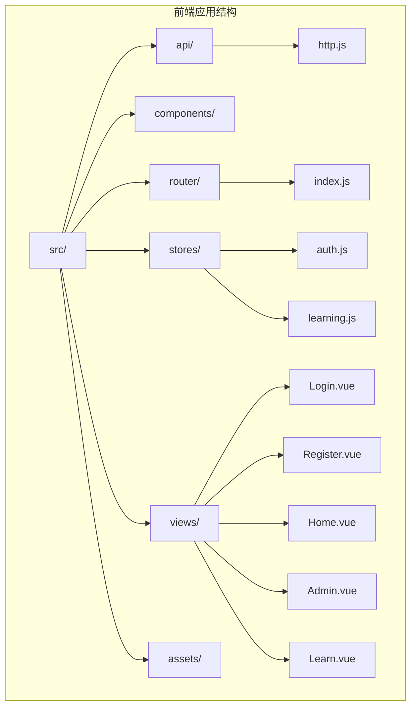
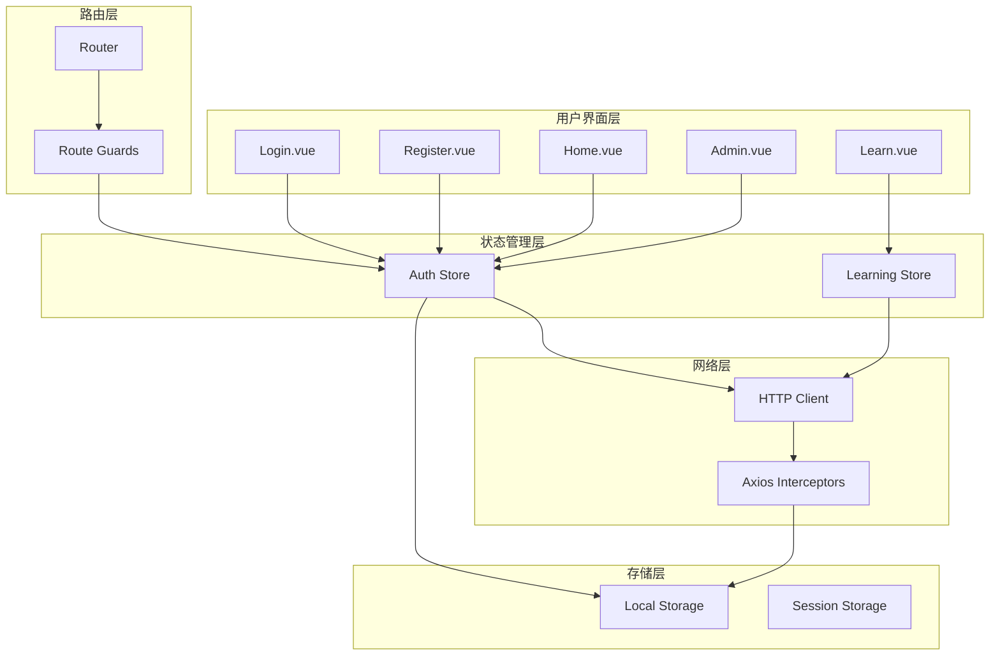
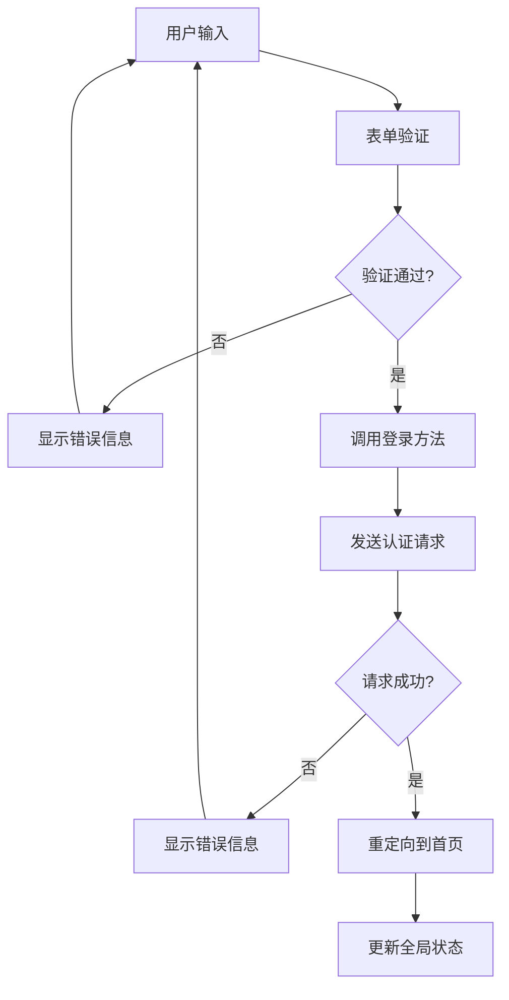
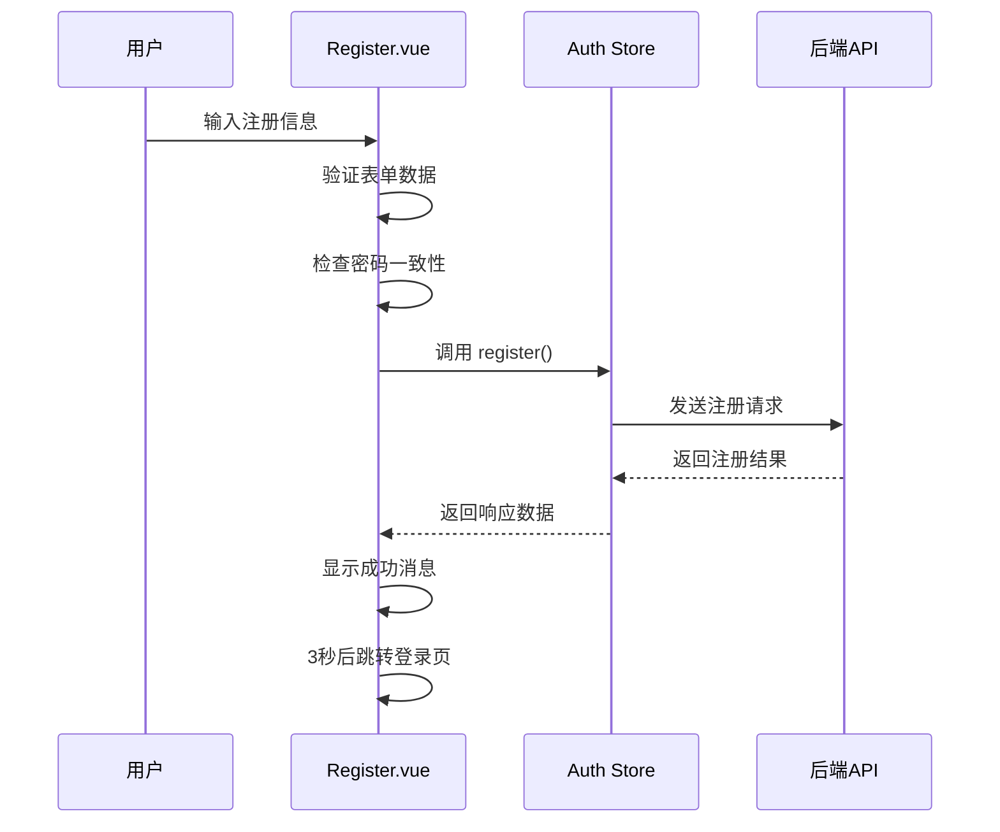
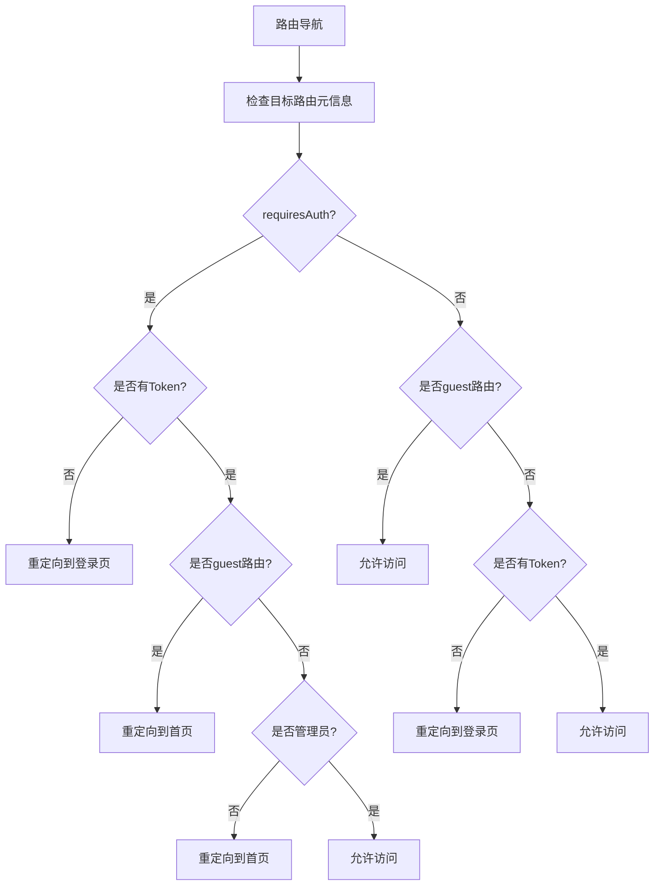
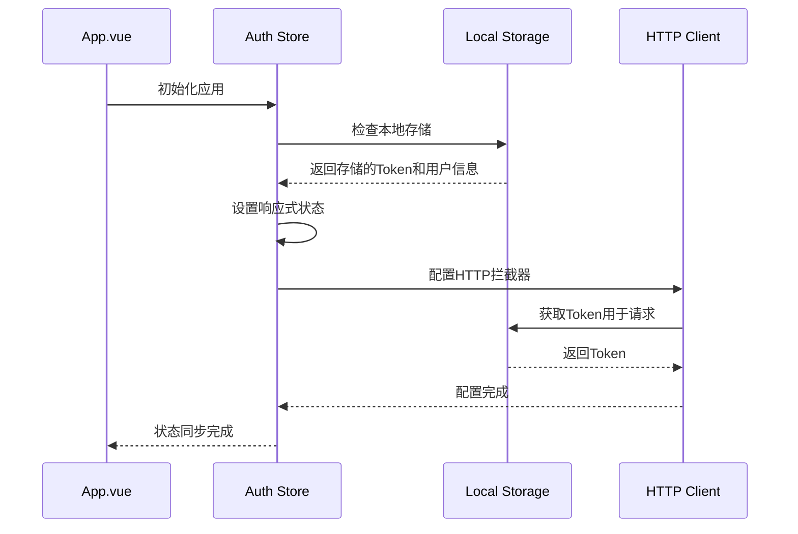
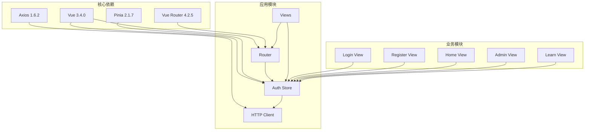

# 前端认证状态管理

<cite>
**本文档引用的文件**
- [frontend/src/stores/auth.js](file://frontend/src/stores/auth.js)
- [frontend/src/router/index.js](file://frontend/src/router/index.js)
- [frontend/src/views/Login.vue](file://frontend/src/views/Login.vue)
- [frontend/src/views/Register.vue](file://frontend/src/views/Register.vue)
- [frontend/src/api/http.js](file://frontend/src/api/http.js)
- [frontend/src/App.vue](file://frontend/src/App.vue)
- [frontend/src/main.js](file://frontend/src/main.js)
- [frontend/src/views/Home.vue](file://frontend/src/views/Home.vue)
- [frontend/src/views/Admin.vue](file://frontend/src/views/Admin.vue)
- [frontend/src/views/Learn.vue](file://frontend/src/views/Learn.vue)
- [frontend/package.json](file://frontend/package.json)
</cite>

## 目录
1. [简介](#简介)
2. [项目结构](#项目结构)
3. [核心组件](#核心组件)
4. [架构概览](#架构概览)
5. [详细组件分析](#详细组件分析)
6. [依赖关系分析](#依赖关系分析)
7. [性能考虑](#性能考虑)
8. [故障排除指南](#故障排除指南)
9. [结论](#结论)

## 简介

本项目是一个基于 Vue 3 和 Pinia 的单词学习网站，实现了完整的前端认证状态管理系统。该系统采用现代化的前端技术栈，包括 Vue 3 Composition API、Pinia 状态管理、Vue Router 路由守卫和 Axios HTTP 客户端，为用户提供安全、可靠的认证体验。

认证系统的核心特性包括：
- 基于 Pinia 的响应式状态管理
- 持久化的本地存储策略
- 全面的路由权限控制
- 用户友好的错误处理机制
- 实时的状态同步和恢复

## 项目结构

前端项目采用模块化组织方式，主要目录结构如下：

**图表来源**
- [frontend/src/main.js](file://frontend/src/main.js#L1-L13)
- [frontend/src/App.vue](file://frontend/src/App.vue#L1-L17)

**章节来源**
- [frontend/src/main.js](file://frontend/src/main.js#L1-L13)
- [frontend/package.json](file://frontend/package.json#L1-L22)

## 核心组件

### 认证状态管理器 (Auth Store)

认证状态管理器是整个认证系统的核心，基于 Pinia 的组合式 API 设计，提供了完整的用户认证生命周期管理。

#### 主要功能特性

1. **状态定义与计算属性**
   - 用户信息存储：`user` 响应式引用
   - 访问令牌管理：`token` 响应式引用
   - 登录状态检测：`isAuthenticated` 计算属性
   - 权限级别判断：`isAdmin` 计算属性

2. **本地存储集成**
   - 自动检查并恢复持久化状态
   - 实时同步认证数据到本地存储
   - 统一的存储策略管理

3. **认证操作接口**
   - 用户登录：`login()` 方法
   - 用户注册：`register()` 方法
   - 退出登录：`logout()` 方法
   - 状态检查：`checkAuth()` 方法

**章节来源**
- [frontend/src/stores/auth.js](file://frontend/src/stores/auth.js#L1-L59)

### HTTP 客户端配置

HTTP 客户端通过 Axios 实现，集成了请求和响应拦截器，确保认证令牌的自动管理和错误处理。

#### 关键配置

1. **基础配置**
   - API 基础 URL：`/api`
   - 超时设置：30 秒
   - 默认请求头：JSON 格式

2. **请求拦截器**
   - 自动添加 Authorization 头
   - 动态令牌注入
   - 请求预处理

3. **响应拦截器**
   - 统一响应数据提取
   - 错误状态码处理
   - Token 过期自动清理

**章节来源**
- [frontend/src/api/http.js](file://frontend/src/api/http.js#L1-L48)

## 架构概览

整个认证系统采用分层架构设计，各组件职责明确，耦合度低，便于维护和扩展。

**图表来源**
- [frontend/src/stores/auth.js](file://frontend/src/stores/auth.js#L1-L59)
- [frontend/src/router/index.js](file://frontend/src/router/index.js#L1-L64)
- [frontend/src/api/http.js](file://frontend/src/api/http.js#L1-L48)

## 详细组件分析

### 登录组件实现

登录组件采用 Vue 3 Composition API 设计，实现了完整的表单验证、错误处理和提交流程。

#### 表单设计与验证

**图表来源**
- [frontend/src/views/Login.vue](file://frontend/src/views/Login.vue#L57-L71)

#### 关键实现细节

1. **响应式表单状态**
   - 使用 `reactive` 创建表单对象
   - `loading` 状态控制按钮禁用
   - `error` 状态管理错误信息显示

2. **异步处理机制**
   - 使用 `try-catch-finally` 结构
   - 并发状态管理
   - 错误信息统一处理

3. **用户体验优化**
   - 加载状态反馈
   - 表单禁用避免重复提交
   - 成功后的自动跳转

**章节来源**
- [frontend/src/views/Login.vue](file://frontend/src/views/Login.vue#L1-L116)

### 注册组件实现

注册组件提供了完整的用户注册流程，包括表单验证、密码确认和成功反馈。

#### 注册流程设计

**图表来源**
- [frontend/src/views/Register.vue](file://frontend/src/views/Register.vue#L82-L106)

#### 核心功能特性

1. **双重密码验证**
   - 密码一致性检查
   - 最小长度验证
   - 即时错误反馈

2. **状态管理**
   - `success` 状态管理成功消息
   - `loading` 状态控制交互
   - 错误状态统一处理

3. **用户体验优化**
   - 成功后的自动跳转
   - 友好的反馈信息
   - 防止重复提交

**章节来源**
- [frontend/src/views/Register.vue](file://frontend/src/views/Register.vue#L1-L151)

### 路由守卫实现

路由守卫系统实现了全面的权限控制，确保只有经过认证的用户才能访问受保护的路由。

#### 权限控制逻辑

**图表来源**
- [frontend/src/router/index.js](file://frontend/src/router/index.js#L48-L61)

#### 权限分级设计

1. **访客路由 (`guest: true`)**
   - 未登录用户可访问
   - 已登录用户重定向到首页

2. **认证路由 (`requiresAuth: true`)**
   - 必须登录才能访问
   - 未登录自动跳转登录页

3. **管理员路由 (`requiresAdmin: true`)**
   - 需要管理员权限
   - 普通用户拒绝访问

**章节来源**
- [frontend/src/router/index.js](file://frontend/src/router/index.js#L1-L64)

### 认证状态同步机制

系统实现了多层状态同步机制，确保认证状态在应用重启或页面刷新后能够正确恢复。

#### 状态同步流程

**图表来源**
- [frontend/src/App.vue](file://frontend/src/App.vue#L13-L15)
- [frontend/src/stores/auth.js](file://frontend/src/stores/auth.js#L12-L20)

#### 同步策略

1. **应用启动时同步**
   - 在 `onMounted` 生命周期中执行
   - 自动恢复之前的登录状态
   - 避免手动刷新页面

2. **实时状态更新**
   - 登录成功后立即同步
   - 退出登录时清除状态
   - 网络异常时自动清理

3. **跨组件状态共享**
   - 全局状态管理
   - 组件间状态同步
   - 实时权限更新

**章节来源**
- [frontend/src/App.vue](file://frontend/src/App.vue#L1-L17)
- [frontend/src/stores/auth.js](file://frontend/src/stores/auth.js#L12-L20)

### 错误处理与用户体验优化

系统实现了多层次的错误处理机制，确保用户在各种异常情况下都能获得良好的体验。

#### 错误处理策略

1. **表单级错误处理**
   - 实时验证反馈
   - 友好的错误提示
   - 自动焦点管理

2. **网络级错误处理**
   - 请求超时处理
   - 网络异常提示
   - 自动重试机制

3. **认证级错误处理**
   - Token过期自动清理
   - 异常状态恢复
   - 用户友好提示

**章节来源**
- [frontend/src/views/Login.vue](file://frontend/src/views/Login.vue#L66-L70)
- [frontend/src/views/Register.vue](file://frontend/src/views/Register.vue#L93-L105)
- [frontend/src/api/http.js](file://frontend/src/api/http.js#L34-L44)

## 依赖关系分析

前端认证系统依赖关系清晰，各模块职责明确，形成了稳定的依赖层次结构。

**图表来源**
- [frontend/package.json](file://frontend/package.json#L11-L16)

### 依赖特点

1. **轻量级依赖栈**
   - 核心库版本稳定
   - 依赖关系简单明了
   - 避免循环依赖

2. **模块化设计**
   - 清晰的模块边界
   - 低耦合高内聚
   - 易于测试和维护

3. **向后兼容性**
   - 遵循语义化版本
   - 稳定的 API 接口
   - 平滑升级路径

**章节来源**
- [frontend/package.json](file://frontend/package.json#L1-L22)

## 性能考虑

系统在设计时充分考虑了性能优化，采用了多种策略来提升用户体验和系统响应速度。

### 性能优化策略

1. **懒加载路由**
   - 路由组件按需加载
   - 减少初始包体积
   - 提升首屏加载速度

2. **状态缓存**
   - 本地存储持久化
   - 避免重复认证
   - 快速状态恢复

3. **请求优化**
   - 自动令牌注入
   - 统一错误处理
   - 减少网络请求次数

### 性能监控建议

1. **关键指标监控**
   - 首屏渲染时间
   - 用户认证响应时间
   - 页面切换延迟

2. **资源使用监控**
   - JavaScript 内存使用
   - 网络请求统计
   - 存储空间使用

3. **用户体验指标**
   - 用户认证成功率
   - 错误处理效率
   - 页面可用性

## 故障排除指南

### 常见问题及解决方案

#### 认证状态不同步

**问题表现**
- 页面刷新后需要重新登录
- 用户信息显示异常

**解决步骤**
1. 检查本地存储中是否存在 `access_token` 和 `user` 数据
2. 验证 `checkAuth()` 方法是否在应用启动时正确调用
3. 确认 `localStorage` 的存储格式和数据完整性

**章节来源**
- [frontend/src/App.vue](file://frontend/src/App.vue#L13-L15)
- [frontend/src/stores/auth.js](file://frontend/src/stores/auth.js#L12-L20)

#### 路由权限控制失效

**问题表现**
- 未登录用户可以访问受保护路由
- 管理员权限验证失败

**解决步骤**
1. 检查路由元信息配置 (`requiresAuth`, `requiresAdmin`)
2. 验证 `localStorage` 中的用户权限信息
3. 确认路由守卫逻辑的执行顺序

**章节来源**
- [frontend/src/router/index.js](file://frontend/src/router/index.js#L48-L61)

#### HTTP 请求认证失败

**问题表现**
- API 请求返回 401 状态码
- 认证状态被意外清除

**解决步骤**
1. 检查请求拦截器中 Token 的注入逻辑
2. 验证响应拦截器的错误处理机制
3. 确认 Token 的有效期和刷新策略

**章节来源**
- [frontend/src/api/http.js](file://frontend/src/api/http.js#L11-L23)
- [frontend/src/api/http.js](file://frontend/src/api/http.js#L25-L45)

### 调试技巧

1. **浏览器开发者工具**
   - 使用 Network 面板监控 API 请求
   - 使用 Application 面板检查本地存储
   - 使用 Console 面板查看错误信息

2. **状态检查**
   - 在浏览器控制台检查 `useAuthStore()` 状态
   - 验证 Pinia DevTools 的状态变化
   - 监控响应式数据的更新

3. **日志记录**
   - 添加关键操作的日志输出
   - 记录认证状态的变化轨迹
   - 监控错误发生的上下文信息

## 结论

本前端认证状态管理系统展现了现代前端开发的最佳实践，通过合理的架构设计和完善的错误处理机制，为用户提供了安全、可靠、友好的认证体验。

### 系统优势

1. **架构清晰**
   - 分层设计明确
   - 模块职责单一
   - 依赖关系简单

2. **用户体验优秀**
   - 实时状态同步
   - 友好的错误提示
   - 流畅的交互体验

3. **安全性保障**
   - 完整的权限控制
   - 自动的 Token 管理
   - 统一的错误处理

### 改进建议

1. **增强安全性**
   - 实现 Token 刷新机制
   - 添加 CSRF 保护
   - 增强密码加密策略

2. **性能优化**
   - 实现状态缓存策略
   - 优化网络请求
   - 添加加载状态管理

3. **功能扩展**
   - 支持第三方登录
   - 实现多设备同步
   - 添加用户偏好设置

该系统为类似的应用开发提供了优秀的参考模板，其设计理念和实现方式值得在更多项目中推广和应用。