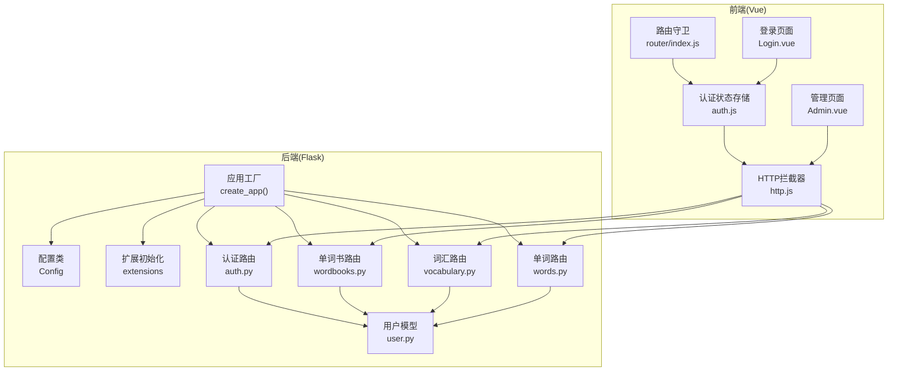
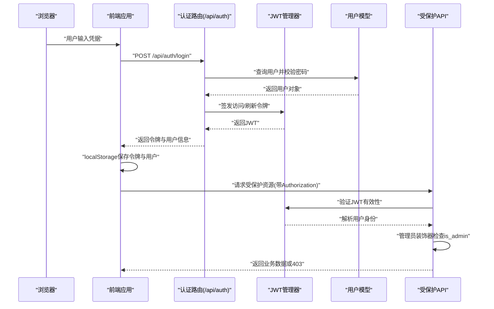
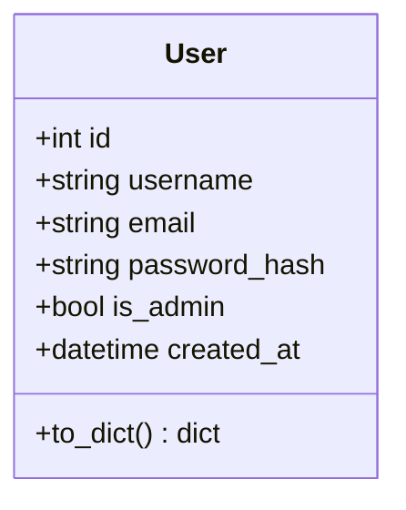
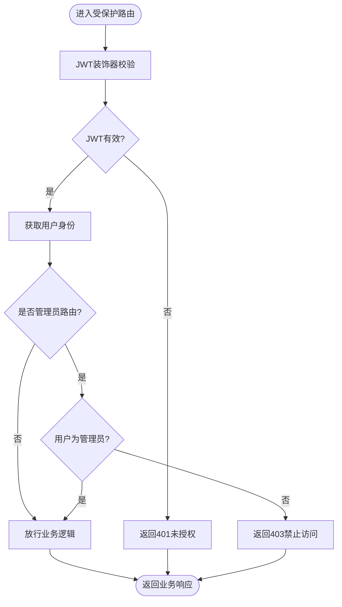
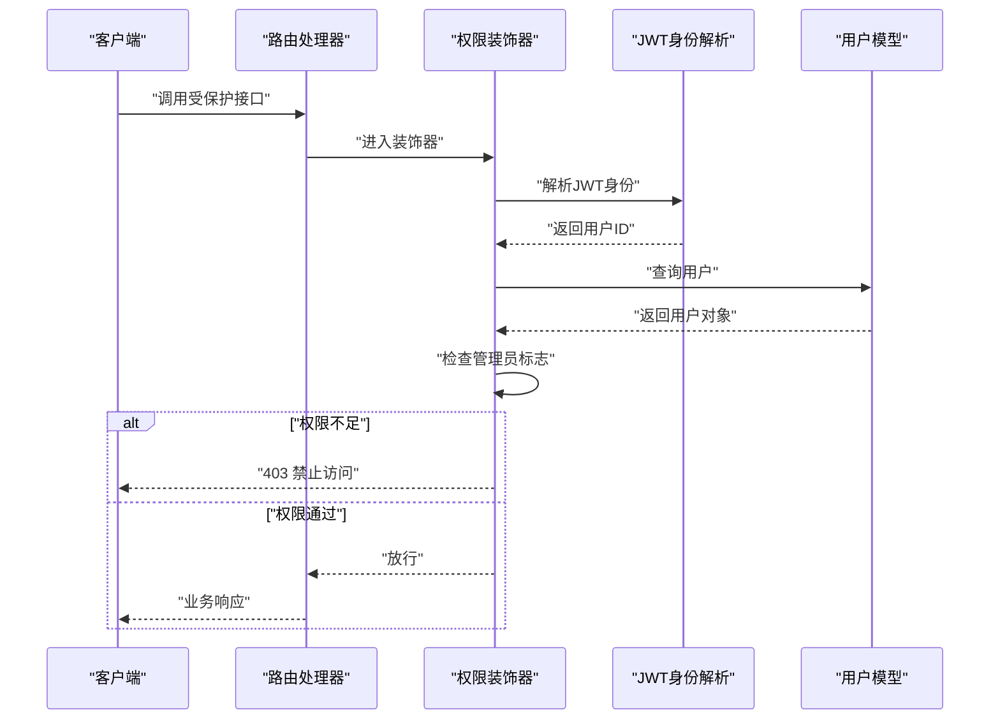
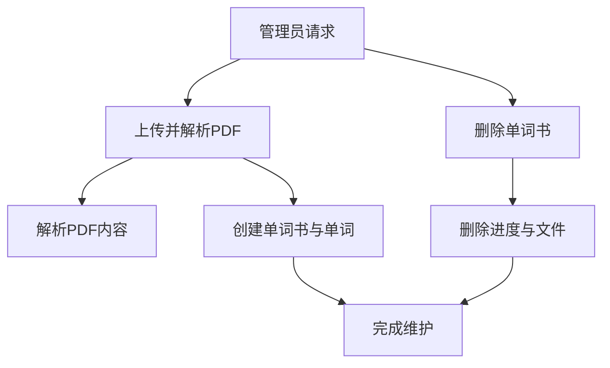
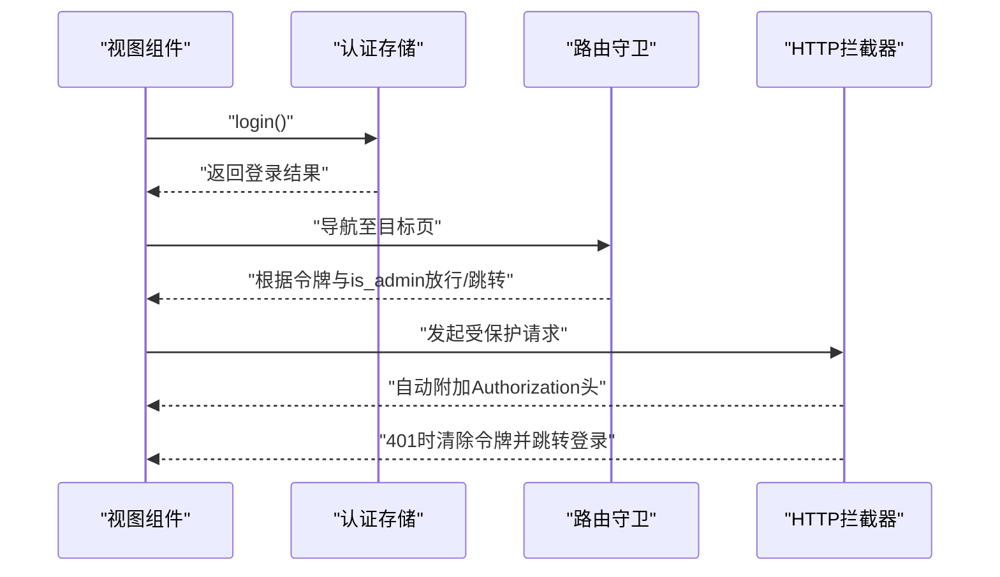
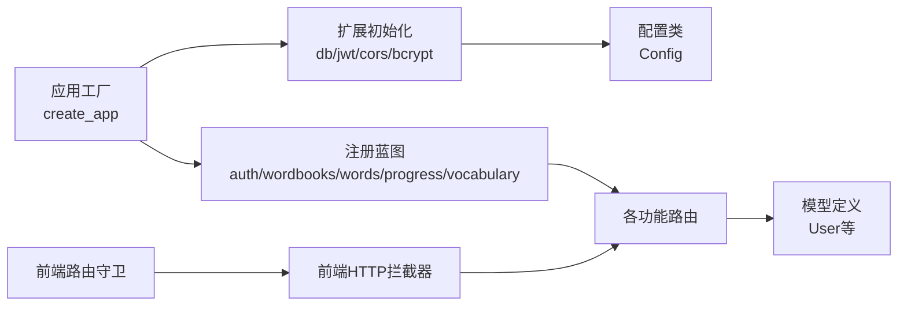

# 权限控制与安全

<cite>
**本文档引用的文件**
- [backend/app/models/user.py](file://backend/app/models/user.py)
- [backend/app/routes/auth.py](file://backend/app/routes/auth.py)
- [backend/app/routes/wordbooks.py](file://backend/app/routes/wordbooks.py)
- [backend/app/routes/vocabulary.py](file://backend/app/routes/vocabulary.py)
- [backend/app/routes/words.py](file://backend/app/routes/words.py)
- [backend/app/config.py](file://backend/app/config.py)
- [backend/app/extensions.py](file://backend/app/extensions.py)
- [backend/app/__init__.py](file://backend/app/__init__.py)
- [frontend/src/stores/auth.js](file://frontend/src/stores/auth.js)
- [frontend/src/router/index.js](file://frontend/src/router/index.js)
- [frontend/src/api/http.js](file://frontend/src/api/http.js)
- [frontend/src/views/Admin.vue](file://frontend/src/views/Admin.vue)
- [frontend/src/views/Login.vue](file://frontend/src/views/Login.vue)
</cite>

## 目录
1. [简介](#简介)
2. [项目结构](#项目结构)
3. [核心组件](#核心组件)
4. [架构总览](#架构总览)
5. [详细组件分析](#详细组件分析)
6. [依赖关系分析](#依赖关系分析)
7. [性能考虑](#性能考虑)
8. [故障排除指南](#故障排除指南)
9. [结论](#结论)

## 简介
本文件系统性阐述单词网站项目的权限控制与安全机制，覆盖用户权限体系（普通用户与管理员）、JWT认证装饰器的使用、权限验证实现（身份获取、权限检查、访问控制）、管理员功能权限管理（系统管理、用户管理、数据维护），以及安全最佳实践（密码安全、会话安全、API安全防护）。同时提供错误处理、调试方法与安全审计建议。

## 项目结构
后端采用Flask应用，按蓝图划分功能模块；前端使用Vue 3 + Pinia + Vue Router，通过Axios封装HTTP请求并统一注入JWT Bearer Token。JWT、CORS、Bcrypt、SQLAlchemy等扩展在应用初始化时集中配置。

图表来源
- [backend/app/__init__.py](file://backend/app/__init__.py#L6-L37)
- [backend/app/config.py](file://backend/app/config.py#L4-L28)
- [backend/app/extensions.py](file://backend/app/extensions.py#L1-L10)
- [backend/app/routes/auth.py](file://backend/app/routes/auth.py#L1-L93)
- [backend/app/routes/wordbooks.py](file://backend/app/routes/wordbooks.py#L1-L159)
- [backend/app/routes/vocabulary.py](file://backend/app/routes/vocabulary.py#L1-L103)
- [backend/app/routes/words.py](file://backend/app/routes/words.py#L1-L65)
- [backend/app/models/user.py](file://backend/app/models/user.py#L1-L26)
- [frontend/src/api/http.js](file://frontend/src/api/http.js#L1-L48)
- [frontend/src/stores/auth.js](file://frontend/src/stores/auth.js#L1-L59)
- [frontend/src/router/index.js](file://frontend/src/router/index.js#L1-L64)
- [frontend/src/views/Admin.vue](file://frontend/src/views/Admin.vue#L1-L264)
- [frontend/src/views/Login.vue](file://frontend/src/views/Login.vue#L1-L116)

章节来源
- [backend/app/__init__.py](file://backend/app/__init__.py#L6-L37)
- [backend/app/config.py](file://backend/app/config.py#L4-L28)
- [backend/app/extensions.py](file://backend/app/extensions.py#L1-L10)
- [frontend/src/api/http.js](file://frontend/src/api/http.js#L1-L48)
- [frontend/src/router/index.js](file://frontend/src/router/index.js#L1-L64)

## 核心组件
- 用户模型与权限标识：用户实体包含管理员标记字段，用于后端装饰器判断。
- JWT配置与生命周期：密钥、访问令牌过期时间、刷新令牌过期时间集中配置。
- 认证路由：注册、登录、刷新、当前用户信息接口，均使用JWT装饰器保护。
- 权限装饰器：通用JWT装饰器与管理员装饰器，分别用于“登录态校验”和“管理员校验”。
- 前端认证状态与路由守卫：本地持久化JWT与用户信息，路由守卫进行访客/登录/管理员三级控制。
- HTTP拦截器：自动为请求注入Authorization头，统一处理401未授权。

章节来源
- [backend/app/models/user.py](file://backend/app/models/user.py#L4-L26)
- [backend/app/config.py](file://backend/app/config.py#L20-L24)
- [backend/app/routes/auth.py](file://backend/app/routes/auth.py#L8-L93)
- [backend/app/routes/wordbooks.py](file://backend/app/routes/wordbooks.py#L14-L25)
- [frontend/src/stores/auth.js](file://frontend/src/stores/auth.js#L1-L59)
- [frontend/src/router/index.js](file://frontend/src/router/index.js#L48-L61)
- [frontend/src/api/http.js](file://frontend/src/api/http.js#L11-L45)

## 架构总览
下图展示从浏览器到后端API的完整认证与权限流程，包括JWT生成、存储、携带与校验，以及管理员权限的二次检查。

图表来源
- [backend/app/routes/auth.py](file://backend/app/routes/auth.py#L46-L92)
- [backend/app/routes/wordbooks.py](file://backend/app/routes/wordbooks.py#L14-L25)
- [frontend/src/api/http.js](file://frontend/src/api/http.js#L11-L23)
- [frontend/src/stores/auth.js](file://frontend/src/stores/auth.js#L22-L34)

## 详细组件分析

### 用户权限体系与模型
- 用户实体包含管理员标志位，作为权限判定依据。
- 首个注册用户自动提升为管理员，便于初始部署与系统初始化。
- 用户信息序列化包含管理员标识，供前端路由守卫与UI逻辑使用。

图表来源
- [backend/app/models/user.py](file://backend/app/models/user.py#L4-L26)

章节来源
- [backend/app/models/user.py](file://backend/app/models/user.py#L4-L26)
- [backend/app/routes/auth.py](file://backend/app/routes/auth.py#L36-L43)

### JWT认证装饰器与受保护端点
- 登录接口：校验邮箱与密码，成功后签发访问与刷新令牌。
- 刷新接口：使用刷新令牌换取新的访问令牌。
- 当前用户接口：基于访问令牌获取用户信息。
- 通用装饰器：对任意受保护路由添加JWT校验。
- 管理员装饰器：在通用JWT基础上，进一步检查用户是否为管理员。

图表来源
- [backend/app/routes/auth.py](file://backend/app/routes/auth.py#L75-L92)
- [backend/app/routes/wordbooks.py](file://backend/app/routes/wordbooks.py#L14-L25)

章节来源
- [backend/app/routes/auth.py](file://backend/app/routes/auth.py#L46-L92)
- [backend/app/routes/wordbooks.py](file://backend/app/routes/wordbooks.py#L14-L25)

### 权限验证实现机制
- 用户身份获取：从JWT中提取用户标识，查询用户实体。
- 权限检查：普通路由仅需登录态；管理员路由还需检查管理员标志。
- 访问控制：装饰器在函数执行前完成校验，失败直接返回相应HTTP状态码。

图表来源
- [backend/app/routes/wordbooks.py](file://backend/app/routes/wordbooks.py#L14-L25)
- [backend/app/models/user.py](file://backend/app/models/user.py#L4-L26)

章节来源
- [backend/app/routes/wordbooks.py](file://backend/app/routes/wordbooks.py#L14-L25)
- [backend/app/models/user.py](file://backend/app/models/user.py#L4-L26)

### 管理员功能权限管理
- 系统管理：上传PDF并解析为单词书、删除单词书及其关联进度数据。
- 用户管理：通过装饰器统一保护，确保仅管理员可操作。
- 数据维护：批量删除相关进度、清理上传文件，保证数据一致性。

图表来源
- [backend/app/routes/wordbooks.py](file://backend/app/routes/wordbooks.py#L68-L159)

章节来源
- [backend/app/routes/wordbooks.py](file://backend/app/routes/wordbooks.py#L68-L159)

### 前端权限控制与会话安全
- 令牌与用户信息持久化：登录成功后写入localStorage。
- 路由守卫：区分访客页、登录页、管理员页，避免未授权访问。
- HTTP拦截器：统一注入Authorization头，处理401自动登出。

图表来源
- [frontend/src/stores/auth.js](file://frontend/src/stores/auth.js#L22-L46)
- [frontend/src/router/index.js](file://frontend/src/router/index.js#L48-L61)
- [frontend/src/api/http.js](file://frontend/src/api/http.js#L11-L45)

章节来源
- [frontend/src/stores/auth.js](file://frontend/src/stores/auth.js#L1-L59)
- [frontend/src/router/index.js](file://frontend/src/router/index.js#L48-L61)
- [frontend/src/api/http.js](file://frontend/src/api/http.js#L11-L45)

### 安全最佳实践
- 密码安全
  - 使用强哈希算法存储密码，避免明文或弱加密。
  - 前端输入长度与格式校验，后端同样校验。
- 会话安全
  - 访问令牌短期有效，刷新令牌长期有效但需安全存储。
  - 401时前端主动清除本地令牌，防止令牌泄露导致的持续访问。
- API安全防护
  - 统一使用JWT装饰器保护路由。
  - 对管理员操作增加二次权限校验。
  - 限制文件上传类型与大小，服务端严格校验与清理。

章节来源
- [backend/app/routes/auth.py](file://backend/app/routes/auth.py#L22-L30)
- [backend/app/config.py](file://backend/app/config.py#L20-L24)
- [frontend/src/api/http.js](file://frontend/src/api/http.js#L34-L42)
- [backend/app/routes/wordbooks.py](file://backend/app/routes/wordbooks.py#L85-L86)

## 依赖关系分析
后端应用通过应用工厂集中初始化扩展与注册蓝图；前端通过HTTP拦截器与路由守卫形成统一的安全层。

图表来源
- [backend/app/__init__.py](file://backend/app/__init__.py#L6-L37)
- [backend/app/config.py](file://backend/app/config.py#L4-L28)
- [frontend/src/api/http.js](file://frontend/src/api/http.js#L1-L48)
- [frontend/src/router/index.js](file://frontend/src/router/index.js#L1-L64)

章节来源
- [backend/app/__init__.py](file://backend/app/__init__.py#L6-L37)
- [backend/app/config.py](file://backend/app/config.py#L4-L28)
- [frontend/src/api/http.js](file://frontend/src/api/http.js#L1-L48)
- [frontend/src/router/index.js](file://frontend/src/router/index.js#L1-L64)

## 性能考虑
- JWT校验开销极低，主要瓶颈在数据库查询与文件I/O（PDF解析与上传）。
- 建议对高频查询（如单词书列表）增加索引与分页，避免一次性加载大量数据。
- 管理员操作涉及多表删除与文件清理，建议异步化或批处理以减少请求阻塞。

## 故障排除指南
- 常见错误与处理
  - 400 参数缺失：检查请求体字段完整性与格式。
  - 401 未授权：确认Authorization头是否正确携带，刷新令牌是否过期。
  - 403 禁止访问：确认用户是否具备管理员权限。
  - 404 资源不存在：确认ID有效性与所属关系。
- 调试方法
  - 后端：开启调试日志，检查JWT解析与用户查询路径。
  - 前端：检查localStorage中的令牌与用户信息，确认拦截器是否注入Authorization头。
- 安全审计建议
  - 定期轮换JWT密钥，生产环境禁用默认密钥。
  - 审计管理员操作日志（上传、删除等），保留操作轨迹。
  - 对外暴露的API增加速率限制与IP白名单策略。

章节来源
- [backend/app/routes/auth.py](file://backend/app/routes/auth.py#L12-L23)
- [frontend/src/api/http.js](file://frontend/src/api/http.js#L34-L42)
- [backend/app/routes/wordbooks.py](file://backend/app/routes/wordbooks.py#L131-L135)

## 结论
本项目通过“JWT + 装饰器 + 路由守卫”的组合实现了清晰的权限控制与安全机制。用户权限以管理员标志为核心，结合前后端协同，确保了API访问的可控性与安全性。建议在生产环境中强化密钥管理、引入速率限制与审计日志，并持续优化数据库查询与文件处理性能。