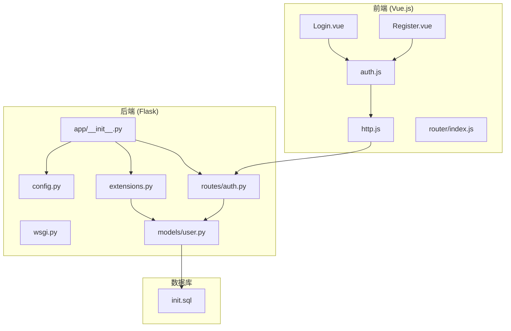
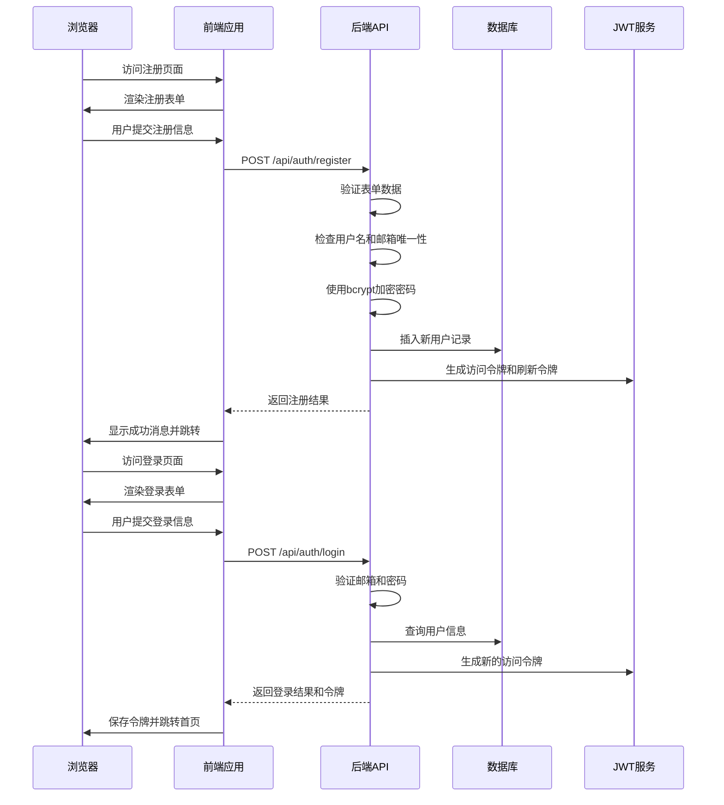
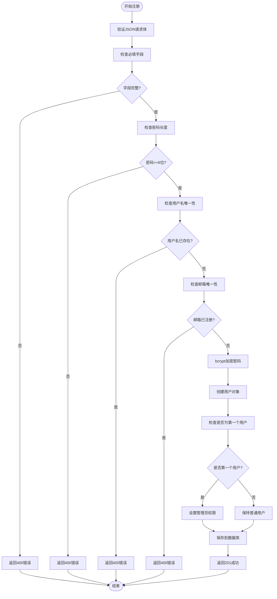
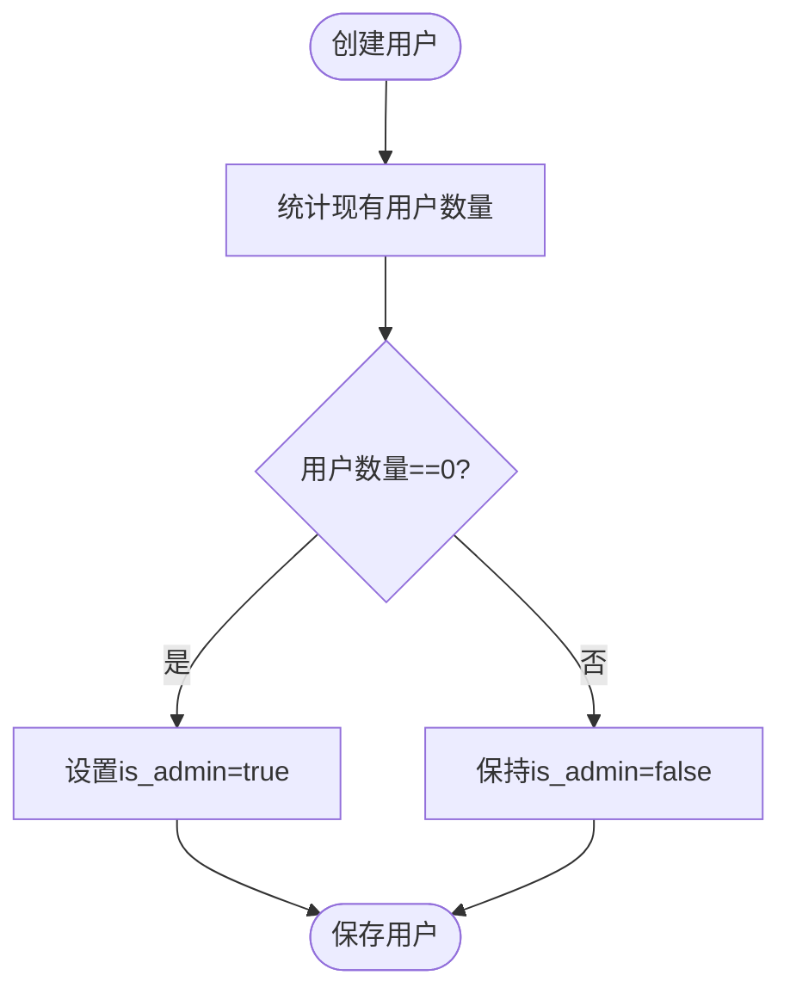
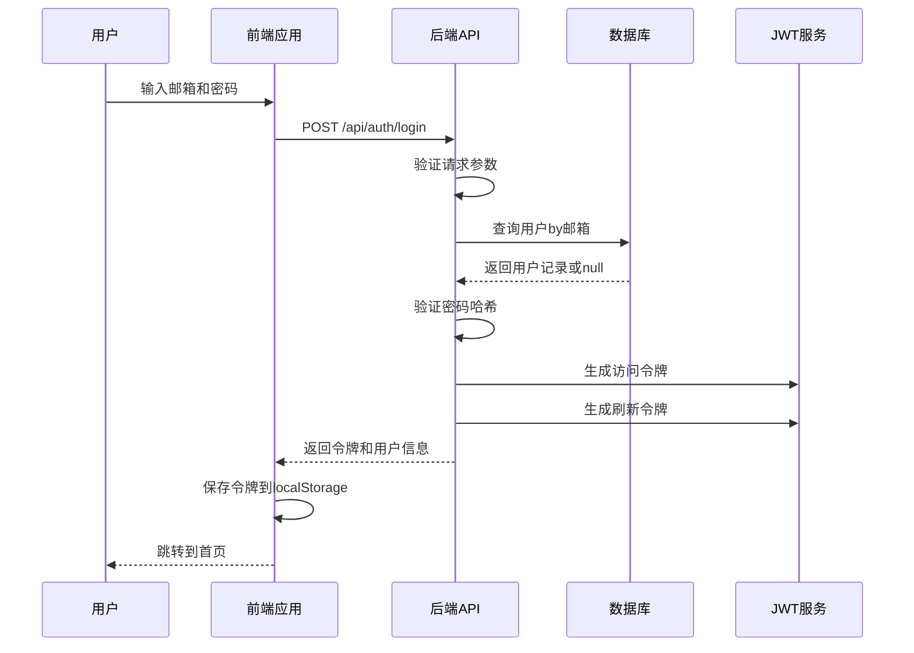
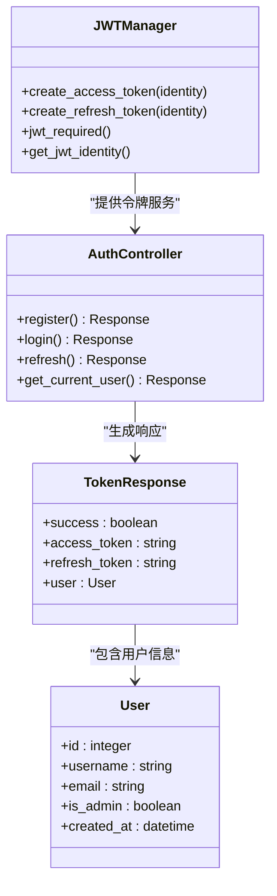
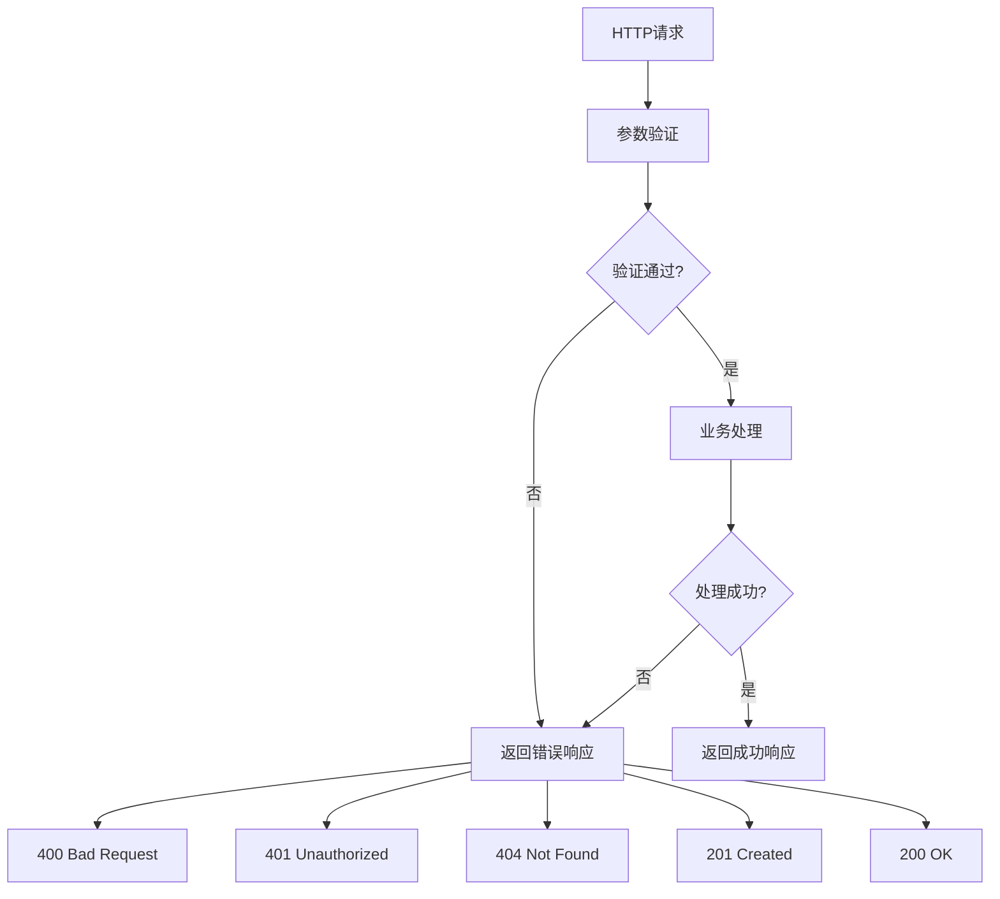
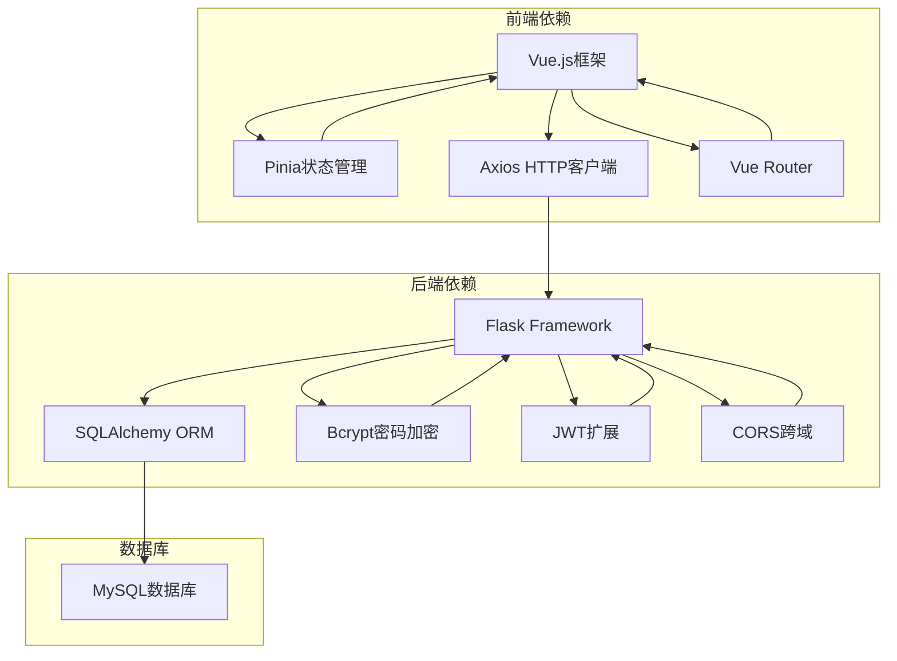

# 用户注册与登录

<cite>
**本文档引用的文件**
- [backend/app/routes/auth.py](file://backend/app/routes/auth.py)
- [backend/app/models/user.py](file://backend/app/models/user.py)
- [backend/app/extensions.py](file://backend/app/extensions.py)
- [backend/app/config.py](file://backend/app/config.py)
- [backend/app/__init__.py](file://backend/app/__init__.py)
- [backend/wsgi.py](file://backend/wsgi.py)
- [frontend/src/stores/auth.js](file://frontend/src/stores/auth.js)
- [frontend/src/views/Register.vue](file://frontend/src/views/Register.vue)
- [frontend/src/views/Login.vue](file://frontend/src/views/Login.vue)
- [frontend/src/api/http.js](file://frontend/src/api/http.js)
- [frontend/src/router/index.js](file://frontend/src/router/index.js)
- [init.sql](file://init.sql)
</cite>

## 目录
1. [简介](#简介)
2. [项目结构](#项目结构)
3. [核心组件](#核心组件)
4. [架构概览](#架构概览)
5. [详细组件分析](#详细组件分析)
6. [依赖关系分析](#依赖关系分析)
7. [性能考虑](#性能考虑)
8. [故障排除指南](#故障排除指南)
9. [结论](#结论)

## 简介

本项目是一个基于Flask和Vue.js构建的单词学习网站，提供了完整的用户注册与登录功能。系统采用JWT（JSON Web Token）进行身份认证，使用bcrypt进行密码加密存储，并实现了管理员权限管理机制。

## 项目结构

项目采用前后端分离架构，后端使用Flask框架，前端使用Vue.js技术栈。

**图表来源**
- [backend/app/__init__.py](file://backend/app/__init__.py#L1-L37)
- [frontend/src/stores/auth.js](file://frontend/src/stores/auth.js#L1-L59)

**章节来源**
- [backend/app/__init__.py](file://backend/app/__init__.py#L1-L37)
- [frontend/src/router/index.js](file://frontend/src/router/index.js#L1-L64)

## 核心组件

### 后端认证模块

后端认证功能主要集中在`auth.py`文件中，包含以下核心功能：
- 用户注册：表单验证、数据校验、重复检查、密码加密存储
- 用户登录：邮箱验证、密码哈希比对、用户状态检查
- JWT令牌管理：访问令牌和刷新令牌的生成与验证
- 管理员权限分配：第一个注册用户自动获得管理员权限

### 前端认证模块

前端认证功能通过Pinia状态管理实现：
- 认证状态管理：用户信息、访问令牌的持久化存储
- 登录/注册流程：异步请求处理和错误状态管理
- 路由守卫：基于JWT令牌的页面访问控制
- 自动登录：应用启动时的认证状态检查

**章节来源**
- [backend/app/routes/auth.py](file://backend/app/routes/auth.py#L1-L93)
- [frontend/src/stores/auth.js](file://frontend/src/stores/auth.js#L1-L59)

## 架构概览

系统采用RESTful API设计模式，前后端通过HTTP协议通信。

**图表来源**
- [backend/app/routes/auth.py](file://backend/app/routes/auth.py#L8-L43)
- [backend/app/routes/auth.py](file://backend/app/routes/auth.py#L46-L72)

## 详细组件分析

### 用户注册流程

注册流程包含多个验证步骤和安全检查：

**图表来源**
- [backend/app/routes/auth.py](file://backend/app/routes/auth.py#L8-L43)

#### 表单验证规则

注册表单包含以下客户端和服务器端验证：

| 字段 | 客户端验证 | 服务器端验证 | 验证规则 |
|------|------------|--------------|----------|
| 用户名 | 必填，非空格 | 必填，非空格 | 唯一性检查 |
| 邮箱 | 必填，邮箱格式 | 必填，邮箱格式 | 唯一性检查 |
| 密码 | 必填，至少6位 | 必填，至少6位 | bcrypt加密存储 |
| 确认密码 | 必填，与密码一致 | 服务器端确认密码匹配 | 无 |

#### 管理员权限分配机制

系统实现了智能的管理员权限分配：

**图表来源**
- [backend/app/routes/auth.py](file://backend/app/routes/auth.py#L36-L38)

**章节来源**
- [backend/app/routes/auth.py](file://backend/app/routes/auth.py#L8-L43)
- [frontend/src/views/Register.vue](file://frontend/src/views/Register.vue#L82-L106)

### 用户登录流程

登录流程确保用户身份验证的安全性和有效性：

**图表来源**
- [backend/app/routes/auth.py](file://backend/app/routes/auth.py#L46-L72)
- [frontend/src/stores/auth.js](file://frontend/src/stores/auth.js#L22-L34)

#### 登录验证流程

登录验证包含多层安全检查：

1. **请求验证**：检查JSON请求体和必填字段
2. **用户查找**：通过邮箱在数据库中查找用户
3. **密码验证**：使用bcrypt验证密码哈希
4. **令牌生成**：为有效用户提供JWT访问令牌
5. **响应返回**：包含访问令牌、刷新令牌和用户信息

**章节来源**
- [backend/app/routes/auth.py](file://backend/app/routes/auth.py#L46-L72)
- [frontend/src/views/Login.vue](file://frontend/src/views/Login.vue#L57-L71)

### JWT令牌管理

系统使用JWT进行无状态身份认证：

**图表来源**
- [backend/app/routes/auth.py](file://backend/app/routes/auth.py#L64-L72)
- [backend/app/models/user.py](file://backend/app/models/user.py#L18-L25)

**章节来源**
- [backend/app/routes/auth.py](file://backend/app/routes/auth.py#L75-L80)
- [backend/app/config.py](file://backend/app/config.py#L20-L23)

### 前后端数据交互

#### API接口定义

| 接口 | 方法 | URL | 功能 | 请求体 | 响应体 |
|------|------|-----|------|--------|--------|
| 注册 | POST | `/api/auth/register` | 用户注册 | `{username, email, password}` | `{success, message}` |
| 登录 | POST | `/api/auth/login` | 用户登录 | `{email, password}` | `{success, access_token, refresh_token, user}` |
| 刷新令牌 | POST | `/api/auth/refresh` | 刷新访问令牌 | `{}` | `{access_token}` |
| 获取当前用户 | GET | `/api/auth/me` | 获取用户信息 | `{}` | `{success, user}` |

#### 错误处理机制

系统实现了统一的错误处理策略：

**图表来源**
- [backend/app/routes/auth.py](file://backend/app/routes/auth.py#L12-L43)

**章节来源**
- [backend/app/routes/auth.py](file://backend/app/routes/auth.py#L1-L93)

## 依赖关系分析

系统各组件之间的依赖关系如下：

**图表来源**
- [backend/app/extensions.py](file://backend/app/extensions.py#L1-L10)
- [frontend/src/api/http.js](file://frontend/src/api/http.js#L1-L48)

**章节来源**
- [backend/app/extensions.py](file://backend/app/extensions.py#L1-L10)
- [frontend/src/api/http.js](file://frontend/src/api/http.js#L1-L48)

## 性能考虑

### 数据库优化

系统通过索引优化查询性能：

- **用户表索引**：在邮箱和用户名字段上建立索引，提高查询效率
- **外键约束**：确保数据完整性，避免脏数据
- **字符集选择**：使用utf8mb4支持完整的Unicode字符

### 缓存策略

- **本地存储**：使用localStorage缓存用户令牌和基本信息
- **会话管理**：JWT令牌过期时间合理设置，平衡安全性与用户体验

### 安全优化

- **密码加密**：使用bcrypt进行不可逆密码加密
- **输入验证**：双重验证确保数据安全
- **令牌管理**：区分访问令牌和刷新令牌，降低安全风险

## 故障排除指南

### 常见问题及解决方案

#### 注册失败

**问题现象**：注册接口返回400错误

**可能原因**：
1. 请求体为空或格式不正确
2. 用户名或邮箱已存在
3. 密码长度不足6位
4. 数据库连接异常

**解决方法**：
1. 检查前端表单数据格式
2. 验证用户名和邮箱唯一性
3. 确认密码符合长度要求
4. 检查数据库服务状态

#### 登录失败

**问题现象**：登录接口返回401错误

**可能原因**：
1. 邮箱或密码错误
2. 用户不存在
3. JWT令牌过期
4. 前端令牌丢失

**解决方法**：
1. 确认邮箱和密码输入正确
2. 检查用户账户状态
3. 重新登录获取新令牌
4. 清除浏览器缓存重新登录

#### 页面访问受限

**问题现象**：无法访问受保护页面

**可能原因**：
1. 未登录或令牌过期
2. 权限不足（非管理员）
3. 浏览器缓存问题

**解决方法**：
1. 重新登录获取有效令牌
2. 确认用户具有相应权限
3. 清除浏览器缓存后重试

### 调试技巧

#### 前端调试

1. **浏览器开发者工具**：检查网络请求和响应
2. **localStorage检查**：验证令牌存储状态
3. **Vue DevTools**：监控Pinia状态变化

#### 后端调试

1. **日志查看**：检查Flask应用日志
2. **数据库查询**：验证用户数据状态
3. **JWT解码**：验证令牌内容和有效期

**章节来源**
- [frontend/src/api/http.js](file://frontend/src/api/http.js#L30-L44)
- [frontend/src/router/index.js](file://frontend/src/router/index.js#L48-L61)

## 结论

本项目的用户注册与登录功能实现了完整的身份认证体系，具有以下特点：

### 安全特性
- **密码加密**：使用bcrypt进行安全的密码哈希存储
- **JWT认证**：无状态认证机制，支持令牌刷新
- **输入验证**：前后端双重验证确保数据安全
- **权限管理**：智能管理员权限分配机制

### 用户体验
- **响应式设计**：适配不同设备的用户界面
- **实时反馈**：及时的错误提示和成功通知
- **自动登录**：应用启动时自动恢复登录状态
- **路由保护**：基于权限的页面访问控制

### 技术架构
- **前后端分离**：清晰的职责划分和独立开发
- **RESTful API**：标准化的接口设计
- **数据库优化**：合理的索引和约束设计
- **部署友好**：支持Docker容器化部署

该系统为单词学习平台提供了可靠的身份认证基础，为后续功能扩展奠定了良好的技术基础。