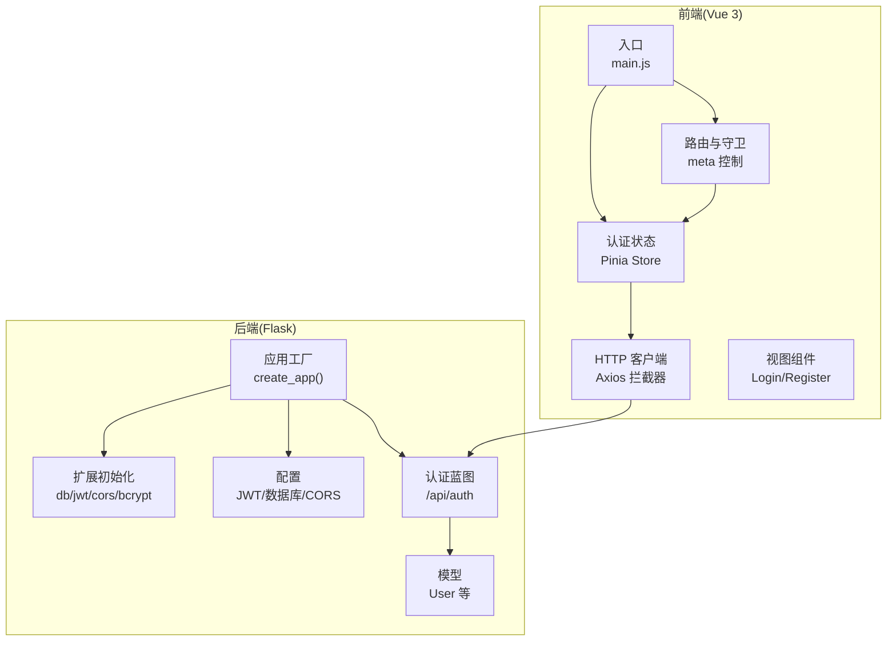
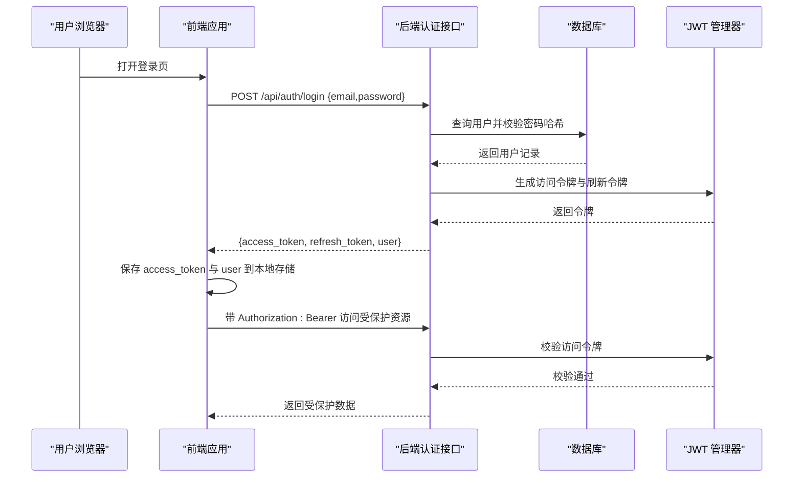
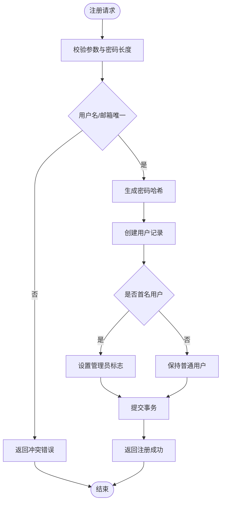
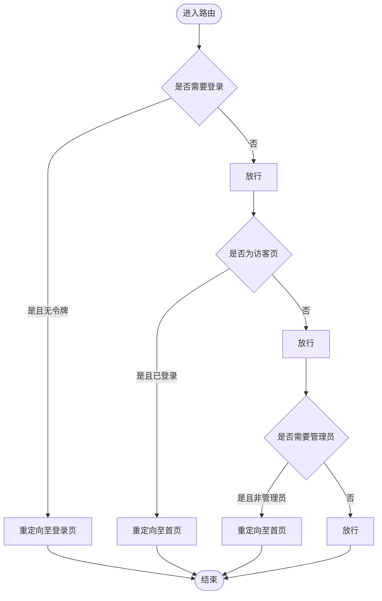
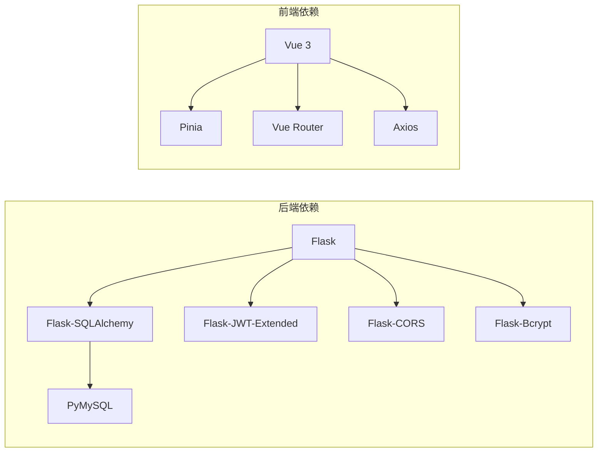

# 用户认证系统

<cite>
**本文档引用的文件**
- [backend/app/routers/auth.py](file://backend/app/routes/auth.py)
- [backend/app/models/user.py](file://backend/app/models/user.py)
- [backend/app/config.py](file://backend/app/config.py)
- [backend/app/extensions.py](file://backend/app/extensions.py)
- [backend/app/__init__.py](file://backend/app/__init__.py)
- [backend/requirements.txt](file://backend/requirements.txt)
- [frontend/src/stores/auth.js](file://frontend/src/stores/auth.js)
- [frontend/src/router/index.js](file://frontend/src/router/index.js)
- [frontend/src/api/http.js](file://frontend/src/api/http.js)
- [frontend/src/views/Login.vue](file://frontend/src/views/Login.vue)
- [frontend/src/views/Register.vue](file://frontend/src/views/Register.vue)
- [frontend/src/App.vue](file://frontend/src/App.vue)
- [frontend/src/main.js](file://frontend/src/main.js)
</cite>

## 目录
1. [简介](#简介)
2. [项目结构](#项目结构)
3. [核心组件](#核心组件)
4. [架构总览](#架构总览)
5. [详细组件分析](#详细组件分析)
6. [依赖关系分析](#依赖关系分析)
7. [性能考量](#性能考量)
8. [故障排除指南](#故障排除指南)
9. [结论](#结论)
10. [附录](#附录)

## 简介
本文件面向单词学习网站的用户认证系统，系统采用前后端分离架构：后端基于 Flask 提供 REST API，使用 JWT（JSON Web Token）进行身份认证与授权；前端基于 Vue 3 + Pinia + Vue Router 实现认证状态管理、路由守卫与 API 交互。本文将从系统架构、数据流、处理逻辑、集成点、错误处理、性能特性等方面进行全面阐述，并给出安全建议与调试指南。

## 项目结构
项目采用典型的三层架构：
- 后端（Flask）
  - 蓝图路由模块：认证、词汇、单词书、进度、词汇表等
  - 模型层：用户、学习进度、词汇等实体
  - 扩展与配置：数据库、JWT、CORS、Bcrypt、JWT 配置
- 前端（Vue 3）
  - 状态管理：Pinia Store 维护认证状态与用户信息
  - 路由与守卫：基于 meta 字段的鉴权与管理员权限控制
  - API 层：Axios 封装，统一请求头注入与错误处理
  - 视图层：登录、注册等页面组件

图表来源
- [backend/app/__init__.py](file://backend/app/__init__.py#L6-L36)
- [backend/app/extensions.py](file://backend/app/extensions.py#L1-L10)
- [backend/app/config.py](file://backend/app/config.py#L1-L28)
- [backend/app/routes/auth.py](file://backend/app/routes/auth.py#L1-L93)
- [backend/app/models/user.py](file://backend/app/models/user.py#L1-L26)
- [frontend/src/main.js](file://frontend/src/main.js#L1-L13)
- [frontend/src/router/index.js](file://frontend/src/router/index.js#L1-L64)
- [frontend/src/stores/auth.js](file://frontend/src/stores/auth.js#L1-L59)
- [frontend/src/api/http.js](file://frontend/src/api/http.js#L1-L48)

章节来源
- [backend/app/__init__.py](file://backend/app/__init__.py#L6-L36)
- [frontend/src/main.js](file://frontend/src/main.js#L1-L13)

## 核心组件
- 认证蓝图（后端）：提供注册、登录、令牌刷新、当前用户查询接口，使用 JWT 进行鉴权。
- 用户模型（后端）：定义用户字段、关系与序列化方法，支持管理员标识。
- 配置（后端）：集中管理 JWT 密钥与过期时间、数据库连接、CORS 策略。
- 扩展（后端）：初始化 SQLAlchemy、JWTManager、CORS、Bcrypt。
- 前端认证 Store：封装登录、注册、登出、检查持久化状态等操作。
- 前端路由守卫：基于 meta 字段控制访客/登录/管理员访问。
- 前端 HTTP 客户端：请求拦截器自动附加 Bearer Token，响应拦截器处理 401 并清理本地状态。

章节来源
- [backend/app/routes/auth.py](file://backend/app/routes/auth.py#L1-L93)
- [backend/app/models/user.py](file://backend/app/models/user.py#L1-L26)
- [backend/app/config.py](file://backend/app/config.py#L1-L28)
- [backend/app/extensions.py](file://backend/app/extensions.py#L1-L10)
- [frontend/src/stores/auth.js](file://frontend/src/stores/auth.js#L1-L59)
- [frontend/src/router/index.js](file://frontend/src/router/index.js#L1-L64)
- [frontend/src/api/http.js](file://frontend/src/api/http.js#L1-L48)

## 架构总览
系统通过 JWT 实现无状态认证，后端负责签发访问令牌与刷新令牌，前端在每次请求中携带访问令牌，后端通过装饰器校验令牌有效性。管理员权限通过用户模型中的布尔字段与前端路由守卫共同实现。

图表来源
- [backend/app/routes/auth.py](file://backend/app/routes/auth.py#L46-L72)
- [backend/app/models/user.py](file://backend/app/models/user.py#L1-L26)
- [frontend/src/api/http.js](file://frontend/src/api/http.js#L11-L23)
- [frontend/src/stores/auth.js](file://frontend/src/stores/auth.js#L22-L34)

## 详细组件分析

### 后端认证蓝图（JWT + Bcrypt）
- 接口设计
  - POST /api/auth/register：校验必填字段与密码长度，检查用户名与邮箱唯一性，使用 Bcrypt 生成密码哈希并持久化，首个注册用户自动成为管理员。
  - POST /api/auth/login：校验邮箱与密码，成功后生成访问令牌与刷新令牌返回。
  - POST /api/auth/refresh：使用刷新令牌生成新的访问令牌。
  - GET /api/auth/me：基于访问令牌获取当前用户信息。
- 安全要点
  - 使用 Bcrypt 存储密码哈希，避免明文存储。
  - 使用 JWT 管理器进行令牌签发与校验。
  - 路由级装饰器确保访问令牌与刷新令牌的正确使用。

图表来源
- [backend/app/routes/auth.py](file://backend/app/routes/auth.py#L8-L43)
- [backend/app/models/user.py](file://backend/app/models/user.py#L1-L26)

章节来源
- [backend/app/routes/auth.py](file://backend/app/routes/auth.py#L1-L93)
- [backend/app/models/user.py](file://backend/app/models/user.py#L1-L26)

### 用户模型与权限
- 字段与关系
  - 主键 id、唯一用户名、唯一邮箱、密码哈希、管理员标志、创建时间。
  - 与学习进度、词汇表建立一对多关系。
- 序列化
  - to_dict 方法输出用户基本信息，便于前端展示与路由守卫判断管理员权限。

章节来源
- [backend/app/models/user.py](file://backend/app/models/user.py#L1-L26)

### 前端认证状态管理（Pinia Store）
- 功能
  - checkAuth：从本地存储恢复认证状态。
  - login：调用登录接口，成功后写入 access_token 与用户信息。
  - register：调用注册接口。
  - logout：清空认证状态与本地存储。
  - 计算属性：isAuthenticated、isAdmin。
- 与后端协作
  - 登录成功后将 access_token 写入本地存储，后续请求由 HTTP 拦截器自动附加。

章节来源
- [frontend/src/stores/auth.js](file://frontend/src/stores/auth.js#L1-L59)

### 前端路由守卫与权限控制
- 元信息控制
  - requiresAuth：需要登录才能访问。
  - guest：仅未登录用户可见（如登录/注册页）。
  - requiresAdmin：需要管理员权限。
- 实现逻辑
  - 读取本地存储的 access_token 与用户信息，按需重定向或放行。

图表来源
- [frontend/src/router/index.js](file://frontend/src/router/index.js#L48-L61)

章节来源
- [frontend/src/router/index.js](file://frontend/src/router/index.js#L1-L64)

### 前端 HTTP 客户端（Axios 拦截器）
- 请求拦截器
  - 从本地存储读取 access_token，若存在则在请求头添加 Authorization: Bearer。
- 响应拦截器
  - 处理 401 未授权：清除本地存储的令牌与用户信息，跳转至登录页。
  - 其他错误：统一返回错误数据或网络错误提示。

章节来源
- [frontend/src/api/http.js](file://frontend/src/api/http.js#L1-L48)

### 前端视图组件
- 登录页
  - 表单收集邮箱与密码，调用认证 Store 的 login 方法，成功后跳转首页。
- 注册页
  - 表单收集用户名、邮箱、密码与确认密码，调用认证 Store 的 register 方法，成功后提示并跳转登录页。

章节来源
- [frontend/src/views/Login.vue](file://frontend/src/views/Login.vue#L1-L116)
- [frontend/src/views/Register.vue](file://frontend/src/views/Register.vue#L1-L151)

### 应用启动与蓝图注册
- 应用工厂
  - 加载配置、初始化扩展、注册蓝图（含认证蓝图）、创建数据库表。
- 蓝图前缀
  - 认证相关接口前缀为 /api/auth。

章节来源
- [backend/app/__init__.py](file://backend/app/__init__.py#L6-L36)

## 依赖关系分析
- 后端依赖
  - Flask、Flask-SQLAlchemy、Flask-JWT-Extended、Flask-CORS、Flask-Bcrypt、PyMySQL。
- 前端依赖
  - Vue 3、Pinia、Vue Router、Axios。

图表来源
- [backend/requirements.txt](file://backend/requirements.txt#L1-L11)

章节来源
- [backend/requirements.txt](file://backend/requirements.txt#L1-L11)

## 性能考量
- 令牌过期策略
  - 访问令牌较短有效期，刷新令牌较长有效期，减少频繁重新登录。
- 数据库查询
  - 用户登录与注册涉及唯一性检查与哈希计算，建议在数据库层面为用户名与邮箱建立唯一索引以提升查询效率。
- 前端缓存
  - 本地存储用于维持短期会话状态，避免重复登录；注意令牌过期时的清理与重定向。

## 故障排除指南
- 登录失败
  - 检查邮箱与密码是否为空，确认后端返回的错误消息。
  - 确认前端是否正确将 access_token 写入本地存储并在请求头中携带。
- 401 未授权
  - 前端响应拦截器会自动清除本地存储并跳转登录页；检查令牌是否过期或被篡改。
- 注册失败
  - 确认用户名与邮箱唯一性，密码长度符合要求。
- 路由无法访问
  - 检查路由元信息配置与本地存储中的令牌与用户信息。
- 管理员功能不可用
  - 确认用户 is_admin 标志是否正确设置，前端路由守卫是否生效。

章节来源
- [frontend/src/api/http.js](file://frontend/src/api/http.js#L25-L45)
- [frontend/src/router/index.js](file://frontend/src/router/index.js#L48-L61)
- [backend/app/routes/auth.py](file://backend/app/routes/auth.py#L12-L30)

## 结论
该认证系统通过 JWT 与 Bcrypt 实现了安全、简洁的用户认证与授权机制。后端提供标准的注册、登录、令牌刷新与当前用户查询接口，前端通过 Pinia Store 与路由守卫实现了完善的认证状态管理与权限控制。建议在生产环境中进一步强化安全配置（如 HTTPS、安全响应头、速率限制、令牌撤销等），并持续监控与审计认证相关日志。

## 附录

### JWT 工作原理与流程
- 令牌生成
  - 登录成功后，后端使用 JWT 管理器为用户 ID 生成访问令牌与刷新令牌。
- 令牌验证
  - 前端在请求头附加 Bearer 令牌；后端通过装饰器校验访问令牌有效性。
- 令牌刷新
  - 使用刷新令牌生成新的访问令牌，延长会话生命周期。

章节来源
- [backend/app/routes/auth.py](file://backend/app/routes/auth.py#L64-L80)
- [frontend/src/api/http.js](file://frontend/src/api/http.js#L11-L23)

### 管理员权限与用户权限
- 权限模型
  - 用户模型包含管理员标志字段；前端路由守卫根据该标志控制管理员页面访问。
- 管理员分配
  - 首个注册用户自动成为管理员；其他用户需通过后端管理流程提升权限。

章节来源
- [backend/app/models/user.py](file://backend/app/models/user.py#L1-L26)
- [backend/app/routes/auth.py](file://backend/app/routes/auth.py#L36-L38)
- [frontend/src/router/index.js](file://frontend/src/router/index.js#L38-L38)

### 前端状态管理与路由守卫实现要点
- 状态恢复
  - 应用挂载时调用认证 Store 的检查方法，从本地存储恢复令牌与用户信息。
- 登录/注册/登出
  - 统一通过 Store 方法执行，保证状态一致性与本地存储同步。
- 路由守卫
  - 基于 meta 字段与本地存储状态进行条件判断，确保受保护资源的安全访问。

章节来源
- [frontend/src/App.vue](file://frontend/src/App.vue#L13-L15)
- [frontend/src/stores/auth.js](file://frontend/src/stores/auth.js#L12-L46)
- [frontend/src/router/index.js](file://frontend/src/router/index.js#L48-L61)