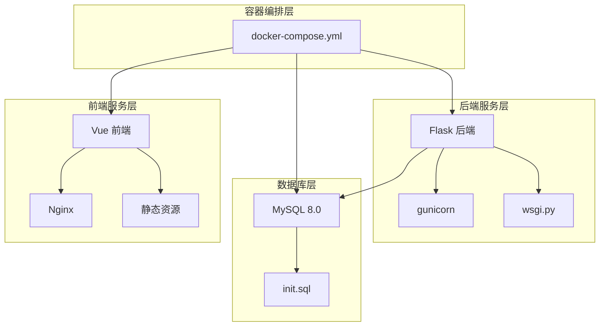
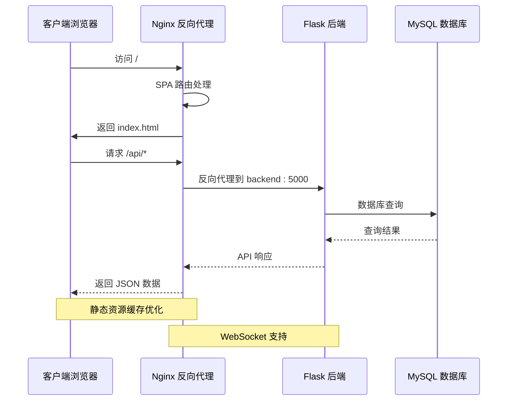
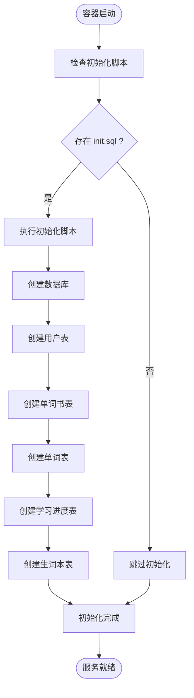
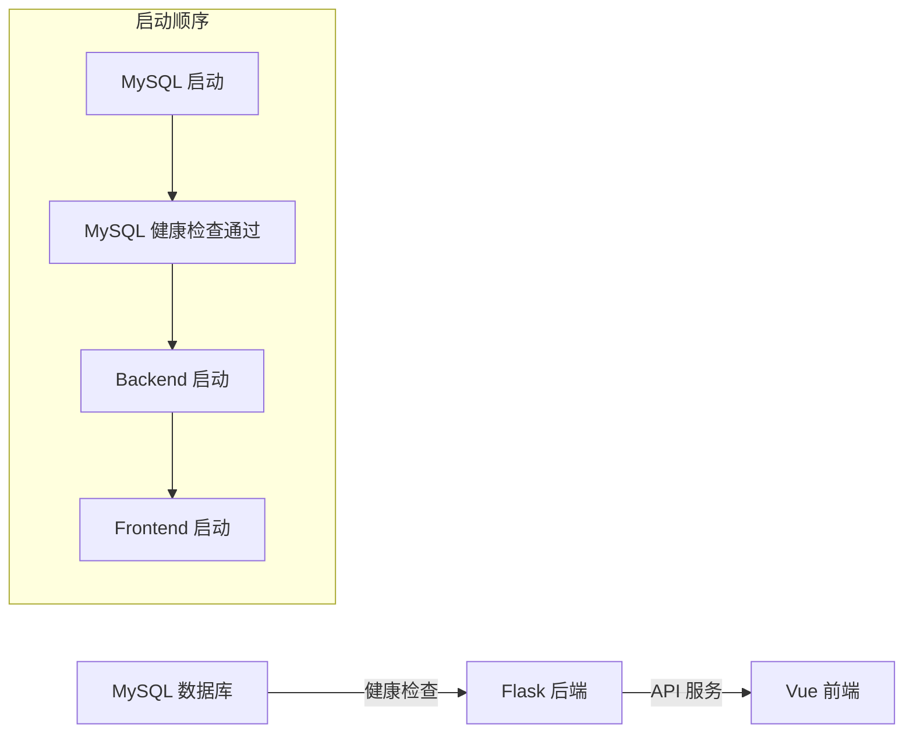
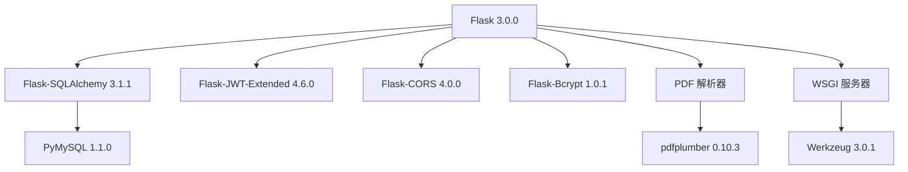

# Docker 配置详解

<cite>
**本文档引用的文件**
- [docker-compose.yml](file://docker-compose.yml)
- [backend.Dockerfile](file://docker/backend.Dockerfile)
- [frontend.Dockerfile](file://docker/frontend.Dockerfile)
- [nginx.conf](file://docker/nginx.conf)
- [.env.example](file://backend/.env.example)
- [requirements.txt](file://backend/requirements.txt)
- [wsgi.py](file://backend/wsgi.py)
- [init.sql](file://init.sql)
- [package.json](file://frontend/package.json)
</cite>

## 目录
1. [简介](#简介)
2. [项目结构概览](#项目结构概览)
3. [核心组件分析](#核心组件分析)
4. [架构总览](#架构总览)
5. [详细组件分析](#详细组件分析)
6. [依赖关系分析](#依赖关系分析)
7. [性能与安全考虑](#性能与安全考虑)
8. [故障排除指南](#故障排除指南)
9. [最佳实践建议](#最佳实践建议)
10. [结论](#结论)

## 简介
本项目采用 Docker 容器化部署，通过 docker-compose.yml 对 MySQL 数据库、Flask 后端和 Vue 前端进行统一编排。该配置实现了：
- 数据库持久化存储与初始化脚本
- 双阶段前端构建与 Nginx 反向代理
- 服务间网络通信与健康检查
- 端口映射与静态资源优化
- 上传文件目录的持久化管理

## 项目结构概览
项目采用分层架构，包含后端 Flask 应用、前端 Vue 应用、MySQL 数据库以及 Nginx 反向代理。整体结构清晰，便于容器化部署与维护。



**图表来源**
- [docker-compose.yml](file://docker-compose.yml#L1-L59)
- [backend.Dockerfile](file://docker/backend.Dockerfile#L1-L29)
- [frontend.Dockerfile](file://docker/frontend.Dockerfile#L1-L30)
- [nginx.conf](file://docker/nginx.conf#L1-L35)

## 核心组件分析

### MySQL 数据库服务
MySQL 服务使用官方 MySQL 8.0 镜像，配置了完整的字符集支持和数据库初始化流程。

**关键配置要点：**
- 基础镜像：mysql:8.0
- 环境变量：根密码、数据库名、字符集设置
- 数据持久化：mysql_data 卷挂载到 /var/lib/mysql
- 初始化脚本：自动执行 init.sql 脚本
- 健康检查：基于 mysqladmin ping 命令
- 端口映射：3306:3306

**章节来源**
- [docker-compose.yml](file://docker-compose.yml#L4-L22)
- [init.sql](file://init.sql#L1-L67)

### Flask 后端服务
后端采用 Python 3.11 slim 基础镜像，使用 gunicorn 作为 WSGI 服务器。

**构建流程：**
1. 安装系统依赖（gcc、mysql 客户端开发包）
2. 复制并安装 Python 依赖
3. 复制应用代码
4. 创建上传目录
5. 暴露 5000 端口
6. 使用 gunicorn 启动应用

**环境变量配置：**
- SECRET_KEY 和 JWT_SECRET_KEY 用于应用安全
- 数据库连接参数指向 mysql 服务
- 上传文件目录持久化

**章节来源**
- [docker-compose.yml](file://docker-compose.yml#L23-L44)
- [backend.Dockerfile](file://docker/backend.Dockerfile#L1-L29)
- [requirements.txt](file://backend/requirements.txt#L1-L11)
- [wsgi.py](file://backend/wsgi.py#L1-L7)

### Vue 前端服务
前端采用双阶段构建策略，生产环境使用 Nginx 静态服务器。

**构建阶段：**
- 基础镜像：node:20-alpine
- 依赖安装：npm install
- 代码构建：npm run build
- 产物复制：dist 目录

**运行阶段：**
- 基础镜像：nginx:alpine
- 复制构建产物到 /usr/share/nginx/html
- 应用自定义 Nginx 配置
- 暴露 80 端口

**章节来源**
- [docker-compose.yml](file://docker-compose.yml#L45-L55)
- [frontend.Dockerfile](file://docker/frontend.Dockerfile#L1-L30)
- [package.json](file://frontend/package.json#L1-L22)

## 架构总览
系统采用反向代理架构，Nginx 作为入口网关，负责静态资源服务和 API 代理。



**图表来源**
- [nginx.conf](file://docker/nginx.conf#L14-L27)
- [docker-compose.yml](file://docker-compose.yml#L45-L55)

## 详细组件分析

### 数据库初始化流程
数据库启动时自动执行初始化脚本，创建完整的数据模型。



**图表来源**
- [docker-compose.yml](file://docker-compose.yml#L13-L15)
- [init.sql](file://init.sql#L1-L67)

### 服务依赖关系
容器启动遵循严格的依赖顺序，确保服务间的正确初始化。



**图表来源**
- [docker-compose.yml](file://docker-compose.yml#L41-L43)
- [docker-compose.yml](file://docker-compose.yml#L53-L54)

### 网络与端口配置
系统采用默认网络模式，服务间通过服务名进行内部通信。

**端口映射：**
- MySQL: 3306:3306
- Flask: 5000:5000  
- Nginx: 80:80

**服务间通信：**
- 后端通过服务名 "mysql" 访问数据库
- Nginx 通过 "backend:5000" 代理 API 请求

**章节来源**
- [docker-compose.yml](file://docker-compose.yml#L16-L17)
- [docker-compose.yml](file://docker-compose.yml#L32-L36)
- [nginx.conf](file://docker/nginx.conf#L15)

### 数据卷管理
系统使用命名卷实现数据持久化。

```mermaid
graph TB
subgraph "命名卷"
V1[mysql_data]
V2[uploads_data]
end
subgraph "容器映射"
C1[MySQL 容器]
C2[Flask 容器]
end
V1 --> C1
V2 --> C2
subgraph "挂载点"
M1[/var/lib/mysql]
M2[/app/uploads]
end
C1 --> M1
C2 --> M2
```

**图表来源**
- [docker-compose.yml](file://docker-compose.yml#L13-L14)
- [docker-compose.yml](file://docker-compose.yml#L37-L38)

**章节来源**
- [docker-compose.yml](file://docker-compose.yml#L56-L58)

## 依赖关系分析

### 后端依赖栈
后端应用依赖于多个 Python 包，形成完整的 Web 应用框架。



**图表来源**
- [requirements.txt](file://backend/requirements.txt#L1-L11)

### 前端依赖栈
前端应用采用现代化的 Vue 3 技术栈。

```mermaid
graph TD
Vue[Vue 3.4.0] --> Router[Vue Router 4.2.5]
Vue --> Store[Pinia 2.1.7]
Vue --> HTTP[Axios 1.6.2]
Build[Vite 构建工具] --> Dev[开发服务器]
Build --> Prod[生产构建]
Dev --> Plugin[@vitejs/plugin-vue]
Prod --> Plugin
```

**图表来源**
- [package.json](file://frontend/package.json#L11-L20)

## 性能与安全考虑

### 性能优化
- **Gunicorn 工作进程数**：配置为 4 个工作进程，提升并发处理能力
- **静态资源缓存**：Nginx 配置长期缓存策略，减少带宽消耗
- **数据库字符集**：使用 utf8mb4 支持完整 Unicode 字符
- **索引优化**：关键字段建立索引，提升查询性能

### 安全配置
- **环境变量隔离**：敏感信息通过环境变量注入
- **健康检查**：自动监控数据库可用性
- **重启策略**：unless-stopped 确保服务稳定性
- **文件权限**：上传目录权限控制

## 故障排除指南

### 常见问题诊断
1. **数据库连接失败**
   - 检查 MySQL 服务健康状态
   - 验证环境变量配置
   - 确认网络连通性

2. **API 接口异常**
   - 查看后端日志输出
   - 检查 gunicorn 进程状态
   - 验证数据库连接参数

3. **前端页面空白**
   - 确认 Nginx 配置正确
   - 检查静态资源路径
   - 验证 API 代理配置

### 日志查看方法
- 查看 MySQL 日志：`docker logs word-learning-mysql`
- 查看后端日志：`docker logs word-learning-backend`
- 查看前端日志：`docker logs word-learning-frontend`

**章节来源**
- [docker-compose.yml](file://docker-compose.yml#L7-L21)
- [docker-compose.yml](file://docker-compose.yml#L28-L43)

## 最佳实践建议

### 部署最佳实践
1. **环境变量管理**
   - 在生产环境中使用 .env 文件
   - 定期轮换密钥
   - 使用 Docker secrets 管理敏感信息

2. **镜像优化**
   - 使用多阶段构建减少镜像大小
   - 清理包管理器缓存
   - 选择合适的 Python 版本

3. **存储策略**
   - 使用外部存储卷管理数据
   - 定期备份数据库
   - 监控磁盘空间使用

4. **监控与日志**
   - 配置容器健康检查
   - 设置适当的日志级别
   - 监控资源使用情况

### 安全加固
1. **网络隔离**
   - 使用自定义网络
   - 限制不必要的端口暴露
   - 配置防火墙规则

2. **权限控制**
   - 使用非 root 用户运行
   - 最小权限原则
   - 定期更新依赖包

3. **数据保护**
   - 加密敏感数据
   - 定期安全审计
   - 备份验证测试

## 结论
该项目的 Docker 配置展现了现代容器化应用的完整架构，通过合理的服务编排、数据持久化和网络配置，实现了稳定可靠的部署方案。建议在生产环境中进一步完善环境变量管理、安全配置和监控体系，以确保系统的长期稳定运行。