# Nginx 反向代理配置

<cite>
**本文档引用的文件**
- [nginx.conf](file://docker/nginx.conf)
- [docker-compose.yml](file://docker-compose.yml)
- [backend.Dockerfile](file://docker/backend.Dockerfile)
- [frontend.Dockerfile](file://docker/frontend.Dockerfile)
- [vite.config.js](file://frontend/vite.config.js)
- [wsgi.py](file://backend/wsgi.py)
- [app/__init__.py](file://backend/app/__init__.py)
- [config.py](file://backend/app/config.py)
- [auth.py](file://backend/app/routes/auth.py)
- [http.js](file://frontend/src/api/http.js)
- [.env.example](file://backend/.env.example)
</cite>

## 目录
1. [简介](#简介)
2. [项目结构](#项目结构)
3. [核心组件](#核心组件)
4. [架构概览](#架构概览)
5. [详细组件分析](#详细组件分析)
6. [依赖关系分析](#依赖关系分析)
7. [性能考虑](#性能考虑)
8. [故障排除指南](#故障排除指南)
9. [结论](#结论)

## 简介

本项目采用 Nginx 作为反向代理服务器，负责处理前端 Vue 应用的静态资源服务、后端 API 的代理转发以及 HTTPS 终止等任务。该配置实现了单页应用(SPA)路由支持、API 代理、静态资源缓存和上传文件处理等功能。

## 项目结构

项目采用 Docker 容器化部署，包含以下主要组件：

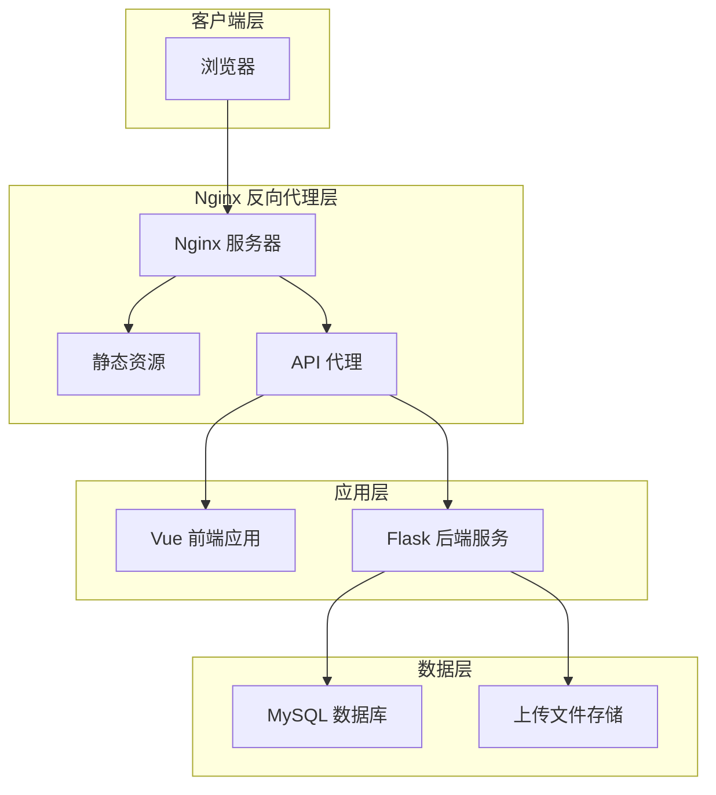

**图表来源**
- [docker-compose.yml](file://docker-compose.yml#L1-L59)
- [nginx.conf](file://docker/nginx.conf#L1-L35)

**章节来源**
- [docker-compose.yml](file://docker-compose.yml#L1-L59)
- [nginx.conf](file://docker/nginx.conf#L1-L35)

## 核心组件

### Nginx 配置组件

项目中的 Nginx 配置包含以下关键组件：

1. **服务器配置**：监听 80 端口，使用 localhost 作为服务器名称
2. **根目录配置**：设置静态资源根目录为 `/usr/share/nginx/html`
3. **SPA 路由支持**：通过 try_files 指令支持前端路由
4. **API 代理**：将 /api 前缀的请求转发到后端服务
5. **静态资源缓存**：为各种静态文件类型设置长期缓存

### 前端应用组件

前端 Vue 应用通过 Vite 构建，包含：
- 单页应用路由系统
- Axios HTTP 客户端配置
- Pinia 状态管理
- Vue Router 路由守卫

### 后端服务组件

后端采用 Flask 框架，提供：
- RESTful API 接口
- 用户认证和授权
- 数据库操作
- 文件上传处理

**章节来源**
- [nginx.conf](file://docker/nginx.conf#L1-L35)
- [frontend.Dockerfile](file://docker/frontend.Dockerfile#L1-L30)
- [backend.Dockerfile](file://docker/backend.Dockerfile#L1-L29)

## 架构概览

系统采用三层架构设计，通过 Nginx 实现统一入口和负载均衡：

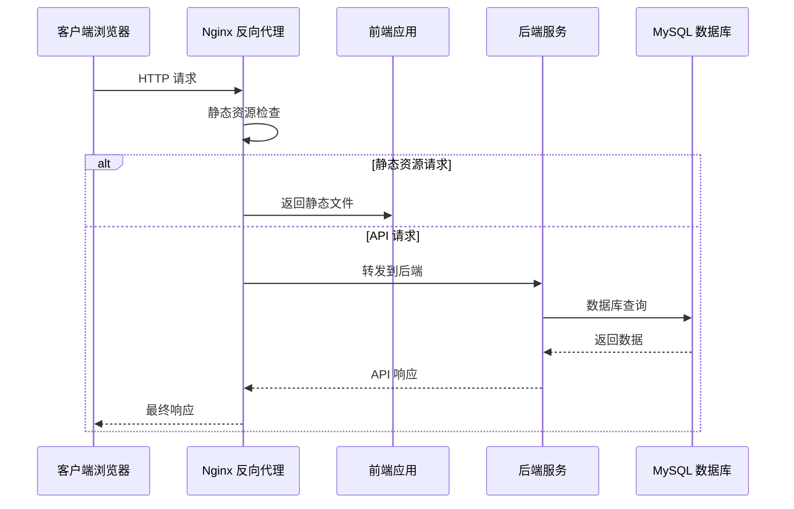

**图表来源**
- [nginx.conf](file://docker/nginx.conf#L9-L27)
- [docker-compose.yml](file://docker-compose.yml#L23-L54)

**章节来源**
- [docker-compose.yml](file://docker-compose.yml#L1-L59)
- [nginx.conf](file://docker/nginx.conf#L1-L35)

## 详细组件分析

### Nginx 配置详解

#### 服务器块配置

Nginx 主配置文件定义了基本的服务器参数：

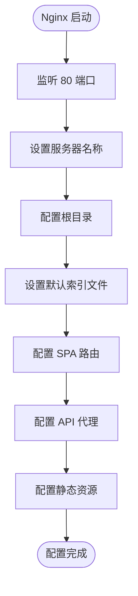

**图表来源**
- [nginx.conf](file://docker/nginx.conf#L1-L35)

#### SPA 路由支持配置

前端单页应用的路由支持通过 try_files 指令实现：

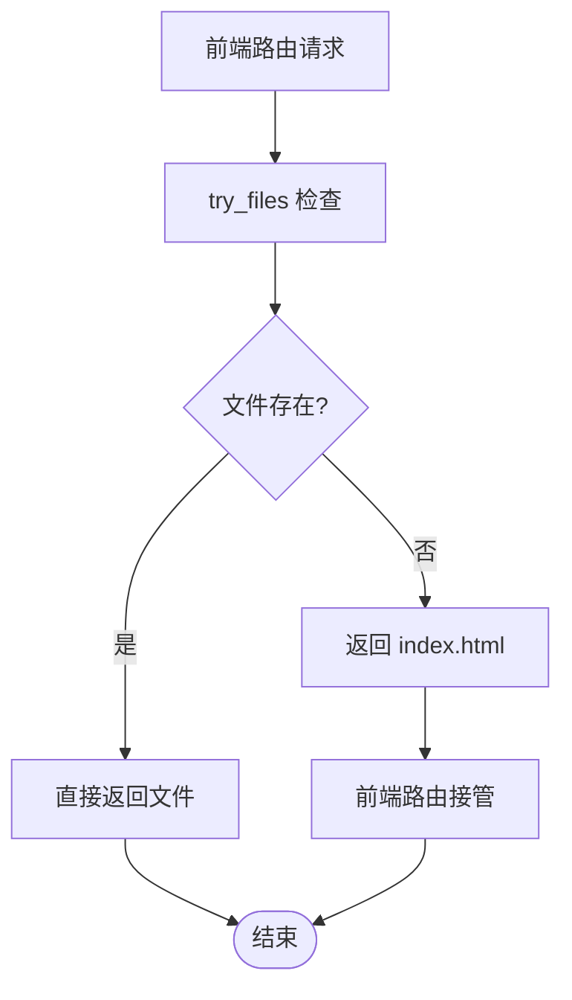

**图表来源**
- [nginx.conf](file://docker/nginx.conf#L9-L11)

#### API 代理配置

API 代理配置实现了请求转发和头部传递：

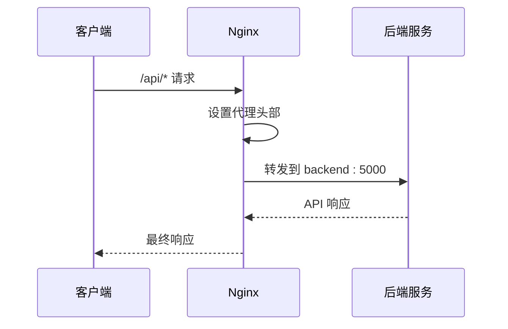

**图表来源**
- [nginx.conf](file://docker/nginx.conf#L14-L27)

#### 静态资源缓存配置

静态资源缓存通过正则表达式匹配不同类型的文件：

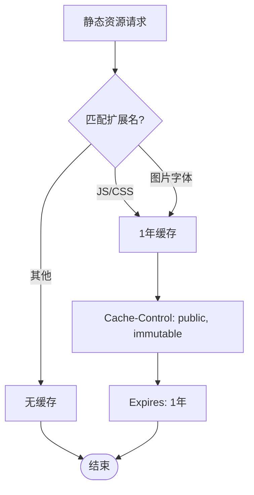

**图表来源**
- [nginx.conf](file://docker/nginx.conf#L30-L33)

**章节来源**
- [nginx.conf](file://docker/nginx.conf#L1-L35)

### 前端 Vue 应用配置

#### Vite 开发服务器配置

前端开发环境通过 Vite 提供热重载和代理功能：

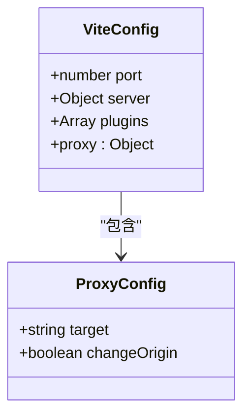

**图表来源**
- [vite.config.js](file://frontend/vite.config.js#L4-L15)

#### Axios HTTP 客户端配置

HTTP 客户端配置了基础 URL 和拦截器：

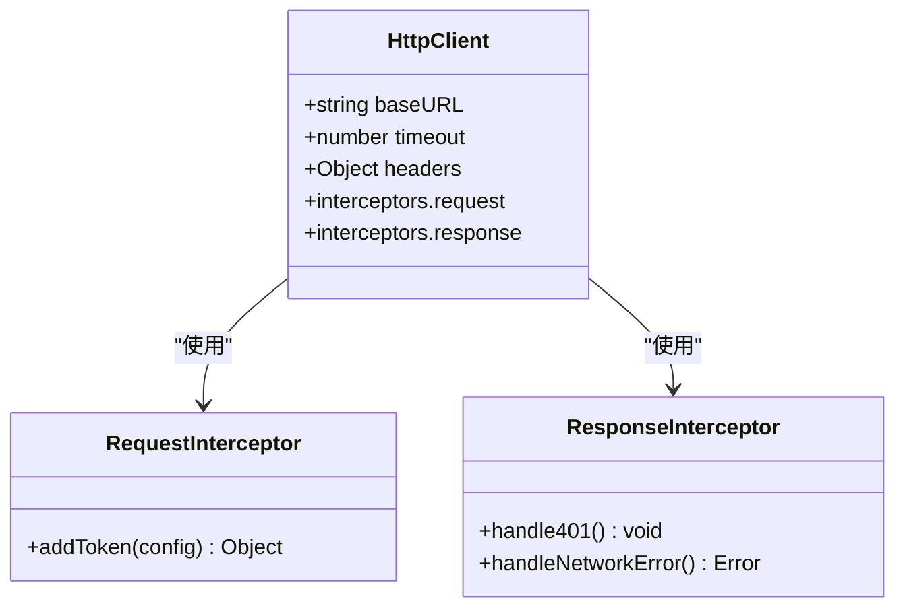

**图表来源**
- [http.js](file://frontend/src/api/http.js#L3-L48)

**章节来源**
- [vite.config.js](file://frontend/vite.config.js#L1-L16)
- [http.js](file://frontend/src/api/http.js#L1-L48)

### 后端 Flask 服务配置

#### 应用初始化配置

Flask 应用通过工厂模式创建，配置了数据库、JWT 和 CORS：

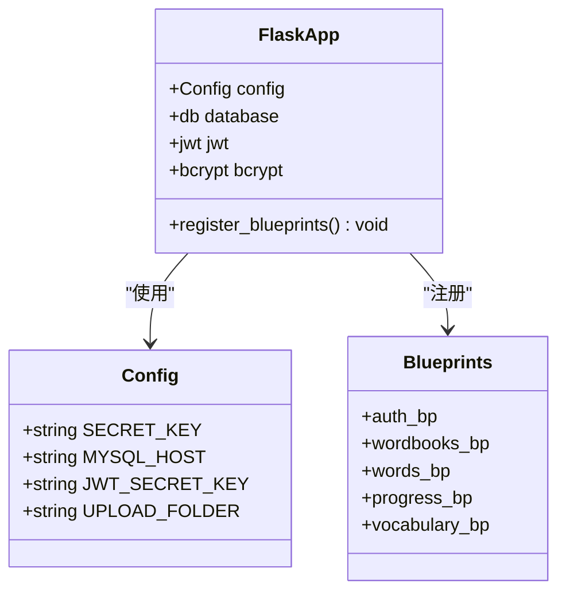

**图表来源**
- [app/__init__.py](file://backend/app/__init__.py#L6-L37)
- [config.py](file://backend/app/config.py#L4-L28)

#### 认证路由配置

认证相关的 API 路由提供了完整的用户管理功能：

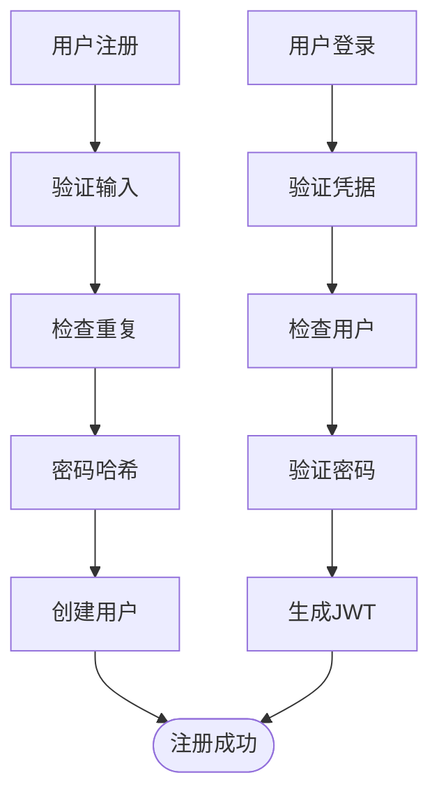

**图表来源**
- [auth.py](file://backend/app/routes/auth.py#L8-L93)

**章节来源**
- [app/__init__.py](file://backend/app/__init__.py#L1-L37)
- [config.py](file://backend/app/config.py#L1-L28)
- [auth.py](file://backend/app/routes/auth.py#L1-L93)

## 依赖关系分析

### Docker 容器依赖关系

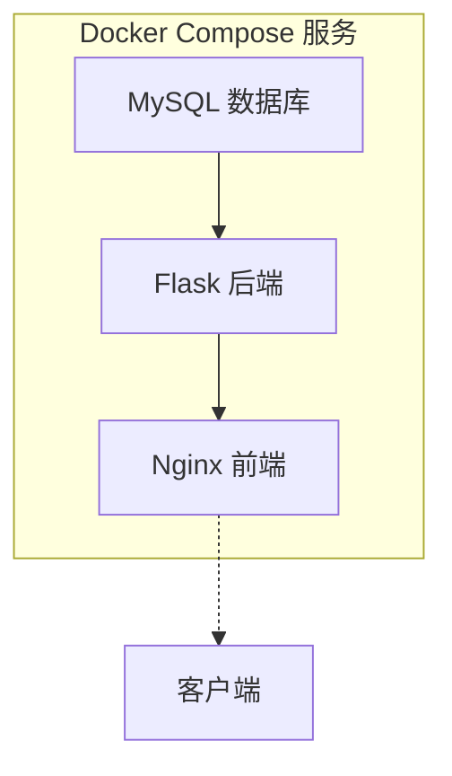

**图表来源**
- [docker-compose.yml](file://docker-compose.yml#L3-L59)

### 端口和服务映射

| 服务 | 内部端口 | 外部端口 | 用途 |
|------|----------|----------|------|
| MySQL | 3306 | 3306 | 数据库服务 |
| Backend | 5000 | 5000 | Flask API 服务 |
| Frontend | 80 | 80 | Nginx Web 服务 |

**章节来源**
- [docker-compose.yml](file://docker-compose.yml#L1-L59)

## 性能考虑

### 缓存策略

系统实现了多层次的缓存策略：

1. **静态资源缓存**：为 JS、CSS、图片等文件设置 1 年缓存
2. **浏览器缓存控制**：使用 immutable 标志确保缓存不可变
3. **Gzip 压缩**：启用内容压缩减少传输体积

### 连接池配置

后端服务使用 Gunicorn 作为 WSGI 服务器，配置了 4 个工作进程：

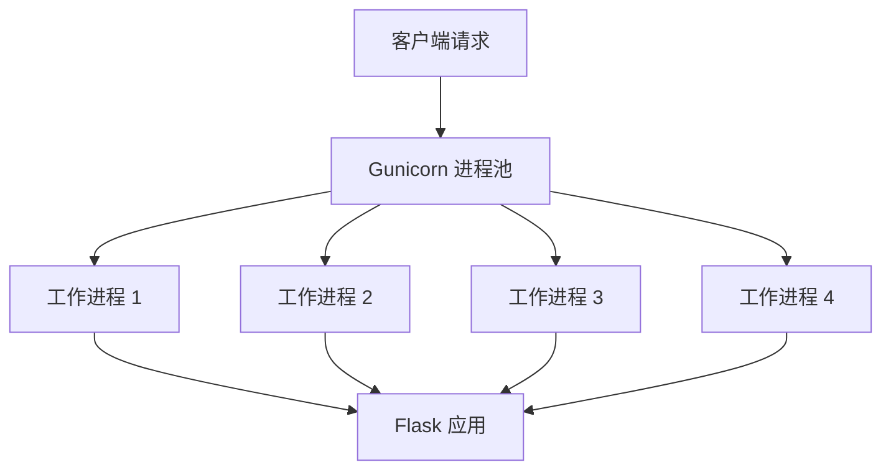

**图表来源**
- [backend.Dockerfile](file://docker/backend.Dockerfile#L28)

### 超时和错误处理

系统在多个层面实现了超时和错误处理机制：

1. **Nginx 超时设置**：API 请求超时时间为 30 秒
2. **Flask 超时配置**：数据库连接超时设置
3. **前端超时处理**：Axios 超时时间 30 秒
4. **错误响应处理**：统一的错误响应格式

**章节来源**
- [nginx.conf](file://docker/nginx.conf#L26)
- [config.py](file://backend/app/config.py#L25-L28)
- [http.js](file://frontend/src/api/http.js#L5)

## 故障排除指南

### 常见问题及解决方案

#### 1. API 请求失败

**症状**：前端无法访问后端 API
**可能原因**：
- Nginx 代理配置错误
- 后端服务未启动
- 网络连接问题

**解决步骤**：
1. 检查 Nginx 配置文件语法
2. 验证后端服务容器状态
3. 使用 curl 测试 API 可达性

#### 2. 静态资源加载失败

**症状**：页面样式或脚本无法加载
**可能原因**：
- 静态资源路径配置错误
- 缓存问题
- 权限问题

**解决步骤**：
1. 检查 Nginx root 目录配置
2. 清除浏览器缓存
3. 验证文件权限设置

#### 3. SPA 路由 404 错误

**症状**：刷新页面或直接访问路由出现 404
**解决步骤**：
1. 确认 try_files 指令配置正确
2. 检查前端路由模式设置
3. 验证 index.html 文件存在

#### 4. 文件上传失败

**症状**：文件上传接口返回错误
**可能原因**：
- 上传文件大小限制
- 权限问题
- 存储空间不足

**解决步骤**：
1. 检查 client_max_body_size 配置
2. 验证上传目录权限
3. 监控磁盘空间使用情况

### 调试方法

#### 1. 日志查看

```bash
# 查看 Nginx 错误日志
docker logs word-learning-frontend

# 查看后端应用日志
docker logs word-learning-backend

# 查看 MySQL 日志
docker logs word-learning-mysql
```

#### 2. 网络连通性测试

```bash
# 测试 Nginx 可达性
curl -I http://localhost/

# 测试 API 可达性
curl -I http://localhost/api/auth/login

# 测试 DNS 解析
nslookup localhost
```

#### 3. 性能监控

```bash
# 监控容器资源使用
docker stats

# 查看网络连接
netstat -tulpn | grep :80

# 检查磁盘使用
df -h
```

**章节来源**
- [nginx.conf](file://docker/nginx.conf#L26)
- [docker-compose.yml](file://docker-compose.yml#L1-L59)

## 结论

本项目的 Nginx 反向代理配置实现了现代化 Web 应用的完整部署需求。通过合理的架构设计和配置优化，系统具备了良好的性能、可维护性和可扩展性。

### 主要优势

1. **清晰的架构分离**：前端、后端和数据库职责明确
2. **高效的缓存策略**：最大化静态资源加载性能
3. **完善的错误处理**：提供一致的用户体验
4. **灵活的配置管理**：支持环境变量和外部配置

### 改进建议

1. **HTTPS 配置**：建议添加 SSL 证书支持
2. **负载均衡**：可考虑多实例部署
3. **监控告警**：添加健康检查和监控系统
4. **安全加固**：增强安全头部和访问控制

该配置为类似项目的部署提供了良好的参考模板，可根据具体需求进行调整和优化。