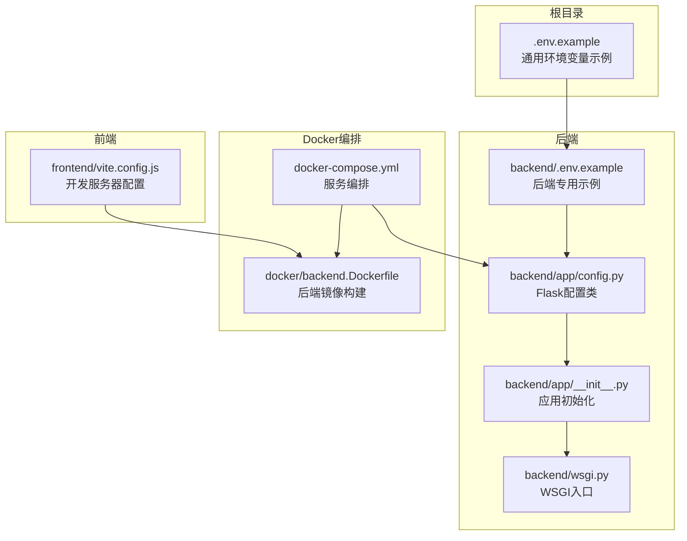
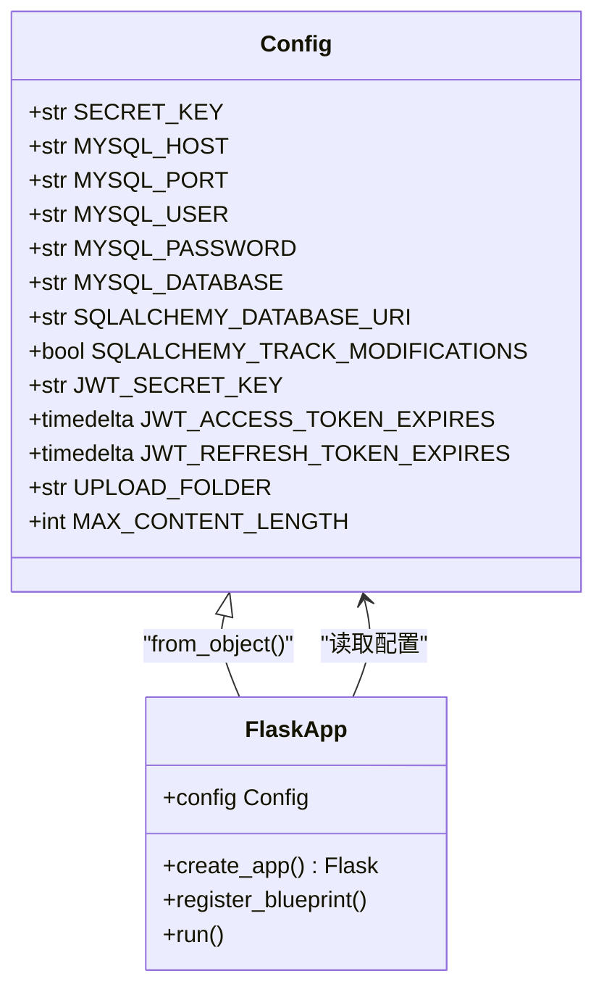
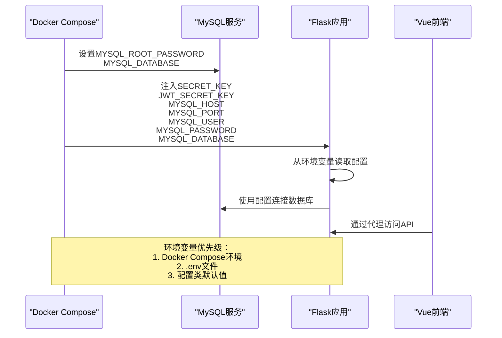
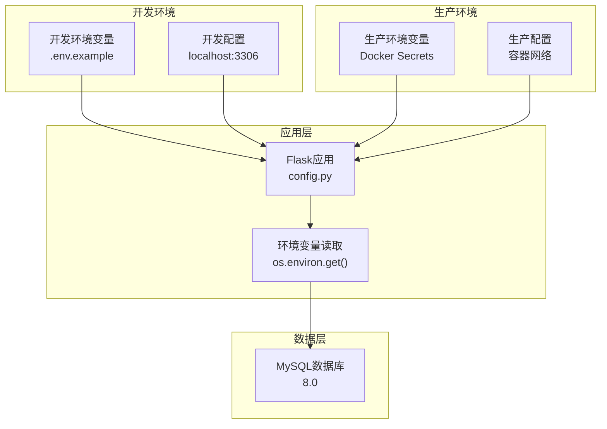
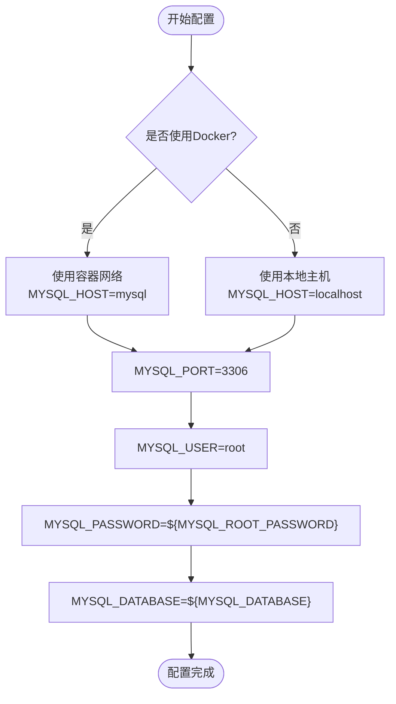
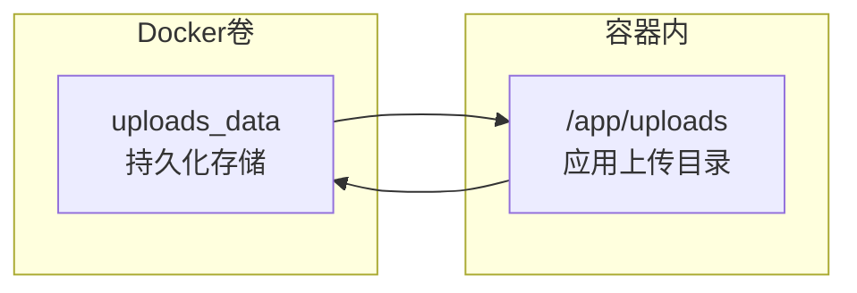
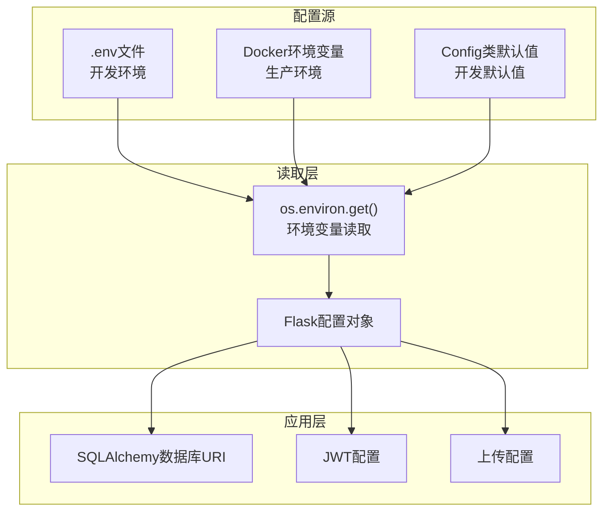
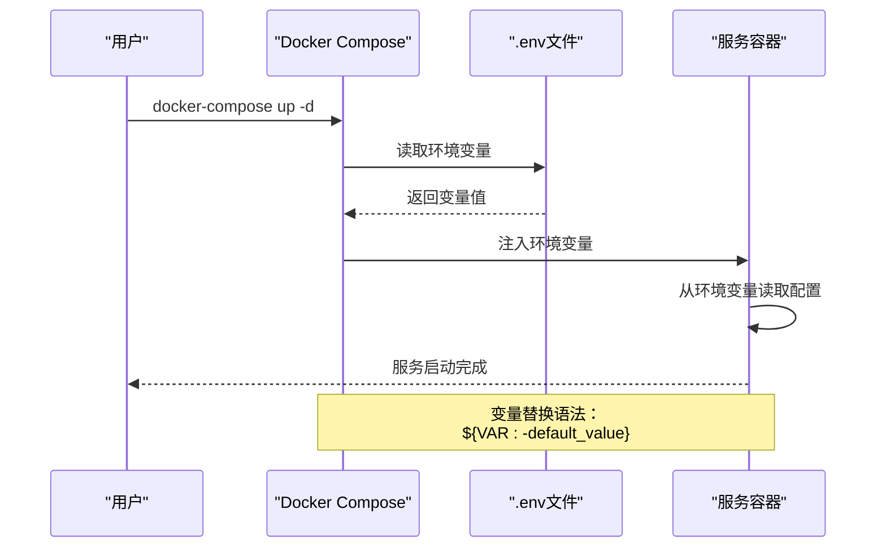
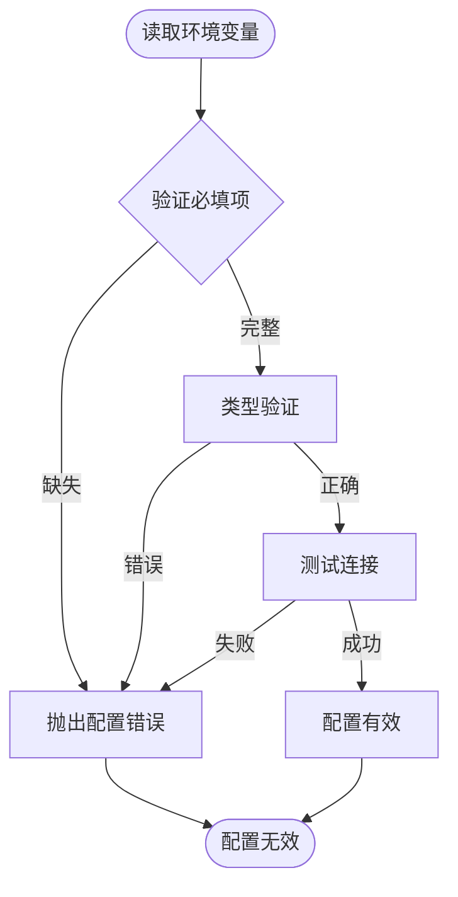

# 环境变量配置

<cite>
**本文档引用的文件**
- [.env.example](file://.env.example)
- [backend/.env.example](file://backend/.env.example)
- [backend/app/config.py](file://backend/app/config.py)
- [backend/app/__init__.py](file://backend/app/__init__.py)
- [backend/wsgi.py](file://backend/wsgi.py)
- [docker-compose.yml](file://docker-compose.yml)
- [docker/backend.Dockerfile](file://docker/backend.Dockerfile)
- [frontend/vite.config.js](file://frontend/vite.config.js)
- [README_CN.md](file://README_CN.md)
</cite>

## 目录
1. [简介](#简介)
2. [项目结构](#项目结构)
3. [核心组件](#核心组件)
4. [架构概览](#架构概览)
5. [详细组件分析](#详细组件分析)
6. [依赖关系分析](#依赖关系分析)
7. [性能考虑](#性能考虑)
8. [故障排除指南](#故障排除指南)
9. [结论](#结论)
10. [附录](#附录)

## 简介
本文件详细说明单词学习网站项目中的环境变量配置，涵盖开发和生产环境的差异、安全最佳实践、Docker 环境变量注入机制以及 Flask 应用的配置读取流程。通过分析项目中的配置文件，帮助开发者正确设置和管理环境变量，确保应用在不同环境中稳定运行。

## 项目结构
该项目采用前后端分离架构，使用 Docker 进行容器化部署。环境变量配置分布在多个位置：
- 根目录的通用示例配置文件
- 后端独立的配置示例文件
- Docker Compose 编排文件
- Flask 应用配置类
- 前端开发服务器代理配置

**图表来源**
- [.env.example](file://.env.example#L1-L10)
- [backend/.env.example](file://backend/.env.example#L1-L9)
- [backend/app/config.py](file://backend/app/config.py#L1-L28)
- [docker-compose.yml](file://docker-compose.yml#L1-L59)

**章节来源**
- [.env.example](file://.env.example#L1-L10)
- [backend/.env.example](file://backend/.env.example#L1-L9)
- [docker-compose.yml](file://docker-compose.yml#L1-L59)

## 核心组件
本节详细分析项目中涉及环境变量的核心组件及其配置方式。

### Flask 应用配置类
Flask 应用通过配置类集中管理所有环境变量，实现了统一的配置接口。

**图表来源**
- [backend/app/config.py](file://backend/app/config.py#L4-L27)
- [backend/app/__init__.py](file://backend/app/__init__.py#L6-L17)

### Docker 环境变量注入
Docker Compose 提供了灵活的环境变量注入机制，支持默认值设置和变量替换。

**图表来源**
- [docker-compose.yml](file://docker-compose.yml#L8-L36)
- [backend/app/config.py](file://backend/app/config.py#L5-L27)

**章节来源**
- [backend/app/config.py](file://backend/app/config.py#L1-L28)
- [backend/app/__init__.py](file://backend/app/__init__.py#L1-L37)
- [docker-compose.yml](file://docker-compose.yml#L1-L59)

## 架构概览
项目采用三层架构模式，环境变量在各层之间传递和使用：

**图表来源**
- [.env.example](file://.env.example#L3-L9)
- [backend/app/config.py](file://backend/app/config.py#L7-L18)
- [docker-compose.yml](file://docker-compose.yml#L4-L21)

## 详细组件分析

### 数据库连接配置
项目支持多种数据库连接配置方式，满足不同环境需求。

#### 开发环境配置
开发环境使用本地 MySQL 实例，便于调试和测试。

| 配置项 | 默认值 | 说明 |
|--------|--------|------|
| MYSQL_HOST | localhost | 数据库主机地址 |
| MYSQL_PORT | 3306 | MySQL端口号 |
| MYSQL_USER | root | 数据库用户名 |
| MYSQL_PASSWORD | password | 数据库密码 |
| MYSQL_DATABASE | word_learning | 数据库名称 |

#### 生产环境配置
生产环境通过 Docker 网络连接数据库容器。

**图表来源**
- [docker-compose.yml](file://docker-compose.yml#L4-L17)
- [docker-compose.yml](file://docker-compose.yml#L23-L43)

**章节来源**
- [backend/app/config.py](file://backend/app/config.py#L7-L18)
- [docker-compose.yml](file://docker-compose.yml#L4-L43)

### JWT 安全配置
JWT 配置包含密钥管理和令牌过期策略。

#### 密钥配置
- SECRET_KEY：用于 Flask 应用的加密密钥
- JWT_SECRET_KEY：用于 JWT 令牌签名

#### 令牌配置
- JWT_ACCESS_TOKEN_EXPIRES：访问令牌有效期，默认1小时
- JWT_REFRESH_TOKEN_EXPIRES：刷新令牌有效期，默认30天

**章节来源**
- [backend/app/config.py](file://backend/app/config.py#L20-L23)

### 文件上传配置
项目支持 PDF 文件上传和处理功能。

#### 上传配置
- UPLOAD_FOLDER：上传文件存储目录
- MAX_CONTENT_LENGTH：最大文件大小限制（50MB）

#### Docker 卷挂载
生产环境通过 Docker 卷持久化上传文件：

**图表来源**
- [docker-compose.yml](file://docker-compose.yml#L37-L38)
- [docker/backend.Dockerfile](file://docker/backend.Dockerfile#L21-L22)

**章节来源**
- [backend/app/config.py](file://backend/app/config.py#L25-L27)
- [docker-compose.yml](file://docker-compose.yml#L37-L38)

### 前端开发配置
前端开发服务器通过代理访问后端 API。

#### 开发服务器配置
- 本地开发端口：3000
- API 代理目标：http://localhost:5000
- 跨域配置：允许所有来源

**章节来源**
- [frontend/vite.config.js](file://frontend/vite.config.js#L6-L14)

## 依赖关系分析

### 环境变量依赖链
环境变量在项目中的传递和依赖关系如下：

**图表来源**
- [backend/app/config.py](file://backend/app/config.py#L5-L27)
- [backend/app/__init__.py](file://backend/app/__init__.py#L8-L17)

### Docker 环境变量注入机制
Docker Compose 提供了强大的环境变量管理能力：

**图表来源**
- [docker-compose.yml](file://docker-compose.yml#L9-L10)
- [docker-compose.yml](file://docker-compose.yml#L30-L36)

**章节来源**
- [docker-compose.yml](file://docker-compose.yml#L1-L59)

## 性能考虑
环境变量配置对应用性能的影响主要体现在以下几个方面：

### 连接池配置
- 建议在生产环境中配置数据库连接池
- 合理设置连接超时和重试机制
- 监控数据库连接数，避免连接泄漏

### 缓存策略
- JWT 令牌缓存可以减少重复认证开销
- 文件上传缓存提升用户体验
- 合理设置缓存过期时间

### 安全性能平衡
- 密钥轮换频率与性能影响的平衡
- 加密算法选择对性能的影响
- SSL/TLS 配置的性能考量

## 故障排除指南

### 常见配置问题

#### 数据库连接失败
**症状**：应用启动时报数据库连接错误
**排查步骤**：
1. 检查 MYSQL_HOST 和 MYSQL_PORT 配置
2. 验证数据库服务状态
3. 确认网络连通性
4. 检查数据库凭据

#### JWT 认证失败
**症状**：用户登录成功但无法访问受保护资源
**排查步骤**：
1. 验证 SECRET_KEY 和 JWT_SECRET_KEY 配置
2. 检查令牌过期时间设置
3. 确认客户端和服务端密钥一致

#### 文件上传失败
**症状**：PDF 文件上传报错
**排查步骤**：
1. 检查 UPLOAD_FOLDER 权限
2. 验证 MAX_CONTENT_LENGTH 设置
3. 确认 Docker 卷挂载正确

**章节来源**
- [README_CN.md](file://README_CN.md#L78-L80)

### 环境变量验证方法
建议实现以下验证机制：

## 结论
本项目提供了完整的环境变量配置方案，支持开发和生产环境的无缝切换。通过 Docker 容器化部署和 Flask 配置类的统一管理，实现了环境变量的安全、可靠和可维护性。建议团队遵循本文档的最佳实践，在实际项目中实施相应的安全措施和监控机制。

## 附录

### 环境变量清单

#### 数据库相关
- MYSQL_HOST：数据库主机地址
- MYSQL_PORT：数据库端口号
- MYSQL_USER：数据库用户名
- MYSQL_PASSWORD：数据库密码
- MYSQL_DATABASE：数据库名称

#### 应用安全相关
- SECRET_KEY：Flask 应用密钥
- JWT_SECRET_KEY：JWT 令牌密钥

#### 文件上传相关
- UPLOAD_FOLDER：上传目录路径
- MAX_CONTENT_LENGTH：最大文件大小

### 最佳实践建议

#### 命名规范
- 使用全大写字母和下划线分隔
- 明确区分作用域（如 MYSQL_ 前缀）
- 避免使用缩写，保持清晰易懂

#### 默认值设置
- 开发环境提供合理的默认值
- 生产环境必须显式设置关键配置
- 使用占位符提示用户修改

#### 版本控制建议
- 将 .env.example 添加到版本控制
- 将 .env 文件添加到 .gitignore
- 使用环境特定的配置文件进行差异化管理

#### 安全管理
- 定期轮换密钥和密码
- 使用 Docker Secrets 管理敏感信息
- 实施最小权限原则
- 建立配置变更审批流程