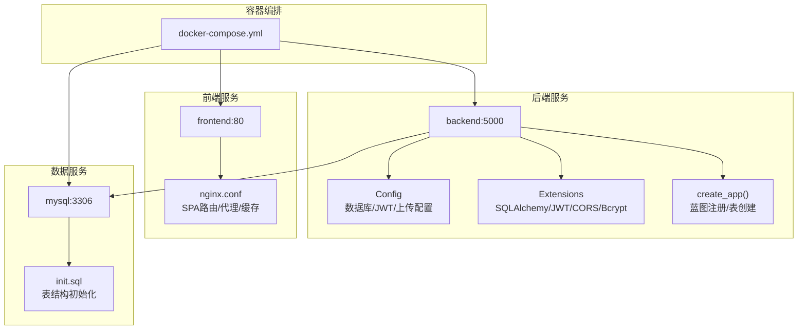
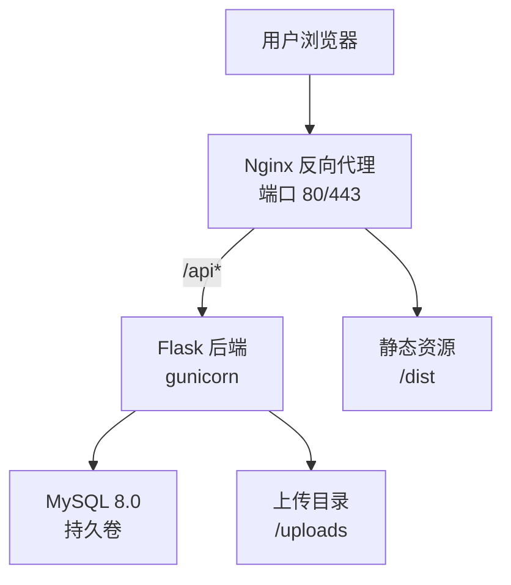
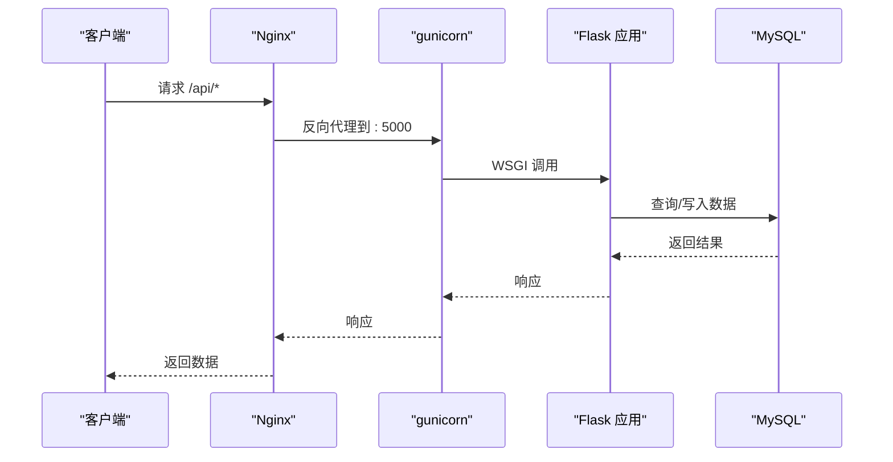
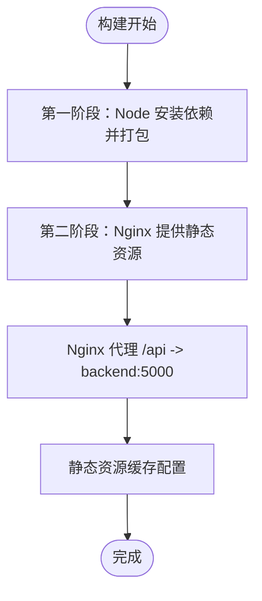
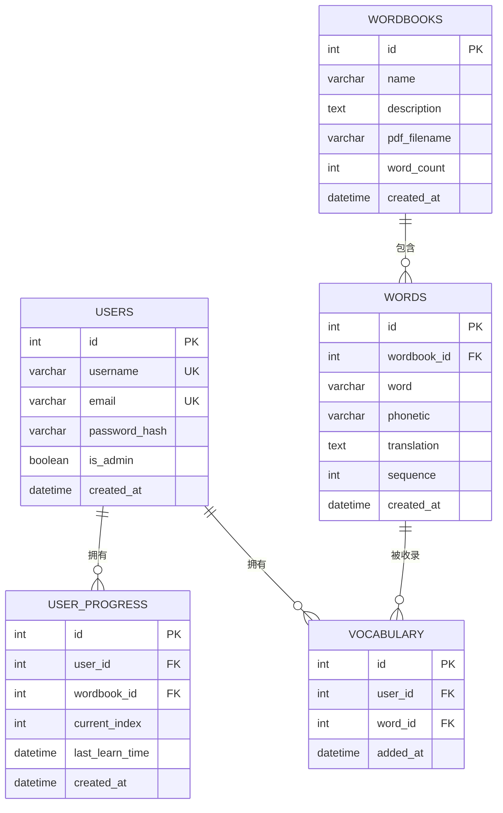
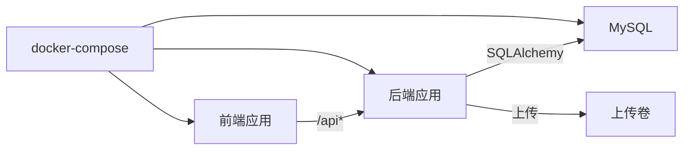

# 生产环境部署

<cite>
**本文引用的文件**
- [docker-compose.yml](file://docker-compose.yml)
- [.env.example](file://backend/.env.example)
- [requirements.txt](file://backend/requirements.txt)
- [config.py](file://backend/app/config.py)
- [__init__.py](file://backend/app/__init__.py)
- [extensions.py](file://backend/app/extensions.py)
- [wsgi.py](file://backend/wsgi.py)
- [backend.Dockerfile](file://docker/backend.Dockerfile)
- [frontend.Dockerfile](file://docker/frontend.Dockerfile)
- [nginx.conf](file://docker/nginx.conf)
- [init.sql](file://init.sql)
- [package.json](file://frontend/package.json)
- [README_CN.md](file://README_CN.md)
</cite>

## 目录
1. [简介](#简介)
2. [项目结构](#项目结构)
3. [核心组件](#核心组件)
4. [架构总览](#架构总览)
5. [详细组件分析](#详细组件分析)
6. [依赖关系分析](#依赖关系分析)
7. [性能考虑](#性能考虑)
8. [故障排除指南](#故障排除指南)
9. [结论](#结论)
10. [附录](#附录)

## 简介
本指南面向生产环境部署单词学习网站，目标是提供从硬件与系统配置、域名与 SSL 准备、完整部署流程、数据迁移与备份、监控与日志、故障排除到安全加固的全栈方案。该网站采用前后端分离架构，后端基于 Flask，前端基于 Vue 3，通过 Nginx 作为反向代理，使用 MySQL 存储数据，并以 Docker Compose 编排运行。

## 项目结构
项目由三层组成：
- 后端 API：Flask 应用，提供认证、词库、单词、学习进度、生词本等接口，使用 gunicorn 作为 WSGI 服务器。
- 前端应用：Vue 3 + Vite 构建，Nginx 提供静态资源与反向代理。
- 数据层：MySQL 8.0，初始化脚本包含用户、词库、单词、进度、生词本等表结构。

图表来源
- [docker-compose.yml](file://docker-compose.yml#L1-L59)
- [config.py](file://backend/app/config.py#L1-L28)
- [extensions.py](file://backend/app/extensions.py#L1-L10)
- [__init__.py](file://backend/app/__init__.py#L1-L37)
- [nginx.conf](file://docker/nginx.conf#L1-L35)
- [init.sql](file://init.sql#L1-L67)

章节来源
- [docker-compose.yml](file://docker-compose.yml#L1-L59)
- [README_CN.md](file://README_CN.md#L1-L84)

## 核心组件
- 后端应用
  - 配置加载：从环境变量读取密钥、数据库连接与 JWT 设置；定义上传目录与最大文件大小。
  - 扩展初始化：SQLAlchemy、JWT、CORS、Bcrypt。
  - 蓝图注册：认证、词库、单词、进度、生词本。
  - 表创建：应用上下文中自动创建数据库表。
- 前端应用
  - 构建产物：dist 目录，由 Nginx 提供静态资源。
  - 代理配置：将 /api 前缀转发至后端服务。
- 数据库
  - 初始化脚本：创建数据库与多张表，包含索引与外键约束。
  - 卷挂载：持久化存储在 mysql_data，上传目录映射到 uploads_data。

章节来源
- [config.py](file://backend/app/config.py#L1-L28)
- [extensions.py](file://backend/app/extensions.py#L1-L10)
- [__init__.py](file://backend/app/__init__.py#L1-L37)
- [init.sql](file://init.sql#L1-L67)
- [docker-compose.yml](file://docker-compose.yml#L1-L59)

## 架构总览
生产部署采用容器化编排，Nginx 作为入口网关，负责静态资源缓存与 API 代理；后端通过 gunicorn 提供服务；数据库使用官方镜像并持久化存储。

图表来源
- [nginx.conf](file://docker/nginx.conf#L1-L35)
- [backend.Dockerfile](file://docker/backend.Dockerfile#L1-L29)
- [docker-compose.yml](file://docker-compose.yml#L1-L59)

## 详细组件分析

### 后端服务（Flask + gunicorn）
- 部署方式：Dockerfile 使用 Python slim 镜像，安装系统与 Python 依赖，复制应用代码，创建工作目录，暴露 5000 端口，使用 gunicorn 启动。
- 配置要点：通过环境变量注入密钥、数据库地址与凭据、JWT 过期时间、上传目录与大小限制。
- 蓝图与路由：认证、词库、单词、进度、生词本等模块化路由，统一前缀 /api。
- 数据库初始化：应用启动时创建所有表，配合 init.sql 保证首次初始化。

图表来源
- [backend.Dockerfile](file://docker/backend.Dockerfile#L1-L29)
- [nginx.conf](file://docker/nginx.conf#L13-L27)
- [config.py](file://backend/app/config.py#L14-L27)
- [__init__.py](file://backend/app/__init__.py#L19-L36)

章节来源
- [backend.Dockerfile](file://docker/backend.Dockerfile#L1-L29)
- [config.py](file://backend/app/config.py#L1-L28)
- [__init__.py](file://backend/app/__init__.py#L1-L37)

### 前端服务（Vue 3 + Nginx）
- 构建与运行：多阶段构建，第一阶段安装依赖并打包，第二阶段使用 Nginx 镜像提供静态服务。
- Nginx 配置：SPA 路由支持、/api 代理、静态资源缓存、上传大小限制。
- 开发与生产差异：开发模式下前端独立运行，生产模式由 Nginx 提供静态资源与代理。

图表来源
- [frontend.Dockerfile](file://docker/frontend.Dockerfile#L1-L30)
- [nginx.conf](file://docker/nginx.conf#L1-L35)

章节来源
- [frontend.Dockerfile](file://docker/frontend.Dockerfile#L1-L30)
- [nginx.conf](file://docker/nginx.conf#L1-L35)
- [package.json](file://frontend/package.json#L1-L22)

### 数据库服务（MySQL 8.0）
- 镜像与持久化：使用官方镜像，数据卷映射至 mysql_data，初始化脚本位于 /docker-entrypoint-initdb.d。
- 初始化脚本：创建数据库与用户、词库、单词、进度、生词本等表，含索引与外键。
- 健康检查：通过 ping 探针检测可用性。

图表来源
- [init.sql](file://init.sql#L6-L66)

章节来源
- [docker-compose.yml](file://docker-compose.yml#L4-L21)
- [init.sql](file://init.sql#L1-L67)

## 依赖关系分析
- 组件耦合
  - 前端依赖后端 API（/api 前缀），通过 Nginx 代理。
  - 后端依赖 MySQL，启动顺序受健康检查约束。
  - 上传目录通过卷映射实现持久化。
- 外部依赖
  - Python 依赖：Flask、SQLAlchemy、JWT、CORS、Bcrypt、PyMySQL、pdfplumber、dotenv、gunicorn。
  - Node 依赖：Vue 3、Pinia、Vue Router、Axios、Vite。

图表来源
- [docker-compose.yml](file://docker-compose.yml#L1-L59)
- [requirements.txt](file://backend/requirements.txt#L1-L11)

章节来源
- [docker-compose.yml](file://docker-compose.yml#L1-L59)
- [requirements.txt](file://backend/requirements.txt#L1-L11)

## 性能考虑
- Web 服务器
  - Nginx 提供静态资源缓存与反向代理，建议启用 gzip 压缩与合理的缓存头。
  - 上传文件大小限制已在配置中设定，可根据业务调整。
- 应用服务器
  - gunicorn 已设置工作进程数，建议结合 CPU 核心数与内存进行调优。
  - 合理设置数据库连接池大小与超时时间。
- 数据库
  - 为高频查询字段建立索引（已有部分索引），定期分析慢查询并优化。
  - 使用只读副本或连接复用来提升读取能力。

## 故障排除指南
- 数据库连接失败
  - 检查环境变量中的主机、端口、用户名、密码与数据库名是否正确。
  - 确认 MySQL 容器健康状态与初始化脚本执行情况。
- PDF 解析异常
  - 确认上传 PDF 格式符合预期，系统对中英对照格式优化。
- API 413 错误
  - 检查 Nginx 中 client_max_body_size 设置与上传大小限制。
- CORS 问题
  - 后端已允许所有来源，若生产环境需限制来源，请在配置中调整。
- 服务启动失败
  - 查看容器日志，确认端口占用与依赖安装是否成功。

章节来源
- [README_CN.md](file://README_CN.md#L78-L81)
- [nginx.conf](file://docker/nginx.conf#L25-L27)
- [config.py](file://backend/app/config.py#L14-L27)

## 结论
本部署方案以容器化为核心，结合 Nginx、Flask、MySQL 实现高可用与易维护的生产环境。通过明确的配置项、初始化脚本与卷管理，可快速完成上线与后续运维。

## 附录

### 生产环境硬件与系统配置
- 服务器规格建议
  - CPU：至少 2 核，建议 4 核以上
  - 内存：至少 4 GB，建议 8 GB 以上
  - 存储：系统盘 50 GB SSD，数据盘按并发与数据量评估（建议 200 GB+）
- 操作系统
  - Ubuntu 20.04/22.04 或 CentOS 8+/AlmaLinux 8+
- 网络
  - 开放端口：80、443（HTTPS）、3306（MySQL）
  - 建议使用内网隔离数据库与应用容器

### 部署前准备
- 域名与 SSL
  - 配置域名解析至服务器公网 IP
  - 申请并部署 SSL 证书（推荐 Let’s Encrypt 自动续期）
- 防火墙
  - 仅开放必要端口，关闭其他入站端口
  - 使用 fail2ban 等工具降低暴力破解风险

### 完整部署流程
- 步骤概览
  - 准备服务器与系统基础环境（Docker、Docker Compose）
  - 下载/克隆项目代码，复制并编辑环境变量文件
  - 构建镜像并启动容器
  - 验证服务状态与数据库初始化
  - 配置 Nginx 与 SSL，开放域名访问
- 关键命令参考
  - 启动：docker-compose up -d
  - 查看日志：docker-compose logs -f
  - 停止：docker-compose down

章节来源
- [docker-compose.yml](file://docker-compose.yml#L1-L59)
- [README_CN.md](file://README_CN.md#L11-L23)

### 数据迁移与备份策略
- 数据库初始化
  - 首次部署：init.sql 将自动创建数据库与表结构
  - 后续升级：使用迁移工具（如 Alembic）或手动执行增量脚本
- 备份计划
  - 数据库：每日全量备份 + 每小时增量备份
  - 上传目录：定期同步至对象存储或外部备份设备
- 恢复演练
  - 定期进行恢复测试，验证备份有效性

章节来源
- [init.sql](file://init.sql#L1-L67)
- [docker-compose.yml](file://docker-compose.yml#L13-L15)

### 监控与日志
- 容器日志
  - 使用 docker-compose 日志输出，或集成集中式日志（如 ELK/Fluentd）
- 应用性能监控
  - 监控后端响应时间、错误率、数据库连接数
  - 监控前端静态资源加载与 API 调用成功率
- 告警设置
  - 基于阈值触发告警（CPU、内存、磁盘、错误率）

### 安全加固
- 访问控制
  - 限制来源 IP，启用 WAF（如 Nginx + ModSecurity）
  - 对 /api 接口启用鉴权与速率限制
- 输入验证
  - 后端对请求参数进行严格校验与清洗
- 安全更新
  - 定期更新 Docker 镜像与依赖包
  - 关注 CVE 并及时修补