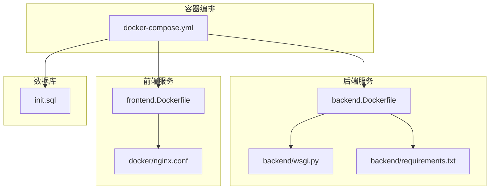
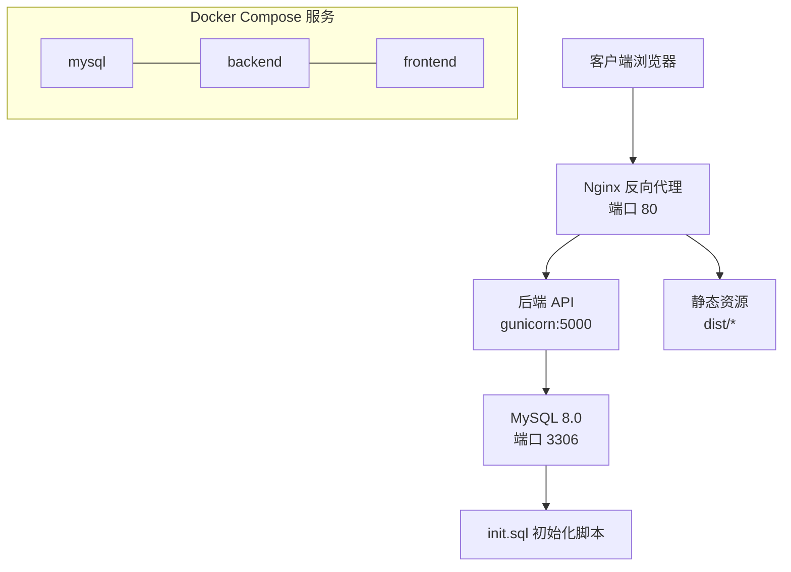
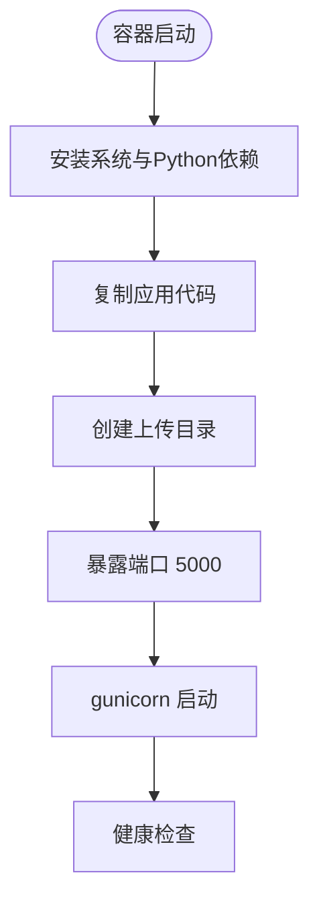
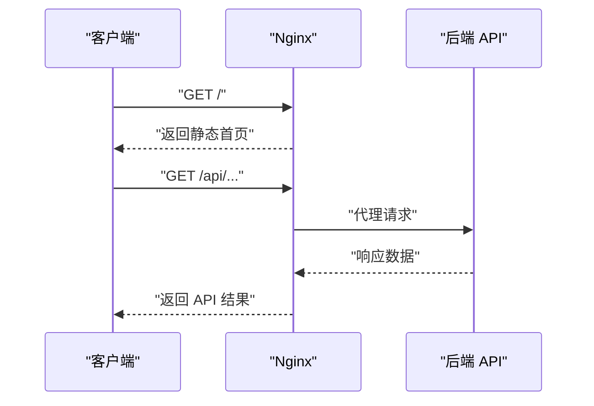
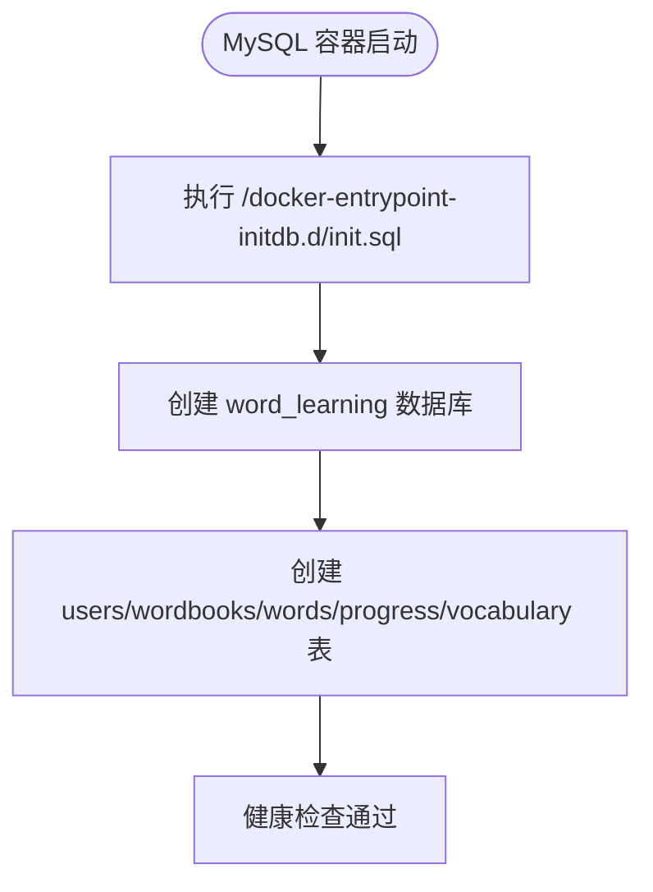
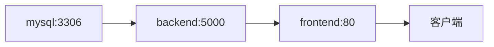

# 部署与容器化

<cite>
**本文引用的文件**
- [docker-compose.yml](file://docker-compose.yml)
- [backend.Dockerfile](file://docker/backend.Dockerfile)
- [frontend.Dockerfile](file://docker/frontend.Dockerfile)
- [nginx.conf](file://docker/nginx.conf)
- [.env.example](file://.env.example)
- [backend/.env.example](file://backend/.env.example)
- [backend/requirements.txt](file://backend/requirements.txt)
- [backend/wsgi.py](file://backend/wsgi.py)
- [init.sql](file://init.sql)
- [frontend/package.json](file://frontend/package.json)
- [frontend/vite.config.js](file://frontend/vite.config.js)
- [README_CN.md](file://README_CN.md)
</cite>

## 目录
1. [简介](#简介)
2. [项目结构](#项目结构)
3. [核心组件](#核心组件)
4. [架构总览](#架构总览)
5. [详细组件分析](#详细组件分析)
6. [依赖关系分析](#依赖关系分析)
7. [性能与扩展性考虑](#性能与扩展性考虑)
8. [安全配置](#安全配置)
9. [负载均衡与高可用](#负载均衡与高可用)
10. [日志与监控](#日志与监控)
11. [自动化部署与回滚](#自动化部署与回滚)
12. [故障排查指南](#故障排查指南)
13. [结论](#结论)

## 简介
本项目是一个基于 Flask + Vue 3 的单词学习平台，提供词库管理、生词本、学习进度追踪以及 PDF 单词提取等功能。本文档面向生产环境，系统性地介绍容器化部署方案，涵盖后端、前端与 Nginx 的镜像构建与运行配置、docker-compose 编排设计、环境变量与数据库初始化、文件上传目录管理、安全加固（SSL、防火墙、访问控制）、负载均衡与高可用、日志与监控、自动化部署与回滚策略，以及常见问题排查。

## 项目结构
项目采用多模块分层组织：
- 后端：Flask 应用，使用 gunicorn 提供 WSGI 服务，通过环境变量配置数据库与密钥。
- 前端：Vue 3 + Vite 应用，构建后由 Nginx 提供静态资源与反向代理。
- 容器编排：docker-compose 统一编排 MySQL、后端、前端三个服务，定义网络、卷与健康检查。
- 数据库初始化：init.sql 脚本在首次启动时自动创建数据库与表结构。

图表来源
- [docker-compose.yml](file://docker-compose.yml#L1-L59)
- [backend.Dockerfile](file://docker/backend.Dockerfile#L1-L29)
- [frontend.Dockerfile](file://docker/frontend.Dockerfile#L1-L30)
- [nginx.conf](file://docker/nginx.conf#L1-L35)
- [backend/wsgi.py](file://backend/wsgi.py#L1-L7)
- [backend/requirements.txt](file://backend/requirements.txt#L1-L11)
- [init.sql](file://init.sql#L1-L67)

章节来源
- [docker-compose.yml](file://docker-compose.yml#L1-L59)
- [README_CN.md](file://README_CN.md#L1-L84)

## 核心组件
- MySQL 数据库：提供持久化存储，包含用户、单词书、单词、学习进度与生词本等表。
- 后端 Flask 应用：提供 REST API，使用 gunicorn 运行，支持 JWT 认证、CORS、PDF 解析等。
- 前端 Vue 应用：构建产物由 Nginx 提供，Nginx 作为反向代理转发 /api 请求至后端。
- Nginx：负责静态资源缓存、SPA 路由回退、API 代理与上传文件大小限制。

章节来源
- [docker-compose.yml](file://docker-compose.yml#L4-L58)
- [backend/requirements.txt](file://backend/requirements.txt#L1-L11)
- [frontend/package.json](file://frontend/package.json#L1-L22)
- [docker/nginx.conf](file://docker/nginx.conf#L1-L35)

## 架构总览
容器化生产架构采用三服务模型：MySQL、后端、前端。后端通过环境变量连接数据库；前端通过 Nginx 将 /api 请求代理到后端；MySQL 使用命名卷持久化数据与初始化脚本。

图表来源
- [docker-compose.yml](file://docker-compose.yml#L3-L58)
- [docker/nginx.conf](file://docker/nginx.conf#L14-L27)
- [backend/wsgi.py](file://backend/wsgi.py#L1-L7)
- [init.sql](file://init.sql#L1-L67)

## 详细组件分析

### 后端服务（Flask + gunicorn）
- 基础镜像与依赖：使用 Python slim 基础镜像，安装 MySQL 客户端开发包与 Python 依赖，复制应用代码并在容器内创建上传目录。
- 端口暴露与启动：容器暴露 5000 端口，使用 gunicorn 启动应用。
- 环境变量：通过 docker-compose 注入密钥与数据库连接参数，后端以环境变量驱动配置。
- 上传目录：映射 uploads_data 卷到 /app/uploads，用于保存上传的 PDF 等文件。

图表来源
- [backend.Dockerfile](file://docker/backend.Dockerfile#L1-L29)
- [docker-compose.yml](file://docker-compose.yml#L23-L44)

章节来源
- [backend.Dockerfile](file://docker/backend.Dockerfile#L1-L29)
- [docker-compose.yml](file://docker-compose.yml#L23-L44)
- [backend/wsgi.py](file://backend/wsgi.py#L1-L7)

### 前端服务（Vite + Nginx）
- 多阶段构建：第一阶段使用 Node 构建前端产物，第二阶段使用 Nginx 镜像提供静态服务。
- Nginx 配置：监听 80 端口，SPA 路由回退至 index.html；/api 路径代理到后端；静态资源设置长缓存；上传文件大小限制为 50MB。
- 端口映射：容器暴露 80 端口，映射到主机 80 端口。

图表来源
- [frontend.Dockerfile](file://docker/frontend.Dockerfile#L1-L30)
- [nginx.conf](file://docker/nginx.conf#L1-L35)
- [docker-compose.yml](file://docker-compose.yml#L45-L58)

章节来源
- [frontend.Dockerfile](file://docker/frontend.Dockerfile#L1-L30)
- [docker/nginx.conf](file://docker/nginx.conf#L1-L35)
- [docker-compose.yml](file://docker-compose.yml#L45-L58)

### 数据库服务（MySQL 8.0）
- 镜像与持久化：使用官方 MySQL 8.0 镜像，挂载 mysql_data 卷与 init.sql 到初始化路径。
- 初始化脚本：创建数据库与用户、单词书、单词、学习进度、生词本等表，设置字符集与索引。
- 健康检查：通过 mysqladmin ping 检测容器健康状态。
- 端口映射：容器 3306 映射到主机 3306。

图表来源
- [docker-compose.yml](file://docker-compose.yml#L4-L22)
- [init.sql](file://init.sql#L1-L67)

章节来源
- [docker-compose.yml](file://docker-compose.yml#L4-L22)
- [init.sql](file://init.sql#L1-L67)

## 依赖关系分析
- 服务依赖：后端依赖 MySQL（健康检查条件），前端依赖后端（顺序依赖）。
- 网络与通信：前端通过 Nginx 代理访问后端 API；后端通过环境变量连接 MySQL。
- 数据卷：MySQL 使用 mysql_data 持久化数据；后端使用 uploads_data 持久化上传文件。

图表来源
- [docker-compose.yml](file://docker-compose.yml#L3-L58)

章节来源
- [docker-compose.yml](file://docker-compose.yml#L3-L58)

## 性能与扩展性考虑
- 后端并发：gunicorn 使用多进程处理请求，适合生产环境。
- 前端缓存：Nginx 对静态资源设置长期缓存，减少带宽与延迟。
- 数据库性能：初始化脚本为关键字段建立索引，提升查询效率。
- 扩展建议：可引入负载均衡器（如 HAProxy 或云负载均衡）对后端进行横向扩展；使用独立的静态对象存储（如 MinIO）替代容器内上传目录，提高可靠性与扩展性。

## 安全配置
- 密钥与认证
  - 后端密钥：通过环境变量注入 SECRET_KEY 与 JWT_SECRET_KEY，避免硬编码。
  - 前端开发：本地开发使用 Vite 代理到后端 5000 端口，生产环境由 Nginx 代理。
- 数据库安全
  - 使用只读或受限用户连接应用（当前示例使用 root，生产建议创建专用用户与最小权限）。
  - 仅暴露必要端口（3306、80），内部网络隔离。
- 传输安全
  - 建议在生产环境中启用 HTTPS（通过反向代理或云平台 SSL 终端），并强制重定向。
- 访问控制
  - 限制对外暴露端口，仅开放 80（可选 443）。
  - 使用防火墙规则限制来源 IP，结合 WAF 或 CDN 增强防护。

章节来源
- [.env.example](file://.env.example#L1-L10)
- [backend/.env.example](file://backend/.env.example#L1-L9)
- [docker-compose.yml](file://docker-compose.yml#L29-L36)

## 负载均衡与高可用
- 后端扩展：通过增加后端容器副本实现水平扩展，配合负载均衡器分发请求。
- 存储分离：将 uploads_data 卷替换为共享存储（如 NFS、对象存储），确保多实例一致性。
- 数据库高可用：使用主从复制或云托管数据库（具备自动故障转移能力）。
- 健康检查：利用 compose 的健康检查与重启策略，提升系统自愈能力。

## 日志与监控
- 日志采集
  - 后端：gunicorn 默认输出到标准输出，可通过 Docker 日志驱动收集。
  - 前端：Nginx 访问与错误日志可挂载到宿主机或集中化日志系统。
  - 数据库：MySQL 日志可通过卷或外部日志系统采集。
- 监控指标
  - CPU、内存、磁盘使用率。
  - 应用响应时间、错误率、QPS。
  - 数据库连接数、慢查询、锁等待。
- 告警策略：基于阈值触发告警，结合日志与指标进行根因分析。

## 自动化部署与回滚
- 部署流程
  - 准备环境变量文件（.env 与后端 .env），确保密钥与数据库参数正确。
  - 构建镜像：docker-compose build（可选）或直接使用官方镜像。
  - 启动服务：docker-compose up -d。
  - 健康检查：等待各服务健康后上线。
- 回滚策略
  - 版本化镜像标签，回滚时切换到上一个稳定版本。
  - 数据库迁移采用不可逆变更前先备份，回滚时恢复备份。
  - 使用蓝绿发布或滚动更新降低停机风险。

## 故障排查指南
- 端口冲突
  - 症状：容器启动失败或端口占用。
  - 排查：确认主机 80、3306 是否被其他服务占用；修改 docker-compose 端口映射或释放端口。
- 权限问题
  - 症状：后端无法写入上传目录或数据库初始化失败。
  - 排查：确认 uploads_data 卷权限与所有者；检查 init.sql 执行权限。
- 数据库连接失败
  - 症状：后端启动时报数据库连接错误。
  - 排查：核对环境变量中的主机名、端口、用户名、密码与数据库名；确认 MySQL 已初始化完成并通过健康检查。
- CORS 或跨域问题
  - 症状：前端调用后端 API 报跨域错误。
  - 排查：确认后端已启用 CORS；Nginx 代理头配置是否正确传递 Origin、Referer 等头部。
- PDF 解析异常
  - 症状：上传 PDF 后解析失败或结果为空。
  - 排查：确认上传文件格式与内容符合预期；检查后端依赖与日志输出。

章节来源
- [README_CN.md](file://README_CN.md#L78-L81)
- [docker-compose.yml](file://docker-compose.yml#L18-L21)
- [backend/requirements.txt](file://backend/requirements.txt#L6-L7)

## 结论
本文档提供了从零到一的生产级部署方案，覆盖容器化构建、编排、环境变量、数据库初始化、安全加固、负载均衡与高可用、日志与监控、自动化部署与回滚，以及常见问题排查。建议在生产环境中进一步完善密钥管理、数据库权限、HTTPS 与 WAF 防护，并结合监控与告警体系持续优化系统稳定性与性能。