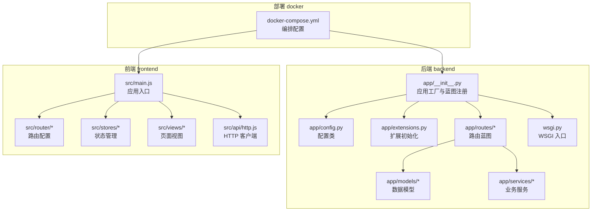
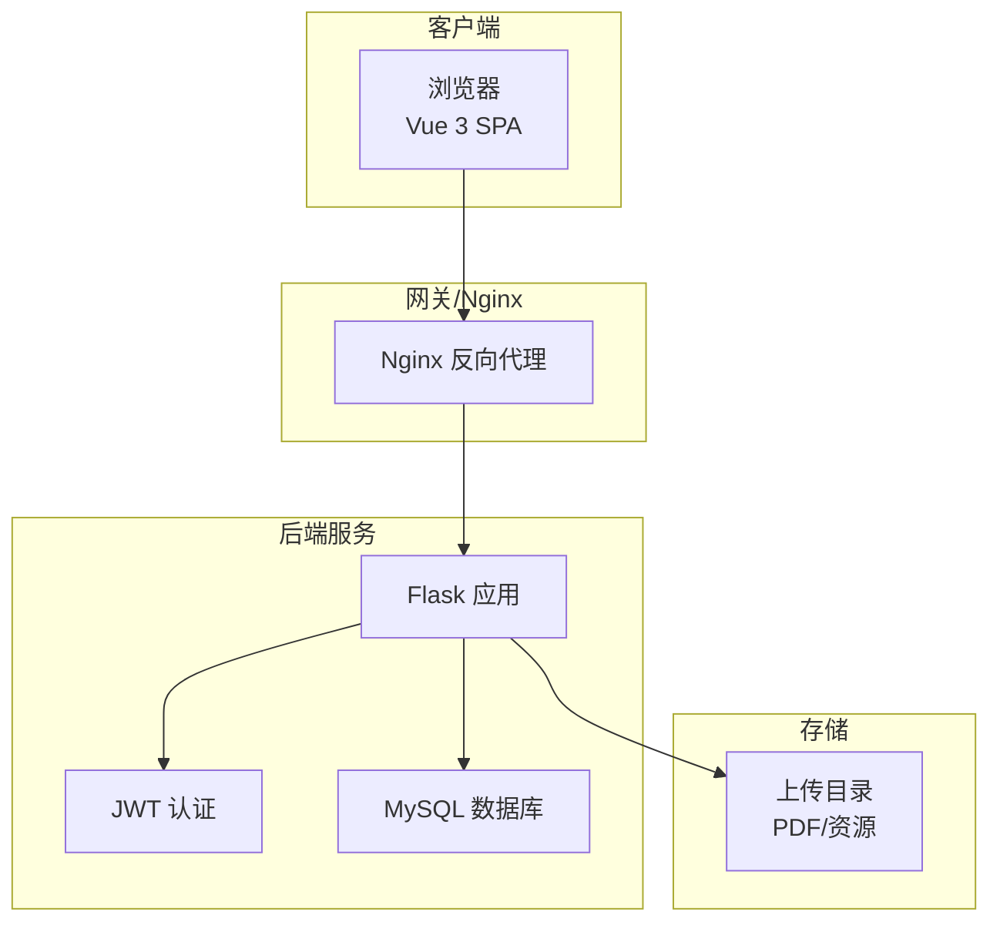
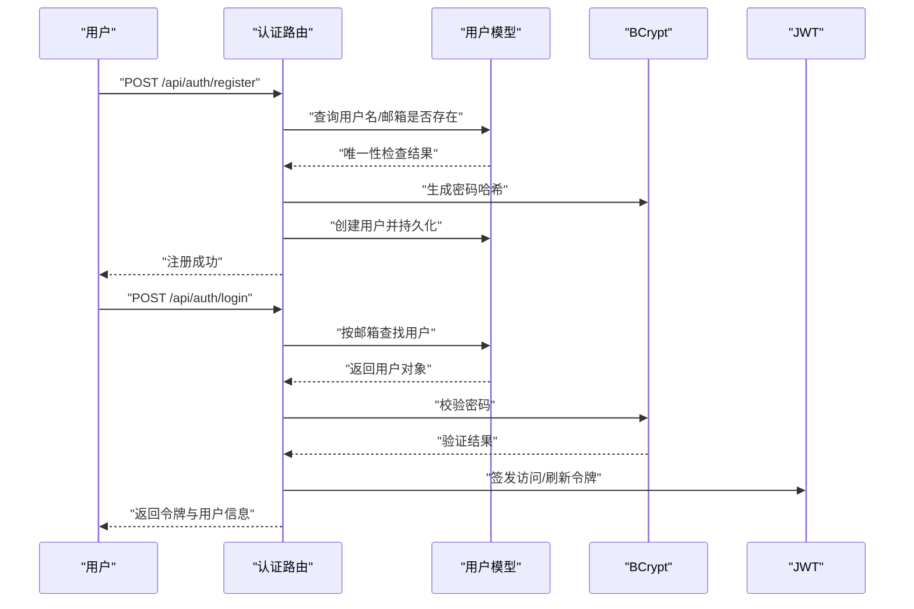
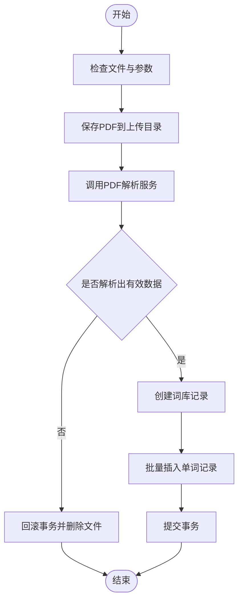
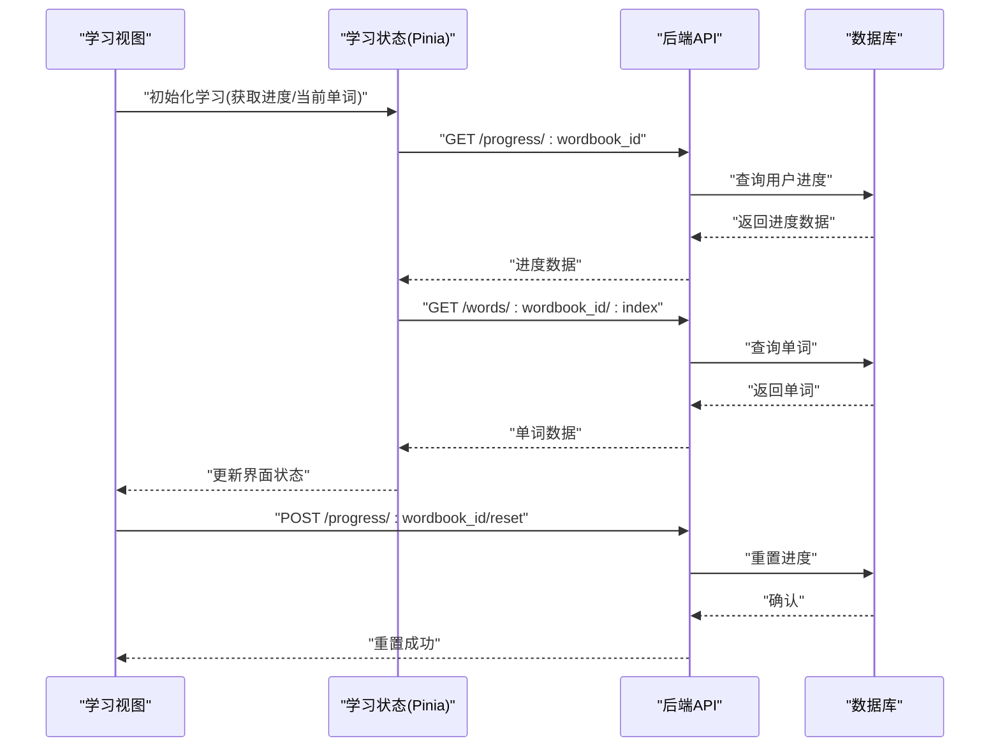
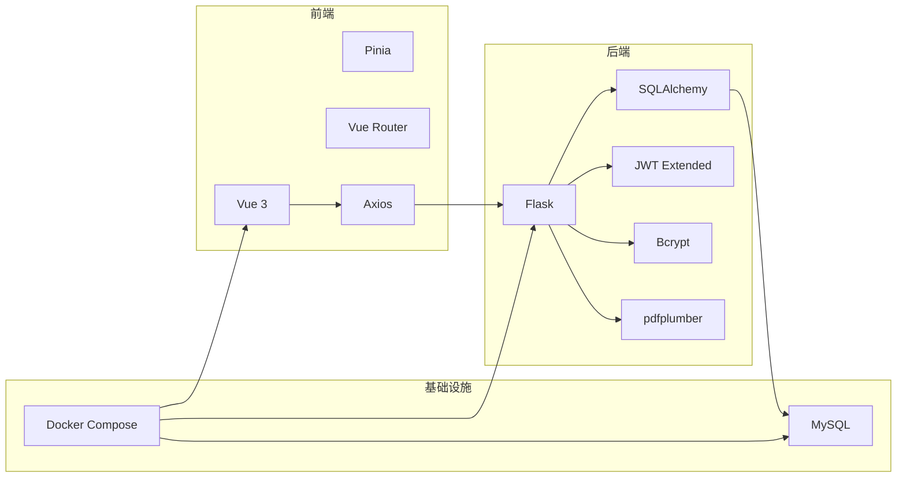

# 项目概述

<cite>
**本文引用的文件**
- [README_CN.md](file://README_CN.md)
- [backend/app/__init__.py](file://backend/app/__init__.py)
- [backend/wsgi.py](file://backend/wsgi.py)
- [docker-compose.yml](file://docker-compose.yml)
- [backend/app/config.py](file://backend/app/config.py)
- [backend/app/extensions.py](file://backend/app/extensions.py)
- [backend/requirements.txt](file://backend/requirements.txt)
- [frontend/package.json](file://frontend/package.json)
- [frontend/src/main.js](file://frontend/src/main.js)
- [backend/app/models/user.py](file://backend/app/models/user.py)
- [backend/app/routes/auth.py](file://backend/app/routes/auth.py)
- [backend/app/routes/wordbooks.py](file://backend/app/routes/wordbooks.py)
- [backend/app/services/pdf_parser.py](file://backend/app/services/pdf_parser.py)
- [frontend/src/views/Home.vue](file://frontend/src/views/Home.vue)
- [frontend/src/views/Learn.vue](file://frontend/src/views/Learn.vue)
</cite>

## 目录
1. [引言](#引言)
2. [项目结构](#项目结构)
3. [核心组件](#核心组件)
4. [架构总览](#架构总览)
5. [详细组件分析](#详细组件分析)
6. [依赖关系分析](#依赖关系分析)
7. [性能考虑](#性能考虑)
8. [故障排除指南](#故障排除指南)
9. [结论](#结论)
10. [附录](#附录)

## 引言
本项目是一个基于 Flask + Vue 3 的单词学习平台，旨在帮助用户高效地管理词库、建立个人生词本、追踪学习进度，并支持从 PDF 文件中自动提取单词进行导入学习。项目采用前后端分离架构，后端通过 Flask 提供 RESTful API，前端使用 Vue 3 + Pinia + Vue Router 构建单页应用，配合 Docker 进行一键部署。

- 核心目标
  - 提供易用的词库浏览与学习体验
  - 支持管理员上传 PDF 并解析生成词库
  - 为普通用户提供生词本与学习进度追踪
  - 通过 JWT 实现安全的身份认证与授权

- 主要功能特性
  - 用户认证与权限控制（普通用户/管理员）
  - 词库管理（查看、分页、进度展示）
  - 生词本与学习流程（卡片翻转、快捷键、进度记录）
  - 学习进度追踪（当前索引、最后学习时间）
  - PDF 单词提取（正则解析 + 批量入库）

- 技术选型理由
  - Flask：轻量、灵活、生态丰富，适合快速构建 API 与集成扩展
  - Vue 3：现代化前端框架，组合式 API 提升开发效率
  - SQLAlchemy：成熟 ORM，便于模型定义与数据库迁移
  - pdfplumber：稳定可靠的 PDF 文本提取工具
  - Docker：标准化部署，降低环境差异带来的问题

- 应用场景与目标用户
  - 场景：语言学习、词汇积累、应试备考
  - 用户：学生、自学者、语言爱好者；管理员负责维护词库

**章节来源**
- [README_CN.md](file://README_CN.md#L1-L84)

## 项目结构
项目采用前后端分离布局，后端位于 backend/，前端位于 frontend/，Docker 相关配置位于 docker/，并通过 docker-compose.yml 统一编排。

**图表来源**
- [backend/app/__init__.py](file://backend/app/__init__.py#L1-L37)
- [backend/app/config.py](file://backend/app/config.py#L1-L28)
- [backend/app/extensions.py](file://backend/app/extensions.py#L1-L10)
- [backend/wsgi.py](file://backend/wsgi.py#L1-L7)
- [frontend/src/main.js](file://frontend/src/main.js#L1-L13)
- [docker-compose.yml](file://docker-compose.yml#L1-L59)

**章节来源**
- [README_CN.md](file://README_CN.md#L5-L9)
- [backend/app/__init__.py](file://backend/app/__init__.py#L1-L37)
- [frontend/src/main.js](file://frontend/src/main.js#L1-L13)
- [docker-compose.yml](file://docker-compose.yml#L1-L59)

## 核心组件
- 后端应用工厂与蓝图注册
  - 应用工厂负责初始化配置、扩展与蓝图注册，并在应用上下文中创建数据库表
  - 蓝图按功能划分：认证、词库、单词、进度、词汇表

- 配置与扩展
  - 配置类集中管理数据库、JWT、上传路径等参数
  - 扩展统一初始化 SQLAlchemy、JWT、CORS、Bcrypt

- 前端应用入口
  - 使用 Vue 3 + Pinia + Vue Router 构建，挂载到 DOM

- 关键模型与路由
  - 用户模型包含基础字段与关系
  - 认证路由提供注册、登录、刷新令牌与当前用户查询
  - 词库路由支持管理员上传 PDF、解析并批量入库，同时提供用户侧的词库列表与进度展示

**章节来源**
- [backend/app/__init__.py](file://backend/app/__init__.py#L6-L36)
- [backend/app/config.py](file://backend/app/config.py#L4-L27)
- [backend/app/extensions.py](file://backend/app/extensions.py#L1-L10)
- [frontend/src/main.js](file://frontend/src/main.js#L1-L13)
- [backend/app/models/user.py](file://backend/app/models/user.py#L4-L26)
- [backend/app/routes/auth.py](file://backend/app/routes/auth.py#L8-L93)
- [backend/app/routes/wordbooks.py](file://backend/app/routes/wordbooks.py#L28-L159)

## 架构总览
系统采用前后端分离架构，后端通过 REST API 提供数据与业务能力，前端负责渲染与交互。Docker 将 MySQL、后端、前端服务编排在一起，便于本地与生产环境的一致化部署。

**图表来源**
- [docker-compose.yml](file://docker-compose.yml#L23-L54)
- [backend/app/__init__.py](file://backend/app/__init__.py#L16-L30)
- [backend/app/config.py](file://backend/app/config.py#L14-L18)

**章节来源**
- [docker-compose.yml](file://docker-compose.yml#L1-L59)
- [backend/app/__init__.py](file://backend/app/__init__.py#L1-L37)
- [backend/app/config.py](file://backend/app/config.py#L1-L28)

## 详细组件分析

### 认证与权限控制
- 功能要点
  - 注册：校验必填项与唯一性，密码加密存储，首个用户自动成为管理员
  - 登录：邮箱+密码验证，签发访问与刷新令牌
  - 刷新：使用刷新令牌换取新的访问令牌
  - 当前用户：JWT 保护的用户信息查询

- 流程时序

**图表来源**
- [backend/app/routes/auth.py](file://backend/app/routes/auth.py#L8-L93)
- [backend/app/models/user.py](file://backend/app/models/user.py#L4-L26)

**章节来源**
- [backend/app/routes/auth.py](file://backend/app/routes/auth.py#L8-L93)
- [backend/app/models/user.py](file://backend/app/models/user.py#L4-L26)

### 词库管理与 PDF 解析
- 功能要点
  - 管理员上传 PDF，后端解析文本并提取单词、音标、释义
  - 批量写入词库与单词表，记录单词数量
  - 普通用户查看词库列表，显示学习进度（当前索引、最后学习时间）

- 处理流程

**图表来源**
- [backend/app/routes/wordbooks.py](file://backend/app/routes/wordbooks.py#L68-L136)
- [backend/app/services/pdf_parser.py](file://backend/app/services/pdf_parser.py#L4-L43)

**章节来源**
- [backend/app/routes/wordbooks.py](file://backend/app/routes/wordbooks.py#L68-L159)
- [backend/app/services/pdf_parser.py](file://backend/app/services/pdf_parser.py#L4-L43)

### 学习流程与进度追踪
- 功能要点
  - 首页展示词库卡片，显示学习进度条与继续学习入口
  - 学习页支持卡片翻转、左右切换、加入/移除生词本、重置进度
  - 进度由后端记录，前端通过 Pinia 状态管理与接口交互

- 交互序列

**图表来源**
- [frontend/src/views/Learn.vue](file://frontend/src/views/Learn.vue#L136-L179)
- [frontend/src/views/Home.vue](file://frontend/src/views/Home.vue#L81-L93)
- [backend/app/routes/wordbooks.py](file://backend/app/routes/wordbooks.py#L28-L54)

**章节来源**
- [frontend/src/views/Learn.vue](file://frontend/src/views/Learn.vue#L106-L198)
- [frontend/src/views/Home.vue](file://frontend/src/views/Home.vue#L65-L108)
- [backend/app/routes/wordbooks.py](file://backend/app/routes/wordbooks.py#L28-L54)

### 前后端依赖与运行时关系
- 前端依赖
  - Vue 3、Pinia、Vue Router、Axios
  - Vite 开发与构建工具
- 后端依赖
  - Flask、SQLAlchemy、JWT Extended、CORS、Bcrypt、PyMySQL、pdfplumber、python-dotenv、gunicorn

**章节来源**
- [frontend/package.json](file://frontend/package.json#L11-L21)
- [backend/requirements.txt](file://backend/requirements.txt#L1-L11)

## 依赖关系分析
- 组件耦合
  - 后端通过蓝图将路由与模型解耦，服务层独立于路由层
  - 前端通过 HTTP 客户端与后端 API 解耦，状态管理与视图解耦
- 外部依赖
  - MySQL 作为持久化存储
  - pdfplumber 用于 PDF 文本提取
  - JWT 保障接口安全
- 部署依赖
  - Docker Compose 编排 MySQL、后端、前端服务

**图表来源**
- [frontend/package.json](file://frontend/package.json#L11-L21)
- [backend/requirements.txt](file://backend/requirements.txt#L1-L11)
- [docker-compose.yml](file://docker-compose.yml#L1-L59)

**章节来源**
- [frontend/package.json](file://frontend/package.json#L1-L22)
- [backend/requirements.txt](file://backend/requirements.txt#L1-L11)
- [docker-compose.yml](file://docker-compose.yml#L1-L59)

## 性能考虑
- 数据库层面
  - 使用 SQLAlchemy 进行 ORM 映射，建议对常用查询字段建立索引（如用户 ID、词库 ID）
  - 批量插入单词时减少事务次数，提升导入效率
- 接口层面
  - 对 PDF 解析与批量写入操作设置超时与重试策略
  - 对大文件上传限制与分块处理，避免内存溢出
- 前端层面
  - 使用虚拟滚动或分页加载大量词库/单词
  - 合理缓存用户进度与当前单词，减少重复请求
- 部署层面
  - 使用 Nginx 反向代理与静态资源缓存
  - 后端使用 Gunicorn 进行多进程处理，提升并发能力

## 故障排除指南
- 数据库连接失败
  - 检查环境变量与数据库配置，确认 MySQL 服务已启动并创建数据库
- PDF 解析报错
  - 确认上传的 PDF 格式符合预期（英文单词 + 音标 + 中文释义）
  - 查看后端日志定位异常原因
- 认证相关问题
  - 确认 JWT 密钥配置正确，刷新令牌是否过期
- 文件上传问题
  - 检查上传目录权限与大小限制，确认文件类型为 PDF

**章节来源**
- [README_CN.md](file://README_CN.md#L78-L81)
- [backend/app/config.py](file://backend/app/config.py#L25-L28)
- [backend/app/routes/wordbooks.py](file://backend/app/routes/wordbooks.py#L68-L87)

## 结论
本项目以“易用、可扩展、可部署”为目标，结合 Flask 与 Vue 3 的技术栈，提供了完整的单词学习解决方案。通过 PDF 自动解析、生词本与进度追踪等核心功能，满足不同层次用户的日常学习需求。借助 Docker 编排与标准化配置，项目具备良好的可移植性与运维友好性。

## 附录
- 快速启动
  - 推荐使用 Docker Compose 一键启动，访问前端页面与后端 API
- 开发与构建
  - 前端使用 Vite 开发服务器与构建工具
  - 后端使用 Gunicorn 运行 WSGI 入口

**章节来源**
- [README_CN.md](file://README_CN.md#L11-L57)
- [docker-compose.yml](file://docker-compose.yml#L1-L59)
- [backend/wsgi.py](file://backend/wsgi.py#L1-L7)
- [frontend/package.json](file://frontend/package.json#L6-L10)